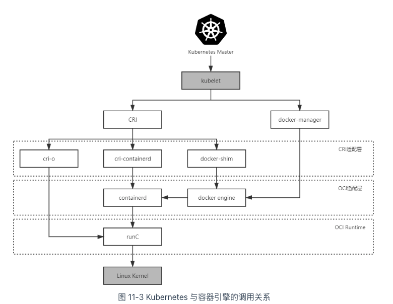
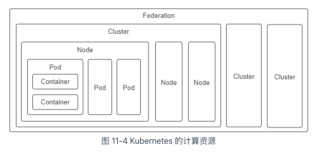
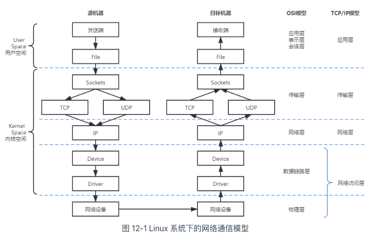
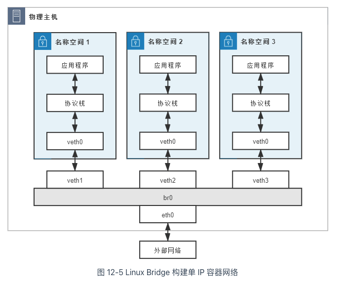
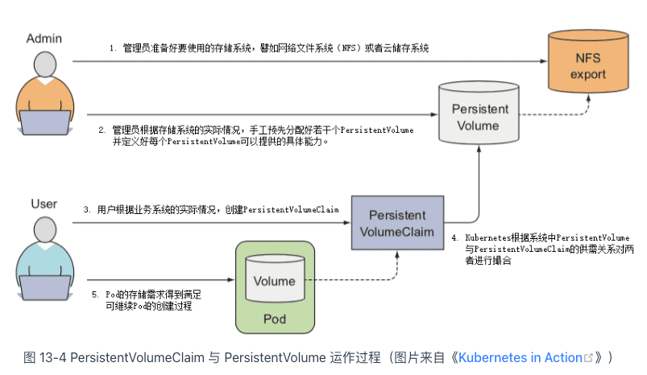
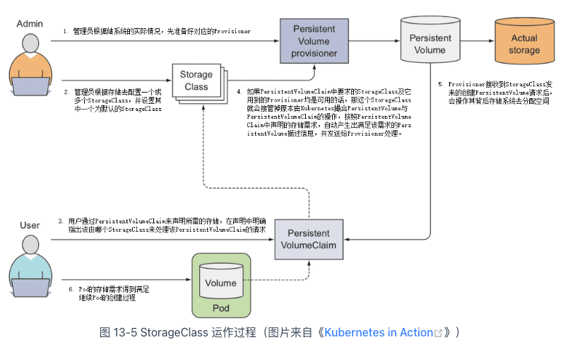
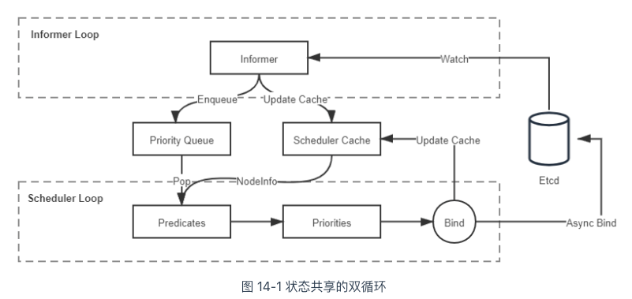

## 凤凰架构小抄（http://icyfenix.cn/）
### 微服务
1. 微服务概念：微服务是一种通过多个小型服务组合来构建单个应用的架构风格，这些服务围绕业务能力而非特定的技术标准来构建。各个服务可以采用不同的编程语言，不同的数据存储技术，运行在不同的进程之中。服务采取轻量级的通信机制和自动化的部署机制实现通信与运维
2. 微服务的九个核心的业务即技术特征
    1. 围绕业务能力构建
    2. 分散治理
    3. 通过服务实现独立自治的组件
    4. 产品化思维：开发人员关注整个产品的全部方面是具有可行性的
    5. 数据去中心化
    6. 强终端弱管道
    7. 容错性设计：接受服务总会出错的现实，要求在微服务设计中，有自动的机制对其依赖的服务能够快速故障检测，在持续出错的时候进行隔离，服务恢复的时候自动联通
    8. 演进式设计：承认服务会被报废淘汰
    9. 基础设施自动化
3. 从SOA时代就存在的问题，如注册发现、跟踪治理、负载均衡、传输通信等
   1. 在微服务时代有各种各样的实现（架构师如果不清楚其中的利弊，很难做选择；之所以由软件实现，是因为硬件构成的基础设施很难跟上应用服务的灵活性）。
   2. 2017年，Kubernetes赢得了“容器编排战争”
   3. spring cloud对比Kubernetes
   4. 对比spring cloud，Kubernetes作为基础设施，以容器作为单位进行管理，粒度较大，对单个远程服务很难做到有效管控
   5. 引入了今天被称为“服务网格”（Service Mesh）的“边车代理模式”（Sidecar Proxy）
4. 无服务时代serverless
   1. 2块主要内容
      1. 后端设施是指数据库、消息队列、日志、存储，等等这一类用于支撑业务逻辑运行，但本身无业务含义的技术组件，这些后端设施都运行在云中，无服务中称其为“后端即服务”（Backend as a Service，BaaS）
      2. 函数是指业务逻辑代码，这里函数的概念与粒度，都已经很接近于程序编码角度的函数了，其区别是无服务中的函数运行在云端，不必考虑算力问题，不必考虑容量规划（从技术角度可以不考虑，从计费的角度你的钱包够不够用还是要掂量一下的），无服务中称其为“函数即服务”（Function as a Service，FaaS）
   2. 适合场景：如不需要交互的离线大规模计算，又譬如多数 Web 资讯类网站、小程序、公共 API 服务、移动应用服务端等都契合于无服务架构所擅长的短链接、无状态、适合事件驱动的交互形式
   3. 不适合场景：信息管理系统、网络游戏等应用，又或者说所有具有业务逻辑复杂，依赖服务端状态，响应速度要求较高，需要长连接等这些特征的应用（函数不会一直以活动状态常驻服务器，请求到了才会开始运行，这导致了函数不便依赖服务端状态，也导致了函数会有冷启动时间，响应的性能不可能太好（目前无服务的冷启动过程大概是在数十到百毫秒级别，对于 Java 这类启动性能差的应用，甚至能到接近秒的级别））
5. 远程服务调用（Remote Procedure Call ，RPC）
   1. 诞生：为了让计算机能够跟调用本地方法一样去调用远程方法
   2. 相关概念 
      1. Caller    :  调用者，代码里的main()
      2. Callee    ： 被调用者，代码里的println()
      3. Call Site ： 调用点，即发生方法调用的指令流位置 
      4. Parameter ： 参数，由Caller传递给Callee的数据，即“hello world” 
      5. Retval    ： 返回值，由Callee传递给Caller的数据。以下代码中如果方法能够正常结束，它是void，如果方法异常完成，它是对应的异常
   ```text
   public static void main(String[] args) {
       System.out.println(“hello world”);
   }
   ```
   3. 执行过程
      1. 传递方法参数：将字符串helloworld的引用地址压栈。 
      2. 确定方法版本：根据println()方法的签名，确定其执行版本。这其实并不是一个简单的过程，不论是编译时静态解析也好，是运行时动态分派也好，总之必须根据某些语言规范中明确定义原则，找到明确的Callee，“明确”是指唯一的一个Callee，或者有严格优先级的多个Callee，譬如不同的重载版本。 
      3. 执行被调方法：从栈中弹出Parameter的值或引用，以此为输入，执行Callee内部的逻辑；这里我们只关心方法如何调用的，不关心方法内部具体是如何执行的。 
      4. 返回执行结果：将Callee的执行结果压栈，并将程序的指令流恢复到Call Site的下一条指令，继续向下执行。
   4. 进程间通信
      1. 管道
      2. 信号
      3. 信号量消息队列
      4. 共享内存
      5. 套接字接口
   5. rpc将细节隐藏，造成了通信是无成本的假象，因而被滥用导致显著降低了分布式系统的性能。实际上存在很多问题
      1. The network is reliable —— 网络是可靠的。 
      2. Latency is zero —— 延迟是不存在的。 
      3. Bandwidth is infinite —— 带宽是无限的。 
      4. The network is secure —— 网络是安全的。 
      5. Topology doesn't change —— 拓扑结构是一成不变的。 
      6. There is one administrator —— 总会有一个管理员。 
      7. Transport cost is zero —— 不必考虑传输成本。 
      8. The network is homogeneous —— 网络是同质化的。
   6. rpc要解决的3个问题（跨系统、跨语言）
      1. 如何表示数据
      2. 如何传递数据
      3. 如何确定方法
6. Rest
   1. 概念
      1. 资源：接受到的内容
      2. 表征：服务器向浏览器返回用户需求的资源
      3. 状态：用户当前所处的状态
      4. 转移：资源A切换为资源B
      5. 统一接口
      6. 超文本驱动
      7. 自描述信息
   2. Rest风格的系统应满足6大原则
      1. 服务端与客户端分离（Client-Server）
      2. 无状态（Stateless）
      3. 可缓存（Cacheability）
      4. 分层系统（Layered System）
      5. 统一接口（Uniform Interface）
      6. 按需代码（Code-On-Demand）
   3. 优点
      1. 降低服务接口的学习成本
      2. 资源天然具有集合与层次结构。以方法为中心抽象的接口，由于方法是动词，逻辑上决定了每个接口都是互相独立的；但以资源为中心抽象的接口，由于资源是名词，天然就可以产生集合与层次结构
      3. REST 绑定于 HTTP 协议。面向资源编程不是必须构筑在 HTTP 之上。HTTP 协议已经有效运作了三十年，其相关的技术基础设施已是千锤百炼，无比成熟。而坏处自然是，当你想去考虑那些 HTTP 不提供的特性时，便会彻底地束手无策。
   4. 不足
      1. 面向资源的编程思想只适合做 CRUD，面向过程、面向对象编程才能处理真正复杂的业务逻辑
      2. REST 与 HTTP 完全绑定，不适合应用于要求高性能传输的场景中
      3. REST 不利于事务支持
      4. REST 没有传输可靠性支持
      5. REST 缺乏对资源进行“部分”和“批量”的处理能力
7. 事务处理（源于数据库系统，延展至事务内存、缓存、消息队列、分布式存储等领域）
   1. 一致性
      1. 当一个服务只使用一个数据源时，通过 A、I、D 来获得一致性是最经典的做法，也是相对容易的。此时，多个并发事务所读写的数据能够被数据源感知是否存在冲突，并发事务的读写在时间线上的最终顺序是由数据源来确定的，这种事务间一致性被称为“内部一致性”
      2. 当一个服务使用到多个不同的数据源，甚至多个不同服务同时涉及多个不同的数据源时，问题就变得相对困难了许多。此时，并发执行甚至是先后执行的多个事务，在时间线上的顺序并不由任何一个数据源来决定，这种涉及多个数据源的事务间一致性被称为“外部一致性”
   2. 本地事务
      1. 原子性和持久性
         1. 原子性保证了事务的多个操作要么都生效要么都不生效，不会存在中间状态
         2. 持久性保证了一旦事务生效，就不会再因为任何原因而导致其修改的内容被撤销或丢失
         3. 数据必须要成功写入磁盘、磁带等持久化存储器后才能拥有持久性，只存储在内存中的数据，一旦遇到应用程序忽然崩溃，或者数据库、操作系统一侧的崩溃，甚至是机器突然断电宕机等情况就会丢失，后文我们将这些意外情况都统称为“崩溃”（Crash）。实现原子性和持久性的最大困难是“写入磁盘”这个操作并不是原子的，不仅有“写入”与“未写入”状态，还客观地存在着“正在写”的中间状态
         4. 异常场景：
            1. 未提交事务，写入后崩溃
            2. 已提交事务，写入前崩溃
         5. 解决方案1：
            1. 日志恢复：为了能够顺利地完成崩溃恢复，在磁盘中写入数据就不能像程序修改内存中变量值那样，直接改变某表某行某列的某个值，而是必须将修改数据这个操作所需的全部信息，包括修改什么数据、数据物理上位于哪个内存页和磁盘块中、从什么值改成什么值，等等，以日志的形式——即仅进行顺序追加的文件写入的形式（这是最高效的写入方式）先记录到磁盘中。只有在日志记录全部都安全落盘，数据库在日志中看到代表事务成功提交的“提交记录”（Commit Record）后，才会根据日志上的信息对真正的数据进行修改，修改完成后，再在日志中加入一条“结束记录”（End Record）表示事务已完成持久化
            2. 日志一旦成功写入 Commit Record，那整个事务就是成功的，即使真正修改数据时崩溃了，重启后根据已经写入磁盘的日志信息恢复现场、继续修改数据即可，这保证了持久性；其次，如果日志没有成功写入 Commit Record 就发生崩溃，那整个事务就是失败的，系统重启后会看到一部分没有 Commit Record 的日志，那将这部分日志标记为回滚状态即可
            3. 缺陷：所有对数据的真实修改都必须发生在事务提交以后，即日志写入了 Commit Record 之后。在此之前，即使磁盘 I/O 有足够空闲、即使某个事务修改的数据量非常庞大，占用了大量的内存缓冲区，无论有何种理由，都决不允许在事务提交之前就修改磁盘上的数据，这一点是 Commit Logging 成立的前提，却对提升数据库的性能十分不利
            4. 改进：提前写入（Write-Ahead）
               1. 增加了另一种被称为 Undo Log 的日志类型，当变动数据写入磁盘前，必须先记录 Undo Log，注明修改了哪个位置的数据、从什么值改成什么值，等等。以便在事务回滚或者崩溃恢复时根据 Undo Log 对提前写入的数据变动进行擦除。Undo Log 现在一般被翻译为“回滚日志”
               2. 此前记录的用于崩溃恢复时重演数据变动的日志就相应被命名为 Redo Log，一般翻译为“重做日志”。
               3. 这种方案分为3个阶段操作（重做阶段和回滚阶段的操作都应该设计为幂等的）
                  1. 分析阶段（Analysis）：该阶段从最后一次检查点（Checkpoint，可理解为在这个点之前所有应该持久化的变动都已安全落盘）开始扫描日志，找出所有没有 End Record 的事务，组成待恢复的事务集合，这个集合至少会包括 Transaction Table 和 Dirty Page Table 两个组成部分。 
                  2. 重做阶段（Redo）：该阶段依据分析阶段中产生的待恢复的事务集合来重演历史（Repeat History），具体操作为：找出所有包含 Commit Record 的日志，将这些日志修改的数据写入磁盘，写入完成后在日志中增加一条 End Record，然后移除出待恢复事务集合。 
                  3. 回滚阶段（Undo）：该阶段处理经过分析、重做阶段后剩余的恢复事务集合，此时剩下的都是需要回滚的事务，它们被称为 Loser，根据 Undo Log 中的信息，将已经提前写入磁盘的信息重新改写回去，以达到回滚这些 Loser 事务的目的。
         6. 解决方案2：Shadow Paging（copy on write思想，事务并发能力有限）
      2. 隔离性
         1. 锁
            1. 写锁
            2. 读锁
            3. 范围锁：对于某个范围直接加排他锁，在这个范围内的数据不能被写入
         2. 级别（从高到低）
            1. 串行化
            2. 可重复读：弱化的地方在于幻读问题（在事务执行过程中，两个完全相同的范围查询得到了不同的结果集）
            3. 读已提交：对事务涉及的数据加的写锁会一直持续到事务结束，但加的读锁在查询操作完成后就马上会释放（不可重复读问题（Non-Repeatable Reads），它是指在事务执行过程中，对同一行数据的两次查询得到了不同的结果）
            4. 读未提交：对事务涉及的数据只加写锁，会一直持续到事务结束，但完全不加读锁（脏读问题（Dirty Reads），它是指在事务执行过程中，一个事务读取到了另一个事务未提交的数据）
            5. 其实不同隔离级别以及幻读、不可重复读、脏读等问题都只是表面现象，是各种锁在不同加锁时间上组合应用所产生的结果，以锁为手段来实现隔离性才是数据库表现出不同隔离级别的根本原因
            6. 注意：这里是数据库理论，实现可能不一致
         3. “多版本并发控制”（Multi-Version Concurrency Control，MVCC）
            1. MVCC 的基本思路是对数据库的任何修改都不会直接覆盖之前的数据，而是产生一个新版副本与老版本共存，以此达到读取时可以完全不加锁的目的
            2. 可以将版本理解为数据库中每一行记录都存在两个看不见的字段：CREATE_VERSION 和 DELETE_VERSION，这两个字段记录的值都是事务 ID，事务 ID 是一个全局严格递增的数值，然后根据以下规则写入数据。 
               1. 插入数据时：CREATE_VERSION 记录插入数据的事务 ID，DELETE_VERSION 为空。 
               2. 删除数据时：DELETE_VERSION 记录删除数据的事务 ID，CREATE_VERSION 为空。 
               3. 修改数据时：将修改数据视为“删除旧数据，插入新数据”的组合，即先将原有数据复制一份，原有数据的 DELETE_VERSION 记录修改数据的事务 ID，CREATE_VERSION 为空。复制出来的新数据的 CREATE_VERSION 记录修改数据的事务 ID，DELETE_VERSION 为空。 
            3. 此时，如有另外一个事务要读取这些发生了变化的数据，将根据隔离级别来决定到底应该读取哪个版本的数据。 
               1. 隔离级别是可重复读：总是读取 CREATE_VERSION 小于或等于当前事务 ID 的记录，在这个前提下，如果数据仍有多个版本，则取最新（事务 ID 最大）的。 
               2. 隔离级别是读已提交：总是取最新的版本即可，即最近被 Commit 的那个版本的数据记录
         4. 两个隔离级别都没有必要用到 MVCC，因为读未提交直接修改原始数据即可，其他事务查看数据的时候立刻可以看到，根本无须版本字段。可串行化本来的语义就是要阻塞其他事务的读取操作，而 MVCC 是做读取时无锁优化的，自然就不会放到一起用。
         5. MVCC 是只针对“读+写”场景的优化，如果是两个事务同时修改数据，即“写+写”的情况，那就没有多少优化的空间了，此时加锁几乎是唯一可行的解决方案。没有必要迷信什么乐观锁要比悲观锁更快的说法，这纯粹看竞争的剧烈程度，如果竞争剧烈的话，乐观锁反而更慢。
   3. 全局事务（一种在分布式环境中仍追求强一致性的事务处理方案，这里指单服务多数据源的场合）
      1. 1991年，提出XA事务
         1. 其核心内容是定义了全局的事务管理器（Transaction Manager，用于协调全局事务）和局部的资源管理器（Resource Manager，用于驱动本地事务）之间的通信接口。XA 接口是双向的，能在一个事务管理器和多个资源管理器（Resource Manager）之间形成通信桥梁，通过协调多个数据源的一致动作，实现全局事务的统一提交或者统一回滚
         2. 过程：两段式提交
            1. 准备阶段：又叫作投票阶段，在这一阶段，协调者询问事务的所有参与者是否准备好提交，参与者如果已经准备好提交则回复 Prepared，否则回复 Non-Prepared。对于数据库来说，准备操作是在重做日志中记录全部事务提交操作所要做的内容，它与本地事务中真正提交的区别只是暂不写入最后一条 Commit Record 而已，这意味着在做完数据持久化后并不立即释放隔离性，即仍继续持有锁，维持数据对其他非事务内观察者的隔离状态。
            2. 提交（执行）阶段：协调者如果在上一阶段收到所有事务参与者回复的 Prepared 消息，则先自己在本地持久化事务状态为 Commit，在此操作完成后向所有参与者发送 Commit 指令，所有参与者立即执行提交操作；否则，任意一个参与者回复了 Non-Prepared 消息，或任意一个参与者超时未回复，协调者将自己的事务状态持久化为 Abort 之后，向所有参与者发送 Abort 指令，参与者立即执行回滚操作
         3. 前提条件
            1. 必须假设网络在提交阶段的短时间内是可靠的，即提交阶段不会丢失消息。同时也假设网络通信在全过程都不会出现误差，即可以丢失消息，但不会传递错误的消息（投票阶段失败了可以补救（回滚），而提交阶段失败了无法补救（不再改变提交或回滚的结果，只能等崩溃的节点重新恢复），因而此阶段耗时应尽可能短，这也是为了尽量控制网络风险的考虑）
            2. 必须假设因为网络分区、机器崩溃或者其他原因而导致失联的节点最终能够恢复，不会永久性地处于失联状态。由于在准备阶段已经写入了完整的重做日志，所以当失联机器一旦恢复，就能够从日志中找出已准备妥当但并未提交的事务数据，并向协调者查询该事务的状态，确定下一步应该进行提交还是回滚操作。
         4. 协调者和参与者都是数据库实现，协调者一般是在参与者之间选举产生的
         5. 缺陷
            1. 协调者单点问题
            2. 性能问题
            3. 一致性风险（网络和恢复必须可靠）
      2. 3段式提交
         1. 过程
            1. CanCommit：是一个询问阶段，协调者让每个参与的数据库根据自身状态，评估该事务是否有可能顺利完成
            2. PreCommit：写入日志，锁定资源
            3. DoCommit：提交/回滚
         2. 缺陷
            1. 三段式因为多了一次询问，还要稍微更差一些
            2. 由于事务失败回滚概率变小的原因，在三段式提交中，如果在 PreCommit 阶段之后发生了协调者宕机，即参与者没有能等到 DoCommit 的消息的话，默认的操作策略将是提交事务而不是回滚事务或者持续等待，这就相当于避免了协调者单点问题的风险。但是它对一致性风险问题并未有任何改进，在这方面它面临的风险甚至反而是略有增加了的。譬如，进入 PreCommit 阶段之后，协调者发出的指令不是 Ack 而是 Abort，而此时因网络问题，有部分参与者直至超时都未能收到协调者的 Abort 指令的话，这些参与者将会错误地提交事务，这就产生了不同参与者之间数据不一致的问题
   4. 共享事务（Share Transaction，是指多个服务共用同一个数据源，几乎不考虑）
   5. 分布式事务（多个服务同时访问多个数据源的事务处理机制）
      1. CAP理论：一个分布式的系统中，涉及共享数据问题时，以下三个特性最多只能同时满足其中两个
         1. 一致性（Consistency）：代表数据在任何时刻、任何分布式节点中所看到的都是符合预期的
         2. 可用性（Availability）：代表系统不间断地提供服务的能力，理解可用性要先理解与其密切相关两个指标：可靠性（Reliability）和可维护性（Serviceability）。可靠性使用平均无故障时间（Mean Time Between Failure，MTBF）来度量；可维护性使用平均可修复时间（Mean Time To Repair，MTTR）来度量。可用性衡量系统可以正常使用的时间与总时间之比，其表征为：A=MTBF/（MTBF+MTTR），即可用性是由可靠性和可维护性计算得出的比例值，譬如 99.9999%可用，即代表平均年故障修复时间为 32 秒
         3. 分区容忍性（Partition Tolerance）：代表分布式环境中部分节点因网络原因而彼此失联后，即与其他节点形成“网络分区”时，系统仍能正确地提供服务的能力
      2. 可靠事件队列（消息表+重试+幂等，缺少隔离性）
         1. Base理论：基本可用+柔性事务+最终一致性
      3. TCC事务
         1. Try：尝试执行阶段，完成所有业务可执行性的检查（保障一致性），并且预留好全部需用到的业务资源（保障隔离性）。 
         2. Confirm：确认执行阶段，不进行任何业务检查，直接使用 Try 阶段准备的资源来完成业务处理。Confirm 阶段可能会重复执行，因此本阶段所执行的操作需要具备幂等性。 
         3. Cancel：取消执行阶段，释放 Try 阶段预留的业务资源。Cancel 阶段可能会重复执行，也需要满足幂等性。
         4. 优缺点：在业务执行时只操作预留资源，几乎不会涉及锁和资源的争用，具有很高的性能潜力；同时带来了更高的开发成本和业务侵入性，意味着有更高的开发成本和更换事务实现方案的替换成本
      4. SAGA事务
         1. 大事务拆分若干个小事务，将整个分布式事务 T 分解为 n 个子事务，每个子事务都应该是或者能被视为是原子行为。如果分布式事务能够正常提交，其对数据的影响（最终一致性）应与连续按顺序成功提交 Ti等价
         2. 为每一个子事务设计对应的补偿动作，命名为 C1，C2，…，Ci，…，Cn。Ti与 Ci必须满足以下条件：
            1. Ti与 Ci都具备幂等性。
            2. Ti与 Ci满足交换律（Commutative），即先执行 Ti还是先执行 Ci，其效果都是一样的。
            3. Ci必须能成功提交，即不考虑 Ci本身提交失败被回滚的情形，如出现就必须持续重试直至成功，或者要人工介入。
         3. 如果 T1到 Tn均成功提交，那事务顺利完成，否则，要采取以下两种恢复策略之一：
            1. 正向恢复（Forward Recovery）：如果 Ti事务提交失败，则一直对 Ti进行重试，直至成功为止（最大努力交付）。这种恢复方式不需要补偿，适用于事务最终都要成功的场景，譬如在别人的银行账号中扣了款，就一定要给别人发货。正向恢复的执行模式为：T1，T2，…，Ti（失败），Ti（重试）…，Ti+1，…，Tn。
            2. 反向恢复（Backward Recovery）：如果 Ti事务提交失败，则一直执行 Ci对 Ti进行补偿，直至成功为止（最大努力交付）。这里要求 Ci必须（在持续重试后）执行成功。反向恢复的执行模式为：T1，T2，…，Ti（失败），Ci（补偿），…，C2，C1。
         4. SAGA 必须保证所有子事务都得以提交或者补偿，但 SAGA 系统本身也有可能会崩溃，所以它必须设计成与数据库类似的日志机制（被称为 SAGA Log）以保证系统恢复后可以追踪到子事务的执行情况，譬如执行至哪一步或者补偿至哪一步了
      5. AT事务
         1. 原理：在业务数据提交时自动拦截所有 SQL，将 SQL 对数据修改前、修改后的结果分别保存快照，生成行锁，通过本地事务一起提交到操作的数据源中，相当于自动记录了重做和回滚日志。如果分布式事务成功提交，那后续清理每个数据源中对应的日志数据即可；如果分布式事务需要回滚，就根据日志数据自动产生用于补偿的“逆向 SQL”。基于这种补偿方式，分布式事务中所涉及的每一个数据源都可以单独提交，然后立刻释放锁和资源
         2. 优点：比起 2PC 极大地提升了系统的吞吐量水平
         3. 缺点
            1. 大幅度地牺牲了隔离性，甚至直接影响到了原子性。因为在缺乏隔离性的前提下，以补偿代替回滚并不一定是总能成功的（脏写）
            2. 增加一个“全局锁”（Global Lock）的机制来实现写隔离，要求本地事务提交之前，一定要先拿到针对修改记录的全局锁后才允许提交，没有获得全局锁之前就必须一直等待，这种设计以牺牲一定性能为代价，避免了有两个分布式事务中包含的本地事务修改了同一个数据，从而避免脏写
            3. 在读隔离方面，AT 事务默认的隔离级别是读未提交（Read Uncommitted），这意味着可能产生脏读（Dirty Read）
8. 透明多级分流系统
   1. 不同的设施、部件在系统中有各自不同的价值
      1. 有一些部件位于客户端或网络的边缘，能够迅速响应用户的请求，避免给后方的 I/O 与 CPU 带来压力，典型如本地缓存、内容分发网络、反向代理等
      2. 有一些部件的处理能力能够线性拓展，易于伸缩，可以使用较小的代价堆叠机器来获得与用户数量相匹配的并发性能，应尽量作为业务逻辑的主要载体，典型如集群中能够自动扩缩的服务节点。
      3. 有一些部件稳定服务对系统运行有全局性的影响，要时刻保持着容错备份，维护着高可用性，典型如服务注册中心、配置中心。
      4. 有一些设施是天生的单点部件，只能依靠升级机器本身的网络、存储和运算性能来提升处理能力，如位于系统入口的路由、网关或者负载均衡器（它们都可以做集群，但一次网络请求中无可避免至少有一个是单点的部件）、位于请求调用链末端的传统关系数据库等，都是典型的容易形成单点部件。
   2. 系统进行流量规划时，我们应该充分理解这些部件的价值差异，有两条简单、普适的原则能指导我们进行设计
      1. 尽可能减少单点部件，如果某些单点是无可避免的，则应尽最大限度减少到达单点部件的流量
      2. 在实际构建系统时，你应当在有明确需求、真正必要的时候再去考虑部署它们。不是每一个系统都要追求高并发、高可用的，根据系统的用户量、峰值流量和团队本身的技术与运维能力来考虑如何部署这些设施才是合理的做法，在能满足需求的前提下，最简单的系统就是最好的系统
   3. 客户端缓存
      1. 强制缓存：假设在某个时点到来以前，譬如收到响应后的 10 分钟内，资源的内容和状态一定不会被改变，因此客户端可以无须经过任何请求，在该时点前一直持有和使用该资源的本地缓存副本
         1. 场景：浏览器的地址输入、页面链接跳转、新开窗口、前进和后退中均可生效，但在用户主动刷新页面时应当自动失效
         2. Header :Expires 是 HTTP/1.0 协议中开始提供的 Header，后面跟随一个截至时间参数。当服务器返回某个资源时带有该 Header 的话，意味着服务器承诺截止时间之前资源不会发生变动，浏览器可直接缓存该数据，不再重新发请求
            1. 受限于客户端的本地时间
            2. 无法处理涉及到用户身份的私有资源，譬如，某些资源被登录用户缓存在自己的浏览器上是合理的，但如果被代理服务器或者内容分发网络缓存起来，则可能被其他未认证的用户所获取
            3. 无法描述“不缓存”的语义.譬如，浏览器为了提高性能，往往会自动在当次会话中缓存某些 MIME 类型的资源，在 HTTP/1.0 的服务器中就缺乏手段强制浏览器不允许缓存某个资源
         3. Header: Cache-Control 是 HTTP/1.1 协议中定义的强制缓存 Header。优先级比Expires更高，定义了一些参数，并允许自由扩展
      2. 协商缓存：一种基于变化检测的缓存机制，在一致性上会有比强制缓存更好的表现，但需要一次变化检测的交互开销，性能上就会略差一些，这种基于检测的缓存机制，通常被称为“协商缓存”。
   4. 域名解析（例如：www.icyfenix.com.cn）
      1. 客户端先检查本地的 DNS 缓存，查看是否存在并且是存活着的该域名的地址记录。DNS 是以存活时间（Time to Live，TTL）来衡量缓存的有效情况的，所以，如果某个域名改变了 IP 地址，DNS 服务器并没有任何机制去通知缓存了该地址的机器去更新或者失效掉缓存，只能依靠 TTL 超期后的重新获取来保证一致性
      2. 客户端将地址发送给本机操作系统中配置的本地 DNS（Local DNS），这个本地 DNS 服务器可以由用户手工设置，也可以在 DHCP 分配时或者在拨号时从 PPP 服务器中自动获取到
      3. 本地 DNS 收到查询请求后，会按照“是否有www.icyfenix.com.cn的权威服务器”→“是否有icyfenix.com.cn的权威服务器”→“是否有com.cn的权威服务器”→“是否有cn的权威服务器”的顺序，依次查询自己的地址记录，如果都没有查询到，就会一直找到最后点号代表的根域名服务器为止
         1. 权威域名服务器（Authoritative DNS）：是指负责翻译特定域名的 DNS 服务器，“权威”意味着这个域名应该翻译出怎样的结果是由它来决定的。DNS 翻译域名时无需像查电话本一样刻板地一对一翻译，根据来访机器、网络链路、服务内容等各种信息，可以玩出很多花样，权威 DNS 的灵活应用，在后面的内容分发网络、服务发现等章节都还会有所涉及。
         2. 根域名服务器（Root DNS）：是指固定的、无需查询的顶级域名（Top-Level Domain）服务器，可以默认为它们已内置在操作系统代码之中
      4. 现在假设本地 DNS 是全新的，上面不存在任何域名的权威服务器记录，所以当 DNS 查询请求按步骤 3 的顺序一直查到根域名服务器之后，它将会得到“cn的权威服务器”的地址记录，然后通过“cn的权威服务器”，得到“com.cn的权威服务器”的地址记录，以此类推，最后找到能够解释www.icyfenix.com.cn的权威服务器地址
      5. 通过“www.icyfenix.com.cn的权威服务器”，查询www.icyfenix.com.cn的地址记录，地址记录并不一定就是指 IP 地址
      6. 缺点1：各级服务器均无缓存时，每个域名都必须递归多次才能查询到结果，显著影响传输的响应速度。专门有一种被称为“DNS 预取”（DNS Prefetching）的前端优化手段用来避免这类问题
      7. 缺点2：DNS 的分级查询意味着每一级都有可能受到中间人攻击的威胁，产生被劫持的风险（甚至不少地区的运营商自己就会主动进行劫持，专门返回一个错的 IP，通过在这个 IP 上代理用户请求，以便给特定类型的资源（主要是 HTML）注入广告，以此牟利）
      8. 最近几年出现了另一种新的 DNS 工作模式：HTTPDNS（也称为 DNS over HTTPS，DoH）。它将原本的 DNS 解析服务开放为一个基于 HTTPS 协议的查询服务，替代基于 UDP 传输协议的 DNS 域名解析，通过程序代替操作系统直接从权威 DNS 或者可靠的 Local DNS 获取解析数据，从而绕过传统 Local DNS
   5. 传输链路
      1. 连接数优化
      2. 传输压缩
      3. 快速UDP网络连接：HTTP 是应用层协议而不是传输层协议，它的设计原本并不应该过多地考虑底层的传输细节，从职责上讲，持久连接、多路复用、分块编码这些能力，已经或多或少超过了应用层的范畴。Http/3使用UDP替TCP
   6. 内容分发网络（Content Distribution Network）
      1. 抛却其他影响服务质量的因素，仅从网络传输的角度看，一个互联网系统的速度取决于以下四点因素（除了第二个只能通过换一个更好的宽带才能解决之外，其余三个都能通过内容分发网络来显著改善）： 
         1. 网站服务器接入网络运营商的链路所能提供的出口带宽。 
         2. 用户客户端接入网络运营商的链路所能提供的入口带宽。 
         3. 从网站到用户之间经过的不同运营商之间互联节点的带宽，一般来说两个运营商之间只有固定的若干个点是互通的，所有跨运营商之间的交互都要经过这些点。 
         4. 从网站到用户之间的物理链路传输时延。爱打游戏的同学应该都清楚，延迟（Ping 值）比带宽更重要。
      2. 内容分发网络的工作过程，主要涉及路由解析、内容分发、负载均衡和所能支持的 CDN 应用内容四个方面
         1. 路由解析
            1. 架设好“icyfenix.cn”的服务器后，将服务器的 IP 地址在你的 CDN 服务商上注册为“源站”，注册后你会得到一个 CNAME，即本例中的“icyfenix.cn.cdn.dnsv1.com.”
            2. 将得到的 CNAME 在你购买域名的 DNS 服务商上注册为一条 CNAME 记录。
            3. 当第一位用户来访你的站点时，将首先发生一次未命中缓存的 DNS 查询，域名服务商解析出 CNAME 后，返回给本地 DNS，至此之后链路解析的主导权就开始由内容分发网络的调度服务接管了。
            4. 本地 DNS 查询 CNAME 时，由于能解析该 CNAME 的权威服务器只有 CDN 服务商所架设的权威 DNS，这个 DNS 服务将根据一定的均衡策略和参数，如拓扑结构、容量、时延等，在全国各地能提供服务的 CDN 缓存节点中挑选一个最适合的，将它的 IP 代替源站的 IP 地址，返回给本地 DNS
            5. 浏览器从本地 DNS 拿到 IP 地址，将该 IP 当作源站服务器来进行访问，此时该 IP 的 CDN 节点上可能有，也可能没有缓存过源站的资源，这点将在稍后“内容分发”小节讨论。
            6. 经过内容分发后的 CDN 节点，就有能力代替源站向用户提供所请求的资源。
         2. 内容分发(DNS 服务器的协助下，无论是对用户还是服务器，内容分发网络都可以是完全透明的，在两者都不知情的情况下，由 CDN 的缓存节点接管了用户向服务器发出的资源请)
            1. 如何获取源站资源(内容分发)
               1. 主动分发：分发由源站主动发起，将内容从源站或者其他资源库推送到用户边缘的各个 CDN 缓存节点上。这个推送的操作没有什么业界标准可循，可以采用任何传输方式（HTTP、FTP、P2P，等等）、任何推送策略（满足特定条件、定时、人工，等等）、任何推送时间，只要与后面说的更新策略相匹配即可。由于主动分发通常需要源站、CDN 服务双方提供程序 API 接口层面的配合，所以它对源站并不是透明的，只对用户一侧单向透明。主动分发一般用于网站要预载大量资源的场景
               2. 被动回源：被动回源由用户访问所触发全自动、双向透明的资源缓存过程。当某个资源首次被用户请求的时候，CDN 缓存节点发现自己没有该资源，就会实时从源站中获取，这时资源的响应时间可粗略认为是资源从源站到 CDN 缓存节点的时间，再加上资源从 CDN 发送到用户的时间之和。因此，被动回源的首次访问通常是比较慢的（但由于 CDN 的网络条件一般远高于普通用户，并不一定就会比用户直接访问源站更慢），不适合应用于数据量较大的资源
            2. 如何管理（更新）资源：同样没有统一的标准可言，最常见的做法是超时被动失效与手工主动失效相结合。超时失效是指给予缓存资源一定的生存期，超过了生存期就在下次请求时重新被动回源一次。而手工失效是指 CDN 服务商一般会提供给程序调用来失效缓存的接口，在网站更新时，由持续集成的流水线自动调用该接口来实现缓存更新
      3. CDN应用（举例）
         1. 加速静态资源：这是 CDN 本职工作。 
         2. 安全防御：CDN 在广义上可以视作网站的堡垒机，源站只对 CDN 提供服务，由 CDN 来对外界其他用户服务，这样恶意攻击者就不容易直接威胁源站。CDN 对某些攻击手段的防御，如对DDoS 攻击的防御尤其有效。但需注意，将安全都寄托在 CDN 上本身是不安全的，一旦源站真实 IP 被泄漏，就会面临很高的风险。 
         3. 协议升级：不少 CDN 提供商都同时对接（代售 CA 的）SSL 证书服务，可以实现源站是 HTTP 协议的，而对外开放的网站是基于 HTTPS 的。同理，可以实现源站到 CDN 是 HTTP/1.x 协议，CDN 提供的外部服务是 HTTP/2 或 HTTP/3 协议、实现源站是基于 IPv4 网络的，CDN 提供的外部服务支持 IPv6 网络，等等。 
         4. 状态缓存：第一节介绍客户端缓存时简要提到了状态缓存，CDN 不仅可以缓存源站的资源，还可以缓存源站的状态，譬如源站的 301/302 转向就可以缓存起来让客户端直接跳转、还可以通过 CDN 开启HSTS、可以通过 CDN 进行OCSP 装订加速 SSL 证书访问，等等。有一些情况下甚至可以配置 CDN 对任意状态码（譬如 404）进行一定时间的缓存，以减轻源站压力，但这个操作应当慎重，在网站状态发生改变时去及时刷新缓存。 
         5. 修改资源：CDN 可以在返回资源给用户的时候修改它的任何内容，以实现不同的目的。譬如，可以对源站未压缩的资源自动压缩并修改 Content-Encoding，以节省用户的网络带宽消耗、可以对源站未启用客户端缓存的内容加上缓存 Header，自动启用客户端缓存，可以修改CORS的相关 Header，将源站不支持跨域的资源提供跨域能力，等等。 
         6. 访问控制：CDN 可以实现 IP 黑/白名单功能，根据不同的来访 IP 提供不同的响应结果，根据 IP 的访问流量来实现 QoS 控制、根据 HTTP 的 Referer 来实现防盗链，等等。 
         7. 注入功能：CDN 可以在不修改源站代码的前提下，为源站注入各种功能，图 4-7 是国际 CDN 巨头 CloudFlare 提供的 Google Analytics、PACE、Hardenize 等第三方应用，在 CDN 下均能做到无须修改源站任何代码即可使用。
         8. 绕过某些“不存在的”网络措施，这也是在国内申请 CDN 也必须实名备案的原因，就不细说了
   7. 负载均衡（Load Balancing） 调度后方的多台机器，以统一的接口对外提供服务，承担此职责的技术组件被称为“负载均衡”。
      1. 四层负载均衡（性能高，在前面，OSI 七层模型中第四层传输层）
         1. 数据链路负载均衡
            1. 工作过程
            2. 二层负载均衡器在转发请求过程中只修改了帧的 MAC 目标地址，不涉及更上层协议（没有修改 Payload 的数据），所以在更上层（第三层）看来，所有数据都是未曾被改变过的
            3. 第三层的数据包，即 IP 数据包中包含了源（客户端）和目标（均衡器）的 IP 地址，只有真实服务器保证自己的 IP 地址与数据包中的目标 IP 地址一致，这个数据包才能被正确处理。因此，使用这种负载均衡模式时，需要把真实物理服务器集群所有机器的虚拟 IP 地址
            4. 上述只有请求经过负载均衡器，而服务的响应无须从负载均衡器原路返回的工作模式，整个请求、转发、响应的链路形成一个“三角关系”，所以这种负载均衡模式也常被很形象地称为“三角传输模式”（Direct Server Return，DSR），也有叫“单臂模式”（Single Legged Mode）或者“直接路由”（Direct Routing）
            5. 总结：虽然数据链路层负载均衡效率很高，但它并不能适用于所有的场合，除了那些需要感知应用层协议信息的负载均衡场景它无法胜任外（所有的四层负载均衡器都无法胜任，将在后续介绍七层均衡器时一并解释），它在网络一侧受到的约束也很大。二层负载均衡器直接改写目标 MAC 地址的工作原理决定了它与真实的服务器的通信必须是二层可达的，通俗地说就是必须位于同一个子网当中，无法跨 VLAN。优势（效率高）和劣势（不能跨子网）共同决定了数据链路层负载均衡最适合用来做数据中心的第一级均衡设备，用来连接其他的下级负载均衡器。
         2. 网络层负载均衡：IP隧道模式（又称为NAT模式），流量压力比较大的时候，NAT 模式的负载均衡会带来较大的性能损失，但由于 IP 隧道工作在网络层，所以可以跨越 VLAN；
      2. 七层负载均衡（功能强，在后面，OSI 七层模型中第七层应用层）：应用层代理
      3. 均衡策略
         1. 轮循
         2. 权重轮循
         3. 随机轮循
         4. 权重随机轮循
         5. 一致性哈希
         6. 响应速度
         7. 最少连接
      4. 从实现角度来看，负载均衡器的实现分为“软件均衡器”和“硬件均衡器”两类。
         1. 软件均衡器分为直接建设在操作系统内核的均衡器和应用程序形式的均衡器
            1. 前者的代表是 LVS（Linux Virtual Server），因为无须在内核空间和应用空间中来回复制数据包，性能会更好
            2. 后者的代表有 Nginx、HAProxy、KeepAlived 等，优势是选择广泛，使用方便，功能不受限于内核版本
         2. 硬件均衡器，往往会直接采用应用专用集成电路（Application Specific Integrated Circuit，ASIC）来实现，有专用处理芯片的支持，避免操作系统层面的损耗，得以达到最高的性能。这类的代表就是著名的 F5 和 A10 公司的负载均衡产品。
   8. 服务端缓存
      1. 风险
         1. 从开发角度来说，引入缓存会提高系统复杂度，因为你要考虑缓存的失效、更新、一致性等问题
         2. 从运维角度来说，缓存会掩盖掉一些缺陷，让问题在更久的时间以后，出现在距离发生现场更远的位置上
         3. 从安全角度来说，缓存可能泄漏某些保密数据，也是容易受到攻击的薄弱点
      2. 收益
         1. 为缓解 CPU 压力而做缓存：譬如把方法运行结果存储起来、把原本要实时计算的内容提前算好、把一些公用的数据进行复用，这可以节省 CPU 算力，顺带提升响应性能
         2. 为缓解 I/O 压力而做缓存：譬如把原本对网络、磁盘等较慢介质的读写访问变为对内存等较快介质的访问，将原本对单点部件（如数据库）的读写访问变为到可扩缩部件（如缓存中间件）的访问，顺带提升响应性能
         3. 备注：缓存虽然是典型以空间换时间来提升性能的手段，但它的出发点是缓解 CPU 和 I/O 资源在峰值流量下的压力，“顺带”而非“专门”地提升响应性能。这里的言外之意是如果可以通过增强 CPU、I/O 本身的性能（譬如扩展服务器的数量）来满足需要的话，那升级硬件往往是更好的解决方案，即使需要一些额外的投入成本，也通常要优于引入缓存后可能带来的风险。
      3. 缓存属性
         1. 吞吐量：缓存的吞吐量使用 OPS 值（每秒操作数，Operations per Second，ops/s）来衡量，反映了对缓存进行并发读、写操作的效率，即缓存本身的工作效率高低。
         2. 命中率：缓存的命中率即成功从缓存中返回结果次数与总请求次数的比值，反映了引入缓存的价值高低，命中率越低，引入缓存的收益越小，价值越低
         3. 扩展功能：缓存除了基本读写功能外，还提供哪些额外的管理功能，譬如最大容量、失效时间、失效事件、命中率统计，等等
         4. 分布式支持：缓存可分为“进程内缓存”和“分布式缓存”两大类，前者只为节点本身提供服务，无网络访问操作，速度快但缓存的数据不能在各个服务节点中共享，后者则相反
      4. 淘汰策略
         1. FIFO（First In First Out）：优先淘汰最早进入被缓存的数据
         2. LRU（Least Recent Used）：优先淘汰最久未被使用访问过的数据。LRU 通常会采用 HashMap 加 LinkedList 双重结构（如 LinkedHashMap）来实现，以 HashMap 来提供访问接口，保证常量时间复杂度的读取性能，以 LinkedList 的链表元素顺序来表示数据的时间顺序，每次缓存命中时把返回对象调整到 LinkedList 开头，每次缓存淘汰时从链表末端开始清理数据
         3. LFU（Least Frequently Used）：优先淘汰最不经常使用的数据
      5. 扩展功能
         1. 加载器
         2. 淘汰策略
         3. 失效策略
         4. 时间通知
         5. 并发级别
         6. 容量控制
         7. 引用方式
         8. 统计信息
         9. 持久化
      6. 分布式缓存
         1. 复制式缓存：复制式缓存可以看作是“能够支持分布式的进程内缓存”，它的工作原理与 Session 复制类似。缓存中所有数据在分布式集群的每个节点里面都存在有一份副本，读取数据时无须网络访问，直接从当前节点的进程内存中返回，理论上可以做到与进程内缓存一样高的读取性能；当数据发生变化时，就必须遵循复制协议，将变更同步到集群的每个节点中，复制性能随着节点的增加呈现平方级下降，变更数据的代价十分高昂
         2. 集中式缓存：集中式缓存是目前分布式缓存的主流形式，集中式缓存的读、写都需要网络访问，其好处是不会随着集群节点数量的增加而产生额外的负担，其坏处自然是读、写都不再可能达到进程内缓存那样的高性能
         3. 分布式缓存与进程内缓存各有所长，也有各有局限，它们是互补而非竞争的关系，如有需要，完全可以同时把进程内缓存和分布式缓存互相搭配，构成透明多级缓存（Transparent Multilevel Cache，TMC）
            1. TMC代码侵入性较大，需要由开发者承担多次查询、多次回填的工作，也不便于管理，如超时、刷新等策略都要设置多遍，数据更新更是麻烦，很容易会出现各个节点的一级缓存、以及二级缓存里数据互相不一致的问题
            2. 一种常见的设计原则是变更以分布式缓存中的数据为准，访问以进程内缓存的数据优先
            3. 大致做法是当数据发生变动时，在集群内发送推送通知（简单点的话可采用 Redis 的 PUB/SUB，求严谨的话引入 ZooKeeper 或 Etcd 来处理），让各个节点的一级缓存自动失效掉相应数据。当访问缓存时，提供统一封装好的一、二级缓存联合查询接口，接口外部是只查询一次，接口内部自动实现优先查询一级缓存，未获取到数据再自动查询二级缓存的逻辑
      7. 缓存风险
         1. 缓存穿透(查询不存在数据的现象)
            1. 对于业务逻辑本身就不能避免的缓存穿透，可以约定在一定时间内对返回为空的 Key 值依然进行缓存（注意是正常返回但是结果为空，不应把抛异常的也当作空值来缓存了），使得在一段时间内缓存最多被穿透一次。如果后续业务在数据库中对该 Key 值插入了新记录，那应当在插入之后主动清理掉缓存的 Key 值。如果业务时效性允许的话，也可以将对缓存设置一个较短的超时时间来自动处理
            2. 对于恶意攻击导致的缓存穿透，通常会在缓存之前设置一个布隆过滤器来解决
         2. 缓存击穿(缓存是小导致流量打到数据库)
            1. 加锁同步，以请求该数据的 Key 值为锁，使得只有第一个请求可以流入到真实的数据源中，其他线程采取阻塞或重试策略。如果是进程内缓存出现问题，施加普通互斥锁即可，如果是分布式缓存中出现的问题，就施加分布式锁，这样数据源就不会同时收到大量针对同一个数据的请求了
            2. 热点数据由代码来手动管理，缓存击穿是仅针对热点数据被自动失效才引发的问题，对于这类数据，可以直接由开发者通过代码来有计划地完成更新、失效，避免由缓存的策略自动管理
         3. 缓存雪崩(大批量数据短时间内失效)
            1. 提升缓存系统可用性，建设分布式缓存的集群
            2. 启用透明多级缓存，各个服务节点一级缓存中的数据通常会具有不一样的加载时间，也就分散了它们的过期时间
            3. 将缓存的生存期从固定时间改为一个时间段内的随机时间，譬如原本是一个小时过期，那可以缓存不同数据时，设置生存期为 55 分钟到 65 分钟之间的某个随机时间
         4. 缓存污染(缓存中的数据与真实数据源中的数据不一致)
9. 架构安全性
   1. 认证（Authentication）：系统如何正确分辨出操作用户的真实身份？ 
      1. web认证
         1. 通信信道
         2. 通信协议
            1. Basic：账号密码通过base64编码
            2. Digest：加盐之后再md5/SHA取摘要
            3. Bearer：基于OAuth2规范
            4. HOBA：基于签名证书的认证方案，基于数字证书的信任关系主要有两类模型
               1. 采用 CA（Certification Authority）层次结构的模型，由 CA 中心签发证书
               2. 以 IETF 的 Token Binding 协议为基础的 OBC（Origin Bound Certificate）自签名证书模型
            5. 其他实现，略
         3. 通信内容
            1. WebAuthn认证
               1. 注册
                  1. 用户进入系统的注册页面，这个页面的格式、内容和用户注册时需要填写的信息均不包含在 WebAuthn 标准的定义范围内
                  2. 当用户填写完信息，点击“提交注册信息”的按钮后，服务端先暂存用户提交的数据，生成一个随机字符串（规范中称为 Challenge）和用户的 UserID（在规范中称作凭证 ID），返回给客户端
                  3. 客户端的 WebAuthn API 接收到 Challenge 和 UserID，把这些信息发送给验证器（Authenticator），验证器可理解为用户设备上 TouchID、FaceID、实体密钥等认证设备的统一接口
                  4. 验证器提示用户进行验证，如果支持多种认证设备，还会提示用户选择一个想要使用的设备。验证的结果是生成一个密钥对（公钥和私钥），由验证器存储私钥、用户信息以及当前的域名。然后使用私钥对 Challenge 进行签名，并将签名结果、UserID 和公钥一起返回客户端
                  5. 浏览器将验证器返回的结果转发给服务器
                  6. 服务器核验信息，检查 UserID 与之前发送的是否一致，并用公钥解密后得到的结果与之前发送的 Challenge 相比较，一致即表明注册通过，由服务端存储该 UserID 对应的公钥
               2. 登录
                  1. 用户访问登录页面，填入用户名后即可点击登录按钮。
                  2. 服务器返回随机字符串 Challenge、用户 UserID
                  3. 浏览器将 Challenge 和 UserID 转发给验证器
                  4. 验证器提示用户进行认证操作。由于在注册阶段验证器已经存储了该域名的私钥和用户信息，所以如果域名和用户都相同的话，就不需要生成密钥对了，直接以存储的私钥加密 Challenge，然后返回给浏览器
                  5. 服务端接收到浏览器转发来的被私钥加密的 Challenge，以此前注册时存储的公钥进行解密，如果解密成功则宣告登录成功
               3. 优点
                  1. 采用非对称加密的公钥、私钥替代传统的密码。私钥是保密的，只有验证器需要知道它，连用户本人都不需要知道，也就没有人为泄漏的可能；公钥是公开的，可以被任何人看到或存储
                  2. 彻底避免了用户在一个网站上泄漏密码，所有使用相同密码的网站都受到攻击的问题，这个优点使得用户无须再为每个网站想不同的密码
      2. Java实现
         1. JAAS
         2. Spring Security
         3. Apache Shiro
   2. 授权（ Authorization）：系统如何控制一个用户该看到哪些数据、能操作哪些功能？ 
      1. 需要解决的问题
         1. 确保授权的过程可靠
         2. 确保授权的结果可控
            1. 自主访问控制（Discretionary Access Control，DAC）
            2. 强制访问控制（Mandatory Access Control，MAC）
            3. 基于属性的访问控制（Attribute-Based Access Control，ABAC）
            4. 还有最为常用的基于角色的访问控制（Role-Based Access Control，RBAC）
      2. OAuth2(面向于解决第三方应用)
         1. OAuth2授权流程
            1. 第三方应用（Third-Party Application）：需要得到授权访问我资源的那个应用 
            2. 授权服务器（Authorization Server）：能够根据我的意愿提供授权（授权之前肯定已经进行了必要的认证过程，但它与授权可以没有直接关系）的服务器 
            3. 资源服务器（Resource Server）：能够提供第三方应用所需资源的服务器，它与认证服务可以是相同的服务器，也可以是不同的服务器 
            4. 资源所有者（Resource Owner）： 拥有授权权限的人 
            5. 操作代理（User Agent）：指用户用来访问服务器的工具，对于人类用户来说，这个通常是指浏览器，但在微服务中一个服务经常会作为另一个服务的用户，此时指的可能就是 HttpClient、RPCClient 或者其他访问途径。
         2. OAuth授权方式
            1. 授权码模式（Authorization Code） 
               1. 会不会有其他应用冒充第三方应用骗取授权？在第 5 步发放令牌时，调用者必须能够提供 ClientSecret 才能成功完成。只要第三方应用妥善保管好 ClientSecret，就没有人能够冒充它
               2. 为什么要先发放授权码，再用授权码换令牌？这是因为客户端转向（通常就是一次 HTTP 302 重定向）对于用户是可见的，换而言之，授权码可能会暴露给用户以及用户机器上的其他程序，授权码需配合密钥才能换取令牌
               3. 为什么要设计一个时限较长的刷新令牌和时限较短的访问令牌？这是为了缓解 OAuth2 在实际应用中的一个主要缺陷，通常访问令牌一旦发放，除非超过了令牌中的有效期，否则很难（需要付出较大代价）有其他方式让它失效，所以访问令牌的时效性一般设计的比较短，譬如几个小时，如果还需要继续用，那就定期用刷新令牌去更新，授权服务器就可以在更新过程中决定是否还要继续给予授权
            2. 隐式授权模式（Implicit） 
            3. 密码模式（Resource Owner Password Credentials） 
            4. 客户端模式（Client Credentials）
   3. 凭证（Credential）：系统如何保证它与用户之间的承诺是双方当时真实意图的体现，是准确、完整且不可抵赖的？ 
      1. Cookie-Session
      2. JWT
         1. 组成：header+payload+signature
         2. 缺点
            1. 令牌难以主动失效
            2. 相对更容易遭受重放攻击
            3. 只能携带相当有限的数据
            4. 必须考虑令牌在客户端如何存储
            5. 无状态也不总是好的
   4. 保密（Confidentiality）：系统如何保证敏感数据无法被包括系统管理员在内的内外部人员所窃取、滥用？ 
      1. 保密的强度（国家保密法）
         1. 秘密
         2. 机密
         3. 绝密
      2. 常见保密手段
         1. 以摘要代替明文：不能防止弱密码被彩虹表攻击所破解
         2. 先加盐值再做哈希是应对弱密码的常用方法：盐值可以替弱密码建立一道防御屏障，一定程度上防御已有的彩虹表攻击，但并不能阻止加密结果被监听、窃取后，攻击者直接发送加密结果给服务端进行冒认
         3. 将盐值变为动态值能有效防止冒认：协商出盐值的过程将变得极为复杂，而且每次协商只保护一次操作，也难以阻止对其他服务的重放攻击。
         4. 给服务加入动态令牌，在网关或其他流量公共位置建立校验逻辑，服务端愿意付出在集群中分发令牌信息等代价的前提下，可以做到防止重放攻击，但是依然不能抵御传输过程中被嗅探而泄漏信息的问题
         5. 启用 HTTPS 可以防御链路上的恶意嗅探，也能在通信层面解决了重放攻击的问题。但是依然有因客户端被攻破产生伪造根证书风险、有因服务端被攻破产生的证书泄漏而被中间人冒认的风险、有因CRL更新不及时或者OCSP Soft-fail 产生吊销证书被冒用的风险、有因 TLS 的版本过低或密码学套件选用不当产生加密强度不足的风险
         6. U盾、双重验证、内网
      3. 客户端加密：为了保证信息不被黑客窃取而做客户端加密没有太多意义，对绝大多数的信息系统来说，启用 HTTPS 可以说是唯一的实际可行的方案
      4. 密码存储和验证
         1. 慢哈希算法
   5. 传输（Transport Security）：系统如何保证通过网络传输的信息无法被第三方窃听、篡改和冒充？
      1. 加密：一般会结合对称与非对称加密的优点，以混合加密来保护信道安全，具体做法是用非对称加密来安全地传递少量数据给通信的另一方，然后再以这些数据为密钥，采用对称加密来安全高效地大量加密传输数据，这种由多种加密算法组合的应用形式被称为“密码学套件”。非对称加密在这个场景中发挥的作用称为“密钥协商”。
      2. 签名：以对摘要结果做加密的形式来保证签名的适用性。由于对任何长度的输入源做摘要之后都能得到固定长度的结果，所以只要对摘要的结果进行签名，即相当于对整个输入源进行了背书，保证一旦内容遭到篡改，摘要结果就会变化，签名也就马上失效了
      3. 数字证书
         1. 基于共同私密信息的信任
         2. 基于权威公证人的信任：公开密钥基础设施（Public Key Infrastructure，PKI）。PKI 中采用的证书格式是X.509 标准格式，它定义了证书中应该包含哪些信息，并描述了这些信息是如何编码的，里面最关键的就是认证机构的数字签名和公钥信息两项内容。一个数字证书具体包含以下内容：
            1. 版本号（Version）
            2. 序列号（Serial Number）： 由证书颁发者分配的本证书的唯一标识符
            3. 签名算法标识符（Signature Algorithm ID）：用于签发证书的算法标识，由对象标识符加上相关的参数组成，用于说明本证书所用的数字签名算法
            4. 认证机构的数字签名（Certificate Signature）：这是使用证书发布者私钥生成的签名，以确保这个证书在发放之后没有被篡改过
            5. 认证机构（Issuer Name）： 证书颁发者的可识别名
            6. 有效期限（Validity Period）： 证书起始日期和时间以及终止日期和时间，指明证书在这两个时间内有效
            7. 主题信息（Subject）：证书持有人唯一的标识符（Distinguished Name），这个名字在整个互联网上应该是唯一的，通常使用的是网站的域名
            8. 公钥信息（Public-Key）： 包括证书持有人的公钥、算法(指明密钥属于哪种密码系统)的标识符和其他相关的密钥参数
      4. TLS在传输之前的握手一共2轮
         1. 客户端请求：Client Hello 
            1. 客户端向服务器请求进行加密通信，在这个请求里面，它会以明文的形式，向服务端提供以下信息。 
            2. 支持的协议版本，譬如 TLS 1.2。但是要注意，1.0 至 3.0 分别代表 SSL1.0 至 3.0，TLS1.0 则是 3.1，一直到 TLS1.3 的 3.4。 
            3. 一个客户端生成的 32 Bytes 随机数，这个随机数将稍后用于产生加密的密钥。 
            4. 一个可选的 SessionID，注意不要和前面 Cookie-Session 机制混淆了，这个 SessionID 是指传输安全层的 Session，是为了 TLS 的连接复用而设计的。 
            5. 一系列支持的密码学算法套件，例如TLS_RSA_WITH_AES_128_GCM_SHA256，代表着密钥交换算法是 RSA，加密算法是 AES128-GCM，消息认证码算法是 SHA256 
            6. 一系列支持的数据压缩算法。 
            7. 其他可扩展的信息，为了保证协议的稳定，后续对协议的功能扩展大多都添加到这个变长结构中。譬如 TLS 1.0 中由于发送的数据并不包含服务器的域名地址，导致了一台服务器只能安装一张数字证书，这对虚拟主机来说就很不方便，所以 TLS 1.1 起就增加了名为“Server Name”的扩展信息，以便一台服务器给不同的站点安装不同的证书
         2. 服务器回应：Server Hello。服务器接收到客户端的通信请求后，如果客户端声明支持的协议版本和加密算法组合与服务端相匹配的话，就向客户端发出回应。如果不匹配，将会返回一个握手失败的警告提示。这次回应同样以明文发送的，包括以下信息：
            1. 服务端确认使用的 TLS 协议版本。 
            2. 第二个 32 Bytes 的随机数，稍后用于产生加密的密钥。 
            3. 一个 SessionID，以后可通过连接复用减少一轮握手。 
            4. 服务端在列表中选定的密码学算法套件。 
            5. 服务端在列表中选定的数据压缩方法。 
            6. 其他可扩展的信息。 
            7. 如果协商出的加密算法组合是依赖证书认证的，服务端还要发送出自己的 X.509 证书，而证书中的公钥是什么，也必须根据协商的加密算法组合来决定。 
            8. 密钥协商消息，这部分内容对于不同密码学套件有着不同的价值，譬如对于 ECDH + anon 这样得密钥协商算法组合（基于椭圆曲线的ECDH 算法可以在双方通信都公开的情况下协商出一组只有通信双方知道的密钥）就不需要依赖证书中的公钥，而是通过 Server Key Exchange 消息协商出密钥。
         3. 客户端确认：Client Handshake Finished
         4. 服务端确认：Server Handshake Finished。服务端向客户端回应最后的确认通知，包括以下信息
            1. 编码改变通知，表示随后的信息都将用双方商定的加密方法和密钥发送
            2. 服务器握手结束通知，表示服务器的握手阶段已经结束。这一项同时也是前面发送的所有内容的哈希值，以供客户端校验
   6. 验证（Verification）：系统如何确保提交到每项服务中的数据是合乎规则的，不会对系统稳定性、数据一致性、正确性产生风险？
      1. 参数不是在哪一层做，而是在 Bean 上做。即 Java Bean Validation
10. 分布式
    1. 分布式共识算法（网络的不可靠与请求的可并发）
       1. Paxos
          1. 节点分类
             1. 提案节点：称为 Proposer，提出对某个值进行设置操作的节点，设置值这个行为就被称之为提案（Proposal），值一旦设置成功，就是不会丢失也不可变的。请注意，Paxos 是典型的基于操作转移模型而非状态转移模型来设计的算法，这里的“设置值”不要类比成程序中变量赋值操作，应该类比成日志记录操作，在后面介绍的 Raft 算法中就直接把“提案”叫作“日志”了。
             2. 决策节点：称为 Acceptor，是应答提案的节点，决定该提案是否可被投票、是否可被接受。提案一旦得到过半数决策节点的接受，即称该提案被批准（Accept），提案被批准即意味着该值不能再被更改，也不会丢失，且最终所有节点都会接受该它
             3. 记录节点：被称为 Learner，不参与提案，也不参与决策，只是单纯地从提案、决策节点中学习已经达成共识的提案，譬如少数派节点从网络分区中恢复时，将会进入这种状态
             4. 注：使用 Paxos 算法的分布式系统里的，所有的节点都是平等的，它们都可以承担以上某一种或者多种的角色，不过为了便于确保有明确的多数派，决策节点的数量应该被设定为奇数个，且在系统初始化时，网络中每个节点都知道整个网络所有决策节点的数量、地址等信息
          2. paxos算法包含两个阶段
             1. 第一阶段“准备”（Prepare）就相当于上面抢占锁的过程。如果某个提案节点准备发起提案，必须先向所有的决策节点广播一个许可申请（称为 Prepare 请求）。提案节点的 Prepare 请求中会附带一个全局唯一的数字 n 作为提案 ID，决策节点收到后，将会给予提案节点两个承诺与一个应答
                1. 两个承诺是指： 
                   1. 承诺不会再接受提案 ID 小于或等于 n 的 Prepare 请求。 
                   2. 承诺不会再接受提案 ID 小于 n 的 Accept 请求。
                2. 一个应答是指： 不违背以前作出的承诺的前提下，回复已经批准过的提案中 ID 最大的那个提案所设定的值和提案 ID，如果该值从来没有被任何提案设定过，则返回空值。如果违反此前做出的承诺，即收到的提案 ID 并不是决策节点收到过的最大的，那允许直接对此 Prepare 请求不予理会。
             2. 当提案节点收到了多数派决策节点的应答（称为 Promise 应答）后，可以开始第二阶段“批准”（Accept）过程，这时有如下两种可能的结果：
                1. 如果提案节点发现所有响应的决策节点此前都没有批准过该值（即为空），那说明它是第一个设置值的节点，可以随意地决定要设定的值，将自己选定的值与提案 ID，构成一个二元组“(id, value)”，再次广播给全部的决策节点（称为 Accept 请求）
                2. 如果提案节点发现响应的决策节点中，已经有至少一个节点的应答中包含有值了，那它就不能够随意取值了，必须无条件地从应答中找出提案 ID 最大的那个值并接受，构成一个二元组“(id, maxAcceptValue)”，再次广播给全部的决策节点（称为 Accept 请求）
             3. 当每一个决策节点收到 Accept 请求时，都会在不违背以前作出的承诺的前提下，接收并持久化对当前提案 ID 和提案附带的值。如果违反此前做出的承诺，即收到的提案 ID 并不是决策节点收到过的最大的，那允许直接对此 Accept 请求不予理会。
             4. 当提案节点收到了多数派决策节点的应答（称为 Accepted 应答）后，协商结束，共识决议形成，将形成的决议发送给所有记录节点进行学习
             5. paxos
          3. Basic Paxos 只能对单个值形成决议，并且决议的形成至少需要两次网络请求和应答（准备和批准阶段各一次），高并发情况下将产生较大的网络开销，极端情况下甚至可能形成活锁。总之，Basic Paxos 是一种很学术化但对工业化并不友好的算法，现在几乎只用来做理论研究。实际的应用都是基于 Multi Paxos 和 Fast Paxos 算法的
       2. Multi Paxos（强一致性分布式共识协议）
          1. 增加了主节点，主节点存在则无需竞争。以下3个问题同时被解决时，即等价于达成共识 
             1. 如何选主（Leader Election）
             2. 如何把数据复制到各个节点上（Entity Replication）
             3. 如何保证过程是安全的（Safety）
          2. Raft、ZAB算法都算是Multi Paxos派生实现
       3. Gossip（最终一致性分布式协议）
          1. 过程
             1. 如果有某一项信息需要在整个网络中所有节点中传播，那从信息源开始，选择一个固定的传播周期（譬如 1 秒），随机选择它相连接的 k 个节点（称为 Fan-Out）来传播消息
             2. 每一个节点收到消息后，如果这个消息是它之前没有收到过的，将在下一个周期内，选择除了发送消息给它的那个节点外的其他相邻 k 个节点发送相同的消息，直到最终网络中所有节点都收到了消息，尽管这个过程需要一定时间，但是理论上最终网络的所有节点都会拥有相同的消息。
          2. 无法准确地预计到需要多长时间才能达成全网一致；由于随机选取发送消息的节点，也就不可避免的存在消息重复发送给同一节点的情况，增加了网络的传输的压力，也给消息节点带来额外的处理负载
          3. 2种传播模式
             1. 反熵（Anti-Entropy）
             2. 传谣（Rumor-Mongering）
    2. 从类库到服务
       1. 比较
          1. 类库是在编译期静态链接到程序中的，通过调用本地方法来使用其中的功能，而服务是进程外组件，通过调用远程方法来使用其中的功能
          2. 服务来构建程序，获得的收益是软件系统“整体”与“部分”在物理层面的真正隔离，这对构筑可靠的大型软件系统来说无比珍贵，但另一面，其付出的代价也同样无可忽视，微服务架构在复杂性与执行性能方面做出了极大的让步
       2. 一套由多个微服务相互调用才能正常运作的分布式系统中，每个节点都互相扮演着服务的生产者与消费者的多重角色，形成了一套复杂的网状调用关系，此时，至少有（但不限于）以下三个问题是必须考虑并得到妥善解决的：
          1. 对消费者来说，外部的服务由谁提供？具体在什么网络位置？
          2. 对生产者来说，内部哪些服务需要暴露？哪些应当隐藏？应当以何种形式暴露服务？以什么规则在集群中分配请求？
          3. 对调用过程来说，如何保证每个远程服务都接收到相对平均的流量，获得尽可能高的服务质量与可靠性？
       3. 服务发现（服务注册中心都是以集群的方式进行部署的，通常使用三个或者五个节点（通常最多七个，一般也不会更多了，否则日志复制的开销太高）
          1. 服务注册：将自己的坐标信息通知到服务注册中心，这个过程可能由应用程序本身来完成，称为自注册模式，譬如 Spring Cloud 的@EnableEurekaClient 注解；也可能由容器编排框架或第三方注册工具来完成，称为第三方注册模式，譬如 Kubernetes 和 Registrator
          2. 服务的维护（Service Maintaining）：尽管服务发现框架通常都有提供下线机制，但并没有什么办法保证每次服务都能优雅地下线（Graceful Shutdown）而不是由于宕机、断网等原因突然失联。
          3. 服务的发现（Service Discovery）：这里的发现是特指狭义上消费者从服务发现框架中，把一个符号（譬如 Eureka 中的 ServiceID、Nacos 中的服务名、或者通用的 FQDN）转换为服务实际坐标的过程，这个过程现在一般是通过 HTTP API 请求或者通过 DNS Lookup 操作来完成，也还有一些相对少用的方式，譬如 Kubernetes 也支持注入环境变量来做服务发现
          4. Eureka优先保证高可用性，相对牺牲系统中服务状态的一致性。Eureka 的各个节点间采用异步复制来交换服务注册信息，当有新服务注册进来时，并不需要等待信息在其他节点复制完成，而是马上在该服务发现节点宣告服务可见，只是不保证在其他节点上多长时间后才会可见。同时，当有旧的服务发生变动，譬如下线或者断网，只会由超时机制来控制何时从哪一个服务注册表中移除，变动信息不会实时的同步给所有服务端与客户端
          5. Consul 的选择是优先保证高可靠性，相对牺牲系统服务发现的可用性
          6. AP和CP怎么选？（假设系统形成了 A、B 两个网络分区后，A 区的服务只能从区域内的服务发现节点获取到 A 区的服务坐标，B 区的服务只能取到在 B 区的服务坐标，这对你的系统会有什么影响？）
             1. 如果这件事情对你并没有太大的影响，甚至有可能还是有益的，就应该倾向于选择 AP 式的服务发现。譬如假设 A、B 就是不同的机房，是机房间的网络交换机导致服务发现集群出现的分区问题，但每个分区中的服务仍然能独立提供完整且正确的服务能力，此时尽管不是有意而为，但网络分区在事实上避免了跨机房的服务请求，反而还带来了服务调用链路优化的效果
             2. 如果这件事情也可能对你影响非常之大，甚至可能带来比整个系统宕机更坏的结果，就应该倾向于选择 CP 式的服务发现。譬如系统中大量依赖了集中式缓存、消息总线、或者其他有状态的服务，一旦这些服务全部或者部分被分隔到某一个分区中，会对整个系统的操作的正确性产生直接影响的话，那与其最后弄出一堆数据错误，还不如直接停机来得痛快
          7. 服务发现这个场景里，权衡的主要关注点是相对更能容忍出现服务列表不可用的后果，还是出现服务数据不准确的后果，其次才到性能高低，功能是否强大，使用是否方便等因素。当下，直接以服务发现、服务注册中心为目标的组件库，或者间接用来实现这个目标的工具主要有以下三类
             1. 在分布式 K/V 存储框架上自己开发的服务发现，这类的代表是 ZooKeeper、Doozerd、Etcd。这些 K/V 框架的一个共同特点是在整体较高复杂度的架构和算法的外部，维持着极为简单的应用接口，只有基本的 CRUD 和 Watch 等少量 API，所以要在上面完成功能齐全的服务发现，很多基础的能力，譬如服务如何注册、如何做健康检查，等等都必须自己去实现
             2. 以基础设施（主要是指 DNS 服务器）来实现服务发现，这类的代表是 SkyDNS、CoreDNS。这种方案，是 CP 还是 AP 就取决于后端采用何种存储。以基础设施来做服务发现，好处是对应用透明，任何语言、框架、工具都肯定是支持 HTTP、DNS 的，所以完全不受程序技术选型的约束，但坏处是透明的并不一定是简单的，你必须自己考虑如何去做客户端负载均衡、如何调用远程方法等这些问题，而且必须遵循或者说受限于这些基础设施本身所采用的实现机制，譬如服务健康检查里，服务的缓存期限就应该由 TTL 来决定，这是 DNS 协议所规定的，如果想改用 KeepAlive 长连接来实时判断服务是否存活就相对麻烦
             3. 专门用于服务发现的框架和工具，这类的代表是 Eureka、Consul 和 Nacos
       4. 网关路由（路由器（基础职能） + 过滤器（可选职能））
          1. 网络 I/O 模型
             1. 异步 I/O（Asynchronous I/O）：好比你在美团外卖订了个盒饭，付款之后你自己该干嘛还干嘛去，饭做好了骑手自然会到门口打电话通知你。异步 I/O 中数据到达缓冲区后，不需要由调用进程主动进行从缓冲区复制数据的操作，而是复制完成后由操作系统向线程发送信号，所以它一定是非阻塞的。
             2. 同步 I/O（Synchronous I/O）：好比你自己去饭堂打饭，这时可能有如下情形发生：
                1. 阻塞 I/O（Blocking I/O）：你去到饭堂，发现饭还没做好，你也干不了别的，只能打个瞌睡（线程休眠），直到饭做好，这就是被阻塞了。阻塞 I/O 是最直观的 I/O 模型，逻辑清晰，也比较节省 CPU 资源，但缺点就是线程休眠所带来的上下文切换，这是一种需要切换到内核态的重负载操作，不应当频繁进行。
                2. 非阻塞 I/O（Non-Blocking I/O）：你去到饭堂，发现饭还没做好，你就回去了，然后每隔 3 分钟来一次饭堂看饭做好了没，直到饭做好。非阻塞 I/O 能够避免线程休眠，对于一些很快就能返回结果的请求，非阻塞 I/O 可以节省切换上下文切换的消耗，但是对于较长时间才能返回的请求，非阻塞 I/O 反而白白浪费了 CPU 资源，所以目前并不常用。
                3. 多路复用 I/O（Multiplexing I/O）：多路复用 I/O 本质上是阻塞 I/O 的一种，但是它的好处是可以在同一条阻塞线程上处理多个不同端口的监听。类比的情景是你名字叫雷锋，代表整个宿舍去饭堂打饭，去到饭堂，发现饭还没做好，还是继续打瞌睡，但哪个舍友的饭好了，你就马上把那份饭送回去，然后继续打着瞌睡哼着歌等待其他的饭做好。多路复用 I/O 是目前的高并发网络应用的主流，它下面还可以细分 select、epoll、kqueue 等不同实现，这里就不作展开了。
                4. 信号驱动 I/O（Signal-Driven I/O）：你去到饭堂，发现饭还没做好，但你跟厨师熟，跟他说饭做好了叫你，然后回去该干嘛干嘛，等收到厨师通知后，你把饭从饭堂拿回宿舍。这里厨师的通知就是那个“信号”，信号驱动 I/O 与异步 I/O 的区别是“从缓冲区获取数据”这个步骤的处理，前者收到的通知是可以开始进行复制操作了，即要你自己从饭堂拿回宿舍，在复制完成之前线程处于阻塞状态，所以它仍属于同步 I/O 操作，而后者收到的通知是复制操作已经完成，即外卖小哥已经把饭送到了。
          2. 对网关的可用性方面，我们应该考虑到以下几点
             1. 网关应尽可能轻量，尽管网关作为服务集群统一的出入口，可以很方便地做安全、认证、授权、限流、监控，等等的功能，但给网关附加这些能力时还是要仔细权衡，取得功能性与可用性之间的平衡，过度增加网关的职责是危险的。
             2. 网关选型时，应该尽可能选择较成熟的产品实现，譬如 Nginx Ingress Controller、KONG、Zuul 这些经受过长期考验的产品，而不能一味只考虑性能选择最新的产品，性能与可用性之间的平衡也需要权衡。
             3. 在需要高可用的生产环境中，应当考虑在网关之前部署负载均衡器或者等价路由器（ECMP），让那些更成熟健壮的设施（往往是硬件物理设备）去充当整个系统的入口地址，这样网关也可以进行扩展了
          3. Backends for Frontends：网关不必为所有的前端提供无差别的服务，而是应该针对不同的前端，聚合不同的服务，提供不同的接口和网络访问协议支持
       5. 负载均衡
          1. 客户端负载均衡
             1. 优点
                1. 均衡器与服务之间信息交换是进程内的方法调用，不存在任何额外的网络开销。
                2. 不依赖集群边缘的设施，所有内部流量都仅在服务集群的内部循环，避免了出现前文那样，集群内部流量要“绕场一周”的尴尬局面。
                3. 分散式的均衡器意味着天然避免了集中式的单点问题，它的带宽资源将不会像集中式均衡器那样敏感，这在以七层均衡器为主流、不能通过 IP 隧道和三角传输这样方式节省带宽的微服务环境中显得更具优势。
                4. 客户端均衡器要更加灵活，能够针对每一个服务实例单独设置均衡策略等参数，访问某个服务，是不是需要具备亲和性，选择服务的策略是随机、轮询、加权还是最小连接等等，都可以单独设置而不影响其它服务。
             2. 缺点 
                1. 它与服务运行于同一个进程之内，意味着它的选型受到服务所使用的编程语言的限制，譬如用 Golang 开发的微服务就不太可能搭配 Spring Cloud Load Balancer 来使用，要为每种语言都实现对应的能够支持复杂网络情况的均衡器是非常难的。客户端均衡器的这个缺陷有违于微服务中技术异构不应受到限制的原则。 
                2. 从个体服务来看，由于是共用一个进程，均衡器的稳定性会直接影响整个服务进程的稳定性，消耗的 CPU、内存等资源也同样影响到服务的可用资源。从集群整体来看，在服务数量达成千乃至上万规模时，客户端均衡器消耗的资源总量是相当可观的。
                3. 由于请求的来源可能是来自集群中任意一个服务节点，而不再是统一来自集中式均衡器，这就使得内部网络安全和信任关系变得复杂，当攻破任何一个服务时，更容易通过该服务突破集群中的其他部分。 
                4. 服务集群的拓扑关系是动态的，每一个客户端均衡器必须持续跟踪其他服务的健康状况，以实现上线新服务、下线旧服务、自动剔除失败的服务、自动重连恢复的服务等均衡器必须具备的功能。由于这些操作都需要通过访问服务注册中心来完成，数量庞大的客户端均衡器一直持续轮询服务注册中心，也会为它带来不小的负担。
          2. 代理负载均衡器（作为pod内的特殊服务，放到边车代理中去实现）
             1. 代理均衡器不再受编程语言的限制。发展一个支持 Java、Golang、Python 等所有微服务应用服务的通用的代理均衡器具有很高的性价比。集中不同编程语言的使用者的力量，更容易打造出能面对复杂网络情况的、高效健壮的均衡器。即使退一步说，独立于服务进程的均衡器也不会由于自身的稳定性影响到服务进程的稳定
             2. 在服务拓扑感知方面代理均衡器也要更有优势。由于边车代理接受控制平面的统一管理，当服务节点拓扑关系发生变化时，控制平面就会主动向边车代理发送更新服务清单的控制指令，这避免了此前客户端均衡器必须长期主动轮询服务注册中心所造成的浪费
             3. 在安全性、可观测性上，由于边车代理都是一致的实现，有利于在服务间建立双向 TLS 通信，也有利于对整个调用链路给出更详细的统计信息
          3. 地域与区域
             1. Region 是地域的意思，如果微服务的流量跨越了地域，实际就跟调用外部服务商提供的互联网服务没有任何差别了
             2. Zone 是区域的意思，它是可用区域（Availability Zones）的简称，区域指在地理上位于同一地域内，但电力和网络是互相独立的物理区域。同一个地域的可用区域之间具有内网连接，流量不占用公网带宽，因此区域是微服务集群内流量能够触及的最大范围。你的应用是只部署在同一区域内，还是部署到几个不同可用区域中，要取决于你是否有做异地双活的需求，以及对网络延时的容忍程度
                1. 如果你追求高可用，譬如希望系统即使在某个地区发生电力或者骨干网络中断时仍然可用，那可以考虑将系统部署在多个区域中。注意异地容灾和异地双活的差别：容灾是非实时的同步，而双活是实时或者准实时的，跨地域或者跨区域做容灾都可以，但一般只能跨区域做双活，当然也可以将它们结合起来同时使用，即“两地三中心”模式
                2. 如果你追求低延迟，譬如对时间有高要求的SLA 应用，或者网络游戏服务器等，那就应该考虑将系统的所有服务都只部署在同一个区域中，因为尽管内网连接不受限于公网带宽，但毕竟机房之间的专线容量也是有限的，难以跟机房内部的交换机相比，延时也受物理距离、网络跳点数量等因素的影响
       6. 流量治理
          1. 服务容错
             1. 常见的容错策略有以下几种
                1. 故障转移（Failover 幂等+重试）
                2. 快速失败（Failfast）
                3. 安全失败（Failsafe）：在一个调用链路中的服务通常也有主路和旁路之分，并不见得其中每个服务都是不可或缺的，有部分服务失败了也不影响核心业务的正确性
                4. 沉默失败（Failsilent）：如果大量的请求需要等到超时（或者长时间处理后）才宣告失败，很容易由于某个远程服务的请求堆积而消耗大量的线程、内存、网络等资源，进而影响到整个系统的稳定。面对这种情况，一种合理的失败策略是当请求失败后，就默认服务提供者一定时间内无法再对外提供服务，不再向它分配请求流量，将错误隔离开来，避免对系统其他部分产生影响，此即为沉默失败策略。
                5. 故障恢复（Failback）：当服务调用出错了以后，将该次调用失败的信息存入一个消息队列中，然后由系统自动开始异步重试调用。一般用于对实时性要求不高的主路逻辑，同时也适合处理那些不需要返回值的旁路逻辑。为了避免在内存中异步调用任务堆积，故障恢复与故障转移一样，应该有最大重试次数的限制。
                6. 并行调用（Forking）：一开始就同时向多个服务副本发起调用，只要有其中任何一个返回成功，那调用便宣告成功，这是一种在关键场景中使用更高的执行成本换取执行时间和成功概率的策略
                7. 广播调用（Broadcast）：广播调用与并行调用是相对应的，都是同时发起多个调用，但并行调用是任何一个调用结果返回成功便宣告成功，广播调用则是要求所有的请求全部都成功，这次调用才算是成功，任何一个服务提供者出现异常都算调用失败，广播调用通常会被用于实现“刷新分布式缓存”这类的操作
                8. 常见的容错策略
             2. 容错设计模式
                1. 断路器模式：通过代理（断路器对象）来一对一地（一个远程服务对应一个断路器对象）接管服务调用者的远程请求。断路器会持续监控并统计服务返回的成功、失败、超时、拒绝等各种结果，当出现故障（失败、超时、拒绝）的次数达到断路器的阈值时，它状态就自动变为“OPEN”，后续此断路器代理的远程访问都将直接返回调用失败，而不会发出真正的远程服务请求
                   1. 断路器模式工作过程
                   2. CLOSED：表示断路器关闭，此时的远程请求会真正发送给服务提供者。断路器刚刚建立时默认处于这种状态，此后将持续监视远程请求的数量和执行结果，决定是否要进入 OPEN 状态。 
                   3. OPEN：表示断路器开启，此时不会进行远程请求，直接给服务调用者返回调用失败的信息，以实现快速失败策略
                   4. HALF OPEN：这是一种中间状态。断路器必须带有自动的故障恢复能力，当进入 OPEN 状态一段时间以后，将“自动”（一般是由下一次请求而不是计时器触发的，所以这里自动带引号）切换到 HALF OPEN 状态。该状态下，会放行一次远程调用，然后根据这次调用的结果成功与否，转换为 CLOSED 或者 OPEN 状态，以实现断路器的弹性恢复
                   5. 通常是同时满足以下2个条件是触发open：
                      1. 一段时间（譬如 10 秒以内）内请求数量达到一定阈值（譬如 20 个请求）。这个条件的意思是如果请求本身就很少，那就用不着断路器介入
                      2. 一段时间（譬如 10 秒以内）内请求的故障率（发生失败、超时、拒绝的统计比例）到达一定阈值（譬如 50%）。这个条件的意思是如果请求本身都能正确返回，也用不着断路器介入
                   6. 服务熔断和服务降级之间的联系与差别
                      1. 断路器做的事情是自动进行服务熔断，这是一种快速失败的容错策略的实现方法。在快速失败策略明确反馈了故障信息给上游服务以后，上游服务必须能够主动处理调用失败的后果，而不是坐视故障扩散，这里的“处理”指的就是一种典型的服务降级逻辑，降级逻辑可以包括，但不应该仅仅限于是把异常信息抛到用户界面去，而应该尽力想办法通过其他路径解决问题，譬如把原本要处理的业务记录下来，留待以后重新处理是最低限度的通用降级逻辑
                      2. 服务降级不一定是在出现错误后才被动执行的，譬如，出于应对可预见的峰值流量，或者是系统检修等原因，要关闭系统部分功能或关闭部分旁路服务，这时候就有可能会主动迫使这些服务降级。当然，此时服务降级就不一定是出于服务容错的目的了
                2. 舱壁隔离模式：
                   1. 
                   2. 为每个服务单独设立线程池，这些线程池默认不预置活动线程，只用来控制单个服务的最大连接数。譬如，对出问题的“服务 I”设置了一个最大线程数为 5 的线程池，这时候它的超时故障就只会最多阻塞 5 条用户线程，而不至于影响全局。此时，其他不依赖“服务 I”的用户线程依然能够正常对外提供服务
                   3. 局部线程池有一个显著的弱点，它额外增加了 CPU 的开销，每个独立的线程池都要进行排队、调度和下文切换工作。根据 Netflix 官方给出的数据，一旦启用 Hystrix 线程池来进行服务隔离，大概会为每次服务调用增加约 3 毫秒至 10 毫秒的延时，如果调用链中有 20 次远程服务调用，那每次请求就要多付出 60 毫秒至 200 毫秒的代价来换取服务隔离的安全保障
                   4. 还有一种更轻量的可以用来控制服务最大连接数的办法：信号量机制。为每个远程服务维护一个线程安全的计数器，一旦计数器超过设置的阈值就立即开始限流，在回落到阈值范围之前都不再允许请求了。由于不需要承担线程的排队、调度、切换工作，所以单纯维护一个作为计数器的信号量的性能损耗，相对于局部线程池来说几乎可以忽略不计。
                   5. 舱壁隔离模式还可以在更高层、更宏观的场景中使用，不是按调用线程，而是按功能、按子系统、按用户类型等条件来隔离资源都是可以的，譬如，根据用户等级、用户是否 VIP、用户来访的地域等各种因素，将请求分流到独立的服务实例去
                   6. 一般来说，我们会选择将服务层面的隔离实现在服务调用端或者边车代理上，将系统层面的隔离实现在 DNS 或者网关处
                3. 重试模式：
                   1. 场景：故障转移和故障恢复策略都需要对服务进行重复调用，差别是这些重复调用有可能是同步的，也可能是后台异步进行；有可能会重复调用同一个服务，也可能会调用到服务的其他副本。无论具体是通过怎样的方式调用、调用的服务实例是否相同，都可以归结为重试设计模式的应用范畴。重试模式适合解决系统中的瞬时故障，简单的说就是有可能自己恢复（Resilient，称为自愈，也叫做回弹性）的临时性失灵，网络抖动、服务的临时过载（典型的如返回了 503 Bad Gateway 错误）这些都属于瞬时故障
                   2. 判断条件
                      1. 仅在主路逻辑的关键服务上进行同步的重试，不是关键的服务，一般不把重试作为首选容错方案，尤其不该进行同步重试
                      2. 仅对由瞬时故障导致的失败进行重试
                      3. 仅对具备幂等性的服务进行重试
                      4. 重试必须有明确的终止条件，常用的终止条件有两种
                         1. 超时终止：并不限于重试，所有调用远程服务都应该要有超时机制避免无限期的等待
                         2. 次数终止：重试必须要有一定限度，不能无限制地做下去，通常最多就只重试 2 至 5 次。重试不仅会给调用者带来负担，对于服务提供者也是同样是负担。所以应避免将重试次数设的太大
          2. 流量控制
             1. 任何一个系统的运算、存储、网络资源都不是无限的，当系统资源不足以支撑外部超过预期的突发流量时，便应该要有取舍，建立面对超额流量自我保护的机制，这个机制就是微服务中常说的“限流”。一个健壮的系统需要做到恰当的流量控制，需要妥善解决以下三个问题：
                1. 依据什么限流？：要不要控制流量，要控制哪些流量，控制力度要有多大，等等这些操作都没法在系统设计阶段静态地给出确定的结论，必须根据系统此前一段时间的运行状况，甚至未来一段时间的预测情况来动态决定。 
                2. 具体如何限流？：解决系统具体是如何做到允许一部分请求能够通行，而另外一部分流量实行受控制的失败降级，这必须了解掌握常用的服务限流算法和设计模式。 
                3. 超额流量如何处理？：超额流量可以有不同的处理策略，也许会直接返回失败（如 429 Too Many Requests），或者被迫使它们进入降级逻辑，这种被称为否决式限流。也可能让请求排队等待，暂时阻塞一段时间后继续处理，这种被称为阻塞式限流。
             2. 流量统计指标
                1. 每秒事务数（Transactions per Second，TPS）：TPS 是衡量信息系统吞吐量的最终标准。“事务”可以理解为一个逻辑上具备原子性的业务操作
                2. 每秒请求数（Hits per Second，HPS）：HPS 是指每秒从客户端发向服务端的请求数
                3. 每秒查询数（Queries per Second，QPS）：QPS 是指一台服务器能够响应的查询次数
             3. 限流设计模式
                1. 流量计数器
                2. 滑动时间窗：它通常只适用于否决式限流，超过阈值的流量就必须强制失败或降级，很难进行阻塞等待处理，也就很难在细粒度上对流量曲线进行整形，起不到削峰填谷的作用
                3. 漏桶：桶的大小和水的流出速率不太容易设置
                4. 令牌桶：令牌桶模式的实现看似比较复杂，每间隔固定时间就要放新的令牌到桶中，但其实并不需要真的用一个专用线程或者定时器来做这件事情，只要在令牌中增加一个时间戳记录，每次获取令牌前，比较一下时间戳与当前时间，就可以轻易计算出这段时间需要放多少令牌进去，然后一次性放入即可
             4. 分布式限流
                1. 一种常见的简单分布式限流方法是将所有服务的统计结果都存入集中式缓存，可是其代价也显而易见：每次服务调用都必须要额外增加一次网络开销，所以这种方法的效率肯定是不高的，流量压力大时，限流本身反倒会显著降低系统的处理能力
                2. 一种可以考虑的办法是在令牌桶限流模式基础上进行“货币化改造”，即不把令牌看作是只有准入和不准入的“通行证”，而看作数值形式的“货币额度”。此方案对限流的精确度有一定的影响，可能存在业务操作已经进行了一部分服务调用，却无法从令牌桶中再获取到新额度，因“资金链断裂”而导致业务操作失败。这种失败的代价是比较高昂的，它白白浪费了部分已经完成了的服务资源，但总体来说，它仍是一种并发性能和限流效果上都相对折衷可行的分布式限流方案
       7. 可靠通讯
          1. 零信任网络
             1. 缘由：微服务提倡分散治理（Decentralized Governance），不追求统一的技术平台，提倡让团队有自由选择的权利，不受制于语言和技术框架。在开发阶段构建服务时，分散治理打破了由技术栈带来的约束，好处是不言自明的。但在运维阶段部署服务时，尤其是考量安全问题时，由 Java、Golang、Python、Node.js 等多种语言和框架共同组成的微服务系统，出现安全漏洞的概率肯定要比只采用其中某种语言、某种框架所构建的单体系统更高
             2. 边界安全
                1. 概念：长期以来，主流的网络安全观念提倡根据某类与宿主机相关的特征，譬如机器所处的位置，或者机器的 IP 地址、子网等，把网络划分为不同的区域，不同的区域对应于不同风险级别和允许访问的网络资源权限，将安全防护措施集中部署在各个区域的边界之上，重点关注跨区域的网络流量。我们熟知的 VPN、DMZ、防火墙、内网、外网等概念，都可以说是因此而生的，这种安全模型今天被称为是基于边界的安全模型（Perimeter-Based Security Model，后文简称“边界安全”）
                2. 优缺点：边界安全着重对经过网络区域边界的流量进行检查，对可信任区域（内网）内部机器之间的流量则给予直接信任或者至少是较为宽松的处理策略，减小了安全设施对整个应用系统复杂度的影响，以及网络传输性能的额外损耗，这当然是很合理的。核心问题在于边界上的防御措施即使自身能做到永远滴水不漏牢不可破，也很难保证内网中它所尽力保护的某一台服务器不会成为“猪队友”，一台服务器从而影响整个内网的安全
             3. 零信任安全模型：不应当以某种固有特征来自动信任任何流量，除非明确得到了能代表请求来源（不一定是人，更可能是另一个服务）的身份凭证，否则一律不会有默认的信任关系
             4. 零信任安全模型和传统安全模型对比
          2. 服务安全
             1. 公开密钥基础设施（Public Key Infrastructure，PKI）
                1. 单向 TLS 认证：只需要服务端提供证书，客户端通过服务端证书验证服务器的身份，但服务器并不验证客户端的身份。单向 TLS 用于公开的服务，即任何客户端都被允许连接到服务进行访问，它保护的重点是客户端免遭冒牌服务器的欺骗
                2. 双向 TLS 认证：客户端、服务端双方都要提供证书，双方各自通过对方提供的证书来验证对方的身份。双向 TLS 用于私密的服务，即服务只允许特定身份的客户端访问，它除了保护客户端不连接到冒牌服务器外，也保护服务端不遭到非法用户的越权访问
             2. 认证
                1. 以机器作为认证对象，即访问服务的流量来源是另外一个服务，称为服务认证
                2. 以人类作为认证对象，即访问服务的流量来自于最终用户，称为请求认证
          3. 可观测性（ELK、Prometheus）
             1. 事件日志：记录离散事件，通过这些记录事后分析出程序的行为
                1. 输出
                   1. 避免打印敏感信息，应当包含必要的非敏感信息，譬如当前用户的 ID
                   2. 避免引用慢操作
                   3. 避免打印追踪诊断信息。日志中不要打印方法输入参数、输出结果、方法执行时长之类的调试信息
                   4. 避免误导他人
                   5. 应携带处理请求时的 TraceID
                   6. 应携带系统运行过程中的关键事件。日志的职责就是记录事件，进行了哪些操作、发生了与预期不符的情况、运行期间出现未能处理的异常或警告、定期自动执行的任务
                   7. 应携带启动时输出配置信息。与避免输出诊断信息不同，对于系统启动时或者检测到配置中心变化时更新的配置，应将非敏感的配置信息输出到日志中，譬如连接的数据库、临时目录的路径等等，初始化配置的逻辑一般只会执行一次，不便于诊断时复现，所以应该输出到日志中
                2. 收集与缓冲（FileBeats）
                3. 加工与聚合（Logstash）
                4. 存储与查询（ElasticSearch）
             2. 链路追踪：主要目的是排查故障，如分析调用链的哪一部分、哪个方法出现错误或阻塞，输入输出是否符合预期，等等。广义上讲，一个完整的分布式追踪系统应该由数据收集、数据存储和数据展示三个相对独立的子系统构成，而狭义上讲的追踪则就只是特指链路追踪数据的收集部分
                1. 追踪与跨度
                   1. 追踪Trace：从客户端发起请求抵达系统的边界开始，记录请求流经的每一个服务，直到到向客户端返回响应为止，这整个过程就称为一次“追踪”
                   2. 跨度Span：由于每次 Trace 都可能会调用数量不定、坐标不定的多个服务，为了能够记录具体调用了哪些服务，以及调用的顺序、开始时点、执行时长等信息，每次开始调用服务前都要先埋入一个调用记录，这个记录称为一个“跨度”
                      1. 数据结构应该足够简单，以便于能放在日志或者网络协议的报文头里
                      2. 也应该足够完备，起码应含有时间戳、起止时间、Trace 的 ID、当前 Span 的 ID、父 Span 的 ID 等能够满足追踪需要的信息
                   3. 难点
                      1. 功能上：服务的异构性，各个服务可能采用不同程序语言，服务间交互可能采用不同的网络协议，每兼容一种场景，都会增加功能实现方面的工作量
                      2. 非功能性：
                         1. 低性能损耗：分布式追踪不能对服务本身产生明显的性能负担。追踪的主要目的之一就是为了寻找性能缺陷，越慢的服务越是需要追踪，所以工作场景都是性能敏感的地方。 
                         2. 对应用透明：追踪系统通常是运维期才事后加入的系统，应该尽量以非侵入或者少侵入的方式来实现追踪，对开发人员做到透明化。 
                         3. 随应用扩缩：现代的分布式服务集群都有根据流量压力自动扩缩的能力，这要求当业务系统扩缩时，追踪系统也能自动跟随，不需要运维人员人工参与。 
                         4. 持续的监控：要求追踪系统必须能够 7x24 小时工作，否则就难以定位到系统偶尔抖动的行为
                2. 数据收集
                   1. 基于日志的追踪
                   2. 基于服务的追踪
                   3. 基于边车代理的追踪
                3. 追踪规范化（OpenTelemetry=OpenTracing+OpenCensus）
             3. 聚合度量：对系统中某一类信息的统计聚合
                1. 指标收集（push/pull）
                   1. 计数度量器
                   2. 瞬态计量器
                   3. 吞吐率度量器
                   4. 直方图度量器
                   5. 采样点分位图度量器
                2. 存储查询（时序数据库）
                3. 监控预警
11. 不可变基础设施
    1. 从微服务到云原生
    2. 虚拟化容器：首要目标是让软件分发部署过程从传统的发布安装包、靠人工部署转变为直接发布已经部署好的、包含整套运行环境的虚拟化镜像
       1. 演进
          1. ISA 兼容：目标机器指令集兼容性，譬如 ARM 架构的计算机无法直接运行面向 x86 架构编译的程序
          2. ABI 兼容：目标系统或者依赖库的二进制兼容性，譬如 Windows 系统环境中无法直接运行 Linux 的程序，又譬如 DirectX 12 的游戏无法运行在 DirectX 9 之上
          3. 环境兼容：目标环境的兼容性，譬如没有正确设置的配置文件、环境变量、注册中心、数据库地址、文件系统的权限等等，任何一个环境因素出现错误，都会让你的程序无法正常运行
       2. 虚拟化技术
          1. 指令集虚拟化（ISA Level Virtualization）。通过软件来模拟不同 ISA 架构的处理器工作过程，将虚拟机发出的指令转换为符合本机 ISA 的指令，代表为QEMU和Bochs。指令集虚拟化就是仿真，能提供了几乎完全不受局限的兼容性，甚至能做到直接在 Web 浏览器上运行完整操作系统这种令人惊讶的效果，但由于每条指令都要由软件来转换和模拟，它也是性能损失最大的虚拟化技术
          2. 硬件抽象层虚拟化（Hardware Abstraction Level Virtualization）。以软件或者直接通过硬件来模拟处理器、芯片组、内存、磁盘控制器、显卡等设备的工作过程。既可以使用纯软件的二进制翻译来模拟虚拟设备，也可以由硬件的Intel VT-d、AMD-Vi这类虚拟化技术，将某个物理设备直通（Passthrough）到虚拟机中使用，代表为VMware ESXi和Hyper-V。如果没有预设语境，一般人们所说的“虚拟机”就是指这一类虚拟化技术
          3. 操作系统层虚拟化（OS Level Virtualization）。无论是指令集虚拟化还是硬件抽象层虚拟化，都会运行一套完全真实的操作系统来解决 ABI 兼容性和环境兼容性问题，虽然 ISA 兼容性是虚拟出来的，但 ABI 兼容性和环境兼容性却是真实存在的。而操作系统层虚拟化则不会提供真实的操作系统，而是采用隔离手段，使得不同进程拥有独立的系统资源和资源配额，看起来仿佛是独享了整个操作系统一般，其实系统的内核仍然是被不同进程所共享的
          4. 运行库虚拟化（Library Level Virtualization）。与操作系统虚拟化采用隔离手段来模拟系统不同，运行库虚拟化选择使用软件翻译的方法来模拟系统，它以一个独立进程来代替操作系统内核来提供目标软件运行所需的全部能力，这种虚拟化方法获得的 ABI 兼容性高低，取决于软件是否能足够准确和全面地完成翻译工作，其代表为WINE（Wine Is Not an Emulator 的缩写，一款在 Linux 下运行 Windows 程序的软件）和WSL（特指 Windows Subsystem for Linux Version 1）。
          5. 语言层虚拟化（Programming Language Level Virtualization）。由虚拟机将高级语言生成的中间代码转换为目标机器可以直接执行的指令，代表为 Java 的 JVM 和.NET 的 CLR。虽然厂商肯定会提供不同系统下都有相同接口的标准库，但本质上这种虚拟化并不直接解决任何 ABI 兼容性和环境兼容性问题
       3. 容器的崛起
          1. 隔离文件chroot：当某个进程经过chroot操作之后，它的根目录就会被锁定在命令参数所指定的位置，以后它或者它的子进程将不能再访问和操作该目录之外的其他文件
          2. 隔离访问namespaces：是一种由内核直接提供的全局资源封装，是内核针对进程设计的访问隔离机制（Linux）
          3. 隔离资源cgroups：它与名称空间一样都是直接由内核提供的功能，用于隔离或者说分配并限制某个进程组能够使用的资源配额，资源配额包括处理器时间、内存大小、磁盘 I/O 速度，等等
          4. 封装系统LXC：侧重点是（轻量的）OS 虚拟化和隔离（描述来源于评论）
          5. 封装应用Docker：借助基础隔离技术来实现虚拟化和隔离，但它的侧重点是跨机器的绿色部署：它将应用及其全部依赖（配置、软件、环境等）打包成格式化的镜像，该镜像在任意安装了 Docker 的机器上可做到完全一致的运行（描述来源于评论）
             1. 跨机器的绿色部署：Docker 定义了一种将应用及其所有的环境依赖都打包到一起的格式，仿佛它原本就是绿色软件一样。LXC 并没有提供这样的能力，使用 LXC 部署的新机器很多细节都依赖人的介入，虚拟机的环境几乎肯定会跟你原本部署程序的机器有所差别。
             2. 以应用为中心的封装：Docker 封装应用而非封装机器的理念贯穿了它的设计、API、界面、文档等多个方面。相比之下，LXC 将容器视为对系统的封装，这局限了容器的发展。 
             3. 自动构建：Docker 提供了开发人员从在容器中构建产品的全部支持，开发人员无需关注目标机器的具体配置，即可使用任意的构建工具链，在容器中自动构建出最终产品。 
             4. 多版本支持：Docker 支持像 Git 一样管理容器的连续版本，进行检查版本间差异、提交或者回滚等操作。从历史记录中你可以查看到该容器是如何一步一步构建成的，并且只增量上传或下载新版本中变更的部分。 
             5. 组件重用：Docker 允许将任何现有容器作为基础镜像来使用，以此构建出更加专业的镜像。 
             6. 共享：Docker 拥有公共的镜像仓库，成千上万的 Docker 用户在上面上传了自己的镜像，同时也使用他人上传的镜像。 
             7. 工具生态：Docker 开放了一套可自动化和自行扩展的接口，在此之上，还有很多工具来扩展其功能，譬如容器编排、管理界面、持续集成等等。
          6. 封装集群Kubernetes：用声明式 API 描述集群，K8s 抹平数据中心差异，实现集群的跨数据中心部署（同时支持弹性伸缩能力）。 K8s 自动化调度云资源，让我们真正利用起云的弹性能力，它可称为云计算的操作系统。（描述来源于评论）
             1. 在 Kubernetes 开源的早期，它是完全依赖且绑定 Docker 的，并没有过多考虑够日后有使用其他容器引擎的可能性。直至 Kubernetes 1.5 之前，Kubernetes 管理容器的方式都是通过内部的 DockerManager 向 Docker Engine 以 HTTP 方式发送指令，通过 Docker 来操作镜像的增删改查的(Kubernetes Master → kubelet → DockerManager → Docker Engine → containerd → runC)
             2. 2016 年，Kubernetes 1.5 版本开始引入“容器运行时接口”（Container Runtime Interface，CRI），这是一个定义容器运行时应该如何接入到 kubelet 的规范标准，从此 Kubernetes 内部的 DockerManager 就被更为通用的 KubeGenericRuntimeManager 所替代(Kubernetes Master → kubelet → KubeGenericRuntimeManager → DockerShim → Docker Engine → containerd → runC)
             3. 2017 年，由 Google、RedHat、Intel、SUSE、IBM 联合发起的CRI-O（Container Runtime Interface Orchestrator）项目发布了首个正式版本(Kubernetes Master → kubelet → KubeGenericRuntimeManager → CRI-O→ runC)
             4. 2018 年，由 Docker 捐献给 CNCF 的 containerd，在 CNCF 的精心孵化下发布了 1.1 版，1.1 版与 1.0 版的最大区别是此时它已完美地支持了 CRI 标准(Kubernetes Master → kubelet → KubeGenericRuntimeManager → containerd → runC)
             5. 
       4. 以容器构建系统
          1. 容器编排：分布式系统里应用需要多个进程共同协作，通过集群的形式对外提供服务，以虚拟化方法实现这个目标的过程就被称为容器编排（Container Orchestration）
          2. 隔离与协作
             1. Pod：production task的简称，对应容器领域的"进程组"，共享namespace，同一个Pod的容器，已超亲密的方式协作。作者将亲密等级分为3级：
                1. 普通非亲密的容器：它们一般以网络交互方式（其他譬如共享分布式存储来交换信息也算跨网络）协作
                2. 对亲密协作的容器，是指它们被调度到同一个集群节点上，可以通过共享本地磁盘等方式协作
                3. 超亲密的协作是特指多个容器位于同一个 Pod 这种特殊关系，它们将默认共享：
                   1. UTS 名称空间：所有容器都有相同的主机名和域名。 
                   2. 网络名称空间：所有容器都共享一样的网卡、网络栈、IP 地址，等等。因此，同一个 Pod 中不同容器占用的端口不能冲突。 
                   3. IPC 名称空间：所有容器都可以通过信号量或者 POSIX 共享内存等方式通信。 
                   4. 时间名称空间：所有容器都共享相同的系统时间
             2. Pod 是隔离与调度的基本单位，也是我们接触的第一种 Kubernetes 资源。Kubernetes 将一切皆视为资源，不同资源之间依靠层级关系相互组合协作，这个思想是贯穿 Kubernetes 整个系统的两大核心设计理念之一，不仅在容器、Pod、主机、集群等计算资源上是这样，在工作负载、持久存储、网络策略、身份权限等其他领域中也都有着一致的体现
                1. 容器（Container）：延续了自 Docker 以来一个容器封装一个应用进程的理念，是镜像管理的最小单位。 
                2. 生产任务（Pod）：补充了容器化后缺失的与进程组对应的“容器组”的概念，Pod 中容器共享 UTS、IPC、网络等名称空间，是资源调度的最小单位。 
                3. 节点（Node）：对应于集群中的单台机器，这里的机器即可以是生产环境中的物理机，也可以是云计算环境中的虚拟节点，节点是处理器和内存等资源的资源池，是硬件单元的最小单位。 
                4. 集群（Cluster）：对应于整个集群，Kubernetes 提倡理念是面向集群来管理应用。当你要部署应用的时候，只需要通过声明式 API 将你的意图写成一份元数据（Manifests），将它提交给集群即可，而无需关心它具体分配到哪个节点（尽管通过标签选择器完全可以控制它分配到哪个节点，但一般不需要这样做）、如何实现 Pod 间通信、如何保证韧性与弹性，等等，所以集群是处理元数据的最小单位。 
                5. 集群联邦（Federation）：对应于多个集群，通过联邦可以统一管理多个 Kubernetes 集群，联邦的一种常见应用是支持跨可用区域多活、跨地域容灾的需求
                6. 
          3. 韧性与弹性：控制回路
          4. 常见资源
             1. 用于描述如何创建、销毁、更新、扩缩 Pod，包括：Autoscaling（HPA）、CronJob、DaemonSet、Deployment、Job、Pod、ReplicaSet、StatefulSet 
             2. 用于配置信息的设置与更新，包括：ConfigMap、Secret 
             3. 用于持久性地存储文件或者 Pod 之间的文件共享，包括：Volume、LocalVolume、PersistentVolume、PersistentVolumeClaim、StorageClass 
             4. 用于维护网络通信和服务访问的安全，包括：SecurityContext、ServiceAccount、Endpoint、NetworkPolicy 
             5. 用于定义服务与访问，包括：Ingress、Service、EndpointSlice 
             6. 用于划分虚拟集群、节点和资源配额，包括：Namespace、Node、ResourceQuota
          5. 常见资源控制器
             1. 必须启用的控制器：EndpointController、ReplicationController、PodGCController、ResourceQuotaController、NamespaceController、ServiceAccountController、GarbageCollectorController、DaemonSetController、JobController、DeploymentController、ReplicaSetController、HPAController、DisruptionController、StatefulSetController、CronJobController、CSRSigningController、CSRApprovingController、TTLController 
             2. 默认启用的可选控制器，可通过选项禁止：TokenController、NodeController、ServiceController、RouteController、PVBinderController、AttachDetachController 
             3. 默认禁止的可选控制器，可通过选项启用：BootstrapSignerController、TokenCleanerController
          6. 以应用为中心的封装
             1. Kustomize
             2. Helm 与 Chart：如果说 Kubernetes 是云原生操作系统的话，那 Helm 就要成为这个操作系统上面的应用商店与包管理工具
             3. Operator 与 CRD：应当被称作是一种工具或者系统，它应该算是一种封装、部署和管理 Kubernetes 应用的方法，尤其是针对最复杂的有状态应用去封装运维能力的解决方案
             4. 开放应用模型:阿里云和微软在 2019 年 10 月上海 QCon 大会上联合发布。
                1. 概念
                   1. 服务组件（Components）：由 Component 构成应用的思想自 SOA 以来就屡见不鲜，然而 OAM 的 Component 不仅仅是特指构成应用“整体”的一个“部分”，它还有一个重要职责是抽象那些应该由开发人员去关注的元素。譬如应用的名字、自述、容器镜像、运行所需的参数，等等
                   2. 工作负荷（Workload）：Workload 决定了应用的运行模式，每个 Component 都要设定自己的 Workload 类型，OAM 按照“是否可访问、是否可复制、是否长期运行”预定义了六种 Workload 类型，如表 11-2 所示。如有必要还可以通过 CRD 与 Operator 去扩展
                   3. 运维特征（Traits）：用于封装模块化后的运维能力，可以针对运维中的可重复操作预先设定好一些具体的 Traits，譬如日志收集 Trait、负载均衡 Trait、水平扩缩容 Trait，等等
                   4. 应用边界（Application Scopes）：多个 Component 共同组成一个 Scope，你可以根据 Component 的特性或者作用域来划分 Scope，譬如具有相同网络策略的 Component 放在同一个 Scope 中，具有相同健康度量策略的 Component 放到另一个 Scope 中。同时，一个 Component 也可能属于多个 Scope，譬如一个 Component 完全可能既需要配置网络策略，也需要配置健康度量策略
                   5. 应用配置（Application Configuration）：将 Component（必须）、Trait（必须）、Scope（非必须）组合到一起进行实例化，就形成了一个完整的应用配置
    3. 容器化网络（狭义：基于 Linux 系统的网络虚拟化技术来实现的容器间网络通信）
       1. Linux网络虚拟化
          1. 网络通信模型
          2. 干预网络通信：从 Linux Kernel 2.4 版开始，内核开放了一套通用的、可供代码干预数据在协议栈中流转的过滤器框架Netfilter。它围绕网络层（IP 协议）的周围，埋下了五个钩子（Hooks），每当有数据包流到网络层，经过这些钩子时，就会自动触发由内核模块注册在这里的回调函数，程序代码就能够通过回调来干预 Linux 的网络通信。具体如下：
             1. PREROUTING：来自设备的数据包进入协议栈后立即触发此钩子。PREROUTING 钩子在进入 IP 路由之前触发，这意味着只要接收到的数据包，无论是否真的发往本机，都会触发此钩子。一般用于目标网络地址转换（Destination NAT，DNAT）。 
             2. INPUT：报文经过 IP 路由后，如果确定是发往本机的，将会触发此钩子，一般用于加工发往本地进程的数据包。 
             3. FORWARD：报文经过 IP 路由后，如果确定不是发往本机的，将会触发此钩子，一般用于处理转发到其他机器的数据包。 
             4. OUTPUT：从本机程序发出的数据包，在经过 IP 路由前，将会触发此钩子，一般用于加工本地进程的输出数据包。 
             5. POSTROUTING：从本机网卡出去的数据包，无论是本机的程序所发出的，还是由本机转发给其他机器的，都会触发此钩子，一般用于源网络地址转换（Source NAT，SNAT）
             6. 注：Netfilter 允许在同一个钩子处注册多个回调函数，因此向钩子注册回调函数时必须提供明确的优先级，以便触发时能按照优先级从高到低进行激活。由于回调函数会存在多个，看起来就像挂在同一个钩子上的一串链条，因此钩子触发的回调函数集合就被称为“回调链”
             7. 基于Netfilter实现的功能：数据包过滤、封包处理（设置标志位、修改 TTL 等）、地址伪装、网络地址转换、透明代理、访问控制、基于协议类型的连接跟踪，带宽限速，等
             8. 基于Netfilter的应用：iptables、ebtables、arptables、ip6tables 等
          3. 虚拟化网络设备
             1. 网卡：tun/tap、veth
             2. 交换机：Linux Bridge
             3. 网络：VXLAN
             4. 副本网卡：MACVLAN，功能和物理网卡对等，比bridge轻量
          4. docker容器通信方案
             1. 桥接模式（开箱即用）
             2. 主机模式（开箱即用）
             3. 空置模式（开箱即用）
             4. 容器模式（用户自定义）
             5. MAXVLAN模式（用户自定义）
             6. Overlay（用户自定义）
       2. 容器网络与生态
          1. 2大实现
             1. docker CNM 规范（Container Network Model）（随着 Docker Swarm 的失败，已经基本失去了实用价值，只具备历史与学术研究方面的价值了）
             2. 容器网络的事实标准CNI（Container Networking Interface
          2. 2大功能
             1. 管理网络创建与删除
             2. 管理 IP 地址分配与回收
          3. 网络插件生态
             1. Overlay 模式：这是一种虚拟化的上层逻辑网络，好处在于它不受底层物理网络结构的约束，有更大的自由度，更好的易用性；坏处是由于额外的包头封装导致信息密度降低，额外的隧道封包解包会导致传输性能下降
             2. 路由模式：路由模式其实属于 Underlay 模式的一种特例，这里将它单独作为一种网络实现模式来介绍。相比起 Overlay 网络，路由模式的主要区别在于它的跨主机通信是直接通过路由转发来实现的，因而无须在不同主机之间进行隧道封包。这种模式的好处是性能相比 Overlay 网络有明显提升，坏处是路由转发要依赖于底层网络环境的支持
             3. Underlay 模式：这里的 Underlay 模式特指让容器和宿主机处于同一网络，两者拥有相同的地位的网络方案。Underlay 网络要求容器的网络接口能够直接与底层网络进行通信，因此该模式是直接依赖于虚拟化设备与底层网络能力的（对于真正的大型数据中心、大型系统，Underlay 模式才是最有发展潜力的网络模式。这种方案能够最大限度地利用硬件的能力，往往有着最优秀的性能表现。但也是由于它直接依赖于硬件与底层网络环境，必须根据软、硬件情况来进行部署，难以做到 Overlay 网络那样开箱即用的灵活性）
    4. 持久化存储
       1. 缘由
          1. 容器是镜像的运行时实例，为了保证镜像能够重复地产生出具备一致性的运行时实例，必须要求镜像本身是持久而稳定的，这决定了在容器中发生的一切数据变动操作都不能真正写入到镜像当中，否则必然会破坏镜像稳定不变的性质
          2. 容器中的数据修改操作，大多是基于写入时复制（Copy-on-Write）策略来实现的，容器会利用叠加式文件系统（OverlayFS）的特性，在用户意图对镜像进行修改时，自动将变更的内容写入到独立区域，再与原有数据叠加到一起，使其外观上看来像是“覆盖”了原有内容。这种改动通常都是临时的，一旦容器终止运行，这些存储于独立区域中的变动信息也将被一并移除，不复存在
          3. 而另一方面，容器作为信息系统的运行载体，必定会产生出有价值的、应该被持久保存的信息，譬如扮演数据库角色的容器，大概没有什么系统能够接受数据库像缓存服务一样重启之后会丢失全部数据；
       2. Kubernetes 存储设计
          1. docker支持的3种挂载内省
             1. bind：Docker 只有容器的控制权，存放容器生产数据的主机目录是完全独立的，与 Docker 没有任何关系，既不受 Docker 保护，也不受 Docker 管理。数据很容易被其他进程访问到，甚至是被修改和删除。如果用户想对挂载的目录进行备份、迁移等管理运维操作，也只能在 Docker 之外靠管理员人工进行，这都增加了数据安全与操作意外的风险
             2. volume：提升 Docker 对不同存储介质的支撑能力，用户可以通过docker plugin install命令安装外部的卷驱动，并在创建 Volume 时指定一个与其存储系统相匹配的卷驱动
             3. tmpfs（内存中读写临时数据）
          2. 静态存储分配（Kubernetes 将 Volume 分为持久化的 PersistentVolume 和非持久化的普通 Volume 两类）
             1. 普通 Volume 的设计目标不是为了持久地保存数据，而是为同一个 Pod 中多个容器提供可共享的存储资源，因此 Volume 具有十分明确的生命周期——与挂载它的 Pod 相同的生命周期，这意味着尽管普通 Volume 不具备持久化的存储能力，但至少比 Pod 中运行的任何容器的存活期都更长，Pod 中不同的容器能共享相同的普通 Volume，当容器重新启动时，普通 Volume 中的数据也会能够得到保留。当然，一旦整个 Pod 被销毁，普通 Volume 也将不复存在，数据在逻辑上也会被销毁掉
             2. PersistentVolume 是指能够将数据进行持久化存储的一种资源对象，它可以独立于 Pod 存在，生命周期与 Pod 无关，不依附于任何一个宿主机节点
                1. PersistentVolume 是由管理员负责提供的集群存储
                2. PersistentVolumeClaim 是由用户负责提供的存储请求
                3. 
          3. 动态存储分配
             1. 用户声明存储能力的需求时，不是期望通过 Kubernetes 撮合来获得一个管理员人工预置的 PersistentVolume，而是由特定的资源分配器（Provisioner）自动地在存储资源池或者云存储系统中分配符合用户存储需要的 PersistentVolume，然后挂载到 Pod 中使用，完成这项工作的资源被命名为 StorageClass
             2. 
       3. 容器存储与生态
          1. Kubernetes 存储架构
             1. Kubernetes 参考了传统操作系统接入或移除新存储设备做法，把接入或移除外部存储这件事情分解为以下三种操作：
                1. 首先，决定应准备（Provision）何种存储，Provision 可类比为给操作系统扩容而购买了新的存储设备。这步确定了接入存储的来源、容量、性能以及其他技术参数，它的逆操作是移除（Delete）存储
                2. 然后，将准备好的存储附加（Attach）到系统中，Attach 可类比为将存储设备接入操作系统，此时尽管设备还不能使用，但你已经可以用操作系统的fdisk -l命令查看到设备。这步确定了存储的设备名称、驱动方式等面向系统一侧的信息，它的逆操作是分离（Detach）存储设备
                3. 最后，将附加好的存储挂载（Mount）到系统中，Mount 可类比为将设备挂载到系统的指定位置，也就是操作系统中mount命令的作用。这步确定了存储的访问目录、文件系统格式等面向应用一侧的信息，它的逆操作是卸载（Unmount）存储设备
             2. Provision、Delete、Attach、Detach、Mount、Unmount 六种操作，并不是直接由 Kubernetes 来实现，实际行为均是在存储插件中完成的，它们会分别被 Kubernetes 通过两个控制器及一个管理器来进行调用，这些控制器、管理器的作用分别是：
                1. PV 控制器（PersistentVolume Controller）：期望状态有两个，分别是“所有未绑定的 PersistentVolume 都能处于可用状态”以及“所有处于等待状态的 PersistentVolumeClaim 都能配对到与之绑定的 PersistentVolume”
                2. AD 控制器（Attach/Detach Controller）：AD 控制器的期望状态是“所有被调度到准备新创建 Pod 的节点，都附加好了要使用的存储；当 Pod 被销毁后，原本运行 Pod 的节点都分离了不再被使用的存储”，如果实际状态不符合该期望，会根据需要调用存储驱动插件的 Attach/Detach 操作。
                3. Volume 管理器（Volume Manager）：Volume 管理器实际上是 kubelet 的一部分，是 kubelet 中众多管理器的其中一个，它主要是用来支持本节点中 Volume 执行 Attach/Detach/Mount/Unmount 操作
          2. FlexVolume（早期实现） 与 CSI（主推规范）CSI 规范可以分为需要容器系统去实现的组件，以及需要存储提供商去实现的组件两大部分
       4. 容器插件生态
          1. 块存储
          2. 文件存储
          3. 对象储存
    5. 资源与调度
       1. 资源模型：Node 是资源的提供者；Pod 是资源的使用者
       2. 服务质量与优先级
       3. 驱逐机制
          1. 软驱逐：通常配置一个较低的警戒线（譬如可用内存仅剩 20%），触及此线时，系统将进入一段观察期。如果只是暂时的资源抖动，在观察期内能够恢复到正常水平的话，那就不会真正启动驱逐操作。否则，资源持续超过警戒线一段时间，就会触发 Pod 的优雅退出（Grace Shutdown），系统会通知 Pod 进行必要的清理工作（譬如将缓存的数据落盘），然后自行结束。在优雅退出期结束后，系统会强制杀掉还未曾自行了断的 Pod
          2. 硬驱逐：通常配置一个较高的终止线（譬如可用内存仅剩 10%），一旦触及此红线，立即强制杀掉 Pod，不理会优雅退出
          3. 优雅退出期：
       4. 默认调度器
    6. 服务网格：服务网格是一种用于管控服务间通信的的基础设施，职责是为现代云原生应用支持网络请求在复杂的拓扑环境中可靠地传递。在实践中，服务网格通常会以轻量化网络代理的形式来体现，这些代理与应用程序代码会部署在一起，对应用程序来说，它完全不会感知到代理的存在
       1. 服务网格并不是什么神秘难以理解的黑科技，它只是一种处理程序间通信的基础设施，典型的存在形式是部署在应用旁边，一对一为应用提供服务的边车代理，及管理这些边车代理的控制程序。“边车”（Sidecar）本来就是一种常见的容器设计模式
       2. 透明通信的涅槃
          1. 通信的成本
             1. 第一阶段：将通信的非功能性需求视作业务需求的一部分，通信的可靠性由程序员来保障。如OkHttp、grpc
             2. 第二阶段：将代码中的通信功能抽离重构成公共组件库，通信的可靠性由专业的平台程序员来保障。如Twitter 的 Finagle、Spring Cloud 
             3. 第三阶段：将负责通信的公共组件库分离到进程之外，程序间通过网络代理来交互，通信的可靠性由专门的网络代理提供商来保障
             4. 第四阶段：将网络代理以边车的形式注入到应用容器，自动劫持应用的网络流量，通信的可靠性由专门的通信基础设施来保障
             5. 第五阶段：将边车代理统一管控起来实现安全、可控、可观测的通信，将数据平面与控制平面分离开来，实现通用、透明的通信，这项工作就由专门的服务网格框架来保障。
          2. 数据平面
             1. 概述：由一系列边车代理所构成，核心职责是转发应用的入站（Inbound）和出站（Outbound）数据包，因此数据平面也有个别名叫转发平面（Forwarding Plane）。同时，为了在不可靠的物理网络中保证程序间通信最大的可靠性，数据平面必须根据控制平面下发策略的指导，在应用无感知的情况下自动完成服务路由、健康检查、负载均衡、认证鉴权、产生监控数据等一系列工作。为了达成上述的工作目标，至少需要妥善解决以下三个关键问题：
                1. 代理注入：边车代理是如何注入到应用程序中的
                   1. 基座模式（Chassis）：这种方式接入的边车代理对程序就是不透明的，它至少会包括一个轻量级的 SDK，通信由 SDK 中的接口去处理。基座模式的好处是在程序代码的帮助下，有可能达到更好的性能，功能也相对更容易实现，但坏处是对代码有侵入性，对编程语言有依赖性
                   2. 手动注入模式：这种接入方式对使用者来说不透明，但对程序来说是透明的
                   3. 自动注入模式：这种接入方式对使用者和程序都是透明的，也是 Istio 推荐的代理注入方式。在 Kubernetes 中，服务网格一般是依靠“动态准入控制”（Dynamic Admission Control）中的Mutating Webhook控制器来实现自动注入的。
                2. 流量劫持：边车代理是如何劫持应用程序的通信流量的
                   1. 最典型的方式是基于 iptables 进行的数据转发
                   2. 另一种可以考虑的方案是让服务网格与 CNI 插件配合来实现流量劫持
                3. 可靠通信：边车代理是如何保证应用程序的通信可靠性的
                   1. HAProxy、Nginx 是使用静态配置文件来描述转发策略的，这种静态配置很难跟得上应用需求的变化与服务扩缩时网络拓扑结构的变动
                   2. Envoy 在这方面进行了创新，它将代理的转发的行为规则抽象成 Listener、Router、Cluster 三种资源，以此为基础，又定义了应该如何发现和访问这些资源的一系列 API，现在这些资源和 API 被统称为“xDS 协议族”。自此以后，数据平面就有了如何描述各种配置和策略的事实标准，控制平面也有了与数据平面交互的标准接口
             2. 已有实现：Linkerd、nginMesh、Envoy、Conduit/Linkerd 2、MOSN
          3. 控制平面
             1. 概述
             2. 已有实现： Istio、Open Service Mesh、Consul 、Linkerd 2、Consul Connect
       3. 服务网格与生态
          1. 服务网格接口（Service Mesh Interface，SMI）
             1. 流量规范（Traffic Specs）
             2. 流量拆分（Traffic Split）
             3. 流量度量（Traffic Metrics）
             4. 流量访问控制（Traffic Access Control）
          2. 通用数据平面 API（Universal Data Plane API，UDPA）
          3. 服务网格生态
12. 向微服务迈进
    1. 目的：微服务的驱动力（目的：微服务的驱动力）
       1. 外部因素
          1. 当意识到没有什么技术能够包打天下
          2. 当个人能力因素成为系统发展的明显制约
          3. 当遇到来自外部商业层面对内部技术层面提出的要求
       2. 内部因素
          1. 变化发展特别快的创新业务系统往往会自主地向微服务架构靠近
          2. 大规模的、业务复杂的、历史包袱沉重的系统也可能主动向微服务架构靠近
    2. 前提：微服务需要的条件
       1. 决策者与执行者都能意识到康威定律在软件设计中的关键作用
       2. 组织中具备一些对微服务有充分理解、有一定实践经验的技术专家
       3. 系统应具有以自治为目标的自动化与监控度量能力
       4. 复杂性已经成为制约生产力的主要矛盾
    3. 边界：微服务的粒度。
       1. 微服务粒度的下界是它至少应满足独立——能够独立发布、独立部署、独立运行与独立测试，内聚——强相关的功能与数据在同一个服务中处理，完备——一个服务包含至少一项业务实体与对应的完整操作。
       2. 微服务粒度的上界是一个 2 Pizza Team（6-12人） 能够在一个研发周期内完成的全部需求范围。
    4. 治理：理解系统复杂性（治理就是让产品能够符合预期地稳定运行，并能够持续保持在一定的质量水平上）
       1. 