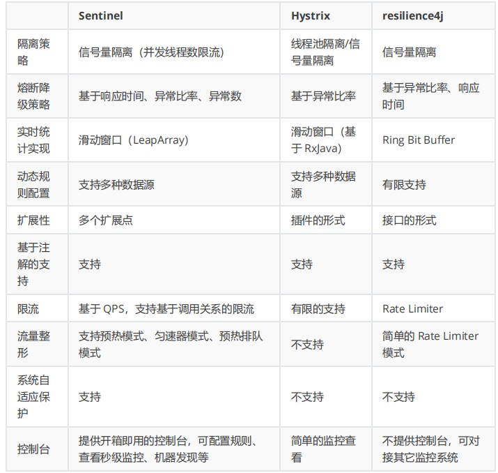

# 分布式和微服务

### 微服务
1. 常见问题
   1. 服务如何管理
      1. 服务注册
      2. 服务发现
      3. 服务剔除
      4. 常见组件
         1. Zookeeper
         2. Eureka
         3. Consul
         4. Nacos
   2. 服务间如何通讯
      1. rest
         1. ribbon
         2. feign
      2. rpc
   3. 客户端怎么访问服务
      1. 网关，通常包含：统一接入、安全防护、协议适配、流量管控、长短连接支持、容错能力
   4. 容错
      1. 不被外界环境影响
      2. 不被上游请求压垮
      3. 不被下游响应拖垮
      4. 常见策略
         1. 隔离：将系统按一定的原则划分为若干个服务模块，各个模块相互独立，无强依赖。包含线程池隔离、信号量隔离
         2. 超时：设置请求响应时间
         3. 限流：限制系统输入、输出流量
         4. 熔断：当下游响应变慢或失败，可以暂时切断对下游服务的调用
            1. 熔断关闭状态：服务没有故障时，对调用方没有不做任何限制
            2. 熔断开启状态：后端对该服务接口调用不再经过网络，直接执行本地fallback方法
            3. 半熔断状态：尝试恢复服务调用，允许有限的流量调用该服务，并监控成功率。如果成功率达到预期，进入熔断关闭状态；如果成功率仍然很低，重新进入熔断关闭状态
      5. 降级：服务提供兜底方案
      6. 常见组件
         1. Hystrix
         2. Resilience4J（Hystrix官方推荐的替代产品）
         3. Sentinel
         4. 
   5. 排错（链路追踪）
      1. Sleuth：SpringCloud 提供的分布式系统中链路追踪解决方案
      2. Skywalking：是支持多种插件，UI功能较强，接入端无代码侵入
      3. Cat：通过代码埋点的方式来实现监控，比如： 拦截器，过滤器等。 对代码的侵入性很大，集成成本较高。风险较大
      4. zipkin：功能包含数据收集、存储、查找和展现。该产品结合spring-cloud-sleuth 使用较为简单， 集成很方便， 但是功能较简单
      5. pinpoing：支持多种插件，UI功能强大，接入端无代码侵入
2. 解决方案
   1. ServiceComb（华为微服务引擎CSE）
   2. SpringCloud
   3. SpringCloud Alibaba

