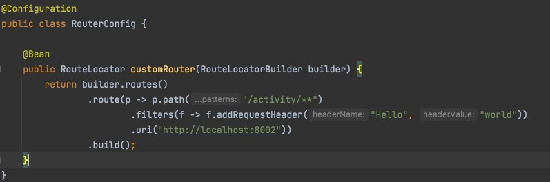
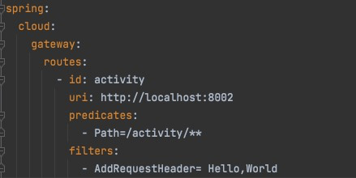

## 网关
1. 功能
   1. 认证
   2. 鉴权
   3. 监控
   4. 路由转发
2. 常用组件
   1. Spring Cloud Gateway
   2. Spring Cloud zuul
   3. Kong
   4. Nginx+lua
   5. Apisix

###spring-cloud-gateway (https://spring.io/projects/spring-cloud-gateway/)

#### 架构
1. 概念
   1. 路由
      1. id
      2. uri
      3. order：数值越小，匹配优先级越高
      4. predicate：断言，条件判断
      5. filter：修改请求和响应信息
      6. 执行流程
         1. gateway接收到请求
         2. HttpWebHandlerAdapter组装网关上下文
         3. DispatcherHandler将请求分发给RutePredicateHandlerMapping
         4. RutePredicateHandlerMapping负责路由查找，并断言是否可用
         5. 如果断言成功，有FilteringWebHandler创建过滤器并调用
         6. 请求会一次经过PreFilter-微服务-PostFilter链路，最终返回响应
   2. 断言
      1. 基于DateTime
      2. 基于远程地址（IP段）
      3. 基于cookie
      4. 基于header
      5. 基于host
      6. 基于Method
      7. 基于Path
      8. 基于Query
      9. 基于路由权重
   3. 过滤器
      1. 作用：过滤器就是在请求的传递过程中，对请求和响应做一些处理
      2. 生命周期：pre、post
      3. 分类：局部过滤器（作用于某一路由 GatewayFilter）、全局过滤器（全部路由 GlobalFilter）
2. 基础：Spring5+SpringBoot2+Reactor

#### 集成
1. 引入依赖
```text
    <dependency>
        <groupId>org.springframework.cloud</groupId>
        <artifactId>spring-cloud-starter-gateway</artifactId>
        <exclusions>
            <exclusion>
                <groupId>org.springframework.cloud</groupId>
                <artifactId>spring-cloud-starter-web</artifactId>
            </exclusion>
        </exclusions>
    </dependency>
```
2. 路由转发
   1. 基于Spring Bean配置
   2. 使用yml配置
3. 自定义拦截器/使用自带拦截器都可


#### 自定义拦截器
```java
@Slf4j
@Component
public class GateWayFilter implements GlobalFilter, Ordered {

    @Override
    public Mono<Void> filter(ServerWebExchange exchange, GatewayFilterChain chain) {
        // 逻辑处理 返回值随便写的，按照需求改
        ServerHttpResponse response = exchange.getResponse();
        DataBuffer dataBuffer = response.bufferFactory().wrap("String body".getBytes());
        response.setStatusCode(HttpStatus.OK);
        response.getHeaders().setContentType(MediaType.APPLICATION_JSON);
        return response.writeWith(Mono.just(dataBuffer));
    }

    @Override
    public int getOrder() {
        // 过滤器顺序，数值越小，越先执行
        return -200;
    }

}
```

#### 自定义异常处理器
```java
    @Slf4j
    @Component
    public class JsonExceptionHandler implements ErrorWebExceptionHandler {
    
        @Override
        public Mono<Void> handle(ServerWebExchange exchange, Throwable ex) {
            ServerHttpResponse response = exchange.getResponse();
            if (response.isCommitted()) {
                return Mono.error(ex);
            }
            log.warn("gateway catch exception,ex = [{}]",ex);
            response.setStatusCode(HttpStatus.OK);
            response.getHeaders().setContentType(MediaType.APPLICATION_JSON);
            DataBuffer dataBuffer = response.bufferFactory().wrap("String body".getBytes());
            return response.writeWith(Mono.just(dataBuffer));
        }
    }
```


#### 使用gateway内置限流
```java
    @Configuration
    public class RateLimitResolver {
    
        /**
         * 官方文档：https://cloud.spring.io/spring-cloud-static/spring-cloud-gateway/2.2.2.RELEASE/reference/html/#gatewayfilter-factories
         * 注意，Mono.just(object)方法不接受null参数，会抛出NullPointerException
         * RedisRequestLimiter使用的令牌桶算法，需要配置容量和每秒发放令牌次数
         * The redis-rate-limiter.replenishRate 每秒新增令牌数
         * The redis-rate-limiter.burstCapacity 令牌桶容量
         * The redis-rate-limiter.requestedTokens 每个请求消耗的容量数，默认1
         * 被限流时将返回HttpStatus.429 Too Many Requests
         */
    
        /**
         * ip限流
         */
        @Bean
        @Primary
        public KeyResolver hostAddrKeyResolver() {
            return exchange -> {
                String hostName = exchange.getRequest().getRemoteAddress().getHostName();
                System.out.println("host resolver : " + hostName);
                return Mono.just(hostName);
            };
        }
    
        /**
         * 用户限流
         */
        @Bean
        public KeyResolver userKeyResolver() {
            return exchange -> {
                HttpHeaders headers = exchange.getRequest().getHeaders();
                String innerToken = headers.getFirst("header");
                System.out.println("user resolver : " + innerToken);
                return Mono.just(innerToken);
            };
        }
    
        /**
         * 接口限流
         */
        @Bean
        public KeyResolver pathKeyResolver() {
            return exchange -> {
                String path = exchange.getRequest().getPath().toString();
                System.out.println("path resolver : " + path);
                return Mono.just(path);
            };
        }
    }
```

#### 路由转发配置示例
```json
    [{
        "id": "example-router",
        "order": 0,
        "predicates": [{
            "args": {
                "pattern": "/example/**"
            },
            "name": "Path"
        }],
        "uri": "lb://example-service"
    }]
```