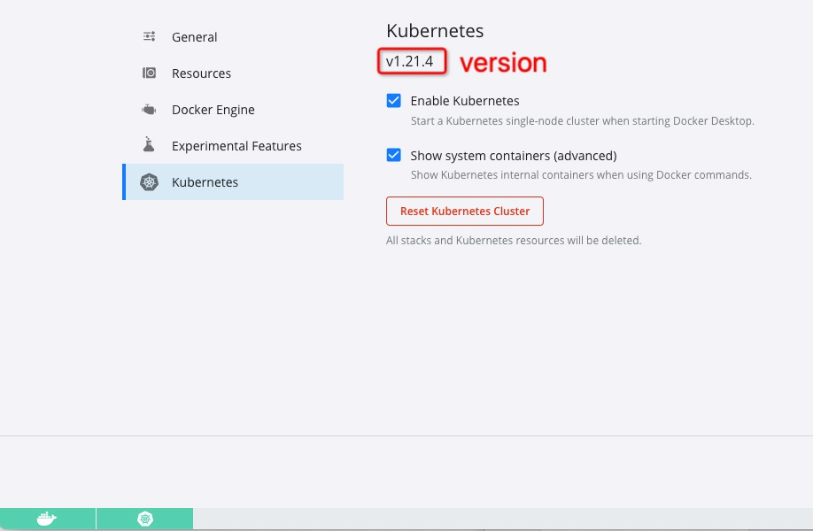

### Docker 学习笔记

#### 3大组件
- 仓库：类似git，docker有一个中央仓库，包含构建好的组件(hub.docker.com 一般使用国内镜像)
- 镜像：只读文件，一个镜像可以构建多个容器（在我理解就是编译好的软件包），一个镜像有多个标签(个人理解为版本号)。
- 容器：安装好，待用的软件？？

####  常用命令
- docker version
- docker info
- docker --help

- docker images 列举本地镜像，每个镜像有个唯一id
- docker search -f \[stars=] image-name
- docker pull image-name:TAG  tag可省略，默认latest
- docker rmi image-name:tag|image-id 删除镜像

- docker run \[options] image \[command] \[args] 创建并运行容器(如果本地没有，自动从远程拉取)
- docker ps \[options] 查看容器列表
- docker start container-id|container-name 启动容器
- docker stop container-id|container-name  停止容器，相当于kill -15
- docker kill container-id|container-name  停止容器，相当于kill -9
- docker rm container-id|container-name  删除容器
- docker logs -f -t --tail \[n] container-id  -f指最新数据 -t显示时间戳 tail显示最后多少条
- docker top container-id 查看容器进程
- docker attach container-id 进入容器根目录
- docker exec -t container-id command 执行命令并返回结果（如果command和attach效果相同）
- docker cp container-id:remotePath localPath 复制文件到本机
- docker commit -m "提交信息" -a "作者" container-id image-name:TAG 将容器副本提交为镜像
- docker run -it -v localPath:dockerContainerPath image 创建数据卷并可以通信，如果dockerContainerPath:ro，表示容器只读(只能同步主机数据，自己不能操作)
- docker inspect container-id

- exit 关闭容器并退出
- ctrl+P+Q 推出容器，但不关闭

#### dockerfile
1. 概念：用来构建docker镜像的构建文件，由一系列命令和参数构成
2. 使用步骤
    1. 编写docker文件
    2. 使用docker build命令构建自定义镜像
    3. run
3. 语法规则
    1. 每条保留字都为大写字母，且至少有一个参数
    2. 指令按照从上到下的顺序执行
    3. \#表示注释
    4. 每条指定都会创建一个新的镜像层，并堆镜像进行提交
4. 执行流程
    1. docker从基础镜像运行一个容器
    2. 执行一条指令并对容器做出修改
    3. 执行类似docker commit的操作提交一个新的镜像层
    4. docker再基于一个刚提交的镜像运行一个新容器
    5. 执行docker的下一条指令直到所有指令都执行完成
5. 保留字
    - FROM 基础镜像，说明当前镜像基于那个镜像的
    - MAINTAINER 作者姓名和邮箱
    - RUN 要执行的命令
    - EXPOSE 对外暴露的端口
    - WORKDIR 用户进入容器默认工作目录
    - ENV 构建过程中设置环境变量
    - ADD 将指定文件拷贝到指定目录并自动处理URL、解压
    - COPY 将指定文件拷贝到指定目录
    - VOLUME 容器数据卷，用于数据保存和持久化工作
    - CMD 指定容器启动时要运行的命令，dockerfile可以有多个CMD指令，但只有最后一个生效。CMD会被docker run后面的参数替换
    - ENTRYPOINT 和CMD类似，但不是被docker run 的参数后面替换，而是将参数追加
    - ONBUILD 当构建一个被继承的dockerfile时，父镜像在被子镜像继承后父镜像的onbuild触发
    - .dockerignore
    - USER
5. 示例
```text
#### docker centos dockerfile 实例
FROM centos
ENV DEFAULTPATH /usr/share
WORKDIR $DEFAULTPATH
RUN yum install vim
RUN yum install net-tools
EXPOSE 80
CMD echo "hello, centos"
CMD /bin/bash
```

备注：
    - scratch 类似Java 的Object类，是所有镜像的base镜像


#### docker镜像


#### docker 容器数据卷
1. 作用：关闭容器时，将容器数据持久化（如果没有commit，容器删除后数据会丢失掉）。类似Redis的持久化
2. 特点
    - 数据卷可用于容器之间共享数据
    - 卷中的更改可直接生效
    - 卷中的更改不会包含在镜像的更新中
    - 数据卷的生命周期持续到没有容器使用它为止
3. 创建方式
    - docker run -it -v localPath:dockerContainerPath image 命令
    - dockerfile创建
4. 数据卷容器：容器间传递共享，知道没有容器使用它为止

#### 打包SpringBoot
1. 创建一个SpringBoot项目，打包jar
2. 创建Dockerfile（无后缀） 
3. 运行docker -build -t name:tag dir
   1. 报错 failed to solve with frontend dockerfile.v0: failed to create LLB definition: docker.io/library/java:8: not found
   2. https://www.codenong.com/35325103/ 可能是多个镜像互相影响导致
   3. 解决：将java:8改成java:9，打包成功，使用docker images; 查看所有镜像，大小为579MB
   4. 创建并启动容器docker run --name hot -p 8080:8080 -d hot:v1.0.0
   5. 启动失败 no main manifest attribute, in /hot.jar.SpringBoot 启动异常NPE，怀疑是打包的jdk（8）和docker构建jdk（9）版本差异
   6. 修改dockerfile：FROM openjdk:8-jre。打包成功，运行成功，接口访问成功
4. 修改Dockerfile，在容器添加一个ffmpeg（整轨的音乐，部分app自带音乐app无法识别，懒得新建项目）
   1. 
   2. 重新打包，并启动容器
   3. 修改代码，增加ffmpeg调用（截取音频）
   4. docker run --name hot -p 8080:8080 -v /Users/liufeng/IdeaProjects/duibatest/learn/src/main/java/learn/ffmpeg:/tmp/ape  -d hot:v1.0.0
   5. 编写代码（java执行cmd命令）
      1. ffmpeg不支持中文？
      2. ffmpeg不支持ape
      3. 最终将文件转换为flac文件


    

#### 示例：安装Nginx(代码来源于菜鸟教程)
1. 打开docker仓库，获取nginx版本列表
2. 拉取nginx镜像，docker pull nginx:latest(latest是版本号)
3. 使用docker images查看本地镜像，如图 
4. 运行nginx
    - 任意文件夹执行命令：C:\Users\tiny>docker run --name nginx-test -p 8080:80 -d nginx
    - 得到响应：16442252bbcb287b8a093df596ba54c4c4e5a2cfbd393b52596b4dc68e5540db
    - 命令解析 --name nginx-test 表示创建名为nginx-test容器，-p 8080:80表示将本机的8080端口映射到docker的80端口 -d表示后台运行 
    - 访问本地8080端口，将自动转发到nginx，请求如图：
    - 查看本地容器，如图 
    
#### 示例2：搭建MySQL主从
1. 拉取mysql镜像 docker pull mysql:latest
2. 运行2个mysql实例
    - C:\Users\tiny>docker run --name mysql-main -p 3340:3306 -e MYSQL_ROOT_PASSWORD=123456 -d mysql:latest
    - C:\Users\tiny>docker run --name mysql-copy -p 3339:3306 -e MYSQL_ROOT_PASSWORD=123456 -d mysql
    - 备注：docker的每一个容器都是单独的环境，两个环境使用同一个端口并不冲突；启动时如果本地只有一个镜像，无需指定TAG
    - 如果有2个名为mysql的镜像，启动未指定TAG，是否会报错？如果没有报错，默认值是最新版
    - C:\Users\tiny>docker run --name mysql-copy1 -p 3338:3306 -e MYSQL_ROOT_PASSWORD=123456 -d mysql
    - 启动成功，使用版本为8.0.26，并非5.7.默认值使用最新版本，还是最早拉下来的版本？规则暂不确定(latest)
3. docker exec -it \[container-name|container-id] /bin/bash 进入服务器，修改配置文件，重启
    - server-id=100 同一局域网内注意要唯一
    - log-bin=mysql-bin 开启二进制日志功能，可以随便取（关键）
    - CREATE USER 'slave'@'%' IDENTIFIED BY '123456';
    - GRANT REPLICATION SLAVE, REPLICATION CLIENT ON *.* TO 'slave'@'%';
    
4. 修改slave配置文件，重启
    - change master to master_host='172.17.0.2',master_user='slave',master_password='123456',master_port=3306,master_log_file='mysql-log-000001',master_log_pos=710,master_connect_retry=30;
    - start slave;
    - show slave status;

#### 示例3：搭建rocketmq(博客链接：https://cloud.tencent.com/developer/article/1730689)
1. clone代码：git clone https://github.com/apache/rocketmq-docker
2. 生成镜像命令：sh build-image.sh RMQ-VERSION BASE-IMAGE，实际命令：sh build-image 4.7.1 alpine
3. 查看镜像 docker images | grep -i rocketmq
4. 执行脚本生成配置文件：sh stages.sh 4.7.1
5. 启动容器 cd stages/4.7.1, sh ./play-docker.sh alpine
   1. 启动日志：Starting RocketMQ nodes... 
   2. 启动日志：5b4bf1a902cf1cc0d6dcb70f2d22dabdf3d98ac0a8f48cf8e677013d1991dd29 
   3. 启动日志：1f42e74a91e7edebe7c2b9ba05f98869c54554c1a2723ba7ff308cd9a3113ea0
6. 问题：brokerIp无法访问（修改配置文件应该就行）
7. 换另外一个博客https://mp.weixin.qq.com/s/3OR3PrVnpudMKPZEMtTj_A
8. 

#### 搭建ELK(项目见../../../project/es)
1. 进入docker仓库，搜索elasticSearch，拉取镜像docker pull elasticsearch:8.4.3(同样的版本号拉取kibana)
2. 创建文件夹，以便docker镜像和本地同步
3. 启动es，docker run --name elasticsearch -p 9200:9200 -p 9300:9300 -e "discovery.type=single-node"  -v /Users/liufeng/IdeaProjects/liufeng82012016.github.io/project/es/config:/usr/share/elasticsearch/data -d elasticsearch:8.4.3
   1. --name
   2. -p 端口映射，es服务端口9200，9300用于提供http服务
4. 调用localhost:9200，提示需要登录（不同博客好像不一样...）
   1. 修改elasticsearch.yml，重启es
   2. docker run --name elasticsearch -p 9200:9200 -p 9300:9300 -e "discovery.type=single-node"  -e ES_JAVA_OPTS="-Xms512m -Xmx512m"   -d elasticsearch:7.17.6
   3. 在bin目录下，执行./elasticsearch-setup-passwords interactive，依次设置6个密码elastic,apm_system,kibana,logstash_system,beats_system,remote_monitoring_user，全部为123456
   4. 调用localhost:9200，使用elastic+123456登录成功
5. 编写代码，写入数据报错，type为空
   1. 查看SpringBoot 2.7.4版本对应es依赖为7.17.6，重新下载es7.17.6版本，并创建容器。访问成功，不需要设置密码
6. 安装kibana
   1. docker pull kibana:7.17.6
   2. docker run --name kibana -p 5601:5601 -v /Users/liufeng/IdeaProjects/liufeng82012016.github.io/project/es/config/kibana/kibana.yml:/usr/share/kibana/config/kibana.yml -d kibana:7.17.6
   3. 奇怪，虽然是yml配置，但看起来和properties更像
   4. 修改kibana.yml，添加i18n.locale: "zh-CN"，让控制台以中文显示
   5. 重启docker，访问5601端口不同，查看日志，未获取到es健康信息，重新获取es容器id，并配置到kabana，访问成功
7. 安装logstash
   1. docker pull logstash:7.17.6
   2. docker run --name logstash -p 5044:5044 -v /Users/liufeng/IdeaProjects/liufeng82012016.github.io/project/es/config/logstash/:/usr/share/logstash/config -d logstash:7.17.6
   3. 启动成功，但是无法连接es，没有配置
   4. 新建logstash.yml和logstash.conf（../../..//project/es/config/kibana）
   5. 重新启动
   6. logstash支持多种输入，包括http\tcp\file\beats
      1. tcp
         1. SpringBoot项目引入依赖<groupId>net.logstash.logback</groupId><artifactId>logstash-logback-encoder</artifactId>，版本号没找到说明，这里使用7.1.1
         2. 配置logback-spring.xml，通过tcp将日志传输给logstash
8. 点击kibana 
   1. 创建索引模式【Stack Management】==> 【Index Pattern】==> 【Create Index Pattern】
   2. 在discover打开，即可搜索
   3. 问题：message内容太多，部分是不想要的内容
   4. 问题2：logstash解析的tag显示为失败
9. 问题：es每次重启后，ip可能发生变化，必须改配置文件
   1. docker network ls
      1. bridge:默认情况下启动的Docker容器，都是使用 bridge，Docker安装时创建的桥接网络，每次Docker容器重启时，会按照顺序获取对应的IP地址，这个就导致重启下，Docker的IP地址就变了
      2. host:Docker 容器的网络会附属在主机上，两者是互通的.例如，在容器中运行一个Web服务，监听8080端口，则主机的8080端口就会自动映射到容器中
      3. none:docker 容器就不会分配局域网的IP
   2. 创建自定义网络 docker net create --subnet=172.17.0.0/16 mynetwork
      1. 提示：Error response from daemon: Pool overlaps with other one on this address space
      2. 更换网段  docker network create --subnet=172.18.0.0/16 mynetwork
   3. 重新启动创建es容器
      1. docker run --name es -p 9200:9200 -p 9300:9300 --net mynetwork --ip 172.18.0.2 -e "discovery.type=single-node"  -v /Users/liufeng/IdeaProjects/liufeng82012016.github.io/project/es/config:/usr/share/elasticsearch/data -d elasticsearch:7.17.6
      2. logstash一直连接es超时，猜测是因为在不同网段，于是删除原有容器并重建
      3. docker run --name kibana -p 5601:5601 --net mynetwork --ip 172.18.0.3 -v /Users/liufeng/IdeaProjects/liufeng82012016.github.io/project/es/config/kibana/kibana.yml:/usr/share/kibana/config/kibana.yml -d kibana:7.17.6
      4. docker run --name logstash -p 5044:5044 --net mynetwork --ip 172.18.0.4 -v /Users/liufeng/IdeaProjects/liufeng82012016.github.io/project/es/config/logstash/:/usr/share/logstash/config -d logstash:7.17.6
      5. es容易挂掉，暂时退回去...


#### docker安装jenkins（参考博客：https://mp.weixin.qq.com/s/LOxkK6FB5dIjX1kJtrDuIw ）
1. 安装jenkins，访问localhost:8080,使用admin 密码初始化
```text
docker search jenkins
docker pull jenkins/jenkins:lts
docker run --name jenkins -u root -p 8080:8080 -p 50000:50000 jenkins/jenkins:lts

// 日志提示，已经生成admin密码，并保存在文件/var/jenkins_home/secrets/initialAdminPassword
Jenkins initial setup is required. An admin user has been created and a password generated.
Please use the following password to proceed to installation:
ab7b307d08444c2f817c6c541ea3b2d7
This may also be found at: /var/jenkins_home/secrets/initialAdminPassword

docker exec -it jenkins bash
cd /var/jenkins_home/secrets/
cat initialAdminPassword

```
2. 安装插件
3. 创建管理员账号，记录一下 root 123456 liufeng82012016@163.com
4. 安装插件locale，使界面中文展示
5. 新建任务，添加github仓库地址和账号，运行，提示Support for password authentication was removed on August 13, 2021.
   1. 拉取代码失败，github不再支持账号密码授权
   2. 登录github，点击settings --> SSH and GPG keys
   3. 本地运行ssh-keygen -t rsa -C 'liufeng82012016@163.com'，提示选择文件夹，使用默认，根据控制台打印的文件目录获取对应key
   4. 得到2个文件，id_rsa(私钥),id_ras.pub(公钥)，将公钥添加到github，私钥添加到jenkins
   5. 立即构建，github 443超时，创建gitee账号...
   6. 申请gitee api令牌，配置失败，最终使用gitee账号密码访问成功
6. 执行构建，maven打包成功
7. 添加dockerfile，修改jenkins任务，博客上的workspace目录不存在
   1. 打开jenkins容器命令行，找到工作目录jenkeis_home，执行命令 find ./jenkins_home |grep ${jobName}
   2. 找到我的工作空间 /var/jenkins_home/jobs/hot3/workspace
   3. 添加shell脚本，构建，提示 docker not found
   4. 发现jenkins启动式，没有同步docker，搜索如何给已运行添加挂载目录
      1. 修改/var/lib/docker/containers/container-id/config.v2.json，找不到该文件放弃
      2. 导出现有容器为新镜像，然后重新运行（没有成功，因为历史文件没有同步，导出镜像也没有）
         1. docker commit -m 'copy' -a='liufeng' 6e12d7d53d97 jenkins2
         2. docker rm jenkins
         3. docker run --name jenkins -u root -p 8080:8080 -p 50000:50000 -v /Users/liufeng/IdeaProjects/liufeng82012016.github.io/test/jenkins_home:/var/jenkins_home -v $(which docker):/usr/bin/docker -v /var/run/docker.sock:/var/run/docker.sock jenkins/jenkins:lts
         4. 仍然提示 docker:Permission denied。主机执行 chmod 777 /var/run/docker.sock，无效
         5. 仔细看教程，发现并没有使用jenkins官方镜像，而是jenkinsci/blueocean
         6. docker pull jenkinsci/blueocean
         7. docker run --name jenkins -u root -p 8080:8080 -p 50000:50000 -v /Users/liufeng/IdeaProjects/liufeng82012016.github.io/test/jenkins_home:/var/jenkins_home  -v /var/run/docker.sock:/var/run/docker.sock jenkinsci/blueocean
         8. 等待容器启动，执行docker info，成功
   5. 打包，容器启动成功，提示no main manifest attribute，修改pom.xml
   6. 启动成功，访问接口成功
```text
cd /var/jenkins_home/workspace/hot3
docker stop hot || true
docker rm hot || true
docker rmi hot || true
docker build -t hot .
docker run -d -p 8001:8001 --name hot hot:latest
```


#### docker-desktop安装k8s（https://gitcode.net/mirrors/AliyunContainerService/k8s-for-docker-desktop?utm_source=csdn_github_accelerator ../../html/docker-k8s-2022-1207.md）
1. 点击docker设置，选中k8s，勾选Enable Kubernetes，k8s一直启动中
2. git clone https://gitcode.net/mirrors/AliyunContainerService/k8s-for-docker-desktop.git
3. git checkout v1.21.4
4. cd 本地git目录
5. ./load_images.sh
6. docker 显示启动成功
7. 配k8s控制台：kubectl apply -f https://raw.githubusercontent.com/kubernetes/dashboard/v2.4.0/aio/deploy/recommended.yaml
8. 查看控制台状态：kubectl get pod -n kubernetes-dashboard
9. 这时候还无法访问，需要开启代理：kubectl proxy（日志：127.0.0.1:8001）
10. 访问控制台：http://localhost:8001/api/v1/namespaces/kubernetes-dashboard/services/https:kubernetes-dashboard:/proxy/
11. 生成token，访问成功


#### jenkins+docker+k8s部署spring-boot项目
1. 经过前2步
   1. jenkins拉取gitee代码，打包镜像并运行
   2. docker部署k8s
2. 编写deployment.yaml
```yaml
apiVersion: app/v1
kind: Deployment
metadata: 
  name: hot
  labels:
    name: hot
spec:
  selector:
    matchLabels:
      name: hot
  template:
    metadata:
      labels: 
        name: hot
    spec:
      containers:
         - name: hot
           image: hot:tag
           # image: 127.0.0.1:5000/hot:1.0.0   #本地仓库镜像
           imagePukkPolicy: Never
            # 空的命令，防止重启～ 原理未知
           command: [ "/bin/sh" ]
           args: [ "-c","while true;do echo hello;sleep 1;done" ]
           ports:
              - containerPort: 38083

```
3. 启动镜像 kubectl apply -f deployment.yaml
4. 提示镜像找不到
5. 安装docker 本地仓库
   1. docker pull registry:2
   2. docker run -d -p 5000:5000 --restart=always --name registry -v /Users/liufeng/IdeaProjects/jenkins-test/images:/var/lib/registry registry:2
6. 本地仓库默认用https访问，修改配置文件，用http访问
   1. docker tag hot:1.0.0 127.0.0.1:5000/hot:1.0.0
   2. docker push 127.0.0.1:5000/hot:1.0.0
7. 修改image为本地仓库，imagePullPolicy为IfNotPresent
8. 启动镜像，dashboard报错：Back-off restarting failed container
9. 修改yaml，增加command，启动成功
10. kubectl expose deployment hot --type=NodePort
11. kubectl get service 发现启动成功的服务
12. 访问接口，一直访问不通过。先忽略，学习k8s基础再来捣鼓
