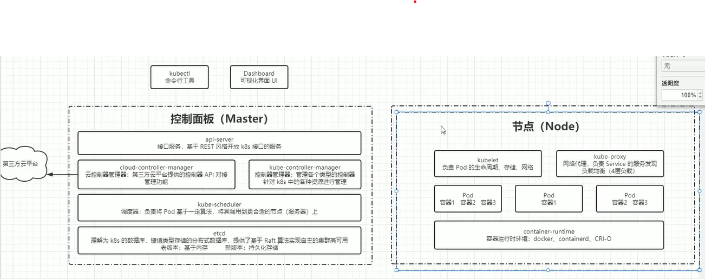
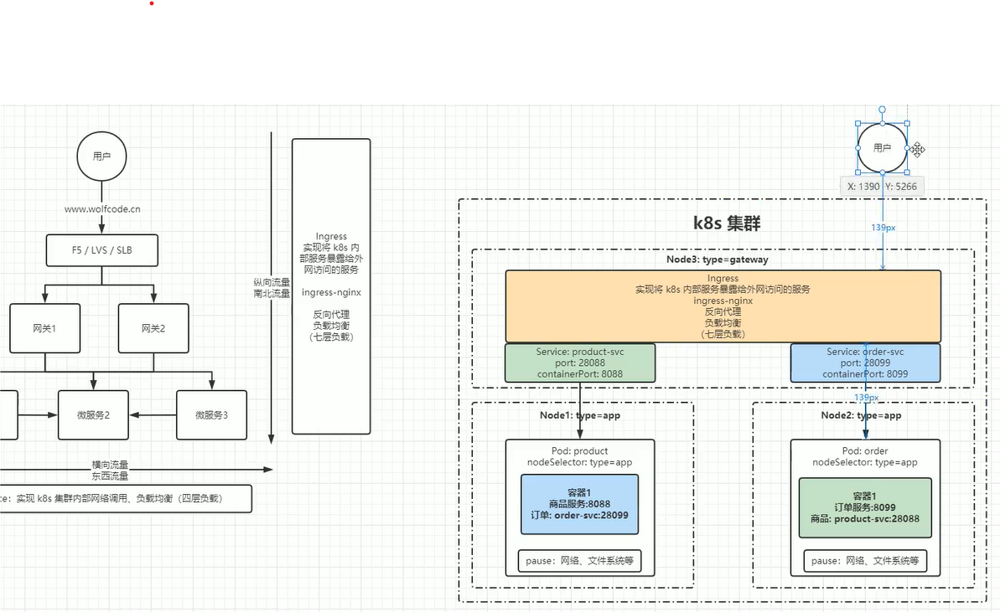

## Kubernetes

### 学习(官网：https://kubernetes.io/docs/home/)

#### 常用概念

1. 什么是kubernetes

   1. 用于管理云平台上多个主机上的容器
   2. 源于希腊语，寓意舵手、飞行员
2. 部署方式演进

   1. linux直接部署：资源不隔离
   2. 虚拟机部署：资源占用过多
   3. 容器化部署：容器生命周期短，ip、网络、文件、磁盘文件不稳定
3. 架构

   1. 客户端
      1. kubetl 命令行工具
      2. dashboard 可视化UI
   2. 控制面板 Master节点
      1. API server，基于Rest提供kubernetes接口
      2. kube-controller-manager：控制器管理器，管理各个类型的控制器，对k8s资源进行管理
      3. Controller 控制器
         1. 节点控制器
         2. 任务控制器
         3. 端点分片控制器
         4. 服务账号控制器
      4. cloud-controller-manager：云控制器管理器，第三方云平台提供的控制api对接管理功能
      5. kube-scheduler：调度器，负责将Pod基于一定算法，将其调用到更合适的节点上
      6. etcd：k8s数据库，key-value数据库，基于Raft算法实现高可用
   3. 普通节点
      1. kubelet：负责Pod生命周期、存储、网络管理
      2. kube-proxy：负责service服务发现和负载均衡（4层负载-网络层负载，基于iptables实现）
      3. container-runtime：容器运行时环境（不限于docker）
   4. 其他组件
      1. kube-dns
      2. ingress：网关
      3. promethus：资源监控
   5. 
4. 分层架构
   1. 生态系统
   2. 接口层
   3. 管理层
   4. 应用层
   5. 核心层
5. 服务的分类
   1. 有状态
   2. 无状态：不会对本地环境有任务依赖，不做数据持久化、数据恢复等操作，扩容、迁移无需额外处理
6. 资源和对象（资源创建之后就是对象）
   1. 资源分类
      1. 元空间：对于资源的元数据描述，每一个资源都可以使用元空间的数据
         1. Horizontal Pod Autoscaler，简称HPA，Pod水平自动伸缩。可以根据CPU使用率或自定义指标（Metrics）自动对Pod扩/缩容
            1. 控制器每隔30s查询Metrics的资源使用情况
            2. 支持3种Metrics类型
               1. 预定义：以CPU利用率计算
               2. 自定义Pod Metrics：以原始值计算
               3. 自定义Object Metrics
            3. 支持2中Metrics查询方式：Rest API、Heapster
            4. 支持多Metrics
         2. PodTemplate
         3. LimitRange：对集群资源进行限制
      2. 集群：作用于k8s集群，集群下所有节点共享
         1. NameSpace
         2. Node
         3. ClusterRole：对集群权限进行管理
         4. ClusterRoleBinding：对角色权限进行绑定，只能绑定到集群级别
      3. 命名空间：集群中的逻辑分组，多个命名空间相互隔离
         1. 工作负载型
            1. Pod：k8s最小可部署单元，一个Pod包含一个或多个应用程序容器，存储资源、唯一的网络IP地址，以及一些确定该容器如何运行的选项。通常只运行一个容器，可以运行多个容器，通过pause共享资源
               1. Replicas：副本数
               2. 控制器
                  1. 适用于无状态服务
                     1. ReplicationController（RC）：动态更新副本数
                     2. ReplicaSet：相对RC，可以通过selector来选择对那些Pod生效
                     3. Deployment：对RS封装，提供更丰富的功能，如自动创建RS、滚动升级/回滚、暂停恢复
                  2. 适用于有状态服务
                     1. StatefulSet
                        1. headless service：有状态服务DNS管理
                        2. volumeClaim Template：用于创建持久化卷的模板
                  3. 守护进程
                     1. DaemonSet：为每一个匹配的Pod，额外部署一个守护进程，可用于实现日志收集、监控、系统程序等功能
                  4. 任务、定时任务
                     1. Job：运行完成后销毁Pod
                     2. CronJob
         2. 服务发现
            1. Service：集群内调用，负载均衡
            2. Ingress：将内部服务暴露给外网
            3. 
         3. 存储
            1. Volume：数据卷，共享Pod容器使用的数据，用来放持久化的数据
            2. CSI：容器标准接口
         4. 特殊类型配置
            1. ConfigMap：理解为配置中心
            2. Secret：加密
               1. Service Account：用来访问k8s API
               2. Opaque:base64编码
               3. kubernetes.io/dockerconfigjson:和docker仓库相关
            3. DownwardAPI：将Pod信息共享到容器内，有2种实现方式
               1. 环境变量
               2. Volume挂载
         5. 其他
            1. Role：定义一组权限（命名空间级别）
            2. RoleBinding
7. 对象的规约和状态

   1. spec：对象的期望状态
   2. status：对象的实际状态，该属性由k8s维护，k8s会通过一系列的控制器对对应对象进行管理，尽可能地让对象实际状态和期望状态重合

#### 集群搭建

1. 方案
   1. minikube
   2. kubeadm
   3. 二进制安装
   4. 命令行工具

#### 参考博客

1. https://www.cnblogs.com/chiangchou/p/k8s-1.html
2. https://www.bilibili.com/video/BV1MT411x7GH/?p=11&spm_id_from=pageDriver&vd_source=d8007e69ec4c3fb742668ab3fc022c29

#### yaml语法(https://www.cnblogs.com/liugp/archive/2022/06/09/16361487.html)

```yaml
#  v1： Kubernetes API的稳定版本，包含很多核心对象：pod、service等。
#  apps/v1： 包含一些通用的应用层的api组合，如：Deployments, RollingUpdates, and ReplicaSets。
#  batch/v1： 包含与批处理和类似作业的任务相关的对象，如：job、cronjob。
#  autoscaling/v1： 允许根据不同的资源使用指标自动调整容器。
#  networking.k8s.io/v1： 用于Ingress。
#  rbac.authorization.k8s.io/v1：用于RBAC。
apiVersion: apps/v1
#  pod、deployment、statefulset、job、cronjob 不同的类型，spec配置不一样
kind: Deployment
#  配置其显示的名字与归属的命名空间
metadata:
  name: hot
  labels:
    name: hot
#  Deployment 配置示例
spec:
  #  副本数量
  replicas: 1
  #  定义标签选择器
  selector:
    matchLabels:
      name: hot
  # pod的定义
  template:
    metadata:
      labels:
        name: hot
    # 指定资源内容
    spec:
      # 容器名字和镜像地址
      containers:
        - name: hot
          image: hot:1.0.0
          imagePullPolicy: Never
          # 容器对外的端口
          ports:
            - containerPort: 38083


```

### 运维部署

#### docker-desktop安装，见docker.md
