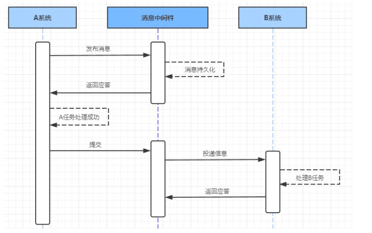
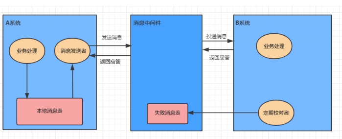
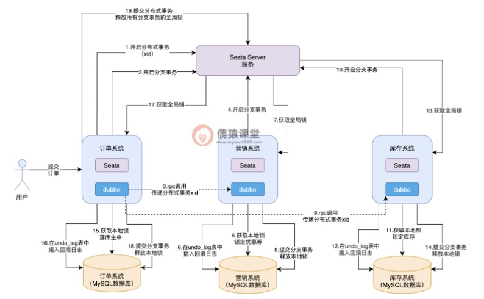
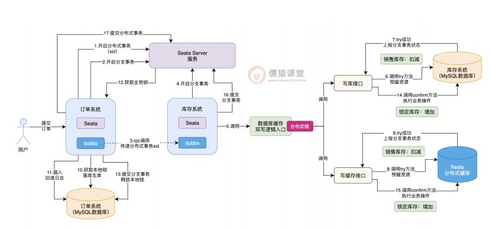

## 分布式事务
### 解决方案
1. 两段式提交
   1. 执行过程
      1. 表决阶段，所有参与者都将本事务执行预提交，并将能否成功的信息反馈发给协调者
      2. 执行阶段，协调者根据所有参与者的反馈，通知所有参与者，步调一致地执行提交或者回滚
   2. 优点：提高了数据一致性的概率，实现成本较低
   3. 缺点
      1. 单点问题: 事务协调者宕机 
      2. 同步阻塞: 延迟了提交时间，加长了资源阻塞时间 
      3. 数据不一致: 提交第二阶段，依然存在commit结果未知的情况，有可能导致数据不一致
2. 可靠消息服务：通过消息中间件保证上、下游应用操作的一致性
3. 最大努力通知
   1. 优点： 一种非常经典的实现，实现了最终一致性
   2. 缺点： 消息表会耦合到业务系统中
   3. 执行过程
4. TCC事务
   1. 执行过程
      1. try：尝试待执行的业务，但并未执行，只是完成所有业务的一致性检查，并预留好执行所需要的全部资源
      2. confirm：确认执行业务，不做任何业务检查，只使用try阶段预留的资源。通常情况下，TCC认为confirm不会出错
      3. cancel：取消待执行的业务，即取消try阶段预留的业务资源
   2. 和XA的区别
      1. XA是资源层面的分布式事务，强一致性，在两阶段提交的整个过程中，一直会持有资源的锁
      2. TCC是业务层面的分布式事务，最终一致性，不会一直持有资源的锁
   3. 优点：把数据库层的二阶段提交上提到了应用层来实现，规避了数据库层的2PC性能低下问题
   4. 缺点：TCC的Try、Confifirm和Cancel操作功能需业务提供，开发成本高
### seata http://seata.io/zh-cn/(alibaba分布式事务解决方案)
1. 架构
   1. TC：transaction coordinator，事务协调器，管理全局事务的状态，用于全局事务的提交和回滚
   2. TM：transaction manager，事务管理器，用于开启、提交或回滚全局失去
   3. RM：资源管理器，用于分支事务管理，向TC注册分支事务、上报事务状态、接收TC命令来提交或回滚事务
2. 模式
   4. TCC：自定义try，commit/rokllback实现，支持任何场景，逻辑相对复杂
   5. AT：仅支持关系型数据，利用binlog实现。集成简单，无侵入
   6. XA：利用数据库本身的两段分布式事务实现
   7. Soga：
3. 儒猿课堂 AT模式订单分析
   1. 链路
   2. 问题：死锁（超时释放）
   3. 问题：性能（共享资源竞争，如秒杀的库存）
4. 儒猿课堂 TCC模式订单分析
   1. 链路
   2. 问题：AT和TCC能共存于一个seata事务吗？
   3. 问题：空回滚（由于网络原因，try方法超时，TC调用cancel方法回滚）
   4. 问题：悬挂（try方法一直阻塞不能执行的情况），confirm和cancel方法都需要实现幂等

