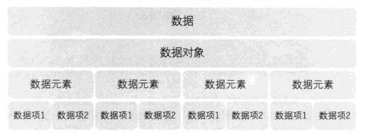
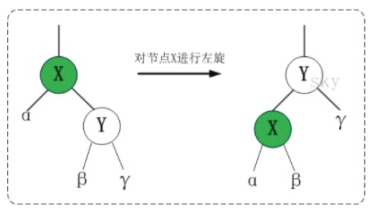
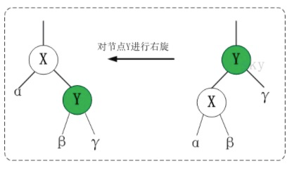
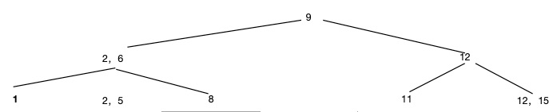

### 数据结构相关概念
1. 数据：描述客观事物的符号，是计算机中可以操作的对象，是能被计算机识别，并输入给计算机处理的符号集合
2. 数据元素：是组成数据的，有一定意义的基本单位，在计算机中通常作为整体处理，也被称为记录
3. 数据项：一个数据元素可以由若干个数据项组成，是数据不可分割的最小单位
4. 数据对象：是性质相同的数据元素的集合，是数据的子集
5. 数据结构：相互之间存在一种或多种关系的数据元素的集合。数据存储在内存时，决定了数据顺序和位置关系的就是数据结构
    1. 逻辑结构：数据对象中数据元素之间的相互关系
        1. 按照数据元素之间相互关系的特性来分
            1. 集合：除了处于同一个集合外，没有任何关系
            2. 线性结构：第一个元素无直接前驱，最后一个元素无直接后续以外，每个数据元素有且仅有一个直接前驱元素和一个直接后续元素
                1. 线性表（linear list）是n个类型相同数据元素的有限序列，通常记作（a0, a1, …ai-1, ai, ai+1 …, an-1 ）。包含数组和链表实现
            3. 树形结构：元素之间存在一种一对多的层次关系
            4. 图状结构：元素是多对多的关系
        2. 
            1. 二元组：数据结构 = {D , S} 。其中 D 是数据元素的集合；S 是 D 中数据元素之间的关系集合，并且数据元素之间的 关系是使用序偶来表示的。序偶是由两个元素 x 和 y 按一定顺序排列而成的二元组，记作 <x , y>，x 是它的第一元素，y 是它的第二元素。
            2. 图形：使用图形来表示数据结构时，是用图形中的点来表示数据元素，用图形中的弧来表示数据元素之间的关系。如果数据元素 x 与 y 之间有关系<x , y>，则在图形中有从表示 x 的点出发到达表示 y 的点的一条弧。
    2. 物理结构：数据的逻辑结构在计算机中的存储形式
       1. 顺序存储结构
       2. 链式存储结构
6. 数据类型：是一组性质相同的数据元素的集合以及加在这个集合上的一组操作。
    1. 作用：
        1. 是隐藏计算机硬件及其特性和差别，使硬件对于用户而言是透明的，即用户可以不关心数据类型是怎么实现的而可以使用它。例如Java的基本数据类型
        2. 用户能够使用数据类型定义的操作，方便的实现问题的求解
7. 抽象数据类型：abstract data type, 简称 ADT。由一种数据模型和在该数据模型上的一组操作组成。可以使用一个三元组来表示：ADT = (D, S, P) 其中 D 是数据对象，S 是 D 上的关系集，P 是加在 D 上的一组操作
8. 

### 数据结构-数组（向量）
1. 产生
2. ADT
3. 特点
4. 使用场景
### 数据结构-链表（列表）
1. 产生
2. ADT
3. 特点
4. 使用场景
### 数据结构-二叉树（树）
1. 产生
   1. 解决查找
2. 定义
   1. 特殊的图
   2. 只有一个根结点
   3. 前驱唯一，后继不唯一
   4. 连通图：一个点与其他任意一个点相连（并不要求直接）；要求边不能太少
   5. 无环图：；要求边不能太多
   6. 叶子节点：没有子节点的节点
   7. 深度：节点到根结点的距离
   8. 树的深度：所有叶子节点的深度的最大值
3. 表示法：
   1. 长子-兄弟表示法
   2. 二叉树表示法
4. 二叉树
   1. 约束：
   2. 分类：
      1. 满二叉树
5. ADT
6. 特点
7. 使用场景

### 算法相关概念    
1. 算法：指令的集合，是为解决特定问题而规定的一系列操作。它是明确定义的可计算过程，以一个数据集合作为输入，并产生一个数据集合作为输出。
    1. 特性：
        1. 输入：一个算法应以待解决的问题的信息作为输入。
        2. 输出：输入对应指令集处理后得到的信息
        3. 可行性：算法是可行的，即算法中的每一条指令都是可以实现的，均能在有限的时间内完成。
        4. 有穷性：算法执行的指令个数是有限的，每个指令又是在有限时间内完成的，因此整个算法也是在有限时间内可以结束的。
        5. 确定性：算法对于特定的合法输入，其对应的输出是唯一的。即当算法从一个特定输入开始，多次执行同一指令集结果总是相同的。(随机算法例外)
    2. 设计要求
       1. 可读性
       2. 健壮性
       3. 时间效率高和存储量低
    3. 度量方法
       1. 事后统计方法
       2. 事前分析估算
2. 时间复杂度（算法的渐进时间复杂度asymptotic complexity）：算法消耗时间相对于输入数据元素的数量的关系。通常计算算法循环的次数，因为循环外的少量操作只占了极少的一部分
    1. 评估维度：
        1. 计算循环次数
        2. 分析最高频度的基本操作
    2. 推导大O阶方法
       1. 用常数1取代运行时间中的所有加法常数
       2. 在修改后的运行次数函数中，只保留最高阶项
       3. 如果最高阶项存在且不是1，则去除与这个项相乘的常数
    3. 常见时间复杂度：常数<对数<线性<n*对数<平方阶<立方<指数<阶乘<n的n次方
3. 空间复杂度：为了求解问题的实例而执行的操作所需要的存储空间的数目，但是它不包括用来存储输入实例的空间。

### 常用数据结构
1. 线性表：零个或多个数据元素的有限序列
   1. 链表：数据线性存储在分散的空间，数据添加和删除都很方便，访问比较耗时。（因为数据分散存储，无法根据index直接获取地址）
       1. 单向链表
       2. 双向链表
       3. 循环链表(可以用于保存固定长度数据)
   2. 数组：数据线性存储在连续空间，数据访问很快，但是修改消耗较大。
   3. 静态链表：用数组描述的链表
2. 栈： 数据线性存储，但是只能访问最新的元素，就像箱子里的物品，永远只能先拿到顶部的一个（First in，last out.FILO）。栈是一种概念，可以有不同的实现
3. 队列：数据线性存储，一端输入，一端输出。银行业务，先排队，先办理。（First in,first out）.队列同样是一种概念，可以有不同实现。
4. 哈希表：由数组实现，它使用'哈希算法'对要查询的元素进行映射，然后固定存放在数据的某个格子里（更新后仍然在同一个格子）。
    1. 每一格不一定是单个元素，也可以是一个链表。JDK1.8里，链表元素达到8个，就会变成红黑树，提高查询效率。
    2. 哈希寻址的方法也有多种实现
        6.2.1 开放定址法：
        6.2.2 链定址法：
5. 堆：是一种树形结构，被用于实现优先队列。优先队列是一种数据结构，可以自由添加数据，但取出数据需要从最小值按顺序取出。在堆的图形结构中，每个节点称为顶点（node），数据就存在这里。
    1. 每个节点最多2个子节点，顺序从上到下，从左到右排列
    2. 子节点必须大于父节点，最小值保存在根节点中。因此在添加数据时，遵循一个规则：一般会将新数据放到偏左的位置，如果没有剩余空间，将新启一行，将数据放在最左侧。
6. 二叉查找树：又名二叉搜索树，二叉排序树，使用了图的树形结构。（不存在相同元素）
    1. 每个节点最多2个子节点
    2. 每个节点的值大于任意左侧子节点的值
    3. 每个节点的值小于任意右侧子节点的值
    4. 扩展
       1. 二叉平衡树（AVL）
          1. 每次新增/删除节点的时间复杂度都在logn，为了保持节点高度相差不得超过1，数据变更后需要自旋调整树结构，但是自旋时间不稳定
       2. 红黑树（RB tree）：牺牲了节点高度的严格一致性，保证自旋次数不超过3。定义了以下性质
          1. 每个节点的颜色是红色或者黑色
          2. 根结点是黑色
          3. 每个叶子节点（NIL：为空的叶子结点）是黑色
          4. 如果一个节点是红色的，则它的字节点必须是黑色
          5. 从一个节点到该节点的子孙节点的所有路径上包含相同数目的黑色节点（保证没有一条路径会比其他路径长出2倍）
          6. 左旋
          7. 右旋
          8. 添加节点
          9. 删除节点
       3. B树（B-树）：二叉树每个节点最多只有2个字节点，树的高度较大，读取树经历的IO次数较多。
          1. 
       4. B+树
          1. 
7. 图：由顶点和边组成。
    1. 如果给边加一个值表示权重，这样的图成为加权图。加权图可以表示可以表示连接程度，否则只能表示连接状态。
    2. 给边加上箭头，称为有向图（可以结合权重使用）。
8. 串：由零个或多个字符串组成的有限序列，又名叫字符串
   1. KMP算法
      1. 约定： pat 表示模式串，长度为 M，txt 表示文本串，长度为 N。index=txt.indexOf(pat)，不存在返回-1

  
### 排序算法
1. 冒泡排序(n^2)：从序列右边开始比较2个相邻数据的大小，再根据结果交换2个数字的位置
2. 选择排序(n^2)：从待排序的数据查找最小值，将其与序列最左边的值交换
3. 插入排序(n^2)：从序列左端依次排序。排序过程中，左侧部分已排序，依次从未排序数据挑选合适的位置插入。
4. 堆排序(nlogn)： 先把数据按顺序写入堆，然后依次取出
5. 归并排序(nlogn)：将序列拆分成长度为一半的序列，直到无法拆分(只包含一个元素，并且已排好序)，然后每2个序列按顺序合并成一个，知道合成为1个。
6. 快速排序(nlogn)：将序列拆分为基准值，大于基准值，小于基准值3部分（分治），大于/小于部分继续拆分(递归)，合并之后即是有序序列。

### 数组查找
1. 线性查找(n)：按顺序依次查找
2. 二分查找(logn)：只能查询已排序的数据。
    
### 图搜索(求最短距离)
1. 广度优先搜索：假设一开始位于某个顶点作为起点，需要到达某个终点。此时并不知道图的结构，只能沿着最近的边搜索，直到终点。每到达一个顶点，都需要判断是否是终点。
2. 深度优先搜索：沿着某条边直到边缘，如果没有查找到目标。折返换边继续
3. 贝尔曼-福特算法：将起始点的值设为0，其他顶点的值设为无限大，每次扫描将顶点的值设为min(oldValue,newValue)，更新后的值就是最小值。假设n个顶点，m条边，扫描次数为nm。
4. 狄克斯特拉算法：相对于贝尔曼-福特算法，多了一个选择顶点的方法。
    
### 安全
1. 风险点
    1. 窃听 ------> 加密
    2. 假冒 ------> 消息验证码或者数字签名
    3. 篡改 ------> 消息验证码或者数字签名
    4. 事后否认 ---> 数字签名
2. 加密：将数据变成第三者计算机无法理解的形式，再将其恢复成原本数据的一系列步骤就是加密
3. 哈希函数：把给定的数据转换成固定长度的无规律数值。转换后的无规律数值可以作为数据摘要应用于各种各样的场景。
    1. 同一个数据，同一个哈希算法，多次运行结果相同
    2. 不同数据，相同算法，可能会出现结果(哈希冲突)
    3. 不可以根据结果推断出源数据
    4. MD5，SHA1，SHA2(前2者据说有安全隐患，不建议使用？？)
5. 对称加密 AES/DES/动态口令/凯撒密码
6. 非对称加密 RSA
7. 混合加密
    1. 服务端生成非对称加密公私钥，将公钥发送客户端，客户端生成对称加密密钥，并使用公钥加密后发送给服务端
    2. 迪菲-赫尔曼协议密钥交换：将双方共有的秘密数字藏在公开数值的运算中，来获取双方之间密钥的安全交换
8. 消息认证码：由密钥和密文组成的字符串的“哈希值”。计算MAC的算法有HMAC、OMAC、CMAC等

### 常用算法
1. 欧几里得算法（辗转相除法）：求最大公约数(假设2个数a,b,a>b且a、b有最大公约数n，则a=xn,b=yn,a/b=zn。循环往复，当z=0，n即是最大公约数)。
2. 素性测试：判断一个数是否是素数(只能被1和自身整除)。
    1. 费马小定理： 对于任意素数p，任意整数n<p,有(n^p)modp=n成立
    2. 费马小定理反过来，即是所有n都满足该条件，p不一定是素数，如561=3×11*17，这样的数称为卡迈克尔数，也称为绝对伪素数(很少)
3. 网页排名（佩奇排名）:是一种网页搜索是对搜索结果排名的算法。
    1. 随机游走模型，每个节点（链接）的初始值为0，每被点击一次，自增1；
    2. 排名时，每一个节点的值=自身+(引用的连接的值*比例)累加
    3. 假设有a,b,c,d一共4个节点，值分别为1,2,3,4;c引用了a,b，d引用了a，则c=3+1*0.5+2=5.5,d=4+1*0.5=4.5,所以排名为c,d,b,a
4. 汉诺塔：移动圆盘游戏，递归思想
    1. 1次只能移动一个圆盘
    2. 大的圆盘不能在小的上面
    3. 解法：n个圆盘，只需要将n-1个圆盘移走。时间=2^n-1

### 树
#### 二叉树
#### 二叉搜索树
#### B-树
1. m阶B-树的特征
   1. 根节点至少2个自节点
   2. 每个中间节点都包含k-1个元素和K个孩子，其中m/2<=k<=m
   3. 每个叶子节点都包含k-1个元素，其中m/2<=k<=m
   4. 所有的叶子节点位于同一层
   5. 每个节点中的元素从小到大排列，节点中k-1个元素正好是k个孩包含的元素的值域分划
   6. 每个节点都带着节点数据
   7. 
#### B+树
1. m阶B+树的特征
   1. 有k个子树的中间节点包含k个元素，每个元素不保存数据，只用来索引，所有数据都保存在叶子节点
   2. 所有叶子节点包含了全部元素的信息，及指向包含这些元素记录的指针，且叶子节点本身依关键字的大小自小而大的顺序连接
   3. 所有的中间节点元素同时存在于子节点，在自节点元素中是最大（最小）元素