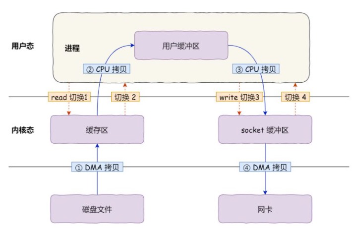

# IO模型

### Linux网络/IO

#### Linux网络/IO

1. Linux将所有外部都看作一个文件来操作，对一个文件的读写操作会调用内核的系统命令，返回一个file descriptor(fd，文件描述符)
2. socket读写也会有对应的socketfd(socket描述符)
3. 描述符是一个数字，它指向内核中的一个结构体(文件路径，数据区等属性)

#### IO模型

1. 阻塞IO模型
    1. 套接字在进程空间发起recvfrom调用，系统调用将一直等待，知道数据包达到，并被复制到应用进程的缓冲区或者发生错误；
2. 非阻塞IO模型
    1. recvfrom从应用进程到内核的时候，如果没有数据，就返回EWOULDBLOCK信号。应用通常轮询此状态获取数据更新
3. IO复用模型
    1. 应用将一个或多个fd交给select/poll系统调用，select/poll顺序检测fd是否准备就绪，但是支持的fd数量有限
    2. epoll和select类似，但不是顺序扫描，而是基于事件驱动。当有fd准备就绪，立即发起rockback，性能更高
4. 信号驱动IO模型
    1. 首先开启套接口信号驱动IO功能，并通过系统调用sinaction执行一个信号处理函数(此函数立即返回，非阻塞)，当数据准备就绪，就为改进程生成SIGIO信号，并通过信号回调通知程序调用reavfrom读取数据，主循环处理数据
5. 异步IO
    1. 告知内核启动某个操作，并在操作完成后发出通知。和信号驱动的区别在于，信号驱动有内核通知IO何时开始，异步IO通知IO何时完成。

#### IO多路复用(JAVA NIO核心库Selector的底层实现)

1. 用途：
    1. 服务器需要同时处理多个处于监听状态或者多个连接状态的套接字
    2. 服务器需要同时处理多种网络协议的套接字
2. Linux系统调用

- select(早期版本)
- pselect
- poll
- epoll(改进了select的缺陷)

3. epoll相对select的优点
    1. 支持一个进程打开的socket描述符FD不受限制(仅受限于操作系统的最大文件句柄数)，select通常是1024，epoll和内存相关，1G内存可以支持10w个句柄(cat /proc/sys/fs/file-max)
    2. 性能不会随着fd数量增加而线性下降。因为只有少数的socket是活跃的，select需要轮询所有，epoll是根据fd的callback函数实现的，只关注少数。如果socket都很活跃，那么2者的性能差异不大
    3. 使用mmap加速内核与用户空间的消息传递
    4. epoll API简单化
4. 其他操作系统下，select的优化方案
    1. freeBSD的kquene
    2. Solaris的dev/poll

#### 发布介绍

### 零拷贝

#### 概念和实现
1. 为什么需要零拷贝
   1. 假设用户程序发起一次数据读取，并将数据传输到网络
   2. 用户程序发起read()调用，（谁？）从用户态切换到内核态，然后DMA将数据拷贝‼️到内核空间
   3. 等待内核缓冲区真正有数据之后，cpu会把内核缓冲区的数据拷贝‼️到用户缓冲区，从内核态切换到用户态
   4. 用户程序发起write()调用，操作系统从从用户态切换到内核态，数据从用户缓冲区拷贝到‼️内核缓冲区
   5. 数据从内核缓冲区拷贝到‼️协议引擎（网卡），返回，从内核态切换到用户态
   6. 
2. 零拷贝：减少不必要的拷贝（系统状态切换，单次耗时几十纳秒到几微秒）和系统状态切换，常见技术有mmap(内核缓冲区和用户缓冲区的共享)、sendfile（系统底层函数支持）
   1. mmap+write，mmap系统调用函数会直接把内核缓冲区的数据映射到用户空间，过程如下
      1. 应用进程调用mmap()后，DMA会把磁盘的数据拷贝到内核的缓冲区，应用程序与操作系统共享这个缓冲区
      2. 应用进程调用write()，操作接通直接把内核缓冲区的数据拷贝到socket缓冲区，整个过程在内核态执行
      3. DMA将socket缓冲区的数据，拷贝到网卡的缓冲区
   2. sendfile（linux 2.1)
      1. sendfile()替换read()+write()，减少一次系统调用，拷贝次数同mmap
   3. sendfile（linux 2.4)
      1. socket缓冲区记录数据在内核缓冲区的位置和偏移量，直接拷贝到网卡，只发生2次数据拷贝

#### Java中的零拷贝
1. fileChannel.transferTo()
2. fileChannel.map()直接映射到内核缓冲区

### 概念
1. DMA:Direct Memory Access ,直接内存访问