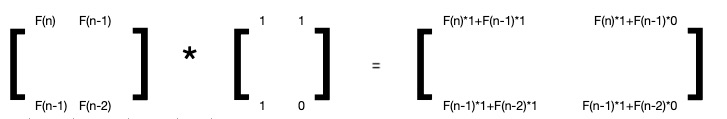

## 算法
程序=数据结构+算法  +效率？
#### 概念
1. 基本性质
    1. 输入
    2. 输出
    3. 正确性
    4. 确定性：任一算法都可以描述为由基本操作组成的序列
    5. 可行性
    6. 有穷性
2. 好算法具有的特性
    1. 能处理简单的、大规模的、一般性的、退化的、任意合法的输入
    2. 健壮：能识别不合法的输入，并适当处理，而不至于异常推出
    3. 可读性：结构化+准确命名+注释
    4. 效率：速度尽可能快，消耗资源尽可能少
3. 算法成本：运行时间 + 使用的存储空间（因为空间成本持续走低，注意力被专注于运行时间）
4. 图灵机
5. Random Access Mechine
    1. 寄存器顺序编号，总数没有限制
    2. 每一个操作仅需要常数时间 -- 将运行时间转换为基本操作数量
6. 大O记号：最坏时间复杂度
7. Ω记号：最好时间复杂度
8. 平均复杂度：
9. 时间复杂度估算：循环和基数

#### 分类
1. 迭代和递归
2. 减而治之 
    1. 将问题拆分成2个子问题，一个是普通问题（结果直接获得），一个是规模缩小且相似的子问题
    2. 分别计算子问题的解，子问题不断缩小，缩小成一个普通问题（边界条件）
    3. 由子问题求得原问题的解
3. 分治
    1. 将一定规模的拆分成若干个（通常是2个）规模相当的子问题
    2. 分别计算子问题
    3. 由子问题求得原问题的解

#### 算法思路(排序算法按照升序排列)
1. 插入排序：
   1. 已知第一个元素是有序的； 
   2. 从第二个元素开始遍历，与有序序列相比较，插入到合适的位置；
   3. 每遍历一次，有序序列长度加1，最终全部有序；
2. 冒泡排序：
   1. 每次从第一个元素开始遍历，与它下一个元素相比，将较大值放在右侧；第一轮遍历之后，最大值归位到最右侧；
   2. 重复上一步，每一轮遍历后，无序序列的最大值排到有序序列的最左侧，有序序列长度加1，最终全部有序；
3. 选择排序
   1. 每次从第一个元素开始遍历，选出元素中的最大值，将最大值放在序列最右侧；
   2. 重复第一步，将次大值放在最大值左侧；
   3. 每一次遍历，右侧有序序列长度加1，最终全部有序；
4. 希尔排序
   1. 和快速排序类似，但不是依次遍历，间隔和数组长度有关，每次遍历间隔减小，最终间隔为1时，排序完成；
5. 归并排序
   1. 将数组拆分为2个子数组（递归，拆分到只有一个元素时，该数组有序），分别排序，最终按大小合并到一起；
6. 快速排序
   1. 选择1个元素P
   2. 将序列中大于P的元素移动到P的右侧，将序列中小于P的元素移动到P的左侧
   3. 重复1，2步骤，分别对P左侧的序列和P右侧的元素进行排序
   4. 当P左右2侧的元素有序后，整个序列有序
7. 基数排序
   1. 遍历元素，按照个位排序
   2. 取上一步排序完成的序列，按十位排序
   3. 百位，千位。。。直到数组元素最大的位数
   4. 按最后一次排序得到的序列取出元素
8. 计数排序
   1. 定义一个temp数组，长度为(max-min+1)，遍历，将数组元素element存入temp\[element]
   2. 遍历temp数组，取出不为0的元素，依次写入原数组
9. 桶排序
   1. 将数组元素拆分到m个桶（有序），分别排序
   2. 按照桶/桶内元素序列 2个排序合并序列
10. 堆排序
11. LIS：最长递增子序列
    1. 动态规划解法：
       1. 最短序列长度为1
       2. 假设第i个元素lis(i) = f(i);分为2种情况
          1. f(i)计算结果包含元素i ==> f(i) = f(i-1)+1
          2. f(i)计算结果不包含元素i ==> f(i)与f(i-1)无关，与f(i-2)有关 ==> 元素i遍历时，如果出现这种情况，忽略；向下遍历自动处理
    2. 缓存数组
       1. 定义一个缓存数组temp，用于缓存最小序列
       2. 如果arr\[i]>temp\[endIndex]，将arr\[i]追加到temp末尾；否则，从temp数组查找比arr\[i]大第一个元素，替换掉；
       3. 为什么是替换不是插入？题目要求递增，那么同样长度的子序列，靠前的同一索引处，值越小，那么后续元素有效（后续元素比该元素大）的可能性越大
12. LCS：最长公共子序列
    1. 动态规划解法
    2. 转为LIS 
13. DP-斐波那契数列

#### 限流算法
1. 计数器（固定窗口算法）：指定时间周期n，通过一个原子操作来累计时间n内的请求数；如果达到上限，拒绝请求；如果时间n过去，请求数重新计算
2. 滑动窗口：将指定时间周期n划分为N个时间周期，分别统计每个时间周期的请求数，过期的滑动窗口将被删掉
3. 漏桶算法：漏斗有一个进水口、一个出水口，超过漏斗容量的请求将被拒绝
4. 令牌桶算法：以恒定速率向桶中防止令牌，超出容量的令牌将被丢弃，没有获取令牌的令牌的请求将被丢弃

### 学习（https://www.bilibili.com/video/BV1Tb411M7FA/?spm_id_from=333.337.search-card.all.click）

#### 1. 课程简介及算法分析
1. 考虑因素
   1. 性能
   2. 安全
   3. 正确性
   4. 可扩展
   5. 可维护
2. 排序算法
   1. 输入：n个整数组成的数组
   2. 输出：数组元素递增
   3. 插入排序
      1. 伪代码
      2. 思路：从数组第二个元素开始遍历，它与之前的元素相比较，插入到合适的位置
      3. 该算法运行时影响因素
         1. 已排序数组
         2. 规模n
         3. 对用户的承诺（可接受时间？）
3. T(n):输入规模n之下的最坏消耗时间

#### 分治法
1. 步骤
   1. 分：将一个问题拆分成若干个子步骤
   2. 治：
   3. 合：
2. 分治算法
   1. Binary Search 二分查找
   2. 乘方问题，如计算正式X的n次方
   3. 斐波那契：
      1. 朴素的递归算法（指数级消耗）
      2. '作弊'的数学算法，因为计算机浮点数精度可能导致失败
      3. 矩阵乘方法，定理:二阶矩阵B=2阶矩阵A的n次幂，矩阵A00=1,A01=1,A10=1,A11=0;B00=F(n+1),B01=F(n),B10=F(n),B11=F(n-1)。证明过程如下（归纳法）
         1. n=1时，F(2)=1,F(1)=1
         2. n=m时，有
   4. 矩阵乘法，输入为n阶矩阵A和B，输出为n阶矩阵C
      1. 常规的嵌套乘法，时间复杂度为n的3次方
      2. 将矩阵拆分为4个n/2阶的矩阵，相乘之后再相加，时间复杂度为n的3次方
      3. 斯特拉森算法，时间复杂度为n的2.81次方

### 《算法图解》
1. 简介
   1. 常见运行时间（从小到大）
      1. O(logn)
      2. O(n)
      3. O(n*logn)
      4. O(n2)
      5. O(n!)
   2. 旅行商问题：有一位旅行商，他需要前往5个城市，同时要确保路程最短。复杂度为O(n!)
2. 选择排序
3. 递归
   1. 组成：基线条件（函数不再调用自己，从而避免无限循环）和递归条件（函数调用自己）
   2. 栈
4. 快速排序
   1. 分治
      1. 找出基线条件
      2. 不断将问题分解（或者说缩小规模），知道符合基线条件
   2. 快速排序
      1. 选择基准值
      2. 将数组分为2个子数组：小于基准值的元素和大于基准值的元素
      3. 对2个子素组进行快速排序
5. 散列表
   1. 散列函数：无论输入什么数据，都返回一个数字。散列函数很重要，理想的情况应达到2个条件
      1. 如果每次的输入一致，返回值必须保持一致
      2. 如果输入不同，返回值也应该不相同
   2. 关键参数
      1. 填装因子
      2. 散列函数
6. 广度优先搜索（Breadth-first Search，BFS）
   1. 图：由节点和边组成，一个节点可能与众多节点直接相连，这些节点被称为邻居
   2. 广度优先：先遍历一级关系，再遍历二级关系，直到结束
7. 狄克斯特拉算法
   1. 步骤
      1. 找出最便宜的节点，即可在最短时间内达到的节点
      2. 更新该节点的邻居的开销
      3. 重复这个过程，直到对图中每个节点都这样做了
      4. 计算最终路径
   2. 可用于在加权图中查找最短路径，不可用于负权边
8. 贪婪算法：每步都采取最优的做法
9. 动态规划
10. K最近邻算法
