## 计算机基础（主要来于书籍《计算机组成与体系结构：性能设计》）

### 导论
1. 计算机组成与体系结构
   1. 计算机体系结构是那些对程序员可见的系统属性，直接影响到程序的逻辑执行，包含指令集、各种数据类型的比特数、输入输出机制、内存寻址等
   2. 计算机组成是实现结构规范的操作单元及其相互连接，包括对程序员可见的应用细节
   3. 体系结构是规范，组成是细节实现。同一个体系结构的实现不同，性能和价格可能天差地别
   4. 通常来说，越小的机器，新旧机器的兼容性要求越少，组成与体系结构设计决策的关系就越紧密
2. 结构和功能
   1. 结构：部件相关联的方法
      1. 中央处理单元CPU：他控制计算机的操作并执行数据处理功能
         1. 控制单元CU：控制CPU以至于整个计算器的操作
         2. 算术逻辑单元ALU：执行计算机的数据处理功能
         3. 寄存器：提供CPU的内部存储
         4. CPU系统互联：提供控制器、ALU和寄存器之间的某种通信机制
      2. 主存储器：存储数据
      3. I/O：在计算器及其外部环境之间传输数据
      4. 系统互联：为CPU、主存储器和I/O之间提供一些通信机制。最常见的列子是系统总线
   2. 功能：作为结构组成部分的单个独立部件的操作。概括为：数据处理、数据存储、数据传送、控制（通用为主，专用功能由编程完成）

### 计算机的演变和性能
1. 计算机简史
   1. 第一代：真空管，由导线、金属片、玻璃外壳和真空管构成
      1. ENIAC：第二次世界大战时，美军的弹道研究实验室在提供数据表的精确性和及时性遇到困难
         1. 1943年启动，1946年建成。计算器重40吨、占地1500平方英尺、共1.8w+真空管，功率达140kW，每秒可执行5000次加法，于1995年拆除
         2. 十进制机器。存储器包含20个累加器，每个都能保存一个10位十进制数，每一位数由10个真空管环标识。任何时候，仅有一个真空管处于ON状态，标识10个数字重的一个
         3. 必须手动编程，一切都要通过设置开关和插拔电缆头来实现
         4. 它的第一个任务是完成一系列复杂的运算，以帮助判断氢弹的可行性
      2. 冯.诺依曼机
         1. 1946年启动（被称为IAS计算机），至1952年仍未完成，却成为了通用计算机的原型
         2. IAS计算机包含1000个存储单元，它们被称为字，每个字有40bit。指令和数据都存储在此，数据被表示为二进制形式，指令是二进制编码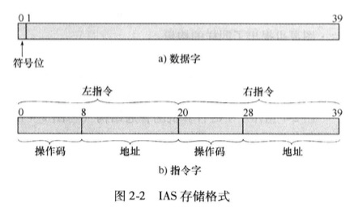
         3. 控制器通过一次从存储器取一条指令并执行它的方式来操作IAS，
         4. IAS反复执行指令周期来运行，每个指令周期由2个字周期组成
            1. 在取指周期中，下一条指令的操作码装入IR，地址部分装入MAR。指令从IBR或存储器获取，即先从存储器装载一个字到MBR，然后将该字解开放入IBR、IR和MAR。为什么不直接获取？因为这些操作都是由电子电路控制并且导致数据路径的使用，为了简化电路，只有一个寄存器来指定存储器读写的地址，而且也只有一个寄存器来存放数据源或目标
            2. 一旦操作码存入IR，则进入执行周期。控制电路翻译操作码，并通过发送相应的控制信号来执行指令，这些信号控制数据的发送和ALU操作的执行。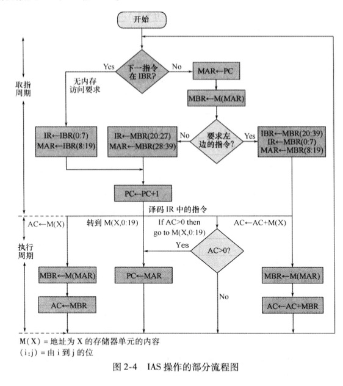
            3. IAS一共21条指令，可分为5类
               1. 数据传送：在存储器和ALU的寄存器之间或在两个ALU寄存器之间传送数据
               2. 无条件转移：通常，控制器按照顺序执行存储器的指令，但这个顺序能通过跳转指令加以改变，以便执行重复的操作
               3. 条件转移：可以依据条件来决定是否跳转，从而选择从何处跳转
               4. 算术运算：由ALU完成的操作
               5. 地址修改：允许在ALU中计算地址，并将它插入存储器的指令中，为程序寻址带来很大的灵活性
               6. 
      3. 商用计算机：Sperry、IBM
   2. 第二代：晶体管。单个独立封装的晶体管(晶体管、电阻、导线)称为分立元件，分立元件独立制造，封装在自己的容器中，然后一起焊接到或连接到纤维板上，最后安装到电子设备中。整个制造过程昂贵且麻烦
      1. IBM 7049是二代计算机的代表，它有两个特点
         1. CPU通过给数据通道（数据通道指独立的IO模块，具有自己的处理器和指令集）发送一个控制信号来初始化IO传送，数据通道独立的执行它的任务，并在操作完成后通知CPU
         2. 多路复用：他是数据通道、CPU、内存的中心连接点。多路器调度CPU和数据通道对内存的访问，允许这些设备独立运行
         3. 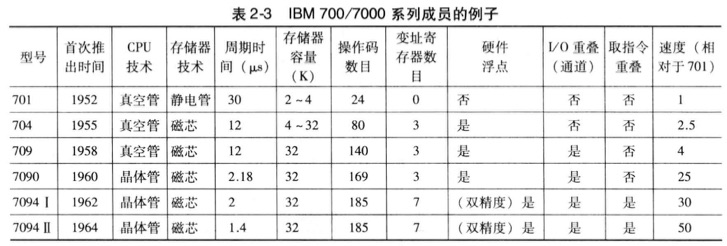
   3. 集成电路
      1. 微电子技术
         1. 存储器位元是一个能够存储一位数据的元件，任意时刻都处于两个稳定状态之一。将大量的基本元件连接起来，就能建造一台计算机。
            1. 数据存储：由存储器位元提供
            2. 数据处理：由逻辑门电路提供
            3. 数据移动：部件间的通路用于将数据从内存传送到内存，或从内存通过门电路再传送给内存
            4. 控制：部件间的通路传输控制信号
         2. 晶体管、电阻、导线都可以用硅之类的半导体制成，将整个电路安装在很小的硅片上而不是用分立元件搭成的等价电路，一块硅晶片上能同时制造很多个晶体管，通过金属化过程相互连接，以形成电路
         3. 一块薄硅晶片话费由多个小区域排列而成的阵列，每个区域有几平方毫米，他们上面都有相同的电路。这块镜片被划分成许多块芯片，每块芯片都包括许多逻辑门或存书单元，以及许多输入输出连接点，然后封装这块芯片，使之得到保护，并加上引脚，用以连接芯片外部的其他设备。许多这样的集成电路块可以连接在印刷电路板上，产生更大、更复杂的电路
         4. 
         5. 上图描述了集成电路的关键概念，和密度的增长。起初，只有几个门和存储单元可以可靠的制造并封装在一起，被称为小规模集成电路SSI，后期几乎直线增长，Intel合伙创办人高登.摩尔提出摩尔定律：
            1. 在芯片集成度快速增长的期间，单个芯片的成本几乎没有变化，这意味着计算机逻辑电路和存储器电路的成本显著下降
            2. 因为在集成度更高的芯片中逻辑和存储器单元的位置更靠近，电子线路长度更短，所以提高了工作速度
            3. 计算机变得更小，更容易放置在各种坏境中
            4. 见笑了电能消耗和对冷却的要求
            5. 集成电路内部的连接比焊接更可靠
      2. IBM System/360（大型机）
         1. 与占据了市场的IBM 7000并不兼容，但360系列机相互兼容，取得了巨大的成功，360体系结构至今仍是IBM大型机的体系结构。系列机具有以下特征：
            1. 相同或相似的指令集
            2. 相似或相同的操作系统
            3. 更高的速度
            4. 更多的IO端口数
            5. 更大的内存容量
            6. 更高的成本
            7. 这不就是所谓的刀法精准吗？低端机砍掉一些配置...
      3. DEC公司的PDP-8（小型机，总线结构）
      4. 后续几代
         1. 集成电路规模
            1. 大规模集成电路LSI：一块集成电路芯片可放置1000个元件
            2. 超大规模集成VLSI：每个芯片10000个元件
            3. 巨大规模ULSI：超过1000000元件
         2. 存储器
            1. 20世纪50-60年代
               1. 存储器使用微笑的铁磁体环做成，直径越1/16英寸，这些小环掉在计算机内用细线做成的网格上
               2. 一个环（磁芯）的一种磁化方向代表1，另一个磁化方向则代表0
               3. 磁芯存储器速度相当快，读取1位只需百万分之一秒，但是价格贵、体加大，读出是破坏性的，会查处其存储的数据
            2. 1970年
               1. 仙童公司生产了第一个容量较大的半导体存储器，一块相当于单个磁芯大小的芯片，包含256位内存
               2. 半导体存储器读取1位只需70ns，而且是非破坏性的，但是每位的价格比磁芯更昂贵
            3. 1974年
               1. 半导体存储器每位的价格比磁芯更便宜，而且往后价格快速下跌，但物理存储密度不断增加。1K-4K-16K...16GB
         3. 微处理器
            1. 1971年，Intel开发了Intel 4004（4位），将一个CPU的所有原件都放在同一块芯片，微处理器诞生。
            2. 1972年，Intel开发了Intel 8008（8位）
            3. 1974年，Intel开发了Intel 8080（8位），是第一个通用微处理器
            4. 70年代末，出现通用16位微处理器
            5. 1981年，贝尔实验室和HP公司开发出32位单片微处理器。1985年，Intel退出32位微处理器Intel 80386
            6. 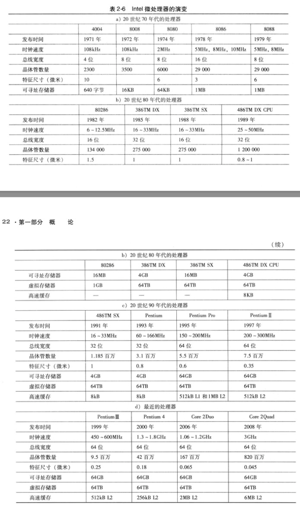
   4. 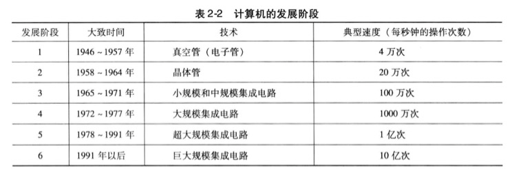
2. 性能设计
   1. 微处理器包含的技术
      1. 转移预测：处理器提前考察取自内存的指令代码，并预测哪条分支指令或哪组指令可能下一步会被执行，并将它们放入缓存，这样处理器就会一直处于繁忙之中
      2. 数据流分析：处理器通过分析那一条指令依赖其他指令的结果或数据，来优化指令调度。事实上，准备好的指令就可以被调度执行，不必按照原来的顺序，减少不必要的时延
      3. 推测执行：使用转移预测和数据流分析，一些处理器让指令在程序实际执行之前就推测执行，并将结果存储在临时空间。通过执行可能需要的指令，可以让处理器的执行机制尽可能的保持繁忙
   2. 性能平衡
      1. 起因：处理器的性能飞速发展，计算器其他关键部件并没有跟上。需调整组成和结构，以补偿各种部件之间的能力不匹配
   3. 芯片组成和体系结构的改进
      1. 处理器提速方法
         1. 提高处理器硬件速度
         2. 提高插入在处理器和主存之间的cache容量和速度
         3. 改变处理器的组成和体系结构以提高指令执行的有效速度
      2. 处理器提速阻碍
         1. 功耗：芯片上逻辑米和和时钟速度的提升，芯片消耗的功率密度随之提高，需解决散热问题
         2. RC延迟：电子在芯片上各晶体管间流动的速度受限于连接它们的金属线的电阻和电容。特别是，延迟随RC之积增长而增长。由于芯片上元件尺寸变小，互联线更细，从而电阻增加了；同时，线排列更紧密，电容也增大了
         3. 存储器滞后：存储器速度落后于处理器速度
      3. 演化策略
         1. 增加cache容量
         2. 处理器内指令执行逻辑越来越复杂，以允许处理器内指令并行执行
         3. 多核处理器
3. Intel x86体系结构的进展
4. 嵌入式系统和ARM
   1. 嵌入式系统：是计算机硬件、软件和可能附加的机械或其他部分的一种组合，用于执行特定的功能。在许多情况下，嵌入式系统是大型产品和系统的组成部分，例如轿车的刹车系统。它具有各种变化的需求和限制
      1. 从小到大的系统，意味着完全不同的成本限制，对优化和再利用有不同的需求
      2. 不严格的到非常严格的需求和不同质量要求的组合
      3. 从短到长的生命周期
      4. 不同的环境条件
      5. 不同的应用特征导致静态负载对动态负载、慢速对快速、计算密集型任务对交互密集型任务以及他们的组合
      6. 不同的计算模型，从离散事件系统到包含连续时间动态的系统
      7. 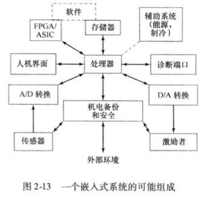
   2. ARM：是一种由英国剑桥ARM公司设计的基于RISC的微处理器和微控制器序列
5. 性能评价
   1. 时钟速度和每秒指令数
      1. 系统时钟
         1. 产生：一般情况下，时钟信号由水晶振子产生，水晶振子在由动力供应时能产生一个连续的信号波。该波被转化为一个数字电压脉冲流，连续的供应给处理器电路。例如，1个1GHz的处理器每秒接受10亿个脉冲
         2. 速率定义：脉冲的速率被称为时钟频率，或时钟速度。2个脉冲之间的时间定义为周期时间。每增加一个脉冲或时钟被称为一个周期，或时钟滴答声。
         3. 时钟和处理器：时钟频率必须适应处理器的物理层。处理器的操作需要信号将其从处理器的一个元件传送到另一个元件。当信号被放在处理器内部的一根线上时，他将占用一些有限的时间量使电压水平平静下来，以便一个正确的值(0或者1)可用。这取决于处理器的物理层，有些信号可能比其他信号变化更快。因此，操作必须同步，以便适当的电信号值可为每个操作用到
         4. 其他说明：指令的指令包含很多歌离散的步骤，如取指、译码指令的各个部分、取和存数据以及执行算术和逻辑运算。有的指令只需几个周期，另一些需要几十个周期。当使用流水线时，多条指令同时被执行。因此，不同处理器的时钟速度不能代表性能
      2. 指令执行速度
         1. 通用度量1：每秒百万条指令（MIPS）
         2. 通用度量2：每秒百万条浮点操作（MFLOPS，通常用于科学计算和游戏应用）
   2. 基准程序：上述度量方式并不适用所有场景，另一种方式是写一组基准程序，在不同机器上运行，对执行时间做比较。
      1. 基准程序所需具备的一些特征（WEIC90定义）如下：
         1. 由高级语言编写，可以方便的应用于不同的机器
         2. 是各种特殊程序设计方式的代表
         3. 易于度量
         4. 由广泛的发行
      2. SPEC标准程序
   3. 阿姆达尔定律：运行在多核计算机上的软件必须适应高速并行执行环境，以利用并行处理的能力

### 计算机功能和互连的顶层视图
1. 计算机的部件
   1. 硬布线程序：如果要执行一种特定计算，需要构造一个专门用于特殊计算的逻辑单元的配置。将各种元件连接成所需配置的过程，可以看成是某种形式的编程。得到的"程序"以硬件方式存在，被称为硬布线程序
   2. 软件：构造一个具有算术和逻辑功能的通用结构。这组经验根据提供给他的控制信号，对数据执行各种功能。硬件的一部分翻译每条指令并且产生相应的控制信号。另外，还需要输入模块、存储指令和数据的模块，视图如下
      1. 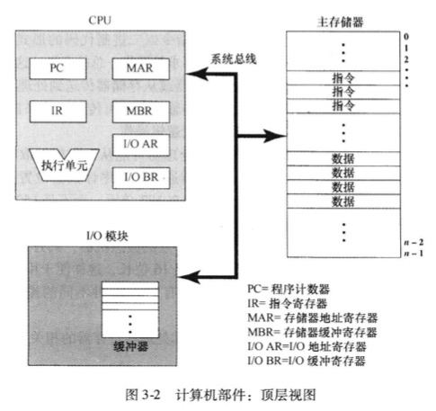
   3. 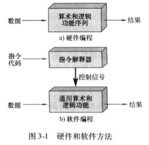
2. 计算机的功能
   1. 指令读取与执行
      1. 计算机完成的基本功能是执行程序，程序是由存储在存储器的一串指令组成。指令的处理有2个步骤：读取指令，执行指令。一条指令所要求的处理过程被称为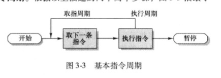
      2. 某个指令的执行周期可能包含存储器的多次访问，或IO操作。在新的状态途中，对于任意给定指令周期，有些状态可能为空，有的状态可能出现多次。状态描述如下
         1. 指令地址计算iac：决定下一条将要执行的指令的地址，通常是前一条指令的地址加一个固定值
         2. 读取指令if：将指令从存储器单元读到处理器中
         3. 指令操作译码iod：分析指令，以决定将执行何种操作以及将使用的操作数
         4. 操作数地址计算oac：如果该操作包含对存储器或通过IO的操作数访问，那么决定操作数的地址
         5. 取操作数of：从存储器或IO读取操作数
         6. 数据操作do：完成指令需要的操作
         7. 存储操作数os：将结果写入存储器或者输出到IO
         8. 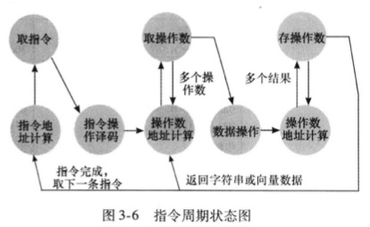
      3. 程序执行示例
         1. 程序：将存储器地址940与地址941的内容相加，结果放到地址941；处理器包含唯一的数据寄存器，被称为累加器AC；指令和数据都是16位长;
         2. 初始时，PC=300，取出第一条指令（16进制值为1940）装入IR，PC++（注意，此处忽略了MAR和MBR的使用）
         3. IR前4位（操作码，为16进制1）指出要装入累加器，剩余12位（地址码16进制940）指定从地址940装载数据。结果：将地址940的数据0003装入AC
         4. 从301取出下一条指令5941，PC++
         5. AC存放的内容和941单元的内容相加，结果放入AC
         6. 从302取出下一条指令2941，PC++
         7. 将AC内容存入941
         8. 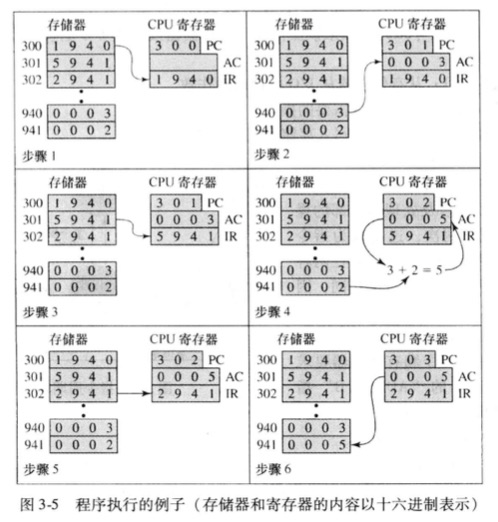
   2. 中断
      1. 描述：几乎所有的计算机都提供一种机制，其他模块如IO、存储器通过此机制可以中断处理器的正常处理。处理器挂起当前程序的操作，跳转服务于中断处理程序来相应，并且在设备服务完后恢复原来的执行
      2. 类型和产生的原因：
      3. 目的：提高处理器的效率，无需同步等待慢处理结果

### 简称或概念
1. 算术逻辑单元：arithmetic and login unit，ALU
2. 控制单元：control unit
3. 中央处理单元：control processing unit，CPU
4. 电子数字积分器和计算器：Electronic Numerical Integrator And Computer，ENIAC
5. 电子离散变量自动计算机：Electronic Discrete Variable Computer，EDVAC。冯.诺依曼在这个计划公布了将程序以某种程序和数据一同存于存储器中，计算器通过存储器读取程序来获取指令，而且通过设置一部分存储器的值就可以编写和修改程序的思想
6. 随机存取存储器:Random Access Memory,RAM
7. 指令寄存器IR：包含正在执行的8位操作码指令
8. 指令缓冲寄存器IBR：用来暂存来自存储器一个字的右边指令
9. 程序计数器PC：存放将要从存储器中获取的下一对指令的地址
10. 存储器地址寄存器MAR：指定将要从MBR写进存储器或从存储器读入MBR的存储器字单元的地址
11. 存储器缓冲寄存器MBR：包含将要写到存储器或IO单元，或者接收来自存储器或IO单元的一个字
12. 累加器AC和乘商寄存器MQ：用来暂存ALU运算的操作数和结果
13. 给定任何一个基数或者根为N的正整数，在系统中有N个各不相同的符号可以用来书写这个数字，这些符号的值的范围是0～N-1。如二进制的符号为0-1
14. 每条指令的平均周期数：average cycles per instruction，CPI