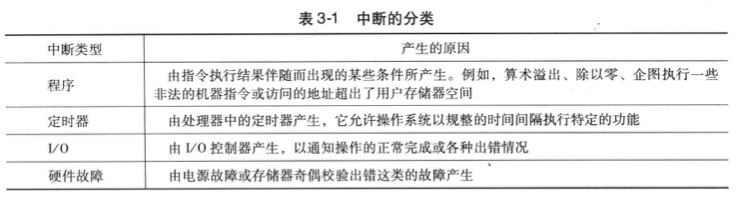
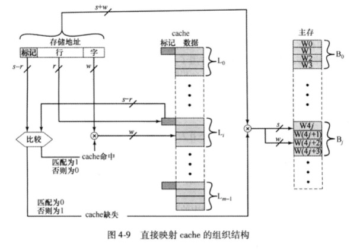

_## 计算机基础（主要来于书籍《计算机组成与体系结构：性能设计》）

### 导论
1. 计算机组成与体系结构
   1. 计算机体系结构是那些对程序员可见的系统属性，直接影响到程序的逻辑执行，包含指令集、各种数据类型的比特数、输入输出机制、内存寻址等
   2. 计算机组成是实现结构规范的操作单元及其相互连接，包括对程序员可见的应用细节
   3. 体系结构是规范，组成是细节实现。同一个体系结构的实现不同，性能和价格可能天差地别
   4. 通常来说，越小的机器，新旧机器的兼容性要求越少，组成与体系结构设计决策的关系就越紧密
2. 结构和功能
   1. 结构：部件相关联的方法
      1. 中央处理单元CPU：他控制计算机的操作并执行数据处理功能
         1. 控制单元CU：控制CPU以至于整个计算器的操作
         2. 算术逻辑单元ALU：执行计算机的数据处理功能
         3. 寄存器：提供CPU的内部存储
         4. CPU系统互联：提供控制器、ALU和寄存器之间的某种通信机制
      2. 主存储器：存储数据
      3. I/O：在计算器及其外部环境之间传输数据
      4. 系统互联：为CPU、主存储器和I/O之间提供一些通信机制。最常见的列子是系统总线
   2. 功能：作为结构组成部分的单个独立部件的操作。概括为：数据处理、数据存储、数据传送、控制（通用为主，专用功能由编程完成）

### 计算机的演变和性能
1. 计算机简史
   1. 第一代：真空管，由导线、金属片、玻璃外壳和真空管构成
      1. ENIAC：第二次世界大战时，美军的弹道研究实验室在提供数据表的精确性和及时性遇到困难
         1. 1943年启动，1946年建成。计算器重40吨、占地1500平方英尺、共1.8w+真空管，功率达140kW，每秒可执行5000次加法，于1995年拆除
         2. 十进制机器。存储器包含20个累加器，每个都能保存一个10位十进制数，每一位数由10个真空管环标识。任何时候，仅有一个真空管处于ON状态，标识10个数字重的一个
         3. 必须手动编程，一切都要通过设置开关和插拔电缆头来实现
         4. 它的第一个任务是完成一系列复杂的运算，以帮助判断氢弹的可行性
      2. 冯.诺依曼机
         1. 1946年启动（被称为IAS计算机），至1952年仍未完成，却成为了通用计算机的原型
         2. IAS计算机包含1000个存储单元，它们被称为字，每个字有40bit。指令和数据都存储在此，数据被表示为二进制形式，指令是二进制编码
         3. 控制器通过一次从存储器取一条指令并执行它的方式来操作IAS，
         4. IAS反复执行指令周期来运行，每个指令周期由2个字周期组成
            1. 在取指周期中，下一条指令的操作码装入IR，地址部分装入MAR。指令从IBR或存储器获取，即先从存储器装载一个字到MBR，然后将该字解开放入IBR、IR和MAR。为什么不直接获取？因为这些操作都是由电子电路控制并且导致数据路径的使用，为了简化电路，只有一个寄存器来指定存储器读写的地址，而且也只有一个寄存器来存放数据源或目标
            2. 一旦操作码存入IR，则进入执行周期。控制电路翻译操作码，并通过发送相应的控制信号来执行指令，这些信号控制数据的发送和ALU操作的执行。
            3. IAS一共21条指令，可分为5类
               1. 数据传送：在存储器和ALU的寄存器之间或在两个ALU寄存器之间传送数据
               2. 无条件转移：通常，控制器按照顺序执行存储器的指令，但这个顺序能通过跳转指令加以改变，以便执行重复的操作
               3. 条件转移：可以依据条件来决定是否跳转，从而选择从何处跳转
               4. 算术运算：由ALU完成的操作
               5. 地址修改：允许在ALU中计算地址，并将它插入存储器的指令中，为程序寻址带来很大的灵活性
               6. 
      3. 商用计算机：Sperry、IBM
   2. 第二代：晶体管。单个独立封装的晶体管(晶体管、电阻、导线)称为分立元件，分立元件独立制造，封装在自己的容器中，然后一起焊接到或连接到纤维板上，最后安装到电子设备中。整个制造过程昂贵且麻烦
      1. IBM 7049是二代计算机的代表，它有两个特点
         1. CPU通过给数据通道（数据通道指独立的IO模块，具有自己的处理器和指令集）发送一个控制信号来初始化IO传送，数据通道独立的执行它的任务，并在操作完成后通知CPU
         2. 多路复用：他是数据通道、CPU、内存的中心连接点。多路器调度CPU和数据通道对内存的访问，允许这些设备独立运行
         3. 
   3. 集成电路
      1. 微电子技术
         1. 存储器位元是一个能够存储一位数据的元件，任意时刻都处于两个稳定状态之一。将大量的基本元件连接起来，就能建造一台计算机。
            1. 数据存储：由存储器位元提供
            2. 数据处理：由逻辑门电路提供
            3. 数据移动：部件间的通路用于将数据从内存传送到内存，或从内存通过门电路再传送给内存
            4. 控制：部件间的通路传输控制信号
         2. 晶体管、电阻、导线都可以用硅之类的半导体制成，将整个电路安装在很小的硅片上而不是用分立元件搭成的等价电路，一块硅晶片上能同时制造很多个晶体管，通过金属化过程相互连接，以形成电路
         3. 一块薄硅晶片话费由多个小区域排列而成的阵列，每个区域有几平方毫米，他们上面都有相同的电路。这块镜片被划分成许多块芯片，每块芯片都包括许多逻辑门或存书单元，以及许多输入输出连接点，然后封装这块芯片，使之得到保护，并加上引脚，用以连接芯片外部的其他设备。许多这样的集成电路块可以连接在印刷电路板上，产生更大、更复杂的电路
         4. 
         5. 上图描述了集成电路的关键概念，和密度的增长。起初，只有几个门和存储单元可以可靠的制造并封装在一起，被称为小规模集成电路SSI，后期几乎直线增长，Intel合伙创办人高登.摩尔提出摩尔定律：
            1. 在芯片集成度快速增长的期间，单个芯片的成本几乎没有变化，这意味着计算机逻辑电路和存储器电路的成本显著下降
            2. 因为在集成度更高的芯片中逻辑和存储器单元的位置更靠近，电子线路长度更短，所以提高了工作速度
            3. 计算机变得更小，更容易放置在各种坏境中
            4. 见笑了电能消耗和对冷却的要求
            5. 集成电路内部的连接比焊接更可靠
      2. IBM System/360（大型机）
         1. 与占据了市场的IBM 7000并不兼容，但360系列机相互兼容，取得了巨大的成功，360体系结构至今仍是IBM大型机的体系结构。系列机具有以下特征：
            1. 相同或相似的指令集
            2. 相似或相同的操作系统
            3. 更高的速度
            4. 更多的IO端口数
            5. 更大的内存容量
            6. 更高的成本
            7. 这不就是所谓的刀法精准吗？低端机砍掉一些配置...
      3. DEC公司的PDP-8（小型机，总线结构）
      4. 后续几代
         1. 集成电路规模
            1. 大规模集成电路LSI：一块集成电路芯片可放置1000个元件
            2. 超大规模集成VLSI：每个芯片10000个元件
            3. 巨大规模ULSI：超过1000000元件
         2. 存储器
            1. 20世纪50-60年代
               1. 存储器使用微笑的铁磁体环做成，直径越1/16英寸，这些小环掉在计算机内用细线做成的网格上
               2. 一个环（磁芯）的一种磁化方向代表1，另一个磁化方向则代表0
               3. 磁芯存储器速度相当快，读取1位只需百万分之一秒，但是价格贵、体加大，读出是破坏性的，会查处其存储的数据
            2. 1970年
               1. 仙童公司生产了第一个容量较大的半导体存储器，一块相当于单个磁芯大小的芯片，包含256位内存
               2. 半导体存储器读取1位只需70ns，而且是非破坏性的，但是每位的价格比磁芯更昂贵
            3. 1974年
               1. 半导体存储器每位的价格比磁芯更便宜，而且往后价格快速下跌，但物理存储密度不断增加。1K-4K-16K...16GB
         3. 微处理器
            1. 1971年，Intel开发了Intel 4004（4位），将一个CPU的所有原件都放在同一块芯片，微处理器诞生。
            2. 1972年，Intel开发了Intel 8008（8位）
            3. 1974年，Intel开发了Intel 8080（8位），是第一个通用微处理器
            4. 70年代末，出现通用16位微处理器
            5. 1981年，贝尔实验室和HP公司开发出32位单片微处理器。1985年，Intel退出32位微处理器Intel 80386
            6. 
   4. 
2. 性能设计
   1. 微处理器包含的技术
      1. 转移预测：处理器提前考察取自内存的指令代码，并预测哪条分支指令或哪组指令可能下一步会被执行，并将它们放入缓存，这样处理器就会一直处于繁忙之中
      2. 数据流分析：处理器通过分析那一条指令依赖其他指令的结果或数据，来优化指令调度。事实上，准备好的指令就可以被调度执行，不必按照原来的顺序，减少不必要的时延
      3. 推测执行：使用转移预测和数据流分析，一些处理器让指令在程序实际执行之前就推测执行，并将结果存储在临时空间。通过执行可能需要的指令，可以让处理器的执行机制尽可能的保持繁忙
   2. 性能平衡
      1. 起因：处理器的性能飞速发展，计算器其他关键部件并没有跟上。需调整组成和结构，以补偿各种部件之间的能力不匹配
   3. 芯片组成和体系结构的改进
      1. 处理器提速方法
         1. 提高处理器硬件速度
         2. 提高插入在处理器和主存之间的cache容量和速度
         3. 改变处理器的组成和体系结构以提高指令执行的有效速度
      2. 处理器提速阻碍
         1. 功耗：芯片上逻辑米和和时钟速度的提升，芯片消耗的功率密度随之提高，需解决散热问题
         2. RC延迟：电子在芯片上各晶体管间流动的速度受限于连接它们的金属线的电阻和电容。特别是，延迟随RC之积增长而增长。由于芯片上元件尺寸变小，互联线更细，从而电阻增加了；同时，线排列更紧密，电容也增大了
         3. 存储器滞后：存储器速度落后于处理器速度
      3. 演化策略
         1. 增加cache容量
         2. 处理器内指令执行逻辑越来越复杂，以允许处理器内指令并行执行
         3. 多核处理器
3. Intel x86体系结构的进展
4. 嵌入式系统和ARM
   1. 嵌入式系统：是计算机硬件、软件和可能附加的机械或其他部分的一种组合，用于执行特定的功能。在许多情况下，嵌入式系统是大型产品和系统的组成部分，例如轿车的刹车系统。它具有各种变化的需求和限制
      1. 从小到大的系统，意味着完全不同的成本限制，对优化和再利用有不同的需求
      2. 不严格的到非常严格的需求和不同质量要求的组合
      3. 从短到长的生命周期
      4. 不同的环境条件
      5. 不同的应用特征导致静态负载对动态负载、慢速对快速、计算密集型任务对交互密集型任务以及他们的组合
      6. 不同的计算模型，从离散事件系统到包含连续时间动态的系统
      7. 
   2. ARM：是一种由英国剑桥ARM公司设计的基于RISC的微处理器和微控制器序列
5. 性能评价
   1. 时钟速度和每秒指令数
      1. 系统时钟
         1. 产生：一般情况下，时钟信号由水晶振子产生，水晶振子在由动力供应时能产生一个连续的信号波。该波被转化为一个数字电压脉冲流，连续的供应给处理器电路。例如，1个1GHz的处理器每秒接受10亿个脉冲
         2. 速率定义：脉冲的速率被称为时钟频率，或时钟速度。2个脉冲之间的时间定义为周期时间。每增加一个脉冲或时钟被称为一个周期，或时钟滴答声。
         3. 时钟和处理器：时钟频率必须适应处理器的物理层。处理器的操作需要信号将其从处理器的一个元件传送到另一个元件。当信号被放在处理器内部的一根线上时，他将占用一些有限的时间量使电压水平平静下来，以便一个正确的值(0或者1)可用。这取决于处理器的物理层，有些信号可能比其他信号变化更快。因此，操作必须同步，以便适当的电信号值可为每个操作用到
         4. 其他说明：指令的指令包含很多歌离散的步骤，如取指、译码指令的各个部分、取和存数据以及执行算术和逻辑运算。有的指令只需几个周期，另一些需要几十个周期。当使用流水线时，多条指令同时被执行。因此，不同处理器的时钟速度不能代表性能
      2. 指令执行速度
         1. 通用度量1：每秒百万条指令（MIPS）
         2. 通用度量2：每秒百万条浮点操作（MFLOPS，通常用于科学计算和游戏应用）
   2. 基准程序：上述度量方式并不适用所有场景，另一种方式是写一组基准程序，在不同机器上运行，对执行时间做比较。
      1. 基准程序所需具备的一些特征（WEIC90定义）如下：
         1. 由高级语言编写，可以方便的应用于不同的机器
         2. 是各种特殊程序设计方式的代表
         3. 易于度量
         4. 由广泛的发行
      2. SPEC标准程序
   3. 阿姆达尔定律：运行在多核计算机上的软件必须适应高速并行执行环境，以利用并行处理的能力

### 计算机功能和互连的顶层视图
1. 计算机的部件
   1. 硬布线程序：如果要执行一种特定计算，需要构造一个专门用于特殊计算的逻辑单元的配置。将各种元件连接成所需配置的过程，可以看成是某种形式的编程。得到的"程序"以硬件方式存在，被称为硬布线程序
   2. 软件：构造一个具有算术和逻辑功能的通用结构。这组经验根据提供给他的控制信号，对数据执行各种功能。硬件的一部分翻译每条指令并且产生相应的控制信号。另外，还需要输入模块、存储指令和数据的模块，视图如下
      1. 
   3. 
2. 计算机的功能
   1. 指令读取与执行
      1. 计算机完成的基本功能是执行程序，程序是由存储在存储器的一串指令组成。指令的处理有2个步骤：读取指令，执行指令。一条指令所要求的处理过程被称为
      2. 某个指令的执行周期可能包含存储器的多次访问，或IO操作。在新的状态途中，对于任意给定指令周期，有些状态可能为空，有的状态可能出现多次。状态描述如下
         1. 指令地址计算iac：决定下一条将要执行的指令的地址，通常是前一条指令的地址加一个固定值
         2. 读取指令if：将指令从存储器单元读到处理器中
         3. 指令操作译码iod：分析指令，以决定将执行何种操作以及将使用的操作数
         4. 操作数地址计算oac：如果该操作包含对存储器或通过IO的操作数访问，那么决定操作数的地址
         5. 取操作数of：从存储器或IO读取操作数
         6. 数据操作do：完成指令需要的操作
         7. 存储操作数os：将结果写入存储器或者输出到IO
         8. 
         9. 
      3. 程序执行示例
         1. 程序：将存储器地址940与地址941的内容相加，结果放到地址941；处理器包含唯一的数据寄存器，被称为累加器AC；指令和数据都是16位长;
         2. 初始时，PC=300，取出第一条指令（16进制值为1940）装入IR，PC++（注意，此处忽略了MAR和MBR的使用）
         3. IR前4位（操作码，为16进制1）指出要装入累加器，剩余12位（地址码16进制940）指定从地址940装载数据。结果：将地址940的数据0003装入AC
         4. 从301取出下一条指令5941，PC++
         5. AC存放的内容和941单元的内容相加，结果放入AC
         6. 从302取出下一条指令2941，PC++
         7. 将AC内容存入941
         8. 
   2. 中断
      1. 描述：几乎所有的计算机都提供一种机制，其他模块如IO、存储器通过此机制可以中断处理器的正常处理。处理器挂起当前程序的操作，跳转服务于中断处理程序来相应，并且在设备服务完后恢复原来的执行
      2. 类型和产生的原因：
      3. 目的：提高处理器的效率，无需同步等待慢处理结果
      4. 多重中断的处理办法
         1. 禁止中断：处理器在处理中断时，可以忽略其他中断信号；这种处理方式没有考虑相对的优先级和时间紧迫的需要，可能会导致数据丢失
         2. 定义中断的优先级，且允许优先级高的中断引起低级中断处理程序本身本中断
   3. IO功能
3. 互连结构：计算器包含一组部件或3中基本类型的模块（处理器、存储器、IO），模块之间相互通信，因此必须有连接这些模块的通路
4. 总线互联
   1. 定义：总线是连接两个或多个设备的通信通路。总线的关键特征是共享传输介质（多个会混淆，同时只能有一个传输）。总线通常由多条通信路径或线路组成，每条线能传送代表1或0的信号
   2. 总线结构
      1. 分类
         1. 数据线：提供系统模块间传输数据的路径，组合在一起称为数据总线。一般包含32、64、128或更多的分离导线，线的数目称为宽度。因为每条线每次能传输1位。宽度是决定系统总体性能的关键因素
         2. 地址线：用于指定数据总线上数据的来源或去向。如果处理器从存储器读取一个字，则将字的地址放到地址线上。地址总线的宽度决定了系统能使用的最大的存储器容量。地址线也用于IO端口的寻址。地址线的高位用于选择总线上指定的模块，低位用于选择模块内具体的存储器单元或IO端口
         3. 控制线：用来控制对数据线和地址线的存取和使用。控制信号在系统模块之间发送命令和时序信号，时序信号指定了数据和地址信号的有效性，命令信号指定了要执行的操作。典型的控制信号如下：
            1. 存储器写：引起总线上的数据写入被寻址的单元
            2. 存储器读：使所寻址单元的数据放到总线上
            3. IO写：引起总线上的数据输出到被寻址的IO端口
            4. IO读：使被寻址的IO端口的数据放到总线上
            5. 传输响应：表示数据已经从总线上接受，或者数据已放到总线上
            6. 总线请求：表示模块需要获得对总线的控制
            7. 总线允许：表示发出请求的模块已经被允许控制总线
            8. 中断请求：表示某个中断正在悬而未决
            9. 中断响应：未决的中断请求被响应
            10. 时钟：用于同步操作
            11. 复位：初始化所有模块
         4. 为连接的模块提供电源的电源馈线
         5. 其他描述
            1. 如果一个模块希望向另一个模块发送数据，必须做2件事：获取的总线的使用权；通过总线传送数据
            2. 如果一个模块希望向另一个模块请求数据，必须做2件事：获取的总线的使用权；通过适当的地址线和控制线向另一模块发送请求，然后必须等待另一模块发送数据
            3. 从物理上来说，总线是多条平行的电导线，这些导线是卡或板上刻出来的金属线。总线延伸到所有系统部件，每一个系统部件都连接到总线的全部或部分线
      2. 多总线层次结构
         1. 单总线性能瓶颈
            1. 设备越多，总线长度越大，传输延迟越大
            2. 聚集的传输请求接近总线容量时，总线会成为瓶颈
         2. 
      3. 总线的设计要素
         1. 总线类型
            1. 物理专用：使用多条总线，每条与模块的一个子集相连接。优点是总线冲突减少，吞吐量高；缺点是增加了系统的成本和规模
            2. 分时复用：根据控制信号实现不同的功能。优点是布线少，节省成本和空间；缺点是每个模块需要更复杂的控制电路，可能导致性能降低
         2. 总线的仲裁方法：集中式总线控制器；每个模块包含访问控制逻辑，这些模块共同作用，分享总线。
         3. 时序
            1. 同步时序：总线上事件的发生由时钟决定。总线包含时钟信号线，他传送相同长度的、由0\1交替的规则信号的时钟序列。一次1~0传送称为时钟周期或总线周期。它定了一个时间槽，总线上其他所有设备都能读取时间线，而且所有事件都在时钟周期的开始时发生。示例如下
               1. 第一个时钟周期，初期将将存储器地址放到地址总线，并且可以声明各种状态线。一旦地址线上的信号稳定，处理器就会发出一个地址允许信号
               2. 对于读操作，处理器在第2个时钟周期开始时发出一个读命令。存储器模块识别地址，延迟一个周期后，将数据放到数据线上，处理器从数据线读取数据，并且撤销读信号
               3. 对于写操作，处理器在第2个周期开始时将数据放到数据线上，并且在数据线稳定后发出一个写命令。存储器模块在第3个时钟周期从数据线上复制信息
               4. 
            2. 异步时序：总线上一个事件的发生取决于前一个事件的发生
               1. 对于读操作
                  1. 处理器发送地址信号和状态信号到总线上，待这些信号稳定后，它发出读命令，指示有效地址和控制信号的存在。
                  2. 相应存储器译码地址并将数据放到数据线上。等到数据线上的信号稳定，则存储器模块确认信号有效，以便通知处理器数据可用
                  3. 一旦处理器从数据线上读取数据后，它立即撤除读信号，这会引起存储器模块撤除数据和确认信号
                  4. 一旦确认信号撤除，处理器则删除地址信息
               2. 对于写操作：总线的主控者将数据放到数据线上，与此同时启动状态线和地址线。存储器模块通过从数据线上复制数据来响应写命令，并使确认线上的信号有效。然后主控者撤除写命令信号，而存储器撤除确认信号 
               3. 
            3. 总线宽度
            4. 数据传输类型
               1. 总线在等待获取获取控制权时，会有一定的延迟。部分设计允许一些"原子操作"，如"读-修改-写"，"写后读"，"块
               2. 
5. 外设部件互联PCI
   1. 简介
      1. 定义：是一种高带宽、独立于处理器的总线，它能够作为中间层或外围设备总线。它是转慢为满足现代系统IO要求而设计的较经济的总线，实现它只需要很少的芯片，而且它支持将其他总线连接到PCI上
      2. 来源：Intel在1990年为Pentium系统开发PCI，结果被广泛的采纳
      3. 单处理器PCI：DRAM控制器与到PCI总线的桥接器相结合，提供了与处理器更紧密的耦合，同时提供高速传输数据的能力
      4. 多处理器PCI：一个或多个PCI总线通过桥接器连接到处理器所在的系统总线上。系统总线只支持处理器/高速缓存单元、主存储器及PCI桥接器。桥接器的使用保证了PCI独立于处理器，同时又提供快速传送或者接收数据的能力
      5. 
   2. 总线结构：PCI可配置成32位或64位。
      1. 49线PCI功能分组如下：
         1. 系统引脚：包括时钟和复位引脚
         2. 地址和数据引脚：包括32根分时复用的地址线和数据线
         3. 接口控制引脚：控制数据交换的时序，并提供发送端和接收端的协调
         4. 仲裁引脚：不同于其他PCI信号线，它们是不共享的线，每个PCI主控制器有自己的一对仲裁线，他们直接连到PCI总线仲裁器上
         5. 错误报告引脚：用于报告奇偶校验位及其他的错误
         6. 
      2. 51个可选信号线（上述49线是必须包含的）
         1. 中断引脚：他们提供必须请求服务的PCI设备。它们是不共享的，每个PCI设备有自己的中断线或连接到中断控制器的线
         2. 高速缓存支持引脚：用来支持在处理器或其他设备中能被高速缓存的PCI上的存储器
         3. 64位总线扩展引脚：包含32根分时复用的地址线和数据线。他们与必有的地址/数据线一起，形成64位的地址/数据总线。这一组线的其余线用于解释改传送地址和数据的信号并是指有效。最后，还有使两个PCI设备具备64位能力的两根线
         4. JTAG/边界扫描引脚：这些信号线支持IEEE标准1149.1中定义的测试程序
         5. 
   3. PCI命令
      1. 中断响应：是一条读命令，使设备作为PCI总线上的中断控制器
      2. 特殊周期：由发送端向一个或多个目标广播消息
      3. IO读、IO写、存储器读、存储器写、存储器读航、存储器读多行、存储器写和无效、配置读、配置写、双地址周期（由发送端来指示它使用64位寻址）
   4. 数据传送
   5. 仲裁
      1. PCI使用集中式的同步仲裁方法，竹工坊有独立的请求REQ信号和允许GNT信号。这些信号线连接到中央控制器上，使用"请求-允许"的握手联络方式来访问总线
      2. PCI规范没有指定仲裁算法，可以由设计方指定，如FIFO、轮转。

### 存储器（内部存储器）
1. 概述
   1. 存储系统的特性
      1. 存储位置：指存储器处于计算机的内部或外部。内部存储器通常指主存，还有一些其他形式，如处理器的局部存储器（寄存器）。外部存储器由外围存储设备组成，处理器通过IO控制器去访问它们。
      2. 存储容量：内部存储器通常用字节或字（8、16、或32位）来表示。外部存储器的存储容量通常也用字节来表示
      3. 传输单元：对于内部存储器，传输单元等同于输入和输出到存储器模块的数据线数，它等于字长，但通常更大，如64、128或256位。
      4. 存储方法：
         1. 顺序存取：存储器组织称许多称为记录的数据单元，它们以特定的线性序列方式存取。存储的地址信息用于分割记录和帮助索引。采用共享读-写结构，经过一个个的中间记录，从当前的存储位置移动到所要求的位置。因此，存取不同记录的时间相差很大。如磁带机
         2. 直接存取：也采用共享读-写结构。但是单个块或记录有基于物理存储位置的唯一地址。通过采用直接存取到达所需的块处，然后在块中顺序搜索、计数或等待，直到目的地址。同样，存取记录的时间相差很大。如磁盘机系统
         3. 随机存取：存储器每个可寻址的存储位置有唯一的物理编排的寻址地址。存取给定存储位置的时间是固定的。因此，任何存储位置可以随机选取、直接寻址和存取。如主存、某些高速缓存系统
         4. 关联存取：是随机存取类的存储器，它允许对一个字中的某些指定位进行检查比较，是否与特定样式匹配。因此，字是通过它的内容而不是地址进行检索。与随机存取相同，每个存储位置有自己的寻址机制，并且检索时间是固定的，不依赖于存储位置或前面的存取方式。如高速缓存
      5. 存取时间（延迟）：对于随机存取，是一次读或者写的时间；即从地址传送给存储器的时刻到数据被存储或使用花费的时间；非随机存取，是把读-写结构定位到所需要的存取位置所花费的时间
      6. 存储周期时间：主要用于随机存取，它是存取时间加上下一次存取开始之前所需要的附加时间。福建时间指用于瞬变的信号消失或数据破坏性读后的再生。存储周期时间与系统总线相关，而不是与处理器相关
      7. 传输率：数据传入或传出存储单元的速率。对于随机存取，t=1/周期时间；非随机存取t=avg+n/r，a为平均存取时间，n为位数，r为传输率
      8. 
      9. 其他概念
         1. 字：存储器的自然单元。字长通常与一个整数的数据位数和指令长度相等。
         2. 可寻址单元：地址位长度A和可寻址的单元数N之间的关系是2^A=N
         3. 传输单元：对于主存储器，这是指每次读出或写入存储器的位数。传输单元不必等于一个字或一个可寻址单元。对于外部存储器，数据的传送经常是比一个字大得多的单元来传送，即是所谓的块
         4. 物理类型：半导体存储器（易失、非易失）、用于磁盘和磁带的磁表面存储器（非易失）、光学和磁-光存储器
         5. 易失性存储器：电源开关断开时，信息自动衰减或丢失；非易失性存储器会一直保存
         6. 不可擦除存储器：不能修改，除非破坏存储单元。这种类型的半导体存储器被称为只读存储器ROM
   2. 存储器层次结构
      1. 存在的限制:存取时间越短，平均每位的花费就越大;存储容量越大，平均每位的花费就越小;存储容量越大，存取时间就越长
      2. 存储器层次结构
         1. 随层下降：每位价格下降，容量增大，存取时间变长，处理器访问存储器的频率降低
         2. 
         3. 上图中3层存储通常是半导体非易失性存储器。数据在各种外部的、大容量的存储设备上能存储更持久，如可移动磁盘。外部非易失性存储器也称为副主存储器或福村，他们常用语存储程序和数据文件，以文件或记录的形式而不是以字节或字的为程序员所使用。磁盘也可用于主存储器的扩展，称为虚拟存储器
         4. 层次结构中还包含其他形式的存储器，如IBM的扩展存储器，它可以和主存传输数据，但不能喝外存储器传送
         5. 也可以在层次结构中以软件形式加入附加层。主存储器一部分用作缓冲区，暂时保存写入磁盘中的数据，这种技术有时被称为磁盘高速缓存，它用2种方法改进性能：
            1. 磁盘写入以簇的形式写入，一次传输的数据量较大，而不是很多次小的数据传送，这改善了磁盘的性能，减少处理器的占用
            2. 某些指定输出的数据在转存到磁盘之间可被程序访问，这样，可以在高速缓存中检索，而不是从相对慢的磁盘中检索
2. cache存储器原理（高速缓存）
   1. 描述：cache存储器的目的是使存储器的速度逼近可用的最快存储器的速度，同时以较便宜的价格提供较大的容量。
   2. cache/主存系统的结构
      1. 主存储器：由多达2^n个可寻址的字组成，每一个字由唯一的n位地址。为了实现映射，将主存看成许多个定长的块组成，每块由K个字，一共M=2^n/K个块
      2. cache包含m个块，称作行，每行包括K个字、几位标记、控制位。行的长度，不包含标记和控制位，称为行大小，最小为32位。行的数量远小于主存储器的数目即m<<M，因此行中有标记识别指向存储的那一块。这个标记通常是主存储器地址的一部分
      3. 
   3. 读操作，假设处理器产生一个要读取字的地址RA
      1. 当cache命中，数据缓冲器和地址缓冲器都不器用，通信只在处理器和cache之间进行，此时系统总线上没有信号传输
      2. 当cache未命中时，所需求的地址被加载到系统总线上，数据通过数据缓冲器提交给cache和cpu（并行提交，有的组织结构中，读取的字节会先提交到cache，再由cache提交给cpu）
      3. 
3. cache设计要素
   1. cache地址：使用了虚拟内存的系统，允许程序在逻辑上访问更多的地址。为了从内存中进行读写操作，硬件存储器管理单元MMU将每个虚拟地址
   2. cache容量：容量小便宜稍快，容量大昂贵稍慢，同时还会受到芯片和电路板体积的限制
   3. cache映射：因为cache行比主存的块少，因此需要一种算法来实现主存块到cache行的映射，还需要一种方法确定当前哪一块占用了cache行。假设cache=64KB=16K行，行=4byte，主存=16MB=4M行
      1. 直接映射
         1. i = j mod m;i=cache行号，j=主存储器块号，m=cache的行数；
         2. 每一个主存地址由3个域组成，最低的w位表示某个块中唯一的一个字或字节；剩余s位指定了主存2^s个块中的一个；cache逻辑将s位转换为s-r位的标记域和一个r位的行域，r位标识了m=2^r个cache行的一个
         3. 
         4. m=4K=2^14,j=4M=2^24;cache系统用24为地址来表示，14位行号用来做特定行的索引，如果8位标记与当前存储在该行的标记数相匹配，则用2位自豪来选取行中的4个字节。否则，22位的标记加行号号域被用来从主存中取出一块。取主存块所用的实际地址是22位的标记加行号再接两位0，因此，在块的边界起始处读取4字节
         5. 
         6. 缺点：对于任意给定的块，它所对应的位置是固定的。如果一个程序访问交叉访问映射到同一行的多个块，cache命中率极地
         7. 解决办法：Victim cache是以一种全关联cache，存储量一般为4-16个cache行，置于直接映射的第一级cache和下一级存储器之间
      2. 全相联映射
         1. 它允许每个主存块装入cache中的任意行。
         2. cache逻辑控制将存储地址标识为一个标记域（用来唯一标识一个主存块）加一个字域，并允许同时对每一行中的标记进行检查
         3. 地址中无对应行号的字段，所以cache行号不由地址格式决定
         4. 缺点是：需要复杂的电路来并行的检查所有cache行标记
         5. 
      3. 组相联映射（实际使用较多）
         1. 是直接映射和全相联映射的一种折中实现
         2. cache=m行=v组*k行；组号i=主存块号j mod v；
   4. cache替换算法
      1. 最近最少使用算法LRU（最常用）
      2. 先进先出FIFO
      3. 最不经常用LFU
      4. 随机失效
   5. cache写策略
      1. 写直达：所有操作同时对主存和cache进行，以保证主存中的数据总是有效的。任何其他处理器-高速缓存模块监视对主存的访问。缺点是产生大量的存储通信量，可能产生瓶颈
      2. 写回法：只更新cache的数据。当更新操作发生时，需要设置与该行相关的脏位或使用位。当一个块被替换时，当且仅当脏位被置位时才写回主存。缺点是部分主存的数据是无效的，IO模块的存取只允许通过cache进行进行，电路更加复杂
      3. 缓存一致性问题：多处理器有各自的cache且共享主存的总线结构中，如果某个cache的数据被修改，会使得主存中响应字无效，而且其他cache的对应字无效。对应方法有：
         1. 写直达的总线检测：每个cache控制器监视地址线，以检测总线的其他主控者对主存的写操作。如果有另一个总线主控者向共享存储单元写入数据，而这个单元同时驻留在cache中，该cache控制器使cache的这一项无效。这一策略要求cache控制器都使用写直达策略
         2. 硬件透明：使用附加的硬件来保证所有通过主存的修改反映到所有的cache中，因此，如果某个处理器修改了自己cache中的一个字，则会同时修改主存对应单元，任何其他cache中相同的字也同时会被修改
         3. 非cache存储器：只有一部分主存为多个处理器共享，称为非cache，共享存储器的数据不回复知道cache中。非cache存储器能采用片选逻辑或高地址位来标识
   6. cache行大小：当一个数据块被索引并放入cache中时，所需的字和一些相邻的字都会被取出。当块由很小变得较大时，命中率因局部性原理增加；随着块增加且使用新取信息的概率小于重用已被替换掉的信息概率时，命中率开始下降。该值是一个平衡值，一般为8-64B，HPC常用行大小64B和128B
   7. cache数目
      1. 多级cache：L2容量通常为L1两倍时，效率由明显提升；L3总是能使性能明显提升
      2. 统一与分立cache（趋势）
         1. 统一cache：cache即存放数据，又存放指令；优点是有更高的命中率，在获取指令和数据的负载之间自动进行平衡，而且只需设计一个cache
         2. 分立cache：设计两个L1 cache，分别存放指令和数据；优点是消除了cache在指令的取指/译码单元和执行单元的竞争，这对于基于指令流水线的设计是很重要的。通常处理器会提前获取指令并装入缓冲区或流水线。统一cache在访问数据时会导致阻塞。如Pentium和PowerPC
   8. 
4. Pentium 4的cache组织
   1. 
   2. 
5. ARM的cache组织
   1. 

### 内部存储器
1. 半导体主存储器
   1. 组织：基本元件是存储位元。
      1. 各种电子技术下所有的半导体存储位元都具有相似的性质：
         1. 呈现2中稳态（或半稳态），分别代表二进制的1和0
         2. 能够写入信息（至少一次）来设置状态
         3. 能够读出状态信息
      2. 每个存储位元有3个能传输电信号的功能端，其内部结构、功能、时序的细节依赖于特定的集成电路技术。图例如下：
         1. 存储位元有一个select端口用于为读/写选择一个存储位元
         2. control端口用于指明是读还是写操作
         3. 对于写操作，Data-In提供设置位元状态为1或0的电信号；对于读操作，Sense端口用于输出位元的状态
         4. 
   2. DRAM和SRAM
      1. DRAM：利用电容充电来存储数据，位元中的电容有、无电荷代表二进制的1或0。因为电容有漏电的趋势，因此动态RAM需要周期地充电刷新来维持数据的存储
         1. 写入或读出该位元的值时，晶体管像开关一样工作。如果有电压施加到地址线上，晶体管疏通，否则开路
         2. 写入时，一个电压信号施加到位线上，高电压代表1，低电压代表0，然后一个信号施加到地址线，允许电荷传输到电容器
         3. 读出时，当地址线被选中，晶体管道统，存储在电容上的电荷被送出到位线和读出放大器。读出放大器将此电容电压与一参考值相比较，并确定位元保存的事逻辑1还是逻辑0。位元的读出放掉了电容上的电荷，必须重新存储才算完成本次操作
         4. 虽然DRAM能用来存储1或者0，但它本质上是一个模拟设备。因为电容能存储一定范围内的任何电荷值，必须使用一个阈值来确定该电荷的值是1还是0
      2. SRAM：是一个数字设备，采用与处理器相同的逻辑元件。SRAM采用传统的触发器、逻辑门来存储二进制值，只要电源不断，将一直保存存储的数据
         1. 如下图，4个晶体管交叉连接成一个具有稳定逻辑状态的排列。
         2. 在逻辑状态1下，C1是高电平而C2是低电平，T1和T4截止，T2和T3导通；在逻辑状态0下，则相反
         3. SRAM用地址线来控制开关的通断。当新到施加到地址线上，T5/T6导通，允许读写操作。对于写操作，位值施加到B线，位值的反施加到B1线；对于读操作，位值由B线读出
      3. 
   3. ROM存储器
      1. 应用场景：微程序设计、常用功能的子程序库、系统程序、函数表
      2. 制造ROM同制造其他集成电路芯片是一样的，在制造过程中把数据固化到芯片上，存在2个问题
         1. 固化数据需要较大的成本，无论是制造一片还是复制上千片特殊的ROM
         2. 无出错处理机会。如果一位出错，则整批的ROM芯片只能报废
      3. 可编程ROM：非易失性，仅能写入一次。写过程由电信号执行，由供应商或用户在出厂后写入一次。需要特殊设备来完成写或编程过程
      4. 主要进行读操作的存储器，常用语读远多于写的场景。一般分为3种：
         1. 光可擦除/可编程只读存储器EPROM：可读可写。写入之前，必须让封装芯片暴露在紫外线辐射下使所有存储位元素被擦除，以还原成初始状态，每次擦除需20分钟左右。相对PROM更昂贵
         2. 电可擦除/可编程只读存储器EEPROM：任何时候可写入，无需擦除，且只更新寻址到的一个或多个字节。写操作比读操作耗时长很多，每字节需几百微秒。比EPROM更贵，且密度低，支持小容量芯片
         3. 快闪存储器：使用电擦除，可擦除部分块（非字节），通常在几秒内可完成擦除。密度同EPROM，价格介于上两者之间
   4. 芯片逻辑

### 简称或概念
1. 算术逻辑单元：arithmetic and login unit，ALU
2. 控制单元：control unit
3. 中央处理单元：control processing unit，CPU
4. 电子数字积分器和计算器：Electronic Numerical Integrator And Computer，ENIAC
5. 电子离散变量自动计算机：Electronic Discrete Variable Computer，EDVAC。冯.诺依曼在这个计划公布了将程序以某种程序和数据一同存于存储器中，计算器通过存储器读取程序来获取指令，而且通过设置一部分存储器的值就可以编写和修改程序的思想
6. 随机存取存储器:Random Access Memory,RAM。它的明显特征是可以方便快捷的从存储器读取数据和向存储器写入新数据，且读写从奥做都是通过电信号来完成的。另一特征是易失性，它必须持续供电，断电就会丢失
7. 指令寄存器IR：包含正在执行的8位操作码指令
8. 指令缓冲寄存器IBR：用来暂存来自存储器一个字的右边指令
9. 程序计数器PC：存放将要从存储器中获取的下一对指令的地址
10. 存储器地址寄存器MAR：指定将要从MBR写进存储器或从存储器读入MBR的存储器字单元的地址
11. 存储器缓冲寄存器MBR：包含将要写到存储器或IO单元，或者接收来自存储器或IO单元的一个字
12. 累加器AC和乘商寄存器MQ：用来暂存ALU运算的操作数和结果
13. 给定任何一个基数或者根为N的正整数，在系统中有N个各不相同的符号可以用来书写这个数字，这些符号的值的范围是0～N-1。如二进制的符号为0-1
14. 每条指令的平均周期数：average cycles per instruction，CPI
15. 动态随机存取存储器：Dynamic Random Access Memory,DRAM，相对于静态RAM便宜、速度更慢、需要固定电路刷新，但是提交较小、存储密度更高，一般用于主存储器，而SRAM一般用于cache存储器
16. 只读存储器：Read Only Memory，ROM，含有不能改变的永久性数据。非易失性，存储器中的数据不需要供电来维持
17. 硬件存储器管理单元MMU
18. 局部性原理：被访问字附近的数据很可能会在不久的将来被访问到