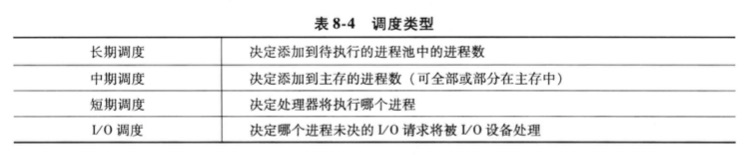

_## 计算机基础（主要来于书籍《计算机组成与体系结构：性能设计》）

### 导论
1. 计算机组成与体系结构
   1. 计算机体系结构是那些对程序员可见的系统属性，直接影响到程序的逻辑执行，包含指令集、各种数据类型的比特数、输入输出机制、内存寻址等
   2. 计算机组成是实现结构规范的操作单元及其相互连接，包括对程序员可见的应用细节
   3. 体系结构是规范，组成是细节实现。同一个体系结构的实现不同，性能和价格可能天差地别
   4. 通常来说，越小的机器，新旧机器的兼容性要求越少，组成与体系结构设计决策的关系就越紧密
2. 结构和功能
   1. 结构：部件相关联的方法
      1. 中央处理单元CPU：他控制计算机的操作并执行数据处理功能
         1. 控制单元CU：控制CPU以至于整个计算器的操作
         2. 算术逻辑单元ALU：执行计算机的数据处理功能
         3. 寄存器：提供CPU的内部存储
         4. CPU系统互联：提供控制器、ALU和寄存器之间的某种通信机制
      2. 主存储器：存储数据
      3. I/O：在计算器及其外部环境之间传输数据
      4. 系统互联：为CPU、主存储器和I/O之间提供一些通信机制。最常见的列子是系统总线
   2. 功能：作为结构组成部分的单个独立部件的操作。概括为：数据处理、数据存储、数据传送、控制（通用为主，专用功能由编程完成）

### 计算机的演变和性能
1. 计算机简史
   1. 第一代：真空管，由导线、金属片、玻璃外壳和真空管构成
      1. ENIAC：第二次世界大战时，美军的弹道研究实验室在提供数据表的精确性和及时性遇到困难
         1. 1943年启动，1946年建成。计算器重40吨、占地1500平方英尺、共1.8w+真空管，功率达140kW，每秒可执行5000次加法，于1995年拆除
         2. 十进制机器。存储器包含20个累加器，每个都能保存一个10位十进制数，每一位数由10个真空管环标识。任何时候，仅有一个真空管处于ON状态，标识10个数字重的一个
         3. 必须手动编程，一切都要通过设置开关和插拔电缆头来实现
         4. 它的第一个任务是完成一系列复杂的运算，以帮助判断氢弹的可行性
      2. 冯.诺依曼机
         1. 1946年启动（被称为IAS计算机），至1952年仍未完成，却成为了通用计算机的原型
         2. IAS计算机包含1000个存储单元，它们被称为字，每个字有40bit。指令和数据都存储在此，数据被表示为二进制形式，指令是二进制编码
         3. 控制器通过一次从存储器取一条指令并执行它的方式来操作IAS，
         4. IAS反复执行指令周期来运行，每个指令周期由2个字周期组成
            1. 在取指周期中，下一条指令的操作码装入IR，地址部分装入MAR。指令从IBR或存储器获取，即先从存储器装载一个字到MBR，然后将该字解开放入IBR、IR和MAR。为什么不直接获取？因为这些操作都是由电子电路控制并且导致数据路径的使用，为了简化电路，只有一个寄存器来指定存储器读写的地址，而且也只有一个寄存器来存放数据源或目标
            2. 一旦操作码存入IR，则进入执行周期。控制电路翻译操作码，并通过发送相应的控制信号来执行指令，这些信号控制数据的发送和ALU操作的执行。
            3. IAS一共21条指令，可分为5类
               1. 数据传送：在存储器和ALU的寄存器之间或在两个ALU寄存器之间传送数据
               2. 无条件转移：通常，控制器按照顺序执行存储器的指令，但这个顺序能通过跳转指令加以改变，以便执行重复的操作
               3. 条件转移：可以依据条件来决定是否跳转，从而选择从何处跳转
               4. 算术运算：由ALU完成的操作
               5. 地址修改：允许在ALU中计算地址，并将它插入存储器的指令中，为程序寻址带来很大的灵活性
               6. 
      3. 商用计算机：Sperry、IBM
   2. 第二代：晶体管。单个独立封装的晶体管(晶体管、电阻、导线)称为分立元件，分立元件独立制造，封装在自己的容器中，然后一起焊接到或连接到纤维板上，最后安装到电子设备中。整个制造过程昂贵且麻烦
      1. IBM 7049是二代计算机的代表，它有两个特点
         1. CPU通过给数据通道（数据通道指独立的IO模块，具有自己的处理器和指令集）发送一个控制信号来初始化IO传送，数据通道独立的执行它的任务，并在操作完成后通知CPU
         2. 多路复用：他是数据通道、CPU、内存的中心连接点。多路器调度CPU和数据通道对内存的访问，允许这些设备独立运行
         3. 
   3. 集成电路
      1. 微电子技术
         1. 存储器位元是一个能够存储一位数据的元件，任意时刻都处于两个稳定状态之一。将大量的基本元件连接起来，就能建造一台计算机。
            1. 数据存储：由存储器位元提供
            2. 数据处理：由逻辑门电路提供
            3. 数据移动：部件间的通路用于将数据从内存传送到内存，或从内存通过门电路再传送给内存
            4. 控制：部件间的通路传输控制信号
         2. 晶体管、电阻、导线都可以用硅之类的半导体制成，将整个电路安装在很小的硅片上而不是用分立元件搭成的等价电路，一块硅晶片上能同时制造很多个晶体管，通过金属化过程相互连接，以形成电路
         3. 一块薄硅晶片话费由多个小区域排列而成的阵列，每个区域有几平方毫米，他们上面都有相同的电路。这块镜片被划分成许多块芯片，每块芯片都包括许多逻辑门或存书单元，以及许多输入输出连接点，然后封装这块芯片，使之得到保护，并加上引脚，用以连接芯片外部的其他设备。许多这样的集成电路块可以连接在印刷电路板上，产生更大、更复杂的电路
         4. 
         5. 上图描述了集成电路的关键概念，和密度的增长。起初，只有几个门和存储单元可以可靠的制造并封装在一起，被称为小规模集成电路SSI，后期几乎直线增长，Intel合伙创办人高登.摩尔提出摩尔定律：
            1. 在芯片集成度快速增长的期间，单个芯片的成本几乎没有变化，这意味着计算机逻辑电路和存储器电路的成本显著下降
            2. 因为在集成度更高的芯片中逻辑和存储器单元的位置更靠近，电子线路长度更短，所以提高了工作速度
            3. 计算机变得更小，更容易放置在各种坏境中
            4. 见笑了电能消耗和对冷却的要求
            5. 集成电路内部的连接比焊接更可靠
      2. IBM System/360（大型机）
         1. 与占据了市场的IBM 7000并不兼容，但360系列机相互兼容，取得了巨大的成功，360体系结构至今仍是IBM大型机的体系结构。系列机具有以下特征：
            1. 相同或相似的指令集
            2. 相似或相同的操作系统
            3. 更高的速度
            4. 更多的IO端口数
            5. 更大的内存容量
            6. 更高的成本
            7. 这不就是所谓的刀法精准吗？低端机砍掉一些配置...
      3. DEC公司的PDP-8（小型机，总线结构）
      4. 后续几代
         1. 集成电路规模
            1. 大规模集成电路LSI：一块集成电路芯片可放置1000个元件
            2. 超大规模集成VLSI：每个芯片10000个元件
            3. 巨大规模ULSI：超过1000000元件
         2. 存储器
            1. 20世纪50-60年代
               1. 存储器使用微笑的铁磁体环做成，直径越1/16英寸，这些小环掉在计算机内用细线做成的网格上
               2. 一个环（磁芯）的一种磁化方向代表1，另一个磁化方向则代表0
               3. 磁芯存储器速度相当快，读取1位只需百万分之一秒，但是价格贵、体加大，读出是破坏性的，会查处其存储的数据
            2. 1970年
               1. 仙童公司生产了第一个容量较大的半导体存储器，一块相当于单个磁芯大小的芯片，包含256位内存
               2. 半导体存储器读取1位只需70ns，而且是非破坏性的，但是每位的价格比磁芯更昂贵
            3. 1974年
               1. 半导体存储器每位的价格比磁芯更便宜，而且往后价格快速下跌，但物理存储密度不断增加。1K-4K-16K...16GB
         3. 微处理器
            1. 1971年，Intel开发了Intel 4004（4位），将一个CPU的所有原件都放在同一块芯片，微处理器诞生。
            2. 1972年，Intel开发了Intel 8008（8位）
            3. 1974年，Intel开发了Intel 8080（8位），是第一个通用微处理器
            4. 70年代末，出现通用16位微处理器
            5. 1981年，贝尔实验室和HP公司开发出32位单片微处理器。1985年，Intel退出32位微处理器Intel 80386
            6. 
   4. 
2. 性能设计
   1. 微处理器包含的技术
      1. 转移预测：处理器提前考察取自内存的指令代码，并预测哪条分支指令或哪组指令可能下一步会被执行，并将它们放入缓存，这样处理器就会一直处于繁忙之中
      2. 数据流分析：处理器通过分析那一条指令依赖其他指令的结果或数据，来优化指令调度。事实上，准备好的指令就可以被调度执行，不必按照原来的顺序，减少不必要的时延
      3. 推测执行：使用转移预测和数据流分析，一些处理器让指令在程序实际执行之前就推测执行，并将结果存储在临时空间。通过执行可能需要的指令，可以让处理器的执行机制尽可能的保持繁忙
   2. 性能平衡
      1. 起因：处理器的性能飞速发展，计算器其他关键部件并没有跟上。需调整组成和结构，以补偿各种部件之间的能力不匹配
   3. 芯片组成和体系结构的改进
      1. 处理器提速方法
         1. 提高处理器硬件速度
         2. 提高插入在处理器和主存之间的cache容量和速度
         3. 改变处理器的组成和体系结构以提高指令执行的有效速度
      2. 处理器提速阻碍
         1. 功耗：芯片上逻辑米和和时钟速度的提升，芯片消耗的功率密度随之提高，需解决散热问题
         2. RC延迟：电子在芯片上各晶体管间流动的速度受限于连接它们的金属线的电阻和电容。特别是，延迟随RC之积增长而增长。由于芯片上元件尺寸变小，互联线更细，从而电阻增加了；同时，线排列更紧密，电容也增大了
         3. 存储器滞后：存储器速度落后于处理器速度
      3. 演化策略
         1. 增加cache容量
         2. 处理器内指令执行逻辑越来越复杂，以允许处理器内指令并行执行
         3. 多核处理器
3. Intel x86体系结构的进展
4. 嵌入式系统和ARM
   1. 嵌入式系统：是计算机硬件、软件和可能附加的机械或其他部分的一种组合，用于执行特定的功能。在许多情况下，嵌入式系统是大型产品和系统的组成部分，例如轿车的刹车系统。它具有各种变化的需求和限制
      1. 从小到大的系统，意味着完全不同的成本限制，对优化和再利用有不同的需求
      2. 不严格的到非常严格的需求和不同质量要求的组合
      3. 从短到长的生命周期
      4. 不同的环境条件
      5. 不同的应用特征导致静态负载对动态负载、慢速对快速、计算密集型任务对交互密集型任务以及他们的组合
      6. 不同的计算模型，从离散事件系统到包含连续时间动态的系统
      7. 
   2. ARM：是一种由英国剑桥ARM公司设计的基于RISC的微处理器和微控制器序列
5. 性能评价
   1. 时钟速度和每秒指令数
      1. 系统时钟
         1. 产生：一般情况下，时钟信号由水晶振子产生，水晶振子在由动力供应时能产生一个连续的信号波。该波被转化为一个数字电压脉冲流，连续的供应给处理器电路。例如，1个1GHz的处理器每秒接受10亿个脉冲
         2. 速率定义：脉冲的速率被称为时钟频率，或时钟速度。2个脉冲之间的时间定义为周期时间。每增加一个脉冲或时钟被称为一个周期，或时钟滴答声。
         3. 时钟和处理器：时钟频率必须适应处理器的物理层。处理器的操作需要信号将其从处理器的一个元件传送到另一个元件。当信号被放在处理器内部的一根线上时，他将占用一些有限的时间量使电压水平平静下来，以便一个正确的值(0或者1)可用。这取决于处理器的物理层，有些信号可能比其他信号变化更快。因此，操作必须同步，以便适当的电信号值可为每个操作用到
         4. 其他说明：指令的指令包含很多歌离散的步骤，如取指、译码指令的各个部分、取和存数据以及执行算术和逻辑运算。有的指令只需几个周期，另一些需要几十个周期。当使用流水线时，多条指令同时被执行。因此，不同处理器的时钟速度不能代表性能
      2. 指令执行速度
         1. 通用度量1：每秒百万条指令（MIPS）
         2. 通用度量2：每秒百万条浮点操作（MFLOPS，通常用于科学计算和游戏应用）
   2. 基准程序：上述度量方式并不适用所有场景，另一种方式是写一组基准程序，在不同机器上运行，对执行时间做比较。
      1. 基准程序所需具备的一些特征（WEIC90定义）如下：
         1. 由高级语言编写，可以方便的应用于不同的机器
         2. 是各种特殊程序设计方式的代表
         3. 易于度量
         4. 由广泛的发行
      2. SPEC标准程序
   3. 阿姆达尔定律：运行在多核计算机上的软件必须适应高速并行执行环境，以利用并行处理的能力

### 计算机功能和互连的顶层视图
1. 计算机的部件
   1. 硬布线程序：如果要执行一种特定计算，需要构造一个专门用于特殊计算的逻辑单元的配置。将各种元件连接成所需配置的过程，可以看成是某种形式的编程。得到的"程序"以硬件方式存在，被称为硬布线程序
   2. 软件：构造一个具有算术和逻辑功能的通用结构。这组经验根据提供给他的控制信号，对数据执行各种功能。硬件的一部分翻译每条指令并且产生相应的控制信号。另外，还需要输入模块、存储指令和数据的模块，视图如下
      1. 
   3. 
2. 计算机的功能
   1. 指令读取与执行
      1. 计算机完成的基本功能是执行程序，程序是由存储在存储器的一串指令组成。指令的处理有2个步骤：读取指令，执行指令。一条指令所要求的处理过程被称为
      2. 某个指令的执行周期可能包含存储器的多次访问，或IO操作。在新的状态途中，对于任意给定指令周期，有些状态可能为空，有的状态可能出现多次。状态描述如下
         1. 指令地址计算iac：决定下一条将要执行的指令的地址，通常是前一条指令的地址加一个固定值
         2. 读取指令if：将指令从存储器单元读到处理器中
         3. 指令操作译码iod：分析指令，以决定将执行何种操作以及将使用的操作数
         4. 操作数地址计算oac：如果该操作包含对存储器或通过IO的操作数访问，那么决定操作数的地址
         5. 取操作数of：从存储器或IO读取操作数
         6. 数据操作do：完成指令需要的操作
         7. 存储操作数os：将结果写入存储器或者输出到IO
         8. 
         9. 
      3. 程序执行示例
         1. 程序：将存储器地址940与地址941的内容相加，结果放到地址941；处理器包含唯一的数据寄存器，被称为累加器AC；指令和数据都是16位长;
         2. 初始时，PC=300，取出第一条指令（16进制值为1940）装入IR，PC++（注意，此处忽略了MAR和MBR的使用）
         3. IR前4位（操作码，为16进制1）指出要装入累加器，剩余12位（地址码16进制940）指定从地址940装载数据。结果：将地址940的数据0003装入AC
         4. 从301取出下一条指令5941，PC++
         5. AC存放的内容和941单元的内容相加，结果放入AC
         6. 从302取出下一条指令2941，PC++
         7. 将AC内容存入941
         8. 
   2. 中断
      1. 描述：几乎所有的计算机都提供一种机制，其他模块如IO、存储器通过此机制可以中断处理器的正常处理。处理器挂起当前程序的操作，跳转服务于中断处理程序来相应，并且在设备服务完后恢复原来的执行
      2. 类型和产生的原因：
      3. 目的：提高处理器的效率，无需同步等待慢处理结果
      4. 多重中断的处理办法
         1. 禁止中断：处理器在处理中断时，可以忽略其他中断信号；这种处理方式没有考虑相对的优先级和时间紧迫的需要，可能会导致数据丢失
         2. 定义中断的优先级，且允许优先级高的中断引起低级中断处理程序本身本中断
   3. IO功能
3. 互连结构：计算器包含一组部件或3中基本类型的模块（处理器、存储器、IO），模块之间相互通信，因此必须有连接这些模块的通路
4. 总线互联
   1. 定义：总线是连接两个或多个设备的通信通路。总线的关键特征是共享传输介质（多个会混淆，同时只能有一个传输）。总线通常由多条通信路径或线路组成，每条线能传送代表1或0的信号
   2. 总线结构
      1. 分类
         1. 数据线：提供系统模块间传输数据的路径，组合在一起称为数据总线。一般包含32、64、128或更多的分离导线，线的数目称为宽度。因为每条线每次能传输1位。宽度是决定系统总体性能的关键因素
         2. 地址线：用于指定数据总线上数据的来源或去向。如果处理器从存储器读取一个字，则将字的地址放到地址线上。地址总线的宽度决定了系统能使用的最大的存储器容量。地址线也用于IO端口的寻址。地址线的高位用于选择总线上指定的模块，低位用于选择模块内具体的存储器单元或IO端口
         3. 控制线：用来控制对数据线和地址线的存取和使用。控制信号在系统模块之间发送命令和时序信号，时序信号指定了数据和地址信号的有效性，命令信号指定了要执行的操作。典型的控制信号如下：
            1. 存储器写：引起总线上的数据写入被寻址的单元
            2. 存储器读：使所寻址单元的数据放到总线上
            3. IO写：引起总线上的数据输出到被寻址的IO端口
            4. IO读：使被寻址的IO端口的数据放到总线上
            5. 传输响应：表示数据已经从总线上接受，或者数据已放到总线上
            6. 总线请求：表示模块需要获得对总线的控制
            7. 总线允许：表示发出请求的模块已经被允许控制总线
            8. 中断请求：表示某个中断正在悬而未决
            9. 中断响应：未决的中断请求被响应
            10. 时钟：用于同步操作
            11. 复位：初始化所有模块
         4. 为连接的模块提供电源的电源馈线
         5. 其他描述
            1. 如果一个模块希望向另一个模块发送数据，必须做2件事：获取的总线的使用权；通过总线传送数据
            2. 如果一个模块希望向另一个模块请求数据，必须做2件事：获取的总线的使用权；通过适当的地址线和控制线向另一模块发送请求，然后必须等待另一模块发送数据
            3. 从物理上来说，总线是多条平行的电导线，这些导线是卡或板上刻出来的金属线。总线延伸到所有系统部件，每一个系统部件都连接到总线的全部或部分线
      2. 多总线层次结构
         1. 单总线性能瓶颈
            1. 设备越多，总线长度越大，传输延迟越大
            2. 聚集的传输请求接近总线容量时，总线会成为瓶颈
         2. 
      3. 总线的设计要素
         1. 总线类型
            1. 物理专用：使用多条总线，每条与模块的一个子集相连接。优点是总线冲突减少，吞吐量高；缺点是增加了系统的成本和规模
            2. 分时复用：根据控制信号实现不同的功能。优点是布线少，节省成本和空间；缺点是每个模块需要更复杂的控制电路，可能导致性能降低
         2. 总线的仲裁方法：集中式总线控制器；每个模块包含访问控制逻辑，这些模块共同作用，分享总线。
         3. 时序
            1. 同步时序：总线上事件的发生由时钟决定。总线包含时钟信号线，他传送相同长度的、由0\1交替的规则信号的时钟序列。一次1~0传送称为时钟周期或总线周期。它定了一个时间槽，总线上其他所有设备都能读取时间线，而且所有事件都在时钟周期的开始时发生。示例如下
               1. 第一个时钟周期，初期将将存储器地址放到地址总线，并且可以声明各种状态线。一旦地址线上的信号稳定，处理器就会发出一个地址允许信号
               2. 对于读操作，处理器在第2个时钟周期开始时发出一个读命令。存储器模块识别地址，延迟一个周期后，将数据放到数据线上，处理器从数据线读取数据，并且撤销读信号
               3. 对于写操作，处理器在第2个周期开始时将数据放到数据线上，并且在数据线稳定后发出一个写命令。存储器模块在第3个时钟周期从数据线上复制信息
               4. 
            2. 异步时序：总线上一个事件的发生取决于前一个事件的发生
               1. 对于读操作
                  1. 处理器发送地址信号和状态信号到总线上，待这些信号稳定后，它发出读命令，指示有效地址和控制信号的存在。
                  2. 相应存储器译码地址并将数据放到数据线上。等到数据线上的信号稳定，则存储器模块确认信号有效，以便通知处理器数据可用
                  3. 一旦处理器从数据线上读取数据后，它立即撤除读信号，这会引起存储器模块撤除数据和确认信号
                  4. 一旦确认信号撤除，处理器则删除地址信息
               2. 对于写操作：总线的主控者将数据放到数据线上，与此同时启动状态线和地址线。存储器模块通过从数据线上复制数据来响应写命令，并使确认线上的信号有效。然后主控者撤除写命令信号，而存储器撤除确认信号 
               3. 
            3. 总线宽度
            4. 数据传输类型
               1. 总线在等待获取获取控制权时，会有一定的延迟。部分设计允许一些"原子操作"，如"读-修改-写"，"写后读"，"块
               2. 
5. 外设部件互联PCI
   1. 简介
      1. 定义：是一种高带宽、独立于处理器的总线，它能够作为中间层或外围设备总线。它是转慢为满足现代系统IO要求而设计的较经济的总线，实现它只需要很少的芯片，而且它支持将其他总线连接到PCI上
      2. 来源：Intel在1990年为Pentium系统开发PCI，结果被广泛的采纳
      3. 单处理器PCI：DRAM控制器与到PCI总线的桥接器相结合，提供了与处理器更紧密的耦合，同时提供高速传输数据的能力
      4. 多处理器PCI：一个或多个PCI总线通过桥接器连接到处理器所在的系统总线上。系统总线只支持处理器/高速缓存单元、主存储器及PCI桥接器。桥接器的使用保证了PCI独立于处理器，同时又提供快速传送或者接收数据的能力
      5. 
   2. 总线结构：PCI可配置成32位或64位。
      1. 49线PCI功能分组如下：
         1. 系统引脚：包括时钟和复位引脚
         2. 地址和数据引脚：包括32根分时复用的地址线和数据线
         3. 接口控制引脚：控制数据交换的时序，并提供发送端和接收端的协调
         4. 仲裁引脚：不同于其他PCI信号线，它们是不共享的线，每个PCI主控制器有自己的一对仲裁线，他们直接连到PCI总线仲裁器上
         5. 错误报告引脚：用于报告奇偶校验位及其他的错误
         6. 
      2. 51个可选信号线（上述49线是必须包含的）
         1. 中断引脚：他们提供必须请求服务的PCI设备。它们是不共享的，每个PCI设备有自己的中断线或连接到中断控制器的线
         2. 高速缓存支持引脚：用来支持在处理器或其他设备中能被高速缓存的PCI上的存储器
         3. 64位总线扩展引脚：包含32根分时复用的地址线和数据线。他们与必有的地址/数据线一起，形成64位的地址/数据总线。这一组线的其余线用于解释改传送地址和数据的信号并是指有效。最后，还有使两个PCI设备具备64位能力的两根线
         4. JTAG/边界扫描引脚：这些信号线支持IEEE标准1149.1中定义的测试程序
         5. 
   3. PCI命令
      1. 中断响应：是一条读命令，使设备作为PCI总线上的中断控制器
      2. 特殊周期：由发送端向一个或多个目标广播消息
      3. IO读、IO写、存储器读、存储器写、存储器读航、存储器读多行、存储器写和无效、配置读、配置写、双地址周期（由发送端来指示它使用64位寻址）
   4. 数据传送
   5. 仲裁
      1. PCI使用集中式的同步仲裁方法，竹工坊有独立的请求REQ信号和允许GNT信号。这些信号线连接到中央控制器上，使用"请求-允许"的握手联络方式来访问总线
      2. PCI规范没有指定仲裁算法，可以由设计方指定，如FIFO、轮转。

### 存储器（内部存储器）
1. 概述
   1. 存储系统的特性
      1. 存储位置：指存储器处于计算机的内部或外部。内部存储器通常指主存，还有一些其他形式，如处理器的局部存储器（寄存器）。外部存储器由外围存储设备组成，处理器通过IO控制器去访问它们。
      2. 存储容量：内部存储器通常用字节或字（8、16、或32位）来表示。外部存储器的存储容量通常也用字节来表示
      3. 传输单元：对于内部存储器，传输单元等同于输入和输出到存储器模块的数据线数，它等于字长，但通常更大，如64、128或256位。
      4. 存储方法：
         1. 顺序存取：存储器组织称许多称为记录的数据单元，它们以特定的线性序列方式存取。存储的地址信息用于分割记录和帮助索引。采用共享读-写结构，经过一个个的中间记录，从当前的存储位置移动到所要求的位置。因此，存取不同记录的时间相差很大。如磁带机
         2. 直接存取：也采用共享读-写结构。但是单个块或记录有基于物理存储位置的唯一地址。通过采用直接存取到达所需的块处，然后在块中顺序搜索、计数或等待，直到目的地址。同样，存取记录的时间相差很大。如磁盘机系统
         3. 随机存取：存储器每个可寻址的存储位置有唯一的物理编排的寻址地址。存取给定存储位置的时间是固定的。因此，任何存储位置可以随机选取、直接寻址和存取。如主存、某些高速缓存系统
         4. 关联存取：是随机存取类的存储器，它允许对一个字中的某些指定位进行检查比较，是否与特定样式匹配。因此，字是通过它的内容而不是地址进行检索。与随机存取相同，每个存储位置有自己的寻址机制，并且检索时间是固定的，不依赖于存储位置或前面的存取方式。如高速缓存
      5. 存取时间（延迟）：对于随机存取，是一次读或者写的时间；即从地址传送给存储器的时刻到数据被存储或使用花费的时间；非随机存取，是把读-写结构定位到所需要的存取位置所花费的时间
      6. 存储周期时间：主要用于随机存取，它是存取时间加上下一次存取开始之前所需要的附加时间。福建时间指用于瞬变的信号消失或数据破坏性读后的再生。存储周期时间与系统总线相关，而不是与处理器相关
      7. 传输率：数据传入或传出存储单元的速率。对于随机存取，t=1/周期时间；非随机存取t=avg+n/r，a为平均存取时间，n为位数，r为传输率
      8. 
      9. 其他概念
         1. 字：存储器的自然单元。字长通常与一个整数的数据位数和指令长度相等。
         2. 可寻址单元：地址位长度A和可寻址的单元数N之间的关系是2^A=N
         3. 传输单元：对于主存储器，这是指每次读出或写入存储器的位数。传输单元不必等于一个字或一个可寻址单元。对于外部存储器，数据的传送经常是比一个字大得多的单元来传送，即是所谓的块
         4. 物理类型：半导体存储器（易失、非易失）、用于磁盘和磁带的磁表面存储器（非易失）、光学和磁-光存储器
         5. 易失性存储器：电源开关断开时，信息自动衰减或丢失；非易失性存储器会一直保存
         6. 不可擦除存储器：不能修改，除非破坏存储单元。这种类型的半导体存储器被称为只读存储器ROM
   2. 存储器层次结构
      1. 存在的限制:存取时间越短，平均每位的花费就越大;存储容量越大，平均每位的花费就越小;存储容量越大，存取时间就越长
      2. 存储器层次结构
         1. 随层下降：每位价格下降，容量增大，存取时间变长，处理器访问存储器的频率降低
         2. 
         3. 上图中3层存储通常是半导体非易失性存储器。数据在各种外部的、大容量的存储设备上能存储更持久，如可移动磁盘。外部非易失性存储器也称为副主存储器或福村，他们常用语存储程序和数据文件，以文件或记录的形式而不是以字节或字的为程序员所使用。磁盘也可用于主存储器的扩展，称为虚拟存储器
         4. 层次结构中还包含其他形式的存储器，如IBM的扩展存储器，它可以和主存传输数据，但不能喝外存储器传送
         5. 也可以在层次结构中以软件形式加入附加层。主存储器一部分用作缓冲区，暂时保存写入磁盘中的数据，这种技术有时被称为磁盘高速缓存，它用2种方法改进性能：
            1. 磁盘写入以簇的形式写入，一次传输的数据量较大，而不是很多次小的数据传送，这改善了磁盘的性能，减少处理器的占用
            2. 某些指定输出的数据在转存到磁盘之间可被程序访问，这样，可以在高速缓存中检索，而不是从相对慢的磁盘中检索
2. cache存储器原理（高速缓存）
   1. 描述：cache存储器的目的是使存储器的速度逼近可用的最快存储器的速度，同时以较便宜的价格提供较大的容量。
   2. cache/主存系统的结构
      1. 主存储器：由多达2^n个可寻址的字组成，每一个字由唯一的n位地址。为了实现映射，将主存看成许多个定长的块组成，每块由K个字，一共M=2^n/K个块
      2. cache包含m个块，称作行，每行包括K个字、几位标记、控制位。行的长度，不包含标记和控制位，称为行大小，最小为32位。行的数量远小于主存储器的数目即m<<M，因此行中有标记识别指向存储的那一块。这个标记通常是主存储器地址的一部分
      3. 
   3. 读操作，假设处理器产生一个要读取字的地址RA
      1. 当cache命中，数据缓冲器和地址缓冲器都不器用，通信只在处理器和cache之间进行，此时系统总线上没有信号传输
      2. 当cache未命中时，所需求的地址被加载到系统总线上，数据通过数据缓冲器提交给cache和cpu（并行提交，有的组织结构中，读取的字节会先提交到cache，再由cache提交给cpu）
      3. 
3. cache设计要素
   1. cache地址：使用了虚拟内存的系统，允许程序在逻辑上访问更多的地址。为了从内存中进行读写操作，硬件存储器管理单元MMU将每个虚拟地址
   2. cache容量：容量小便宜稍快，容量大昂贵稍慢，同时还会受到芯片和电路板体积的限制
   3. cache映射：因为cache行比主存的块少，因此需要一种算法来实现主存块到cache行的映射，还需要一种方法确定当前哪一块占用了cache行。假设cache=64KB=16K行，行=4byte，主存=16MB=4M行
      1. 直接映射
         1. i = j mod m;i=cache行号，j=主存储器块号，m=cache的行数；
         2. 每一个主存地址由3个域组成，最低的w位表示某个块中唯一的一个字或字节；剩余s位指定了主存2^s个块中的一个；cache逻辑将s位转换为s-r位的标记域和一个r位的行域，r位标识了m=2^r个cache行的一个
         3. 
         4. m=4K=2^14,j=4M=2^24;cache系统用24为地址来表示，14位行号用来做特定行的索引，如果8位标记与当前存储在该行的标记数相匹配，则用2位自豪来选取行中的4个字节。否则，22位的标记加行号号域被用来从主存中取出一块。取主存块所用的实际地址是22位的标记加行号再接两位0，因此，在块的边界起始处读取4字节
         5. 
         6. 缺点：对于任意给定的块，它所对应的位置是固定的。如果一个程序访问交叉访问映射到同一行的多个块，cache命中率极地
         7. 解决办法：Victim cache是以一种全关联cache，存储量一般为4-16个cache行，置于直接映射的第一级cache和下一级存储器之间
      2. 全相联映射
         1. 它允许每个主存块装入cache中的任意行。
         2. cache逻辑控制将存储地址标识为一个标记域（用来唯一标识一个主存块）加一个字域，并允许同时对每一行中的标记进行检查
         3. 地址中无对应行号的字段，所以cache行号不由地址格式决定
         4. 缺点是：需要复杂的电路来并行的检查所有cache行标记
         5. 
      3. 组相联映射（实际使用较多）
         1. 是直接映射和全相联映射的一种折中实现
         2. cache=m行=v组*k行；组号i=主存块号j mod v；
   4. cache替换算法
      1. 最近最少使用算法LRU（最常用）
      2. 先进先出FIFO
      3. 最不经常用LFU
      4. 随机失效
   5. cache写策略
      1. 写直达：所有操作同时对主存和cache进行，以保证主存中的数据总是有效的。任何其他处理器-高速缓存模块监视对主存的访问。缺点是产生大量的存储通信量，可能产生瓶颈
      2. 写回法：只更新cache的数据。当更新操作发生时，需要设置与该行相关的脏位或使用位。当一个块被替换时，当且仅当脏位被置位时才写回主存。缺点是部分主存的数据是无效的，IO模块的存取只允许通过cache进行进行，电路更加复杂
      3. 缓存一致性问题：多处理器有各自的cache且共享主存的总线结构中，如果某个cache的数据被修改，会使得主存中响应字无效，而且其他cache的对应字无效。对应方法有：
         1. 写直达的总线检测：每个cache控制器监视地址线，以检测总线的其他主控者对主存的写操作。如果有另一个总线主控者向共享存储单元写入数据，而这个单元同时驻留在cache中，该cache控制器使cache的这一项无效。这一策略要求cache控制器都使用写直达策略
         2. 硬件透明：使用附加的硬件来保证所有通过主存的修改反映到所有的cache中，因此，如果某个处理器修改了自己cache中的一个字，则会同时修改主存对应单元，任何其他cache中相同的字也同时会被修改
         3. 非cache存储器：只有一部分主存为多个处理器共享，称为非cache，共享存储器的数据不回复知道cache中。非cache存储器能采用片选逻辑或高地址位来标识
   6. cache行大小：当一个数据块被索引并放入cache中时，所需的字和一些相邻的字都会被取出。当块由很小变得较大时，命中率因局部性原理增加；随着块增加且使用新取信息的概率小于重用已被替换掉的信息概率时，命中率开始下降。该值是一个平衡值，一般为8-64B，HPC常用行大小64B和128B
   7. cache数目
      1. 多级cache：L2容量通常为L1两倍时，效率由明显提升；L3总是能使性能明显提升
      2. 统一与分立cache（趋势）
         1. 统一cache：cache即存放数据，又存放指令；优点是有更高的命中率，在获取指令和数据的负载之间自动进行平衡，而且只需设计一个cache
         2. 分立cache：设计两个L1 cache，分别存放指令和数据；优点是消除了cache在指令的取指/译码单元和执行单元的竞争，这对于基于指令流水线的设计是很重要的。通常处理器会提前获取指令并装入缓冲区或流水线。统一cache在访问数据时会导致阻塞。如Pentium和PowerPC
   8. 
4. Pentium 4的cache组织
   1. 
   2. 
5. ARM的cache组织
   1. 

### 内部存储器
1. 半导体主存储器
   1. 组织：基本元件是存储位元。
      1. 各种电子技术下所有的半导体存储位元都具有相似的性质：
         1. 呈现2中稳态（或半稳态），分别代表二进制的1和0
         2. 能够写入信息（至少一次）来设置状态
         3. 能够读出状态信息
      2. 每个存储位元有3个能传输电信号的功能端，其内部结构、功能、时序的细节依赖于特定的集成电路技术。图例如下：
         1. 存储位元有一个select端口用于为读/写选择一个存储位元
         2. control端口用于指明是读还是写操作
         3. 对于写操作，Data-In提供设置位元状态为1或0的电信号；对于读操作，Sense端口用于输出位元的状态
         4. 
   2. DRAM和SRAM
      1. DRAM：利用电容充电来存储数据，位元中的电容有、无电荷代表二进制的1或0。因为电容有漏电的趋势，因此动态RAM需要周期地充电刷新来维持数据的存储
         1. 写入或读出该位元的值时，晶体管像开关一样工作。如果有电压施加到地址线上，晶体管疏通，否则开路
         2. 写入时，一个电压信号施加到位线上，高电压代表1，低电压代表0，然后一个信号施加到地址线，允许电荷传输到电容器
         3. 读出时，当地址线被选中，晶体管道统，存储在电容上的电荷被送出到位线和读出放大器。读出放大器将此电容电压与一参考值相比较，并确定位元保存的事逻辑1还是逻辑0。位元的读出放掉了电容上的电荷，必须重新存储才算完成本次操作
         4. 虽然DRAM能用来存储1或者0，但它本质上是一个模拟设备。因为电容能存储一定范围内的任何电荷值，必须使用一个阈值来确定该电荷的值是1还是0
      2. SRAM：是一个数字设备，采用与处理器相同的逻辑元件。SRAM采用传统的触发器、逻辑门来存储二进制值，只要电源不断，将一直保存存储的数据
         1. 如下图，4个晶体管交叉连接成一个具有稳定逻辑状态的排列。
         2. 在逻辑状态1下，C1是高电平而C2是低电平，T1和T4截止，T2和T3导通；在逻辑状态0下，则相反
         3. SRAM用地址线来控制开关的通断。当新到施加到地址线上，T5/T6导通，允许读写操作。对于写操作，位值施加到B线，位值的反施加到B1线；对于读操作，位值由B线读出
      3. 
   3. ROM存储器
      1. 应用场景：微程序设计、常用功能的子程序库、系统程序、函数表
      2. 制造ROM同制造其他集成电路芯片是一样的，在制造过程中把数据固化到芯片上，存在2个问题
         1. 固化数据需要较大的成本，无论是制造一片还是复制上千片特殊的ROM
         2. 无出错处理机会。如果一位出错，则整批的ROM芯片只能报废
      3. 可编程ROM：非易失性，仅能写入一次。写过程由电信号执行，由供应商或用户在出厂后写入一次。需要特殊设备来完成写或编程过程
      4. 主要进行读操作的存储器，常用语读远多于写的场景。一般分为3种：
         1. 光可擦除/可编程只读存储器EPROM：可读可写。写入之前，必须让封装芯片暴露在紫外线辐射下使所有存储位元素被擦除，以还原成初始状态，每次擦除需20分钟左右。相对PROM更昂贵
         2. 电可擦除/可编程只读存储器EEPROM：任何时候可写入，无需擦除，且只更新寻址到的一个或多个字节。写操作比读操作耗时长很多，每字节需几百微秒。比EPROM更贵，且密度低，支持小容量芯片
         3. 快闪存储器：使用电擦除，可擦除部分块（非字节），通常在几秒内可完成擦除。密度同EPROM，价格介于上两者之间
   4. 芯片逻辑
      1. 经典的16Mb DRAM结构一次读或写4位，逻辑上组织成4x2048x2028的方阵，可以采用各种物理排列
      2. 在任意情况下，阵列元素由行控制线或列控制线链接，每根行控制线连接到它所在行每个位元的select端口，每根列控制线连接到相应列中每个位元的Data-In/Sense端口
      3. 地址线提供了被选择字的地址，总共需要log2W。下图中，需11根地址线来选择2048行中的一行，这11根地址线连接到行译码器的输入线，行译码器有11根输入线和2048根输出线，其逻辑根据11根输入线的位模式激活2048根输出线的一根。2^11=2048
      4. 另外的11根地址线可选中2048列中的一列，每列由4位组成。4根数据线用于与数据缓冲器交换4位数据。输入写时，每根位线的位驱动器根据相应数据线被激活为1或0；读取时，每根位线的值通过读出放大器，传递到数据线上。行线选择哪一行的位元参与读或写操作
      5. 此DRAM每次只有4位位元参与读/写，必须将多片DRAM连接到DRAM控制界才能读写一个字到总线上
      6. A0-A10地址线复用，先后将地址信号通过芯片去定义行、列地址，伴随着这些信号有行地址选通RAS和列地址选通CAS信号，为芯片提供时序控制信号
      7. 写允许WE和输出允许OE引脚确定完成的是写或读操作，另外两个引脚电源和地未在图中标记
      8. 此外，地址线的复用和方阵型行列结构，导致没出现新一代存储器芯片，容量以4倍增长。因为行列各增加一位，容量x2x2=4
      9. 简单刷新技术是使DRAM芯片丧失读写能力而刷新所有数据位元。刷新计数器编译所有行，对每一行，刷新计数器的值倍当作行地址输出到行译码器，并且激活RAS线，数据被读出后又协会到原地址，从而使相应行所有位元被刷新
      10. 
   5. 芯片封装
      1. EPROM示例（1Mx8）
         1. 被访问字的地址 20根引脚。2^20=1M
         2. 读出的数据，包含8根线，每次读8位
         3. 电源、地线、程序电压（写操作时提供）
         4. 芯片允许CE引脚。因为可能存在多个存储器芯片，每片都连接到相同的地址总线，CE用于知识地址线上的地址是否对本芯片有效
      2. DRAM示例（4Mx4）
      3. 
   6. 模块组织（略）
   7. 多体交叉存储器：主存储器由多块DRAM芯片组成，大量芯片组合形成多体交叉存储器。每个存储器可以单独的提供读或写服务，最高达到N倍
2. 纠错
   1. 故障分类
      1. 硬故障：因坏境、制造缺陷、旧损引起的永久性的物理故障，以至于受影响的存储单元不能可靠的存储数据，成为固定的1或0，或者在两者间不稳定的跳动
      2. 软差错：因电源或者粒子因放射性衰减导致的随机非破坏事件
   2. 检查和纠错（校验码的空间哪里来？）
      1. 数据写入存储器时，对数据进行某种计算，以产生一个校验码，数据和校验码同时存储
      2. 读取数据时，对M位数据产生一组K位校验码，与取出的校验码相比较，有3种结果
         1. 没有检测到差错，取出的数据位传送出去
         2. 检测到差错，并且可以纠正，数据为和纠错位一起送入纠正器，然后产生一组正确的M位发送出去
         3. 检测到差错，但无法纠正，报告这种情况
         4. 
   3. 汉明码（略）
3. 高级DRAM组织
   1. 传统DRAM：处理器将地址信号和存储信号提供给存储器进行读写时，需经过一段延迟。延迟时，DRAM执行各种内部功能，处理器只能进行等待
   2. 同步DRAM：简称SDRAM，它与处理器交换的数据交换同步于外部的时钟信号，并且以处理器/存储器总线的最高速度运行，而不需插入等待状态。同步机制下，SDRAM在系统时钟控制下输入输出，处理器或其他主控器发出指令和地址信息，会被SDRAM锁定，在几个时钟周期后响应
   3. 双倍速率的SDRAM：简称DDR DRAM。突破每周期一次的限制，每周期能向处理器传送两次数据，分别在时钟脉冲的上升沿和下降沿。（这就是内存条的DDR3，DDR4...）
   4. Rambus DRAM：SDRAM的最大竞争对手。它的芯片是垂直封装的，所有的引脚都在一侧，芯片通过28根不超过12cm的线与处理器交换数据。总线最多寻址320块RDRAM芯片，速率达1.6G/s。折中特殊的总线使用异步的面向块的协议来传送地址信息和控制信息，非常精确的定义了阻抗、时序和信号，而不是传统的RAS等信号
   5. cache DRAM：在常规DRAM集成一个小的SRAM。SRAM可以作为cache使用，每行由64位组成，对于普通存储器的随机存取非常有效；SRAM还可以用作支持串行存储数据块的缓冲器

### 外部存储器
1. 磁盘
   1. 简介：是一种由非磁性材料制成称为衬底的圆盘，涂上一层磁性材料。衬底一直使用铝或铝合金材料，后续增加了玻璃衬底，优点为：
      1. 改善磁层表面的均匀性，从而增强了磁盘的可靠性
      2. 显著的减少了整个表面的缺陷，从而有助于读写错误的减少
      3. 能支持更低的磁头飞行高度
      4. 更好的刚度，从而降低磁盘动力需求
      5. 更好的耐冲击和耐磨损能力
   2. 磁读写机制
      1. 读和写都是通过一个叫做磁头的导电线圈进行的，多数系统使用2个磁头，一个读磁头，一个写磁头。在读写期间，磁头静止不动，而盘片在非常靠近磁头的下方高速旋转
      2. 写机制用了电流流过线圈时产生磁场这个效应，脉冲电流送入写磁头，形成的磁化模式被记录在其下的磁盘表面上，正负电流产生不同的磁化模式。磁头结构：
         1. 写磁头是一个由易磁化的材料组成的矩形环，一侧开有缝隙，而相对的另一侧饶有数圈到导线。
         2. 线圈中的电流在缝隙间感应出一个磁场，此磁场在记录介质上磁化出一个小域
         3. 改变电流的方向，磁域的磁化方向也随之改变
      3. 传统读利用磁盘相对线圈运动时在线圈产生电流这个效应，当磁盘表面在磁头下经过时，产生一个与数据记录电流相同的电流，本质上与写磁头相同。因此可读可写，这种单磁头结构主要用于软盘系统和老式硬盘系统
      4. 当代硬盘系统使用了单独的读磁头，通常紧靠写磁头安装。读磁头由一部分被屏蔽的磁阻传感器MR组成。MR材料的电阻大小取决于它下面运动的介质的磁化方向。让电流经过MR传感器，电阻的变化作为电压信号被检测出来。MR设计允许更高频率的操作，等于更高的存储密度和更快的操作速度
      5. 
   3. 数组组织和格式化
      1. 磁头能从处于其下方的盘片上读取数据或写入数据，攀上的数据呈现为一组同心圆环，圆环被称为磁道。每个磁道与磁头同宽，每个盘面有数千个磁道。相邻磁道有间隙，可以防止或减少由于磁头未对准或磁域干扰所引起的错误
      2. 数据以扇区为单位传入或传出。每个磁道有数百个扇区，其长度可固定也可变化。大多数系统使用固定长度的扇区，长度为512字节。为避免对系统提出不合理的定位精度要求，扇区之间也留有间隙
      3. 
      4. 靠近旋转盘中心的位经过一固定点（如读-写磁头）的传输要比盘外沿的慢，因此需要做一些补偿使磁头以同样的速度读取所有的位
         1. 恒定角速度CAV：盘面被划分成一串同心圆和多个饼形扇区，能够以磁道号和扇区号来直接寻址各个数据块。只需将磁头径向移动到指定磁道，然后等待扇区转到指定磁头下，整个耗时很少。但缺点是外围磁道和内圈的磁道所存储的数据一样多
         2. 多重区域记录：将盘面划分成多个（通常是16）区域。每个区域中磁道数是很定的，远离中心的区域比靠近中心的区域容纳更多的扇区。基于此，可用稍微复杂的电路提升存储容量
         3. 
      5. 控制数据：磁道必须有一些起始点和辨识每个扇区的起点和终点的方法，由记录在磁盘上的控制数据来处理。磁盘格式化时，会保留一些仅被磁盘驱动器使用而不被用户存取的额外数据
      6. 格式化示例：每个磁盘包含30个固定长度的扇区（600字节，512字节数据+控制数据）。ID是唯一标识或地址，用于定位具体的扇区。同步字节是一个特殊的位模式，用于定义区域的起始点。磁道号标识磁盘表面的一个磁道。磁头号标识一个磁头，因为磁盘有多个面。ID和数据区域各包含一个检错码
      7. 
   4. 物理特性
      1. 磁头在磁盘的径向上既可以固定也可以是移动的。在固定头磁盘，每个磁道有一个读写头，所有磁头安装在跨越所有磁道的固定支架上；可移动头磁盘上，只有一个读写头，固定在支架上，但支架可伸缩，使磁头能定位到任何磁道上
      2. 磁盘安装在磁盘驱动中，驱动器由支架、带动盘片旋转的主轴和二进制数据输入/输出所需的电路组成。不可更换永久安装在驱动器内，如个人计算机的硬盘；可更换磁盘可取出，可替换，如软盘和ZIP盒式磁盘
      3. 大多数磁盘双面都是可磁化的磁盘，称为双面磁盘；一些低价位的磁盘系统使用单面磁盘
      4. 某些磁盘驱动器垂直安装多个盘片，间隔约1英寸，同时安装多个支架，多盘片磁盘使用可移动磁头，每面有一个读写磁头，所有磁头被机械固定，以便和盘片中心等距离并一起移动。任何时刻，所有磁头与盘片中心等距离的各面磁道上，所有盘片上相同的相对位置的一组磁道被称为柱面
      5. 
      6. 磁头机制分3种
         1. 传统上，读写磁头放在盘片上放的固定距离，允许有一个气隙
         2. 读写磁头在操作时与磁表面有物理接触，这种机制用于软盘，容量小、使用灵活、价格便宜
         3. 磁头只有能产生感应有足够强度的电磁场才能恰当的进行读或写操作，磁头越窄，离盘面越近才能起作用。较窄的磁头意味着较窄的磁道，因此有较大的数据密度。但是由于磁盘介质不纯或缺陷，离盘面越近，出错率越高。温彻斯特磁盘将磁盘封装在几乎无污染的密封装置中，比常规磁头更贴近磁盘表面
      7. 
   5. 磁盘性能参数
      1. 寻道时间：移动磁盘臂到所要求的磁道花费的的时间。包含两部分：初始启动时间和一旦访问臂加速到指定速度后还必须跨越若干磁道所用的时间。跨越时间不是线性时间，还包含校正时间（磁头从定位到目标磁道至磁道标识被证实的一段时间）。目前平均寻道时间低于10ms
      2. 旋转延迟：对于20000转/分的转速而言，则是3ms转一圈，平均旋转延迟为1.5ms
      3. 传送时间：
         1. 硬盘数据传送时间与旋转速率关系为T=b/rN,T为传送时间，b为传送的字节，N为每磁道的字节数，r为旋转速率，单位是转/秒
         2. 总的传送时间T=t1+1/2r+b/rN，T为总时间，t1为平均寻道时间。注意，对于多带记录式磁盘，因为每磁盘的字节数会变化，计算会变复杂
         3. 假设，平均寻道时间为4ms，平均旋转延迟2ms，读500个扇区耗时4ms，转速为15000rpm，每磁道500扇区，每扇区512B，读取一个由2500扇区组成的总长为1.28MB的文件。
         4. 假设文件是紧凑的，只有第一次需要寻道。t=（4+2+4）+4x（2+4）=34ms
         5. 假设每一个扇区随机分布的，每次都需要寻道。t=2500x(4+2+4/500)=15020ms
      4. 寻道时间加旋转延迟的总和称为存取时间，整个操作数据的数据传送部分所需时间称为传送时间。出自之外，还有几个和磁盘IO有关的队列延迟
         1. 当进程发起IO请求后，它首先要在一个队列中等待所需设备变为可用，直到此设备被分配给该进程
         2. 如果该设备与其他磁盘驱动器共享一个或一组IO通道，还可能有附加的等待，等待相关通道变为有效
      5. 旋转定位监测RPS：当寻道命令已发出时，释放它所占据的IO通道去处理其他IO操作；当寻道操作完成时，设备确定所需数据何时转到磁头下；当所需扇区接近磁头时，设备设法重新建立与主机通信的路径。如果控制器通道正在忙于处理其他IO，则重连接失败，并且设备必须旋转一周后才能试图重链接，称为一次RPS失效
      6. 
2. RAID
   1. RAID标准3个特性
      1. RAID是一组物理磁盘驱动器，在操作系统下被视为一个单一的逻辑驱动器
      2. 数据以条带化的方式分布在一组物理磁盘上
      3. 冗余磁盘容量用于存储奇偶校验信息，保证磁盘万一损坏时能恢复数据
   2. 描述
      1. 处于一篇由加州大学伯克利分校的研究小组的论文
      2. RAID使用多个磁盘驱动器来分布数据，以便能同时从多个磁盘中存储数据，改善了IO性能，并且更方便增加磁盘容量
      3. RAID的独特贡献的解决了对冗余的需求。为了解决多设备增大的出错概率，使用奇偶校验信息来恢复因磁盘损坏而丢失的数据
      4. 
      5. 
   3. RAID级别
      1. RAID 0级
         1. 非RAID真正成员，不使用冗余来改善性能。适用于超级计算机等低成本比可靠性更重要的场景
         2. 数据可看作存储在逻辑磁盘上，磁盘以条带的形式划分，这些条带可以为物理的块、扇区或其他单位。数据条带以轮转的方式映射到RAID阵列中连续的物理盘。一组逻辑上连续的条带被定义为条带集，它准确的与磁盘中一个条带相映射
         3. 如果单个IO请求由n个逻辑相邻的条带组成，最多可能对n个条带并行处理，减少IO时间
         4. 
         5. 用于高速数据传输必须满足2个要求
            1. 高速传输能力必须存在于主存和各独立磁盘之间的整个路径上，它包含内部控制器总线、主系统IO总线、IO适配器和主机存储器总线
            2. 应用必须使驱动磁盘阵列的IO请求有效。数据分散在多个磁盘，并发请求
         6. 用于高速的IO请求
      2. RAID 1级
         1. 和RAID 2-6级的区别在于实现冗余的方法，只是简单的采用备份所有数据来实现冗余（它的每个逻辑条带映射到两个不同的物理磁盘组中，阵列中每个磁盘都包含相同数据的镜像盘），而不是奇偶校验。
         2. 优点
            1. 一个读请求可以由包含请求数据的两个磁盘中的某一个提供服务，只要它的寻道时间加旋转延迟较小
            2. 一个写请求需更新2个对应的条带，但可以并行完成，性能由较低者决定。RAID1无写损失，RAID2-6修改时，必须先计算，然后同时修改掉奇偶校验位
            3. 恢复一个损坏的磁盘很简单；当一个磁盘损坏时，数据仍能从第2个磁盘中读取
         3. 缺点
            1. 价格昂馈，需要2倍于逻辑磁盘的空间，一般只用于存储系统软件、系统和其他关键文件的驱动器中
            2. 读性能优秀，但是对于密集的写请求于RAID0相若
      3. RAID 2级
         1. 2级和3级使用了并行存取，所有磁盘成员都参与每个IO请求的执行。一般情况下，各个驱动器的轴是同步旋转的，每个磁盘上的每个磁头在任何时刻都处于同一位置
         2. 2级和3级的条带非常小，经常小到一个字节或者一个字。通常采用汉明码，它能纠正一位错误，检测两位错误，读取速度不会减慢。对于单个写操作，所有数据盘和奇偶校验盘必须被访问以️进行写
         3. 价格相对昂贵，冗余磁盘的数据与数据磁盘数目的对数成正比。RAID2只是一种在多磁盘易出错环境中的有效选择，对于单个磁盘和磁盘驱动器比较可靠的前提下，RAID2没有意义
      4. RAID 3级
         1. 组织方式和2级类似，但是只需要一个冗余盘。不采用纠错码，而采用对所有数据盘上同一位置的一组独立位进行简单计算的奇偶校验位
         2. 奇偶校验盘使用异或计算得到数据。当任一数据盘损坏时，访问奇偶校验盘，可由其余设备重构数据
         3. RAID3的数据被分成非常小的条带，所有能得到非常高的数据传输率，任何IO请求将包含所有数据盘的并行数据传送。对于大量传送，性能较好；但一次只能执行一个IO请求，在面向事务的环境中，性能将受损
      5. RAID 4级
         1. 4-6级都采用一种独立的存取技术。每个磁盘成员的操作是独立的，每个IO请求能够并行处理。适用于需要高速IO请求的应用，而较少高数据传输率的场合
         2. 对于较小规模写操作，阵列管理器必须读取旧的数据和奇偶校验条带，以生成新的奇偶校验条带。对于整个磁盘所有条带的更新，不需要额外的读写
         3. 任何情况下，写操作必定会涉及到奇偶校验盘，成为瓶颈
      6. RAID 5级
         1. 组织方式和4级类似，奇偶校验条带以轮转分配方案分布在多个磁盘，避免4级奇偶校验盘的IO瓶颈
      7. RAID 6级
         1. 采用2中不同的奇偶校验计算，并将校验码以分开的块存储在不同的磁盘，这种方式需要N+2块磁盘
         2. 提供了极高的数据可用性，读性能与5级相若，可承受超过30%写性能下降
      8. 
3. 光存储器
   1. 光盘
      1. CD-ROM
         1. 描述
            1. 和CD类似，更耐用，有纠错设备保证数据被正确的传输到计算机。由树脂制成，数据以一些列微凹坑的样式刻录在表面
            2. 先制造高强度激光制造母盘，压印复制品，再在凹坑镀一层高反射材料如铝、金，并在镀层上涂一层丙烯酸树脂以防尘或画上。最后在树脂层上用丝网印刷术印刷标签
            3. 驱动器使用低强度激光读取信息，光传感器根据反射强度判断是凹坑（1）或平面（0），转换成数字信息
            4. 不以同心圆组织信息，而是一条螺旋式轨道，所有扇区具有相同的长度。凹坑以恒信线速度读出，盘片在存储外沿时要比内沿旋转速度慢
         2. 结构（略）
         3. 适用场景：将大量数据发布给众多用户。初始的写过程开销较大，不适合单个应用
         4. 优点：比磁盘便宜；光盘是可换，硬盘大都不可换
         5. 缺点：只读；存储时间比磁盘驱动器长的多，约半秒钟
      2. CD-R：适应一组数据的一个或少数几个备份的应用，开发了一写多度CD，称为可刻录CD。适宜用于文档和文档的归档存储，它提供了大量用户数据的永久性记录
      3. CD-RW：能重写；具有较高的可靠性和较长的使用寿命
   2. 数字多功能光盘DVD：位组装更紧密，采用双层结构，能用两面记录数据。容量达17GB，而CD-ROM仅680MB左右
   3. 高清晰光盘HD DVD和蓝光DVD：前者单面可存储25GB，后者单面可存储25GB。蓝光DVD有3个版本，分别为只读BD-ROM、写入一次BD-R、可重复写BD-RE。
4. 磁带（略）

### 输入/输出
1. 外部设备
   1. 广义分类
      1. 认可度设备：用于与计算机用户通信，如视频显示终端和打印机
      2. 机器可读设备：用于与设备通信，如磁盘和磁带系统
      3. 通信设备：用于与远程设备通信
   2. 键盘/监视器：信息交换的基本单位是字符，长度一般是7位或8位，最常用的是IRA码。字符分为可打印字符，前者如数字、字母，后者如回车符。当用户按下某个键，键盘产生电信号，经键盘中的转换器与IRA对应的位模式，然后传送给计算机的IO模块。计算机输出与输入顺序相反
   3. 磁盘驱动器：包含两部分电子部件，一用于与IO模块交换数据、控制和状态信号，二是用于控制磁盘的读写机制
2. IO模块
   1. 模块功能
      1. 控制和定时：协调内部资源和外部设备之间的信息流动。控制从外设到处理器数据传输步骤如下
         1. 处理器查询IO模块，检查设备连接状态
         2. IO设备返回设备状态
         3. 如果设备运行正常，并准备就绪，处理器通过向IO模块发出一条命令，请求数据传送
         4. IO模块获取来自外设的一个数据单元，8位或16位
         5. 数据从IO模块传送到处理器
         6. 备注：如果系统采用总线，则每次处理器和IO模块之间的交互都会涉及一次或几次总线仲裁
      2. 处理器通信
         1. 命令译码：IO模块接受来自处理器的命令，这些命令一般作为信号发送到控制总线。如READ SECTOR（读扇区）、WRITE SECTOR（写扇区）、SEEK寻道，SCAN扫描。命令附带的参数会通过数据总线发送
         2. 数据：数据是处理器和IO模块经数据总线交互的
         3. 状态报告：因为外设速度很慢，所以直到IO模块的状态很重要。如BUSY忙、READY就绪等
         4. 地址识别：每个IO设备都有地址。IO模块必须能识别他所控制的每个外设的唯一地址
      3. 设备通信：包括命令、状态信息和数据
      4. 数据缓冲：因为主存和处理器的速度很快，许多外设的速度很慢。为了平衡两者的速度不互相影响，数据会保存在IO模块的缓冲器中
      5. 检错：将设备报告的机械和电路故障、信息从设备传送到IO模块时发生了变化的错误信息报告给处理器
   2. IO模块结构
      1. IO模块通过一组信号线连接到计算机其他部分
      2. 传送到IO模块或者IO模块输出的数据缓存在一个或几个数据寄存器中，同时有一个或几个状态寄存器提供当前的状态信息。状态寄存器也能作为控制寄存器，接收来自处理器的控制信息
      3. 模块内的逻辑通过一组控制线和处理器交互，IO模块也可以用它仲裁、传递状态信息
      4. 担负大量详细任务并为处理器提供高级接口的IO模块称为IO通道或IO处理器，通常用于大型计算机；一种相当基础并需要详细控制的IO模块被称为IO控制器或设备控制器，常用于微型机
      5. 
3. 编程式IO
   1. 描述
      1. 对于编程式IO：数据在处理器和IO模块之间交互，处理器可通过执行程序来直接控制IO操作，包括检测设备状态、发送读或写命令以及传送数据。当处理器发送一条命令到IO模块时，必须等待直到IO操作完成
      2. 对于中断式IO：处理器发送一条IO命令后，继续执行其他指令，并且在IO模块完成工作时，才去中断处理器工作
      3. 对于DMA：IO模块与主存直接交换数据，不需处理器的干涉
   2. IO命令：控制命令、测试命令、读命令、写命令
   3. IO指令：指令与命令一一映射，指令的形式取决于外设寻址的方式。通常有多个IO设备通过IO模块连接到系统，每个设备有唯一标识。当处理器发送命令时，命令包含设备地址，因此IO模块必须对地址线译码，确定命令是否发送给自己。当处理器、主存、IO共享一条公共总路时，有2种编址方式：
      1. 存储器映射式：存储单元和IO设备有单一的地址攻坚，处理器将IO模块的状态和数据寄存器看成存储单元，想用相同的机器指令来访问存储器和iO设备
      2. 分离式：IO的地址空间和存储器空间是分离的
      3. 
   4. 
4. 中断驱动式IO
   1. 
   2. 中断设计
      1. 多条中断线
      2. 软件轮询
      3. 菊花链（硬件轮询，向量）
      4. 总线仲裁（向量）
   3. Intel 82C59A中断控制器
   4. Intel 82C55A可编程外部接口
5. 直接存储器存取DMA
   1. 编程式IO和驱动式IO的不足：IO传送书读手处理器测试服务设备速度的限制；处理器负责管理IO传送，每一次IO都必须执行很多指令。问题：中断驱动式IO中，处理器减少了干预，为什么说IO传输率降低了？
   2. DMA：在系统总线上增加一个模块模仿处理器并接管了系统控制的工作，通过控制总线管理IO数据。DMA只能在处理器不需要总线时占用系统总线，或强制处理器暂时挂起。后一种技术更常用，称为周期窃取，即DMA模块有效的窃取一个总线周期。读写过程如下：
      1. 通过处理器与DMA模块之间的读/写控制线，说明是读/写操作
      2. 响应IO设备地址，经数据线传输
      3. 读或写操作的存储器起始单元地址，经数据线传输，并被DMA存入地址寄存器
      4. 读或写操作的字数，经数据线传输，并被DMA模块存入数据计数寄存器中
   3. 
   4. 
   5. 
6. IO通道和处理器
   1. IO功能的演变
      1. CPU直接控制外设，主要用于简单的微处理器控制设备
      2. 增加控制器或IO模块，处理器使用编程式IO而不是中断，使处理器从外设的特殊细节中脱离
      3. 采用上一种配置，但使用了中断
      4. 使用DMA
      5. IO模块称为有自主控制权的处理器，有处理IO的专用指令集。允许CPU指派一系列IO活动，并只在整个活动执行完成后才中断CPU
      6. IO模块带有局部存储器，成为自治的计算机。这种结构可以控制大量的IO设备而最小化了CPU的干涉，常用于与交互式终端进行通信。IO处理器负责大部分任务，包括控制终端
   2. IO通道的特点
      1. IO通道是DMA的扩充，它使用一个专用处理器执行IO指令（存储在主存）来控制IO操作，而不需要CPU执行。程序将指定一个或几个设备、一块或几块存储器区域、优先级及出错处理行为，IO通道执行这些指令来控制数据传送
      2. IO通道通常有两种类型
         1. 选择通道：它控制多个高速设备，但每次只与其中一个设备进行数据传送，即IO通道选择一个设备进行有效数据传送
         2. 多路通道：同时处理多个设备的IO操作
7. 外部接口：FireWire和InfiniBand
   1. 接口类型：并行IO、串行IO
   2. 点对点和多点配置
   3. FireWire
      1. IEEE标准1394，一种高性能串行总线。速度快，价格便宜且容易实现
      2. FireWire的目的是提供单一的IO接口，带有一个简单的连接器，能通过单个端口来处理多个设备
      3. 详细配置：略
   4. InfiniBand
      1. 起源于2001年，定位于高端服务器市场。此标准描述了一种体系结构和处理器与智能IO设备之间的数据流传输的规范
      2. 已经成为网络存储器和海量配置存储器的通用接口。它允许服务器、远程存储器和其他网络设备连接到由交换器和链路组成的中央网带。这种基于交换器的体系结构最多可连接64000个服务器、储存系统和网络设备
      3. 结构和实现（略）
### 操作系统支持
1. 概述
   1. 操作系统的目标和功能
      1. 操作系统提供用户与计算机之间的接口
         1. 程序创建
         2. 程序执行
         3. 存取IO设备
         4. 文件的存取控制
         5. 系统存取
         6. 错误检查和响应
         7. 统计
      2. 操作系统作为资源管理器
   2. 类型
      1. 批处理和交互式系统
         1. 批处理系统：程序打包后由计算机操作员成批提交处理
         2. 交互式系统：用户通常用键盘或显示器终端直接与计算机交互，请求执行一个作业或处理一个事物，而且用户可以根据应用程序的性质，在作业执行期间与计算机通信
      2. 多道程序设计和单道程序设计
   3. 系统发展史
      1. 20世纪40-50年代：没有操作系统，程序员直接与计算器硬件交互
      2. 简单的批处理系统：将作业提交到卡片或磁带上，由计算机操作人员按顺序把作业成批的放在一起，再放到输入设备，由监控程序执行这些任务。处理器交替执行用户程序和监控程序，虽然监控程序会占用主存和处理器的时间，仍然提高了效率
      3. 多道程序批处理系统：简单批处理系统IO比处理器慢，处理器大都在等待IO设备传送数据。多道程序批处理系统增加了硬件支持IO中断和DMA，IO传输时能执行其他作业
      4. 分时系统
2. 调度
   1. 长期调度：确定那些系统交给系统处理。一旦提交，作业或用户程序就会成为进程，并加入到短期调度（某些系统加入中期调度）的队列中。
   2. 中期调度
   3. 短期调度：细粒度的决定接下来运行哪个作业
      1. 进程状态：新建、就绪、运行、等待、终止。操作系统会保存进程状态信息和进程执行所需的其他信息，用进程控制快PCB表示。PCB包含标识符、状态、优先级、程序计数器、存储器指针、现场数据、IO状态信息、统计信息。调度程序接收新的作业时，创建空的PCB，状态为新建。系统填充完PCB后，进程进入就绪状态
      2. 调度技术：操作系统维护多个队列，每个队列都是一个简单的等待某些资源的进程列表。
         1. 长期队列是等待系统资源作业列表，若条件许可，高级调度程序将为等待的作业分配内存，并足行见一个进程
         2. 短期队列包含就绪状态的进程，它们中某一个可能下次被处理器调用，或者采用优先级算法。如果超时或操作系统必须处理紧急事务被挂起，进程处于就绪状态，也会进入短期队列。
         3. IO队列：如果进程请求IO服务，则会进入对应的IO队列。一次IO操作完成后，完成IO请求的进程将会被移除
   4. IO调度
   5. 
3. 存储器管理
   1. 交换：cpu大多数时间处于空闲。当进程较多在磁盘排队且存储器中无就绪进程时，将等待IO的进程保存到磁盘，从磁盘读取进程调度。交换策略使用了IO，不一定能能提高性能
   2. 分区：存储器采用定长分区和变长分区，但会有空间浪费和碎片化的缺点，而整理碎片会浪费处理器的时间。于是将地址分为逻辑地址（相对于程序起始单元的地址）和物理地址（在主存的实际单元地址）。
   3. 分页：分区存在使用效率低的情况。假设将存储器和进程都划分成相当小的、相等的固定长度的存储块，将程序块（页）分配到存储器（页帧或帧），这样最多浪费最后一页的一小部分
   4. 虚拟存储器
      1. 请求分页：一个进程的每个页只有在需要时调入。对于占用很多页空间的大的进程，在任何一小段时间内，只会使用其中一小部分，装入全部页会很浪费。
         1. 页失效：主存中装入适当的页，当程序转去执行一个不在主存中的页的指令，或访问不在主存中页的数据时，则会触发页失效，操作系统会调入需要的页
         2. 页替换：操作系统调入一页时，必须将另一页换出去
         3. 抖动：操作系统换出的页正好是将要使用的页，则又要立即将它调入主存，如果这种现象频繁发生则称为抖动
         4. 请求分页使得一个进程能比主存所有空间更大。因为进程只在主存中执行，所以主存被称为实存储器；用户使用了一个大得多的存储器，被分配在磁盘上，被称为虚拟存储器
      2. 页表结构
         1. 定义：可变长，与进程长度有关
         2. 功能：将虚拟或逻辑地址（由页号和偏移量组成）转换成物理地址（由帧号和偏移量组成）
         3. 页表结构和存储：传统的页表保存在主存，但随着晔彪增大，也会按照一定的映射关系存入虚拟存储器（具体存储略）
   5. 快表
      1. 定义：每次虚拟存储器的访问会引起两次物理存储器的存取（页表+数据），因此许多虚拟存储器方案使用一个特殊的高速缓存来放页表项，称为快表TLB。
      2. 功能：TLB功能和高速缓存相同，用来存储最近使用的那些页的页表项
      3. 
   6. 分段
      1. 定义：将存储器分为多个地址空间或段，段长度是可变、可动态分配的，存储器访问地址由段号和偏移量组成
      2. 对程序员的优点：
         1. 简化了数据结构的处理，数据结构可以分配自己的段，由操作系统按照数据结构的需求动态的扩大或缩小这个段
         2. 将程序分段允许每段程序独立的修改或重编译，不需要整个程序重新连接和重装入
         3. 可以实现进程共享。程序员将某程序或数据表放入一段，其他进程也可以访问该段内容
         4. 可以实现段保护，一个段可能包含一个完好定义的程序或数据集，程序员或系统管理员能方便的赋予该段存取特短
4. Pentium存储管理器
   1. 地址空间支持分段和分页，允许用户选择
      1. 不分段不分页：虚拟地址和物理地址相同，适用于低复杂性、高性能控制器的应用
      2. 分页不分段：存储器是分页的线性地址空间，存储器的保护和管理通过分页实现
      3. 分段不分页：可以把这种存储器看成是逻辑地址空间的集合。相对于分页，它可以提供字节级别的保护机制，而且它可以保证当段在存储器中时，需要的转换表在芯片上。因此，分段不分页存储器可以预测存取时间？？
      4. 分段分页：分段用于存储器逻辑分区，分页用于逻辑分区的物理再分配
   2. 分段实现（略）
   3. 分页实现（略）
5. ARM存储器管理（略）
   1. 存储器系统组织
   2. 虚拟存储器地址转换
   3. 存储器管理格式
   4. 存取控制
### 计算机算术
1. 算术逻辑单元   
2. 整数表示
   1. 符号-幅值表示法：最左为符号位，其余n-1位为整数绝对值
   2. 2的补码表示法（常用）
   3. 定点表示法
3. 整数算术
4. 浮点表示
   1. 原理
   2. IEEE 754标准
5. 浮点算术
### 指令集：特征和功能
1. 机器指令特征
   1. CPU的操作由它所执行的指令确定，这些指令称为机器指令或计算机指令。CPU能执行的各种不同指令的集合称为CPU的指令集
   2. 机器指令要素
      1. 操作码：指定要完成的操作如ADD、IO等
      2. 源操作数引用：操作会设计一个或多个源操作数，这是操作所需的输入
      3. 结果操作数引用：操作可能产生一个结果。源和结果可能位于4个范围：主存或虚存、处理器寄存器、立即数（操作数的值直接保存在当前执行指令的某个字段中）、IO设备
      4. 下一指令引用：告诉CPU这条指令执行完成后到哪儿取下一条指令。可能是实地址，也可能是虚地址，取决于计算机结构，通常与指令集无关
   3. 指令表示：由一个位串来表示。大多数指令集都不止一种指令格式。由于机器指令二进制难以读写，编程人员通常使用助记符来表示，如ADD、SUB等
   4. 指令类型
      1. 数据处理：算术和逻辑指令
      2. 数据存储：存储器指令
      3. 数据传送：IO指令
      4. 控制：测试和分支指令
   5. 地址数目：每条指令包含的地址数。有3地址数（2个操作数+目的）、2地址数（2个操作数+覆写）、1地址数（累加器）、零地址数（栈）。下一条指令是隐式的，由程序计数器获得。地址数越少，指令越短越原始。大多数计算机使用双地址和三地址的混合方式
   6. 指令集设计
      1. 操作指令表：应提供多少和什么样的操作，操作将是何等复杂
      2. 数据类型：对哪几种数据类型完成操作
      3. 指令格式：指令的长度、地址数目、各个字段的大小
      4. 寄存器：能被指令访问的处理器寄存器数目以及它们的用途
      5. 寻址：指定操作数地址的产生方式
2. 操作数类型
   1. 地址：也是一种形式的数据。多数情况下，必须多指令中的操作数引用完成某些计算，才能确定主存或虚拟地址。此时，地址被看成无符号整数
   2. 数值：二进制整数或定点数、二进制浮点数、十进制数。压缩的十进制数使用4位二进制表示，符号位1101，正数位1100。
   3. 字符：
   4. 逻辑数据：某些时候将n位单元看成是由n个1位项组成，每项有值0或1。当以这种方式看待数据时，该数据被认为是逻辑数据。优点包含：利于存储布尔或二进制数据项序列，有利于实现对数据项的具体位进行操纵
3. Intel x86和ARM数据模型
   1. x86数据类型
   2. ARM数据类型
4. 操作类型：数据传送、算术、逻辑、转换、输入/输出、系统控制、控制转移
   1. 数据传送，必须指明3件事情：源和目标操作数的位置必须指明，可以是存储器、寄存器或栈顶；必须指明将要传送数据的长度；必须为每个操作数指明寻址方式
   2. 算术运算：大都有加减乘除，部分包含绝对值、取负数，加一，减一
   3. 逻辑运算：除了常见的非、且、或、异或、相等，大多数机器提供了移位和旋转功能
   4. 转换：改变数据格式或者对数据格式进行操作
   5. 输入输出
   6. 系统控制：通常是特权指令，仅当处理器正处于某种特权状态时，或程序正在一个专门的特权存储区域中执行时才能执行它。这些指令通常保留给操作系统使用
   7. 控制转移
      1. 分支指令：它将要执行的下一条指令的地址作为它的一个操作数。使用最多的是条件分支，即仅当满足某个条件时才进行转移（将程序计数器的值更改为操作数指定的地址）；无条件分支总是转移
      2. 跳步
      3. 过程调用
         1. 描述：过程是一个自包含的计算机程序，能被并入一个大的程序中。可在程序的任意点上激活或调用过程。过程机制涉及2类基本指令：由目前为止转移到过程的调用指令、由过程返回到调用发生位置的返回指令。
         2. 有3个常用的保存返回地址的位置：寄存器、被调用过程开始处、栈顶部，前2中处理递归调用较复杂，栈更灵活且通用。
         3. 过程调用经常需传递参数，参数可保存在：寄存器、CALL之后的存储器位置、栈顶部。前两者的缺点分别是编码复杂、参数传递困难，而且都不利于递归。栈更灵活而通用。为过程调用而存储的，包含返回地址和全部参数的栈内容称为栈帧。
5. Intel x86和ARM操作类型
   1. Intelx 86
      1. 调用/返回指令：CALL、ENTER、LEAVE、RETURN
      2. 存储管理：和存储器分段打交道，属于特权指令
      3. 状态标志和条件码：前者是专门寄存器中的位，可被特定操作所设置并用于条件转移指令；后者指的是一个或多个状态标志的设置
      4. ...
   2. ARM
      1. 装载和保存指令
      2. 分支指令
      3. 数据处理指令
      4. 乘法指令
      5. 并行加法和减法指令
      6. 扩展指令
      7. 状态寄存器存取指令

### 指令集：寻址方式和指令格式
1. 寻址方式，包含立即寻址、直接寻址、间接寻址、寄存器寻址、寄存器间接寻址、偏移寻址、栈寻址
   1. 概述
      1. 表示法：A=指令中地址字段的内容，R=指向寄存器的指令地址字段内容，EA=被访问位置的实际（有效）地址，(X)=存储器位置X或寄存器X的内容
      2. 说明1：计算机都提供不止一种寻址方式。通常是不同的操作码使用不同的寻址方式。另外，指令格式中的一位或几位能用作方式字段，方式字段的值确定使用那种寻址方式
      3. 说明2：在没有虚拟存储器的系统中，有效地址EA是主存地址或寄存器；有虚拟存储器的系统中，有效地址EA是虚拟地址或寄存器
      4. 
      5. 
2. Intel x86和ARM寻址方式（略）
3. 指令格式
   1. 指令长度
      1. 设计影响因素：
         1. 存储器尺寸、存储器组织、总线结构、CPU复杂程度和CPU速度
         2. 指令长度应等于存储器的传送长度（在总线系统中，是数据总线宽度），或者这两个值其中一个是另一个的整数倍。否则在取指周期得不到整齐数目的指令
         3. 存储器传输速度小于处理器速度，可能会称为瓶颈，对应有2个解决方法：一是使用cache，而是使用较短的指令（取值较快，CPU执行需要时间）
         4. 指令长度应当是字符长度（通常是8位）或定点数长度的整数倍
      2. 影响：决定了汇编人员所看到的机器指令的丰富性和灵活程度。编程人员希望它越大越好，但是也可能会造成较大的浪费
   2. 位的分配：如果分配指令中的位
      1. 寻址方式的数目：部分寻址方式能隐含指定，其他寻址必须显示指定，将需要一位或多位寻址方式位
      2. 操作数数目：典型指令都提供两个操作数，每个操作数都可能是不同的寻址方式，或者限制只允许其中一个操作数使用寻址方式指示位
      3. 寄存器与存储器比较
      4. 寄存器组的数目
      5. 地址范围
      6. 地址粒度
   3. 变长指令：主要代价是增加了CPU的复杂程度，随着硬件价格、微程序设计方式和对CPU设计原则理解的提高，使得代价变小。但是，RISC和超比阿亮机器能利用固定长度的指令来提交性能
      1. PDP-11 设计是16位小型计算机范畴内提供了功能最强和最灵活的指令集，详细设计略
      2. VAX 设计要求所有数据都应该具有"天生"数目的操作数；所有操作数都应该具有同样的规范通则；
4. X86 和ARM指令格式
   1. X86
      1. 指令前缀：若出现，则由LOCK前缀或一个重复前缀组成。LOCK前缀用于多处理器环境，保证对共享存储器的独占式访问。重复前缀指定串的重复操作，使x86处理器比普通软件循环快得多，有5种重复前缀
         1. REP：无条件的REP前缀出现时，指令中指定的操作对串种连续元素重复执行，重复的次数由CX寄存器指定；条件REP出现时，引起指令重复执行直到CX变为0或指定的条件被满足
         2. REPE
         3. REPZ
         4. REPNE
         5. REPNZ
      2. 段取代：显示的指定这条指令应使用哪个寄存器，取代x86为那条指令规定的默认段寄存器
      3. 操作数大小：指令默认的操作数大小是16位或32位，操作数大小前缀用于在32位和16位的操作数大小之间的切换
      4. 地址大小：处理器能用16位或32位地址来寻址存储器，地址大小确定了指令格式中偏移量的大小和在有效地址计算中生成的位移量大小。其中一种被设计成默认值，地址大小前缀还用于32位和16位地址之间的切换
      5. Mod R/m：这个字节和下一个字节提供寻址信息。
      6. SIB：Mod R/m字节的某些编码要求包含另一个称为SIB字节来完成寻址方式的指定。SIB字节由3个字段组成：2位比例字段用于指定比例变址的比例因子；3位变址字段用于指定变址寄存器，3位基址字段能指定一个寄存器作为一个操作数
      7. 偏移量：当地址方式指定符使用一个偏移量时，一个8位、16位、32位有符号整数的偏移量被添加到指令中
      8. 立即数：在指令中提供一个8位、16位或32位的操作数值
      9. 比较
         1. 寻址方式是作为操作码序列的一部分来提供的，而不是与每个操作数一起提供，只允许一个操作数有寻址方式信息，相对更紧凑。VAX每个操作数都可以携带寻址方式信息，允许存储器到存储器的操作。
         2. x86格式允许变址使用不仅1字节，而是2字节或4字节的位移，提供了较好的灵活性
         3. x86的复杂性来自于2部分，一是与8086向下兼容，二是为编译器设计者提供尽可能多的支持
      10. 
   2. ARM指令格式
      1. 4位条件码+3位指令类型+5位操作码或操作的修正码+20位操作数寻址
      2. 立即常数
      3. 压缩指令集：是ARM指令集中一个重新编码的子集，目的是提高使用了16位或更窄内存数据总线的ARM实现的性能，相对于普通ARM指令集有更高的代码密度。它包含了ARM的32位指令集的子集，并重新编码为16位指令。压缩指令集采用的精简措施包括：
         1. 压缩指令都是无条件的，而且所有的压缩算术和逻辑指令都更新条件标志，省去条件码+标志更新位共5位
         2. 压缩指令只包含了全部指令集中一部分操作，只有到2位操作码字段，加上一个3位类型字段，这样又省去2位
         3. 通过对操作数精简，有省去9位
      4. ARM可以执行压缩指令和普通32位指令混合在一起的程序。处理器控制寄存器中一位用于确定当前要运行的指令是哪种类型的指令
      5. 
5. 汇编语言

### CPU结构和功能
1. CPU组成
2. 寄存器组成
   1. 分类（界限并不明确，某些机器上的程序计数器是用户可见寄存器如x86）
      1. 用户可见寄存器：允许机器语言或汇编语言的编程人员通过优化寄存器的使用而减少对主存的访问
         1. 通用寄存器：可被程序员指派各种操作。有的结构里，任何通用寄存器能为任何操作码容纳操作数，而有的具有一些限制，如专用于浮点操作和栈操作的通用寄存器
         2. 数据寄存器：尽可用于保持数据而不能用于操作数地址的计算
         3. 地址寄存器：可以是自身具有某些通用性，或是专用于某种具体的寻址方式。如：
            1. 段指针：在提供分段寻址的机器中，段寄存器保持着该段的基地址。可以由多个段寄存器
            2. 变址寄存器：用于变址寻址，并可能是自动变址的
            3. 栈指针：若有用户可见的栈寻址方式，则一般来说栈会被分配在存储器中，而CPU内有一专用的寄存器指向栈顶。这允许隐含寻址
         4. 条件码：又称为标志，至少是部分用户可见的。CPU硬件设置这些条件位作为操作的结果。条件码通常被收集到一个或多个寄存器中，通常，他们构成控制寄存器的一部分。机器指令允许这些位以隐含引用的方式读出，但不允许修改
      2. 控制和状态寄存器：由控制器来控制CPU的操作，并由拥有特权的操作系统系统程序来控制程序的运行
         1. 程序计数器PC：存有待取指令的地址
         2. 指令寄存器IR：存有最近取来的指令
         3. 存储器地址寄存器MAP：存有存储器位置的地址
         4. 存储器缓冲寄存器MBR：存有将被写入存储器的数据字或最近从存储器读出的字
         5. 程序状态字PSW：一个或一组寄存器，一般含有条件码加上其他状态信息。通常包含下列字段或标志：
            1. 符号：容纳最后算术运算结果的符号位
            2. 零：当结果为0时被置位
            3. 进位：若操作导致最高位有向上的进位或借位时被置位，用于多字算术运算
            4. 等于：若逻辑比较的结果相等，则置位
            5. 溢出：用于指示算术溢出
            6. 中断允许/禁止：用于允许或禁止中断
            7. 监管：指出CPU是执行在监管模式中还是用户模式中。某些特权指令只能在监管模式中执行，某些存储器区域也只能在监管模式中被访问
         6. 指向存储块的指针寄存器
         7. 中断向量寄存器
         8. 系统栈指针
         9. 页表指针寄存器
         10. IO寄存器
      3. 微处理器寄存器组成的例子（略）
3. 指令周期
   1. 间接周期：取指之后，要对它进行检查以确定是否需要简介寻址。如果是，则所要求的操作数使用间接寻址方式取来
   2. 数据流
      1. 取指周期：PC指向下一条指令地址，地址通过MAR传入地址总线，控制器发起存储器读，存储器将结果放到数据总线，CPU将数据从数据总线复制到MBR，然后传入到IR，PC+1
      2. 间接周期：控制器检查IR内容，以确定是否有一个使用间接寻址的操作数指定符，若是，则进入间接周期。图例中MBR右N位是一个地址引用，被传送到MAR，控制器控制一个存储器读，得到操作数地址，并送入MBR
      3. 执行周期：有多种表现形式，取决于实际命令
      4. 中断周期：PC的内容传到MBR，写入到存储器，然后将存储器地址（可能是栈指针）写入MAR；中断子程序的地址装入PC
      5. 
      6. 
4. 指令流水线技术
   1. 流水线策略：是一种提高性能的强有力技术，但是需要精心设计才能达到，并不是划分阶段越多性能越好，原因包含：部分阶段开销较大、阶段之间的门控制逻辑可能比阶段本身的逻辑更复杂、流水线之间的缓冲需要一定时间
   2. 流水线性能
   3. 流水线冒险：发生在流水线或流水线的某个部分，因为某些条件不允许流水线继续运行，而必须停顿的时候。也称为流水线空泡
      1. 资源冒险：两条或多条已进入流水线的部分需要使用相同资源的时候，在流水线某些部分，这些指令必须串行执行。一种解决方案是预约表
      2. 数据冒险：发生在对一个操作数位置的访问出现冲突的时候。
         1. 写后读或真相关：一条指令改写一个寄存器或内存位置，而后续的指令从所改写的寄存器或内存位置读取数据。如果操作在写完成之前开始读，就会发生冒险
         2. 读后写或反相关：
         3. 写后写或输出相关：两条指令要改同一个寄存器或内存位置，如果这两条指令的写操作发生次序与期望的次序相关，就会发生冒险
      3. 控制冒险：流水线主要的障碍在于条件分支指令（直到指令被执行之前，不可能确定转移是否发生）。有5种处理方法：
         1. 多个指令流：假设有2个可能分支，允许流水线同时取两条指令。能改善性能，但有2个缺点：多个流水线对寄存器和存储器访问的竞争延迟、原分支判断解决前出现新的分支指令
         2. 预取分支目标：识别条件分支指令时，将目标分支也取出来
         3. 循环缓冲期：缓存n条最近顺序取来的指令，如果命中，可直接由缓冲器取得。好处有3：缓存命中、分支可能在顺序取得得指令从增加命中率，适合循环或迭代
         4. 分支预测：预测绝不发生、预测总是发生、依操作码预测、发生/不发生切换、转移历史表
         5. 延迟分支：自动重排序程序中的指令，将一条分支指令移到实际期望的位置之后
   4. Inter 80486的流水线分为5段：取指、译码1、译码2、执行、写回。图例略
5. x86系列处理器
   1. 寄存器组成
      1. 通用寄存器：8*32位
      2. 段寄存器：6*16位
      3. 标志寄存器：32位EFLAGS或64位RFLAGS，64位RFLAGS的高32位未使用
         1. 自陷标志：当此TF位置位时，每条指令执行执行后都会引起一个中断，可用于调试
         2. 中断允许标志：此IF置位时，处理器将允许外部中断
         3. 方向标志：此DF位确定串行指令是递增还是递减16位寄存器SI和DI或32位寄存器ESI和EDI
         4. IO特权级：此IOPL置位时，保护模式期间所有对IO谁的访问都将引起处理器产生一个异常
         5. 重新开始标志：此RF位允许程序员禁止调试异常，这样在一次调试异常后指令能重新开始，不会立即引起另一次调试异常
         6. 对齐检查：若一个字或双字被寻址在一个非字或非双字边界上，此AC位将被激活
         7. 标识标志：此ID位能置位和复位，则表明这个处理器支持处理器ID指令，这条指令能提供处理器的有关厂商、系列、型号等信息
         8. 嵌套任务NT：保护模式下的当前任务嵌套在另一任务中
         9. 虚拟模式VM：使程序员能允许或基址虚拟8086模式，这种模式下处理器作为一个8086机器来运行
         10. 虚拟中断标志VIF、虚拟中断未决标志VIP：用于多任务环境
      4. 指令指针寄存器
      5. 数值寄存器：每个寄存器保存一个扩展精度的80位浮点数，共8个，功能类似栈
      6. 控制寄存器：16位控制寄存器含有控制浮点单元操作的控制位，包含舍入类型控制、单双或扩展精度控制，以及禁止或允许各种异常条件的位
      7. 状态寄存器：16位状态寄存器包含反应浮点单元当前状态的位，包含一个指向数值寄存器栈顶的3位指针、报告最后运算结果的条件码，以及异常标志
      8. 标记字寄存器：16位，为8个浮点数值寄存器分别保存2位标记，用于指示响应寄存器内容的属性，四种数值可能是有效、0、特殊（NaN、无穷、非格式化）和空
   2. 控制寄存器：4*32位
   3. MMX寄存器
   4. 中断处理
      1. 中断：通常由硬件信号产生的，并出现在程序执行期间内的任何时刻
         1. 可屏蔽中断，由处理器INTR引脚接受其信号
         2. 不可屏蔽中断，由处理器NMI引脚接受其信号
      2. 异常：由软件产生的，由执行指令引发
         1. 处理器检测的异常：试图执行一条指令而处理器遇到一个错误时产生
         2. 程序异常：有一些指令如INFO、INT3能产生异常
      3. 中断向量表：每一类中断都被指派了一个中断号，用于对中断向量表的索引。该表包含由32位中断向量，它们存储着中断服务程序的地址（段地址和偏移量）。如果有多个中断悬而未决，则按照有消极处理
         1. 类1：先前指令上的中断，向量号1
         2. 类2：外部中断，如2、32-255
         3. 类3：取下一指令的故障，如3、14
         4. 类4：下一指令的译码故障，如6、7
         5. 类5：执行指令的故障，如0、4、5、8、10-14、16、17
      4. 
6. ARM处理器
   1. 特征
      1. 中等规模、结构规整的寄存器组
      2. 数据处理遵循装载/保存模式
      3. 定长的、格式统一的32位标准指令集，以及一个16位的压缩指令集
      4. 为使每条数据处理指令更加灵活，可以对一个源操作数进行移位或循环移位的预处理
      5. 只提供少数几种寻址模式，用于所有装载/保存地址的确定
      6. 使用了自动递增和递减寻址模式，以提高程序中循环的操作性能
      7. 所有指令的执行都可带条件，降低了条件分支指令的使用，从而减少了流水线清空，提高了流水线的效率
   2. 处理器组成
   3. 处理器模式
      1. 操作系统大都只使用用户模式和内核模式，ARM提供了7种模式，其中6种称为特权模式，又其中5种是异常模式。当特定发生，就会进入对应的异常模式，使用专用的寄存器，目的是避免破坏在异常发生时的用户模式状态信息。异常模式如下
         1. 监管模式：通常是操作系统运行的模式，遇到中断将进入这种模式
         2. 取消模式：遇到内存错误时进入
         3. 未定义模式：当处理器执行一条既不被整数住处理核也不被协处理器支持的指令时进入此模式
         4. 快速中断模式：当处理器从指定的快速中断源接收到一个中断信号时进入。快速中断服务程序是不能中断的，但是快速中断可以普通的中断程序
         5. 中断模式
   4. 寄存器组成：37（31通用+6个程序状态寄存器）*32位
   5. 中断处理：一共7中异常，进入对应的处理器模式

### 精简指令计算机
1. 指令执行特征
   1. 操作
   2. 操作数
   3. 过程调用
   4. 推论：试图让指令集更接近HLL并不是有效的策略，通过优化典型HLL程序中最耗时的操作的性能，能更好的支持HLL。RISC体现在3点：
      1. 使用大量寄存器以优化操作数的访问（HLL有大量的赋值语句，一定数量的操作数访问）
      2. 精心谨慎涉及流水线
      3. 对简单指令集的需求
2. 大寄存器组方案的使用
   1. 寄存器窗口：将寄存器分组，只有一个寄存器窗口是可见和可寻址的
   2. 全局变量：寻址或CPU内部有一组全局寄存器
   3. 和cache的对比：
3. 基于编译器的寄存器优化
   1. 目的：尽可能的在存储器中而不是主存中为多数计算保持操作数，并减少装载和保存操作
   2. 技术：图着色。对于一个由节点和边组成的给定图，为节点指定颜色，并使相邻节点不同色，而且使颜色数最少
4. 精简指令集体系结构
   1. 采用CISC的理由：要求简化编译器和改善性能
   2. 精简指令集体系结构特征
      1. 每机器周期一条指令。机器周期被定义成由寄存器取2个操作数完成一个ALU操作，然后将结果写入寄存器所用的时间。简单的单周期指令很少或没有对微代码的需求，机器指令能以硬布线方式实现。这样的指令比其他机器上的类似指令执行更快，因为指令执行期间不必访问微程序控制存储器
      2. 大多数操作是寄存器到寄存器的
      3. 使用简单的寻址方式
      4. 使用简单的指令格式，通常仅使用一种或少数几种格式
      5. RISC程序能更好的响应中断
5. RISC流水线技术
   1. 使用规整指令的流水线技术
   2. 流水线的优化
      1. 延迟分支
      2. 循环展开
6. MIPS R4000
   1. 指令集
   2. 指令流水线
7. 可扩展处理器架构SPARC：由Sun公司定义，指令集和寄存器组织也紧密基于 Berkeley RISC模型
   1. 寄存器组
   2. 指令集
8. RISC和CISC的争论
### 指令集并行性和超标量处理器
1. 概述
   1. 源于1987提出的\[AGER87]，指的是为改善变量指令执行性能而设计的机器
   2. 超标量方法的本质是，在不同流水线中独立执行指令的能力。允许指令以不同于源程序顺序的次序来执行
   3. 超变量实现的处理器结构是指：在这样的结构中，包括整数和浮点运算、装载、保存以及条件分支之类的普通指令，能同时启动并独立执行
   4. 超标量方法依赖于并行执行多条指令的能力，指令集并行性是指程序能并行执行的程度，依赖于硬件技术和编译器优化技术。并行性的限制有5种：
      1. 真实数据相关性：一条指令的执行依赖于另一条指令的结果
      2. 过程相关性
      3. 资源冲突
      4. 输出相关性
      5. 反相关性
   5. 超级流水线源于1988年\[JOUP88]，利用与"多数流水阶段所完成的任务只需要比时钟周期一半还少的时间"的事实，于是，双倍的内部时钟速率允许在一个外部时钟周期内完成两个任务
   6. 超变量与超级流水线的对比
      1. 二者在稳定状态下具有相同的指令数同时在执行
      2. 在程序开始和每次转移到目标时，超级流水线落后于超标量处理器
   7. 
2. 设计考虑
   1. 指令级并行性和机器并行性
      1. 指令级并行性：当指令序列中的指令是独立的，并因此能通过重叠来并行执行时，则存在指令级并行性。可由操作延迟时间（等待一条指令的结果可作为后续指令的操作数使用时，所需的等待时间）所确定
      2. 机器并行性：是指处理器获取指令级并行性好处的能力程度
   2. 指令发射策略
      1. 指令发射：是指启动指令去处理器功能单元执行的过程。实际上就是处理器试图在当前执行点之前查找能进入流水线并执行的指令，涉及到3种类型的顺序：
         1. 取指令的顺序
         2. 指令执行的顺序
         3. 指令改变寄存器和存储器位置内容的顺序
         4. 备注：处理器越精巧，对这些顺序间严格关系的限制就越少。对于严格顺序执行所见到的次序，处理器可能需要更改一个或多个指令的次序以求做到各个流水线部件的最大化利用。对此的唯一限制是：处理器必须保证结果是正确的
      2. 指令发射策略：标识启动指令执行时所采用的协议。超标量指令发射策略通常使用以下3种：
         1. 按序发射按序完成
         2. 按序发射乱序完成
         3. 乱序发射乱序完成
         4. 备注：在允许乱序发射和乱序完成时，每个寄存上的值不能完全已知。值对于寄存器的使用出现冲突时，处理器必须偶尔停顿一个流水线阶段来解决这些冲突
   3. 解决存储冲突的方案1：寄存器重命名，又名资源复制
      1. 寄存器的分配：由处理器硬件动态分配，并且它们与各时间点指令所需值相关。当一个新寄存器值产生（当一条以寄存器为目标操作数的指令执行时）时，一个新寄存器分配给那个值。
      2. 重命名：作为源操作数访问那个寄存器值的后续指令必须通过一个重命名过程：这些指令中的寄存器引用部分必须修改成对含有所需值寄存器的引用。若准备使用不同值，不同指令中的原始寄存器引用可能引用到不同的实际寄存器
      3. 一个物理寄存器，有多个逻辑值，另外有一张表记录当前指令对此寄存器的取指指向哪一个
   4. 解决存储冲突的方案2：计分牌。是一种寄存器使用登记技术，允许乱序执行，只要指令不依赖于前面的指令，而且不存在结构冒险的时候，该指令就可以被发射
   5. 机器并行性
      1. 通过无过程相关性的不同机器组织结构的加速比对比，可得知
         1. 没有寄存器重命名而添加功能单元可能不会很有价值，此时会有少许的性能改善，同时会增加硬件复杂性
         2. 使用寄存器重命名取消了反相关性和输出相关性，通过添加更多的功能单元能实现显著的加速
         3. 若指令窗口太小，数据相关性将妨碍额外功能单元的有效利用；处理器必须有能力更快的更超前的找出独立的指令，才能更全面的利用硬件
      2. 
   6. 分支预测
   7. 超标量执行：处理器对指令流进行相关性检查，解除某些认为的相关性，然后派发指令进入执行窗口，在此窗口中指令不再是顺序流，而是依据它们的真是数据相关性来排序，最后，指令的结果被登记。从概念上讲，他们是放回到原顺序序列
   8. 超标量实现（硬件需实现的功能）
      1. 同时取多条指令的取指策略，经常要有预测条件分支指令结果和超前取指的功能，这要求使用多个取指和译码流水线段，以及分支预测逻辑
      2. 确定有关寄存器值相关性的逻辑，以及执行期间把这些值与需要它们的位置之间相关联系起来的机制
      3. 并行启动或发射多条指令的机制
      4. 多条指令并行执行所需的资源，这包括多个流水式的功能单元，以及为多个存储器方位同时提供服务的存储器层次结构
      5. 以正确顺序提交处理状态的机制
3. Pentium 4
   1. 演进
      1. 386是传统的非流水CISC机器
      2. 486是x86系列第一个引入流水线的型号，使得整数的平均延迟从2～4个时钟周期减少到了一个时钟周期，但486仍然被限制为一个时钟周期只能执行一条指令，没有超标量的部件
      3. 最初的Pentium有了一定的超标量能力，它使用了两个分立的整数整形单元
      4. Pentium Pro引入了全面的超标量设计理念，后续的Pentium具有更精进、功能更强大的超标量设计
   2. Pentium 4操作
      1. 处理器以静态程序的顺序由存储器取指令
      2. 每条指令被译成一个或多个定长的RISC指令，称为微操作
      3. 处理器在超标量流水组织上执行微操作，因此微操作可能以乱序方式来执行
      4. 处理器以原程序流的顺序将每个微操作的执行结果提交到处理器的寄存器组
   3. Pentium 4 前端（略）
   4. 乱序执行逻辑
      1. 分配
      2. 寄存器重命名
      3. 微操作排队
      4. 微操作调度和派发
   5. 整数和浮点执行单元
4. ARM CORTEX-A8
   1. 指令取指单元
   2. 指令译码单元
   3. 整数执行单元
   4. SIMD和浮点流水线

### 控制器
1. 微操作
   1. 定义：一个程序的执行由指令的顺序执行组成。每条指令的执行睡个指令周期，每个指令周期由更短的子周期（取指、间接、执行、中断）组成。每个子周期的完成又涉及到一个或多个更短的操作，即微操作。微操作是CPU基本或者说是原子的操作
   2. 取指周期
      1. 3个时间单位：PC内容传送到MAR；被MAR指定的内存中的内容存放到MBR，PC递增I（指令长度）；传送MBR到IR；
      2. 4个微操作：PC -> MAR;MAR -> Memory;Memory -> MBR;MBR -> IR
      3. 微操作的分组必须遵循2个原则：事件的流动顺序必须是恰当的（PC->MAP必须在MAR->Memory之前）；必须避免冲突（不要试图在一个时间单位里去读、写同一个寄存器，否则结果是不可预料的）
   3. 间接周期
      1. 若指令指定是间接寻址，则在执行指令前有一个间接周期
      2. 3个微操作：IR -> MAR;Memory -> MBR;MBR -> IR;
   4. 中断周期
      1. 3个时间单位：PC -> MBR;保存地址 -> MAR,子程序地址 -> PC;MBR -> Memory
   5. 执行周期
      1. 比较：前3个周期都是简单并可预先确定的，每个包括一系列小的、固定序列的微操作，并且每当周期出现时其对应的一组微操作就被重复一次。执行周期因为不同的操作码，而可能会出现不同的微操作系列
   6. 指令周期
      1. 假设新增一个2位的寄存器，称为指令周期代码ICC，保存了CPU处于周期哪一部分的状态，00=取指，01=间接，10=执行，11=中断
      2. 
2. 处理器控制
   1. 功能要求
      1. 定序：根据正在被执行的程序，控制器使CPU以恰当的顺序一步步通过一系列微操作
      2. 执行：控制器使每个微操作得以完成
   2. 控制信号
      1. 输入
         1. 时钟：这是控制器遵循时间的关键。控制要在每个时钟脉冲完成一个（或一组同时的）微操作，有时称为处理器周期时间或时钟周期时间
         2. 指令寄存器：当前指令的操作码和寻址方式用于确定在执行周期内完成何种微操作
         3. 标志：控制器需要一些标志来确定CPU的状态和前一个ALU操作的结果
         4. 来自控制总线的控制信号：系统总线的控制线部分向控制器提供的控制信号
      2. 输出
         1. CPU内的控制信号：分为2类，1是用于寄存器和其他寄存器之间传送数据，2是用于启动特定的ALU功能
         2. 到控制总线的控制信号：分为到存储器的控制信号和到IO模块的控制信号
      3. 分类：启动ALU功能的、控制数据路径的、外部系统总线上的或其他外部接口上的控制信号
      4. 
   3. 控制信号举例
   4. 处理器内部的组织
   5. Intel 8085示例（略）
3. 硬布线实现
   1. 描述：通过硬布线方式实现，控制器本质是一个组合电路，它把输入逻辑信号转换为一组逻辑信号，即控制信号
   2. 控制器输入：将n位输入译码成2^n个信号（一共2^n种控制信号）
   3. 控制器逻辑：为每个控制信号得到一个布尔表达式（这种实现方式，布尔表达式的数量非常庞大）
4. 微程序实现

### 微程序控制
1. 基本概念
   1. 微指令：除使用控制器信号外，每个微操作都以符号表示，叫做微程序设计语言。每行描述一个时间内出现的一组微操作，并称为一条微指令。这种微指令序列被称为微程序或固件。固件设计比硬件容易，但比软件苦难得多
      1. 水平微指令：微指令的控制字段中的每一位都接到控制线
      2. 垂直微指令：一个代码用于表示将被完成的一向动作，如PC -> MAR。垂直微指令的优点在于比水平微指令更紧缩，代价是一个小量的附加逻辑和时间延迟
   2. 微程序控制器结构
      1. 控制存储器存有一组微指令；
      2. 控制地址寄存器含有下面即将被读取的微指令地址；
      3. 当一条微指令由控制存储器读出后，即被传送到控制缓冲寄存器。此寄存器的左半部分与控制器发出的控制线相链接，由控制存储器读一条微指令等同于执行这条微指令
      4. 还有一个定序器部件，它将控制地址寄存器装入地址并发出读命令
   3. 微程序控制器的2个基本任务
      1. 微指令定序：由控制存储器得到下一条微指令
      2. 微指令执行：产生执行微指令的控制信号
   4. Wilkes 控制
   5. 优缺点
      1. 优点：简化了控制器的设计任务，实现成本较低，减少了出错机会；硬布线控制器需要复杂的逻辑用来使指令周期的众多微操作按序执行，而微程序控制器的译码器和定序逻辑单元是很简单的逻辑电路
      2. 缺点：比采用相同或相近半导体工艺的硬布线控制慢一些。对RISC处理器，由于它们的简单指令格式，一般使用硬布线控制器
2. 微指令定序
   1. 设计2大要素：微指令的大小和地址生成时间，直接影响成本和性能
   2. 定序技术：双地址字段、单地址字段、可变格式。实际情况会组合使用
   3. 地址生成：显示技术在微指令中直接给出可用地址，隐式技术要求附加逻辑来产生地址
   4. LSI-11 微指令定序（略）
3. 微指令执行（略）
   1. 微指令的分类法
   2. 微指令编码
   3. LSI-11微指令执行
   4. IBM 3033微指令执行
4. TI 8800：德州仪器的8800软件开发板（略）

### 并行组织

### 简称或概念
1. 算术逻辑单元：arithmetic and login unit，ALU。是计算机实际完成数据算术逻辑运算的部件
2. 控制单元：control unit
3. 中央处理单元：control processing unit，CPU
4. 电子数字积分器和计算器：Electronic Numerical Integrator And Computer，ENIAC
5. 电子离散变量自动计算机：Electronic Discrete Variable Computer，EDVAC。冯.诺依曼在这个计划公布了将程序以某种程序和数据一同存于存储器中，计算器通过存储器读取程序来获取指令，而且通过设置一部分存储器的值就可以编写和修改程序的思想
6. 随机存取存储器:Random Access Memory,RAM。它的明显特征是可以方便快捷的从存储器读取数据和向存储器写入新数据，且读写从奥做都是通过电信号来完成的。另一特征是易失性，它必须持续供电，断电就会丢失
7. 指令寄存器IR：包含正在执行的8位操作码指令
8. 指令缓冲寄存器IBR：用来暂存来自存储器一个字的右边指令
9. 程序计数器PC：存放将要从存储器中获取的下一对指令的地址
10. 存储器地址寄存器MAR：指定将要从MBR写进存储器或从存储器读入MBR的存储器字单元的地址
11. 存储器缓冲寄存器MBR：包含将要写到存储器或IO单元，或者接收来自存储器或IO单元的一个字
12. 累加器AC和乘商寄存器MQ：用来暂存ALU运算的操作数和结果
13. 给定任何一个基数或者根为N的正整数，在系统中有N个各不相同的符号可以用来书写这个数字，这些符号的值的范围是0～N-1。如二进制的符号为0-1
14. 每条指令的平均周期数：average cycles per instruction，CPI
15. 动态随机存取存储器：Dynamic Random Access Memory,DRAM，相对于静态RAM便宜、速度更慢、需要固定电路刷新，但是提交较小、存储密度更高，一般用于主存储器，而SRAM一般用于cache存储器
16. 只读存储器：Read Only Memory，ROM，含有不能改变的永久性数据。非易失性，存储器中的数据不需要供电来维持
17. 硬件存储器管理单元MMU
18. 局部性原理：被访问字附近的数据很可能会在不久的将来被访问到
19. 独立磁盘冗余阵列：RAID。是一种标准方案，分为7级（0-6）。级别并不是简单的表示层次关系，而是表示具有3个共同特性的不同设计结构。
20. 写后读：Read After Write，RAW。
21. 高级语言：High-Level Language，HLL。