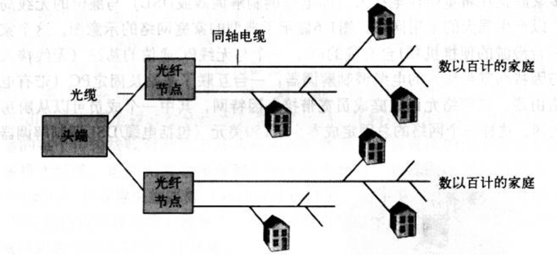

### 概念 -- 主要来自于书籍《计算机网络自顶向下网络》
1. Internet:因特网是一个世界范围的计算机网络，互联了遍及全世界的计算设备的网络。所有的设备都被称为主机或者端系统，端系统通过通信链路和接口交换机连接在一起。
2. 通信链路：由不同的物理媒体组成，包含同轴电缆，铜线，光纤和无线电频谱。不同的链路以不同的速率传输数据，单位一般用bps来表示。
3. 传输流程：
   1. 当端A要向端B发送数据时，端A将数据分段，每段加上首部字节，这样的数据称为分组。
   2. 分组交换机从它的一条通信链路接受不了到达的分组，并从它的另一条通信链路转发该分组。
   3. 一个分组所经历的一系列通信链路和分组交换机称为通过该网络的路径。
   4. 如果将传输过程和现实世界的交通做比喻，端系统类比建筑物，通信链路类比公路/铁路，分组交换机类似于立交桥。
   5. 最出名的分组交换机是路由器和链路层交换机。
   6. 端系统通过因特网提供商（Internet Service Provider ISP）接入因特网。
4. ISP（Internet Server Provider）：因特网提供商
   1. 每个ISP是由多个分组交换机和多段通信链路组成的网络。
   2. 不同ISP为端系统提供了不同类型的网络接入，例如56kbps调制解调器接入/线缆调制解调器提供的住宅宽带接入/高速局域网接入/无线接入等。
   3. 底层的ISP通过国家的/国际的高层ISP连接在一起。
   4. 高级ISP由高速光纤链路互联的高速路由器组成。
   5. 无论是高层ISP，还是低层ISP，都是独立管理的，运行IP协议，准从一定的命名和地址习惯。
5. TCP/IP:因特网最重要的2个协议
   1. TCP： Transmission Control Protocol 传输控制协议
   2. IP： Internet Protocol 网际协议
6. IETF （Internet Engineering Task Force）:因特网工程任务组
   1. 研发因特网标准
   2. IETF的文档被称为请求评论（RFC，Request For Comment）
7. API（Application Programming Interface）：应用程序接口
   1. 由端系统提供
   2. 规定了运行在一个端系统上的软件请求因特网基础设施向运行在另一个端系统上的特定目的地软件交互数据的方式
8. 协议：定义了在2个或多个通信实体之间交换的报文格式和次数，以及在报文传输或接受，或其他事件方面所采取的动作
9. End System：端系统，位于因特网的边缘。也称为主机，主机有时候分为2类
   1. 客户机：
   2. 服务器：
10. Access network：接入网，将端系统连接到边缘路由器的物理链路
    1. 住宅接入
       1. 通过普通模拟电话线（双绞铜线）使用拨号调制解调器与住宅ISP相连；（质量参差不齐，传输速率慢，远小于56kbps）
       2. 数字用户线：一般是电话公司提供，有时有独立的ISP；
       3. 混合光纤同轴电缆
       4. 卫星接入，如StarBand，HughesNet等服务商
    2. 公司接入：在公司和校园，局域网LAN通常被用于连接端用户和边缘路由器
    3. 无线接入
       1. 无线局域网：用户与位于几十米半径内的基站之间传输/接收分组；基站与有线的因特网连接
       2. 广域无线接入网：分组基于用于蜂窝电话的相同无线设施进行发送，基站由电信服务商提供。服务范围可达数万米
11. Edge Router：边缘路由器：是端系统到任何其他远程端系统的路径上的第一台路由器
12. Digital Subscriber Line （DSL）：数字用户线
    1. 一种新型调制解调技术，也运用在双绞线电话线上
    2. 通过限制用户和ISP之间的距离，DSL能以高很多的速率获取和传输数据
    3. ISP到家庭路由的速率比家庭到ISP高得多（设计理念：接收多于发送）
    4. DSL在家庭和ISP之间将通信链路分为3个频段
       1. 高速下行通道，50KHZ-1MHZ
       2. 中速上行通道，4KHZ-40KHZ
       3. 普通双向电话通道，0-4KHZ
13. Hybrid Fiber-coaxial Cable（HFC）：混合光纤同轴电缆 
    1. HFC扩展了用于广播电视电视的网络
    2. 在传统的电缆系统中，电缆头端广播通过同轴电缆和放大器的分配网络传向住宅
    3. HFC需要特殊的调制解调器，称为电缆调制解调器（一种外部设备，通过以太网端口和家庭网络相连）。它将HFC分为了2个通道，下行通道比上行通道拥有更快的传输效率。
    4. HFC的一个重要特征是它共享广播媒体；
14. 频分多路复用技术
15. 以太网
    1. 速度达到100Mbps或1Gbps
    2. 使用双绞铜线或者同轴电缆连接
    3. 使用共享媒体
16. 基于IEEE 802.11实现的无线局域网，也称为无线因特网或WIFI
17. 物理媒体：
    1. 导引型媒体：电波沿固定媒体（如光缆，双绞铜线，同轴电缆）被导引
       1. 双绞铜线：
          1. 最便宜，最普遍。
          2. 由2根1mm粗，隔离的铜线以规则的螺旋排列着。绞合后可减小对临近双绞线电气的干扰。通常许多双绞线捆扎在一起，并用防护型保护层覆盖组成一根电缆。一对电线构成一个通信链路。
          3. 非屏蔽双绞线常用在建筑物内的计算机网络（即无线网），传输速率取决于线的厚度以及传输双方的距离，通常在10Mbps-1Gbps之间。
       2. 同轴电缆
          1. 由2个铜导体组成，同心而非并行。
          2. 能被用作导引式共享媒体，许多端系统能直接和它相连，而且所有的端系统都能接收到由其他端发送的东西
       3. 光缆
          1. 是一种细而柔软，能引导光脉冲的媒体。其中一个脉冲表示一个比特
          2. 速度能高达数十，甚至上百Gbps
          3. 他们不受电磁干扰，长达100km的光缆信号衰减极弱，并且很难接头。（跨海链路首选）
       4. 陆地无线电信道
    2. 非导引型媒体：电波在空气或外层空间（如无线局域网，卫星频道）被导引
18. Optical Carrier （OC）：光载波
    1. 标准速率在51.8Mbps-39.8Gbps，称为OC-1；OC-n表示51.8Mbps*n的链路速率
19. l

### 网络模型
1. 应用层
2. 传输层
3. 网络层
4. 数据链路层
5. 物理层

### TCP/IP
1. MSS:TCP报文最大长度，超过次长度将分段
2. MTC：IP报文最大长度，超过此长度将分片
3. ip地址：
    1. 网络号：标识ip属于那个子网
    2. 主机号：标识是子网下那一台主机
4. 路由：
5. 数据链路层：标识网络中的设备，为网络层提供提供链路级别传输的服务
6. 物理层： 当数据准备要从设备发送到网络时，需要把数据包转换成电信号，让其可以在物理介质中传输，这一层就是物理层 (Physical Layer)，它主要是为数据链路层提供二进制传输的服务

### HTTP
1. 概念：HyperText Transfer Protocol 超文本传输协议