### 概念 -- 文字和图片主要来自于书籍《计算机网络自顶向下网络》
1. Internet:因特网是一个世界范围的计算机网络，互联了遍及全世界的计算设备的网络。所有的设备都被称为主机或者端系统，端系统通过通信链路和接口交换机连接在一起。
2. 通信链路：由不同的物理媒体组成，包含同轴电缆，铜线，光纤和无线电频谱。不同的链路以不同的速率传输数据，单位一般用bps来表示。
3. 传输流程：
   1. 当端A要向端B发送数据时，端A将数据分段，每段加上首部字节，这样的数据称为分组。
   2. 分组交换机从它的一条通信链路接受不了到达的分组，并从它的另一条通信链路转发该分组。
   3. 一个分组所经历的一系列通信链路和分组交换机称为通过该网络的路径。
   4. 如果将传输过程和现实世界的交通做比喻，端系统类比建筑物，通信链路类比公路/铁路，分组交换机类似于立交桥。
   5. 最出名的分组交换机是路由器和链路层交换机。
   6. 端系统通过因特网提供商（Internet Service Provider ISP）接入因特网。
4. ISP（Internet Server Provider）：因特网提供商
   1. 每个ISP是由多个分组交换机和多段通信链路组成的网络。
   2. 不同ISP为端系统提供了不同类型的网络接入，例如56kbps调制解调器接入/线缆调制解调器提供的住宅宽带接入/高速局域网接入/无线接入等。
   3. 底层的ISP通过国家的/国际的高层ISP连接在一起。
   4. 高级ISP由高速光纤链路互联的高速路由器组成。
   5. 无论是高层ISP，还是低层ISP，都是独立管理的，运行IP协议，准从一定的命名和地址习惯。
5. TCP/IP:因特网最重要的2个协议
   1. TCP： Transmission Control Protocol 传输控制协议
   2. IP： Internet Protocol 网际协议
6. IETF （Internet Engineering Task Force）:因特网工程任务组
   1. 研发因特网标准
   2. IETF的文档被称为请求评论（RFC，Request For Comment）
7. API（Application Programming Interface）：应用程序接口
   1. 由端系统提供
   2. 规定了运行在一个端系统上的软件请求因特网基础设施向运行在另一个端系统上的特定目的地软件交互数据的方式
8. 协议：定义了在2个或多个通信实体之间交换的报文格式和次数，以及在报文传输或接受，或其他事件方面所采取的动作
9. End System：端系统，位于因特网的边缘。也称为主机，主机有时候分为2类
   1. 客户机：
   2. 服务器：
10. Access network：接入网，将端系统连接到边缘路由器的物理链路
    1. 住宅接入
       1. 通过普通模拟电话线（双绞铜线）使用拨号调制解调器与住宅ISP相连；（质量参差不齐，传输速率慢，远小于56kbps）
       2. 数字用户线：一般是电话公司提供，有时有独立的ISP；
       3. 混合光纤同轴电缆
       4. 卫星接入，如StarBand，HughesNet等服务商
    2. 公司接入：在公司和校园，局域网LAN通常被用于连接端用户和边缘路由器
    3. 无线接入
       1. 无线局域网：用户与位于几十米半径内的基站之间传输/接收分组；基站与有线的因特网连接
       2. 广域无线接入网：分组基于用于蜂窝电话的相同无线设施进行发送，基站由电信服务商提供。服务范围可达数万米
11. Edge Router：边缘路由器：是端系统到任何其他远程端系统的路径上的第一台路由器
12. Digital Subscriber Line （DSL）：数字用户线
    1. 一种新型调制解调技术，也运用在双绞线电话线上
    2. 通过限制用户和ISP之间的距离，DSL能以高很多的速率获取和传输数据
    3. ISP到家庭路由的速率比家庭到ISP高得多（设计理念：接收多于发送）
    4. DSL在家庭和ISP之间将通信链路分为3个频段
       1. 高速下行通道，50KHZ-1MHZ
       2. 中速上行通道，4KHZ-40KHZ
       3. 普通双向电话通道，0-4KHZ
13. Hybrid Fiber-coaxial Cable（HFC）：混合光纤同轴电缆 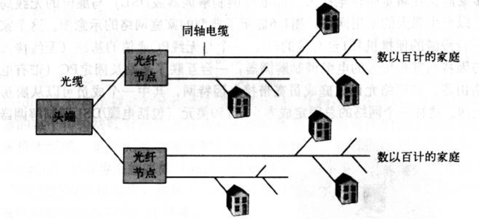
    1. HFC扩展了用于广播电视电视的网络
    2. 在传统的电缆系统中，电缆头端广播通过同轴电缆和放大器的分配网络传向住宅
    3. HFC需要特殊的调制解调器，称为电缆调制解调器（一种外部设备，通过以太网端口和家庭网络相连）。它将HFC分为了2个通道，下行通道比上行通道拥有更快的传输效率。
    4. HFC的一个重要特征是它共享广播媒体；
14. 频分多路复用技术
15. 以太网
    1. 速度达到100Mbps或1Gbps
    2. 使用双绞铜线或者同轴电缆连接
    3. 使用共享媒体
16. 基于IEEE 802.11实现的无线局域网，也称为无线因特网或WIFI
17. 物理媒体：
    1. 导引型媒体：电波沿固定媒体（如光缆，双绞铜线，同轴电缆）被导引
       1. 双绞铜线：
          1. 最便宜，最普遍。
          2. 由2根1mm粗，隔离的铜线以规则的螺旋排列着。绞合后可减小对临近双绞线电气的干扰。通常许多双绞线捆扎在一起，并用防护型保护层覆盖组成一根电缆。一对电线构成一个通信链路。
          3. 非屏蔽双绞线常用在建筑物内的计算机网络（即无线网），传输速率取决于线的厚度以及传输双方的距离，通常在10Mbps-1Gbps之间。
       2. 同轴电缆
          1. 由2个铜导体组成，同心而非并行。
          2. 能被用作导引式共享媒体，许多端系统能直接和它相连，而且所有的端系统都能接收到由其他端发送的东西
       3. 光缆
          1. 是一种细而柔软，能引导光脉冲的媒体。其中一个脉冲表示一个比特
          2. 速度能高达数十，甚至上百Gbps
          3. 他们不受电磁干扰，长达100km的光缆信号衰减极弱，并且很难接头。（跨海链路首选）
    2. 非导引型媒体：电波在空气或外层空间（如无线局域网，卫星频道）被导引
       1. 陆地无线电信道
           1. 无线电信道承载电磁频谱的信号，不需要物理线路
           2. 具有穿透墙壁，提供与移动用户的连接以及长距离承载信号的能力；但因爱与传播环境和传输信号的距离
           3. 路径损耗/遮挡衰落（阻碍物体会使信号降低）/多径衰弱（干扰对象的信号反射）/干扰（其他无线电信道或电磁信号）
           4. 分类
              1. 运行在本地区域，通常跨越数十到几百米；如无线LAN技术
              2. 运行在广域，跨越数万米；如蜂窝接入
       2. 卫星无线电信道
          1. 一颗通信卫星连接2个或多个位于地球的微波发送方/接收方，他们被称为地面站
          2. 该卫星在一个频段上接收传输，使用一个转发器再生信号，并在另一个频率上上传输信号
          3. 能提供Gbps的带宽
          4. 分为同步卫星和低地球轨道卫星
             1. 同步卫星：永久停留在地球上方相同的点上。该卫星放置在地球表面上方的36000km的轨道，280ms的时间延迟
             2. 低地球轨道卫星围绕地球旋转，类似月球；为了提供对一个区域的连续覆盖，需要在轨道放置许多卫星
18. Optical Carrier （OC）：光载波
    1. 标准速率在51.8Mbps-39.8Gbps，称为OC-1；OC-n表示51.8Mbps*n的链路速率
19. circuit switching：电路交换 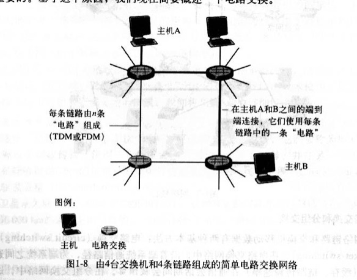
    1. 上图中，用4条链路互联4台电路交换机。这些链路每条都有n条链路，支持n条电路同时连接。
    2. 当2台主机通信时，该网络在主机之间创建一条专用的端到端连接。连接期间，该连接获得该链路带宽的1/n部分
    3. 电路多路复用 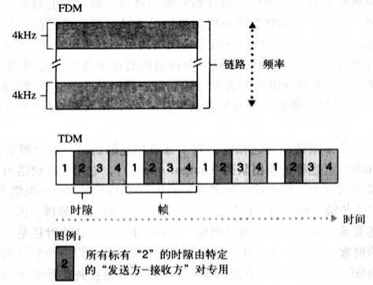
       1. 频分多路复用（Frequency-Division Multiplexing FDM）
          1. 链路的频谱由跨越链路的所有连接共享
          2. 该链路在连接期间为每条连接专用一个频段
          3. 在电话网络中，该频段具有4kHz
          4. 该频段的宽度称为带宽
       2. 时分多路复用（Time-Division Multiplexing TDM）
          1. 时间被划分固定区间的帧；每帧又被划分为固定数量的时隙
          2. 该链路在每个帧中为该连接指定一个时隙
          3. 一个电路的传输速率等于时隙的比特数乘以该帧的速率。如果电路每秒传输8000帧，每个帧由8000比特组成，则一条电路的传输速率为64kbps
       3. 总结：FDM中每条电路连续的获得部分带宽，TDM每条电路在简短的时间间隔中周期性的得到所有带宽
    4. 例如电话网络：该网络必须在发送方和接收方建立一个连接，该路径上交换机都将为该连接维护连接状态，也预留了恒定的连接期间的传输速率
    5. 传输时间与链路数量无关
20. packet switching：分组交换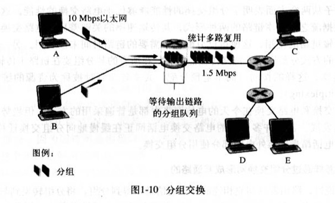
    1. 各种程序在完成其任务的时候要交换报文（任何数据）
    2. 原主机将长报文分为较小的数据块，并称之为分组
    3. 分组以该链路的最大传输速率传输（通信链路+分组交换机）
    4. 多数分组交换器在链路的输入端使用存储转发传输机制。
    5. 分组交换器有多条链路与之相连，对于每条链路，它有一个输出缓存（输出队列），存储着路由器准备发往那条链路的分组。如果到达的分组需要跨越链路传输，但发现该链路正忙于传输其他分组，该到达分组必须在输出缓存中等待
    6. 除了储存转发时延，还有输出缓存的排队时延。时延有波动，取决于网络中的拥塞水平。因为缓存空间大小有限，所以当达到的分组被等待传输的分组完全充满时，将出现分组丢失或丢包。可能是到达的分组，也可能是已经排队的分组之一将被丢弃。
    7. 举例6：餐馆服务员告知你，已经有太多人等待就餐，你必须离开餐馆（这个ð很形象。。）
21. 存储转发传输机制
    1. 概念：交换机能够开始向输出链路传输该分组的第一个比特之前，必须接收到整个分组
    2. 存储转发传输机制 导致 存储转发时延
22. 电路交换和分组交换
    1. 在电路交换中，沿着端系统通信路径，为端系统之间通信所提供的资源（缓存，链路传输速率）在通信会话之间会被预留。而分组网络不会
    2. 电路交换相当于预定，分组交换相当于实时尝试；分别代表是电话网络和因特网网络
    3. 分组交换这种按需分配，而非按预分配共享资源有时被成为资源的统计多路复用（statistical multiplexing）
    4. 趋势向分组交换发展
23. 分组怎么通过分组交换形成通路的？
    1. 每个通过网络传输的分组在它的首部包含了其目的地址
    2. 当路由器到达一台路由器时，该路由器检查分组的目的地址的一部分，并向相邻路由器转发该分组
    3. 每台路由器具有一个转发表，用于将目的地址（或目的地址的一部分）映射到输出链路
24. 选路协议：它们用于自动设置转发表
25. ISP层次 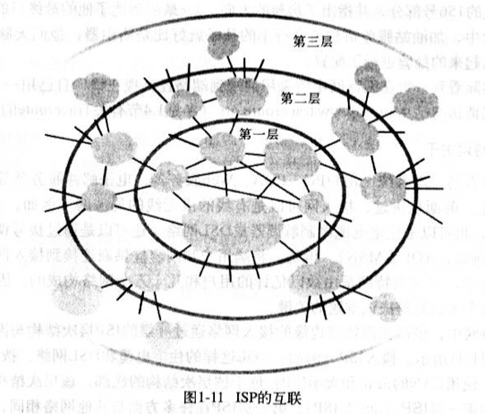
    1. 第一层ISP，也被成为因特网主干网络
       1. 数量较少，包括Sprint，Verizon，MCI，AT&T，NTT，Level3，Qwest，Cable&Wireless
       2. 传输速率较高，链路速率通常是622Mbps或更高，大型第一层ISP可达2。5-10Gbps，响应的路由器也必须能以极高的速率转发分组
       3. 特性
          1. 直接与其他每个第一层ISP相连
          2. 与大量的第二层Isp和其他客户网络相连
          3. 覆盖国际区域
    2. 第二层ISP，通常具有区域性质或国家性覆盖规模，并且非常重要的与少数第一层ISP相连
       1. 它被成为是它所连接的第一层ISP的客户，第一层ISP相对于它来说是提供商
       2. 第二层ISP可以选择与其他第二层ISP限量，不必流经第一层ISP
       3. 某些复杂情况下，某些第一层提供商也是第二层提供商，它向较低层次ISP出售因特网接入，也直接向端用户和内容提供商出售因特网接入。当2个ISP直接相连时，他们被称为彼此是对等的
    3. 某ISP与其他ISP的连接点（可以在不同层次）被称为汇集点（Point of Presence,POP）
26. 分组交换网的时延、丢包和吞吐量
    1. 节点时延（以下四种累加起来就是节点总时延）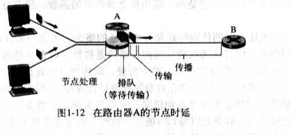
       1. 节点处理时延（nodal processing delay）
          1. 检查分组首部和决定将该分组所需要的时间（主要部分）
          2. 检查比特级差错所需要的时间（微秒甚至更低）
       2. 排队时延 (queuing delay)
          1. 当分组在链路上等待传输时，它经受排队时延（通常在毫秒到微秒级）
          2. 取决于流量到达该排队的性质，链路的传输速率和到达流量的性质（周期、突发）
          3. 计算
             1. 假设米秒到达分组为a pkt/s
             2. 假设每个分组都有L比特组成
             3. 假设传输速率为R bps
             4. 那么x=La/R被称为流量强度 
                1. 如果x>1，那么比特叨叨队列的平均速率超过该队列传输出去的速率，队列的增加将趋向于无穷大。⚠️  
                2. 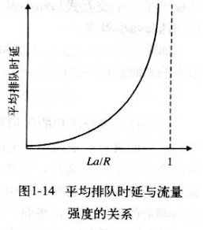
          4. 丢包：流量强度趋近于1时，因为排队容量有限，排队时延不会趋向于无穷大。分组发现将达到一个满的队列，没有地方存储它，路由器将丢弃该分组。
          5. 节点性能要根据时延和丢包率来衡量
       3. 传输时延（存储转发时延，通常在毫秒到微秒级）(transmission delay)
       4. 传播时延(propagation delay)
          1. 取决于物理媒体
          2. 2-3✖️10的8次方，略低于光速。time=distance/speed
          3. 通常在毫秒级
       5. 传输和传播时延的区别
          1. 前者是路由器将分组推出所需的时间，他是分组长度和链路传输速率的函数，与路由器间距无关
          2. 后者是一个比特从一台路由器向另一台路由器传播所需要的时间，它是距离的函数，与分组的长度或链路的传输熟虑无关
          3. 例子：2座收费站距离100KM，汽车的时速为100KM/H，通过一座收费站需要12s。时延分别为12s，1h
    2. 端到端时延
       1. 处理时延，传输时延，传播时延
       2. 拨号调制解调器的调制/解码时延（几十毫秒）
       3. 媒体分组化时延（IP语音应用）
27. traceroute :可以指定目标主机后，源主机向目标主机发送N个特殊的分组。
    1. 经历的各个路由器接收到这个特殊分组后，会向源主机发一个短报文，该报文包含路由器的名称和地址
    2. 目标主机收到第N个分组时，他也会返回一个报文。报文包含它发送第一个分组到接受并返回报文经受的时间，也包含路由器的名字和地址
    3. RFC1393标准
    4. Linux命令
    5. http://www.traceroute.org
28. 吞吐量
    1. 瞬时吞吐量
    2. 平均吞吐量
    3. 因特网对吞吐量的限制通常是接入网。因为核心网络具有非常高速率的链路（如果核心网络传输速率低，也会影响到吞吐量）
    4. 另一个影响因素是干扰流量
29. 协议分层和服务模型
    1. HTTP/SMTP等应用层协议通常都是端系统软件实现的
    2. 物理层通常在给定链路相关的网络接口卡（例如以太网或WiFi接口卡）实现
    3. 5层因策网协议栈
       1. 应用层：将位于应用层的信息分组称为报文（message）
       2. 运输层：将运输层分组称为报文段（segment）
       3. 网络层：网络层分组称为数据报（datagram），包含IP协议，选路协议等。但IP是最重要的协议，将因特网连接在一起
       4. 链路层：链路层分组称为帧（frame）
       5. 物理层：将帧的一个一个比特从一个节点移动到下一个节点，该层协议仍然与链路相关，并且进一步链路的实际传输媒体（双绞铜线，单模光纤等）相关
    4. 7层ISO模型 ：应用层 --> 表示层 --> 会话层 --> 运输层 --> 网络层 --> 链路层 --> 物理层
    5. 分层示意图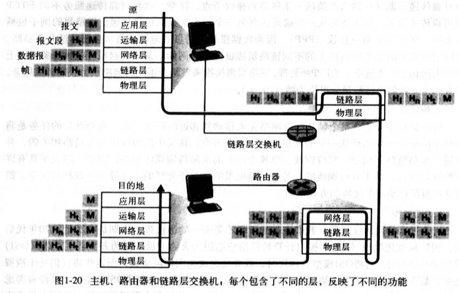
       1. 应用层报文M被传送给运输层
       2. 运输层收取报文，并附上附加信息（运输层首部信息Ht，差错检测比特信息，允许接收端向运输层向上向适当应用程序交付报文的信息），构成运输层报文段
       3. 网络层增加了如源和目的端系统地址等网络首部信息Hn，形成网络层数据报
       4. 链路层收取网络数据报，并增加链路首部信息并创建链路层帧
    6. 如5，可以知晓每一层分组有2种类型的字段：首部字段和有效载荷字段（来自于上一层分组）
30. 网络攻击（因特网设计之初，互相信任）
    1. 将恶意软件放到用户计算机
       1. 蠕虫：无需明显用户交互就能进入设备
       2. 特洛伊木马：隐藏在有用软件中的恶意软件
    2. 攻击服务器和网络基础设施
       1. 拒绝服务（Denial-of-Service DOS）：使合法用户不能使用网络，主机或其他基础设施部分
          1. 弱点攻击
          2. 带宽洪泛（分布式DOS）
          3. 连接洪泛
    3. 分组嗅探：无线传输设备附近放置一台被动的接收机（分组嗅探器），该接收机能得到传输的每个分组的拷贝，这些分组可能包含敏感信息。
       1. 也可用于有线环境
       2. 最好的防御嗅探的方法基本都和密码学有关
       3. 分组嗅探器：Ethereal（Windows/Linux/UNIX/Mac） http://www.awl.com/kurose-ross
    4. ip哄骗：生成任意原地址、分组内容和目的地址的分组，然后将这个人工制作的分组传输到因特网中。这种将虚假原地址的分组注入因特网的能力称为IP哄骗。即决方法是端点鉴别机制
    5. 修改或删除报文（中间人攻击）

### 网络模型-应用层
1. 通信架构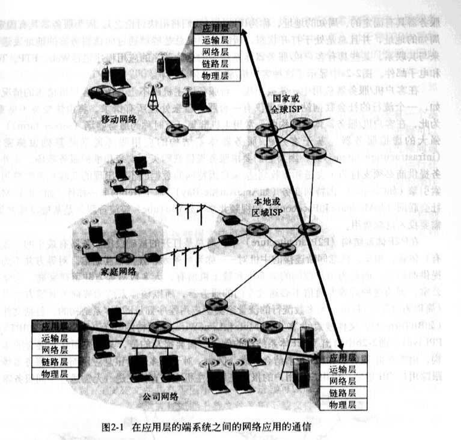
   1. 客户机/服务器体系结构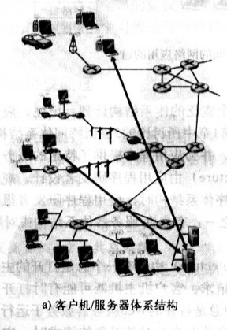
   2. 对等体系结构（P2P）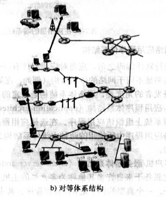
      1. 自扩展性，成本有效
      2. 高度分布和开发，具有安全隐患
2. 进程通信
   1. 进程通过一个称为套接字（应用程序编程接口 API）的软件接口在网络上发送和接收报文。开发者对于运输层控制仅限于：
      1. 选择运输层协议
      2. 也许‼️能设定几个参数，如最大缓存，最大报文段长度
3. 分类：
   1. 按可靠性：可靠数据传输/容忍丢失的应用
   2. 按吞吐量：带宽敏感的应用/弹性应用
   3. 时间敏感（准时，一定时延）
   4. 安全
4. 传输服务
   1. TCP
      1. TCP服务模型包含面向连接服务和可靠性数据传输服务，还具有拥塞控制机制
         1. 面向连接服务：之所以是面向连接服务，而不是连接服务，是因为2个进程间是以一种非常松散的方式进行连接的。TCP连接是全双工的
         2. 可靠数据传输服务：无差错，适当顺序。没有字节的丢失和冗余
      2. TCP是明文传输的，所以后续在应用层实现了TCP的加强版本，称为安全套接字（Secure Socket Layer SSL），它提供了额外功能
          1. 加密
          2. 数据完整性
          3. 端点鉴别
   2. UDP 
      1. 是一种不提供不必要服务的轻量级运输层协议，仅提供最小服务
      2. 没有握手过程，无连接
      3. 提供的是不可靠数据传输服务
      4. 不保证该报文能够被接收到，也不保证接收到的顺序
   3. 不提供的服务：图度量和定时保证
   4. 进程寻址：需要定义2种信息去识别接收进程
      1. 该主机的名称或地址（IP地址）
      2. 用来指定目的主机上接收进程的标识（端口号）
5. 应用层协议：定义了运行在不同端系统上的应用程序进程如何相互传递报文。如
   1. 交换的报文类型，如请求报文和响应报文
   2. 各种报文类型的预发，如报文各个字段及其详细描述
   3. 字段的语义
   4. 进程何时、如何发送报文及对报文进行响应的规则

### 网络模型-传输层

### 网络模型-网络层

### 网络模型-数据链路层

### 网络模型-物理层

### TCP/IP
1. MSS:TCP报文最大长度，超过次长度将分段
2. MTC：IP报文最大长度，超过此长度将分片
3. ip地址：
    1. 网络号：标识ip属于那个子网
    2. 主机号：标识是子网下那一台主机
4. 路由：
5. 数据链路层：标识网络中的设备，为网络层提供提供链路级别传输的服务
6. 物理层： 当数据准备要从设备发送到网络时，需要把数据包转换成电信号，让其可以在物理介质中传输，这一层就是物理层 (Physical Layer)，它主要是为数据链路层提供二进制传输的服务

### TCP

### UDP
1. 

### HTTP
1. 概念：HyperText Transfer Protocol 超文本传输协议

### 发展历史：
- 1961-1972：分组交换
- 1972-1980: 专用网络和网络互联
- 1980-1990： 网络激增
- 20世纪90年代：因特网爆炸
