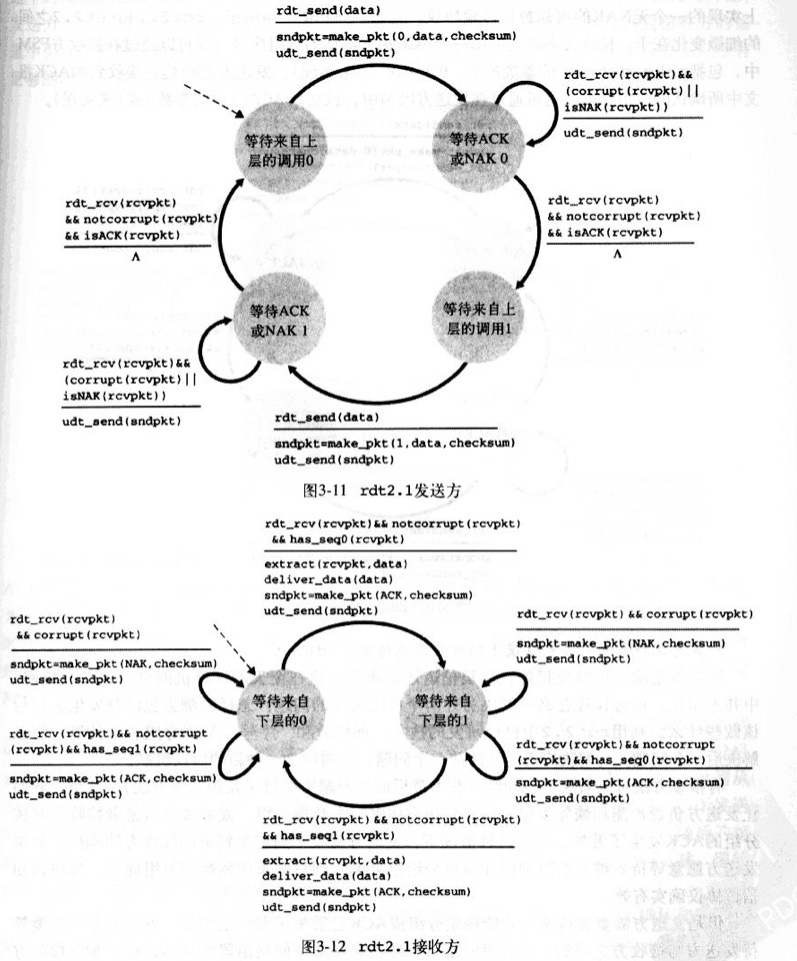
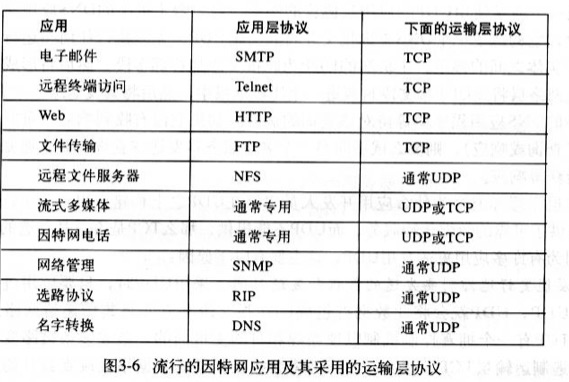

### 概念 -- 文字和图片主要来自于书籍《计算机网络自顶向下网络》
1. Internet:因特网是一个世界范围的计算机网络，互联了遍及全世界的计算设备的网络。所有的设备都被称为主机或者端系统，端系统通过通信链路和接口交换机连接在一起。
2. 通信链路：由不同的物理媒体组成，包含同轴电缆，铜线，光纤和无线电频谱。不同的链路以不同的速率传输数据，单位一般用bps来表示。
3. 传输流程：
   1. 当端A要向端B发送数据时，端A将数据分段，每段加上首部字节，这样的数据称为分组。
   2. 分组交换机从它的一条通信链路接受不了到达的分组，并从它的另一条通信链路转发该分组。
   3. 一个分组所经历的一系列通信链路和分组交换机称为通过该网络的路径。
   4. 如果将传输过程和现实世界的交通做比喻，端系统类比建筑物，通信链路类比公路/铁路，分组交换机类似于立交桥。
   5. 最出名的分组交换机是路由器和链路层交换机。
   6. 端系统通过因特网提供商（Internet Service Provider ISP）接入因特网。
4. ISP（Internet Server Provider）：因特网提供商
   1. 每个ISP是由多个分组交换机和多段通信链路组成的网络。
   2. 不同ISP为端系统提供了不同类型的网络接入，例如56kbps调制解调器接入/线缆调制解调器提供的住宅宽带接入/高速局域网接入/无线接入等。
   3. 底层的ISP通过国家的/国际的高层ISP连接在一起。
   4. 高级ISP由高速光纤链路互联的高速路由器组成。
   5. 无论是高层ISP，还是低层ISP，都是独立管理的，运行IP协议，准从一定的命名和地址习惯。
5. TCP/IP:因特网最重要的2个协议
   1. TCP： Transmission Control Protocol 传输控制协议
   2. IP： Internet Protocol 网际协议
6. IETF （Internet Engineering Task Force）:因特网工程任务组
   1. 研发因特网标准
   2. IETF的文档被称为请求评论（RFC，Request For Comment）
7. API（Application Programming Interface）：应用程序接口
   1. 由端系统提供
   2. 规定了运行在一个端系统上的软件请求因特网基础设施向运行在另一个端系统上的特定目的地软件交互数据的方式
8. 协议：定义了在2个或多个通信实体之间交换的报文格式和次数，以及在报文传输或接受，或其他事件方面所采取的动作
9. End System：端系统，位于因特网的边缘。也称为主机，主机有时候分为2类
   1. 客户机：
   2. 服务器：
10. Access network：接入网，将端系统连接到边缘路由器的物理链路
    1. 住宅接入
       1. 通过普通模拟电话线（双绞铜线）使用拨号调制解调器与住宅ISP相连；（质量参差不齐，传输速率慢，远小于56kbps）
       2. 数字用户线：一般是电话公司提供，有时有独立的ISP；
       3. 混合光纤同轴电缆
       4. 卫星接入，如StarBand，HughesNet等服务商
    2. 公司接入：在公司和校园，局域网LAN通常被用于连接端用户和边缘路由器
    3. 无线接入
       1. 无线局域网：用户与位于几十米半径内的基站之间传输/接收分组；基站与有线的因特网连接
       2. 广域无线接入网：分组基于用于蜂窝电话的相同无线设施进行发送，基站由电信服务商提供。服务范围可达数万米
11. Edge Router：边缘路由器：是端系统到任何其他远程端系统的路径上的第一台路由器
12. Digital Subscriber Line （DSL）：数字用户线
    1. 一种新型调制解调技术，也运用在双绞线电话线上
    2. 通过限制用户和ISP之间的距离，DSL能以高很多的速率获取和传输数据
    3. ISP到家庭路由的速率比家庭到ISP高得多（设计理念：接收多于发送）
    4. DSL在家庭和ISP之间将通信链路分为3个频段
       1. 高速下行通道，50KHZ-1MHZ
       2. 中速上行通道，4KHZ-40KHZ
       3. 普通双向电话通道，0-4KHZ
13. Hybrid Fiber-coaxial Cable（HFC）：混合光纤同轴电缆 
    1. HFC扩展了用于广播电视电视的网络
    2. 在传统的电缆系统中，电缆头端广播通过同轴电缆和放大器的分配网络传向住宅
    3. HFC需要特殊的调制解调器，称为电缆调制解调器（一种外部设备，通过以太网端口和家庭网络相连）。它将HFC分为了2个通道，下行通道比上行通道拥有更快的传输效率。
    4. HFC的一个重要特征是它共享广播媒体；
14. 频分多路复用技术
15. 以太网
    1. 速度达到100Mbps或1Gbps
    2. 使用双绞铜线或者同轴电缆连接
    3. 使用共享媒体
16. 基于IEEE 802.11实现的无线局域网，也称为无线因特网或WIFI
17. 物理媒体：
    1. 导引型媒体：电波沿固定媒体（如光缆，双绞铜线，同轴电缆）被导引
       1. 双绞铜线：
          1. 最便宜，最普遍。
          2. 由2根1mm粗，隔离的铜线以规则的螺旋排列着。绞合后可减小对临近双绞线电气的干扰。通常许多双绞线捆扎在一起，并用防护型保护层覆盖组成一根电缆。一对电线构成一个通信链路。
          3. 非屏蔽双绞线常用在建筑物内的计算机网络（即无线网），传输速率取决于线的厚度以及传输双方的距离，通常在10Mbps-1Gbps之间。
       2. 同轴电缆
          1. 由2个铜导体组成，同心而非并行。
          2. 能被用作导引式共享媒体，许多端系统能直接和它相连，而且所有的端系统都能接收到由其他端发送的东西
       3. 光缆
          1. 是一种细而柔软，能引导光脉冲的媒体。其中一个脉冲表示一个比特
          2. 速度能高达数十，甚至上百Gbps
          3. 他们不受电磁干扰，长达100km的光缆信号衰减极弱，并且很难接头。（跨海链路首选）
    2. 非导引型媒体：电波在空气或外层空间（如无线局域网，卫星频道）被导引
       1. 陆地无线电信道
           1. 无线电信道承载电磁频谱的信号，不需要物理线路
           2. 具有穿透墙壁，提供与移动用户的连接以及长距离承载信号的能力；但因爱与传播环境和传输信号的距离
           3. 路径损耗/遮挡衰落（阻碍物体会使信号降低）/多径衰弱（干扰对象的信号反射）/干扰（其他无线电信道或电磁信号）
           4. 分类
              1. 运行在本地区域，通常跨越数十到几百米；如无线LAN技术
              2. 运行在广域，跨越数万米；如蜂窝接入
       2. 卫星无线电信道
          1. 一颗通信卫星连接2个或多个位于地球的微波发送方/接收方，他们被称为地面站
          2. 该卫星在一个频段上接收传输，使用一个转发器再生信号，并在另一个频率上上传输信号
          3. 能提供Gbps的带宽
          4. 分为同步卫星和低地球轨道卫星
             1. 同步卫星：永久停留在地球上方相同的点上。该卫星放置在地球表面上方的36000km的轨道，280ms的时间延迟
             2. 低地球轨道卫星围绕地球旋转，类似月球；为了提供对一个区域的连续覆盖，需要在轨道放置许多卫星
18. Optical Carrier （OC）：光载波
    1. 标准速率在51.8Mbps-39.8Gbps，称为OC-1；OC-n表示51.8Mbps*n的链路速率
19. circuit switching：电路交换 
    1. 上图中，用4条链路互联4台电路交换机。这些链路每条都有n条链路，支持n条电路同时连接。
    2. 当2台主机通信时，该网络在主机之间创建一条专用的端到端连接。连接期间，该连接获得该链路带宽的1/n部分
    3. 电路多路复用 
       1. 频分多路复用（Frequency-Division Multiplexing FDM）
          1. 链路的频谱由跨越链路的所有连接共享
          2. 该链路在连接期间为每条连接专用一个频段
          3. 在电话网络中，该频段具有4kHz
          4. 该频段的宽度称为带宽
       2. 时分多路复用（Time-Division Multiplexing TDM）
          1. 时间被划分固定区间的帧；每帧又被划分为固定数量的时隙
          2. 该链路在每个帧中为该连接指定一个时隙
          3. 一个电路的传输速率等于时隙的比特数乘以该帧的速率。如果电路每秒传输8000帧，每个帧由8000比特组成，则一条电路的传输速率为64kbps
       3. 总结：FDM中每条电路连续的获得部分带宽，TDM每条电路在简短的时间间隔中周期性的得到所有带宽
    4. 例如电话网络：该网络必须在发送方和接收方建立一个连接，该路径上交换机都将为该连接维护连接状态，也预留了恒定的连接期间的传输速率
    5. 传输时间与链路数量无关
20. packet switching：分组交换
    1. 各种程序在完成其任务的时候要交换报文（任何数据）
    2. 原主机将长报文分为较小的数据块，并称之为分组
    3. 分组以该链路的最大传输速率传输（通信链路+分组交换机）
    4. 多数分组交换器在链路的输入端使用存储转发传输机制。
    5. 分组交换器有多条链路与之相连，对于每条链路，它有一个输出缓存（输出队列），存储着路由器准备发往那条链路的分组。如果到达的分组需要跨越链路传输，但发现该链路正忙于传输其他分组，该到达分组必须在输出缓存中等待
    6. 除了储存转发时延，还有输出缓存的排队时延。时延有波动，取决于网络中的拥塞水平。因为缓存空间大小有限，所以当达到的分组被等待传输的分组完全充满时，将出现分组丢失或丢包。可能是到达的分组，也可能是已经排队的分组之一将被丢弃。
    7. 举例6：餐馆服务员告知你，已经有太多人等待就餐，你必须离开餐馆（这个ð很形象。。）
21. 存储转发传输机制
    1. 概念：交换机能够开始向输出链路传输该分组的第一个比特之前，必须接收到整个分组
    2. 存储转发传输机制 导致 存储转发时延
22. 电路交换和分组交换
    1. 在电路交换中，沿着端系统通信路径，为端系统之间通信所提供的资源（缓存，链路传输速率）在通信会话之间会被预留。而分组网络不会
    2. 电路交换相当于预定，分组交换相当于实时尝试；分别代表是电话网络和因特网网络
    3. 分组交换这种按需分配，而非按预分配共享资源有时被成为资源的统计多路复用（statistical multiplexing）
    4. 趋势向分组交换发展
23. 分组怎么通过分组交换形成通路的？
    1. 每个通过网络传输的分组在它的首部包含了其目的地址
    2. 当路由器到达一台路由器时，该路由器检查分组的目的地址的一部分，并向相邻路由器转发该分组
    3. 每台路由器具有一个转发表，用于将目的地址（或目的地址的一部分）映射到输出链路
24. 选路协议：它们用于自动设置转发表
25. ISP层次 
    1. 第一层ISP，也被成为因特网主干网络
       1. 数量较少，包括Sprint，Verizon，MCI，AT&T，NTT，Level3，Qwest，Cable&Wireless
       2. 传输速率较高，链路速率通常是622Mbps或更高，大型第一层ISP可达2。5-10Gbps，响应的路由器也必须能以极高的速率转发分组
       3. 特性
          1. 直接与其他每个第一层ISP相连
          2. 与大量的第二层Isp和其他客户网络相连
          3. 覆盖国际区域
    2. 第二层ISP，通常具有区域性质或国家性覆盖规模，并且非常重要的与少数第一层ISP相连
       1. 它被成为是它所连接的第一层ISP的客户，第一层ISP相对于它来说是提供商
       2. 第二层ISP可以选择与其他第二层ISP限量，不必流经第一层ISP
       3. 某些复杂情况下，某些第一层提供商也是第二层提供商，它向较低层次ISP出售因特网接入，也直接向端用户和内容提供商出售因特网接入。当2个ISP直接相连时，他们被称为彼此是对等的
    3. 某ISP与其他ISP的连接点（可以在不同层次）被称为汇集点（Point of Presence,POP）
26. 分组交换网的时延、丢包和吞吐量
    1. 节点时延（以下四种累加起来就是节点总时延）
       1. 节点处理时延（nodal processing delay）
          1. 检查分组首部和决定将该分组所需要的时间（主要部分）
          2. 检查比特级差错所需要的时间（微秒甚至更低）
       2. 排队时延 (queuing delay)
          1. 当分组在链路上等待传输时，它经受排队时延（通常在毫秒到微秒级）
          2. 取决于流量到达该排队的性质，链路的传输速率和到达流量的性质（周期、突发）
          3. 计算
             1. 假设米秒到达分组为a pkt/s
             2. 假设每个分组都有L比特组成
             3. 假设传输速率为R bps
             4. 那么x=La/R被称为流量强度 
                1. 如果x>1，那么比特叨叨队列的平均速率超过该队列传输出去的速率，队列的增加将趋向于无穷大。⚠️  
                2. 
          4. 丢包：流量强度趋近于1时，因为排队容量有限，排队时延不会趋向于无穷大。分组发现将达到一个满的队列，没有地方存储它，路由器将丢弃该分组。
          5. 节点性能要根据时延和丢包率来衡量
       3. 传输时延（存储转发时延，通常在毫秒到微秒级）(transmission delay)
       4. 传播时延(propagation delay)
          1. 取决于物理媒体
          2. 2-3✖️10的8次方，略低于光速。time=distance/speed
          3. 通常在毫秒级
       5. 传输和传播时延的区别
          1. 前者是路由器将分组推出所需的时间，他是分组长度和链路传输速率的函数，与路由器间距无关
          2. 后者是一个比特从一台路由器向另一台路由器传播所需要的时间，它是距离的函数，与分组的长度或链路的传输熟虑无关
          3. 例子：2座收费站距离100KM，汽车的时速为100KM/H，通过一座收费站需要12s。时延分别为12s，1h
    2. 端到端时延
       1. 处理时延，传输时延，传播时延
       2. 拨号调制解调器的调制/解码时延（几十毫秒）
       3. 媒体分组化时延（IP语音应用）
27. traceroute :可以指定目标主机后，源主机向目标主机发送N个特殊的分组。
    1. 经历的各个路由器接收到这个特殊分组后，会向源主机发一个短报文，该报文包含路由器的名称和地址
    2. 目标主机收到第N个分组时，他也会返回一个报文。报文包含它发送第一个分组到接受并返回报文经受的时间，也包含路由器的名字和地址
    3. RFC1393标准
    4. Linux命令
    5. http://www.traceroute.org
28. 吞吐量
    1. 瞬时吞吐量
    2. 平均吞吐量
    3. 因特网对吞吐量的限制通常是接入网。因为核心网络具有非常高速率的链路（如果核心网络传输速率低，也会影响到吞吐量）
    4. 另一个影响因素是干扰流量
29. 协议分层和服务模型
    1. HTTP/SMTP等应用层协议通常都是端系统软件实现的
    2. 物理层通常在给定链路相关的网络接口卡（例如以太网或WiFi接口卡）实现
    3. 5层因策网协议栈
       1. 应用层：将位于应用层的信息分组称为报文（message）
       2. 运输层：将运输层分组称为报文段（segment）
       3. 网络层：网络层分组称为数据报（datagram），包含IP协议，选路协议等。但IP是最重要的协议，将因特网连接在一起
       4. 链路层：链路层分组称为帧（frame）
       5. 物理层：将帧的一个一个比特从一个节点移动到下一个节点，该层协议仍然与链路相关，并且进一步链路的实际传输媒体（双绞铜线，单模光纤等）相关
    4. 7层ISO模型 ：应用层 --> 表示层 --> 会话层 --> 运输层 --> 网络层 --> 链路层 --> 物理层
    5. 分层示意图
       1. 应用层报文M被传送给运输层
       2. 运输层收取报文，并附上附加信息（运输层首部信息Ht，差错检测比特信息，允许接收端向运输层向上向适当应用程序交付报文的信息），构成运输层报文段
       3. 网络层增加了如源和目的端系统地址等网络首部信息Hn，形成网络层数据报
       4. 链路层收取网络数据报，并增加链路首部信息并创建链路层帧
    6. 如5，可以知晓每一层分组有2种类型的字段：首部字段和有效载荷字段（来自于上一层分组）
30. 网络攻击（因特网设计之初，互相信任）
    1. 将恶意软件放到用户计算机
       1. 蠕虫：无需明显用户交互就能进入设备
       2. 特洛伊木马：隐藏在有用软件中的恶意软件
    2. 攻击服务器和网络基础设施
       1. 拒绝服务（Denial-of-Service DOS）：使合法用户不能使用网络，主机或其他基础设施部分
          1. 弱点攻击
          2. 带宽洪泛（分布式DOS）
          3. 连接洪泛
    3. 分组嗅探：无线传输设备附近放置一台被动的接收机（分组嗅探器），该接收机能得到传输的每个分组的拷贝，这些分组可能包含敏感信息。
       1. 也可用于有线环境
       2. 最好的防御嗅探的方法基本都和密码学有关
       3. 分组嗅探器：Ethereal（Windows/Linux/UNIX/Mac） http://www.awl.com/kurose-ross
    4. ip哄骗：生成任意原地址、分组内容和目的地址的分组，然后将这个人工制作的分组传输到因特网中。这种将虚假原地址的分组注入因特网的能力称为IP哄骗。即决方法是端点鉴别机制
    5. 修改或删除报文（中间人攻击）
31. 端到端原则：因为某种功能必须基于端到端实现，与在较高级别提供这些功能的代价相比，在较低级别上设置设置的功能可能是荣誉或几乎没有价值。
32. 自动重传请求协议（Automatic Repeat reRequest，ARQ）：接收方再收到报文后，回应肯定确认（ACK）和否定确认（NAK），使发送方知道哪些内容被正确接受，哪些内容有误需要重传。基于这种重传机制的可靠数据传输协议称为自动重传请求。它还需要3种协议来处理存在的比特差错
    1. 差错检测
    2. 接收方反馈
    3. 重传
33. 肯定确认：ACK， positive acknowledgment
34. 否定确认：NCK， negative acknowledgment
35. 发送缓存：send buffer
36. 回退N步：GBN Go-Back-N
37. 选择重传：SR
38. 最大报文段长：MSS，maximum segment size。MSS是指报文段里应用层数据的最大长度，不包含TCP首部字段。
39. 最大传输单元：MTU，maximum transmission unit。常见值是1460字节、536字节、或512字节
40. 指数加权移动平均：EWMA，Exponential Weighted Moving Average。TCP使用它计算平均时延
41. 平均往返时延：EstimatedRTT
42. 报文段样本时延：SimpleRTT
43. 偏差时延：DevRTT
44. 显示转发拥塞指示：Explicit Forward Congestion Indication,EFCI
45. 资源管理信元：Resources-Management Cell，RM cell
46. 拥塞指示：congestion indication，CI
47. 无增长：no increase，NI
48. 显示速率：Explicit Rate，RT
49. 加性增/乘性减：Additive-Increase，Multiplicative-Decrease，AIMD算法
50. 恒定比特率：Constant Bit Rate，CBR
51. 可用比特率：Available Bit Rate，ABR

### 网络模型-应用层
1. 通信架构
   1. 客户机/服务器体系结构
   2. 对等体系结构（P2P）
      1. 自扩展性，成本有效
      2. 高度分布和开发，具有安全隐患
2. 进程通信
   1. 进程通过一个称为套接字（应用程序编程接口 API）的软件接口在网络上发送和接收报文。开发者对于运输层控制仅限于：
      1. 选择运输层协议
      2. 也许‼️能设定几个参数，如最大缓存，最大报文段长度
3. 分类：
   1. 按可靠性：可靠数据传输/容忍丢失的应用
   2. 按吞吐量：带宽敏感的应用/弹性应用
   3. 时间敏感（准时，一定时延）
   4. 安全
4. 传输服务
   1. TCP
      1. TCP服务模型包含面向连接服务和可靠性数据传输服务，还具有拥塞控制机制
         1. 面向连接服务：之所以是面向连接服务，而不是连接服务，是因为2个进程间是以一种非常松散的方式进行连接的。TCP连接是全双工的
         2. 可靠数据传输服务：无差错，适当顺序。没有字节的丢失和冗余
      2. TCP是明文传输的，所以后续在应用层实现了TCP的加强版本，称为安全套接字（Secure Socket Layer SSL），它提供了额外功能
          1. 加密
          2. 数据完整性
          3. 端点鉴别
   2. UDP 
      1. 是一种不提供不必要服务的轻量级运输层协议，仅提供最小服务
      2. 没有握手过程，无连接
      3. 提供的是不可靠数据传输服务
      4. 不保证该报文能够被接收到，也不保证接收到的顺序
   3. 不提供的服务：图度量和定时保证
   4. 进程寻址：需要定义2种信息去识别接收进程
      1. 该主机的名称或地址（IP地址）
      2. 用来指定目的主机上接收进程的标识（端口号）
5. 应用层协议：定义了运行在不同端系统上的应用程序进程如何相互传递报文。如
   1. 交换的报文类型，如请求报文和响应报文
   2. 各种报文类型的预发，如报文各个字段及其详细描述
   3. 字段的语义
   4. 进程何时、如何发送报文及对报文进行响应的规则
6. HTTP
   1. 超文本传输协议，是Web的核心，在RFC 1945和RFC 2616进行了定义，由客户机和服务器程序2部分组成。
   2. 概念
      1. Web页面，也叫文档，由对象组成
      2. 对象简单来说就是文件，如Html文件，Jpeg图形文件等，这些文件可通过一个URL寻址
      3. URL由服务器主机名和对象的路径名组成
      4. Web服务器用于存储Web对象，每个对象由URL寻址
      5. 无状态协议
      6. 持久连接
      7. 非持久连接：每个TCP连接只传输一个请求报文和一个响应报文。如果个Web页面包含1个HTML，10张图片，那么需要建立11个TCP连接。
      8. 往返时间（Round-Trip Time RTT)
   3. 请求报文格式：
      1. 第一行叫做请求行，包含3部分
         1. 方法字段
            1. GET
            2. POST
            3. PUT
            4. DELETE
            5. HEAD:服务器会用HTTP报文响应，但是不会反悔请求对象。经常用来进行故障追踪
         2. URL字段
         3. HTTP协议版本字段
      2. 其后继的行叫首部行,http可选内容协商首部之一
         1. Connection: close表示浏览器告诉服务器请求响应后关闭连接
         2. User-agent： 定义用户代理，表示浏览器类型
         3. Accept-language： 用户想要得到的语言版本
      3. 常规格式：
      ```text
          GET /somedir/page.html HTTP/1.1
          Host: www.someschool.edu
          Connection: close
          User-agent: Mozilla/4.0
          Accept-language: fr
      ```
   4. 响应报文格式
      1. 状态行
         1. 协议版本
         2. 状态吗
         3. 相应状态信息
      2. 首部行
      3. 实体主体
      4. 常规格式：
   5. 用户与服务器的交互：cookie，其标准在RFC 2109中定义。cookie由4部分组成
      1. 用户端系统保留有一个cookie文件，由浏览器管理 
      2. http请求报文中有一个cookie首部行 
      3. http响应报文中有一个cookie首部行 
      4. web站点有一个后端数据库
      5. 示意图：
   6. Web缓存器（Web cache），也叫代理服务器，它是能够代码出事Web服务器来满足Http请求的网络实体
      1. 它有自己的磁盘存储空间，并保存最近请求过的对象的拷贝
      2. 既是服务器，又是客户机
      3. 问题点：缓存器的对象可能是陈旧的
   7. 条件GET方法：允许缓存器证实它的对象是最新的
      1. header添加 If-modified-since:velue为服务器上次接口响应的 Last-modified的值。如果对象没有更新，服务器将不会返回请求数据，而是返回状态码304标识对象未修改
7. 文件传输协议FTP
   1. FTP使用2个并行的TCP连接来传输文件
      1. 控制连接：传输控制信息，如用户标识、口令、改变远程目录的命令、"put"和"get"文件的命令
      2. 数据连接：实际传输文件。
      3. 因为FTP使用分离的控制连接，所以称FTP的控制信息是带外（out-of-band）的，类似的还有音视频连接的RTSP协议。对应的，Http属于带内发送控制信息
      4. 每次传输文件，FTP都会打开新的数据连接
      5. FTP在会话期间会保留用户的状态。对着用户在远程目录上移动，服务器必须追踪用户在远程目录树上的位置。对每个活动用户状态进行追踪，可以对FTP会话总数做限制
   2. FTP命令（详情减RFC 959）
      1. 请求
         1. USER username：用于向服务器传送用户标识
         2. PASS password：用户向服务器传送用户口令
         3. LIST： 用户请求服务器返回远程主机当前目录的所有文件列表
         4. RETR filename：用户从远程主机的但该案目录检索（get）文件。该命令触发远程主机发起一个数据连接，并在该数据连接上发送所请求的文件
         5. STOR filename：用于向远程主机的当前目录存放（put）文件
      2. 响应
         1. 331：用户名正确，请输入密码
         2. 125：传送文件开始
         3. 425：不能建立连接
         4. 452：写文件错误？
8. 电子邮件
   1. 组成：
      1. 用户代理（user agent）
      2. 邮件服务器（mail server）
      3. 简单邮件传输协议（Simple Main Transfer Protocol SMTP）
   2. SMTP
      1. RFC可以追溯到1982年，当时SMTP已经出现一段时间
      2. 限制请求报文的主体部分只能采用简单的7位ASCII码表示。如果发送多媒体需要有一个编码/加码过程
      3. 传输过程
      4. SMTP是持久连接
      5. 命令举例：
         1. HELO
         2. MAIL FROM
         3. RCPT TO
         4. DATA
         5. QUIT
      6. 和Http的区别
         1. HTTP主要获取信息，SMTP主要推送文件
         2. SMTP要求每个保温杯都是7位ASCII码格式
         3. 对于包含文本和图形（或其他媒体），http会把所有报文放在http的响应报文，电子邮件则把所有报文对象放在一个报文中
      7. 报文：
         ```text
            From：
            To：
            Subject：
            空行
            正文
         ```
   3. 邮件报文格式和MIME
      1. 在RFC 822中定义
      2. 早期的邮件对格式限制太严格，多用途因特网邮件扩展（Multipurpose Internet Mail Extension MIME）是对RFC 822进行了扩展
   4. 邮件访问协议
      1. 第三版的邮局协议（Post Office Protocol-Version 3 POP3）
         1. 客户打开一个到服务器端口110的TCP连接
         2. POP按照3个结算进行工作
            1. 特许（以明文发送用户名和口令以鉴别哦那个户）
            2. 事务处理（用户取回报文），可选操作包括
               1. 对报文做删除标记
               2. 取消报文删除标记
               3. 获得邮件的统计信息
            3. 更新（它在客户机发出quit命令后，结束POP3会话。这时，邮件服务器会删除标记的报文）
         3. 事务处理过程（RFC 1939）
            1. 使用POP3的用户通常由用户配置为"下载并删除"或者"下载并保留"
            2. POP3代理会根据用户配置决定发出什么命令
               1. 如果是下载并删除，代理会发出list、retr、dele、quit命令
      2. 因特网邮件访问协议（Internet Mail Access Protocol IMAP）
         1. IMAP将每个报文和文件夹联系起来，客户可以创建文件夹、移动、阅读、删除邮件
         2. IAMP提供了允许用户代理获取报文组件的命令，可以只读取一个报文的报文首部，或者一个多方MIME报文的一部分
      3. Http：用户和服务器使用HTTP，服务器和服务器使用SMTP
9. DNS：因特网的目录服务（Domain Name System）
   1. 定义
      1. 一个由分层的DNS数据实现的分布式数据库
      2. 一个允许主机查询分布式数据库的应用层协议
   2. DNS通常运行是BIDN（Berkeley Internet Name Domain）软件的UNIX机器
   3. DNS协议运行在UDP上，使用53端口
   4. 其他服务
      1. 主机别名
      2. 邮件服务器别名
      3. 负载分配
   5. DNS分层
      1. 根DNS服务器
      2. 顶级域DNS服务器（Top-Level Domain TLD）
      3. 权威DNS服务器
      4. 本地DNS服务器（并不属于DNS服务器的层次结构） 
   6. 调用流程
   7. DNS缓存
   8. DNS记录和报文
      1. 概念：实现DNS分布式数据的所有DNS服务器共同存储这资源记录（Resource Record ，RR），它提供了主机名到IP地址的映射
      2. 格式：\[Name,Value,Type,TTL];type决定了name和value，ttl则是过期时间
         1. Type=A:Name=host,Value=ip
         2. Type=NS:Name=域,value=权威DNS服务器的主机名
         3. Type=MX：Value是别名为Name的邮件服务器的规范主机名
      3. DNS报文：DNS查询和回答报文有相同的格式，如图
      4. DNS报文详解
         1. 前12字节是首部区域，12byte*8=96bit
            1. 第一个16bit用于表示该查询，它会被复制到对应的回答报文中，以便和请求相对应，可以理解为requestId 
            2. 标志字段
               1. 1bit的"查询/回答"标识位，0-查询，1-回答
               2. 如果某DNS服务器正好是被请求主机的权威DNS，会设置1比特的"权威"标识为
               3. 如果客户机（主机或DNS服务器）希望DNS服务器递归查询，将设置1比特的"希望递归"标志位
               4. 如果该服务器支持递归查询，在它的回答报文会对1比特的"递归可用"标志位置位
            3. 还有4和数量字段，指出了首部后4类数据区域出现的数量
         2. 问题区域包含正在进行的查询信息，该区域包括：
            1. 名字字段，用于指出正在被查询的主机名字
            2. 类型字段，用于指出正在被询问的问题类型（A，NS，MX）
         3. 回答区域包含了对最初请求的名字的资源记录，如Type/Name/Value/TTL字段。一条报文可以包含多条RR，因为一个主机名可以对应多个IP地址
         4. 权威区域包含了其他权威DNS服务器的记录
         5. 附加区域包含了一些其他有帮助的记录
      5. DNS测试 nslookup程序
   9. 如何往DNS数据库写入数据
      1. 需要提供基本权威DNS服务器和辅助权威DNS服务器的名字和IP
      2. 向注册登记机构（商业实体，它验证域名的唯一性并入库）注册，该机构确保将一个类型NS和一个类型A的记录输入TLD com服务器。
      3. 假设注册networkutopia.com域名，对应DNS服务器分别为dns1.networkutopia.com和dns2.networkutapia.com,212.212.212.1和212.212.212.212.2
      4. 那么将有2条数据库入库
         1. network.com,dns1.networkutopia.com,NS
         2. dns1.networkutopia.com,212.212.212.1,A
      5. 当用户访问此域名时，用户主机首先向本地DNS服务器发送请求，本地DNS联系TLD服务器（如果TLD服务器没有，必须联系根服务器）。TLD返回这两条资源记录，主机向212.212.212.1获取ip，然后发起连接
   10. DNS攻击
       1. DDoS带宽洪泛攻击
10. P2P应用
    1. 文件分发（BitTorrent协议）
       1. BitTorrent是一种用于文件分发的流行P2P协议。它定义
          1. 参与一个特定文件分发的所有对等方的集合称为一个洪流
          2. 在一个洪流中，对等方彼此下载等长度的文件块，块长通常256KB
          3. 当一个对等方开始加入一个洪流时，它没有对等块，但是随着时间推移，它会累积越来越多的文件块。
          4. 当它下载文件块时，也为其他对等方上传了多个文件块
          5. 当它下载结束后，他可以离开洪流，也可以留在洪流继续上传
          6. 它可以任何时候离开洪流，也可以重新加入
       2. bit torrent实现
          1. 每个洪流具有一个基础设施节点，称为追踪器。
          2. 每个加入洪流的对等方会自动向追踪器注册，并周期性通知追踪器它仍在洪流中
          3. 当一个新的对等方A加入洪流时，追踪器随机从参与对等方的集合选择一些对等方，并将这些ip发送给A。
          4. 当A与这些对等方创建并行的TCP成功后，称A与这些创建TCP连接的对等方为"临近对等方"
          5. 
          6. A将周期性的询问对等方它们具有的"块列表"，而后确定向"哪个邻居"请求"哪个块"？（使用最稀罕优先机制）
          7. 该协议采用的机制
             1. 最稀罕优先：根据当前对等方没有的块，判定哪些是邻居中拷贝数量最少的块。这个算法的目的是均衡每个块在洪流中的拷贝数量
             2. 对换算法：对等方需要确定邻居的优先权，谁提供数据的速率快选谁
                1. 对等方A持续测量接收到比特的速率，然后确定以最高速率流入的4个邻居
                2. 然后A将数据块发送给这4个邻居
                3. 每过10s，A重新计算该速率并可能修改对等方
                4. 每过30s，A将随机选择一个另外的邻居并向它发送块
             3. 部分（小块）？？？
             4. 管道
             5. 随机优先选择
             6. 残局模型
             7. 反怠慢
          8. 解决了"免费搭车"问题（只下载不上载）
    2. 在对等方社区中组织并搜索信息（信息到主机位置的映射）
       1. 集中式索引  
          1. 单点故障
          2. 性能瓶颈和基础设施费用
          3. 侵犯版权
       2. 查询洪泛 
          1. 最流行的是Gnutella协议
          2. 性能和查询精准度不可兼得
       3. 层次覆盖 
          1. 结合了上2者的有点，与因特网高速连接的对等方被指派为超级对等方，它维护者子对等方的索引。
       4. 分布式三列表（Distributed Hash Table ，DHT）
          1. 产生一个全分布式索引，该索引将文件标识映射到文件位置
          2. 郧西用户确定文件的所有位置，而不会产生过量的搜索流量
    3. Skype（一个成功的因特网电话应用）
11. TCP套接字编程
12. UDP编程
13. 端口号
    1. 16比特的数据，在0-65535之间
    2. 部分端口已被占用（HTTP-80，FTP-22等）

### 网络模型-传输层
1. 概述
   1. 运输层为运行在不同主机的应用进程提供了逻辑通信（logic communication），而非物理通信。
   2. 逻辑通信概念
   3. IP协议为主机提供了逻辑通信，它的服务模型是尽力而为交付服务（base-effort delivery service）。但是它并不保证报文的交付/按顺序交付/报文的完整性。
   4. UDP和TCP的基本任务是将两个端系统的Ip的交付服务扩展为运行在两个端系统上进程之间的交互服务。
      1. 将主机间的交付扩展到进程间交付，称为运输层的多路复用（transport-layer multiplexing）与多路分解（demultiplexing）
      2. UDP和TCP还可以通过在其报文段的首部添加差错检测字段而提供完整性检查
   5. TCP提供的服务
      1. 可靠数据传输：通过流量控制、序号、确认和定时器技术，保证数据正确的、按顺序的交付
      2. 拥塞控制
   6. UDP提供的服务
      1. 数据交付
      2. 差错检测
   7. 多路复用与多路分解
      1. 将运输层报文段的数据交付到正确的套接字称为多路分解
      2. 从源主机的不同套接字收集数据块，并为每个数据块封装上首部信息从而生成报文段，然后将报文段传输到网络层的工作称为多路复用
         1. 套接字有唯一表示标识符
         2. 每个报文段有特殊字段（包含源端口号和目标端口号）来指示该报文段所要交付的套接字。
      3. UDP套接字使用包含目的IP地址和目的端口号的二元组来标识，TCP套接字包含（源IP地址，源端口号，目的IP地址和目的端口号）；举例：
         1. 如果2个UDP报文携带同样的IP和端口号，那么将通过相同的套接字定向到相同的目的进程
2. UDP
   1. 优点
      1. 应用层能更好的控制要发送的数据和发送时间
      2. 无需连接建立（无连接状态，分组首部开销小 ，8字节相对于20字节的TCP头部）
   2. UDP报文格式
      1. 源端口号（2字节 16比特）
      2. 目标端口号（2字节 16比特）
      3. 长度（2字节 16比特）:指明了包含首部在哪的UDP报文段长度
      4. 校验和（2字节 16比特）
         1. 计算方式：发送方的UDP对报文段中的所有16比特字的和进行反码运算，求和时遇到的任何溢出都被回卷。
         2. 实现差错检测功能（不提供差错恢复，某些实现丢弃受损报文，有些则是将受损内容交给应用程序告警）
3. 可靠性传输协议 Reliable data transfer protocol
   1. 协议演进
      1. 完全可靠信道上的可靠数据传输 rdt1.0 
         1. 发送方（图a）和接收方（图b）都有一个有限状态机（finite-state-machine，FSM）
         2. 此处FSM只有一个状态，图中的箭头指示协议从一个状态跃迁到另一个状态（回到自身）；引起变迁的事件在横线上方，事件发生时的状态显示在横线下方；对事件没有采取动作或没有动作使用符号^表示。FSM的初始状态使用虚线表示
      2. 具有比特差错信道上的可靠数据传输：rdt2.0
         1. 该协议使用了差错检测、肯定确认和否定确认
         2. 发送方有2个状态。
            1. 左边状态：发送方协议正等待来自上层的数据，放rdt_send(data)事件发生时，发送方将产生一个包含待发数据的分组（sndpkt），计算出检验和，然后经由udt_send(pkt)发送该分组
            2. 右边状态：发送方协议等待接收方的ACK或者NCK分组（等待期间不能接受上层数据，更不能发送数据，这种行为被称为停等协议）
               1. 如果收到ACK，回到等待上层数据的状态
               2. 如果NCK，该协议重传最后一个分组，并等待接收方的响应
         3. 接收方的FSM只有一个状态，分组到达时，要么响应ACK，要么响应NCK
         4. ACK或者NCK受损的情况？在数据分组中添加一个新的字段，让发送方对数据分组编号，即将发送的数据的序号放在该字段。接收方只需要检查序号即可确定收到的分组是否是重传。
      3. rdt2.1 
      4. rdt2.2（接收方必须包括一个由ACK确认的分组序号，发送方需检测确认中的分组序号是否正确，解决丢包后怎么处理） 
         1. 校验和
         2. 序号（冗余分组功能）
         3. ACK分组
         4. 重传
      5. 具有比特差错的丢包信道上的可靠数据传输 rdt3.0 
         1. 发送方
         2. rdt3.0 也被称为比特交替协议
         3. 流水线可靠数据传输协议
            1. 停等协议的效率非常低，发送方往信道写入数据的时间比数据往返时间少好几个数量级，经常处于等待状态
            2. 流水线协议带来的影响
               1. 增加序号范围。每个分组（不包含重传）都必须有一个唯一的序号，而且允许有多个传输中未确认的分组
               2. 协议的发送方和接收方必须能缓存多个分组
               3. 所需序号的范围和对缓冲的要求取决于数据传输协议处理丢失、损坏、过度延时的方式
            3. 处理差错恢复的2中基本方法
               1. 回退N步（Go-Back-N，GBN）
                  1. 允许发送方发送多个分组而不需等待确认，但是流水线中未确认的分组数不能超过某个最大允许数N。因此N常被称为窗口长度，GBN也被称为滑动窗口协议
                  2. FSM模型
                  3. 发送方响应事件
                     1. 上层调用：当上层调用rdt_send()时，发送方首先检查发送窗口是否已满。未满则创建分组并发送，已满则将数据返回上层，或者其他方式（不同协议的实现不同）
                     2. 收到ACK：在GBN协议中，对序号为n的分组的确认采取累计确认方式，标识接收方已正确接受到序号n以前的所有分组。
                     3. 超时事件：如果出现超时，定时器将重传所有已发送但未被确认的分组
                  4. 接收方
                     1. 如果一个序号为n的分组被正确接收到，并且按序（上次交付给上层的数据是序号未n-1的分组），则接收方给分组n发送一个ACK，并将数据交付给上层。
                     2. 其他所有情况都将丢弃该分组，并为最近按序收到的分组重传ACK
               2. 选择重传 SR 
                  1. 发送方
                     1. 上层调用：同GBN
                     2. 超时：定时器用来防止丢失分组。每个分组必须有自己的逻辑定时器，因为超时后只能发一个分组
                     3. 收到ACK：如果收到ACK，且序号在窗口中，则SR发送方经那个被确认的分组标记为已接受。如果该分组序号=send_base，则窗口基序号向前移动到具有最小序号的未确认分组处。窗口移动后发送未发送的序号
                  2. 接收方
                     1. 序号在\[rcv_base,rcv_base+N-1]内的分组被正确接收，则发送ACK；
                     2. 如果是以前没收到的分组，则被缓存；
                     3. 如果该分组的序号等于接收窗口的基序号rcv_base，则该分组以及之前被缓存的序号连续的分组交付给上层，然后接收窗口向前移动；
                     4. 序号在\[rcv_base-N,rcv_base-1]内分组被接收，必须产生ACK，即该分组是之前已确认的分组；(ACK可能丢失，双方窗口不一致)
                     5. 其他情况，忽略该分组
                  3. 窗口太大的困境：如何判断是新分组，还是重传
4. TCP协议
   1. TCP连接
      1. 全双工服务：数据在进程A和B双向流通
      2. 点对点连接：是在单个发送方和单个接收方的连接（多播指在一次发送操作中，从一个放松方将数据库传送给多个接收方，TCP不支持多播）
      3. 建立连接的过程（3次握手） ：客户端先发送一个特俗的TCP报文段，服务器使用另一个特殊的报文段来响应，客户端再用第三个特殊报文响应（第三次可以承载有效载荷）
      4. 数据传送
         1. 数据一旦通过socket套接字，就由客户机运行的TCP控制。TCP将这些数据引导到该连接的发送缓存（三次握手初期设置的缓存之一）里，不时取数据去发送。
         2. TCP从缓存中取出并放入报文段的数据量受限于最大报文段长（MSS）。MSS通常根据最大链路层帧长度来设置，本地发送主机发送长度是这样的帧，即最大传输单元（MTU）。
         3. TCP将每块客户机数据加一个TCP首部，从而形成多个TCP报文段。这些报文段被下传给网络层，网络层将其分别封装在网络层IP数据报中。然后这些IP数据报被发送到网络中
         4. TCP另一端接收到一个报文段后，该报文段的数据就被放入该TCP连接的接收缓存中。
         5. TCP缓存
      5. TCP报文段结构
         1. 原端口号+目的端口号（32bit）：用于多路复用/多路分解来自或送至上层应用的数据
         2. 序号字段（32bit）
            1. 序号建立在传送的字节流上，而不是建立在传送的报文段的序列之上。序号是指该报文段首字节的字节流编号
            2. 假设需要传输500000字节的文件，MSS=100，那么第一个报文段的序号=0，第二个报文段的序号=1000...
         3. 确认号字段（32bit）
            1. 填写发送方期望从连接方接收到的下一字节的序号（因为TCP是全双工服务）
            2. 假设A收到B包含字节0-535，900-1000的报文段，在等待536及其之后的字节。这里将发送536。（失序的900-1000报文并没有规则怎么处理，丢弃或缓存，实际使用了后者）
            3. 因为TCP只确认数据流中至第一个丢失字节为止的字节，因此被称为累计确认
         4. 接收窗口（16bit）
         5. 首字段长度（4bit）
         6. 可选与变长的选项字段：用于发送方和接收方协商的最大报文段（MSS），活在高速网络环境下用作窗口调节因子时使用
         7. 标志字段（6bit）
            1. ACK：用于确认指示字段中的值是有效的，即该报文段包括一个对已被成功接收的报文段的确认
            2. RST、SYN、FIN用于连接建立和拆除
            3. PSH：该值被设置标识接收方应立即将数据交给上层
            4. URG：标识报文段里存在被发送方上层置为"紧急"的数据。紧急数据的最后一个字节是由16比特的紧急数据指针字段指出。
         8. 紧急数据指针（16bit）：当紧急数据存在并给出指向紧急数据尾的指针时，TCP必须通知接收方的上层实体。
         9. 互联网校验和（16bit）
         10. 备注：PSH、URG和紧急数据指针并没有使用???
   2. telnet协议
   3. 往返时延的估计与超时
      1. 往返时延估计
         1. 报文段的样本RTT（SimpleRTT）是从某报文段发出（交给IP）搭配对该报文段的确认被收到之间的时间量。
         2. 因为SimpleRTT是波动的，为了估计平均值，TCP还维护了一个平均RTT（EstimatedRTT）。每当收到一个新的SimpleRTT，会对应的更新EstimatedRTT
         3. EstimatedRTT计算公式：EstimatedRTT = EstimatedRTT(1 - a) + a * SimpleRTT ;RFC 2988定义a=0.125
         4. 随着SimpleRTT数量增多，最终趋向于平缓。a=0.125远大于1/次数，因为最新的SimpleRTT反应了最新情况，占比重较大
         5. RTT偏差DevRTT=(1-b)*DevRTT+b*|SampleRTT-EstimatedRTT|，b的推荐值为0.25
      2. 设置和管理重传时间间隔
         1. 超时时间应大于EstimatedRTT，否则会造成不必要的重传
         2. 超时时间不应超出EstimatedRTT太多，否则当报文段丢失，TCP不能很快重传报文段，传输时延较大
         3. TimeoutInterval=EstimatedRTT+4*DevRTT
   4. 可靠数据传输
      1. IP不保证数据报的交付，数据报的按序交付，也不保证数据的完整性。TCP的可靠数据传输服务保证一个进程从其接收缓存中读出非损坏的/无间隔的/非冗余的/按序数据流，与发送端发出字节流完全一样。
      2. 简单发送方
         1. 意外情况
            1. 确认丢失，超时后发起重传，主机丢失重复包并返回ACK。
            2. 确认超时，超时后发起重传，主机丢失重复包并返回最新ACK。
            3. 确认丢失，主机返回最新ACK。
         2. 加倍时间间隔。第一次发送报文的timeoutInterval根据公式计算得出，之后每次TCP重传会将下一次的超时事件设为先前值的2被。防止因为网络拥塞时持续输入，使拥塞更严重。
         3. 快速重传。当发送方接收到对相同数据的3个冗余ACK，他就认为跟在这个已被确认3次的报文段已经丢失，然后执行快速重传
         4. 回退N步，还是选择重传？都没有，TCP使用选择确认：它允许TCP接收方有选择的确认失序报文段，而不是累计的确认最后一个正确接受的有序的报文段。
   5. 流量控制服务(flow-control service)
      1. 用于消除发送方使接收方缓存溢出的可能性
      2. 和拥塞控制很相似，但是针对不同原因针对的措施
      3. 过程说明：
         1. 发送方维护一个接收窗口RcvWindow=RcvBuffer-\[LastByteRcvd-LastByteRead] >= 0;当接收方RcvWindow=0，发送方仍然会发送一个字节的报文段，以获取最新的RcvWindow值，否则永远不会更新
   6. TCP连接管理
      1. 客户端TCP向服务端发送一个特殊的TCP报文段，它不包含应用层数据，首部SYN标志位被置为1。另外，客户机会选择一个起始序号（client_isn，随机化，避免某些安全攻击），并放在SYN报文的序号字段。通过IP发送给服务器
      2. 服务器收到数据后，为该TCP连接分配TCP缓存和变量，并向客户机TCP发送允许连接的报文段。报文段不包含应用层数据，包含3个重要的首部字段
         1. SYN置为1
         2. 确认号字段=client_isn+1
         3. 初始化服务器序号(server_isn)并放入TCP报文段首部的序号字段
      3. 客户端收到SYNACK报文段后，为该连接分配缓存和变量。并向服务器发送一个报文段
         1. SYN置为0
         2. 确认号字段=server_isn+1
      4. 连接建立完成，之后每个报文的SYN都等于0
      5. 客户端发送FIN=1
      6. 服务端回复ACK
      7. 服务端回复FIN
      8. 客户端回复ACK，连接断开
      9. 图例
   7. 拥塞控制服务
      1. 原因
         1. 分组速率接近链路容量时，分组经历的巨大排队时延
         2. 发送方必须执行重传以补偿以补偿因为缓存溢出而丢失的分组
         3. 当一个分组沿一条路径被丢弃时，每个上游路由器用于转发该分组而使用的传输容量最终被浪费掉了
      2. 方法
         1. 端到端拥塞控制
         2. 网络辅助的拥塞控制
      3. ATM ABR拥塞控制（属于网络辅助的拥塞控制）：
         1. ATM采用面向虚电路（VC）的方法来处理分组交换。
         2. 源到目的地的路径每条交换机都维护着源到目的地VC的状态，可以根据状态跟踪发送方的行为，并采取特定的拥塞控制动作。
         3. ATM ABR拥塞控制基于速率，即发送方明确的计算出他能发送的最大速率，并据此对自己进行相应的调整。交换机向接收方通知交换机拥塞的机制：
            1. EFCI比特。每个数据信元都包含1比特的显示转发拥塞指示。一个拥塞的网络交换机可把数据信元中的EFCI比特设置为1，来向目的主机发出拥塞的信令。目的检测到达的RM信元，如果多数信元的EFCI被置为1，目的地将RM的EFCI设为1，并将该RM发送给发送方，通知网络拥塞
            2. CI和NI比特。RM信元和数字信元的比例可调，默认是1:32。RM信元有一个CI比特和NI比特，NI比特置为1标识轻微拥塞，CI比特标识严重拥塞
            3. 每个RM信元还包含1个2字节的ER字段。一个拥塞的交换机可能降低经过的RM信元中ER的值，ER字段将被设置源至目的地路径上所有交换机中的最小支持比率
   8. TCP拥塞控制
      1. TCP必须使用端到端拥塞控制机制，因为IP层不向端系统提供显示的网络拥塞反馈？？？
      2. TCP发送方通过感知网络拥塞的程度，来调节发送流量的速率。
         1. 发送方如何限制发送速率？
         2. 发送方如何感知网络拥塞？
         3. 采用什么算法来改变发送速率？
      3. 发送速率计算，TCP让每一段记录一个额外变量，即拥塞窗口（congestion window，congWin），LastByteSent-LastByteAcked <= min{congWIn,RcvWindow}
      4. TCP拥塞控制算法
         1. 加性增，乘性减（AIMD）
            1. 当出现丢包事件，通过减小congWin降低发送速率。每发生一次丢包，congWin减半，最低不小于一个MSS。
            2. 如果没有检测到拥塞，则可能有可用带宽，TCP会缓慢增加CongWin长度。实际上，TCP发送方每收到一个确认后酒啊CongWin增大一点，其目标是在每个往返时延的congWin增加一个MSS。
            3. 
         2. 慢启动（Slow Start，SS）
            1. TCP连接开始时，congWin的长度只有一个MSS。但如果带宽很大，需要很久的时间才能达到最大速度。
            2. 因此RTT已指数的形式递增，每过一个RTT，congWin翻倍，直到发生一个丢包事件为止。
            3.  
         3. 对超时事件做出反应
            1. 如果TCP收到3个冗余ACK，当作普通丢包事件处理，congWin减为一半。
            2. 如果收到超时事件，TCP发送方进入一个满启动阶段。指数增长，丢包，congWin减为一半...（在Tahoe算法中，3个冗余ACK也会进入慢启动，Reno不会，后者被称为快速恢复）
            3. TCP通过维持一个阈值来管理这个动态过程，它用来确定慢启动将结束并且拥塞避免将要开始的长度。Threshold初识时被设置为一个很大的值，每发生一次丢包，threshold=congWin/2。
            4. 
         4. 对TCP吞吐量的宏观描述假设congWin=2，发送速率在线性增长和减半中，则平均吞吐量=(0.75*w)/RTT
   9. 某些版本的TCP协议使用了隐式NAK机制
5. 常用协议使用的传输层协议
6. 其他协议：
   1. 数据报拥塞控制协议：Datagram Congestion Control Protocol，DCCP
      1. 它提供了低开销/面向报文/类UDP的不可靠服务，但是具有应用程序选择形式的拥塞控制。这种形式与TCP兼容
      2. 如果某应用程序需要可靠或者半可靠的数据传送，则将在应用程序中执行
   2. 流传输控制协议：Stream Control Transmission Protocol，SCTP
      1. 可靠的、面向报文的协议，运距将几个不同的应用层次的'流'多路复用到单个SCTP连接上
      2. 协议对该连接中的不同流分别进行处理，一个流的分组丢失不影响其他流数据的交付
      3. 当一台主机与2个或更多个网络连接时，SCTP也允许数据经2条出去的路径传输、失序数据可选的交付
      4. SCTP的流控制和拥塞控制算法基本上与TCP相同
   3. TCP友好速率控制：TCP-Friendly Rate Control，TFRC
      1. 是一种拥塞控制协议，而非运输层协议
      2. 这种机制可以用于注入DCCP等另一种运输层协议，它的目的是使TCP拥塞控制的"锯齿"更加平滑，同时维护一种长期的发送速率
      3. 通过检测到的丢包率计算TCP的吞吐量，从而计算TFRC的目标发送速率


### 网络模型-网络层
1. 概述
   1. 重要功能
      1. 转发：当一个分组到达某路由器的一条输入链路时，该路由器必须将分组移动到合适的输出链路。
         1. 每台路由器具有一张转发表。它检查到达分组首部的一个字段的值，使用该值在转发表中索引查询来转发一个分组。查询转发表的结果时分组被转发的路由器的链路接口。
         2. 分组首部值可能是目的地址，或分组所属连接的指示，取决于网络层协议
         3. 
      2. 选路：当分组从发送方流向接收方时，网络层必须决定这些分组所采用的路由或路径。计算这些路径的算法被称为选路算法。
      3. 连接建立：
   2. 约定术语
      1. 分组交换机：它根据分组首部字段的值，从输入链路接口到输出链路接口传送分组。分为链路层交换机和路由器
      2. 链路层交换机：基于家链路层字段中的值做转发决定
      3. 路由器：根据网络层字段的值做转发决定
   3. 网络服务模型
      1. 定义:网络的一侧边缘到另一侧边缘之间分组的端到端运输特性
      2. 网络层提供服务（部分，3-6能给源和目的之间提供分组的流？？？）
         1. 确保交付，该服务确保分组将最终到达其目的地
         2. 具有时延上界的确保交付，该服务不仅确保分组的交付，而且在特定的主机到主机时延上界内（如100ms内）交付
         3. 有序分组交付，保证分组以他们被发送的顺序到达目的地
         4. 确保最小带宽，只要发送主机以低于特定比特率的速率传输比特，分组就不会丢失，且每个分组会在预定的主机到主机时延内到达
         5. 确保最大时延抖动。该服务确保发送的2个两个相继分组之间的时间量等于在目的地接收到他们之间的时间量，或这种间隔的变化不超过某些特定的值
         6. 安全性服务。使用仅仅源和目的主机知晓的秘密绘画钥匙，源主机中的网络层能加密向目的主机发送的所有数据报负载，目的主机的网络层则负责解密。除了保证机密性，还能校验数据完整性/鉴别源
   4. ATM网络体系架构
      1. 恒定比特率ATM网络服务
      2. 可用比特率ATM网络服务
2. 虚电路和数据报网络
   1. 运输层提供的面向连接/无连接服务，与网络层提供的面向连接/无连接的差别
      1. 在网络层，这些服务是网络层提供给运输层

### 网络模型-数据链路层

### 网络模型-物理层


### TCP/IP
1. MSS:TCP报文最大长度，超过次长度将分段
2. MTC：IP报文最大长度，超过此长度将分片
3. ip地址：
    1. 网络号：标识ip属于那个子网
    2. 主机号：标识是子网下那一台主机
4. 路由：
5. 数据链路层：标识网络中的设备，为网络层提供提供链路级别传输的服务
6. 物理层： 当数据准备要从设备发送到网络时，需要把数据包转换成电信号，让其可以在物理介质中传输，这一层就是物理层 (Physical Layer)，它主要是为数据链路层提供二进制传输的服务

### TCP


### UDP
1. 

### HTTP
1. 概念：HyperText Transfer Protocol 超文本传输协议

### Telnet
1. 由RFC854定义
2. 用于远程登录的应用层协议
3. 基于TCP
4. 未加密
5. 回显

### 发展历史：
- 1961-1972：分组交换
- 1972-1980: 专用网络和网络互联
- 1980-1990： 网络激增
- 20世纪90年代：因特网爆炸
