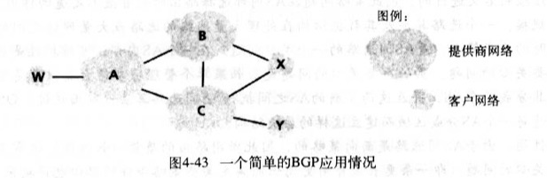
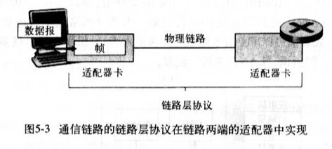

### 概念 -- 文字和图片主要来自于书籍《计算机网络自顶向下网络 2007年》
1. Internet:因特网是一个世界范围的计算机网络，互联了遍及全世界的计算设备的网络。所有的设备都被称为主机或者端系统，端系统通过通信链路和接口交换机连接在一起。
2. 通信链路：由不同的物理媒体组成，包含同轴电缆，铜线，光纤和无线电频谱。不同的链路以不同的速率传输数据，单位一般用bps来表示。
3. 传输流程：
   1. 当端A要向端B发送数据时，端A将数据分段，每段加上首部字节，这样的数据称为分组。
   2. 分组交换机从它的一条通信链路接受不了到达的分组，并从它的另一条通信链路转发该分组。
   3. 一个分组所经历的一系列通信链路和分组交换机称为通过该网络的路径。
   4. 如果将传输过程和现实世界的交通做比喻，端系统类比建筑物，通信链路类比公路/铁路，分组交换机类似于立交桥。
   5. 最出名的分组交换机是路由器和链路层交换机。
   6. 端系统通过因特网提供商（Internet Service Provider ISP）接入因特网。
4. ISP（Internet Server Provider）：因特网提供商
   1. 每个ISP是由多个分组交换机和多段通信链路组成的网络。
   2. 不同ISP为端系统提供了不同类型的网络接入，例如56kbps调制解调器接入/线缆调制解调器提供的住宅宽带接入/高速局域网接入/无线接入等。
   3. 底层的ISP通过国家的/国际的高层ISP连接在一起。
   4. 高级ISP由高速光纤链路互联的高速路由器组成。
   5. 无论是高层ISP，还是低层ISP，都是独立管理的，运行IP协议，准从一定的命名和地址习惯。
5. TCP/IP:因特网最重要的2个协议
   1. TCP： Transmission Control Protocol 传输控制协议
   2. IP： Internet Protocol 网际协议
6. IETF （Internet Engineering Task Force）:因特网工程任务组
   1. 研发因特网标准
   2. IETF的文档被称为请求评论（RFC，Request For Comment）
7. API（Application Programming Interface）：应用程序接口
   1. 由端系统提供
   2. 规定了运行在一个端系统上的软件请求因特网基础设施向运行在另一个端系统上的特定目的地软件交互数据的方式
8. 协议：定义了在2个或多个通信实体之间交换的报文格式和次数，以及在报文传输或接受，或其他事件方面所采取的动作
9. End System：端系统，位于因特网的边缘。也称为主机，主机有时候分为2类
   1. 客户机：
   2. 服务器：
10. Access network：接入网，将端系统连接到边缘路由器的物理链路
    1. 住宅接入
       1. 通过普通模拟电话线（双绞铜线）使用拨号调制解调器与住宅ISP相连；（质量参差不齐，传输速率慢，远小于56kbps）
       2. 数字用户线：一般是电话公司提供，有时有独立的ISP；
       3. 混合光纤同轴电缆
       4. 卫星接入，如StarBand，HughesNet等服务商
    2. 公司接入：在公司和校园，局域网LAN通常被用于连接端用户和边缘路由器
    3. 无线接入
       1. 无线局域网：用户与位于几十米半径内的基站之间传输/接收分组；基站与有线的因特网连接
       2. 广域无线接入网：分组基于用于蜂窝电话的相同无线设施进行发送，基站由电信服务商提供。服务范围可达数万米
11. Edge Router：边缘路由器：是端系统到任何其他远程端系统的路径上的第一台路由器
12. Digital Subscriber Line （DSL）：数字用户线
    1. 一种新型调制解调技术，也运用在双绞线电话线上
    2. 通过限制用户和ISP之间的距离，DSL能以高很多的速率获取和传输数据
    3. ISP到家庭路由的速率比家庭到ISP高得多（设计理念：接收多于发送）
    4. DSL在家庭和ISP之间将通信链路分为3个频段
       1. 高速下行通道，50KHZ-1MHZ
       2. 中速上行通道，4KHZ-40KHZ
       3. 普通双向电话通道，0-4KHZ
13. Hybrid Fiber-coaxial Cable（HFC）：混合光纤同轴电缆 
    1. HFC扩展了用于广播电视电视的网络
    2. 在传统的电缆系统中，电缆头端广播通过同轴电缆和放大器的分配网络传向住宅
    3. HFC需要特殊的调制解调器，称为电缆调制解调器（一种外部设备，通过以太网端口和家庭网络相连）。它将HFC分为了2个通道，下行通道比上行通道拥有更快的传输效率。
    4. HFC的一个重要特征是它共享广播媒体；
14. 频分多路复用技术
15. 以太网
    1. 速度达到100Mbps或1Gbps
    2. 使用双绞铜线或者同轴电缆连接
    3. 使用共享媒体
16. 基于IEEE 802.11实现的无线局域网，也称为无线因特网或WIFI
17. 物理媒体：
    1. 导引型媒体：电波沿固定媒体（如光缆，双绞铜线，同轴电缆）被导引
       1. 双绞铜线：
          1. 最便宜，最普遍。
          2. 由2根1mm粗，隔离的铜线以规则的螺旋排列着。绞合后可减小对临近双绞线电气的干扰。通常许多双绞线捆扎在一起，并用防护型保护层覆盖组成一根电缆。一对电线构成一个通信链路。
          3. 非屏蔽双绞线常用在建筑物内的计算机网络（即无线网），传输速率取决于线的厚度以及传输双方的距离，通常在10Mbps-1Gbps之间。
       2. 同轴电缆
          1. 由2个铜导体组成，同心而非并行。
          2. 能被用作导引式共享媒体，许多端系统能直接和它相连，而且所有的端系统都能接收到由其他端发送的东西
       3. 光缆
          1. 是一种细而柔软，能引导光脉冲的媒体。其中一个脉冲表示一个比特
          2. 速度能高达数十，甚至上百Gbps
          3. 他们不受电磁干扰，长达100km的光缆信号衰减极弱，并且很难接头。（跨海链路首选）
    2. 非导引型媒体：电波在空气或外层空间（如无线局域网，卫星频道）被导引
       1. 陆地无线电信道
           1. 无线电信道承载电磁频谱的信号，不需要物理线路
           2. 具有穿透墙壁，提供与移动用户的连接以及长距离承载信号的能力；但因爱与传播环境和传输信号的距离
           3. 路径损耗/遮挡衰落（阻碍物体会使信号降低）/多径衰弱（干扰对象的信号反射）/干扰（其他无线电信道或电磁信号）
           4. 分类
              1. 运行在本地区域，通常跨越数十到几百米；如无线LAN技术
              2. 运行在广域，跨越数万米；如蜂窝接入
       2. 卫星无线电信道
          1. 一颗通信卫星连接2个或多个位于地球的微波发送方/接收方，他们被称为地面站
          2. 该卫星在一个频段上接收传输，使用一个转发器再生信号，并在另一个频率上上传输信号
          3. 能提供Gbps的带宽
          4. 分为同步卫星和低地球轨道卫星
             1. 同步卫星：永久停留在地球上方相同的点上。该卫星放置在地球表面上方的36000km的轨道，280ms的时间延迟
             2. 低地球轨道卫星围绕地球旋转，类似月球；为了提供对一个区域的连续覆盖，需要在轨道放置许多卫星
18. Optical Carrier （OC）：光载波
    1. 标准速率在51.8Mbps-39.8Gbps，称为OC-1；OC-n表示51.8Mbps*n的链路速率
19. circuit switching：电路交换 
    1. 上图中，用4条链路互联4台电路交换机。这些链路每条都有n条链路，支持n条电路同时连接。
    2. 当2台主机通信时，该网络在主机之间创建一条专用的端到端连接。连接期间，该连接获得该链路带宽的1/n部分
    3. 电路多路复用 
       1. 频分多路复用（Frequency-Division Multiplexing FDM）
          1. 链路的频谱由跨越链路的所有连接共享
          2. 该链路在连接期间为每条连接专用一个频段
          3. 在电话网络中，该频段具有4kHz
          4. 该频段的宽度称为带宽
       2. 时分多路复用（Time-Division Multiplexing TDM）
          1. 时间被划分固定区间的帧；每帧又被划分为固定数量的时隙
          2. 该链路在每个帧中为该连接指定一个时隙
          3. 一个电路的传输速率等于时隙的比特数乘以该帧的速率。如果电路每秒传输8000帧，每个帧由8000比特组成，则一条电路的传输速率为64kbps
       3. 总结：FDM中每条电路连续的获得部分带宽，TDM每条电路在简短的时间间隔中周期性的得到所有带宽
    4. 例如电话网络：该网络必须在发送方和接收方建立一个连接，该路径上交换机都将为该连接维护连接状态，也预留了恒定的连接期间的传输速率
    5. 传输时间与链路数量无关
20. packet switching：分组交换
    1. 各种程序在完成其任务的时候要交换报文（任何数据）
    2. 原主机将长报文分为较小的数据块，并称之为分组
    3. 分组以该链路的最大传输速率传输（通信链路+分组交换机）
    4. 多数分组交换器在链路的输入端使用存储转发传输机制。
    5. 分组交换器有多条链路与之相连，对于每条链路，它有一个输出缓存（输出队列），存储着路由器准备发往那条链路的分组。如果到达的分组需要跨越链路传输，但发现该链路正忙于传输其他分组，该到达分组必须在输出缓存中等待
    6. 除了储存转发时延，还有输出缓存的排队时延。时延有波动，取决于网络中的拥塞水平。因为缓存空间大小有限，所以当达到的分组被等待传输的分组完全充满时，将出现分组丢失或丢包。可能是到达的分组，也可能是已经排队的分组之一将被丢弃。
    7. 举例6：餐馆服务员告知你，已经有太多人等待就餐，你必须离开餐馆（这个ð很形象。。）
21. 存储转发传输机制
    1. 概念：交换机能够开始向输出链路传输该分组的第一个比特之前，必须接收到整个分组
    2. 存储转发传输机制 导致 存储转发时延
22. 电路交换和分组交换
    1. 在电路交换中，沿着端系统通信路径，为端系统之间通信所提供的资源（缓存，链路传输速率）在通信会话之间会被预留。而分组网络不会
    2. 电路交换相当于预定，分组交换相当于实时尝试；分别代表是电话网络和因特网网络
    3. 分组交换这种按需分配，而非按预分配共享资源有时被成为资源的统计多路复用（statistical multiplexing）
    4. 趋势向分组交换发展
23. 分组怎么通过分组交换形成通路的？
    1. 每个通过网络传输的分组在它的首部包含了其目的地址
    2. 当路由器到达一台路由器时，该路由器检查分组的目的地址的一部分，并向相邻路由器转发该分组
    3. 每台路由器具有一个转发表，用于将目的地址（或目的地址的一部分）映射到输出链路
24. 选路协议：它们用于自动设置转发表
25. ISP层次 
    1. 第一层ISP，也被成为因特网主干网络
       1. 数量较少，包括Sprint，Verizon，MCI，AT&T，NTT，Level3，Qwest，Cable&Wireless
       2. 传输速率较高，链路速率通常是622Mbps或更高，大型第一层ISP可达2。5-10Gbps，响应的路由器也必须能以极高的速率转发分组
       3. 特性
          1. 直接与其他每个第一层ISP相连
          2. 与大量的第二层Isp和其他客户网络相连
          3. 覆盖国际区域
    2. 第二层ISP，通常具有区域性质或国家性覆盖规模，并且非常重要的与少数第一层ISP相连
       1. 它被成为是它所连接的第一层ISP的客户，第一层ISP相对于它来说是提供商
       2. 第二层ISP可以选择与其他第二层ISP限量，不必流经第一层ISP
       3. 某些复杂情况下，某些第一层提供商也是第二层提供商，它向较低层次ISP出售因特网接入，也直接向端用户和内容提供商出售因特网接入。当2个ISP直接相连时，他们被称为彼此是对等的
    3. 某ISP与其他ISP的连接点（可以在不同层次）被称为汇集点（Point of Presence,POP）
26. 分组交换网的时延、丢包和吞吐量
    1. 节点时延（以下四种累加起来就是节点总时延）
       1. 节点处理时延（nodal processing delay）
          1. 检查分组首部和决定将该分组所需要的时间（主要部分）
          2. 检查比特级差错所需要的时间（微秒甚至更低）
       2. 排队时延 (queuing delay)
          1. 当分组在链路上等待传输时，它经受排队时延（通常在毫秒到微秒级）
          2. 取决于流量到达该排队的性质，链路的传输速率和到达流量的性质（周期、突发）
          3. 计算
             1. 假设米秒到达分组为a pkt/s
             2. 假设每个分组都有L比特组成
             3. 假设传输速率为R bps
             4. 那么x=La/R被称为流量强度 
                1. 如果x>1，那么比特叨叨队列的平均速率超过该队列传输出去的速率，队列的增加将趋向于无穷大。⚠️  
                2. 
          4. 丢包：流量强度趋近于1时，因为排队容量有限，排队时延不会趋向于无穷大。分组发现将达到一个满的队列，没有地方存储它，路由器将丢弃该分组。
          5. 节点性能要根据时延和丢包率来衡量
       3. 传输时延（存储转发时延，通常在毫秒到微秒级）(transmission delay)
       4. 传播时延(propagation delay)
          1. 取决于物理媒体
          2. 2-3✖️10的8次方，略低于光速。time=distance/speed
          3. 通常在毫秒级
       5. 传输和传播时延的区别
          1. 前者是路由器将分组推出所需的时间，他是分组长度和链路传输速率的函数，与路由器间距无关
          2. 后者是一个比特从一台路由器向另一台路由器传播所需要的时间，它是距离的函数，与分组的长度或链路的传输熟虑无关
          3. 例子：2座收费站距离100KM，汽车的时速为100KM/H，通过一座收费站需要12s。时延分别为12s，1h
    2. 端到端时延
       1. 处理时延，传输时延，传播时延
       2. 拨号调制解调器的调制/解码时延（几十毫秒）
       3. 媒体分组化时延（IP语音应用）
27. traceroute :可以指定目标主机后，源主机向目标主机发送N个特殊的分组。
    1. 经历的各个路由器接收到这个特殊分组后，会向源主机发一个短报文，该报文包含路由器的名称和地址
    2. 目标主机收到第N个分组时，他也会返回一个报文。报文包含它发送第一个分组到接受并返回报文经受的时间，也包含路由器的名字和地址
    3. RFC1393标准
    4. Linux命令
    5. http://www.traceroute.org
28. 吞吐量
    1. 瞬时吞吐量
    2. 平均吞吐量
    3. 因特网对吞吐量的限制通常是接入网。因为核心网络具有非常高速率的链路（如果核心网络传输速率低，也会影响到吞吐量）
    4. 另一个影响因素是干扰流量
29. 协议分层和服务模型
    1. HTTP/SMTP等应用层协议通常都是端系统软件实现的
    2. 物理层通常在给定链路相关的网络接口卡（例如以太网或WiFi接口卡）实现
    3. 5层因策网协议栈
       1. 应用层：将位于应用层的信息分组称为报文（message）
       2. 运输层：将运输层分组称为报文段（segment）
       3. 网络层：网络层分组称为数据报（datagram），包含IP协议，选路协议等。但IP是最重要的协议，将因特网连接在一起
       4. 链路层：链路层分组称为帧（frame）
       5. 物理层：将帧的一个一个比特从一个节点移动到下一个节点，该层协议仍然与链路相关，并且进一步链路的实际传输媒体（双绞铜线，单模光纤等）相关
    4. 7层ISO模型 ：应用层 --> 表示层 --> 会话层 --> 运输层 --> 网络层 --> 链路层 --> 物理层
    5. 分层示意图
       1. 应用层报文M被传送给运输层
       2. 运输层收取报文，并附上附加信息（运输层首部信息Ht，差错检测比特信息，允许接收端向运输层向上向适当应用程序交付报文的信息），构成运输层报文段
       3. 网络层增加了如源和目的端系统地址等网络首部信息Hn，形成网络层数据报
       4. 链路层收取网络数据报，并增加链路首部信息并创建链路层帧
    6. 如5，可以知晓每一层分组有2种类型的字段：首部字段和有效载荷字段（来自于上一层分组）
30. 网络攻击（因特网设计之初，互相信任）
    1. 将恶意软件放到用户计算机
       1. 蠕虫：无需明显用户交互就能进入设备
       2. 特洛伊木马：隐藏在有用软件中的恶意软件
    2. 攻击服务器和网络基础设施
       1. 拒绝服务（Denial-of-Service DOS）：使合法用户不能使用网络，主机或其他基础设施部分
          1. 弱点攻击
          2. 带宽洪泛（分布式DOS）
          3. 连接洪泛
    3. 分组嗅探：无线传输设备附近放置一台被动的接收机（分组嗅探器），该接收机能得到传输的每个分组的拷贝，这些分组可能包含敏感信息。
       1. 也可用于有线环境
       2. 最好的防御嗅探的方法基本都和密码学有关
       3. 分组嗅探器：Ethereal（Windows/Linux/UNIX/Mac） http://www.awl.com/kurose-ross
    4. ip哄骗：生成任意原地址、分组内容和目的地址的分组，然后将这个人工制作的分组传输到因特网中。这种将虚假原地址的分组注入因特网的能力称为IP哄骗。即决方法是端点鉴别机制
    5. 修改或删除报文（中间人攻击）
31. 端到端原则：因为某种功能必须基于端到端实现，与在较高级别提供这些功能的代价相比，在较低级别上设置设置的功能可能是荣誉或几乎没有价值。
32. 自动重传请求协议（Automatic Repeat reRequest，ARQ）：接收方再收到报文后，回应肯定确认（ACK）和否定确认（NAK），使发送方知道哪些内容被正确接受，哪些内容有误需要重传。基于这种重传机制的可靠数据传输协议称为自动重传请求。它还需要3种协议来处理存在的比特差错
    1. 差错检测
    2. 接收方反馈
    3. 重传
33. 肯定确认：ACK， positive acknowledgment
34. 否定确认：NCK， negative acknowledgment
35. 发送缓存：send buffer
36. 回退N步：GBN Go-Back-N
37. 选择重传：SR
38. 最大报文段长：MSS，maximum segment size。MSS是指报文段里应用层数据的最大长度，不包含TCP首部字段。
39. 最大传输单元：MTU，maximum transmission unit。常见值是1460字节、536字节、或512字节
40. 指数加权移动平均：EWMA，Exponential Weighted Moving Average。TCP使用它计算平均时延
41. 平均往返时延：EstimatedRTT
42. 报文段样本时延：SimpleRTT
43. 偏差时延：DevRTT
44. 显示转发拥塞指示：Explicit Forward Congestion Indication,EFCI
45. 资源管理信元：Resources-Management Cell，RM cell
46. 拥塞指示：congestion indication，CI
47. 无增长：no increase，NI
48. 显示速率：Explicit Rate，RT
49. 加性增/乘性减：Additive-Increase，Multiplicative-Decrease，AIMD算法
50. 恒定比特率：Constant Bit Rate，CBR
51. 可用比特率：Available Bit Rate，ABR
52. 虚电路（Virtual-Circuit，VC）网络
53. 数据报网络（datagram network）
54. 寿命：Time-To_Live，TTL
55. 最大传输单元：Maximum Transmission Unit，MTU
56. 因特网名字与好嘛分配机构：Internet Corporation for Assigned Names and Numbers，ICANN
57. 动态主机配置协议：Dynamic Host Config Protocol,DHCP
58. 网络地址转换：Network Address Translation，NAT
59. 全局选路算法：global routing algorithm
60. 链路状态算法：Link-State，LS
61. 分布式选路算法：decentralized routing algorithm
62. 距离向量算法：Distance-Vector，DV
63. 边界网关协议：Border Gateway Protocol，BGP
64. 自治系统号：Autonomous System Number，ASN
65. 反向路径转发：Reverse Path Forwarding，RPF
66. 距离向量多播选路协议：Distance Vector Multicast Routing Protocol， MDVMRP
67. 协议无关的多播选路协议 ：Protocol-Independent Multicast,PIM
68. 源特定多播：Source-Specific Multicast，SSM
69. 多播源发现协议：Multicast Source Discovery Protocol，MSDP
70. 局域网：Local Area Network，LAN
71. 混合光纤电缆：Hybrid Fiber-coaxial Cable，HFC
72. 媒体访问控制：Medium Access Control，MAC
73. 网络接口卡：Network Interface Card，NIC
74. 前向纠错：Forward Error Correction，FEC
75. 循环冗余检测：Cyclic Redundancy Check，CRC
76. 点对点血淤泥：Point-to-Point Protocol，PPP
77. 高级数据链路控制：High-level Data Link Control，HDLC
78. 码分多址CDMA：Code Division Multiple Access，CDMA
79. 地址解析协议：Address Resolution Protocol，ARP
80. 异步传递方式：Asynchronous Transfer Mode，ATM
81. 多协议标签交换：MPLS
82. 虚拟专用网：Virtual Private Network，VPN
83. 信噪比：Signal-to-Noise Ratio，SNR，信噪比
84. 比特差错率：BER，接收方收到的有错的传输比特的概率
85. 无线保真：Wireless Fidelity，WiFi
86. 基本服务集：Basic Service Set ，Bss
87. 接入点：Access Point，AP
88. 服务集标识符：Service Set Identifier，SSID
89. 短帧间间隔：Short Inter-Frame Spacing，SIFS
90. 分布式帧间间隔：Distributed Inter-Frame Space，DIFS
91. 无线区域个人网络：Wireless Personal Area Network，WPAN
92. 跳频扩展频谱：Frequency-Hopping Spread Spectrum，FHSS
93. 移动交换中心：Mobile Switching Center，MSC
94. 全球移动通信系统：Global System for Mobile Communication，GSM
95. 通用分组无线服务：General Packet Radio Service，GRPS
96. 通用移动通信：Universal Mobile Telecommunications Service，UMTS
97. 归属位置注册器：Home Location Register，HLR
98. 网管移动服务交换中心：Gateway Mobile services Switching Center，GMSC，简称归属MSC
99. 访问者位置注册器：Visitor Location Register，VLR
100. 移动站点漫游号码：Mobile station Roaming Number，MSRN
101. 硬保证：应用必定得到他所请求的服务质量
102. 软保证：应用将以很高的概率得到它所请求的服务质量
103. 内容分发网络：Content Distribution Network，CDN
104. 脉冲编码调制：Pulse Code Modulation，PCM
105. 前向纠错：Forward Error Correction，FEC
106. 密码块链接：Cipher Block Chaining，CBC
107. 认证中心：Certification Authority，CA，它的职责是验证身份和发行证书
108. 安全套接字层：Secure Socket Layer，SSL。相对TCP，增加了机密性、数据完整性和安全鉴别
109. 运输层安全星：Transport Layer Security，TCS，SSL3稍加修改的版本
110. 报文鉴别码：Message Authentication Code，MAC
111. 封装安全性载荷协议：Encapsulation Security Payload ,ESP
112. 安全关联：Security Association，SA。SA是一个单工连接，它由一个称为安全参数索引SPI的32比特的连接表示服标识。每个IPsec数据报都有一个用于SPI的首部字段。在相同SA中的所有数据报具有相同的SPI
113. 安全参数索引：security parameter index，SPI
114. 有线等效保密：Wired Equivalent Privacy，WEP。用于无线LAN安全
115. 可扩展鉴别协议：Extensible Authentication Protocol, EAP。EAP定义了一种端到端报文格式，用于无线LAN中客户机和鉴别服务器交互的简单的请求/响应格式。
116. EAPoL：EAP or LAN
117. 成对主密钥：Pairwise Master Key，PMK
118. 入侵检测系统：Intrusion Detection System,IDS，能够观察到潜在恶意流量并产生告警的设备
119. 入侵防止心系统:Intrusion Prevention System,IPS,能够滤除可疑流量的设备

### 网络模型-应用层
1. 通信架构
   1. 客户机/服务器体系结构
   2. 对等体系结构（P2P）
      1. 自扩展性，成本有效
      2. 高度分布和开发，具有安全隐患
2. 进程通信
   1. 进程通过一个称为套接字（应用程序编程接口 API）的软件接口在网络上发送和接收报文。开发者对于运输层控制仅限于：
      1. 选择运输层协议
      2. 也许‼️能设定几个参数，如最大缓存，最大报文段长度
3. 分类：
   1. 按可靠性：可靠数据传输/容忍丢失的应用
   2. 按吞吐量：带宽敏感的应用/弹性应用
   3. 时间敏感（准时，一定时延）
   4. 安全
4. 传输服务
   1. TCP
      1. TCP服务模型包含面向连接服务和可靠性数据传输服务，还具有拥塞控制机制
         1. 面向连接服务：之所以是面向连接服务，而不是连接服务，是因为2个进程间是以一种非常松散的方式进行连接的。TCP连接是全双工的
         2. 可靠数据传输服务：无差错，适当顺序。没有字节的丢失和冗余
      2. TCP是明文传输的，所以后续在应用层实现了TCP的加强版本，称为安全套接字（Secure Socket Layer SSL），它提供了额外功能
          1. 加密
          2. 数据完整性
          3. 端点鉴别
   2. UDP 
      1. 是一种不提供不必要服务的轻量级运输层协议，仅提供最小服务
      2. 没有握手过程，无连接
      3. 提供的是不可靠数据传输服务
      4. 不保证该报文能够被接收到，也不保证接收到的顺序
   3. 不提供的服务：图度量和定时保证
   4. 进程寻址：需要定义2种信息去识别接收进程
      1. 该主机的名称或地址（IP地址）
      2. 用来指定目的主机上接收进程的标识（端口号）
5. 应用层协议：定义了运行在不同端系统上的应用程序进程如何相互传递报文。如
   1. 交换的报文类型，如请求报文和响应报文
   2. 各种报文类型的预发，如报文各个字段及其详细描述
   3. 字段的语义
   4. 进程何时、如何发送报文及对报文进行响应的规则
6. HTTP
   1. 超文本传输协议，是Web的核心，在RFC 1945和RFC 2616进行了定义，由客户机和服务器程序2部分组成。
   2. 概念
      1. Web页面，也叫文档，由对象组成
      2. 对象简单来说就是文件，如Html文件，Jpeg图形文件等，这些文件可通过一个URL寻址
      3. URL由服务器主机名和对象的路径名组成
      4. Web服务器用于存储Web对象，每个对象由URL寻址
      5. 无状态协议
      6. 持久连接
      7. 非持久连接：每个TCP连接只传输一个请求报文和一个响应报文。如果个Web页面包含1个HTML，10张图片，那么需要建立11个TCP连接。
      8. 往返时间（Round-Trip Time RTT)
   3. 请求报文格式：
      1. 第一行叫做请求行，包含3部分
         1. 方法字段
            1. GET
            2. POST
            3. PUT
            4. DELETE
            5. HEAD:服务器会用HTTP报文响应，但是不会反悔请求对象。经常用来进行故障追踪
         2. URL字段
         3. HTTP协议版本字段
      2. 其后继的行叫首部行,http可选内容协商首部之一
         1. Connection: close表示浏览器告诉服务器请求响应后关闭连接
         2. User-agent： 定义用户代理，表示浏览器类型
         3. Accept-language： 用户想要得到的语言版本
      3. 常规格式：
      ```text
          GET /somedir/page.html HTTP/1.1
          Host: www.someschool.edu
          Connection: close
          User-agent: Mozilla/4.0
          Accept-language: fr
      ```
   4. 响应报文格式
      1. 状态行
         1. 协议版本
         2. 状态吗
         3. 相应状态信息
      2. 首部行
      3. 实体主体
      4. 常规格式：
   5. 用户与服务器的交互：cookie，其标准在RFC 2109中定义。cookie由4部分组成
      1. 用户端系统保留有一个cookie文件，由浏览器管理 
      2. http请求报文中有一个cookie首部行 
      3. http响应报文中有一个cookie首部行 
      4. web站点有一个后端数据库
      5. 示意图：
   6. Web缓存器（Web cache），也叫代理服务器，它是能够代码出事Web服务器来满足Http请求的网络实体
      1. 它有自己的磁盘存储空间，并保存最近请求过的对象的拷贝
      2. 既是服务器，又是客户机
      3. 问题点：缓存器的对象可能是陈旧的
   7. 条件GET方法：允许缓存器证实它的对象是最新的
      1. header添加 If-modified-since:velue为服务器上次接口响应的 Last-modified的值。如果对象没有更新，服务器将不会返回请求数据，而是返回状态码304标识对象未修改
7. 文件传输协议FTP
   1. FTP使用2个并行的TCP连接来传输文件
      1. 控制连接：传输控制信息，如用户标识、口令、改变远程目录的命令、"put"和"get"文件的命令
      2. 数据连接：实际传输文件。
      3. 因为FTP使用分离的控制连接，所以称FTP的控制信息是带外（out-of-band）的，类似的还有音视频连接的RTSP协议。对应的，Http属于带内发送控制信息
      4. 每次传输文件，FTP都会打开新的数据连接
      5. FTP在会话期间会保留用户的状态。对着用户在远程目录上移动，服务器必须追踪用户在远程目录树上的位置。对每个活动用户状态进行追踪，可以对FTP会话总数做限制
   2. FTP命令（详情减RFC 959）
      1. 请求
         1. USER username：用于向服务器传送用户标识
         2. PASS password：用户向服务器传送用户口令
         3. LIST： 用户请求服务器返回远程主机当前目录的所有文件列表
         4. RETR filename：用户从远程主机的但该案目录检索（get）文件。该命令触发远程主机发起一个数据连接，并在该数据连接上发送所请求的文件
         5. STOR filename：用于向远程主机的当前目录存放（put）文件
      2. 响应
         1. 331：用户名正确，请输入密码
         2. 125：传送文件开始
         3. 425：不能建立连接
         4. 452：写文件错误？
8. 电子邮件
   1. 组成：
      1. 用户代理（user agent）
      2. 邮件服务器（mail server）
      3. 简单邮件传输协议（Simple Main Transfer Protocol SMTP）
   2. SMTP
      1. RFC可以追溯到1982年，当时SMTP已经出现一段时间
      2. 限制请求报文的主体部分只能采用简单的7位ASCII码表示。如果发送多媒体需要有一个编码/加码过程
      3. 传输过程
      4. SMTP是持久连接
      5. 命令举例：
         1. HELO
         2. MAIL FROM
         3. RCPT TO
         4. DATA
         5. QUIT
      6. 和Http的区别
         1. HTTP主要获取信息，SMTP主要推送文件
         2. SMTP要求每个保温杯都是7位ASCII码格式
         3. 对于包含文本和图形（或其他媒体），http会把所有报文放在http的响应报文，电子邮件则把所有报文对象放在一个报文中
      7. 报文：
         ```text
            From：
            To：
            Subject：
            空行
            正文
         ```
   3. 邮件报文格式和MIME
      1. 在RFC 822中定义
      2. 早期的邮件对格式限制太严格，多用途因特网邮件扩展（Multipurpose Internet Mail Extension MIME）是对RFC 822进行了扩展
   4. 邮件访问协议
      1. 第三版的邮局协议（Post Office Protocol-Version 3 POP3）
         1. 客户打开一个到服务器端口110的TCP连接
         2. POP按照3个结算进行工作
            1. 特许（以明文发送用户名和口令以鉴别哦那个户）
            2. 事务处理（用户取回报文），可选操作包括
               1. 对报文做删除标记
               2. 取消报文删除标记
               3. 获得邮件的统计信息
            3. 更新（它在客户机发出quit命令后，结束POP3会话。这时，邮件服务器会删除标记的报文）
         3. 事务处理过程（RFC 1939）
            1. 使用POP3的用户通常由用户配置为"下载并删除"或者"下载并保留"
            2. POP3代理会根据用户配置决定发出什么命令
               1. 如果是下载并删除，代理会发出list、retr、dele、quit命令
      2. 因特网邮件访问协议（Internet Mail Access Protocol IMAP）
         1. IMAP将每个报文和文件夹联系起来，客户可以创建文件夹、移动、阅读、删除邮件
         2. IAMP提供了允许用户代理获取报文组件的命令，可以只读取一个报文的报文首部，或者一个多方MIME报文的一部分
      3. Http：用户和服务器使用HTTP，服务器和服务器使用SMTP
9. DNS：因特网的目录服务（Domain Name System）
   1. 定义
      1. 一个由分层的DNS数据实现的分布式数据库
      2. 一个允许主机查询分布式数据库的应用层协议
   2. DNS通常运行是BIDN（Berkeley Internet Name Domain）软件的UNIX机器
   3. DNS协议运行在UDP上，使用53端口
   4. 其他服务
      1. 主机别名
      2. 邮件服务器别名
      3. 负载分配
   5. DNS分层
      1. 根DNS服务器
      2. 顶级域DNS服务器（Top-Level Domain TLD）
      3. 权威DNS服务器
      4. 本地DNS服务器（并不属于DNS服务器的层次结构） 
   6. 调用流程
   7. DNS缓存
   8. DNS记录和报文
      1. 概念：实现DNS分布式数据的所有DNS服务器共同存储这资源记录（Resource Record ，RR），它提供了主机名到IP地址的映射
      2. 格式：\[Name,Value,Type,TTL];type决定了name和value，ttl则是过期时间
         1. Type=A:Name=host,Value=ip
         2. Type=NS:Name=域,value=权威DNS服务器的主机名
         3. Type=MX：Value是别名为Name的邮件服务器的规范主机名
      3. DNS报文：DNS查询和回答报文有相同的格式，如图
      4. DNS报文详解
         1. 前12字节是首部区域，12byte*8=96bit
            1. 第一个16bit用于表示该查询，它会被复制到对应的回答报文中，以便和请求相对应，可以理解为requestId 
            2. 标志字段
               1. 1bit的"查询/回答"标识位，0-查询，1-回答
               2. 如果某DNS服务器正好是被请求主机的权威DNS，会设置1比特的"权威"标识为
               3. 如果客户机（主机或DNS服务器）希望DNS服务器递归查询，将设置1比特的"希望递归"标志位
               4. 如果该服务器支持递归查询，在它的回答报文会对1比特的"递归可用"标志位置位
            3. 还有4和数量字段，指出了首部后4类数据区域出现的数量
         2. 问题区域包含正在进行的查询信息，该区域包括：
            1. 名字字段，用于指出正在被查询的主机名字
            2. 类型字段，用于指出正在被询问的问题类型（A，NS，MX）
         3. 回答区域包含了对最初请求的名字的资源记录，如Type/Name/Value/TTL字段。一条报文可以包含多条RR，因为一个主机名可以对应多个IP地址
         4. 权威区域包含了其他权威DNS服务器的记录
         5. 附加区域包含了一些其他有帮助的记录
      5. DNS测试 nslookup程序
   9. 如何往DNS数据库写入数据
      1. 需要提供基本权威DNS服务器和辅助权威DNS服务器的名字和IP
      2. 向注册登记机构（商业实体，它验证域名的唯一性并入库）注册，该机构确保将一个类型NS和一个类型A的记录输入TLD com服务器。
      3. 假设注册networkutopia.com域名，对应DNS服务器分别为dns1.networkutopia.com和dns2.networkutapia.com,212.212.212.1和212.212.212.212.2
      4. 那么将有2条数据库入库
         1. network.com,dns1.networkutopia.com,NS
         2. dns1.networkutopia.com,212.212.212.1,A
      5. 当用户访问此域名时，用户主机首先向本地DNS服务器发送请求，本地DNS联系TLD服务器（如果TLD服务器没有，必须联系根服务器）。TLD返回这两条资源记录，主机向212.212.212.1获取ip，然后发起连接
   10. DNS攻击
       1. DDoS带宽洪泛攻击
10. P2P应用
    1. 文件分发（BitTorrent协议）
       1. BitTorrent是一种用于文件分发的流行P2P协议。它定义
          1. 参与一个特定文件分发的所有对等方的集合称为一个洪流
          2. 在一个洪流中，对等方彼此下载等长度的文件块，块长通常256KB
          3. 当一个对等方开始加入一个洪流时，它没有对等块，但是随着时间推移，它会累积越来越多的文件块。
          4. 当它下载文件块时，也为其他对等方上传了多个文件块
          5. 当它下载结束后，他可以离开洪流，也可以留在洪流继续上传
          6. 它可以任何时候离开洪流，也可以重新加入
       2. bit torrent实现
          1. 每个洪流具有一个基础设施节点，称为追踪器。
          2. 每个加入洪流的对等方会自动向追踪器注册，并周期性通知追踪器它仍在洪流中
          3. 当一个新的对等方A加入洪流时，追踪器随机从参与对等方的集合选择一些对等方，并将这些ip发送给A。
          4. 当A与这些对等方创建并行的TCP成功后，称A与这些创建TCP连接的对等方为"临近对等方"
          5. 
          6. A将周期性的询问对等方它们具有的"块列表"，而后确定向"哪个邻居"请求"哪个块"？（使用最稀罕优先机制）
          7. 该协议采用的机制
             1. 最稀罕优先：根据当前对等方没有的块，判定哪些是邻居中拷贝数量最少的块。这个算法的目的是均衡每个块在洪流中的拷贝数量
             2. 对换算法：对等方需要确定邻居的优先权，谁提供数据的速率快选谁
                1. 对等方A持续测量接收到比特的速率，然后确定以最高速率流入的4个邻居
                2. 然后A将数据块发送给这4个邻居
                3. 每过10s，A重新计算该速率并可能修改对等方
                4. 每过30s，A将随机选择一个另外的邻居并向它发送块
             3. 部分（小块）？？？
             4. 管道
             5. 随机优先选择
             6. 残局模型
             7. 反怠慢
          8. 解决了"免费搭车"问题（只下载不上载）
    2. 在对等方社区中组织并搜索信息（信息到主机位置的映射）
       1. 集中式索引  
          1. 单点故障
          2. 性能瓶颈和基础设施费用
          3. 侵犯版权
       2. 查询洪泛 
          1. 最流行的是Gnutella协议
          2. 性能和查询精准度不可兼得
       3. 层次覆盖 
          1. 结合了上2者的有点，与因特网高速连接的对等方被指派为超级对等方，它维护者子对等方的索引。
       4. 分布式三列表（Distributed Hash Table ，DHT）
          1. 产生一个全分布式索引，该索引将文件标识映射到文件位置
          2. 郧西用户确定文件的所有位置，而不会产生过量的搜索流量
    3. Skype（一个成功的因特网电话应用）
11. TCP套接字编程
12. UDP编程
13. 端口号
    1. 16比特的数据，在0-65535之间
    2. 部分端口已被占用（HTTP-80，FTP-22等）

### 网络模型-传输层
1. 概述
   1. 运输层为运行在不同主机的应用进程提供了逻辑通信（logic communication），而非物理通信。
   2. 逻辑通信概念
   3. IP协议为主机提供了逻辑通信，它的服务模型是尽力而为交付服务（base-effort delivery service）。但是它并不保证报文的交付/按顺序交付/报文的完整性。
   4. UDP和TCP的基本任务是将两个端系统的Ip的交付服务扩展为运行在两个端系统上进程之间的交互服务。
      1. 将主机间的交付扩展到进程间交付，称为运输层的多路复用（transport-layer multiplexing）与多路分解（demultiplexing）
      2. UDP和TCP还可以通过在其报文段的首部添加差错检测字段而提供完整性检查
   5. TCP提供的服务
      1. 可靠数据传输：通过流量控制、序号、确认和定时器技术，保证数据正确的、按顺序的交付
      2. 拥塞控制
   6. UDP提供的服务
      1. 数据交付
      2. 差错检测
   7. 多路复用与多路分解
      1. 将运输层报文段的数据交付到正确的套接字称为多路分解
      2. 从源主机的不同套接字收集数据块，并为每个数据块封装上首部信息从而生成报文段，然后将报文段传输到网络层的工作称为多路复用
         1. 套接字有唯一表示标识符
         2. 每个报文段有特殊字段（包含源端口号和目标端口号）来指示该报文段所要交付的套接字。
      3. UDP套接字使用包含目的IP地址和目的端口号的二元组来标识，TCP套接字包含（源IP地址，源端口号，目的IP地址和目的端口号）；举例：
         1. 如果2个UDP报文携带同样的IP和端口号，那么将通过相同的套接字定向到相同的目的进程
2. UDP
   1. 优点
      1. 应用层能更好的控制要发送的数据和发送时间
      2. 无需连接建立（无连接状态，分组首部开销小 ，8字节相对于20字节的TCP头部）
   2. UDP报文格式
      1. 源端口号（2字节 16比特）
      2. 目标端口号（2字节 16比特）
      3. 长度（2字节 16比特）:指明了包含首部在哪的UDP报文段长度
      4. 校验和（2字节 16比特）
         1. 计算方式：发送方的UDP对报文段中的所有16比特字的和进行反码运算，求和时遇到的任何溢出都被回卷。
         2. 实现差错检测功能（不提供差错恢复，某些实现丢弃受损报文，有些则是将受损内容交给应用程序告警）
3. 可靠性传输协议 Reliable data transfer protocol
   1. 协议演进
      1. 完全可靠信道上的可靠数据传输 rdt1.0 
         1. 发送方（图a）和接收方（图b）都有一个有限状态机（finite-state-machine，FSM）
         2. 此处FSM只有一个状态，图中的箭头指示协议从一个状态跃迁到另一个状态（回到自身）；引起变迁的事件在横线上方，事件发生时的状态显示在横线下方；对事件没有采取动作或没有动作使用符号^表示。FSM的初始状态使用虚线表示
      2. 具有比特差错信道上的可靠数据传输：rdt2.0
         1. 该协议使用了差错检测、肯定确认和否定确认
         2. 发送方有2个状态。
            1. 左边状态：发送方协议正等待来自上层的数据，放rdt_send(data)事件发生时，发送方将产生一个包含待发数据的分组（sndpkt），计算出检验和，然后经由udt_send(pkt)发送该分组
            2. 右边状态：发送方协议等待接收方的ACK或者NCK分组（等待期间不能接受上层数据，更不能发送数据，这种行为被称为停等协议）
               1. 如果收到ACK，回到等待上层数据的状态
               2. 如果NCK，该协议重传最后一个分组，并等待接收方的响应
         3. 接收方的FSM只有一个状态，分组到达时，要么响应ACK，要么响应NCK
         4. ACK或者NCK受损的情况？在数据分组中添加一个新的字段，让发送方对数据分组编号，即将发送的数据的序号放在该字段。接收方只需要检查序号即可确定收到的分组是否是重传。
      3. rdt2.1 
      4. rdt2.2（接收方必须包括一个由ACK确认的分组序号，发送方需检测确认中的分组序号是否正确，解决丢包后怎么处理） 
         1. 校验和
         2. 序号（冗余分组功能）
         3. ACK分组
         4. 重传
      5. 具有比特差错的丢包信道上的可靠数据传输 rdt3.0 
         1. 发送方
         2. rdt3.0 也被称为比特交替协议
         3. 流水线可靠数据传输协议
            1. 停等协议的效率非常低，发送方往信道写入数据的时间比数据往返时间少好几个数量级，经常处于等待状态
            2. 流水线协议带来的影响
               1. 增加序号范围。每个分组（不包含重传）都必须有一个唯一的序号，而且允许有多个传输中未确认的分组
               2. 协议的发送方和接收方必须能缓存多个分组
               3. 所需序号的范围和对缓冲的要求取决于数据传输协议处理丢失、损坏、过度延时的方式
            3. 处理差错恢复的2中基本方法
               1. 回退N步（Go-Back-N，GBN）
                  1. 允许发送方发送多个分组而不需等待确认，但是流水线中未确认的分组数不能超过某个最大允许数N。因此N常被称为窗口长度，GBN也被称为滑动窗口协议
                  2. FSM模型
                  3. 发送方响应事件
                     1. 上层调用：当上层调用rdt_send()时，发送方首先检查发送窗口是否已满。未满则创建分组并发送，已满则将数据返回上层，或者其他方式（不同协议的实现不同）
                     2. 收到ACK：在GBN协议中，对序号为n的分组的确认采取累计确认方式，标识接收方已正确接受到序号n以前的所有分组。
                     3. 超时事件：如果出现超时，定时器将重传所有已发送但未被确认的分组
                  4. 接收方
                     1. 如果一个序号为n的分组被正确接收到，并且按序（上次交付给上层的数据是序号未n-1的分组），则接收方给分组n发送一个ACK，并将数据交付给上层。
                     2. 其他所有情况都将丢弃该分组，并为最近按序收到的分组重传ACK
               2. 选择重传 SR 
                  1. 发送方
                     1. 上层调用：同GBN
                     2. 超时：定时器用来防止丢失分组。每个分组必须有自己的逻辑定时器，因为超时后只能发一个分组
                     3. 收到ACK：如果收到ACK，且序号在窗口中，则SR发送方经那个被确认的分组标记为已接受。如果该分组序号=send_base，则窗口基序号向前移动到具有最小序号的未确认分组处。窗口移动后发送未发送的序号
                  2. 接收方
                     1. 序号在\[rcv_base,rcv_base+N-1]内的分组被正确接收，则发送ACK；
                     2. 如果是以前没收到的分组，则被缓存；
                     3. 如果该分组的序号等于接收窗口的基序号rcv_base，则该分组以及之前被缓存的序号连续的分组交付给上层，然后接收窗口向前移动；
                     4. 序号在\[rcv_base-N,rcv_base-1]内分组被接收，必须产生ACK，即该分组是之前已确认的分组；(ACK可能丢失，双方窗口不一致)
                     5. 其他情况，忽略该分组
                  3. 窗口太大的困境：如何判断是新分组，还是重传
4. TCP协议
   1. TCP连接
      1. 全双工服务：数据在进程A和B双向流通
      2. 点对点连接：是在单个发送方和单个接收方的连接（多播指在一次发送操作中，从一个放松方将数据库传送给多个接收方，TCP不支持多播）
      3. 建立连接的过程（3次握手） ：客户端先发送一个特俗的TCP报文段，服务器使用另一个特殊的报文段来响应，客户端再用第三个特殊报文响应（第三次可以承载有效载荷）
      4. 数据传送
         1. 数据一旦通过socket套接字，就由客户机运行的TCP控制。TCP将这些数据引导到该连接的发送缓存（三次握手初期设置的缓存之一）里，不时取数据去发送。
         2. TCP从缓存中取出并放入报文段的数据量受限于最大报文段长（MSS）。MSS通常根据最大链路层帧长度来设置，本地发送主机发送长度是这样的帧，即最大传输单元（MTU）。
         3. TCP将每块客户机数据加一个TCP首部，从而形成多个TCP报文段。这些报文段被下传给网络层，网络层将其分别封装在网络层IP数据报中。然后这些IP数据报被发送到网络中
         4. TCP另一端接收到一个报文段后，该报文段的数据就被放入该TCP连接的接收缓存中。
         5. TCP缓存
      5. TCP报文段结构
         1. 原端口号+目的端口号（32bit）：用于多路复用/多路分解来自或送至上层应用的数据
         2. 序号字段（32bit）
            1. 序号建立在传送的字节流上，而不是建立在传送的报文段的序列之上。序号是指该报文段首字节的字节流编号
            2. 假设需要传输500000字节的文件，MSS=100，那么第一个报文段的序号=0，第二个报文段的序号=1000...
         3. 确认号字段（32bit）
            1. 填写发送方期望从连接方接收到的下一字节的序号（因为TCP是全双工服务）
            2. 假设A收到B包含字节0-535，900-1000的报文段，在等待536及其之后的字节。这里将发送536。（失序的900-1000报文并没有规则怎么处理，丢弃或缓存，实际使用了后者）
            3. 因为TCP只确认数据流中至第一个丢失字节为止的字节，因此被称为累计确认
         4. 接收窗口（16bit）
         5. 首字段长度（4bit）
         6. 可选与变长的选项字段：用于发送方和接收方协商的最大报文段（MSS），活在高速网络环境下用作窗口调节因子时使用
         7. 标志字段（6bit）
            1. ACK：用于确认指示字段中的值是有效的，即该报文段包括一个对已被成功接收的报文段的确认
            2. RST、SYN、FIN用于连接建立和拆除
            3. PSH：该值被设置标识接收方应立即将数据交给上层
            4. URG：标识报文段里存在被发送方上层置为"紧急"的数据。紧急数据的最后一个字节是由16比特的紧急数据指针字段指出。
         8. 紧急数据指针（16bit）：当紧急数据存在并给出指向紧急数据尾的指针时，TCP必须通知接收方的上层实体。
         9. 互联网校验和（16bit）
         10. 备注：PSH、URG和紧急数据指针并没有使用???
   2. telnet协议
   3. 往返时延的估计与超时
      1. 往返时延估计
         1. 报文段的样本RTT（SimpleRTT）是从某报文段发出（交给IP）搭配对该报文段的确认被收到之间的时间量。
         2. 因为SimpleRTT是波动的，为了估计平均值，TCP还维护了一个平均RTT（EstimatedRTT）。每当收到一个新的SimpleRTT，会对应的更新EstimatedRTT
         3. EstimatedRTT计算公式：EstimatedRTT = EstimatedRTT(1 - a) + a * SimpleRTT ;RFC 2988定义a=0.125
         4. 随着SimpleRTT数量增多，最终趋向于平缓。a=0.125远大于1/次数，因为最新的SimpleRTT反应了最新情况，占比重较大
         5. RTT偏差DevRTT=(1-b)*DevRTT+b*|SampleRTT-EstimatedRTT|，b的推荐值为0.25
      2. 设置和管理重传时间间隔
         1. 超时时间应大于EstimatedRTT，否则会造成不必要的重传
         2. 超时时间不应超出EstimatedRTT太多，否则当报文段丢失，TCP不能很快重传报文段，传输时延较大
         3. TimeoutInterval=EstimatedRTT+4*DevRTT
   4. 可靠数据传输
      1. IP不保证数据报的交付，数据报的按序交付，也不保证数据的完整性。TCP的可靠数据传输服务保证一个进程从其接收缓存中读出非损坏的/无间隔的/非冗余的/按序数据流，与发送端发出字节流完全一样。
      2. 简单发送方
         1. 意外情况
            1. 确认丢失，超时后发起重传，主机丢失重复包并返回ACK。
            2. 确认超时，超时后发起重传，主机丢失重复包并返回最新ACK。
            3. 确认丢失，主机返回最新ACK。
         2. 加倍时间间隔。第一次发送报文的timeoutInterval根据公式计算得出，之后每次TCP重传会将下一次的超时事件设为先前值的2被。防止因为网络拥塞时持续输入，使拥塞更严重。
         3. 快速重传。当发送方接收到对相同数据的3个冗余ACK，他就认为跟在这个已被确认3次的报文段已经丢失，然后执行快速重传
         4. 回退N步，还是选择重传？都没有，TCP使用选择确认：它允许TCP接收方有选择的确认失序报文段，而不是累计的确认最后一个正确接受的有序的报文段。
   5. 流量控制服务(flow-control service)
      1. 用于消除发送方使接收方缓存溢出的可能性
      2. 和拥塞控制很相似，但是针对不同原因针对的措施
      3. 过程说明：
         1. 发送方维护一个接收窗口RcvWindow=RcvBuffer-\[LastByteRcvd-LastByteRead] >= 0;当接收方RcvWindow=0，发送方仍然会发送一个字节的报文段，以获取最新的RcvWindow值，否则永远不会更新
   6. TCP连接管理
      1. 客户端TCP向服务端发送一个特殊的TCP报文段，它不包含应用层数据，首部SYN标志位被置为1。另外，客户机会选择一个起始序号（client_isn，随机化，避免某些安全攻击），并放在SYN报文的序号字段。通过IP发送给服务器
      2. 服务器收到数据后，为该TCP连接分配TCP缓存和变量，并向客户机TCP发送允许连接的报文段。报文段不包含应用层数据，包含3个重要的首部字段
         1. SYN置为1
         2. 确认号字段=client_isn+1
         3. 初始化服务器序号(server_isn)并放入TCP报文段首部的序号字段
      3. 客户端收到SYNACK报文段后，为该连接分配缓存和变量。并向服务器发送一个报文段
         1. SYN置为0
         2. 确认号字段=server_isn+1
      4. 连接建立完成，之后每个报文的SYN都等于0
      5. 客户端发送FIN=1
      6. 服务端回复ACK
      7. 服务端回复FIN
      8. 客户端回复ACK，连接断开
      9. 图例
   7. 拥塞控制服务
      1. 原因
         1. 分组速率接近链路容量时，分组经历的巨大排队时延
         2. 发送方必须执行重传以补偿以补偿因为缓存溢出而丢失的分组
         3. 当一个分组沿一条路径被丢弃时，每个上游路由器用于转发该分组而使用的传输容量最终被浪费掉了
      2. 方法
         1. 端到端拥塞控制
         2. 网络辅助的拥塞控制
      3. ATM ABR拥塞控制（属于网络辅助的拥塞控制）：
         1. ATM采用面向虚电路（VC）的方法来处理分组交换。
         2. 源到目的地的路径每条交换机都维护着源到目的地VC的状态，可以根据状态跟踪发送方的行为，并采取特定的拥塞控制动作。
         3. ATM ABR拥塞控制基于速率，即发送方明确的计算出他能发送的最大速率，并据此对自己进行相应的调整。交换机向接收方通知交换机拥塞的机制：
            1. EFCI比特。每个数据信元都包含1比特的显示转发拥塞指示。一个拥塞的网络交换机可把数据信元中的EFCI比特设置为1，来向目的主机发出拥塞的信令。目的检测到达的RM信元，如果多数信元的EFCI被置为1，目的地将RM的EFCI设为1，并将该RM发送给发送方，通知网络拥塞
            2. CI和NI比特。RM信元和数字信元的比例可调，默认是1:32。RM信元有一个CI比特和NI比特，NI比特置为1标识轻微拥塞，CI比特标识严重拥塞
            3. 每个RM信元还包含1个2字节的ER字段。一个拥塞的交换机可能降低经过的RM信元中ER的值，ER字段将被设置源至目的地路径上所有交换机中的最小支持比率
   8. TCP拥塞控制
      1. TCP必须使用端到端拥塞控制机制，因为IP层不向端系统提供显示的网络拥塞反馈？？？
      2. TCP发送方通过感知网络拥塞的程度，来调节发送流量的速率。
         1. 发送方如何限制发送速率？
         2. 发送方如何感知网络拥塞？
         3. 采用什么算法来改变发送速率？
      3. 发送速率计算，TCP让每一段记录一个额外变量，即拥塞窗口（congestion window，congWin），LastByteSent-LastByteAcked <= min{congWIn,RcvWindow}
      4. TCP拥塞控制算法
         1. 加性增，乘性减（AIMD）
            1. 当出现丢包事件，通过减小congWin降低发送速率。每发生一次丢包，congWin减半，最低不小于一个MSS。
            2. 如果没有检测到拥塞，则可能有可用带宽，TCP会缓慢增加CongWin长度。实际上，TCP发送方每收到一个确认后酒啊CongWin增大一点，其目标是在每个往返时延的congWin增加一个MSS。
            3. 
         2. 慢启动（Slow Start，SS）
            1. TCP连接开始时，congWin的长度只有一个MSS。但如果带宽很大，需要很久的时间才能达到最大速度。
            2. 因此RTT已指数的形式递增，每过一个RTT，congWin翻倍，直到发生一个丢包事件为止。
            3.  
         3. 对超时事件做出反应
            1. 如果TCP收到3个冗余ACK，当作普通丢包事件处理，congWin减为一半。
            2. 如果收到超时事件，TCP发送方进入一个满启动阶段。指数增长，丢包，congWin减为一半...（在Tahoe算法中，3个冗余ACK也会进入慢启动，Reno不会，后者被称为快速恢复）
            3. TCP通过维持一个阈值来管理这个动态过程，它用来确定慢启动将结束并且拥塞避免将要开始的长度。Threshold初识时被设置为一个很大的值，每发生一次丢包，threshold=congWin/2。
            4. 
         4. 对TCP吞吐量的宏观描述假设congWin=2，发送速率在线性增长和减半中，则平均吞吐量=(0.75*w)/RTT
   9. 某些版本的TCP协议使用了隐式NAK机制
5. 常用协议使用的传输层协议
6. 其他协议：
   1. 数据报拥塞控制协议：Datagram Congestion Control Protocol，DCCP
      1. 它提供了低开销/面向报文/类UDP的不可靠服务，但是具有应用程序选择形式的拥塞控制。这种形式与TCP兼容
      2. 如果某应用程序需要可靠或者半可靠的数据传送，则将在应用程序中执行
   2. 流传输控制协议：Stream Control Transmission Protocol，SCTP
      1. 可靠的、面向报文的协议，运距将几个不同的应用层次的'流'多路复用到单个SCTP连接上
      2. 协议对该连接中的不同流分别进行处理，一个流的分组丢失不影响其他流数据的交付
      3. 当一台主机与2个或更多个网络连接时，SCTP也允许数据经2条出去的路径传输、失序数据可选的交付
      4. SCTP的流控制和拥塞控制算法基本上与TCP相同
   3. TCP友好速率控制：TCP-Friendly Rate Control，TFRC
      1. 是一种拥塞控制协议，而非运输层协议
      2. 这种机制可以用于注入DCCP等另一种运输层协议，它的目的是使TCP拥塞控制的"锯齿"更加平滑，同时维护一种长期的发送速率
      3. 通过检测到的丢包率计算TCP的吞吐量，从而计算TFRC的目标发送速率


### 网络模型-网络层
1. 概述
   1. 重要功能
      1. 转发：当一个分组到达某路由器的一条输入链路时，该路由器必须将分组移动到合适的输出链路。
         1. 每台路由器具有一张转发表。它检查到达分组首部的一个字段的值，使用该值在转发表中索引查询来转发一个分组。查询转发表的结果时分组被转发的路由器的链路接口。
         2. 分组首部值可能是目的地址，或分组所属连接的指示，取决于网络层协议
         3. 
      2. 选路：当分组从发送方流向接收方时，网络层必须决定这些分组所采用的路由或路径。计算这些路径的算法被称为选路算法。
      3. 连接建立：
   2. 约定术语
      1. 分组交换机：它根据分组首部字段的值，从输入链路接口到输出链路接口传送分组。分为链路层交换机和路由器
      2. 链路层交换机：基于家链路层字段中的值做转发决定
      3. 路由器：根据网络层字段的值做转发决定
   3. 网络服务模型
      1. 定义:网络的一侧边缘到另一侧边缘之间分组的端到端运输特性
      2. 网络层提供服务（部分，3-6能给源和目的之间提供分组的流？？？）
         1. 确保交付，该服务确保分组将最终到达其目的地
         2. 具有时延上界的确保交付，该服务不仅确保分组的交付，而且在特定的主机到主机时延上界内（如100ms内）交付
         3. 有序分组交付，保证分组以他们被发送的顺序到达目的地
         4. 确保最小带宽，只要发送主机以低于特定比特率的速率传输比特，分组就不会丢失，且每个分组会在预定的主机到主机时延内到达
         5. 确保最大时延抖动。该服务确保发送的2个两个相继分组之间的时间量等于在目的地接收到他们之间的时间量，或这种间隔的变化不超过某些特定的值
         6. 安全性服务。使用仅仅源和目的主机知晓的秘密绘画钥匙，源主机中的网络层能加密向目的主机发送的所有数据报负载，目的主机的网络层则负责解密。除了保证机密性，还能校验数据完整性/鉴别源
   4. ATM网络体系架构
      1. 恒定比特率ATM网络服务
      2. 可用比特率ATM网络服务
2. 虚电路和数据报网络
   1. 运输层提供的面向连接/无连接服务，与网络层提供的面向连接/无连接的差别
      1. 在网络层，这些服务是网络层提供给运输层。在运输层，这些服务则是运营层向应用层层提供的进程到进程的服务。
      2. 在目前所有主要的计算机网络体系结构（因特网，ATM，帧中继）中，网络层或者提供了主机到主机的无连接服务，或者提供了主机到主机的连接服务，而不同时提供2者。
         1. 仅在网络层提供连接服务的计算机网络被称为虚电路（Virtual-Circuit，VC）网络
         2. 仅在网络层提供无连接服务的计算机网络被称为数据报网络（datagram network）
      3. 在运输层实现面向连接的服务和在网络层实现不同。运输层面向连接服务是在位于网络边缘的端系统实现，网络层连接服务除了在端系统，也在位于网络核心的路由器中实现
   2. 虚电路 VC
      1. 组成：
         1. 源和目的主机之间的路径（一系列链路和路由器）
         2. VC号，沿着该路径的每段链路一个号码
         3. 沿着该路径的每台路由器中的转发表表项。
            1. 属于一条虚电路的分组将在它的首部携带一个VC号
            2. 因为一条虚电路在每条链路上可能具有不同的VC号，所以每台路由器必须用一个新的VC号替代每个传输分组的VC号。该新的VC号从转发表获得
      2. 阶段
         1. 虚电路建立：发送方运输层和网络层联系，指定接收方地址，等待该网络建立虚电路。网络层决定发送方和接收方的路径，即该虚电路的所有分组要通过的一系列链路和路由器。网络层为该路径的每条链路确定一个VC号。最后，网络层在沿着路径的每条路由器的转发表增加一项。除此，网络层还可以预留虚电路路径上的资源，如带宽。
         2. 数据传送：
         3. 虚电路拆除：发送方（或接收方）通知网络层终止虚电路时，网络层将通知网络另一侧端系统结束呼叫，并更新路径上每台路由器中的转发表以表明该虚电路已不存在了。
      3. 和运输层建立连接的区别
         1. 运输层连接建立仅涉及2个端系统，2个端系统独自决定运输层连接的参数，但是网络层的路由器毫不知情
         2. 虚电路网络层连接建立，沿2个端系统路径上路由器都要参与虚电路的建立，且每台路由器都完全知道经过它的所有虚电路
      4. 端系统向网络发送指示虚电路启动与终止的报文，已经路由器之间用于建立虚电路（即修改路由器中表的连接状态）的报文被称为信令报文（signaling message）
      5. 用来交换信令报文的协议被称为信令协议（signaling protocol）
   3. 数据报网络
      1. 数据传送
         1. 步骤
            1. 发送方传送层将分组发送给网络层
            2. 网络层为分组加上目的地端系统的地址，然后将该分组推进网络中（无需建立虚电路，路由器也不维护任何有关虚电路的状态信息）
            3. 路由器根据该分组的目的地址来转发分组。（路由器有一个将目的地址映射到链路端口的转发表；当分组到达路由器时，该路由器根据目的地址在转发表中查找适当的输出链路端口，然后将该分组向该输出链路接口转发）。
         2. 示意图
         3. 和VC对比
            1. VC的建立和拆除，都立即更新路由器，延迟时间在微秒级；数据网网络的转发表是由选路算法修改的，通常1-5分钟更新一次。
            2. 数据报网络的转发表能在任何时刻修改，所以在2个端系统之间发送的一系列分组可能通过不同的路径，并可能无序到达。
   4. 数据报网络和虚电路的由来
      1. 虚电路来源于电话界，采用了真正的电路。
      2. 因特网由互联计算机的需求发展而来。由于端系统设备复杂得多，因特网设计者选择时网络层服务模型尽可能简单。特性：
         1. 提供最少服务保证的因特网模型，是的互联使用不同的链路层技术（卫星、以太网、光纤、无限）的网络变得更加容易，而且具备不同的传输速率和丢包特性。
         2. web饮用，DNS服务等都是在位于网络边缘的主机（服务器）实现的，增加一项新服务能力只需要将一台主机介入到网络中，并订一个新的应用层协议即可，这是的web之类的新服务可以很快的在因特网得到应用。
3. 路由器工作原理
   1. 结构
      1. 示意图
      2. 输入端口
         1. 将一条输入的物理链路接到路由器的物理层链路
         2. 执行需要与位于入链路远端的数据链路层功能交互的数据链路层功能
         3. 查找与转发，使转发到路由器交换结构的分组能出现在对应的输出端口
         4. 控制分组从输入端口转发到选路处理器
      3. 交换结构：将路由器的输入端口连接到它的输出端口。交换结构完全包容在路由器中，相当于网络路由器中的网络
      4. 输出端口：存储经过交换端口转发给它的分组，并将这些分组传输到输出链路。输出端口执行与输入端口顺序相反的数据链路层和物理层功能。当一条链路是双向链路时，输出端口和输入端口在线路卡上成对出现。
      5. 选路处理器：执行选路协议，维护选路信息和转发表，并执行路由器中的网络管理功能
   2. 输入端口
      1. 
      2. 每个输入端口都拷贝了一份转发表（会被更新），直接做出转发决定，无需调用中央选路处理器，可避免单点瓶颈。
      3. 如果输入端口处理能力受限，依然会将分组转发给中央选路处理器处理。处理速率期望达到线路速度（line speed，即一次查找时间应少于输入端口接收分尊的时间），约百万次每秒
      4. 查找算法：
         1. 内容可寻址内存（Content Addressable Memory，CAM）：允许将一个32比特的ip地址提交给CAM，由它再以基本上常熟时间返回改地址对应的转发表表项内容。
         2. 高速缓存 Feldmeier 1988
         3. 新数据结构 Waldvogel 1997
         4. 压缩转发表 Brodnik 1997
         5. ...
      5. 多个输入端口同时向交换结构传输分组时，可能会因为并发阻塞，导致排队和调度
   3. 交换结构
      1. 
      2. 交换结构位于路由器的核心部位，通过它才能实际的从输入端口转发到一个输出端口中。上图有3中交换技术
         1. 经内存交换
         2. 经一根总线交换：输入端口经共享总线将分组直接传送到输出端口，不需要选路交换器的干涉。但由于总线共享，一个只能有一个分组通过总线传送，路由器交换带宽首总线速率的限制。
         3. 经一个互联网络交换：使用2n条总线组成的计算机互联网路将n个输入/输出端口连接。一个新到达的分组沿水平总线穿行，在交叉点判断输出端口是否空闲，而从传输或阻塞。
   4. 输出端口
      1. 
   5. 排队
      1. RFC 3439规定，路由器缓存量B=RTT*C（链路容量）
      2. Appendzeller 2004提出新的计算公司B=RTT*C/n，n平方=N（TCP流）。说明N越大，所需的缓存长度将明显减小
      3. 因为可能的输出阻塞，输出端口的分组调度程序必须从这些排队的分组选一个进行传送。选择策略有：
         1. 时间顺序FCFS调度
         2. 加权公平排队WFQ调度
      4. 如果没有足够的缓存保存分组，那么必须丢弃新到达的分组，或者删除正在排队的分组，这些策略被称为主动队列管理算法（Active Queue Management，AQM）算法
      5. 随机早期检测（Random Early Detection，RED）算法属于一种最广泛的AQM算法
         1. 为输出队列长度维护一个加权平均值avg
         2. 如果平均值小于最小阈值min，新分组直接纳入队列；若avg>max，该分组被丢弃；若min<avg<max，该分组以某种概率被标记或丢弃
      6. 线路前部（Head-Of-thd-Line ,HOL)阻塞:输入队列的第一个元素被阻塞，导致后续的元素不能被转发给输出端口。McKeown 1997b讨论了许多解决HOL阻塞的方法。
4. 网际协议：因特网的转发和编址
   1. 组件
      1. 示意图
      2. IP协议
      3. 选路组件
      4. 报告数据报中差错和对某些网络层信息请求进行响应的设施
   2. 数据报格式
      1. 示意图
      2. 4比特版本号：路由器可根据版本号确定如何解释IP数据报的剩余部分，不同版本号使用不同的数据报格式
      3. 4比特首部长度：IPv4数据报可包含一些可选项，首部长度用来确定IP数据报中的数据部分实际从哪里开始。大多数IP数据版不包含可选项，几乎都有20字节的首部
      4. 8比特服务类型：服务类型TOS用来区分不同类型的IP数据报
      5. 16比特数据报长度：这是IP数据报的总长度（首部+数据），以字节计，所以IP数据报的理论最大长度为65535字节。实际应用中，数据报很少超过1500字节
      6. 16比特标识：
      7. 3比特标志：
      8. 13比特片偏移：
      9. 8比特寿命：（Time-To-Live，TTL）字段用来确保数据报不会永远在网络中循环。每当数据报经过一台路由器时，该字段值减1。若TTL=0，该数据报会被丢弃
      10. 8比特协议：该字段仅在一个IP数据报到达最终目的地才会用到，用于指明IP数据报的数据部分应交给那个运输层协议。6表明数据交给TCP，17表明交给UDP，其他详见RFC1700，RFC3232
      11. 16比特首部校验和：用于帮助路由器检测收到的IP数据报中的比特错误。计算过程如下：
          1. 将首部中的每2个字节当作一个树，用反码运算对这些数求和
          2. 将和与数据报首部携带的校验和比较。
             1. 如果检测出错，丢弃该数据报
             2. 如果检测正确，路由器重新计算校验和并保存在原处。因为TTL会变化，所以需重新计算。
          3. IP只校验首部，TCP/UDP对整个报文段进行校验
      12. 32比特源IP地址
      13. 32比特目的IP地址
      14. 选项：选项字段允许IP首部被扩展，实际上很少使用，实现也比较复杂，不使用该字段可能节约开销。在IPv6协议不再使用
      15. 数据（有效载荷）：发送给运输层的报文段。TCP/IP数据报=IP首部+TCP首部+应用层报文=20字节+20字节+应用层报文
   3. IP数据报分片
      1. 并不是所有的链路层协议都能承载相同长度的网络层分组，如以太网帧可承载不超过1500字节的数据，某些广域网链路的帧可承载不超过576字节的数据，一个链路层能承载的最大数据量叫做最大传输单元。
      2. 数据转发路径会经历多个不同的链路，每个链路使用不同的链路层协议，每种协议可能具有不能的MTU。
      3. 假设数据由发送方发放第一个路由器时，MTU=1500；由第一个路由器发往第二个路由器时，MTU=576。此时，数据报会被分成更小的数据报，再经过链路层封装这些较小的数据报，然后向输出链路上发送这些帧。这些较小的数据叫做片。
      4. 片在达到目的地的运输层以前需要被重新组装，但是IPv4的设计者认为在路由器完成组装会影响路由器性能，最终组装工作在端系统完成
      5. 目的主机如何组装分片？这需要用到IP报文中标识，标志和片偏移了。
         1. 创建数据报时，发送主机给数据报设置源和目的地址的同时，设置标识号为1（不一定是1，每个IP报的标识是一样的）
         2. 路由器将数据报分片时，每个片都附加上源地址、目标地址和标识号，最后一个片的标志设为0，其他片标志设为1。
         3. 为了让目的主机确认一个片是否丢失（且按照正确的顺序重新组装片），偏移字段指定片应放在出事IP数据报的哪个位置。偏移值被规定为8字节块为单位，假设偏移为1600字节，偏移值=1600/8=200
      6. 示意图
      7. IP分片逻辑复杂，并可能导致攻击。在IPv6废止了分片。
   4. IPv4编址
      1. 主机通常只有一条链路连接到网络。当主机中的IP想发送一个数据报时，他就在该链路上发送，主机与物理链路之间的边界叫做接口
      2. 路由器与它任意一条链路的边界也叫接口
      3. IP地址在技术上时与接口相关联的，而不是包含接口的主机或路由器。 问题：难道一个路由器可以对应多个IP？？
      4. IP地址使用点分十进制记法，么个字节以十进制书写，各字节用句点隔开。
      5. 子网
         1. 示意图中，1台路由器，3个接口，互联7台主机。
         2. 左上3台主机以及连接路由器的端口的IP地址格式为223.1.1.***,左侧的24比特是相同的，这4个接口也通过一个不包含路由器的网络互联起来。
         3. IP的术语中，互联这3台主机的接口与路由器一个接口的网络形成一个子网。
         4. IP编址为这个子网分配一个地址223.1.1.0/24。/24有时称为子网掩码，表明32比特中左侧24比特定义了子网地址。任何连接到223.1.1.0/24的主机都要求其格式为223.1.1.***。
         5. 一个子网的IP定义并不局限于连接多台主机到一台路由器接口的以太网段。一般定义：分开主机和路由器的每个接口，从而产生了几个分离的网络导，接口断接了这些独立的网络的端点，这些独立的网络中的每个都叫做一个子网。
         6. 如下图中，3台路由器连接了6个子网
      6. 因特网的地址分配策略被称为无类别域间选路（Classless Interdomain Routing,CIDR)，它对于子网寻址，32比特被划分为2部分并且也具有点分十进制形式a.b.c.d/x,x指示了在地址的第一部分中的比特数
      7. 形式a.b.c.d/x的地址的x最高比特构成了IP地址的网络部分，经常被称为改地址的前缀。一个组织经常被分配一块连续的地址，即具有相同前缀的一段地址，路由匹配时大大减少了路由器转发表的长度
      8. IP地址聚合
      9. 32-x比特用于区分组织内部设备，只有组织内部的路由器转发分组时，才会考虑到这些。
      10. 在采用CIDR之前，IP地址的网络部分被限制为长度为8，16，24比特子网地址的网络被称为A、B、C类网络，这种编址方案被称为分类编址（classful addressing）
      11. 当主机向IP广播地址255.255.255.255发送数据报时，该报文会被交付给同一个子网中的所有主机
      12. 一个组织如何获得IP地址的？
          1. 网络管理员联系对应的ISP，ISP会从自己管理的地址提供一些地址
          2. 网络管理员可以配置路由器中的IP地址，或者配置主机。但通常由动态主机配置协议DHCP来完成
   5. 动态主机配置协议DHCP
      1. 是一种客户机/服务器协议
      2. 可以配置主机连接网络时使用相同的IP地址，也可以分配一个临时的IP地址（维护可用IP地址表，动态分配和回收）
      3. 除了为主机分配，DHCP还允许主机获取子网掩码、默认网关和它的本地DNS服务器的地址
      4. 因具有将主机连接进一个网络的自动化网络相关的能力，故而又称为即插即用协议（plug-and-play protocol）
      5. 4个步骤
         1. DHCP服务器发现：客户机生成包含DHCP发现报文的IP数据报，该报文使用广播目的地址255.255.255.255并且使用本主机0.0.0.0。链路层将该帧广播到所有与该子网连接的子网
         2. DHCP服务器提供：服务器收到DHCP服务器后，用一个DHCP提供报文对客户机做出响应，仍然使用IP广播地址255.255.255.255。因为一个子网可能包含多个DHCP服务器，客户机需选择1个。
         3. DHCP请求：客户机选择DHCP服务器后，用一个DHCP请求报文进行响应，回显配置参数
         4. DHCP ACK：服务器使用DHCP ACK报文对DHCP报文进行响应，证实所要求的参数。交互完成
         5. 备注1：服务器提供报文包含报文的事务ID、向客户机推荐的IP地址、网络掩码、IP地址租用期（通常为几小时或几天），且允许客户机更新租用期。
         6. 备注2：每一步使用了一类报文，发现报文、提供报文、请求报文、ACK报文
      6. 网络地址转换（NAT）
         1. 工作原理：子网的IP地址在整个Internet网络毫无意义。客户机发出的报文会被NAT-DHCP拦截，修改IP为路由器IP、端口为未使用端口。响应报文同样会被NAT拦截掉，路由器IP改为内网IP，端口修改为客户机原端口
         2. 例子：路由器IP为2.213.210.3、端口0-2000被占用，客户机IP为192.168.0.3
            1. 客户机使用端口5023向服务器2.213.210.4:80发送web请求时，NAT将源IP地址修改为2.213.210.3，源端口修改为2001，并维护2001-192.168.0.3:5023的映射关系
            2. 当NAT 的2001端口收到数据时，通过映射关系找到192.168.0.3的主机，TCP协议将对应数据给5023端口
      7. UPnP
         1. 定义：是一种允许主机发现并配置临近NAT的协议。
         2. 功能：在一台主机上运行的应用层虚能够为某些请求的公共端口号请求一个NAT映射。如果NAT接收该请求并生成映射，则外部节点能发起TCP连接。
   6. ICMP：互联网控制报文协议
      1. 介绍：定义于RFC792，用于主机和路由器彼此交互网络层信息，最典型的用途是差错报告。
      2. ICMP承载在IP分组中，作为IP的有效载荷承载
      3. 报文：一个类型字段、一个编码字段，并且包含引起该ICMP报文首次生成的IP数据报的首部和前8字节内容
      4. ICMP的类型
   7. IPv6
      1. 数据报格式
         1. 版本号：4比特。值为6，但是不兼容将4
         2. 流量类型：8比特。和IPv4的TOS字段类似
         3. 流标签：20比特。用于表示一个数据报的流
         4. 有效载荷长度：16比特。无符号整数，给出IPv6数据报跟在定长的40字节数据报首部后面的字节数量
         5. 下一个首部：8比特。标识将数据报的内容交付给哪个协议，同IPv4
         6. 跳限制：8比特。类似IPv4的TTL字段，每台经过的路由器对该字段减1，该值为0的数据报将被丢弃。
         7. 原地址：128比特。格式详见RFC4291
         8. 目的地址：128比特。格式详见RFC4291
         9. 数据：
      2. 报文相对IPv4的变化
         1. 分片/重新组装：IPv6不允许中间路由器进行分片和组装，只能在源和目的地执行。路由器遇到太大的数据报可丢弃并向发送方返回"分组太大"的ICMP差错报文即可，发送分将使用较小长度的IP数据报重发数据
         2. 去掉了校验和。IPv4的TTL变更后，需要重新计算，也会比较耗时。即时网络层去掉了，而运输层和数据链路层也执行了校验操作。
         3. 选项：可选，可能在下一个首部字段指出
      3. 相对于IPv4的变化
         1. 地址扩充到了128比特。除了单播和多播，还引入了任播地址，它可以使数据报能交付给一组主机的任意一个。
         2. 简单高效的40字节（字节，不是比特？）首部
         3. 流标签和优先级：指明某些应用的数据报比其他应用的数据报有更高的优先权（流量分vip？？）
      4. 版本迁移
         1. 指定时间，停止服务
         2. 双栈：节点同时兼容IPv4和IPv6
         3. 建隧道：可以将IPv6的数据放到IPv4的有效载荷，后面再组装
   8. IP安全性
      1. IPsec被设计为与IPv4和IPv6向后兼容
      2. 面向连接的，只需要在2台主机中可用，不影响经过的路由器
5. 选路算法（理论）
   1. 路径：一台主机通常与一台路由器相连，路径是指源路由器到目标路由器的路线
   2. 选路算法使用图描述，路由器为节点，链路为边，边的权重则是链路消耗的费用，算法目的则是求最小路径。
   3. 分类
      1. 根据该算法是全局性还是分布式来区分
         1. 全局算路算法：必须在算法开始计算之前，就明确所有节点的连通性和所有费用的输入，因此又称为链路状态算法（LS）
         2. 分布式选路算法：以迭代的，分布式的方式计算出最短路径。也称为距离向量算法
      2. 根据算法是静态还是动态来区分
         1. 静态选路算法：随着时间推移，路由变化非常缓慢，通常是人工进行调整
         2. 动态选路算法：能够在网络流量负载或拓扑变化时改变选路路径。一个动态算法可周期性的运行，或直接的形影拓扑或链路费用分变化而运行。但是容易收到选路循环、路由振荡等问题的影响
      3. 根据是负载敏感还是负载迟钝分类
         1. 负载敏感算法：链路费用会动态的反映出底层链路的当前拥塞水平
         2. 负载尺寸的算法：目前的因特网选路算法都是负载迟钝的，如RIP、OSPF、BGP
   4. 全局算路算法（链路状态算法LS）
      1. 计算过程
         1. 假设源节点为u，一共有N颗节点。u与节点v、x、w距离为2、1、5，与节点y、z不直接相连
         2. 初始化：uv=2,uw=5,ux=1;不直接与u相邻的节点y、z值为无穷大；
         3. 第二轮：此时ux最小，将x节点添加到集合，更新其他节点路径为较小值
         4. 重复循环，直到第N轮
         5. 
      2. 问题
         1. 时间复杂度为N平方，（一种优化实现采用堆结构在对数时间而不是线性时间）
         2. 链路不是堆成的，u->v和v->u的值未必相等，可能会引起路由振荡。
   5. 分布式选路算法(距离向量算法DV)
      1. 计算过程
         1. 假设源节点为x，目标节点为y，x的下一个节点为w，则D(x,y)=min{C(x,v)+D(v,v)};min指遍历u的邻居；假设所有节点N个
         2. 每个节点x以D(x,y)开始，对N中所有节点估计从它自己到节点y的最低费用路径的费用。每个节点维护一定的选路数据
            1. 对于每个邻居v，从x到直接相邻邻居v的费用为C(x,y);
            2. 节点x的距离向量，Dx数组包含了x到N所有目的地费用的估计值
            3. 节点x对每个邻居的距离向量Dv数组
         3. 该算法中，每个节点不时地向它的每个另据发送它的的距离向量拷贝Dx
         4. 当节点x从它的任何一个邻居v接收到一个新距离向量时，它更新Dv，并更新Dx数组的每个值。如果Dx发生了更新，则会将Dx推送给邻居向量
         5. 图例
         6. 可能会产生选路循环
   6. 电路交换选路算法（来源于电话界）
   7. 自治系统（Autonomous Systeom，AS）
      1. 解决问题
         1. 因特网由数亿台主机组成，存储选路信息需要巨大容量的内存，而且距离向量算法的迭代次数也会无限复杂
         2. 某些组织应当能按照自己的意愿运行和管理网络
      2. 每个AS由一组通常在相同管理控制的路由器组成，在相同的AS内的路由器使用相同的选路算法（自治系统内部选路协议），且拥有彼此之间的信息。AS内有一台或者多台路由器负责AS之外的目的地转发分组，被称为网关路由器。
6. 选路算法（实际应用）
   1. 因特网中自治系统内部选路：RIP
      1. RIP是一种距离向量协议
      2. RIP1在RFC1058定义，它以条数作废费用测度，每条链路费用为1。跳是指沿着源路由器到目的子网的最短路径所经过的子网数量
      3. 一条路径的最大费用被限制为15，所以RIP也只能网络直径不超过15第二次自治系统内使用
      4. RIP使用特定RIP响应报文交换选路信息，约30s交换一次。由一台路由器或主机发出的响应报文包含了一个由多达25个AS内的目的子网列表，还有发送到其中每个子网的距离。响应报文又被称为RIP通告
      5. 每台路由器维护一张选路表的RIP表，第一列为目的子网，第二列为沿着目的网络的最短路径上的下一台路由器的标识，第三列指出了沿着最短路径达到目的子网的跳数，如图
      6. 如果一台路由器超过180s没有监听到邻居，则认为邻居不可达。这时候，有2中处理方式
         1. RIP修改本地选路表，然后通过向相邻的其他路由器发送通告传播该信息
         2. 路由器在UDP上使用端口520发送请求（响应）报文，请求其邻居到目的地的费用。看起来，RIP是运行在UDP上的应用层协议
   2. 因特网中AS内部选择：OSRF
      1. 核心：一个使用洪泛链路状态信息的链路状态协议和一个Dijkstra最低费用路径算法。
      2. OSRF中的每一台路由器构建了一幅关于整个自治系统的完整拓扑图，然后运行Dijkstra算法以确定一个以自身为跟节点的到所有子网的最短路径树。各条链路费用是管理员配置的
      3. OSRF中，路由器向AS内所有路由器广播选路信息，更新时广播，或者广播时间达30min。
      4. OSRF报文承载在IP分组中，协议值为89。
      5. OSRF必须自己实现可靠报文传输、链路状态广播功能，还需检查链路正在进行，并允许OSRF路由器获得相邻路由器的网络范围链路状态的数据库
      6. 优点：
         1. 安全：OSRF可采用明文口令或MD5散列用于鉴别
         2. 多条相同费用的路径：当到达目的地的多条路径具有相同费用时，OSRF允许使用多条路径，而无须选择单一的路径来承载所有的流量
         3. 对单播选路与多播选路的综合支持
         4. 支持在单个选路域内的层次结构：一个OSRF自治系统可以配置多个区域。每个区域都运行自己的OSRF算法，一个区域的路由器都向本区域的其他路由器广播链路状态。每个区域的内部细节对于区域外路由器都是不可见的
      7. 结构
         1. 示意图 
         2. 内部路由器：这些路由器位于非主干区域，且只执行AS内部选路
         3. 区域边界路由器：这些路由同时属于区域的主干2个区域
         4. 主干路由器：执行主干中的选路，非区域边界路由器，非边界路由器。内部路由器通过主干路由器，从信息广播中知道存在通向其他区域的路由
         5. 边界路由器：实现AS与其他自治系统的路由器交换信息
   3. 自治系统间的选路：BGP
      1. 版本4是当今因特网中域间选路协议事实上的标准，因此又被称为BGP4
      2. 提供给AS的功能
         1. 从相邻AS处获得子网可达性信息
         2. 向该AS内部的所有路由器传播可达性信息
         3. 给予可达性信息和AS策略，决定到达子网的'好'路由
      3. BGP基础
         1. BGP是因特网绝对重要的协议，将所有东西黏合
         2. 路由器使用179端口半永久TCP连接交换选路信息。对于每条直接连接位于2个不同的AS中的路由器链路而言，通常会有这样的TCP连接，如下图的3a-1c
         3. AS内部的路由器之间还有许多TCP半连接，连接两端的路由器称为BGP对等方，通过该连接发送的BGP报文称为BGP会话。跨越两个AS的BGP会话被称为外部BGP（eBGP），AS内部的BGP会话称为内部BGP会话（iBGP）
         4. 在BGP中，目的地不是主机，而是CDIR的前缀，每个前缀标识一个子网或子网的集合
         5. 示意图
      4. 路径属性和BGP路由
         1. 在BGP中，一个字系统又一个全局唯一的自治系统号ASN（有一种桩AS没有ASN，它仅仅承载原地址或目的地址为本AS的流量），又ICAN地区注册机构分配
         2. 当一台路由通过BGP会话通告一个前缀时，前缀会附带一些BGP属性。或者说，带有属性的前缀被称为一条路由。其中有2个比较重要的路由：
            1. AS-PATH：该属性包含了前缀的通告已经通过的AS。当一个前缀传到一个AS时，该AS将它的ASN添加到AS-PATH属性中。当路由器发现它的前缀包含在该属性中，将拒绝通告。
            2. NEXT-HOP：是一个开始某AS-PATH的路由器接口。？？？
         3. 当一台网关路由器接收到一个路由器通告时，它使用输入策略来决定是否接受或过滤路由
      5. BGP路由选择：可能存在多条路由达到同一个前缀，路由器会做出筛选直到剩下一条路由
         1. 路由被指派一个本地偏好值作为他们的属性之一，具有最高本地偏好值的路由将被选择。策略由网络管理员设定
         2. 在余下的路由，选择具有最小AS-PATH的路由。如果该规则是路由选择的唯一规则，则BGP算法使用DV决定路径，其中距离测试使用AS跳数而不是路由器的跳数
         3. 在余下的路由中，将选择最靠近NEXT-HOP路由器的路由。最靠近是指费用最低，由AS内部算法决定，该进程被称为热土豆选路
         4. 使用BGP标识符选择路由，参见Strwart 1999
      6. 选路策略
         1. 
         2. 假设B直到BAW路径，应该将BAW通告给C吗？这样C可以通过CBAW将流量引导到W
         3. 任何穿越某ISP主干网的流量必须是或其源或摩的（或两者）位于该ISP的某个ISP网络中，否则这些流量将会免费搭乘该ISP的网络
         4. 独立的对等协定通常在ISP双方协商，而且经常对外保密（解决上诉问题）
      7. 参考网站/文章：http://www.routeview.org,\[Huston 2001;Meng 2005]
   4. 为什么有AS间选路协议和AS内部选路协议
      1. 策略：决定一个AS的流量能不能穿过另外一个特定的AS，可能会很重要？？
      2. 规模：
      3. 性能
7. 广播和多播选路
   1. 广播选路算法
      1. 实现：源节点产生该分组的N份拷贝，对不同目的地的每个拷贝进行编址，并用单播选路向N个目的地传输这份拷贝。
      2. 缺点
         1. 效率低
      3. 广播算法
         1. 无控制洪泛：源节点向他的所有邻居发送该分组的拷贝。某节点接收到广播分组，它复制该分组，并向所有邻居转发。但可能因环路导致无限循环，更可能因为转播浪费无限分组
         2. 控制洪泛
            1. 序号控制洪泛：愿节点将其地址（或其他唯一标识）以及广播序号加入广播分组，再向它的邻居转发。每个节点维护它收到的、复制的、转发的的源地址和每个广播分组的序号列表。如果收到重复分组，是则丢弃
            2. 反向路径转发RPF：当路由器收到广播分组时，仅当该分组到达的链路正好是位于它自己到其源的最短单播路径上，他才传输分组，否则将丢弃分组。
            3. RPF示意图
         3. 生成树广播
            1. 虽然控制洪泛避免了广播风波，但仍可能会收到冗余分组
            2. 生成树广播是对网络节点构成一颗生成树。当源节点要发送一个广播分组时，它向所有属于该生成树的特定链路发送分组。接收广播分组的节点则向生成树中的所有邻居转发该分组
         4. 实践中的广播算法
            1. Gnutella
            2. LSA
   2. 多播
      1. 应用：批量数据传输、流式连续媒体、数据共享应用、数据供给如股价、web缓存更新、交互式游戏
      2. 2个问题
         1. 怎么标识多播分组的接收方
            1. 多播数据报使用间接地址来编址，即用一个标识表示一组接收方，寻址到该组的分组的拷贝被交付给所有与该组相关的多播接收方
            2. 因特网中，表示一组接收方的单一标识就是一个D类多播地址。与一个D类地址相关联的接收方组称为一个多播组。
            3. 每台主机都有一个唯一的IP单播地址，该单播地址完全独立于它所参与的多播组的地址
            4. 多播组图例
            5. 问题：一个组如何形成？如何终结？如果选择组地址？新主机如何加入？加入是否有限制？
         2. 怎么为发送到这些接收方的分组编址
      3. 网络层多播组件：IGMP与多播选路协议
         1. IGMP
            1. IGMP只有3中报文类型，报文封装在IP数据报中，协议号为2
            2. 应用程序通过第一跳路由器向所有与主机相连的接口发送membership_query报文，以确定该接口上的主机已加入的所有多播组集合
            3. 主机使用membership_report报文来响应。当一个应用程序首次加入一个多播组时，也可以直接由主机发出membership_report报文
            4. 最后一个报文是leave_group报文。这个报文是可选的，当无主机响应一个含有给定组地址的membership_query报文时，路由器就可以推断出没有主机存在在这个多播组了。软状态，而非硬状态
         2. 多播选路算法
            1. 使用一颗组共享树进行多播选路：
            2. 使用一颗基于源的树进行多播选路：
         3. 因特网中的多播选路
            1. 距离向量多播选路协议DVMRP：实现具有反向路径转发与剪枝算法的基于源的树
            2. 协议无关的多播选路协议 PIM：稠密模式类似DVMRP，稀疏模式使用汇合点建立多播分布树。在源特定多么SSM中，仅允许单一发送方向多播树发送流量，大大简化了树的构造和维护
            3. 当PIM和DVMRP在同一个域中时，网络管理员可以配置该域中的IP多播路由器。在RFC4271中，对BGP协议进行了扩展，使之能够为其他协议承载选路信息，包含多播信息
            4. 多播源发现协议MSDP可以在不同的PIM稀疏模式域中将汇合点连接在一起
8. 总结
   1. 网络层是协议栈最具有挑战性的协议

### 网络模型-数据链路层
1. 概述
   1. 2种链路层信道
      1. 广播信道：局域网LAN、无限LAN、卫星网和混合光纤电缆
      2. 点对点通信链路
   2. 术语
      1. 节点：主机或路由器
      2. 链路：沿着通信路径连接相邻节点的通信信道
   3. 链路层协议
      1. 链路层协议用来在独立的链路上移动数据报
      2. 链路层协议定义了在链路两端的节点之间交互的分组格式，以及当发送和接收分组时，这些节点采取的动作（包含检测、重传、流量控制和随即接入）
      3. 链路层协议包含以太网、802.11无限LAN（WiFi）、令牌环和PPP。很多场合下，ATM也被认为是链路层协议
      4. 链路层协议的任务是将网络层的数据报通过路径中的单段链路节点到节点地传送，数据报在路径中的不同链路可能由不同的链路层协议承载。就像一趟出行，同时使用了大巴、火车、飞机等交通工具
      5. 提供的服务包含
         1. 成帧：几乎所有的俩路层协议都在经链路传送之前，将每个网络层数据报用链路层帧封装起来。一个帧由一个数据字段（网络层数据报）个若干首部字段（首部字段+可能有的尾部字段）组成。
         2. 链路接入：媒体访问控制MAC协议规定了帧在链路上传输的规则
         3. 可靠交付：当链路层协议提供可靠交付服务时，它保证无差错的将链路层移动每个网络层数据报。当然，许多链路层协议不提供可靠交付服务。
         4. 流量控制：链路每一端的节点都具有有限容量的帧缓存能力。链路层协议能够提供流量控制，以防止链路一端的发送节点淹没另一端的接收节点
         5. 差错检测：因为信号衰减和电磁噪声，可能导致比特差错。差错检测类似校验和，但是通常更复杂，而且用硬件实现。
         6. 差错纠正：类似差错检测，额外提供了纠正差错的功能
         7. 半双工和全双工：前者不能同时传输和接收，后者链路两端的节点可以同时传输分组。
   4. 链路层实现
      1. 
      2. 网络适配器，又称为网络接口卡NIC，它的内核是链路层控制器（是现实了许多链路层服务的单个特定目的的芯片）。早期的网络适配器还是物理上分离的卡，如今大都被综合到主机的主板
      3. CPU执行的功能：发送端从网络层接收数据报、装配链路层寻址信息、激活控制器硬件，接收段响应来自控制器的终端、处理差错情况、将数据上报给网络层
      4. 
2. 差错检测和纠错技术
   1. 奇偶校验：用来描述差错检测和纠错隐含的基本思想
      1. 假设要发送的信息D中有d个比特，在校验和方案中，发送方只需包含一个附加的比特。选择它的值，是的d+1个比特中1的总数是偶数（奇校验方案选择校验使得有奇数个1）
      2. 使用上述校验方案未检测差错的概率能够达到50%
      3. 将d比特划分为i行j列，对每行和每列计算奇偶值，差生i+j+1奇偶比特构成链路层帧的差错检测比特
      4. 接收方检测和纠正差错的能力称为前向纠错FEC
   2. 校验和方法：更多的用于运输层
   3. 循环冗余检测CRC：更多的用于适配器中的链路层
      1. CRC编码也称为多项式编码，因为该编码能够将要发送的比特串看错是系统为0和1的多项式，对比特串的操作解释为多项式算术
      2. 假设发送d比特的数据没发送方必须协商一个r+1的比特模式，称为生成多项式，以G表示。发送方选择r个附加比特，是的d+r比特模式用模2算术恰好被G整除
      3. ...看不懂？？？
3. 多路访问协议
   1. 点对点链路
      1. 定义：由链路一端的单个发送方和链路另一端的单个接收方组成
      2. 协议：
         1. 点对点协议PPP
         2. 高级数据链路控制HDLC
   2. 广播链路
      1. 功能：它能够让多个发送和接收节点都连接到相同的、单一的、共享的广播信道上。'广播'是指当任何一个节点传输一个帧时，该信道广播该帧，每个其他节点都收到一个拷贝。
   3. 定义：节点通过这些协议（多路访问协议）来规范它们在共享的广播信道上的传输行为。因为所有节点都能够传输帧，但一个节点同时可能接受多个帧，发生碰撞，涉及碰撞的帧因为信号纠缠都消失了，大量带宽被浪费掉（？？？为什么会消失）
   4. 一共有数十种多路访问协议，最常用的3种是：
      1. 信道划分协议
         1. 频分多路复用FDM：消除了碰撞，而且非常公平；但是速率被限制为R/N
         2. 时分多路复用TDM：消除了碰撞，而且非常公平；但是速率被限制为R/N，而且节点必须等待它在传输序列的轮次（时分）
         3. 码分多址CDMA：CDMA对每个客户端一个编码，然后客户端用它唯一的编码对发送的数据进行编码。接收方可以根据编码识别发送方的数据，而不在乎其他干扰。
      2. 随即接入协议：节点以全速传输，当有碰撞时，涉及碰撞的节点反复的重发（重发前等待一个随机时延）它的帧，直到无碰撞为止。
         1. 时隙ALOHA
            1. 所有帧恰好L比特组成
            2. 时间为划分为R/Ls的时隙（一个时隙等于传输一帧的时间）
            3. 节点只在时隙起点开始传输帧
            4. 节点是同步的，每个节点都知道时隙何时开始
            5. 如果在一个时隙有两个或更多个碰撞帧，则所有节点在该时隙结束前检测到该碰撞事件
            6. 令该节点有一个新帧要发送时，它等到下一个时隙开始并在该时隙传输整个帧
            7. 如果没有碰撞，该节点成功的传输它的帧，而不需要考虑新的帧
            8. 如果有碰撞，该节点在该时隙结束之前检测到这次碰撞。然后以概率P在后续每个时隙重传它的值，直到该帧被发送成功
            9. 根据以上假设，该信道的成功吞吐量将小于37Mbps（计算过程略...）
         2. ALOHA：最高效率为时隙ALOHA的一半
         3. 载波侦听多路访问CSMA
            1. 节点在传输前侦听信道，如果另一个节点在传输，本节点等待随机一段时间，再重新侦听。
            2. 节点在传输时一直侦听信道，如果检测到另一个节点正在传输干扰帧，则停止传输，用某个协议确定什么时候开始下一次传输。这被称为具有碰撞检测的CSMA协议CSMA/CD
      3. 轮流协议
         1. 轮询协议：指定主节点轮询每个节点，告诉节点能传输的最大帧数。此协议可能产生单点故障，也需接收轮询时延
         2. 令牌传递协议：一个被称为令牌的帧在节点之间以固定次序交换，收到令牌的节点可传输自己的分组，然后传递给下一个节点。可能会产生单点故障，或者释放失败等问题...
      4. 其他：多路访问协议使很多不同类型的广播联系在一起，已用于卫星和无线信道，广泛用于局域网LAN中。LAN早期有两类技术很流行，以太网LAN和令牌环
   5. 多路访问协议应有的特性（对于速率为每秒R比特的广播信道）
      1. 当只有一个节点有数据发送时，该节点具有R bps的吞吐量
      2. 当有M个节点发送数据时，每个节点在一定适当定义的时间间隔内应有R/M的平均传输速率
      3. 协议是分散的，不会因主节点故障使系统崩溃
      4. 协议是简单的，不会使实现代价很高
4. 链路层编址
   1. LAN地址，也称为物理地址、MAC地址
      1. 长6字节48比特，通常用16进制标识，如49-BD-D2-C7-56-2A。
      2. 它被设计成永久不变，实际上可以通过软件改变。
      3. IEEE管理着它，分配给某组织3字节前缀，剩余3字节可公司自定义，所以MAC地址不会重复，而且不论到哪里都不会改变
      4. 如果LAN是广播LAN，它收到的帧会被所有适配器接收。适配器根据目标MAC地址和本节点匹配，不匹配则丢掉该帧
      5. 如果发送适配器在该帧的目的地址插入一个特殊的MAC广播地址（FF-FF-FF-FF-FF-FF），LAN中所有适配器都会接收并处理
   2. MAC地址存在的意义
      1. LAN是为任意网络层协议涉及，不限于IP和因特网。如果是配置被指派IP地址，则不能方便的支持其他网络层协议
      2. 如果是配置使用网络层地址代替MAC地址，网络层地址必须存储在适配器RAM中，并且每次适配器移动时需重新配置
   3. 地址解析协议ARP
      1. 功能：对于网络层地址和链路层地址进行转换（DNS为因特网中任何地方的主机解析主机名，ARP只为同一个子网上的节点解析IP地址）
      2. ARP表
         1. 查询ARP的报文是在广播帧中发送的，而响应报文在标准帧中发送
         2. ARP是即插即用的。ARP自主建立，不需手动管理
      3. 对于非子网的数据传输
         1. 前提
            1. 节点分为路由器和主机
            2. 主机仅有一个IP地址和一个适配器
            3. 路由器的每个接口有一个IP地址和一个适配器（以及对应的MAC地址），和一个ARP模块
         2. 发送过程（假设节点A，路由器接口B，路由器接口C，节点D）
            1. A->B
            2. B->C
            3. C->D
5. 以太网
   1. 历史
      1. 20世纪70年代，由Bob Metcalfe和David Boggs发明，以同轴电缆总线互联节点，它是一种广播LAN，所有传输的帧传送到该总线连接的所有适配器并被其处理。
      2. 20世纪90年代后期，使用基于集线器的星型拓扑。
         1. 主机（路由器）直接用双绞铜线和一台集线器相连。
         2. 集线器是一种物理层设备，作用于各个比特，而不是帧。它将收到比特后，重新生成并放大其能量强度，将该比特向其他所有接口传输出去。
         3. 这也是一种广播LAN，集线器接收到一个比特时，它向其所有其他接口发送该比特的拷贝
         4. 如果某刻集线器同时从2个不同的接口接收到帧，出现一次碰撞，生成该帧的节点必须重新传输该帧
         5. 
      3. 21世纪前期，集线器被交换机所替代
   2. 相对于令牌环、FDDI、ATM的优点
      1. 最早出现，网络管理员对它最熟悉
      2. 相对简单、低成本
      3. 以太网技术更新与时俱进，交换式因特网大幅提升有效数据速率，硬件成熟价格较低
   3. 以太网帧结构
      1. 数据字段：46-1500字节，常在了IP数据报。以太网MTU为1500字节，主机必须将数据报分段。如果数据报少于46字节，必须填充至46字节。
      2. 目的地址：6字节，目的适配器的MAC地址
      3. 源地址：6字节，传输该帧到LAN上的适配器的MAC地址
      4. 类型字段：2字节，标识网络层协议
      5. 循环冗余检测：4字节。
      6. 前同步码：8字节。
         1. 前7个字节的值为10101010，用于唤醒适配器，并将它们的时钟于发送方的时钟同步。
         2. 最后一个字节是10101011，最后2比特通知适配器，接下来的6个字节是目的地址。适配器只需检测有没有电流，就能分辨一个帧何时结束
      7. 
   4. 以太网使用基带传输。适配器直接向广播信道发送数字信号，许多以太网使用曼彻斯特编码，以解决发送适配器和接收适配器始终没有精确同步的问题（？？？）
   5. 以太网的多路访问协议：CSMA/CD
      1. CSMA/CD运行过程
         1. 适配器从网络层得到一个数据报，准备一个以太网帧，并把该帧放到适配器缓存区中
         2. 如果适配器侦听到信道空闲（在96比特时间内，没有信号能量进入到适配器）则开始传播帧，否则等待侦听不到信号能量则传播该帧
         3. 如果适配器在传输中检测到来自其他适配器的信号能量，则停止传输帧，改为传输一个48比特的阻塞信号（加强能量，防止因能量不足导致其他适配器检测不到碰撞？？？）
         4. 在中止（传输阻塞信号）后，适配器进入一个指数后退阶段。即传输一个帧经n次碰撞后，适配器随机从{0,1,2,...2^m-1},m=min(n,10)中选择一个值K，等待K*512比特时间，然后继续侦听
      2. 备注
         1. 每个适配器运行CSMA/CD协议，无须与以太网上的其他适配器进行显示的协调
         2. 1比特时间指传输单个比特所需的时间，与网络带宽有关
      3. 以太网效率
         1. 定义：当有大量活跃节点，且每个节点有大量帧要发送时，帧在信道中无碰撞传输时间占长期运行时间的份额
         2. 公式 v=1/(1+5C/D)，推导过程...
            1. C标识信号能量在任意2个适配器之间传播所需的最大时间
            2. D标识传输一个最大长度的以太网帧的时间
6. 链路层交换机
   1. 交换机转发与过滤
      1. 过滤：交换机决定一个帧是应该转发到某个接口还是丢弃
      2. 转发：交换机决定一个帧应该被导向哪个接口，并把该帧接口移动到这些交换接口的交换功能
      3. 上述功能借助于交换机表完成。交换机表包含某LAN上某些节点但不必是全部节点的表项，一个表项包含
         1. 节点的MAC地址
         2. 到达该节点的交换机接口
         3. 用于节点的表象放置在表中的时间
         4. 
      4. 假设具有目的地址DD-DD-DD-DD-DD-DD的帧从交换机接口x到达，交换机使用MAC地址所以表项，可能出现3种情况
         1. 搜索接口为空。交换机向除了x的所有接口转发该帧的拷贝，即广播该帧
         2. 搜索接口为x，该帧从包含适配器DD-DD-DD-DD-DD-DD的LAN网段到来（？？？），无须转发，丢弃该帧即可
         3. 搜索接口为y!=x，交换机通过该帧放到接口y的输出缓存以完成转发
   2. 自学习
      1. 交换机表初始为空
      2. 对于某接口收到的每个入帧，交换机将存储信息：
         1. 获取该帧源字段地址中MAC地址
         2. 该帧到达的接口
         3. 当前的时间
      3. 如果在一段时间（老化期）后，交换机没有收到以改地址作为源地址的帧，就在表中删除此地址
      4. 备注：交换机是即插即用设备，不需管理员干预；交换机是双工的，节点和交换机能够同时传输无碰撞
   3. 链路层交换机的性质
      1. 消除碰撞
      2. 异质的链路：交换机将链路隔离，每一段链路可以以不同的速率运行，并且能够在不同的媒体上运行
      3. 管理：交换机除了提供强化的安全性，还能提供带宽使用的统计数据、碰撞率和流量类型给管理员
   4. 嗅探交换LAN：交换机毒化
      1. LAN中的节点能嗅探到具有广播地址FF-FF-FF-FF-FF-FF的广播帧
      2. 节点向交换机发送大量的、具有不同MAC地址的分组，因为用伪造表项填满了交换机表，没有为合法节点留下空间，交换机只能广播大多数帧，从而被嗅探器获取
      3. 交换机比集线器、无限LAN更难受到嗅探
   5. 和路由器的比较
      1. 交换机是即插即用的，路由器和连接到它们的主机需要人为的配置IP地址
      2. 交换机具有相对高的分组过滤和转发速率，路由器对分组的处理时间更长（需要处理最高达第三层的字段）
      3. 交换机处理最高仅为第二层的帧，而路由器必须处理最高为第三层的帧
      4. 为了阻止广播帧的循环，交换网络的活跃拓扑限制为一颗生成树；路由器不作限制
      5. 大型交换网路要求在该节点有大的ARP表，将生成可观的ARP流量和处理量
      6. 交换机对广播风暴不提供任何保护措施，路由器对广播风暴提供了防火墙保护
      7. 图例
7. PPP：点对点协议
   1. 定义：运行于点对点链路之上的链路层协议，即一条直线连接2个节点的链路，链路的每一端有一个节点
   2. 运用：住宅主机拨号
   3. IEFE对PPP设计的初始要求：
      1. 分组成帧：发送方能携带网络层分组，并封装在PPP链路层帧
      2. 透明性：协议不能对出现在网络层分组的数据（首部或数据）做任何限制
      3. 多种网络层协议：PPP必须能够支持同时运行在相同的物理链路的多层网络协议
      4. 多种类型链路：协议必须能运行在各种不同的链路类型上，串行的、并行的、同步的、异步的、高速的、低速的、电的、光的...
      5. 差错检测
      6. 连接的活跃性：协议能检测链路层次的姑臧，并向网络层通知该差错的情况
      7. 网络层地址协商：必须为通信的网络层提供一个机制，来获知或者配置相互的网络层地址
      8. 简单性：n多个RFC文档定义了"简单"...
   4. PPP设计规范不要求PPP实现的协议功能
      1. 差错纠正
      2. 流量控制
      3. 有序
      4. 多点链路
   5. PPP数据成帧
      1. 标志字段：2字节。每个PPP帧都用值为01111110的1字节标志字段作为开始和结束
      2. 地址字段：1字节。固定值11111111，非必须
      3. 控制字段：1字节。固定值00000011，非必须
      4. 协议：2字节。告诉PPP接收方所接收的封装数据所属的上层协议
      5. 信息：可变长度，默认最大长度是1500字节，链路首次配置时能够改变该字段的长度
      6. 校验和：2字节或4字节的HDLC标准的循环冗余码
      7. 图例
      8. 其他
         1. 字节填充：由于PPP协议定义了标志字段，如果上层数据中包含标志字段，需要加一个转义字节（01111110）到数据流中。类似的，如果数据中有转义字节，需要再转义一次
8. 链路虚拟化：网络作为链路层
   1. 异步传输方式ATM
      1. 历史
         1. 源于20世纪80年代，其目标是涉及一种单一的网络技术，传输实时音频、视频以及文本、电子邮件和图像文件
      2. 主要特性
         1. 3个层次
            1. AAL：ATM适配层AAL类比于因特网的运输层，并且仅出现在位于ATM边缘的ATM设备上。它与较高层相连，发送或传递数据。特性：
               1. 用于恒定比特率服务和电路仿真AAL1
               2. 用于可变比特率视频这样的可变比特率服务AAL2
               3. 用于IP数据报传输这样的数据服务AAL5
               4. AAL执行的服务有差错检测和分段/重装
               5. 由AAL处理的数据单元称为AAL协议数据单元PDU，大致等价于UDP或TCP报文段
               6. AAL5 PDU结构
                  1. 2字节长度，限制PDU有效载荷在0-65535
                  2. 4字节CRC
                  3. 有效载荷
                  4. PAD填充，保证PDU是48字节的整数倍，因为PDU将被分段以适应支撑的ATM分组的48字节的载荷（ATM信元）
                  5. 
            2. ATM：位于ATM体系结构的核心，它定了ATM信元的结构和该信元个字段的含义。
               1. 信元由5字节首部和48字节有效载荷组成，首部结构如下
                  1. 虚通道标识VCI：28比特。指示信元术语哪个虚通道。和大多数使用虚电路的网络技术一样，信元的VCI再从一条链路到另一条链路的过程中发生转换
                  2. 负载类型PT：3比特。有几种数据有效载荷、几种维护有效载荷、一种空闲信元有效载荷。该PT字段还包括一个比特用于指示载一个AAl PDU中的最后一个信元
                  3. 信元丢失优先级CLP：1比特。由源设置，如果发生了拥塞且ATM交换机必须丢弃信元，交换机能够用该比特来首先丢弃低优先级的流量
                  4. 首部差错控制HEC：8比特，保护信元首部的差错检测比特
                  5. 图例
            3. PHY：ATM物理层，处理物理媒体上的典雅、比特定时和成帧
            4. 图例
         2. 在ATM传输IP
            1. 入口路由器工作
               1. 检查数据报的目的地址
               2. 索引选路表，决定出口路由器IP地址
               3. 为使该数据报达到出口路由器，入口路由器将ATM视为另一种链路层协议（需MAC地址，由ARP完成），通过ATM ARP决定出口路由器的ATM地址。
               4. 入口路由器中的IP将该数据报联通出口路由器的ATM地址，向下传递给链路层（即ATM）
            2. ATM将数据报移动到出口路由器
               1. 确定通向ATM目的地址的虚通道的VCI
               2. 在虚通道的发送端（即入口路由器）将数据分段为信元，在该虚通道的接收段（出口路由器）将这些信元重装为初始数据报
               3. 因为ATM数据报不超过48字节，IP首部20字节，因此使用AAL5的分段/重装提升效率。
   2. 多协议标签交换MPLS
      1. 历史
         1. 来源于虚电路网路领域的一个关键概念-固定长度标签，可以改善IP路由器的转发速率
         2. 20世纪90年代中后期演化产生
         3. 目的是基于固定长度标签和虚电路的技术，在不放弃IP数据报转发的基础设施的前提下，当可能时通过选择性的标识数据报并允许路由器基于固定长度的标签转发数据报，从而增强其功能、
         4. 这些技术与IP协同工作，使用IP寻址和选路
      2. 帧格式
         1. 标签：虚电路标识符
         2. 实验：保留字符
         3. S：指示"成栈"的MPLS的首部的结束（？？？）
         4. TTL：寿命
         5. 图例
            1. 上图是在一条PPP链路或者LAN上传输的链路层帧具有一个小的MPLS首部，夹在第二层和第三层（如IP）首部之间，由RFC 3032定义
            2. 用于ATM和帧中继网络的首部定义在其他RFC文档中
      3. 一个MPLS加强的帧仅能在两个均为MPLS使能的路由器（标签交换路由器）发送，否则解码会失败。标签交换路由器在转发表中查找MPLS标签来转发MPLS帧，然后立即将数据报传递给输出接口，而无需提举IP地址进行转发，实现过程如下：
         1. 假设路由器R1到R4是MPLS使能的，R5和R6使标准的IP路由器，R1通告了R2、R3能够路由到目的地A，并且具有MPLS标签6的接收帧将要转发到目的地A
         2. 路由器R3已经向R4通告可到达目的地A、D，具有MPLS标签10和12的入帧朝着这些目的地交换；路由R2向R4能够到达目的地A，具有MPLS标签8的帧朝着A交换
         3. MPLS使能路由器R1到R4完成转发时没有接触到一个分组的IP首部
         4. 图例
      4. 展望（看起来很强，看不懂...）
         1. MPLS使能的新的流量管理的能力。MPLS提供了沿着多条路由转发分组的能力，IP选路协议不能实现
         2. 能用于MPLS转发路径的快速恢复
         3. 能用于实现区分服务框架
         4. 能用于实现虚拟专用网VPN。MPLS能被用于将由用户的VPN使用的资源和寻址方式与其他跨越该ISP网络的用户相隔离，详情参见【DeClercq 2002】


### 网络模型-物理层

### 无线网络和移动网络
1. 概述
   1. 移动用户、无线链路和网络，相对于有线网络的区别
      1. 通信链路的无线特性
      2. 无线链路使能的移动性
   2. 无线网络中的元素
      1. 无线主机：可以是便携机、掌上计算机、PDA、电话或台式计算机。主机本身可能移动，也可能不移动
      2. 无线链路：主机通过无线通信链路连接到基站或者另一台无线主机。不同的无线链路技术有不同的传输速率和传输距离
      3. 基站
         1. 无线网络设施的一个关键部分，它在有线网络中没有明确的对应设备。
         2. 它负责向与之关联的无线主机发送/接收分组。
         3. 当描述一台无线主机和某基站【相关联】时，含义如下
            1. 主机位于该基站的无线通信覆盖范围内
            2. 主机使用该基站中继它和更大网络之间的数据
         4. 举例：蜂窝网络中的蜂窝塔、802.11无线LAN中的接入点
      4. 图例
   3. 网络基础设施：这是无线主机希望与之进行通信的更大网络
   4. 分类准则
      1. 该无线网络中的分组是否跨越了一个无线跳或多个无线跳
      2. 网络中是否有诸如基站这样的基础设施
         1. 单跳，基于基础设施。这些网络具有与较大的有线网络连接的基站，此外，该基站与无线主机之间的所有通信都经过一个无线跳。如教室、咖啡厅使用的802.11或者802.16WiMAX网络
         2. 单跳，无基础设施。这些网络存在与无线网络相连的基站。如蓝牙、具有自组织模式的802.11网络
         3. 多跳，基于基础设施。基站以有线方式和较大网络相连。某些无线节点为了经该基站通信，可能不得不通过其他无线节点中继他们的通信。如某些传感网络、所谓的无线网状网络
         4. 多跳，无基础设施。网络中没有基站，节点可能会经过其他无线节点中继报文。节点也是可移动的。如移动自组织网络、车载自组织网络
2. 无线链路和网络特征
   1. 无线链路/有线链路的区别
      1. 递减的信号强度：电磁波在穿过物体时将减弱，距离增加而信号强度减弱，称为路径损耗
      2. 来自其他源的干扰：在同一个频段发送信号的电波源将相互干扰，环境中电磁噪声（电动机、微波）也能形成干扰
      3. 多路径传播：如果电磁波你的一部分受物体和地面反射，在发送方和接收方走了不同的路径，则会出现多径传播。
      4. 隐藏终端问题：物理环境阻挡导致信号衰减、无法侦听传输；或者因为为止导致传输时无法检测碰撞，在目的地附近发生干扰
   2. 无线主机接收到的电磁信号，是经发送方传输的初始信号的退化形式和环境中的背景噪声的结合。
      1. 无线链路中的比特错误比有线链路更为常见，无线链路协议采用CRC错误检测码，还使用了链路层ARQ协议重传错误帧
      2. 信噪比SNR 是所收到的信号和噪声强度的相对测量。度量单位为分贝dB。SNR=lg(接收到的信号振幅/噪声幅度)*20，更大的SNR使接收方更容易从背景噪声提取传输的信号
         1. 3中不同调制技术的比特差错率BER与SNR之比
         2. 对于给定的调制方案，SNR越高，BER越低
         3. 对于给定的SNR，具有较高传输率的调制技术（无论差错与否）将具有较高的BER
         4. 物理层调制技术的动态选择能用于适配对信道条件的调制技术
   3. 无线网络中的CDMA（不同主机使用一个共享媒体通信时，需要有一个协议来保证多个发送方发送的信号不在接收方互相干扰）
      1. 要发送的每一个比特都通过乘以一个信号（编码）的比特来进行编码，这个信号的变化速率（码片速率）比初始数据比特序列速率快得多。
      2. 编码/解码图例
      3. 有2个发送方的例子
      4. 详解？？？略...
3. WiFi：802.11无线LAN
   1. 802.11标准包含802.11b,802.11a,802.11g
      1. 区别
         1. 
      2. 相同点
         1. 使用相同的媒体访问协议CSMA/CA
         2. 链路层帧使用相同的帧格式
         3. 都具有降低传输速率以达到更远距离的能力
         4. 都允许"基础设施模式"和"自组织模式"
   2. 体系结构
      1. 基本构建模块是基本服务集BSS，BSS通常包含一个或多个无线站点和一个在802.11术语中称为接入点AP的中央基站
      2. 在一个典型的家庭网络中，又一个AP和一个将该BSS连接到因特网的路由器（通常与电缆或ADSL调制解调器封装在相同的盒子中）
      3. 配置AP的无线LAN被称为基础设施无线LAN，基础设施是指AP以及互联AP和路由器的有线以太网
      4. 结构图例
   3. 信道与关联
      1. 在802.11中，每个无线站点在发送/接收网络层数据之前，必须与一个AP关联
      2. 管理员安装一个AP时，AP被被分配一个单字（1字=2字节）或双字的服务集标识符SSID，以及一个信道号（？？？）
         1. 在802.11b中，频率为2.4-2.485GHz。在85MHz频段内，802.11b定义了11个部分重叠（间隔4个信道后不会有重叠）的信道
         2. 因此，11个信道中，只有1、6、114个信号没有重叠的部分
         3. 因此管理员可以在同一个物理网络安装3个802.11b AP，最大传输速率为33Mbps
         4. 问题：为什么要划分11个信道，而只有3个可用？？
      3. WiFi丛林：任意一个物理位置，可以从2个甚至更多个AP中获取信号
         1. 连接WiFi的步骤
            1. 每个AP周期性的发送信标帧（100ms发送一次），每个帧包含该IP的SSID和MAC地址
            2. 无线主机通过扫描（怎么扫描）11个信道，找到可能与该区域的AP所发出的信标帧，然后选择一个AP用于关联
            3. 无线主机向该AP发送一个关联请求帧，并且该AP一个关联响应帧进行响应
            4. 主机通过关联的AP向该子网发送一个DHCP发现报文，以获取IP地址
         2. 备注
            1. 802.11没有指定选择哪个可用的AP进行关联的算法，而是留给了802.11固件和无线主机的软件设计者
            2. 扫描信道和舰艇信标帧的过程称为被动扫描，无线主机也能够执行主动扫描（通过向位于无线主机范围内所有的AP广播探测帧完成）
         3. 关联和鉴别方式（可能有单独的鉴别服务器）
            1. 基于一个站点的MAC地址允许其接入一个无线网络
            2. 应用用户名+口令
   4. 802.11 MAC协议（CSMA/CA)
      1. 与CSMA/CD的区别
         1. CD是带碰撞检测，CA是带碰撞避免
         2. 由于无线信道相对较高的误比特率，802.11使用链路层确认/重传（ARQ）机制
      2. 不实用CSMA/CD的原因
         1. CD要求站点具有同时发送和接收的能力。在802.11适配器上，接收信号的强度通常远小于发送信号的强度，构建具有碰撞检测能力的硬件的代价较大
         2. 碰撞检测收终端隐藏问题和信号衰减而无法检测到所有的碰撞
      3. 802.11链路层确认机制
         1. 无线LAN站点发送一个帧
         2. 如果目的站点收到一个通过CRC校验的帧后，会等待一个称作短帧间间隔SIFS的一小段时间，然后发回一个确认帧
         3. 如果发送站点在给定时间未收到确认帧，它假定出现了错误被重传该帧，使用CSMA/CA协议访问该信道。如果若干固定次重传后仍未收到确认，将放弃发送并丢低该帧
      4. CSMA/CA发送过程
         1. 假设一个站点有一个帧要发送
         2. 如果初始时监听到信道空闲，发送站点在一个称作分布式帧间间隔DIFS的短时间段后发送该帧（这里没有发送，等待计数值为0，以避免高代价的碰撞）
         3. 否则，该站点选择一个随机回退值并且在监听信道空闲时递减该值。当侦听到信道忙时，计数值保持不变
         4. 当计数值减为0时（只可能发生在信道侦听为空闲时），该站点发送整个数据帧并等待确认
         5. 如果收到确认，发送站知道它的帧被正确接收，将从第二步开始CSMA/CA协议；如果未收到确认，发送方重新进入第二部的回退阶段，并从一个更大的范围内选取随机值
         6. 
   5. 隐藏终端问题
      1. 产生原因
         1. 终端隐藏图例
         2. H1和H2都在AP的覆盖范围内，由于衰减，无线节点的信号局限在上图阴影圆环内部。虽然两者对AP都不隐藏，却是彼此隐藏，无法监听彼此传输，可能会发生碰撞
      2. 解决方案
         1. 802.11规定，站点在发送DATA帧之前，可以先广播一个短请求发送控制帧RTS，RTS可被它圈内包含AP在内的所有站点听到
         2. AP可用一个允许发送帧CTS广播给所有站点，其他站点在CTS帧中指明的时间内将抑制发送
         3. 备注：
            1. 因为RTS和CTS帧较短，可能碰撞的时间很短
            2. 尽管RTS和CTS很短，但同样引入了时延以及消耗了信道资源。RTS/CTS交换仅用于长数据帧预约信道
            3. 每个无线站点可设置一个RTS门限值，仅当帧长超过门限值时，才使用RTS/CTS序列
            4. 对于许多无线站点来说，默认的RTS门限值大于最长帧长值（默认不开启？？？）
   6. 点对对链路
      1. 如果2个节点每个都具有一个定向天线，那么他们将其定向天线指向对方，基本是在一个点对点的链路上运行802.11协议
   7. 802.11帧
      1. 有效载荷与CRC字段：通常由IP数据报或者ARP分组组成，有效载荷为最大长度为2312字节，通常小于1500字节。CRC字段为4字节
      2. 地址字段：4*6字节的MAC地址。
         1. 地址2是传输帧的站点的MAC地址。如果是无线站点传输该帧，该站点的MAC地址会被写入地址2；如果是一个AP传输帧，AP的MAC地址也被插入地址2；
         2. 地址1是要接收帧的无线站点的MAC地址
         3. 地址3是BSS中与其他子网相连的路由器的MAC地址
         4. 地址4是AP在自组织模式中互相转发时使用的地址
      3. 序号字段：2字节，和rdt2.1一样，用于控制重传
      4. 持续期字段：802.11允许节点预约信道时间，持续期字段保存了节点传输帧的时间和传输确认的时间（数据帧、RTC、CTS）
      5. 帧控制字段：2字节
         1. 类型和字类型字段用于区分关联、RTS、CTS、ACK和数据帧
         2. To和From字段用于定义不同地址字段的含义（随着使用自组织模式或者基础设施而改变，以及在使用基础设施时，随着是无线站点还是AP在发送帧而变化）
         3. WEP字段指示是否使用加密
         4. 其他...
      6. 图例 [801.11帧](../img/net/net-wireless-WiFi-frame.png)
   8. 在相同的IP子网中的移动性
      1. 起因：为了增加无线LAN的物理范围，组织通常会在同一个IP子网部署多个BSS。设备怎么在BSS间无缝移动？
      2. 过程描述（假设有2个BSS通过交换机互联）：
         1. 随着设备H1逐渐远离API1，H1检测到AP1的信号减弱并开始扫描一个更强的信号。
         2. H1收到来自AP2（与AP1有相同的SSID）的信标帧，与AP1解除关联，并与AP2关联，同时保持其IP地址和维持正在进行的TCP会话
      3. 备注：
         1. 如果交换设备不是交换机而是路由器，切换网络时IP地址会发生变化，并打断TCP连接（网络层有额外的协议解决这个问题）
         2. 交换机是"自学习"的，能够完成切换，但不是专门为此设计，802.11f在设计专门的AP间协议处理这件事。是否完成了呢？？
   9. 802.11的高级特色
      1. 802.11速率适应：根据当前和近期信道特点自适应的选择下面的物理层调制技术。类似TCP的退步减半，有许多的改良版本如Holland 2001、Lacage 2004
      2. 功率管理：使得802.11节点最小化它们的侦听、传输和接收功能和其他需要"打开"电路的时间量
         1. 一个节点可以能够明显的在睡眠和唤醒状态之间交替。通过将802.11帧首部的功率管理比特设为1，某节点向接入点指示它将打算睡眠
         2. 设置节点中有一个定时器，使得正好在AP计划发送它的信标帧前唤醒节点
         3. 因为AP从设置功率传输比特知道那个节点打算睡眠，该AP知道它不应当向这个节点发送任何帧，先缓存目的为睡眠主机的任何帧待以后再传输
         4. 在AP发送信标帧前，该节点迅速进入全面活动状态（约250μs）
         5. 信标帧包含一个节点列表-这些节点的帧缓存在AP中。这些节点可以向AP发送一个探询报文明确的请求发送缓存的帧，其他节点能够返回睡眠状态。
         6. 100μs（信标之间的时间）+250μs（唤醒时间）+信标帧接收和检查时间，相对于有发送、接收帧的节点，节约了99%的时间
   10. 802.11以外的标准：蓝牙和WiMAX
       1. 比较
          1. 802.11多用于相距100m的设备间的通信（当802.11具有定向天线的点对点配置时除外），属于大功率、中等范围、高速率的技术
          2. 蓝牙（802.15）以更小范围、低功率和低成本的"电缆替代"技术，用于互联笔记本、外围设备、蜂窝电话和PDA。
             1. 802.15.1有时被称为无线区域个人网络WPAN
             2. 802.15.1基于早期能用于个人区域网络的蓝牙，是自组织网络，不需要网络基础设施
             3. 802.15.1网络以TDM方式工作于无需许可证的2.4GHz无线电波段，每个时隙625μs
             4. 每个时隙内，发送方利用79个信道中的一个进行传输，同时从时隙到时隙以一个已知的伪随机方式变更信道
             5. 这种称作跳频扩展频谱FHSS的信道跳动的形式将传输及时扩展到整个频谱
             6. 802.15能提供高达4Mbps的数据率
          3. WiMAX（802.16）目标是通过广阔的区域以可与电缆调制解调器和ADSL网络相比的速率，向大量的用户交互无线数据
             1. 802.16e是为了支持以70-80英里速度的移动性，具有一种用于小型、资源受限设备的不同的链路结构
             2. 802.16体系结构基于基站向设备提供服务，类似蜂窝电话网络
             3. 基站根据TDM帧结构协调链路层分组的传输[WiMAX帧](../img/net/net-wireless-WiFi-frame.png)
       2. 802.15.1自组织
          1. 802.15.1设备首先组织成一个多大8个活动设备的皮可网
          2. 其中一个设备为主设备，其余充当从设备。主设备真正控制皮可网，它的时间确定了皮可网的时间，它可以在每个奇数时隙中发送，而从设备仅当主设备在前一时隙与其通信后才可以发送，并且只能发给主设备
          3. 除了从设备，网络中可以有多达255个寄放设备，这些设备仅当其状态被主机点从"寄放"转换为"活动"之后才可以进行通信
          4. 图例 [蓝牙网络](../img/net/net-wireless-bluetooth-structer.png)
       3. WiMAX（802.16）
          1. 略...
4. 蜂窝因特网接入
   1. 概述
      1. 蜂窝指一个地理区域被分成许多称为发射区的地理覆盖区域，每个发射区包含一个基站，负责向/从位于其发射区的移动站点发送或接收信道。
      2. 一个发射区的覆盖区域取决于：
         1. 基站的发射功率
         2. 移动站点的传输功率
         3. 发射区中的障碍建筑物
         4. 基站天线高度 
      3. 图例[蜂窝网络](../img/net/net-wireless-cellular-structer.png)
      4. 网络体系结构
         1. 每个基站通过一个有线基础设施连接到广域网中
         2. 上图中为移动交换中心MSC，它负责管理到/来自移动用户的呼叫的建立和拆除。它包含普通电话交换中心具有的大多数功能，并增加了处理用户移动性所需的附加功能
      5. 空中接口接入技术（多个呼叫共享无线电频谱）
         1. FDM和TDM的组合：先按照频率划分一组组频率子带，再根据时间划分（容易受到同一频段的其他信号的干扰）
         2. 码分多址CDMA
   2. 蜂窝网标准和技术
      1. 1G仅仅为语音通信设计的模拟FDMA系统，已淘汰
      2. 2G尽管是数字的，也被设计用于语音通信。它首先将模拟信号转换为数字信号，然后调制该信号并向空中发送出去。2G标准和技术包括：
         1. 全球移动通信系统GSM，使用FDM/TDM组合，200kHz频段，每个频段支持8个TDM呼叫，使用13kbps、12.2kbps进行语音编码
         2. IS-95 CDMA
      3. 2.5G 对于同时适用于语音和数据通信的3G蜂窝技术的需求，因部署时间较长，因而在2G基础设施上进行数据传输的中间协议和标准。它包含
         1. 通用分组无线服务GPRS，是一个提供更加高效、基于分组的数据服务的中间方案，具有40-60kbps的速率
         2. 支持全球演化的增强数据速率EDGE，通过一个更加有效的机制替代GSM的调制机制，理论上可v提供384kbps的速率
         3. CDMA2000，Phase 1。由IS-95演化，以144.4kbps的速率提供分组数据服务，并为CDMA2000，Phase 2的3G服务部署奠定了基础 
      4. 3G 以比2G高得多的速率提供电话服务和数据通信，它要求驾车行驶时速率达144kbps、室外静止或行走时速率达384kbps、室内速率达2Mbps。它有2个竞争对手
         1. CDMA2000，由IS-95 2G演化，期房数据率达3Mbps
         2. 通用移动通信UMTS，是GSM为支持3G的演化，它的无线电接入使用一种称作直接序列带宽DS-WCDMA的技术，而非FDM/TDM组合。期望数据率达14Mbps
      5. 4G
      6. 5G...
5. 移动管理：原理
   1. 定义
      1. 一个移动节点如便携机或PDA的固定居所称为归属网络
      2. 在归属网络中代表移动节点执行移动管理能力的实体叫做归属代理
      3. 移动节点当前所在的网络叫做外部网络（被访网络）
      4. 在外部网络中帮助移动节点完成移动管理功能的实体称为外部代理
      5. 一个通信者就是希望与该移动节点通信的实体
      6. 图例[移动管理](../img/net/net-wireless-move-manage.png)
   2. 寻址方法
      1. 广播新的路由
      2. 将移动性功能从网络核心搬到网络边缘
         1. 将外部代理放置在外部网络的边缘路由器上
         2. 外部代理为移动节点创建一个转交地址COA，该COA网络部分和外部网络相匹配，因此有一个移动节点与2个地址相关联，即永久地址和COA
         3. 上图中，移动节点的永久地址为128.119.40.186.当访问79.129.13/24时，COA地址为79.129.13.2
         4. 外部代理第二个作用是告诉归属代理，该移动节点在他的网络中有COA，COA用于将数据报通过外部代理"重新选路"到移动节点
         5. 备注：移动节点也能承担外部代理的作用
   3. 选路到移动节点
      1. 间接选路
         1. [移动管理-间接接收](../img/net/net-wireless-move-manage-routing1.png)
         2. 发送：移动节点使用固定地址为源地址，通信者为目标地址
         3. 协议
            1. 移动节点到外部代理的协议：移动节点连接网络时向外部代理注册，离开时取消
            2. 外部代理到归属代理的注册协议：外部代理向归属代理（永久地址所在代理）注册COA
            3. 归属代理数据报封装协议：将通信者的原始数据报封装在一个目的地址为COA的数据报内
            4. 外部代理拆封协议：从封装好的数据报去处通信者的原始数据报，再转发给移动节点
      2. 直接选路
         1. [移动管理-直接接收](../img/net/net-wireless-move-manage-routing2.png)
         2. 克服了三角选路的低效率问题，但需要新的协议获得COA，且面临节点移动的问题
         3. GSM使用锚外部代理解决
6. 移动IP
   1. 定义：支持移动性的因特网体系结构和协议合起来称为移动IP，主要由RFC 3344定义。
   2. 移动IP使用间接选路的方法，移动标准由3部分组成
      1. 代理发现：定义了一个归属代理或外部代理向移动节点通告其服务所使用的协议，以及移动节点请求一个外部打理或归属代理所使用的协议。有2种实现：
         1. 代理通告：外部代理或归属代理使用一种现有路由器发现协议的扩展协议RFC 1256来通告其服务。
            1. 代理周期性的在所有链接的链路上广播一个类型字段为9的ICMP报文（路由器发现报文）。
            2. 路由器发现报文也包含路由器（代理）的IP地址，使得移动节点知道该代理的IP地址
            3. 路由器发现报文还包含了一个移动性代理通告扩展，包含了该节点所需的附加信息
               1. 归属代理比特H：指出该代理是它所在网络的一个归属代理
               2. 外部代理比特F：指出该代理是在它所在网络的一个外部代理
               3. 注册要求比特R：指出该网络中的某个移动节点必须向某个外部代理注册。
               4. M、G封装比特：指出除了Ip-in-IP的封装形式外，是否还要用其他的封装形式
               5. 转交地址COA字段：由外部代理提供的一个或多个转交地址的列表
               6. [路由发现报文](../img/net/net-wireless-agent-advertisement.png)
         2. 代理请求：广播一个类型为10的ICMP报文，收到该请求的代理将直接向移动节点单播一个代理通告
      2. 向归属代理注册：移动节点或外部代理向归属代理注册/注销COA所使用的协议。步骤如下：
         1. 移动节点收到代理通知后，向外部代理发送一个移动IP注册报文（UDP数据报，434端口），内容如下：
            1. 一个外部代理通告的COA
            2. 归属代理的地址HA
            3. 移动节点的永久地址MA
            4. 请求的注册寿命：指示了注册有效的秒数。如果注册没有在规定时间内延长期限，注册将变得无效
            5. 64比特的注册标识：类似序列号，用于收到的注册回答与注册请求的匹配
         2. 外部代理收到注册报文并记录下移动IP的永久IP地址，然后向归属代理的434端口发送一个移动IP注册报文，包含COA、HA、MA、封装格式要求、请求的注册寿命和注册标识符
         3. 归属代理接收到注册请求并检查真伪和正确性，将移动节点的永久IP和COA绑定在一起，响应一个移动IP注册回答，包含HA、MA、实际注册寿命和被认可的请求报文注册标识。之后到达归属代理的数据报与发往移动节点的数据报将被封装并以隧道方式给COA。
         4. 外部代理接收注册响应，转发给移动节点
         5. [移动IP注册](../img/net/net-wireless-dynamic-IP-register.png)
      3. 数据报间接选路：定义了数据报被一个归属代理转发给移动节点的方式，包含转发数据报使用的规则、处理差错情况的规则和几种不同的封装形式
7. 蜂窝网中的移动性管理
   1. 定义
      1. GSM采用了一种间接选路方法，首先将通信者的呼叫选路到移动节点的归属网络，再从那达到被访网络。移动主机的归属网络被称作该移动主机的归属公共地域移动网络PLMN，简称归属网络
      2. 被访问的PLMN，称为被访网络，是移动用户当前所在网络
   2. 归属网络和被访网络的差别
      1. 归属网络维护一个归属位置注册器HLR的数据库，包含它的每个用户的永久蜂窝电话号码、用户个人概要信息、用户当前位置信息。通信者与归属网络中的归属MSC的特俗交换机联系
      2. 被访网络维护一个访问者位置注册器VLR数据库，为每个移动用户维护一个表项，随着用户进入/离开而出现或消失。VLR通常与移动交换中心MSC在一起，该中心协调达到或离开被访网络的呼叫建立
   3. 实际上，一个服务商的蜂窝网络将为其用户提供归属网络服务，同时为其他在蜂窝服务商订购服务的移动用户提供被访问服务
   4. 蜂窝网络中的呼叫选路
      1. 通信者拨打移动用户的电话号码，号码前几位数字判断移动用户的归属地网络，呼叫从通信者通过公共交换电话网到达移动用户归属网络中的归属MSC
      2. 归属MSC收到该呼叫并查询HLR来确定移动用户的位置。最简单的情况下，HLR返回移动站点漫游号码MSRN（类似移动IP的转交地址的作用）。如果HLR不具有漫游号码，将返回VLR的地址，归属MSC通过VLR查询漫游号码
      3. 归属MSC建立通过网络到达被访网络的MSC呼叫的第二步
      4. 图例[拨号选路](../img/net/net-wireless-dial-routing.png)
   5. GSM中的切换
      1. 描述：移动站点在一个呼叫过程中，将其关联从一个基站改变到另一个基站
      2. 触发条件
         1. 当前基站和移动用户之间的信号减弱，使得该呼叫有被中断的风险
         2. 一个蜂窝处理的呼叫太多，变得过载，通过将一些移动用户切换到临近不太拥塞的蜂窝中，使这种拥塞得到缓解。（移动用户周期性的测量当前基站和临近基站的信标信号强度，每秒1-2次的频率报告给当前基站）
      3. 切换步骤（新旧基站共享MSC）
         1. 旧基站BS通知被访MSC即将进行一个切换，通知移动用户切换时所涉及的BS或BS集
         2. 被访MSC建立到新的BS的路径，分配承载重选路的呼叫所需的资源，以及用信令告知新BS一个切换即将出现
         3. 新BS分配并激活一个无线信道供移动用户使用
         4. 新BS发出信令返回被访MSC和旧BS，即已经建立了被访MSC到新BS的路径并且告知移动用户即将发生的切换。新BS提供移动用户与新BS相关联所需要的所有信息
         5. 移动用户被告知它应当进行一个切换。移动用户并不知道底层做了哪些工作
         6. 移动用户和新BS交换一个或多个报文，以完全激活新BS中新的信道
         7. 移动用户先新BS发送一个切换完成报文，该报文随后向上转发给被访MSC，被访MSC然后重选路正在进行的到移动用户的呼叫，使其经过新的BS
         8. 沿着到旧BS的路径分配的资源随后被释放
         9. [GSM切换](../img/net/net-wireless-GSM-switch1.png)
      4. 切换步骤（新旧基站不共享MSC，新增锚MSC（呼叫首次开始时移动用户所访问的MSC））
         1. [GSM切换](../img/net/net-wireless-GSM-switch3.png)
   6. 移动IP和GSM移动性的比较[移动性比较](../img/net/net-wireless-mobility-comparing.png)
8. 无线和移动性：对高层协议的影响
   1. 无线信道的高比特差错率和切换丢失的可能性，可能会导致TCP拥塞控制出问题。3类处理方法如下
      1. 本地恢复：在比特差错出现的当时和当地（如无线网络）将其恢复，如802.11 ARQ协议...
      2. TCP发送方知晓无线链路：仅对有线网络中的拥塞性丢包采用拥塞控制
      3. 分离连接方法：移动用户和其他端点之间的端到端连接被拆分为2端，一段从移动主机到无线接入点，一段从无线接入点到其他端点（有线连接）
### 多媒体网络
1. 多媒体网络应用
   1. 2个重要维度
      1. 定时考虑：部分应用是高时延敏感的
      2. 大部分网络多媒体应用容忍丢包
   2. 分类
      1. 流式存储音频/视频
         1. 描述：客户机根据需求请求存储在服务商上的被压缩的音频或视频文件
         2. 3大特征
            1. 存储媒体：多媒体内容已经预先录制，并存储在服务器上，一个用户可暂停、倒退、快进、检索媒体内容。响应时间应在1～10s量级
            2. 流：客户机通常从服务器接收文件几秒后就开始播放，同时从服务器接收文件的后续部分。而不是在播放前下载整个文件
            3. 连续播放：一旦多媒体内容开始播放，它应该根据记录的时序进行，客户机必须及时从服务器接收数据，否则会造成时延
      2. 流式实况音频/视频
         1. 描述：类似电台广播和电视，只是通过因特网来传输。这些应用允许用户接收从世界上任何角落发出的实况无线电广播和电视传输
      3. 实时交互音频/视频
   3. 网络演化
      1. 预留带宽
      2. 不修改协议
         1. 增加ISP规模和性能
         2. 内容分发网络CDN复制存储的内容，并将复制的内容放到因特网边缘
         3. 使用多播覆盖网络处理流量。多播网络由用户主机和可能专用的服务器组成。和多播IP不同，覆盖网络是在吟咏成传播的
      3. 区分服务
         1. 在网络的边界（用户和用户的ISP接口）引入简单的收费和监管计划，对流量分类，每个数据报属于其中的一种
         2. 根据数据报在路由器队列中的类别提供不同等级的服务
         3. 根据用户发送到网络中的分组的类别进行收费
      4. 
   4. 音视频压缩
      1. 音频压缩
         1. 脉冲编码调制PCM
            1. 模拟音频信号受限以某种固定速率（如每秒8000个样点）被采样，每个采样值是一个任意的实数
            2. 每个采样值被"四舍五入"为有限值的一个，这个操作称为量化。这些有限数值通常是2的幂
            3. 该量化值中每一个由固定数量的比特的比特来表示。假设有256个量化值，那么每个采样值都用一个字节表示。每个采样都被转换为它的比特表示，所有的比特表示连接在一起形成了该信号的数字表示
         2. 语音编码通常采用PCM，采样速率为每秒8000个样点，每个样点用8比特表示，得到64kbps的速度。
         3. 音频光盘CD也使用PCM，采样速率为每秒44100样点，每个样点用16比特表示；单声道速率为705.6kbps，立体声速率为1.411Mbps 
         4. 语音的64kbps超过了拨号调制解调器的接入速率，实际上使用了压缩技术来减小流的比特速率 
         5. 压缩技术包含GSM（13kbps），G.729（8kbps），G.723.3（6.4kbps和5.3kbps），以及大量的专用技术 
         6. 接近CD质量的立体声音乐的一种通用压缩技术是MPEG 1第3层，简称MP3。MP3编码器通常压缩为96kbps、128kbps、和160kbps的速率，声音失真很少、可分片播放。MP3压缩标准使用了心理学遮蔽、冗余减小和比特积蓄缓冲技术
      2. 视频压缩
         1. 视频是一个图像序列，图像通常以恒定的速率显示
         2. 一个没有压缩的、数字编码的图像由像素阵列组成，每个像素被编码为一定数量的比特来表示亮度和颜色
         3. 视频中有2种类型的冗余，都可以通过压缩来实现
            1. 空间冗余是给定图像内部的冗余（很多像素完全相同的编码）
            2. 时间冗余反映衣服图像和后续图像的重复
         4. MPEG压缩标准是最常用的压缩技术之一，它们包括CD-ROM质量视频的MPEG 1（1.5Mbps)、高质量DVD视频（3～6Mbps)的MPEG 2和面向对象视频压缩MPEG 4
2. 流式存储音频/视频
   1. 媒体播放器执行的功能
      1. 解压缩
      2. 消除时延抖动：分组时延抖动是同一个分组流中分组从源到目的的时延变化。因为音频和视频必须以它被记录时的同样失序来播放，接收方把分组缓存一小段时间来消除这种时延抖动
   2. 通过web服务器访问音频和视频
      1. 用户点击音频/视频文件的超链接，它指向一个元文件（包含实际音频/视频文件的URL），封装该元文件的HTTP响应报文包括了指示特定的音频/视频应用的内容类型首部行
      2. 客户机浏览器分析响应报文的内容类型首部行，调用相关媒体播放器，并将响应报文的整个元文件传递给媒体播放器。
      3. 媒体播放器直接和HTTP服务器建立TCP连接，发送一个HTTP请求报文，HTTP响应报文返回音视频文件，媒体播放器以流的形式播放该音视频文件。
      4. 
   3. 从流式服务器向助手应用程序发送多媒体（HTTP服务器+流服务器）
      1. 以UDP发送流，实时播放
      2. UDP发送流，存到缓冲区，延迟播放，消除时延抖动
      3. TCP发送流，存到缓冲区，延迟播放，消除时延抖动
   4. 实时流协议RTSP
      1. 功能：用于同步用户的控制动作，包含暂停、继续、播放重定位、快进、快退，通知给服务器
      2. RTSP报文和媒体流使用不同的端口号，通常是544，可通过TCP、UDP发送
      3. 不包含的功能
         1. 没有定义音视频的压缩方法
         2. 没有定义音视频怎么封装在分组中的
         3. 不限制流媒体如何传输，可以在UDP或TCP传输
         4. 不限制媒体播放器如果缓冲音视频
3. 充分利用尽力而为服务
   1. 尽力而为服务的限制
      1. 丢包
         1. 前向纠错FEC：给初始的分组流增加冗余信息（可用于重建一些丢失分组的近似/准确版本）。FEC有2种机制
            1. 每发送n个块之后，发送一个冗余编码的块，这个冗余块通过异或n个初始块来获得。这种情况下，可恢复丢失一个块的场景，而无法处理丢失2个或更多块的场景。如果n太小，冗余数据太多
            2. 发送一个较低分辨率、比特率的音频流作为冗余信息。流主要由高质量块组成，整体音频质量良好
         2. 交织
            1. 发送方在发送之前对音频数据单元重新排序，是的相邻的单元在传输流中以一定距离分离开来
            2. 交织可以明显提高音频流的质量，而且开销较低，不增加流的带宽，但是增加了时延
            3. 
      2. 端到端时延：路由器中的传输、处理和排队时延，链路中的传播时延和端系统的处理时延
      3. 分组时延抖动：因为端到端时延，导致多个分组接收时间的间隔和发送时间间隔不一致导致问题。可通过序号、时间戳和播放时延来消除，详细机制如下
         1. 每个块规定一个序号：发送方为每个发送的分组的序号加1
         2. 发送方用每个块产生的时刻为它加上时间印记
         3. 在接收方延迟播放音频块，使得大多数分组在预计播放时间之前被接收（否则被丢弃，接收方可以使用某种形式的语音内插法来尝试隐藏丢失，或者使用重复分组来修复部分损失）。延迟时间可固定，或者自适应
            1. 固定播放时延：
            2. 自适应播放时延
   2. 内容分发网络CDN
      1. CDN体系结构
         1. CDN公司在因特网安装数以百计的CDN服务器。CDN公司通常将CDN服务器放置在数据中心，数据中心通常位于较低ISP中，靠近ISP接入网络和客户机
         2. CDN在其CDN服务器中复制它的用户内容。无论何时用户更新它的内容时，该CDN向CDN服务器重新分发这些刷新的内容
         3. CDN提供一种机制，使得当用户请求内容时，该内容能够以最快速度向该特定用户交付内容的CDN服务器来提供。这个服务器可能最靠近用户，或者与用户之间有一条不拥塞的路径
      2. 请求转发
         1. 假设提供商的主机名为www.foo.com，CDN公司的名字为cdn.com，提供商希望CDN分发它的视频MPEG文件
         2. 浏览器访问http://www.foo.com/index.html时，该页面包含一个mpg引用。源地址为http://www.foo.com/test.mpg将被修改为http://www.cdn.com/www.foo.com/test.mpg
         3. 浏览器通过DNS获得www.cdn.com的IP地址，通过HTTP请求获取视频文件
   3. 规划尽力而为网络以提供服务质量
      1. 2大难题
         1. 带宽配备：在给定的拓扑下需要为网络链路提供多少容量才能取得给定等级的端到端信息
         2. 网络规划：如何设计一个网络拓扑（何处放置路由器，如何用链路互联路由器，为链路分配什么样的容量）以取得给定等级的端到端性能
      2. 为了预测两个网络端点之间的应用级性能，必须确定以下问题
         1. 网络端点之间的流量要求模型：模型可能需要在呼叫级（用户"到达"网络并启动端到端应用程序）和分组级（进行中的应用程序所产生的分组）是特定的，工作量可以随时间改变
         2. 定义良好的性能需求
         3. 对给定的工作量模型预测端到端性能的模型，找到能满足所有用户需求的最小高成本带宽分配的技术
4. 实时交互应用的协议
   1. RTP
      1. 应用：RTP能传输通用格式，如PCM、MP3、MPEG等，也能传输专用的声音和视频格式
      2. RTP基础
         1. 通常运行在UDP上
         2. RTP分组包含RTP首部和音频块。RTP首部通常是12字节，包含音频编码的类型、序号和时间戳
         3. RTP不保证数据的及时交付、服务质量、分组的交付、分组的顺序
         4. RTP允许每个源（如照相机、麦克风）分配一个独立的RTP分组流，实际应用可能会将音视频合并
         5. RTP不限于单播应用，能在多对多的多播树上发送
      3. RTP首部字段
         1. 有效载荷类型：7比特，如PCM，编号如上图
         2. 序号：16比特。没发送一个RTP分组则序号加1，用于检测丢包和恢复分组序列
         3. 时间戳字段：32比特
         4. 同步源标识符SSRC：32比特，随机标识
      4. RTP控制协议RTCP
         1. RTCP是一个能在网络的多媒体应用中和RTP一起使用的协议
         2. RTCP分组不封装音视频块，而包含一些统计数据，如发送的分组数量、丢包数量、到达延时抖动。在RTP规范没有规定如何处理这些信息，而是开发者自定义
         3. 分组类型
            1. RTCP分组类型-接收方发送的RTCP报告包含的字段
               1. RTP的SSRC，标识是那个流产生的
               2. 在RTP流中丢失的那部分分组，每个接收方计算接收到的分组的比例，发送方可能会因为比例过小而转换一个低的编码速率
               3. 在RTP分组流中收到的最后一个序号
               4. 到达延时抖动，他是RTP流中连续分组之间的到达时间间隔变化的平滑估计
            2. RTCP分组类型-发送方发送的RTCP报告包含的字段
               1. RTP流的SSRC
               2. 时间戳和该流中最近产生的RTP分组的墙上时钟时间（？？）
               3. 该流中发送的分组数
               4. 该流中发送的字节数
            3. 备注
               1. 发送方报告能用于同步一次RTP会话中的不同媒体流。假设音视频流分开，每个发送方产生2个RTP流。将时间戳和流采样时间关联...
               2. 发送方还创建源描述分组，包含发送方的电子邮件地址、发送方的名字、产生流的应用等...
               3. RTCP分组可叠加，接收方的接收报告、发送方报告和源描述能够连接成单个分组，然后该结果分组被封装到UDP报文段并转发到多播树
         4. RTCP带宽扩展：限制RTCP带宽待用在会话的5%以内
   2. 会话发起协议SIP
      1. 功能
         1. 提供呼叫者和被叫者经IP网络建立呼叫的机制：允许呼叫者通知被叫者将要开始呼叫、允许参与者约定媒体编码、允许被叫者结束呼叫
         2. 提供让呼叫者判定被叫者现在的IP地址的机制：被叫者可能使用DHCP动态分配IP、被叫可能有多个设备
         3. 提供呼叫管理的机制：呼叫期间增加媒体流、呼叫期间改变编码、邀请、呼叫转移、呼叫保持
      2. 建立连接
      3. 特性
         1. SIP是带外协议，使用了不同与发送、接收媒体数据的套接字
         2. SIP报文本身是ASCII，类似HTTP报文
         3. SIP要求所有报文都要确认，可使用TCP、UDP协议
      4. SIP地址
      5. SIP报文
      6. 名字翻译和用户定位
         1. 用户拥有多个设备时，需要有SIP注册器保存它现在的IP地址
   3. H.323
5. 提供多个等级的服务
6. 提供服务质量保证


### 计算机网络中的安全
1. 什么是网络安全
   1. 特性
      1. 机密性：仅有发送方和希望的接收方能理解传输的报文内容
      2. 报文完整性：发送方和接收方可以互相鉴别对方，他们还需要确保其通信的内容在传输过程中未被改变、恶意篡改或意外改动
      3. 端点鉴别：发送方和接收方都应该能证实通信过程所涉及的另一方，以确信另一方确实具有他们所声称的身份
      4. 运行安全性
   2. 危险
      1. 窃听
      2. 修改、插入、删除报文
2. 密码学的原则
   1. 术语
      1. 明文：报文的最初形式
      2. 密文：使用加密算法加密明文报文，生成的加密报文
   2. 对称密钥密码学
      1. 示例
         1. 凯撒密码：将字母使用第k个后的字母替代
         2. 单码代替密码：使用指定字母代替原字母
         3. 多码代替密码：使用多个单码替代加密，一个单码代替密码用于加密明文报文特定位置的一个字母。如2行明文，只有凯撒密码，k值不同
      2. 类型
         1. 块密码
            1. 应用：用于多种因特网协议加密，如PGP、SSL、IPsec
            2. 过程描述：将被加密的报文划分为k比特的块，每个块被密码采用一对一映射转换为k比特的密文。可映射数量为2^k!(编码表太大难以实现)
            3. 改进：使用模拟随机改变次序表的功能。示例
               1. 假设对一个k=64的块编码，该函数首先将64比特划分8个块，每个块由8比特组成
               2. 每个8比特块由一个8比特到8比特表处理，最后8个块被装配成一个64比特的块，进入第二个循环
               3. 经历n个循环（使每个输入比特影响最后输出比特的大部分，如果仅1个循环，一个输入比特仅能影响64输出比特的8比特）后，该功能提供了一个64比特的密文块
               4. 这种块密码的密钥将是8张转置表
            4. 实际应用
               1. 数据加密标准（Data Encryption Standard)DES
               2. 3DES
               3. 高级加密标准AES（Advanced Encryption Standard)
            5. 密码块链接CBC
               1. 目的：解决相同报文产生相同的密文块问题
               2. 运行过程
                  1. 令m(i)表示第i个明文块，c(i)表示第i个密文块，aXORb表示2个比特串的异或，同时假设块长度为64比特，将具有密钥S的块密码加密算法表示为K
                  2. 在加密报文之前，发送方生成一个随机的64比特串，称为初始向量IV，发送方以明文方式将IV发送给接收方
                  3. 对第一个块，发送计算v1=m(1)XORIV，c(1)=K(v1)，然后将密文块c(1)发送给接收方
                  4. 对第i个块，c(i)=K(m(i)XORc(i-1))
         2. 流密码
            1. 应用：无线LAN
      3. 3种情况下的攻击
         1. 唯密文攻击：入侵者只能得到截取的密文，也不了解明文报文的内容
         2. 已知明文攻击：入侵者知道明文、密文的一些匹配
         3. 选择明文攻击：入侵者能够选择某一明文并得到该明文报文对应的密文形式
   3. 公开密钥加密
      1. RSA算法
         1. 选择公钥和私钥
            1. 选择两个大素数p、q，重要程度较高可选pq乘积是2014比特的数量级，较低则为768比特（乘积越大越难以破解，加解密时间越长）
            2. 计算n=pq，z=(p-1)(q-1)
            3. 选择小于n的一个数e，且使e和z没有非1的公因数
            4. 找到一个数d，是的ed-1可被z整除
            5. 对外公布的公钥就是而远足(n,e)私钥就是二元组(n,d)
         2. 加解密
            1. 假设要发送数据m<n
            2. 密文c=(m^e)mod n
            3. 明文m=(c^d)mod n
         3. 性能：DES用软件实现比RSA块100倍，硬件实现快1000-1000倍。通常使用RSA加密密钥，再用共享对称密钥加解密报文
         4. 工作原理：略...
3. 报文完整性
   1. 密码散列函数
      1. 定义：散列函数以m为输入，经过计算得到一个称为散列的固定长度的字符串
      2. 附加性质
         1. 找到任意两个不同的报文x和报文y使得H(x)=H(y)，在计算上是不可能的
      3. MD5
      4. SHA-1
   2. 报文鉴别码MAC（类似散列算法加盐操作，MAC是加盐散列后的签名）
   3. 数字签名：可鉴别，不可伪造（通常来说，对散列值进行签名，报文内容太大）。是一种比较重的技术，需要具有认证中心支撑的基础设施PKI
   4. 公钥认证：证实一个公钥属于某个特定的实体。
   5. 认证中心CA的作用
      1. CA证实一个实体（人、路由器）的真实身份（取决于CA的公正性，如果不信任CA...）
      2. 一旦CA验证了某个实体的身份，这个CA生成了一个将其身份和实体的公钥绑定起来的证书，这个证书包含了这个公钥和公钥所有者全局唯一的身份标识信息。由CA对这个证书签名
   6. CA标准
      1. 国际电信联盟ITU和IETF都研发了用于CA的系列标准
      2. ITU X.509规定了证书的鉴别服务以及用于证书的特定语法
      3. RFC 1422描述了安全因特网电子邮件所用的基于CA的密钥管理，它与X.509兼容，但增加了密钥管理体系结构的创建过程和规则的内容
      4. 证书中一些重要字段如图
4. 鉴别
   1. 描述：端点鉴别就是向他人证明一个人身份的过程
   2. 鉴别协议
      1. 鉴别协议ap1.0:直接发送报文"我是..."
      2. 鉴别协议ap2.0：报文包含源IP地址，但IP数据报可构建，而路由器没有强制校验IP报文的源IP和发送站点相同
      3. 鉴别协议ap3.0：秘密口令，但是可能被窃听
      4. 鉴别协议ap3.1：加密口令，但是加密过的口令仍然可能被窃听
      5. 鉴别协议ap4.0：加密内容增加唯一标识，每次加密结果都不同而且只能用一次
      6. 鉴别协议ap5.0：和4.0类似，但是使用私钥加密，这种情况需要CA介入。否则攻击人可获取公钥伪造请求，窃听结果并解密，称为中间人攻击
5. 电子邮件安全
   1. 特性
      1. 机密性：RSA加密 
      2. 克服效率问题：RSA加解密密钥，密钥加解密报文
      3. 报文完整性：散列签名
   2. PGP：电子邮件加密方案，CA不同于传统的CA，提供了PGP公钥服务器，也允许一些PGP用户通过保持密钥签署方互相签署对方的密钥
6. TCP安全连接：SSL
   1. 类SSL的3各阶段
      1. 握手
         1. 建立TCP连接
         2. 验证用户身份
         3. 发送主密钥
         4. 图例
      2. 密钥导出，由握手的MS生成多个密钥，用于加密和完整性检查，相对于单一的MS密钥更安全。
         1. Eb用于B发送到A数据的会话加密密钥
         2. Mb用户B发送到A数据的会话MAC密钥
         3. Ea用于A发送到B数据的会话加密密钥
         4. Ma用户A发送到B数据的会话MAC密钥
      3. 数据传输
         1. SSL将数据分割成记录，每个记录附加一个MAC，然后使用密钥E加密"记录+MAC"
         2. 接收方TCP检测一切正常，将两个记录传给SSL子层，SSL解密这2个记录，通过记录中的MAC验证数据完整性
         3. SSL将解密的字节流传递到应用层
         4. 为了避免中间人攻击，MAC计算中将增加一个序号，防止删除、重复、顺序错乱
      4. SSL记录
         1. 类型字段（不加密）：（不加密）指出该报文是握手报文还是包含应用数据的报文，也用于关闭SSL连接
         2. 版本字段（不加密）：自解释
         3. 长度字段（不加密）：根据它从到达的TCP字节流提取SSL记录
         4. 数据字段：
         5. MAC字段
         6. 图例
   2. SSL描述
      1. 握手
         1. 客户机发送它支持的密码算法的列表，连同一个客户机的不重数
         2. 服务器从该列表中选择一种对称算法、一种公钥算法、一种MAC算法，并向客户机发送回它的选择，以及证书和一个服务器不重数
         3. 客户机验证该证书，提取服务器的公钥，生成一个主密钥MS，用服务器的弓腰加密该MS，并将其发送给服务器（证书不是CA颁发的吗？？）
         4. 使用相同的密钥导出函数，客户机和服务器独立的从MS和不重数计算加密和MAC密钥
         5. 客户机发送所有握手报文MAC
         6. 服务器发送所有握手报文MAC（这2个MAC防止握手期间，报文被篡改）
      2. 连接关闭
7. 网络层安全性IPsec（IP安全协议）
   1. 描述：为网络层提供安全性的一组协议，处于大多数虚拟专用网VPN的核心位置。10多个RFC文档对它的不同部分进行了描述，最核心的是RFC 4301（描述了总体IP安全体系架构）和RFC 2411（提供了RFC协议集的概述）
   2. 功能
      1. 网络层机密性：IP报文有效载荷都被加密，对可能嗅探网络的第三方网络都是隐藏的
      2. 源鉴别：当目的主机接受一个有特定源IP地址的IP数据报时，它通过判断这个IP数据报是否确实由具有这个特定IP地址的主机生成而进行源鉴别
   3. 协议族
      1. 鉴别首部协议AH（Authentication Header）：提供源鉴别服务和数据完整性服务，但不提供机密性服务
         1. 创建SA后，源主机和目的主机共享一个秘密鉴别密钥
         2. IPsec的数据报在IP首部和IP有效载荷之间新增了AH首部，更改了IP首部的协议值为51并增大了长度
         3. AH首部字段包含
            1. 下一个首部：相当于普通数据报的协议字段，表示有效载荷是TCP、UDP、ICMP...。因为IP首部的协议字段指向AH，AH需要识别真正的协议
            2. 安全性参数索引SPI：32比特，与目的IP地址和安全协议结合使用，唯一的标识该数据报的SA
            3. 序号：32比特。创建SA时，序号为0，用于防止重放攻击和中间人攻击
            4. 鉴别数据：可变长字段，包含对该数据的MAC
      2. 封装安全性载荷协议ESP：提供源鉴别服务、数据完整性服务和机密性服务
         1. 创建SA后，源主机和目的主机共享一个秘密鉴别密钥和秘密加密密钥
         2. 安全报文如图
         3. ESP报文首部：32比特SPI+32比特序号
         4. ESP尾部：下一个首部
      3. 备注：AH和ESP中，在源主机向目的主机发送安全数据报之前，源主机和网络主机握手并创建一个网络层的逻辑链接SA，将无连接网络层转为具有逻辑链接的层
8. 使无线LAN安全
   1. 有线等效保密WEP：提供鉴别和数据加密，没有指定密钥管理算法
   2. WEP加密过程：
      1. 假设主机和接入点都知道一个秘密的40比特的对成密钥K，还有一个长度为24比特的IV（每个帧的IV都不同）向量添加在K之后，以产生用户加密单个帧的64比特密钥。
      2. 加密首先为每个数据有效载荷计算一个4字节的CRC值，然后用RC4的流密码加密该有效载荷和4字节CRC值
      3. IV明文放在802.11帧明文内，接收方根据IV生成密钥，再解密帧
      4. 图解
      5. 说明：IV只有2^24中组合，重复可能收到IP哄骗或其他攻击
   3. IEEE 802.11i
      1. 802.11i提供了强得多的加密形式，一种可扩展的鉴别机制的集合，以及一种密钥分发机制
      2. 除了无线客户机和接入点，增加了一台鉴别服务器AS，AP能够与它通信
      3. 运行过程
         1. 发现：AP通告它的存在，并能够向无线客户机节点提供鉴别和加密的格式，客户机则请求它希望的特定鉴别和加密格式
         2. 相互鉴定和主密钥MK生成：客户机使用EAP报文通过EAPoL封装报文通过802.11无线链路发送到接入点AP，AP拆封报文并利用RADIUS重装。鉴别服务器选择1种方式来鉴别，常用的是EAP-TLS，类似8.4节的公钥技术，允许双方彼此鉴别，并导出双方所知的主密钥MK
         3. 成对主密钥PMK生成：MK是一个仅为客户机和鉴别服务器已知的共享密钥，彼此用主密钥生成一个次密钥，即成对主密钥PMK，鉴别服务器向AP发送该PMK
         4. 临时密钥TK生成：使用MTK，无线客户机和AP能够生成附加的用于通信的密钥。TK将被用于执行经无线链路向任意主机发送数据的链路机的加密
         5. 
9. 运行安全性：防火墙和入侵检测系统
   1. 防火墙
      1. 3个目标
         1. 从外部到内部、内部到外部的流量都要通过防火墙
         2. 仅被批准的流量允许通过
         3. 防火墙自身免于渗透
      2. 厂商：Cisco、Check Point、Linux的iptables
      3. 分类
         1. 传统的分组过滤器
            1. 一个机构通常有一个将其内部与ISP相连的网关路由器，所有离开和进入内部网络的流量都要经过这个路由器
            2. 分组过滤逐个的检查每个数据报，然后基于管理员给定的规则，决定丢弃数据报还是允许数据报通过，过滤因素包含：
               1. IP源或目的地址
               2. IP数据报的协议字段：TCP、UDP、ICMP、OSPF
               3. TCP或UDP的源和目的端口
               4. TCP标志比特：SYN、ACK、等
               5. ICMP报文类型
               6. 数据报离开和进入网络的不同规则
               7. 对不同路由器接口的不同规则
            3. 配置示例
            4. 路由器配置示例
         2. 状态分组过滤器：可以观察TCP报文，判断连接的状态
         3. 应用程序网关：是一个应用程序特定的服务器，所有应用程序数据（出/入）都必须通过应用程序网关。多个应用程序网关可以在同一台主机上运营，但是每一个网关都是具有其单独进程的单独服务器
   2. 入侵检测系统IDS
      1. 描述：能够观察到潜在恶意流量并产生告警的设备称为入侵检测系统IDS
      2. 防御范围：网络映射、端口扫描、TCP栈扫描、Dos带宽洪泛攻击、蠕虫、饼图、操作系统脆弱性攻击和应用程序脆弱性攻击
      3. 分类：
         1. 基于特征的系统：维护了一个存有广泛攻击特征的数据库，每个特征是一个与入侵活动相关的规则集。特征通常是由安全工程师生成、网络管理员将其加到数据库
         2. 基于异常的系统
      4. Snort：一种公共域开放源码的IDS，它使用了通用的嗅探接口libpcap，能轻松处理100Mbps的流量
   3. 入侵防止心系统IPS
      1. 描述：能够滤除可疑流量的设备称为入侵防止心系统IPS
### 网络管理
1. 什么是网络管理
2. 网络管理基础设施
3. 因特网标准管理框架
4. ASN.1


### TCP/IP
1. MSS:TCP报文最大长度，超过次长度将分段
2. MTC：IP报文最大长度，超过此长度将分片
3. ip地址：
    1. 网络号：标识ip属于那个子网
    2. 主机号：标识是子网下那一台主机
4. 路由：
5. 数据链路层：标识网络中的设备，为网络层提供提供链路级别传输的服务
6. 物理层： 当数据准备要从设备发送到网络时，需要把数据包转换成电信号，让其可以在物理介质中传输，这一层就是物理层 (Physical Layer)，它主要是为数据链路层提供二进制传输的服务

### TCP


### UDP

### HTTP
1. 概念：HyperText Transfer Protocol 超文本传输协议

### Telnet
1. 由RFC854定义
2. 用于远程登录的应用层协议
3. 基于TCP
4. 未加密
5. 回显

### 发展历史：
- 1961-1972：分组交换
- 1972-1980: 专用网络和网络互联
- 1980-1990： 网络激增
- 20世纪90年代：因特网爆炸
