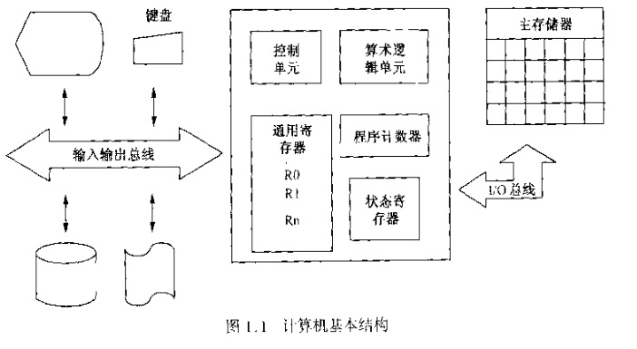

## 计算机基础（主要来于书籍《计算机导论》）

### 基础概念
1. 计算机是一个设备，在程序的指导下，他能处理数据，改变其自身的程序指令，执行计算和逻辑运算
2. 程序是指能够让计算机完成特定任务的特定指令集合
3. 计算机的结构
   1. 高速存储单元
      1. 也叫主存储器或物理存储器，存储着中央处理器但愿能够直接存取或执行的所有指令和数据
      2. 大都由芯片组成，芯片由做在硅片上的金属氧化物组成，这种类型的存储器也叫随机存取存储器（RAM）
      3. 存储器通常被划分为大小相同的逻辑单元，最普通的但愿叫做字节，每个字节由8个连续的位或二进制数字组成。而每个单独的位能磁化为两个不同的状态之一，因此称为二进制，分别表示1/0，对应开/关
      4. 
      5. 如上图，一个字节的位通常是从右向左以0开始的号码，最后边的叫最低有效位，最左边的位叫最高有效位
      6. 每个字节都和一个唯一的地址相关联，根据约定，地址可以从右往左或从左往右增加，默认是从右往左。
      7. 地址空间是一个程序能够引用的所有唯一地址的集合
      8. 字节可以被组合成更大的单元
         1. 半字节mbble=4bit
         2. 1字节byte=8bit
         3. 1word=2byte
         4. 1longword=4byte
         5. ...
   2. 中央处理单元
      1. 算术逻辑单元ALU
      2. 控制单元CU
      3. 通用寄存器，用于提供临时的、高效的存储
      4. 状态寄存器，提供的信息包括处理的状态、被处理的指令、可能已经出现的任何特殊情况以及用来处理这些特殊情况的行为
   3. 包含I/O子系统的外围设备
   4. 
4. 总线
   1. 用于在不同组件之间传输数据
   2. 分类
      1. 地址总线：CPU通过地址总线向存储器发送地址位
      2. 数据总线：用于数据的传输，数据总线中导线的根数应该不少于指定计算机中存储单元的位数。
      3. 控制总线
   3. 图例
5. 计算机的基本操作
   1. operator \[operand1] \[operand2] \[operand3]
      1. operator表示操作符，如加、减、乘、除等
      2. 被方括号包含operand是可选参数
      3. 例如指令 ADDW3 location1 location2 result表示将位置location1和location2的两个字相加，和存储到result的地址单元。W表示操作数为字类型，3表示指令有3个操作数
         1. 指令存储器传到CPU，指定地址存在CPU的指令计数器IC（程序计数器PC）中，指令则存到指令寄存器IR中
         2. CPU对指令解码并识别，直到是一个带有3个字类型的操作数的ADD操作
         3. 去除第一个操作数和第二个操作数，并放到通用寄存器；求和，将和存储到result位置
         4. 在获取两个操作数后，程序计数器被更新，只想将要执行的下一条指令
         5. 在这过程中，有2个附加的寄存器帮助完成CPU和主存储器通信。主存地址寄存器MAR保存数据被传输到的位置或数据来源地址，主存数据计数器保存将要写入的地址单元或从地址单元读出的数据
   2. 指令A(ADDW3 location1 location2 result)和指令B(ADDW2 location1 location2)的区别：指令B将加法结果保存在location2的位置，覆盖了location2的值，被称为破坏性算法
6. 存储器中数据的表示：二进制
7. 计算机中数的表示
   1. 原码：符号位+(n-1)数值位
   2. 补码：正数的表示与原码相同。负数的补码=它的绝对值的反码加1；运算中可能会溢出
   3. 二进制和字符数据混编代码：加权码（BCD码和海明码）、ASCII
      1. 加权码：这里使用4位数字表示十进制，每个位分配一个权，数值等于位乘以权的和。8-4-2-1称为BCD码，2-4-2-1码
      2. 美国信息交换标准码：ASCII
   4. 错误检测：奇偶校验和（只能判断出现错误而不能纠错）
      1. 如果源端没有发出任何消息，它不断地传输一系列1
      2. 一个0位表示消息的开始，消息提传输之后，按照奇偶约定设置奇偶校验位
      3. 源端传输停止位
   5. 纠错
      1. 前向纠错FEC
      2. 海明码

### 程序规划与设计
1. 程序设计
   1. 分析问题并制定概要设计：程序设计人员必须对问题有完全的了解并能够用准确的语句来描述问题
      1. 问题的输入是什么？已经知道什么？还要给出什么，使用什么格式？
      2. 期望的输出是什么？需要什么类型的报告、图表或信息？
      3. 从给定的输入到期望的输出，必要的处理步骤是什么？
   2. 制定详细设计：必须制定一组精确的步骤（明确、详细、有限的，能在合理的时间内完成。核心是算法的设计）
   3. 用编程语言编写程序代码及其文档
   4. 测试程序
   5. 验证程序
2. 算法
   1. 描述
      1. 具有输入、执行一个过程、给出输出
      2. 必须是清楚且无二义性的
      3. 必须正确的解决问题
      4. 可以用笔和纸模拟执行整个过程
      5. 必须在有限的步骤内执行完毕
   2. 伪代码和流程图
      1. 伪代码
      2. 流程图
         1. 长方形表示处理步骤
         2. 源泉表示连接点
         3. 平行四边形表示输入和输出步骤
         4. 菱形表示判断点
         5. 箭头表示数据流向
   3. 基本控制结构
      1. 顺序
      2. 选择
      3. 循环
   4. 自顶向下的设计和数据抽象：整个问题被分解为几个主任务，然后每个任务被向下分解为几个自任务，知道对于每个子任务来说都是一个简单的问题为止

### 简称或概念
1. 随机存取存储器:Random Access Memory,RAM
2. 指令计数器IC
3. 程序计数器PC
4. 主存地址寄存器MAR：保存数据被传输到的位置的地址，或者数据来源位置的地址
5. 注册数据寄存器MDR：保存要写入地址单元或者从地址单元读出的数据
6. 给定任何一个基数或者根为N的正整数，在系统中有N个各不相同的符号可以用来书写这个数字，这些符号的值的范围是0～N-1。如二进制的符号为0-1