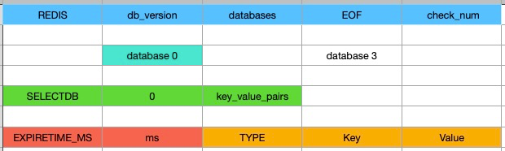
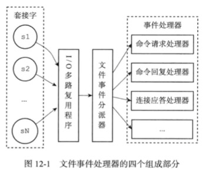
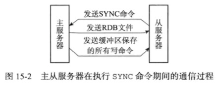
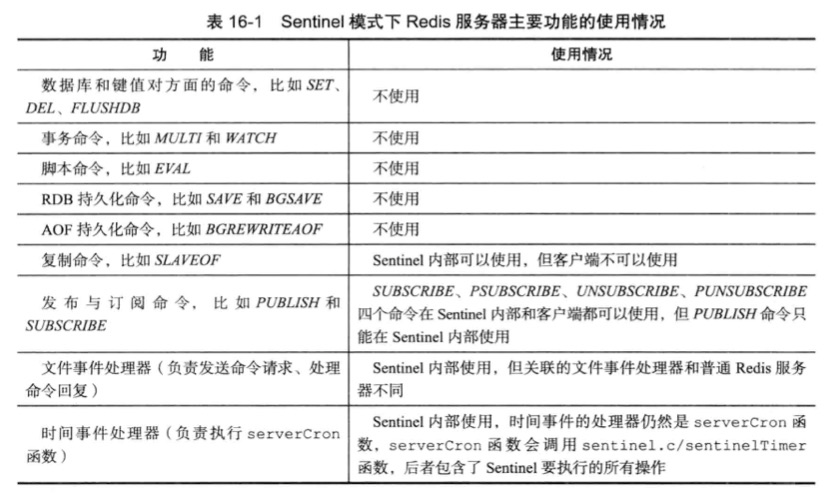
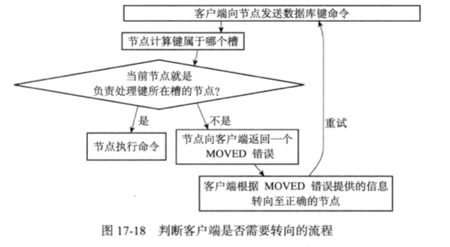
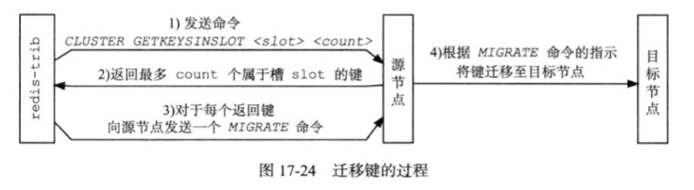
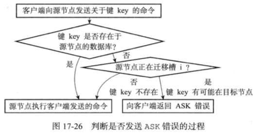

### Redis

### Redis 设计与实现第二版(基于Redis3.0开发版)
#### 1.数据结构与对象
1. Redis每个键值对都是由对象构成
    1. 对象包含字符串对象，列表对象，哈希对象，集合对象，有序集合对象
    2. 每个key都是字符串对象
    3. value可以是5种对象的任意一种
2. 简单动态字符串(Simple Dynamic String,SDS)
    1. 概念：Redis没有使用C语言的字符串(以空字符结尾的字符数组)来表示，而是构建了一种名为简单动态字符串的抽象类型。
    2. 用途：SDS会被用于存储可以修改的字符串值，C字符串用于存储不会变化的字面量；另外，SDS还被用作缓冲区
    3. 结构
     ```text
       struct sdshdr{
           // 记录buf[]已使用的字节的数量，等于sds保存的字符串的长度
           int len;
           // 保存buf[]未使用字节数量
           int free;
           // 字节数组，用于保存字符串
           char buf[];
       }
       注意：SDS遵循C以空字符结尾的习惯，保存空字符的空间不计入len。SDS会自动为空字符分配1的空间，并添加到字符串末尾。
    ```
    4. 与C字符串的区别
        1. C字符串并不记录自身的长度，每次获取长度都需要遍历，直到遇到空字符(\0)为止
        2. C字符串拼接时默认已经分配了足够的内存，实际上不足够时将造成缓冲区溢出(溢出空间的数据被意外修改，SDS不会，它会提前检查空间并自动扩容)
        3. 接2，C字符串除了缓存区溢出，每次拼接都需要重新分配内存，每次截取都需要释放内存(否则会内存泄漏)。SDS为了优化内存分配(频繁操作会影响性能)，使用了预分配和惰性释放策略
        4. C字符串不能保存用空字符分割的字符串，读取到第一个空字符就会认为该字符串已结束，不能保存二进制数据
        5. C可以<string.h>所有函数，SDS只能使用部分API
    5. 策略
        1. 内存预分配
            1. 如果修改后字符串长度(len)小于1MB，且len大于buf.length(小于等于时直接写入，无需扩容)，那么free=len,bug.length=free+len+1(\0).假设修改后len=13，buf.length=27
            2. 如果修改后字符串长度(len)大于等于1MB，将分配1MB的额外空间，即free=1MB
        2. 内存惰性释放：
        3. 二进制安全：SDS API会以二进制来存在buf[]数组的数据，没有任何限制、过滤、假设。读取和写入完全一致
3. 链表
    1. 结构
        ```text
           // 节点
           typedef struct listNode{
              // 前置节点
              listNode *prev;
              // 后置节点
              listNode *next;
              // 节点的值
              void *value;
           }listNode;
           // 链表的一个实现 adlist.h/list
           typedef struct list{
               listNode *head;
               listNode *tail;
               // 链表包含节点数
               unsigned long len;
               // 节点复制函数
               void *(*dup)(void *ptr);
               // 节点释放函数
               void *(*free)(void *ptr);
               // 节点值对比函数，判断节点的值和另一个输入是否相等
               void *(*match)(void *ptr,void *key);
           }list;
       ```
    2. 分类
        - 双端
        - 无环:head.prev 和tail.next都指向NULL，对链表的访问以NULL为终点
        - 带表头和表尾指针
        - 带链表长度计数器
        - 多态?? List<Object>??可以保存不同类型的值
    3. 用途
        1. 列表
        2. 发布/订阅
        3. 慢查询
        4. 监视器
4. 字典(DICT)，又称为符号表，关联数组，映射
    1. 哈希表 结构
         ```text
            typedef struct dictht{
                // 哈希表数组 dict.h/dicEntry
                dicEntry **table;
                // 哈希表大小
                unsigned long size;
                // 哈希表大小掩码，用于计算索引值 sizeMask=size-1
                unsigned long sizeMask;
                // 哈希表已有节点数量
                unsigned long used;
            }dictht;
        
        ```
    2. 哈希表节点结构
        ```text
            typedef struct dicEntry{
                // 哈希表数组 dict.h/dicEntry
                dicEntry *key;
                // 哈希表的值，可以是一个指针，也可以是uint64_t整数或者int64_t整数
                union{
                   void *val;
                   uint64_t u64;
                   int64_t s64;
                }v;
                // 下一个节点，用于解决哈希冲突
                struct dicEntry *next;
            }dicEntry;
        
        ```
    3. 字典结构
        ```text
            typedef struct dict{
                // 类型
                dictType *type;
                // 私有数据
                void privdata;
                // 哈希表 一般只使用其中一个，只有rehash的时候使用另外一个
                dictht ht[2];
                // rehash索引。如果值==-1,标识没有在rehash
                in trehashidx;
            }dict;
           // dictType
           typedef struct dictType{
               // 计算哈希值的函数，等价于java的hashCode()?
               unsigned int (*hashFunction)(const void *key);
               // 复制键的函数
               void *(*keyDup)(void *privdata,const void *key);
               // 复制值的函数
               void *(*valDup)(void *privdata,const void *obj);
               // 对比键的函数
               void *(*keyCompare)(void *privdata,const void *key1,const void *key2);
               // 销毁键的函数
               void *(*keyDestructor)(void *privdata,const void *key);
               // 销毁值的函数
               void *(*valDestructor)(void *privdata,const void *obj);
           }
    
        ```
    4. hash算法：Redis目前使用的是MurmurHash算法，即时输入数据有一定规律，算法仍然保持较好的随机分布性
    5. 解决hash冲突：Redis使用链地址法解决冲突，新数据添加到链表头部
    6. rehash：
    7. 渐进式rehash：分而治之，减少服务器压力
5. 跳跃表(skiplist)
    1. 介绍：跳跃表是一种有序数据结构，他通过在每个节点维护多个指向其他节点的指针，达成快速访问节点的需求。
    2. 效率：平均时间O(logN),最大时间O(N),还可以通过顺序性节点进行批量操作，效率接近平衡树
    3. 用途：有序集合，集群节点中作为内部数据结构
    4. 结构
        1. 跳跃表节点
            ```text
               typedef struct zskiplistNode{
                   // 层,指向一个其他元素。数组长度越大，访问越快
                   // 每次创建一个跳跃点节点的时候，都根据幂次定律生成一个介于1-32的随机数作为level数组的大小。
                   struct zskiplistLevel{
                       // 前进指针: 指向表尾
                       struct zskiplistNode *forward;
                       // 跨度：用于记录2个节点的距离，值越大表示距离越远。指向NULL的span=0
                       // 他用来计算排位，在查找过程中，将沿途的跨度累加起来，就是目标节点在跳跃表的排位
                       unsigned int span;
                   }level[];
                   // 后退指针，只有最底层有效，用于由表尾向前遍历
                   struct zskiplistNode *backward;
                   // 分值：多节点的分值可以相等
                   double score;
                   // 成员对象：多节点的对象唯一，先按照分值排序，再按照对象的大小排序。这个对象是一个字符创对象？？
                   robj *obj;
               }zskiplistNode;
            ```
        2. 跳跃表
            ```text
               typedef struct zskiplist{
                   // 表头/尾
                   struct zskiplistNode *head,*tail;
                   // 表中节点的数量
                   unsigned long length;
                   // 表中层数最大的值
                   int level;
               }zskiplist;
            ```
    5. 总结
        1. 跳跃表是一个最多32(并非不能增多，而是认为够用，实际上很少使用这么多层，使用层数保存在level)层的数组，每个数组引用一个跳跃表节点。
        2. 每次查询从最高层往下遍历，遍历到最底层后，由表头向表尾方向遍历
         
6. 整数集合(INTSET)
    1. 介绍： Redis用于保存整数值的集合抽象数据结构，可以保存int16_t,int32_t,int64_t的值，并保证无重复元素。
    2. 结构
    ```text
       typedef struct intset{
           // 编码方式
           uint32_t encoding;
           // 集合包含的元素数量
           uint32_t long length;
           // 保存元素的数组，元素从小到大排列，并且不包含重复项；数组并不保存int8_t的值，而是取决于encoding的值
           int8_t contents[];
       }zskiplist;
    ```
    3. 扩容规则
        1. 类型扩容：encoding包含INtSET_ENC_16,INtSET_ENC_32,INtSET_ENC_64分别对应JAVA的short,int,long.只要其中一个值范围扩大，所有值的类型都会改变。
        2. 数组长度扩容：
        3. 一旦完成类型扩容，就永远无法降级
    4. 用途： 作为集合的底层实现之一，当一个集合只有整数数值，且元素数量不多时采用
7. 压缩列表(ziplist)
    1. 介绍：压缩列表是Redis为了节约内存而开发的，由一系列特殊编码的连续内存块组成的顺序性数据结构。一个压缩列表可以包含任意多个节点。每个节点可以保存一个字节数组或者一个整数值。
    2. 用途：列表键和哈希键的底层实现之一。当列表键只包含少数列表项，而且每个列表项要么是小整数值，或者是短字符串时使用；对应的，如果一个哈希键的键值对都满足上述要求，也会用作实现哈希键。
    3. 结构
    ```text
       // 这个结构不准确
       typedef struct ziplist{
           // 记录整个压缩列表占用的内存字节数：在对压缩列表内存重分配，或者计算zlend位置时使用
           uint32_t zlbytes;
           // 记录压缩列表表尾节点距离压缩列表的起始地址有多少字节。通过偏移量，可以直接获取尾结点的地址
           uint32_t zltail;
           // 记录压缩列表包含的节点的数量：如果这个值等于最大值65535时，必须遍历列表才知道节点数量
           uint16_t zlen；
           // 压缩列表的各个节点
           entry... X
           // 特殊值OxFF，用于标记压缩列表的末端
           uint8_t zlend;
       }zskiplist;
    ```
    4. 压缩节点构成
        1. 字节数组
            1. 长度小于等于63(2^6-1)的字节数组
            2. 长度小于等于16383(2^14-1)的字节数组
            3. 长度小于等于4294967295(2^32-1)的字节数组
        2. 整数值
            1. 4位长，0-12的无符号整数
            2. 1字节长的有符号整数
            3. 3字节长的有符号整数
            4. int16_t类型整数
            5. int32_t类型整数
            6. int64_t类型整数
        3. 结构
        ```text
           // 这个结构不准确
           typedef struct entry{
               // 1/5字节。如果上一个节点的长度小于254，使用1字节保存；否则第一字节保存0xFE，后面4个字节保存上一个节点的内容
               previous_entry_length;
               // 记录节点content属性保存的数据类型和长度
               encoding;
               // 节点值，和encoding一致
               content;
           }zskiplist;
        ```
        4. 连锁更新
            1. 概念：由于靠前的节点使用空间发生变化，导致所有后续节点需要重新分配内存，可能在新增/删除/更新节点的时候发生
            2. 说明：连锁更新的概率并不高，虽然最坏复杂度为O(N^2),但是平均复杂度为O(N)，不会很影响性能
8. 对象
    1. 对象的类型和编码
        1. 结构
        ```text
           typedef struct redisObject{
               // 类型
               unsigned type;    
               // 编码
               unsigned encoding;    
               // 指向底层实现数据结构的指针
               void *ptr;    
           }robj;
        ```
        2. 类型：Redis的键对象为字符串对象，值对象可以是以下任意一种(type 键)
            - 字符串对象
            - 哈希对象
            - 列表对象
            - 集合对象
            - 有序集合对象
        3. 编码和底层实现：编码方式记录在encoding字段，它可以是以下任意一种。每种类型至少使用了2种编码
            - REDIS_ENCODING_INT        long类型整数
            - REDIS_ENCODING_EMBSTR     embstr编码的动态字符串
            - REDIS_ENCODING_RAW        简单动态字符串
            - REDIS_ENCODING_HT         字典
            - REDIS_ENCODING_LINKEDLIST 双端链表
            - REDIS_ENCODING_ZIPLIST    压缩表
            - REDIS_ENCODING_INTSET     整数集合
            - REDIS_ENCODING_SKIPLIST   跳跃表
    2. 字符串对象
        1. 编码(INT(整数)
        2. EMBSTR(小于等于32字节的字符串，连续内存，和ptr连续，不需要指向额外指针，一次内存分配和释放)
        3. RAW(大于32字节的字符串，redisObject和*ptr指向的地址分开存储 2次内存分配和释放) 3种编码)
        4. 字符串命令
            - SET
            - GET
            - APPEND
            - INCRBYFLOAT
            - INCRBY
            - DECRBY
            - STRLEN
            - SETRANGE
            - GETRANGE
        5. 备注：Redis的EMBSTR没有修改程序，修改后会变成RAW字符串
    3. 列表(底层由ziplist或linkedlist实现)
        1. ziplist编码条件(2者同时满足，配置文件可改)
            1. 列表对象保存的所有字符串对象都小于64字节
            2. 列表对象元素小于512个
        2. 命令列表(略)
    4. 哈希(底层由ziplist或hashtable实现)
        1. ziplist写入过程： 每当新的键值对要加入到哈希对象时，会先将保存了键的压缩节点推入压缩列表表尾，再将值的压缩节点推入到表尾
        2. ziplist编码特点(哈希)
            1. 保存键值对的2个节点总是临近，键前值后
            2. 先加入的键值对在前，后加入的键值对在后
        3. hashtable编码：使用字典键值对来保存，键和值都使用字符串对象保存
        4. ziplist编码条件(2者同时满足，配置文件可改)
            1. 列表对象保存的所有字符串对象都小于64字节
            2. 列表对象元素小于512个
    5. 集合对象(底层由Intset和hashtable实现)
        1. intset使用条件(2者同时满足，配置文件可改)
            1. 列表对象保存的所有元素都是整数值
            2. 列表对象元素小于512个
        2. hashtable实现：key都是字符串对象，value为NULL(Java的Set的实现方式也由HashMap实现)
    6. 有序集合对象(底层由ziplist和skiplist实现)
        1. ziplist保存方式：由连续2个节点保存，值在前，score在后；score小的元素靠近表头，score大的元素靠近表尾。使用条件如下（配置文件可修改）
           1. 有序集合保存的元素数量小于128个
           2. 有序集合保存的所有元素成员的长度都小于64字节
        2. 命令实现，略..
    7. 类型检查与命令多态
       1. 命令分类
          1. 对所有key操作，如delete、expire、rename、type、object
          2. 对特定类型的键执行，如5大类型对应的命令
       2. 类型检查的实现：redisObject的type属性来实现
       3. 多态命令的实现（一种结构多种实现）：根据编码决定
    8. 内存回收：引用计数
       1. 创建一个新对象时，引用计数的值会被初始化为1
       2. 对象被一个新程序使用时，引用计数值自增1
       3. 对象不再被一个程序使用时，引用计数值自减1
       4. 对象的引用计数值为0时，内存会被释放
    9. 对象共享
       1. Redis会共享值为0-9999的字符串对象
    10. 对象空转时长
        1. 对象记录自己的最后一次被访问的时间，用于记录空转时间。时长较大则可能被lru优先回收
        
#### 2.单机数据库的实现
1. 数据库
   1. 服务器中的数据库 
      1. 保存在服务器状态redis.h/redisServer结构的db数组中，db数组每一项都是redis.h/redisDb结构，每个redisDb结构代表一个数据库 
      2. 初始化服务器时，程序根据服务器状态的dbum决定创建多少个数据库，默认值为16（序号从0开始）
   2. 切换数据库如切换到第3个数据库 ：select 2；这是一个比较危险的命令，redis并不会返回数据库编号
   3. 数据库键空间（redisDb结构）：是一个字典
   4. 设置过期时间：redisDB中有一个expires字段保存了所有键的过期时间
      1. key是指针，指向键空间的某个键对象
      2. value是一个long型整数，指向一个毫秒级别的unix时间戳
      3. 命令：expireat、pexpireat、expire、pexpire（p表示毫秒级，默认秒级）
      4. 移除过期时间：persist
      5. 计算并返回剩余生存时间：ttl、pttl
   5. 删除策略：
      1. 定时删除：设置过期时间的同时，创建定时器；内存友好，cpu不友好
      2. 定期删除：定时检查所有键；
      3. 惰性删除：访问时检查过期时间；cpu友好，内存不友好
   6. AOF、RDB和复制功能对过期键的实现
      1. RDB
         1. 生成RDB文件：执行save或bgsave命令时，会检查过期键而不会写入
         2. 载入RDB文件
            1. 主服务器不会载入过期键
            2. 从服务器载入所有键，数据同步时会清空从服务器数据
      2. AOF
         1. AOF不受惰性删除或定期删除影响，删除后，程序会像AOF追加一条DEL命令
      3. 复制：由master决定，删除后会发出DEL命令，从服务器接收到DEL命令后才会删除，否则查询到过期键不处理
   7. 服务器通知
2. RDB持久化：保存数据库键值对
   1. 创建与载入
      1. 触发创建的命令
         1. save：阻塞Redis服务器进程，直到RDB文件创建完毕
         2. bgsave：派生出一个子进程创建RDB文件；执行bgsave命令时，会阻塞save、bgsave、bgrewriteaof命令
      2. 触发载入：Redis服务器启动时监测到RDB文件存在，就会自动载入RDB文件（载入期间，服务器会一直阻塞）。但是，如果服务器开启了AOF持久化，会优先使用AOF文件来还原数据库状态
   2. 自动间隔性保存
      1. 默认保存条件
         1. save 900 1
         2. save 300 19
         3. save 60 10000
      2. dirty计数器和lastsave属性
         1. dirty计数器保存距离上一次成功执行save或bgsave命令后，服务器进行了多少次修改（写入、删除、更新）
         2. lastsave保存上一次执行save、bgsave命令的时间戳
      3. 检查保存条件是否满足（每100毫秒执行一次）
   3. RDB文件结构
      1. REDIS常量：5字节
      2. db_version：RDB文件版本号， 4字节
      3. databases：包含零个或多个数据库，以及数据库中的键值对数据
         1. SELECTDB:1字节
         2. db_number：1、2、5字节
         3. key_value_pairs
            1. EXPIRETIME_MS:1字节
            2. ms：8字节带富豪整数
            3. TYPE：1字节
               1. REDIS_RDB_TYPE_STRING
               2. REDIS_RDB_TYPE_LIST
               3. REDIS_RDB_TYPE_SET
               4. REDIS_RDB_TYPE_ZSET
               5. REDIS_RDB_TYPE_HASH
               6. REDIS_RDB_TYPE_LIST_ZIPLIST
               7. REDIS_RDB_TYPE_SET_INTSET
               8. REDIS_RDB_TYPE_ZSET_ZIPLIST
               9. REDIS_RDB_TYPE_HASH_ZIPLIST
            4. key：字符串对象
            5. value：多种类型，每个都可以有不同的编码。编码详情略
      4. EOF常量：1字节
      5. check_sum:校验和，8字节无符号整数
      6. 
3. AOF持久化：保存Redis服务器执行的写命令
   1. 实现
      1. 命令追加：写命令执行后，会以写一个是将被执行的写命令追加到服务器状态的aof_buf缓冲区的末尾
      2. 文件写入：
         1. 服务器进程：是一个事件循环，循环中文件事件负责接受客户端的命令请求，以及向客户端发送命令回复，而时间时间负责执行定时任务的函数
         2. aof设置：always、everysec、no
      3. 文件同步
   2. AOF载入：服务器启动后，创建一个不带网络请求的伪客户端，不断执行redis命令，直到被处理完
   3. AOF重写：AOF文件很大，通过AOF重写可减小文件体积。实现：多条命令改成等价的批量操作（批量操作元素列表默认不超过64个）
4. 事件
   1. 文件事件：Redis服务器通过套接字与其他客户端进行连接，文件事件即是服务器对套接字操作的抽象
      1. 组成
         1. 套接字
         2. IO多路复用程序
         3. 文件事件分派器
         4. 事件处理器
         5. 
      2. IO多路复用的实现，如select、epoll、evport、kqueue
      3. 事件类型：优先AE_READABLE、其次AE——WRITABLE
      4. API
      5. 处理器
         1. 链接应答处理器
         2. 命令请求处理器
         3. 命令回复处理器
   2. 时间事件：Redis服务器仲德一些操作需要在给定的事件点执行，时间事件即是服务器对这类定时操作的抽象
      1. 分类
         1. 定时事件
         2. 周期事件
      2. 组成
         1. id：服务器为时间事件创建的全剧唯一id，递增
         2. when：毫秒时间戳，记录了时间事件的到达事件
         3. timeProc：时间事件处理器
      3. 实现：服务器将所有时间事件都放在一个无序链表（事件很少，不影响性能）中，每当时间事件执行器运行时，它就遍历整个连标，查找所有已到达的时间事件，并调用对的时间事件处理器
      4. API
5. 客户端
   1. 属性
      1. 套接字描述符：-1为伪客户端或lua脚本，普通客户端该值应大于-1
      2. 名字：默认空白，可食用setname设置
      3. 标志：可以是单个标志，也可以包含多个
      4. 输入缓冲区
      5. 命令与命令参数
      6. 命令的实现函数
      7. 输出缓冲区
      8. 身份验证
      9. 时间
   2. 创建与关闭
6. 服务器
   1. 命令请求执行过程
      1. 用户在客户端输入命令请求
      2. 客户端将请求转换成协议格式
      3. 通过连接到服务器的套接字，将协议格式的命令发送给服务器
      4. 服务器监听到套接字可读
      5. 服务器读取套接字中协议格式的命令请求，并保存到客户端状态的输入缓冲区
      6. 对输入缓冲区命令进行分析，提取命令和参数，放到客户端状态属性
      7. 调用命令执行器，执行命令
         1. 命令执行器查找命令实现
         2. 命令执行器执行预备操作
            1. 检查命令是否指向NULL
            2. 检查命令参数是否正确
            3. 检查客户端是否通过了身份验证
            4. 如果服务器打开了maxmemory，先检查内存占用情况，并在有需要的情况下进行回收
            5. 如果服务器上一次执行bgsave出错，且服务器打开了stop-writes-on-bgsave-error且即将执行写命令，则拒绝执行并返回错误
            6. 如果客户端正在用subscribe订阅频道，或者正在用psubscribe命令订阅模式，服务器只会执行subscribe、psubscribe、unsubscribe、punsubcribe命令
            7. 如果服务器正在数据载入，命令必须带有1标识如info、shutdown、punlish命令
            8. 如果服务器执行lua脚本超时并进入阻塞状态，只会执行shutdown nosave命令或script kill命令
            9. 如果客户端正在执行事务，服务器只会执行exec、discard、multi、watch命令，其他将放入事务队列
            10. 如果服务器打开了监视器，服务器将要执行的命令和参数等信息发送给监视器
         3. 命令执行器调用命令的实现函数
         4. 命令执行器执行后续操作
            1. 慢查询
            2. 根据命令消耗时长，更新被执行命令的redisCommand结构的millseconds属性
            3. aof
            4. 主从复制
      8. 将命令回复保存到输出缓冲区
      9. 当客户端套接字科协，执行回复
   2. serverCron函数
      1. 更新服务器时间缓存
      2. 更新LRU时钟
      3. 更新服务器美妙执行次数
      4. 更新服务器内存峰值记录
      5. 处理sigterm信号
      6. 管理客户端资源
      7. 管理数据库资源
      8. 执行被延迟的bgrewriteaof
      9. 检查持久化操作的运行状态
      10. 将aof缓冲区内容写入aof文件
      11. 关闭一步客户端
      12. 增加cronloops计数器的值
   3. 初始化服务器
      1. 初始化服务器状态结构
      2. 载入配置选项
      3. 初始化服务器数据结构
      4. 还原数据库状态
      5. 执行时间循环
#### 3.多机数据库的实现
1. 复制
   1. 配置：使用salveof命令或slaveof选项，让一个服务器去复制另一个另一服务器，两个服务器将保存相同的数据
   2. 旧版本复制功能的实现
      1. 同步：用于将从服务器的数据库状态更新至主服务器当前所处的数据库状态
         1. 从服务器向主服务器发送SYNC命令
         2. 主服务器执行bgsave命令，在后台生成一个RDB文件，并使用一个缓冲区记录从现在开始执行的所有写命令
         3. 当主服务器的bgsave命令执行完成后，主服务器将对应的RDB文件发送给从服务器，从服务器接收到RDB文件后，将自己的数据库状态更新至主服务器执行bgsave命令时的数据库状态
         4. 主服务器将记录在缓冲区的所有写命令发送给从服务器，从服务器执行这些命令，将自己的数据库状态更新至主服务器当前状态
         5. 
      2. 命令传播：用于在主数据库的数据库状态被修改，导致主从服务器的数据库状态出现不一致时，让主从服务器的数据库重新回到一致状态
   3. 旧版本复制的缺陷：断线重联时，从服务器发送sync命令，主服务器将上一次bgsave之后所有key都打包到RDB文件，该文件可能很大，而且可能大多数key都是没必要的。而sync命令很消耗资源
   4. 新版本复制功能的实现：psync命令
      1. psync两种模式
         1. 完整重同步：处理初次复制情况，执行步骤基本与sync命令一致
         2. 部分重同步：处理断线重联情况，如果条件允许，主服务器可以将主从服务器断开期间执行的写命令发送给从服务器
      2. 部分重同步实现
         1. 主服务器的复制偏移量和从服务器的复制偏移量
            1. 主从服务器分别维护一个复制偏移量
            2. 主服务器每次向从服务器传播N个字节时，将自己的复制偏移量加N
            3. 从服务器每次接收到主服务器传播来的N字节数据时，将自己的复制偏移量的值加N
         2. 主服务器的复制积压缓冲区
            1. 是主服务器维护的一个固定长度的FIFO队列，默认1MB
            2. 当主服务器进行命令传播时，它不仅会将写命令发送给从服务器，还会将写命令入队到复制积压缓冲区内
            3. 当从服务器断线重连，主服务器通过psync将自己的复制偏移量发送给主服务器，主服务器根据偏移量决定使用何种同步方式
               1. 当offset偏移量之后的数据仍然存在于复制积压缓冲区，将进行部分重同步
               2. 如果不存在，将执行完整重同步
         3. 服务器的运行ID
            1. 每个Redis服务器，无论主从，都有自己的运行ID
            2. 每个运行ID在服务器启动时自动生成，由40个随机的16进制字符串组成
            3. 当从服务器对主服务器主次复制时，主服务器将自己的运行ID传送给从服务器
            4. 断线重连后，主服务将自己的运行ID发送给从服务器，如果相同则部分重同步，如果不同则完整重同步
      3. psync命令实现
         1. 
   5. 复制的实现
      1. 客户端向从服务器发送salveof host port命令
      2. 从服务器将host、port保存起来，返回ok
      3. 从服务器向主服务器发起套接字连接
      4. 从服务器向主服务器发起PING命令，前2种响应断开并重连
         1. TIMEOUT
         2. ERR
         3. PONG
      5. 身份验证
      6. 从服务器发送端口消息
      7. 同步，psync
      8. 命令传播
   6. 心跳检测：命令传播阶段，从服务器会以每秒1次的频率向主服务器发送命令 REPLCONF ACK replication_offset，replication_offset是从服务器当前的复制偏移量。此命令有3个作用
      1. 检查主从服务器连接状态
      2. 辅助实现min-slaves选项：Redis的min-slaves-to-write和min-slaves-max-lag选项可以防治主服务在不安全的情况下执行写命令
      3. 检测命令丢失：主服务器判断主从服务器偏移量差异，如果未同步，则将
2. Sentinel
   1. 介绍
      1. 是Redis高可用性的解决方案，由一个或多个Sentinel实例组成Sentinel系统，可以监视任意多个主服务器，以及主服务器属下的从服务器，并在主服务器下线时，自动将某个从服务器升级为新的树服务器
      2. 主从切换过程
         1. sentinel选择一台从服务器，将之升级为新的主服务器
         2. sentinel向下线服务器的所有从服务器发送新的复制指令，让它们成为新的主服务器的从服务器。当所有从服务器都开始复制新的主服务器时，故障转移操作执行完毕
         3. sentinel继续舰艇已下线的主服务器，当它重新上线时，将它设为新的主服务器的从服务器
   2. 启动并初始化sentinel
      1. 命令1：redis-sentinel /path/to/your/sentinel.conf
      2. 命令2：redis-server /path/to/your/sentinel.conf --sentinel
      3. 
      4. 启动过程：略...
   3. 获取主服务器信息
      1. sentinel默认以每10秒1次的频率，通过命令连接向主服务器发送INFO命令
      2. INFO命令回复
         1. 主服务器本身的信息，如运行ID（run_id字段），以及服务器角色（role字段）
         2. 主服务器下所有从服务器的信息，sentinel根据从服务器列表进行保存或更新
         3. 
   4. 获取从服务器信息
      1. sentinel也会创建从服务器的命令连接和订阅连接，sentinel默认每10秒1次通过命令连接向从服务器发送INFO命令
      2. INFO回复
         1. 从服务器的运行ID run_id
         2. 从服务器的角色 role
         3. 主服务器的ip地址 master_host，主服务器的端口号master port
         4. 主从服务器的连接状态 master_link_status
         5. 从服务器的优先级 slave_priority
         6. 从服务器的复制偏移量 slave_repl_offset
      3. 根据INFO信息，sentinel对从服务器实例结构进行更新
   5. 向主从服务器发送信息：默认情况下，sentinel以每2秒1次的频率向所有被监视的主从服务器发送命令，格式：publish _sentinel_:hello...
   6. 接受来自主、从服务器的频道消息，命令 subscribe _sentinel_:hello
   7. 检测主观下线状态
      1. sentinel默认以每秒1次的频率向所有与它创建了命令连接的实例（包含主服务器、从服务器、sentinel服务器）发送PING命令，病痛实例返回的PING命令回复判断实例是否在线
         1. 有效回复
            1. +PONG
            2. -LOADING
            3. —MASTERDOWN
         2. 无效回复
            1. 除了以上3种有效回复，或在指定时限内没有返回任何回复
      2. 如果一个实例在down-after-milliseconds毫秒内，连续向sentinel返回无效回复，那么sentinel会修改这个实例对应结构，在结构的flags属性打开SRI_S_DOWN标识，表示实例以进入主观下线状态
   8. 检测客观下线状态
      1. sentinel将一个主服务器判断为主管下线之后，为了确认这个主服务器是否真的下线，它会向同样监视这一主服务器的其他sentinel进行询问，看它们是否也任务主服务器已经进入下线状态（主观、客观）。当接收到主够数量的已下线判断之后，sentinel就会将从服务器判定为客观下线，并执行故障转移操作
   9. 选举领头Sentinel：当主服务器被判断为客观下线时，监视这个下线主服务器的各个sentinel会进行协商，选取一个领头sentinel，并由领头sentinel执行故障转移。选举规则如下：
      1. 所有的sentinel都有被选取为领头sentinel的资格
      2. 每次进行sentinel选举后，无论成功失败，配置纪元（计数器，表示一次选举）自增一次
      3. 在一次配置纪元中，所有sentinel都有且仅有一次将某个sentinel设为局部领头sentinel的机会
      4. 每个发现主服务器进入客观下线的sentinel都会要起其他sentinel将自己设置为局部领头sentinel。命令：SENTINEL is-master-down-by-addr 参数run_id不是*而是sentinel的运行id时，即要求设置局部领头
      5. sentinel设置局部领头sentinel的规则是先到先得
      6. 目标收到设置局部领头sentinel的命令后，将返回leader_runid（局部领头运行id）和leader_epoch（配置单元）
      7. 源sentinel收到命令回复后，检查leader_epoch，如果与本地配置单元相同，检查leader_runid是否本服务器运行id，如是，则表示设置成功
      8. 如果某个sentinel被半数以上的sentinel设置局部领头sentinel，则成功领头sentinel
      9. 如果在给定时限内，没有一个sentinel被选举成领头sentinel，将在一段时间后再次进行选举，直到选出领头sentinel为止
   10. 故障转移
       1. 从已下线的主服务器属下的从服务器，选出一个并将其转换为主服务器。选举策略略
       2. 让已下线的主服务器属下的所有从服务器改为复制新的主服务器
       3. 让已下线的主服务器设置为新的主服务器的从服务器，原主服务器上线后将成为新主服务器的从服务器
3. 集群
   1. 节点
      1. 启动节点
      2. 集群数据结构
      3. CLUSTER MEET命令实现
   2. 槽指派：集群中数据库被氛围16384个槽，如果所有槽都有节点在处理，集群处于上线状态；任意一个槽没有处理则处于下线状态
      1. 记录节点的槽指派信息（数组保存16384个二进制位，值为1表示节点处理该槽，类似bitmap）
      2. 传播节点的槽指派信息
      3. 记录集群所有槽指派信息
      4. CLUSTER ADDSLOTS实现
   3. 在集群中执行命令
      1. 
      2. 注意：集群只能使用0号数据库
   4. 重新分片：将任意数量已经指派给某个节点的槽改为指派另一个节点，并且槽所属的键值对也会从源节点被移动到目标节点
      1. 实现原理：有redis集群管理软件redis-trib负责。步骤略..
      2. 
   5. ASK错误
      1. 
   6. 复制和故障转移
      1. 设置从节点
      2. 故障检测
      3. 故障转移
      4. 主节点选举（和sentinel）
      5. 消息
         1. MEET
         2. PING
         3. PONG
         4. FAIL
         5. PUBLISH
#### 4.独立功能的实现
1. 发布与订阅
2. 事务
3. lua脚本
4. 排序
5. 二进制位数组
6. 满查询日志
7. 监视器