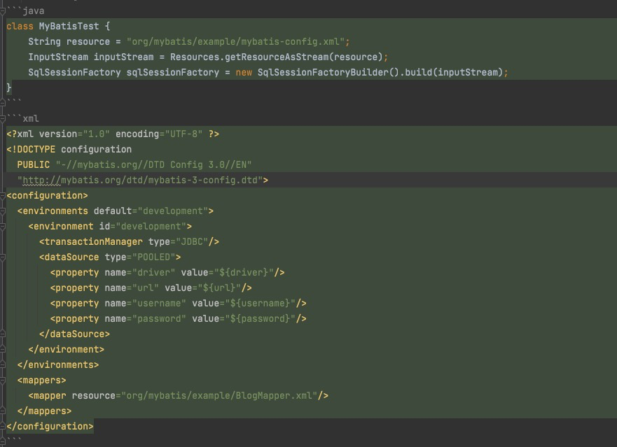
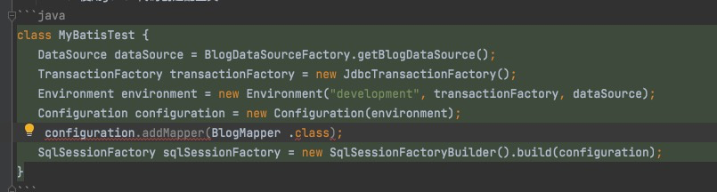

## MyBatis

### 工作原理
1. 核心类
   1. SqlSessionFactory（最佳作用域是单例）
      1. 从xml构建
      2. 使用java 代码创建配置类
   2. SqlSession（维护和数据库的会话，非线程安全，作用域最好是请求或方法，线程变量）
   3. Configuration：初始化配置类
   4. Executor：MyBatis调度的核心，负责SQL语句的生成和查询缓存的维护
2. 插件
   1. Executor (update, query, flushStatements, commit, rollback, getTransaction, close, isClosed)
   2. ParameterHandler (getParameterObject, setParameters)
   3. ResultSetHandler (handleResultSets, handleOutputParameters)
   4. StatementHandler (prepare, parameterize, batch, update, query)
### 面试题
1. 优缺点
   1. 优点
      1. 基于SQL语句编程，相当灵活，不会对应用程序或者数据库的现有设计造成任何影响，SQL写 在XML里，解除sql与程序代码的耦合，便于统一管理；提供XML标签，支持编写动态SQL语句，并可重用 
      2. 与JDBC相比，减少了50%以上的代码量，消除了JDBC大量冗余的代码，不需要手动开关连接
      3. 很好的与各种数据库兼容（因为MyBatis使用JDBC来连接数据库，所以只要JDBC支持的数据库MyBatis都支持）
      4. 能够与Spring很好的集成
      5. 提供映射标签，支持对象与数据库的ORM字段关系映射；提供对象关系映射标签，支持对象关系组件维护
   2. 缺点
      1. SQL语句的编写工作量较大，尤其当字段多、关联表多时，对开发人员编写SQL语句的功底有 一定要求 
      2. SQL语句依赖于数据库，导致数据库移植性差，不能随意更换数据库。
2. $和#的区别
   1. 字符串替换${}，不安全
   2. 预编译处理#{}，会将#{}替换为？号，调用PreparedStatement的set方法来赋值
3. 命名空间namespace：将不同的语句隔离开来