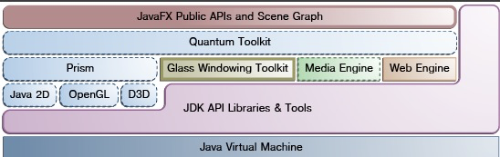

# JavaFX

### 架构
1. 
2. 场景图Scene：用户界面的视觉元素，可以处理输入并渲染
   1. scene中的一个元素成为一个节点，除了跟节点，每个节点都有一个父节点，0个或多个子节点。节点拥有如下特性
      1. 效果如模糊、阴影
      2. 不透明度
      3. 变换
      4. 事件处理器如鼠标、键盘和输入法
      5. 引用相关的状态
   2. 除了节点，还包含图元、文本、控件、布局容器、图像、多媒体
3. API
   1. Java类库
   2. 其他基于JVM的动态语言如JS（？？）、Groovy
   3. 绑定技术
   4. 扩展的Java集合库如可观察的list或map
4. Class窗体工具包：提供本地操作服务例如窗体、计时器、皮肤，是连接操作系统的平台无关层。另外，他还负责管理事件队列：
5. 线程
   1. JavaFX引用程序线程。任何"活动"的长江都是窗体的一部分，必须通过此线程来访问
   2. Prism渲染线程
   3. 多媒体线程：后台运行，通过使用JavaFX应用程序来在场景图中同步最近的帧
6. 脉冲pulse是一个事件，用于通知JavaFX场景图何时该使用Prism来同步场景图上的元素状态。一个脉冲最多为60帧每秒，并且会在场景图上运行动画时触发
7. 多媒体：支持MP3、AIFF、WAV和FLV。Midia对象用于表示一个多媒体文件、MediaPlayer用于播放文件、MediaView用于显示内容
8. Web组件
9. CSS
10. UI控件
11. 布局
    1. BorderPane类将其内容节点放到上、下、左、右、中各个区域中。 
    2. HBox类将其内容节点横向排成一行。 
    3. VBox类将其内容节点纵向排成一列。 
    4. StackPane类将其内容节点摞在一起。
    5. GridPane类允许开发者创建一个灵活的网格，按行列来布局其内容节点。 
    6. FlowPane类将其内容按行或列进行”流式“布局，当遇到横向或纵向的边界时自动进行换行或换列。 
    7. TilePane类将其内容放到统一大小的单元格中。 
    8. AnchorPane类允许开发者创建锚节点，将控件停靠于布局的上下左右各边，也可以居中停靠
12. 2D和3D变换 
    1. translate——将一个节点在xyz坐标系中从一个位置移动另外一个位置。 
    2. scale——将一个节点在xyz坐标系中根据缩放因子进行缩放。 
    3. shear——旋转一个坐标轴，这样x轴和y轴不再是垂直的了。节点的坐标值会根据制定的倍数进行变换。 
    4. rotate——根据scene中指定的一个支点对节点进行旋转。 
    5. affine——执行从一个2D/3D坐标系到另外一个2D/3D坐标系的线性映射，同时保留线条的 ‘straight’ 和’parallel’ 属性。这个类应与Translate、Scale、Rotate、Shear变换类同时使用，一般不要直接使用
13. 视觉效果
    1. Drop Shadow——应用视觉效果后将为给定的内容渲染一个在它的后面的阴影。 
    2. Reflection——在真实的内容后面渲染一个反射倒影。 
    3. Lighting——模仿一个光源的照射效果，使一个平面的对象看起来更真实、具有三维效果

### 层次结构
1. Stage
2. Scene
3. Pane
4. Node

### 布局