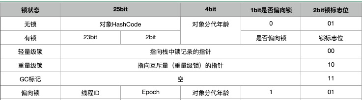

## JDK使用笔记

1. 基础知识
    1. jdk源码获取：打开jdk安装目录，解压src.zip
2. collection
    1. subList方法左开右闭[fromIndex,toIndex)，返回元素包含fromIndex，toIndex最大为list.size(),否则将抛出IndexOutBoundException；
       如果需要截取列表后5个元素，可以传参subList(list.size()-5,list.size());

### JMM内存模型

1. 由来：CPU的速率远高于内存的速率，引入高速缓存。通常L1、L2独立、L3共享，多个核可能会出现缓存不一致
2. JMM内存模型：是一种符合内存模型规范的，屏蔽了各种硬件和操作系统的访问差异的，保证了java程序在各种平台下对内存的访问都能保证效果一致的机制和规范
    1. 限制处理器优化
    2. 内存屏障
       1. 读屏障
       2. 写屏障
       3. 读写屏障
3. 8个操作来完成变量读写
   1. read
   2. load
   3. use
   4. assign
   5. store
   6. write
   7. lock
   8. unlock

### volatile 关键字

1. 作用：保证可见性和有序性，并不保证原子性
2. 描述：每个线程有私有的工作内存。volatile保证线程对变量更新后立即刷新到主存，其他线程检测到变量由volatile修饰，则直接从主存读取

### synchronized 关键字

1. 作用：原子性、有序性、可见性
    1. 修饰实例方法：锁定当前实例对象
    2. 修饰代码块：指定锁定对象
    3. 修饰静态方法：锁当前类class对象
2. 和ReentrantLock的比较
    1. Lock比较灵活，可以尝试获取锁、指定超时时间、响应中断，但是需手动释放锁，synchronized自动释放锁
    2. Lock只能锁代码块，synchronized可以锁方法、代码块、静态方法
    3. synchronized是悲观锁、可重入锁、非公平锁，Lock是乐观锁、可重入锁、公平锁或非公平锁
    4. synchronized锁的是对象，Lock锁的是线程
    5. synchronized是在软件层面依赖JVM的监视器实现，Lock在硬件层面依赖特殊的CPU指令实现
3. synchronized实现原理
    1. HotSpot虚拟机的synchronized由monitor实现，C++结构体如图
    2. monitor包含一个等待队列_WaitSet（类似AQS的condition队列）、等待锁的队列_EntryList（类似AQS的sync队列）和已获取锁的线程_owner
    3. 当多个线程同时访问一段同步代码时，首先会进入_EntryList。当线程获取到对象的monitor后，进入_owner，同时monitor中计数器count++
    4. 当线程推出同步代码块或调用wait()方法，_owner=null,count--，同时WaitSet集合中等待的线程会被唤醒。（如果调用wait()方法，可能被立即唤醒吗？？）
    5. 具体字节码见 liufeng.jdk.jvm.sync.SynchronizedTest类注释
4. synchronized在JDK1.6的升级
    1. 无锁
    2. 偏向锁：当一个线程第一次获取到锁之后，再次申请就可以直接取到锁
    3. 轻量级锁：没有多线程竞争，但有多个线程交替执行
    4. 重量级锁：有多线程竞争，线程获取不到锁进入阻塞状态。进入重量级锁之前可能有自旋等待，默认10次吗
    5. GC标记状态？？
    6. 升级过程：[参考博客](https://www.cnblogs.com/woshimrf/p/java-synchronized.html)
    7. 早期synchronized低效的原因：调用操作系统的Mutex

5. 编译器优化
    1. 锁粗化：如果虚拟机检测到有一系列的连续操作对同一个对象加锁，甚至加锁操作出现在玄幻中，那么将会把锁同步的操作加到整个操作的外部
    2. 锁消除：经过逃逸分析后，发现同步代码块不可能存在共享数据竞争的情况，那么将会将锁消除。
6. 逃逸分析

### Java对象

1. 对象头
    1. 32位JVM的结构是Mark Word，存放对象的hashcode，锁信息或分代年龄或GC标志等信息。
        1. 结构：Mark Word是一个可变结构，默认情况是无锁状态，其他变化如图
        2. 锁实现：HotSpot虚拟机的synchronized由monitor实现，C++结构体如图
    2. 64位JVM的结构式Class Metadata Address，类型指针指向对象的类元数据，JVM通过这个指针确定该对象是那个类的实例
2. 实例变量：存放类的属性数据信息，包括父类的属性信息。如果是数组，还包括数组长度，这部分内存按4字节对其
3. 填充数据：虚拟机要求对象起始地址必须是8字节的整数倍

### final 关键字

1. 作用
    1. 修饰基础类型变量：该数值一旦初始化后就不能在变化
    2. 修饰对象：不能指向其他对象
    3. 修饰方法：方法不能被重写
    4. 修饰类：这个类不能被继承

### happens-before原则

1. 描述：先行发生。A happens-before B，
    1. A动作发生在B之前，A操作的结果对于另一个操作是可见的
    2. 如果指令重排之后，与happens-before结果一致，允许这种情况下的指令重排
2. 解决问题
    1. 多线程共享数据的可见性
    2. 避免一些意料之外的指令重排
3. 具体规则
    1. 程序顺序规则：一个线程中的每个操作，happens-before与该线程中的任意后续操作
    2. 监视器锁规则：对一个锁的解锁，happens-before于随后对这个锁的加锁
    3. volatile变量规则：对一个volatile变量的写，happens-before于任意后续对这个变量的读
    4. 传递性：如果A happens-before B，B happens-before C，那么A happens-before C
    5. start规则：如果线程A执行操作ThreadB.start(),那么A的ThreadB.start()操作happens-before于B的任意操作

### CAS

1. 描述：Compare And Set。先比较内存中的值，与预期相同，才进行修改
2. 缺点：高并发情况下可能导致大量的空循环、自旋等待，性能和效率不是很好
3. 优化：JDK1.8推出了新的类LongAdder。LongAdder维护了一个base值和cell数组，当检测到对base值更新频繁的时候，会使用CAS对cell数组的一个元素进行更新。当get值的时候，对base和cell数组元素进行累加

### 计算机缓存一致性协议

1. MESI

### Java类加载机制

1. 加载过程
    1. 记载：JVM将字节码转换为二进制字节流加载到内存中
    2. 验证
        1. JVM规范校验
        2. 代码逻辑校验
    3. 准备
        1. 内存分配（static变量，成员变量不分配）
        2. 初始化的类型（非final变量，该数据类型的默认值，而非用户指定的初始值；final变量直接指定为用户设置的值）
    4. 解析：针对类或接口、字段、类方法、接口方法、方法类型、方法句柄和调用点限定符进行解析。主要将常量池的符号引用替换成直接其在内存中的直接引用
    5. 初始化：以下场景，如果类没有进行过初始化，则需要先触发其初始化
        1. new、getstatic、putstatic、invokestatic
        2. java.lang.reflect 包的方法对类进行反射调用的时候
        3. 初始化一个类时，检查父类是否初始化
        4. 虚拟机启动的主类
        5. JDK1.7动态语言支持...
    6. 使用
    7. 卸载
2. Java类加载器
    1. 启动类加载器：用来加载java核心类库，无法被java程序直接调用
    2. 扩展类加载器：用来加载java的扩展库。Java虚拟机的实现会提供一个扩展目录，该类加载在此目录中查找并加载Java类
    3. 系统类加载器：根据Java应用的类路径来加载Java类。Java应用的大部分类都是由它来完成加载的，可以通过ClassLoader.getSystemClassLoader（）获得
    4. 用户自定义类加载器，通过继承java.long.ClassLoader类的方式实现
3. 双亲委派模型
    1. 描述：当一个ClassLoader收到类加载请求时，不会自己先去加载这个类，而是将其委派给父类，由父类去加载，父类反馈不能加载时才由子类加载
    2. 作用：安全。防止内存中存在多分同样的字节码
    3. 如果打破双亲委派机制：自定义ClassLoader，重写loadClass方法，不依次交给父类加载器加载

### OSGI

### 线程状态和线程调度
    