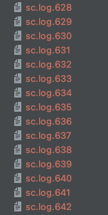
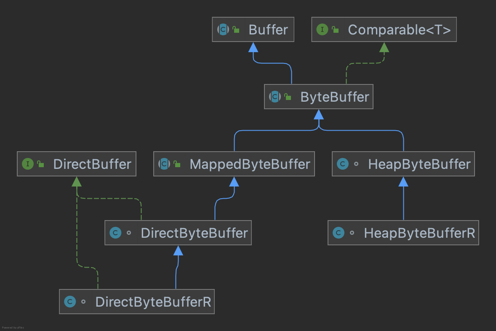

### NIO(Non-block io) 非阻塞IO
#### API发布历程
1. JDK1.4发布了java.nio包，它包含
    - 进行异步IO操作的缓冲区ByteBuffer等
    - 进行异步IO操作的管道Pipe
    - 进行异步IO操作的channel（异步/同步），包含ServerSocketChannel，SocketChannel等
    - 多种字符集的编码和解码能力
    - 基于非阻塞IO的多路复用器selector
    - 基于流行的Perl实现的正则表达式类库
    - 文件通道FileChannel
    - 缺陷1 没有统一的文件属性（读写权限等）
    - 缺陷2 API能力比较弱，目录级联/递归需要自己实现
    - 缺陷3 底层存储系统的一些高级API无法调用
    - 缺陷4 所有文件操作都是同步阻塞调用
2. JDK1.7发布NIO 2.0版，修改内容
    - 能够批量获取文件属性
    - 提供AIO功能，支持基于文件的异步IO操作和针对网络套接字的异步操作
    - 完成JSR-51定义的通道功能，包括对配置个多播数据报的支持等
#### 基础
1. 概念
    1. 缓冲区Buffer:NIO类库中所有数据都通过缓冲区操作。写入数据时，写入到缓冲区。读取数据时，读取到缓冲区。
    2. 通道Channel:通道是双向的，可以同时读写，而不像流只是单向的。它分为用于网络读写的SelectableChannel和文件操作的FileChannel。
    3. 多路复用器Selector：JDK使用epoll()来实现它，所以不受最大连接句柄的限制
2. select\poll\epoll区别
   1. select基于数组遍历实现，最大连接为1024
   2. poll基于链表遍历实现，连接无上限
   3. epoll基于哈希表、事件回调实现，连接无上限

#### selector
1. Java NIO API调用
   1. 创建Channel
    ```text
       SocketServerChannel serverChannel = SocketServerChannel.open();
    ```
   2. 绑定端口,设置为非阻塞
    ```text
       serverChannel.getSocket().bind(new InetSocketAddress(...));  
       serverChannel.configureBlock(false);  
    ```
   3. 创建多路复用器
    ```text
       Selector selector = Selector.open();  
    ```
   4. 注册连接事件
    ```text
       SelectionKey key = serverChannel.register(selector,SelectionKey.OP_ACCEPT,ioHandler); 
    ```
   5. 轮询
    ```text
       Iterator iterator = selector.selectedKeys().iterator();
       while(iterator.hasNext()){
           SelectionKey selectedKey = (SelectionKey)iterator.next();
           // logic
       }
    ```
   6. 获取新的客户端连接，并设置为非阻塞
    ```text
       serverChannel.accept();
    ```
2. 使用strace命令查看系统调用
   1. 使用docker安装centos
   2. centos安装openjdk8\telnet\strace
      1. yum install java-1.8.0-openjdk* -y
         1. java -version
         2. openjdk version "1.8.0_312" OpenJDK Runtime Environment (build 1.8.0_312-b07) OpenJDK 64-Bit Server VM (build 25.312-b07, mixed mode)
      2. yum install -y telnet
      3. yum install -y strace
   3. javac SelectorTest.class
   4. 打开3个窗口
      1. 运行服务端
         1. cd /var/local/images/
         2. strace -t -ff -o sc.log java liufeng.io.SelectorTest
      2. 运行客户端
         1. telnet localhost 8080（考虑用nc命令）
         2. 发送消息hello
      3. 关闭服务端
         1. jps
         2. kill -9 628
   5. 查看日志文件
      1. 打开第二个文件，即sc.log.629，详见末尾
      2. 01:54:18 socket(AF_INET6, SOCK_STREAM, IPPROTO_IP) = 6
      3. 01:54:18 bind(6, {sa_family=AF_INET, sin_port=htons(8080), sin_addr=inet_addr("0.0.0.0")}, 16) = 0
      4. 01:54:18 fcntl(6, F_GETFL)              = 0x2 (flags O_RDWR)
      5. 01:54:18 fcntl(6, F_SETFL, O_RDWR|O_NONBLOCK) = 0
      6. 01:54:18 listen(6, 50)                  = 0
      7. 01:54:19 epoll_create(256)              = 10
      8. 01:54:19 epoll_ctl(10, EPOLL_CTL_ADD, 8, {EPOLLIN, {u32=8, u64=140037408686088}}) = 0 
      9. 01:54:19 epoll_ctl(10, EPOLL_CTL_ADD, 6, {EPOLLIN, {u32=6, u64=140033113718790}}) = 0 
      10. 01:54:19 epoll_wait(10, [{EPOLLIN, {u32=6, u64=140033113718790}}], 8192, -1) = 1 
      11. 01:54:43 accept(6, {sa_family=AF_INET, sin_port=htons(59608), sin_addr=inet_addr("127.0.0.1")}, [16]) = 11
      12. 01:54:43 epoll_ctl(10, EPOLL_CTL_ADD, 11, {EPOLLIN, {u32=11, u64=140033113718795}}) = 0 
      13. 01:54:43 epoll_wait(10,  <unfinished ...>) = ?
   6. 系统调用函数说明
      1. socket：创建一个socket描述符。函数有3个参数，如下
         1. protofamily：即协议域，又称为协议族（family）。常用的协议族有，AF_INET(IPV4)、AF_INET6(IPV6)、AF_LOCAL（或称AF_UNIX，Unix域socket）、AF_ROUTE等等。协议族决定了socket的地址类型，在通信中必须采用对应的地址，如AF_INET决定了要用ipv4地址（32位的）与端口号（16位的）的组合、AF_UNIX决定了要用一个绝对路径名作为地址。 
         2. type：指定socket类型。常用的socket类型有，SOCK_STREAM、SOCK_DGRAM、SOCK_RAW、SOCK_PACKET、SOCK_SEQPACKET等等（socket的类型有哪些？）。 
         3. protocol：故名思意，就是指定协议。常用的协议有，IPPROTO_TCP、IPPTOTO_UDP、IPPROTO_SCTP、IPPROTO_TIPC等
      2. bind：绑定端口号。函数有3个参数，如下
         1. sockfd：即socket描述字，它是通过socket()函数创建了，唯一标识一个socket。bind()函数就是将给这个描述字绑定一个名字
         2. addr：一个const struct sockaddr *指针，指向要绑定给sockfd的协议地址。这个地址结构根据地址创建socket时的地址协议族的不同而不同
         3. 对应的是地址的长度
      3. fcntl：根据文件描述符操作文件特性。最多支持3个参数
         1. fd：socket描述字
         2. cmd：有5种功能
            1. F_DUPFD：复制一个现有的描述符
            2. F_SETFD|F_GETFD：获得/设置文件描述符
            3. F_SETFL|F_GETFL：获得/设置文件状态，一共7种状态，前4种可设置
               1. O_NONBLOCK   非阻塞I/O，如果read(2)调用没有可读取的数据，或者如果write(2)操作将阻塞，则read或write调用将返回-1和EAGAIN错误 
               2. O_APPEND     强制每次写(write)操作都添加在文件大的末尾，相当于open(2)的O_APPEND标志 
               3. O_DIRECT     最小化或去掉reading和writing的缓存影响。系统将企图避免缓存你的读或写的数据。如果不能够避免缓存，那么它将最小化已经被缓存了的数据造成的影响。如果这个标志用的不够好，将大大的降低性能 
               4. O_ASYNC      当I/O可用的时候，允许SIGIO信号发送到进程组，例如：当有数据可以读的时候
               5. O_RDONLY
               6. O_WRONLY
               7. O_RDWR
            4. F_SETOWN|F_GETFOWN：获得/设置文件异步IO所有权
            5. F_SETLK|F_GETLK：获得/设置记录锁
      4. listen：监听来自客户端的TCP连接。函数有2个参数
         1. sockfd：即为要监听的socket描述字
         2. backlog：为相应socket可以排队的最大连接个数
      5. accept：建立连接。函数有3个参数
         1. sockfd：正在监听套接字fd
         2. addr：接受一个返回值，这返回值指定客户端的地址
         3. len：addr结构大小
      6. epoll_create：产生一个epoll 文件描述符，一个epoll文件描述符对应一个文件描述符集合。函数有一个参数
         1. size：内核监听的数目，size为epoll所支持的最大句柄数
      7. epoll_ctl：用于控制这个集合中的成员（加入、删除、变更等事件，底层使用红黑树实现）。函数有4个参数
         1. epfd：epoll_create返回的epoll句柄
         2. op：操作类型，EPOLL_CTL_ADD(注册新的fd到epfd)，EPOLL_CTL_MOD(修改已经注册的fd的监听事件)， EPOLL_CTL_DEL(从epfd删除一个fd)；
         3. sockfd：监听的标识符
         4. event：要监听的事件
      8. epoll_wait：等待集合中成员的IO事件发生（将发生事件的成员加入到数组，并通过事件回调发送给用户态），无IO事件时保持睡眠状态。函数有4个参数
         1. epfd：epoll_create返回的epoll句柄
         2. event：分配好的epoll_event结构体数组 用于接收fd对象的缓冲区
         3. maxevents：每次能够处理的事件数 这一次调用可以接收多少准备好的fd对象，通常设置为events参数的长度
         4. timeout：如果没有准备好的事件对象，那么等待多久返回，-1阻塞，0非阻塞
   7. 总结
      1. IO是系统底层提供的功能，应用层能实现哪些功能，依赖于系统底层提供了那些功能
      2. NIO设置的参数，大都是系统调用调用，而不完全是NIO实现需要那些参数
#### Buffer
1. 类图
2. 常用子类
   1. HeapByteBuffer：堆内内存，安全高效
   2. DirectBuffer：堆外内存，风险和效率更高（内存如何回收：借助java虚引用机制，在对象被回收的时候触发释放内存的回调）
   3. MapperByteBuffer：文件映射内存，零拷贝内存映射
3. 内存管理
   1. 内存初始化
   2. 内存数据读写
   3. 内存释放
##### ByteBuffer
1. 分配
2. 分片 slice() 根据现有的缓冲区创建一个子缓冲区，新缓冲区与原来的缓冲区的一部分共享数据。窗口的起始和结束位置通过position和limit方法设置
#### channel
1. 从IO读写看，会不会丢失数据？
   1. 可能会有，Stream将内容写入到了Page Cache，操作系统判断脏页达到一定比例才会刷新磁盘，系统异常关闭时可能导致部分数据没有刷新到磁盘
2. 常规读写：磁盘-->内核态pageCache-->JVM-->内核态pageCache-->网络；
   1. mmap：磁盘-->内核态pageCache使用DMA实现，使用索引文件，文件不需要拷贝到JVM，但内核态之间还需要cpu拷贝，适合中小文件
   2. sendFile机制：传递fileDescriptor，内核态pageCache通过DMA直接传输给网络（内核态操作），但需要用户态触发，尽量一次性进行大文件操作
   3. 零拷贝：减少CPU消耗


### 附
#### sc.log.629文件内容
01:54:13 set_robust_list(0x7f5d04d749e0, 24) = 0
01:54:13 mmap(NULL, 134217728, PROT_NONE, MAP_PRIVATE|MAP_ANONYMOUS|MAP_NORESERVE, -1, 0) = 0x7f5cfa59b000
01:54:13 munmap(0x7f5cfa59b000, 27676672) = 0
01:54:13 munmap(0x7f5d00000000, 39432192) = 0
01:54:13 mprotect(0x7f5cfc000000, 135168, PROT_READ|PROT_WRITE) = 0
01:54:13 openat(AT_FDCWD, "/sys/devices/system/cpu", O_RDONLY|O_NONBLOCK|O_CLOEXEC|O_DIRECTORY) = 3
01:54:13 fstat(3, {st_mode=S_IFDIR|0755, st_size=0, ...}) = 0
01:54:13 getdents64(3, 0x7f5cfc000c10 /* 20 entries */, 32768) = 592
01:54:13 getdents64(3, 0x7f5cfc000c10 /* 0 entries */, 32768) = 0
01:54:13 close(3)                       = 0
01:54:13 sysinfo({uptime=69534, loads=[4384, 1024, 288], totalram=2871222272, freeram=737927168, sharedram=351154176, bufferram=62705664, totalswap=1073737728, freeswap=1073737728, procs=537, totalhigh=0, freehigh=0, mem_unit=1}) = 0
01:54:13 openat(AT_FDCWD, "/usr/lib/jvm/java-1.8.0-openjdk-1.8.0.312.b07-2.el8_5.x86_64/jre/bin/../lib/amd64/jli/librt.so.1", O_RDONLY|O_CLOEXEC) = -1 ENOENT (No such file or directory)
01:54:13 openat(AT_FDCWD, "/usr/lib/jvm/java-1.8.0-openjdk-1.8.0.312.b07-2.el8_5.x86_64/jre/bin/../lib/amd64/librt.so.1", O_RDONLY|O_CLOEXEC) = -1 ENOENT (No such file or directory)
01:54:13 openat(AT_FDCWD, "/etc/ld.so.cache", O_RDONLY|O_CLOEXEC) = 3
01:54:13 fstat(3, {st_mode=S_IFREG|0644, st_size=14547, ...}) = 0
01:54:13 mmap(NULL, 14547, PROT_READ, MAP_PRIVATE, 3, 0) = 0x7f5d04d77000
01:54:13 close(3)                       = 0
01:54:13 openat(AT_FDCWD, "/lib64/librt.so.1", O_RDONLY|O_CLOEXEC) = 3
01:54:13 read(3, "\177ELF\2\1\1\0\0\0\0\0\0\0\0\0\3\0>\0\1\0\0\0\320#\0\0\0\0\0\0"..., 832) = 832
01:54:13 fstat(3, {st_mode=S_IFREG|0755, st_size=69024, ...}) = 0
01:54:13 mmap(NULL, 2128832, PROT_READ|PROT_EXEC, MAP_PRIVATE|MAP_DENYWRITE, 3, 0) = 0x7f5d02393000
01:54:13 mprotect(0x7f5d0239a000, 2093056, PROT_NONE) = 0
01:54:13 mmap(0x7f5d02599000, 8192, PROT_READ|PROT_WRITE, MAP_PRIVATE|MAP_FIXED|MAP_DENYWRITE, 3, 0x6000) = 0x7f5d02599000
01:54:13 close(3)                       = 0
01:54:13 mprotect(0x7f5d02599000, 4096, PROT_READ) = 0
01:54:13 munmap(0x7f5d04d77000, 14547)  = 0
01:54:13 clock_getres(CLOCK_MONOTONIC, {tv_sec=0, tv_nsec=1}) = 0
01:54:13 lstat("/usr", {st_mode=S_IFDIR|0755, st_size=4096, ...}) = 0
01:54:13 lstat("/usr/lib", {st_mode=S_IFDIR|0555, st_size=4096, ...}) = 0
01:54:13 lstat("/usr/lib/jvm", {st_mode=S_IFDIR|0755, st_size=4096, ...}) = 0
01:54:13 lstat("/usr/lib/jvm/java-1.8.0-openjdk-1.8.0.312.b07-2.el8_5.x86_64", {st_mode=S_IFDIR|0755, st_size=4096, ...}) = 0
01:54:13 lstat("/usr/lib/jvm/java-1.8.0-openjdk-1.8.0.312.b07-2.el8_5.x86_64/jre", {st_mode=S_IFDIR|0755, st_size=4096, ...}) = 0
01:54:13 lstat("/usr/lib/jvm/java-1.8.0-openjdk-1.8.0.312.b07-2.el8_5.x86_64/jre/lib", {st_mode=S_IFDIR|0755, st_size=4096, ...}) = 0
01:54:13 lstat("/usr/lib/jvm/java-1.8.0-openjdk-1.8.0.312.b07-2.el8_5.x86_64/jre/lib/amd64", {st_mode=S_IFDIR|0755, st_size=4096, ...}) = 0
01:54:13 lstat("/usr/lib/jvm/java-1.8.0-openjdk-1.8.0.312.b07-2.el8_5.x86_64/jre/lib/amd64/server", {st_mode=S_IFDIR|0755, st_size=4096, ...}) = 0
01:54:13 lstat("/usr/lib/jvm/java-1.8.0-openjdk-1.8.0.312.b07-2.el8_5.x86_64/jre/lib/amd64/server/libjvm.so", {st_mode=S_IFREG|0755, st_size=23718976, ...}) = 0
01:54:13 openat(AT_FDCWD, "/usr/lib/jvm/java-1.8.0-openjdk-1.8.0.312.b07-2.el8_5.x86_64/jre/lib/amd64/libverify.so", O_RDONLY) = 3
01:54:13 fstat(3, {st_mode=S_IFREG|0755, st_size=75792, ...}) = 0
01:54:13 read(3, "\177ELF\2\1\1\0\0\0\0\0\0\0\0\0\3\0>\0\1\0\0\0\0H\0\0\0\0\0\0"..., 4096) = 4096
01:54:13 lseek(3, 73728, SEEK_SET)      = 73728
01:54:13 read(3, "u.property\0\0\0\0\0\0\0\0\0\0\0\0\0\0\0\0\0\0\0\0\0\0"..., 4096) = 2064
01:54:13 lseek(3, 0, SEEK_SET)          = 0
01:54:13 read(3, "\177ELF\2\1\1\0\0\0\0\0\0\0\0\0\3\0>\0\1\0\0\0\0H\0\0\0\0\0\0"..., 4096) = 4096
01:54:13 lseek(3, 73728, SEEK_SET)      = 73728
01:54:13 read(3, "u.property\0\0\0\0\0\0\0\0\0\0\0\0\0\0\0\0\0\0\0\0\0\0"..., 4096) = 2064
01:54:13 lseek(3, 0, SEEK_SET)          = 0
01:54:13 read(3, "\177ELF\2\1\1\0\0\0\0\0\0\0\0\0\3\0>\0\1\0\0\0\0H\0\0\0\0\0\0"..., 4096) = 4096
01:54:13 lseek(3, 73728, SEEK_SET)      = 73728
01:54:13 read(3, "u.property\0\0\0\0\0\0\0\0\0\0\0\0\0\0\0\0\0\0\0\0\0\0"..., 4096) = 2064
01:54:13 lseek(3, 61440, SEEK_SET)      = 61440
01:54:13 read(3, "U) 8.5.0 20210514 (Red Hat 8.5.0"..., 4096) = 4096
01:54:13 read(3, "\0\0\0\0\0\0\0\0 \n\0\0\0\2\16\0\274\264\0\0\0\0\0\0\0\0\0\0\0\0\0\0"..., 4096) = 4096
01:54:13 lseek(3, 73728, SEEK_SET)      = 73728
01:54:13 read(3, "u.property\0\0\0\0\0\0\0\0\0\0\0\0\0\0\0\0\0\0\0\0\0\0"..., 4096) = 2064
01:54:13 lseek(3, 65536, SEEK_SET)      = 65536
01:54:13 read(3, "\0\0\0\0\0\0\0\0 \n\0\0\0\2\16\0\274\264\0\0\0\0\0\0\0\0\0\0\0\0\0\0"..., 4096) = 4096
01:54:13 read(3, "_fullinfo_types.start\0.annobin_m"..., 4096) = 4096
01:54:13 lseek(3, 73728, SEEK_SET)      = 73728
01:54:13 read(3, "u.property\0\0\0\0\0\0\0\0\0\0\0\0\0\0\0\0\0\0\0\0\0\0"..., 4096) = 2064
01:54:13 lseek(3, 69632, SEEK_SET)      = 69632
01:54:13 read(3, "_fullinfo_types.start\0.annobin_m"..., 4096) = 4096
01:54:13 read(3, "u.property\0\0\0\0\0\0\0\0\0\0\0\0\0\0\0\0\0\0\0\0\0\0"..., 4096) = 2064
01:54:13 lseek(3, 73728, SEEK_SET)      = 73728
01:54:13 read(3, "u.property\0\0\0\0\0\0\0\0\0\0\0\0\0\0\0\0\0\0\0\0\0\0"..., 4096) = 2064
01:54:13 lseek(3, 0, SEEK_SET)          = 0
01:54:13 read(3, "\177ELF\2\1\1\0\0\0\0\0\0\0\0\0\3\0>\0\1\0\0\0\0H\0\0\0\0\0\0"..., 4096) = 4096
01:54:13 close(3)                       = 0
01:54:13 openat(AT_FDCWD, "/usr/lib/jvm/java-1.8.0-openjdk-1.8.0.312.b07-2.el8_5.x86_64/jre/lib/amd64/libverify.so", O_RDONLY|O_CLOEXEC) = 3
01:54:13 read(3, "\177ELF\2\1\1\0\0\0\0\0\0\0\0\0\3\0>\0\1\0\0\0\0H\0\0\0\0\0\0"..., 832) = 832
01:54:13 lseek(3, 53696, SEEK_SET)      = 53696
01:54:13 read(3, "\4\0\0\0\20\0\0\0\5\0\0\0GNU\0\2\0\0\300\4\0\0\0\3\0\0\0\0\0\0\0", 32) = 32
01:54:13 fstat(3, {st_mode=S_IFREG|0755, st_size=75792, ...}) = 0
01:54:13 lseek(3, 53696, SEEK_SET)      = 53696
01:54:13 read(3, "\4\0\0\0\20\0\0\0\5\0\0\0GNU\0\2\0\0\300\4\0\0\0\3\0\0\0\0\0\0\0", 32) = 32
01:54:13 mmap(NULL, 2158600, PROT_READ|PROT_EXEC, MAP_PRIVATE|MAP_DENYWRITE, 3, 0) = 0x7f5d02183000
01:54:13 mprotect(0x7f5d02191000, 2093056, PROT_NONE) = 0
01:54:13 mmap(0x7f5d02390000, 8192, PROT_READ|PROT_WRITE, MAP_PRIVATE|MAP_FIXED|MAP_DENYWRITE, 3, 0xd000) = 0x7f5d02390000
01:54:13 mmap(0x7f5d02392000, 8, PROT_READ|PROT_WRITE, MAP_PRIVATE|MAP_FIXED|MAP_ANONYMOUS, -1, 0) = 0x7f5d02392000
01:54:13 close(3)                       = 0
01:54:13 mprotect(0x7f5d02390000, 8192, PROT_READ) = 0
01:54:13 openat(AT_FDCWD, "/usr/lib/jvm/java-1.8.0-openjdk-1.8.0.312.b07-2.el8_5.x86_64/jre/lib/amd64/libjava.so", O_RDONLY) = 3
01:54:13 fstat(3, {st_mode=S_IFREG|0755, st_size=329080, ...}) = 0
01:54:13 read(3, "\177ELF\2\1\1\0\0\0\0\0\0\0\0\0\3\0>\0\1\0\0\0\0\344\0\0\0\0\0\0"..., 4096) = 4096
01:54:13 lseek(3, 323584, SEEK_SET)     = 323584
01:54:13 read(3, "eZone_getSystemGMTOffsetID\0fopen"..., 4096) = 4096
01:54:13 lseek(3, 8192, SEEK_SET)       = 8192
01:54:13 read(3, "\244\1\0\0\0\0\0\0\245\1\0\0\246\1\0\0\0\0\0\0\250\1\0\0\0\0\0\0\251\1\0\0"..., 4096) = 4096
01:54:13 read(3, "\212\31\0\0\22\0\0\0\0\0\0\0\0\0\0\0\0\0\0\0\0\0\0\0v\6\0\0\22\0\0\0"..., 8192) = 8192
01:54:13 read(3, "0\273\1\0\0\0\0\0=\0\0\0\0\0\0\0\364!\0\0\22\0\16\0\2006\1\0\0\0\0\0"..., 4096) = 4096
01:54:13 lseek(3, 323584, SEEK_SET)     = 323584
01:54:13 read(3, "eZone_getSystemGMTOffsetID\0fopen"..., 4096) = 4096
01:54:13 lseek(3, 20480, SEEK_SET)      = 20480
01:54:13 read(3, "0\273\1\0\0\0\0\0=\0\0\0\0\0\0\0\364!\0\0\22\0\16\0\2006\1\0\0\0\0\0"..., 4096) = 4096
01:54:13 read(3, "_lang_ClassLoader_resolveClass0\0"..., 8192) = 8192
01:54:13 read(3, "a_java_io_UnixFileSystem_setPerm"..., 4096) = 4096
01:54:13 lseek(3, 323584, SEEK_SET)     = 323584
01:54:13 read(3, "eZone_getSystemGMTOffsetID\0fopen"..., 4096) = 4096
01:54:13 read(3, "\6\0\0\0\0\0\0\0\10\313\0\0\0\0\0\0\10\313\0\0\0\0\0\0\33\0\0\0\0\0\0\0"..., 4096) = 1400
01:54:13 lseek(3, 184320, SEEK_SET)     = 184320
01:54:13 read(3, "\0\0\0\0\0\1\0\0GA+stack_clash\0\0\21\0\0\0\0\0\0\0"..., 4096) = 4096
01:54:13 read(3, "b\24\0\0\0\2\16\0\261\351\0\0\0\0\0\0\0\0\0\0\0\0\0\0\215\24\0\0\0\2\16\0"..., 57344) = 57344
01:54:13 read(3, "\0\0\0\0\0\0\0\0\0\0\0\0\0\0\0\0:8\1\0\22\0\16\0@7\1\0\0\0\0\0"..., 4096) = 4096
01:54:13 lseek(3, 327680, SEEK_SET)     = 327680
01:54:13 read(3, "\6\0\0\0\0\0\0\0\10\313\0\0\0\0\0\0\10\313\0\0\0\0\0\0\33\0\0\0\0\0\0\0"..., 4096) = 1400
01:54:13 mprotect(0x7f5cfc021000, 61440, PROT_READ|PROT_WRITE) = 0
01:54:13 lseek(3, 245760, SEEK_SET)     = 245760
01:54:13 read(3, "\0\0\0\0\0\0\0\0\0\0\0\0\0\0\0\0:8\1\0\22\0\16\0@7\1\0\0\0\0\0"..., 4096) = 4096
01:54:13 read(3, "va_lang_reflect_Array_setFloat.e"..., 73728) = 73728
01:54:13 read(3, "eZone_getSystemGMTOffsetID\0fopen"..., 4096) = 4096
01:54:13 lseek(3, 327680, SEEK_SET)     = 327680
01:54:13 read(3, "\6\0\0\0\0\0\0\0\10\313\0\0\0\0\0\0\10\313\0\0\0\0\0\0\33\0\0\0\0\0\0\0"..., 4096) = 1400
01:54:13 lseek(3, 323584, SEEK_SET)     = 323584
01:54:13 read(3, "eZone_getSystemGMTOffsetID\0fopen"..., 4096) = 4096
01:54:13 lseek(3, 327680, SEEK_SET)     = 327680
01:54:13 read(3, "\6\0\0\0\0\0\0\0\10\313\0\0\0\0\0\0\10\313\0\0\0\0\0\0\33\0\0\0\0\0\0\0"..., 4096) = 1400
01:54:13 lseek(3, 0, SEEK_SET)          = 0
01:54:13 read(3, "\177ELF\2\1\1\0\0\0\0\0\0\0\0\0\3\0>\0\1\0\0\0\0\344\0\0\0\0\0\0"..., 4096) = 4096
01:54:13 openat(AT_FDCWD, "/proc/sys/vm/overcommit_memory", O_RDONLY|O_CLOEXEC) = 4
01:54:13 read(4, "1", 1)                = 1
01:54:13 close(4)                       = 0
01:54:13 madvise(0x7f5cfc02a000, 24576, MADV_DONTNEED) = 0
01:54:13 madvise(0x7f5cfc027000, 12288, MADV_DONTNEED) = 0
01:54:13 close(3)                       = 0
01:54:13 openat(AT_FDCWD, "/usr/lib/jvm/java-1.8.0-openjdk-1.8.0.312.b07-2.el8_5.x86_64/jre/lib/amd64/libjava.so", O_RDONLY|O_CLOEXEC) = 3
01:54:13 read(3, "\177ELF\2\1\1\0\0\0\0\0\0\0\0\0\3\0>\0\1\0\0\0\0\344\0\0\0\0\0\0"..., 832) = 832
01:54:13 lseek(3, 175704, SEEK_SET)     = 175704
01:54:13 read(3, "\4\0\0\0\20\0\0\0\5\0\0\0GNU\0\2\0\0\300\4\0\0\0\3\0\0\0\0\0\0\0", 32) = 32
01:54:13 fstat(3, {st_mode=S_IFREG|0755, st_size=329080, ...}) = 0
01:54:13 lseek(3, 175704, SEEK_SET)     = 175704
01:54:13 read(3, "\4\0\0\0\20\0\0\0\5\0\0\0GNU\0\2\0\0\300\4\0\0\0\3\0\0\0\0\0\0\0", 32) = 32
01:54:13 mmap(NULL, 2281600, PROT_READ|PROT_EXEC, MAP_PRIVATE|MAP_DENYWRITE, 3, 0) = 0x7f5d01f55000
01:54:13 mprotect(0x7f5d01f80000, 2097152, PROT_NONE) = 0
01:54:13 mmap(0x7f5d02180000, 8192, PROT_READ|PROT_WRITE, MAP_PRIVATE|MAP_FIXED|MAP_DENYWRITE, 3, 0x2b000) = 0x7f5d02180000
01:54:13 mmap(0x7f5d02182000, 128, PROT_READ|PROT_WRITE, MAP_PRIVATE|MAP_FIXED|MAP_ANONYMOUS, -1, 0) = 0x7f5d02182000
01:54:13 close(3)                       = 0
01:54:13 mprotect(0x7f5d02180000, 4096, PROT_READ) = 0
01:54:13 stat(".hotspotrc", 0x7f5d04d73b80) = -1 ENOENT (No such file or directory)
01:54:13 openat(AT_FDCWD, "/proc/self/mountinfo", O_RDONLY) = 3
01:54:13 fstat(3, {st_mode=S_IFREG|0444, st_size=0, ...}) = 0
01:54:13 read(3, "456 375 0:143 / / rw,relatime ma"..., 1024) = 1024
01:54:13 read(3, "726222b017/resolv.conf /etc/reso"..., 1024) = 671
01:54:13 read(3, "", 1024)              = 0
01:54:13 close(3)                       = 0
01:54:13 openat(AT_FDCWD, "/usr/lib/jvm/java-1.8.0-openjdk-1.8.0.312.b07-2.el8_5.x86_64/jre/lib/endorsed", O_RDONLY|O_NONBLOCK|O_CLOEXEC|O_DIRECTORY) = -1 ENOENT (No such file or directory)
01:54:13 stat("/usr/lib/jvm/java-1.8.0-openjdk-1.8.0.312.b07-2.el8_5.x86_64/jre/lib/amd64/xawt/libmawt.so", 0x7f5d04d71840) = -1 ENOENT (No such file or directory)
01:54:13 stat("/usr/lib/jvm/java-1.8.0-openjdk-1.8.0.312.b07-2.el8_5.x86_64/jre/lib/amd64/libawt_xawt.so", {st_mode=S_IFREG|0755, st_size=623976, ...}) = 0
01:54:13 sched_getaffinity(0, 128, [0, 1, 2, 3]) = 16
01:54:13 sched_getaffinity(0, 128, [0, 1, 2, 3]) = 16
01:54:13 prlimit64(0, RLIMIT_AS, NULL, {rlim_cur=RLIM64_INFINITY, rlim_max=RLIM64_INFINITY}) = 0
01:54:13 prlimit64(0, RLIMIT_AS, NULL, {rlim_cur=RLIM64_INFINITY, rlim_max=RLIM64_INFINITY}) = 0
01:54:13 prlimit64(0, RLIMIT_AS, NULL, {rlim_cur=RLIM64_INFINITY, rlim_max=RLIM64_INFINITY}) = 0
01:54:13 clock_getres(0xffffec56 /* CLOCK_??? */, {tv_sec=0, tv_nsec=1}) = 0
01:54:13 mmap(NULL, 4096, PROT_READ, MAP_PRIVATE|MAP_ANONYMOUS, -1, 0) = 0x7f5d04d7a000
01:54:13 mmap(NULL, 4096, PROT_READ|PROT_WRITE, MAP_PRIVATE|MAP_ANONYMOUS, -1, 0) = 0x7f5d04d79000
01:54:13 rt_sigprocmask(SIG_BLOCK, NULL, [], 8) = 0
01:54:13 rt_sigaction(SIGUSR2, {sa_handler=0x7f5d03820a80, sa_mask=[], sa_flags=SA_RESTORER|SA_RESTART|SA_SIGINFO, sa_restorer=0x7f5d04943b20}, NULL, 8) = 0
01:54:13 rt_sigaction(SIGHUP, NULL, {sa_handler=SIG_DFL, sa_mask=[], sa_flags=0}, 8) = 0
01:54:13 rt_sigaction(SIGINT, NULL, {sa_handler=SIG_DFL, sa_mask=[], sa_flags=0}, 8) = 0
01:54:13 rt_sigaction(SIGTERM, NULL, {sa_handler=SIG_DFL, sa_mask=[], sa_flags=0}, 8) = 0
01:54:13 rt_sigaction(SIGSEGV, NULL, {sa_handler=SIG_DFL, sa_mask=[], sa_flags=0}, 8) = 0
01:54:13 rt_sigaction(SIGSEGV, {sa_handler=0x7f5d03820bf0, sa_mask=~[RTMIN RT_1], sa_flags=SA_RESTORER|SA_RESTART|SA_SIGINFO, sa_restorer=0x7f5d04943b20}, {sa_handler=SIG_DFL, sa_mask=[], sa_flags=0}, 8) = 0
01:54:13 rt_sigaction(SIGPIPE, NULL, {sa_handler=SIG_DFL, sa_mask=[], sa_flags=0}, 8) = 0
01:54:13 rt_sigaction(SIGPIPE, {sa_handler=0x7f5d03820bf0, sa_mask=~[RTMIN RT_1], sa_flags=SA_RESTORER|SA_RESTART|SA_SIGINFO, sa_restorer=0x7f5d04943b20}, {sa_handler=SIG_DFL, sa_mask=[], sa_flags=0}, 8) = 0
01:54:13 rt_sigaction(SIGBUS, NULL, {sa_handler=SIG_DFL, sa_mask=[], sa_flags=0}, 8) = 0
01:54:13 rt_sigaction(SIGBUS, {sa_handler=0x7f5d03820bf0, sa_mask=~[RTMIN RT_1], sa_flags=SA_RESTORER|SA_RESTART|SA_SIGINFO, sa_restorer=0x7f5d04943b20}, {sa_handler=SIG_DFL, sa_mask=[], sa_flags=0}, 8) = 0
01:54:13 rt_sigaction(SIGILL, NULL, {sa_handler=SIG_DFL, sa_mask=[], sa_flags=0}, 8) = 0
01:54:13 rt_sigaction(SIGILL, {sa_handler=0x7f5d03820bf0, sa_mask=~[RTMIN RT_1], sa_flags=SA_RESTORER|SA_RESTART|SA_SIGINFO, sa_restorer=0x7f5d04943b20}, {sa_handler=SIG_DFL, sa_mask=[], sa_flags=0}, 8) = 0
01:54:13 rt_sigaction(SIGFPE, NULL, {sa_handler=SIG_DFL, sa_mask=[], sa_flags=0}, 8) = 0
01:54:13 rt_sigaction(SIGFPE, {sa_handler=0x7f5d03820bf0, sa_mask=~[RTMIN RT_1], sa_flags=SA_RESTORER|SA_RESTART|SA_SIGINFO, sa_restorer=0x7f5d04943b20}, {sa_handler=SIG_DFL, sa_mask=[], sa_flags=0}, 8) = 0
01:54:13 rt_sigaction(SIGXFSZ, NULL, {sa_handler=SIG_DFL, sa_mask=[], sa_flags=0}, 8) = 0
01:54:13 rt_sigaction(SIGXFSZ, {sa_handler=0x7f5d03820bf0, sa_mask=~[RTMIN RT_1], sa_flags=SA_RESTORER|SA_RESTART|SA_SIGINFO, sa_restorer=0x7f5d04943b20}, {sa_handler=SIG_DFL, sa_mask=[], sa_flags=0}, 8) = 0
01:54:13 prlimit64(0, RLIMIT_STACK, NULL, {rlim_cur=8192*1024, rlim_max=RLIM64_INFINITY}) = 0
01:54:13 openat(AT_FDCWD, "/proc/self/maps", O_RDONLY) = 3
01:54:13 fstat(3, {st_mode=S_IFREG|0444, st_size=0, ...}) = 0
01:54:13 read(3, "56069fe00000-56069fe01000 r-xp 0"..., 1024) = 1024
01:54:13 read(3, "ava-1.8.0-openjdk-1.8.0.312.b07-"..., 1024) = 1024
01:54:13 read(3, "d0259a000 r--p 00006000 fe:01 15"..., 1024) = 1024
01:54:13 read(3, "bb000 r-xp 00000000 fe:01 158103"..., 1024) = 1024
01:54:13 read(3, "m/java-1.8.0-openjdk-1.8.0.312.b"..., 1024) = 1024
01:54:13 read(3, "        /usr/lib/jvm/java-1.8.0-"..., 1024) = 1024
01:54:13 read(3, "5d04b4b000-7f5d04b4c000 r--p 000"..., 1024) = 1024
01:54:13 close(3)                       = 0
01:54:13 prlimit64(0, RLIMIT_NOFILE, NULL, {rlim_cur=1024*1024, rlim_max=1024*1024}) = 0
01:54:13 prlimit64(0, RLIMIT_NOFILE, {rlim_cur=1024*1024, rlim_max=1024*1024}, NULL) = 0
01:54:13 mprotect(0x7f5cfc030000, 40960, PROT_READ|PROT_WRITE) = 0
01:54:13 mprotect(0x7f5cfc03a000, 73728, PROT_READ|PROT_WRITE) = 0
01:54:13 geteuid()                      = 0
01:54:13 socket(AF_UNIX, SOCK_STREAM|SOCK_CLOEXEC|SOCK_NONBLOCK, 0) = 3
01:54:13 connect(3, {sa_family=AF_UNIX, sun_path="/var/run/nscd/socket"}, 110) = -1 ENOENT (No such file or directory)
01:54:13 close(3)                       = 0
01:54:13 socket(AF_UNIX, SOCK_STREAM|SOCK_CLOEXEC|SOCK_NONBLOCK, 0) = 3
01:54:13 connect(3, {sa_family=AF_UNIX, sun_path="/var/run/nscd/socket"}, 110) = -1 ENOENT (No such file or directory)
01:54:13 close(3)                       = 0
01:54:13 openat(AT_FDCWD, "/etc/nsswitch.conf", O_RDONLY|O_CLOEXEC) = 3
01:54:13 fstat(3, {st_mode=S_IFREG|0644, st_size=2215, ...}) = 0
01:54:13 mprotect(0x7f5cfc04c000, 4096, PROT_READ|PROT_WRITE) = 0
01:54:13 read(3, "#\n# /etc/nsswitch.conf\n#\n# Name "..., 4096) = 2215
01:54:13 read(3, "", 4096)              = 0
01:54:13 close(3)                       = 0
01:54:13 openat(AT_FDCWD, "/usr/lib/jvm/java-1.8.0-openjdk-1.8.0.312.b07-2.el8_5.x86_64/jre/bin/../lib/amd64/jli/libnss_sss.so.2", O_RDONLY|O_CLOEXEC) = -1 ENOENT (No such file or directory)
01:54:13 openat(AT_FDCWD, "/usr/lib/jvm/java-1.8.0-openjdk-1.8.0.312.b07-2.el8_5.x86_64/jre/bin/../lib/amd64/libnss_sss.so.2", O_RDONLY|O_CLOEXEC) = -1 ENOENT (No such file or directory)
01:54:13 openat(AT_FDCWD, "/etc/ld.so.cache", O_RDONLY|O_CLOEXEC) = 3
01:54:13 fstat(3, {st_mode=S_IFREG|0644, st_size=14547, ...}) = 0
01:54:13 mmap(NULL, 14547, PROT_READ, MAP_PRIVATE, 3, 0) = 0x7f5d04c70000
01:54:13 close(3)                       = 0
01:54:13 openat(AT_FDCWD, "/lib64/glibc-hwcaps/x86-64-v3/libnss_sss.so.2", O_RDONLY|O_CLOEXEC) = -1 ENOENT (No such file or directory)
01:54:13 stat("/lib64/glibc-hwcaps/x86-64-v3", 0x7f5d04d72fe0) = -1 ENOENT (No such file or directory)
01:54:13 openat(AT_FDCWD, "/lib64/glibc-hwcaps/x86-64-v2/libnss_sss.so.2", O_RDONLY|O_CLOEXEC) = -1 ENOENT (No such file or directory)
01:54:13 stat("/lib64/glibc-hwcaps/x86-64-v2", 0x7f5d04d72fe0) = -1 ENOENT (No such file or directory)
01:54:13 openat(AT_FDCWD, "/lib64/tls/haswell/x86_64/libnss_sss.so.2", O_RDONLY|O_CLOEXEC) = -1 ENOENT (No such file or directory)
01:54:13 stat("/lib64/tls/haswell/x86_64", 0x7f5d04d72fe0) = -1 ENOENT (No such file or directory)
01:54:13 openat(AT_FDCWD, "/lib64/tls/haswell/libnss_sss.so.2", O_RDONLY|O_CLOEXEC) = -1 ENOENT (No such file or directory)
01:54:13 stat("/lib64/tls/haswell", 0x7f5d04d72fe0) = -1 ENOENT (No such file or directory)
01:54:13 openat(AT_FDCWD, "/lib64/tls/x86_64/libnss_sss.so.2", O_RDONLY|O_CLOEXEC) = -1 ENOENT (No such file or directory)
01:54:13 stat("/lib64/tls/x86_64", 0x7f5d04d72fe0) = -1 ENOENT (No such file or directory)
01:54:13 openat(AT_FDCWD, "/lib64/tls/libnss_sss.so.2", O_RDONLY|O_CLOEXEC) = -1 ENOENT (No such file or directory)
01:54:13 stat("/lib64/tls", {st_mode=S_IFDIR|0555, st_size=4096, ...}) = 0
01:54:13 openat(AT_FDCWD, "/lib64/haswell/x86_64/libnss_sss.so.2", O_RDONLY|O_CLOEXEC) = -1 ENOENT (No such file or directory)
01:54:13 stat("/lib64/haswell/x86_64", 0x7f5d04d72fe0) = -1 ENOENT (No such file or directory)
01:54:13 openat(AT_FDCWD, "/lib64/haswell/libnss_sss.so.2", O_RDONLY|O_CLOEXEC) = -1 ENOENT (No such file or directory)
01:54:13 stat("/lib64/haswell", 0x7f5d04d72fe0) = -1 ENOENT (No such file or directory)
01:54:13 openat(AT_FDCWD, "/lib64/x86_64/libnss_sss.so.2", O_RDONLY|O_CLOEXEC) = -1 ENOENT (No such file or directory)
01:54:13 stat("/lib64/x86_64", 0x7f5d04d72fe0) = -1 ENOENT (No such file or directory)
01:54:13 openat(AT_FDCWD, "/lib64/libnss_sss.so.2", O_RDONLY|O_CLOEXEC) = -1 ENOENT (No such file or directory)
01:54:13 stat("/lib64", {st_mode=S_IFDIR|0555, st_size=12288, ...}) = 0
01:54:13 openat(AT_FDCWD, "/usr/lib64/glibc-hwcaps/x86-64-v3/libnss_sss.so.2", O_RDONLY|O_CLOEXEC) = -1 ENOENT (No such file or directory)
01:54:13 stat("/usr/lib64/glibc-hwcaps/x86-64-v3", 0x7f5d04d72fe0) = -1 ENOENT (No such file or directory)
01:54:13 openat(AT_FDCWD, "/usr/lib64/glibc-hwcaps/x86-64-v2/libnss_sss.so.2", O_RDONLY|O_CLOEXEC) = -1 ENOENT (No such file or directory)
01:54:13 stat("/usr/lib64/glibc-hwcaps/x86-64-v2", 0x7f5d04d72fe0) = -1 ENOENT (No such file or directory)
01:54:13 openat(AT_FDCWD, "/usr/lib64/tls/haswell/x86_64/libnss_sss.so.2", O_RDONLY|O_CLOEXEC) = -1 ENOENT (No such file or directory)
01:54:13 stat("/usr/lib64/tls/haswell/x86_64", 0x7f5d04d72fe0) = -1 ENOENT (No such file or directory)
01:54:13 openat(AT_FDCWD, "/usr/lib64/tls/haswell/libnss_sss.so.2", O_RDONLY|O_CLOEXEC) = -1 ENOENT (No such file or directory)
01:54:13 stat("/usr/lib64/tls/haswell", 0x7f5d04d72fe0) = -1 ENOENT (No such file or directory)
01:54:13 openat(AT_FDCWD, "/usr/lib64/tls/x86_64/libnss_sss.so.2", O_RDONLY|O_CLOEXEC) = -1 ENOENT (No such file or directory)
01:54:13 stat("/usr/lib64/tls/x86_64", 0x7f5d04d72fe0) = -1 ENOENT (No such file or directory)
01:54:13 openat(AT_FDCWD, "/usr/lib64/tls/libnss_sss.so.2", O_RDONLY|O_CLOEXEC) = -1 ENOENT (No such file or directory)
01:54:13 stat("/usr/lib64/tls", {st_mode=S_IFDIR|0555, st_size=4096, ...}) = 0
01:54:13 openat(AT_FDCWD, "/usr/lib64/haswell/x86_64/libnss_sss.so.2", O_RDONLY|O_CLOEXEC) = -1 ENOENT (No such file or directory)
01:54:13 stat("/usr/lib64/haswell/x86_64", 0x7f5d04d72fe0) = -1 ENOENT (No such file or directory)
01:54:13 openat(AT_FDCWD, "/usr/lib64/haswell/libnss_sss.so.2", O_RDONLY|O_CLOEXEC) = -1 ENOENT (No such file or directory)
01:54:13 stat("/usr/lib64/haswell", 0x7f5d04d72fe0) = -1 ENOENT (No such file or directory)
01:54:13 openat(AT_FDCWD, "/usr/lib64/x86_64/libnss_sss.so.2", O_RDONLY|O_CLOEXEC) = -1 ENOENT (No such file or directory)
01:54:13 stat("/usr/lib64/x86_64", 0x7f5d04d72fe0) = -1 ENOENT (No such file or directory)
01:54:13 openat(AT_FDCWD, "/usr/lib64/libnss_sss.so.2", O_RDONLY|O_CLOEXEC) = -1 ENOENT (No such file or directory)
01:54:13 stat("/usr/lib64", {st_mode=S_IFDIR|0555, st_size=12288, ...}) = 0
01:54:13 munmap(0x7f5d04c70000, 14547)  = 0
01:54:13 openat(AT_FDCWD, "/usr/lib/jvm/java-1.8.0-openjdk-1.8.0.312.b07-2.el8_5.x86_64/jre/bin/../lib/amd64/jli/libnss_files.so.2", O_RDONLY|O_CLOEXEC) = -1 ENOENT (No such file or directory)
01:54:13 openat(AT_FDCWD, "/usr/lib/jvm/java-1.8.0-openjdk-1.8.0.312.b07-2.el8_5.x86_64/jre/bin/../lib/amd64/libnss_files.so.2", O_RDONLY|O_CLOEXEC) = -1 ENOENT (No such file or directory)
01:54:13 openat(AT_FDCWD, "/etc/ld.so.cache", O_RDONLY|O_CLOEXEC) = 3
01:54:13 fstat(3, {st_mode=S_IFREG|0644, st_size=14547, ...}) = 0
01:54:13 mmap(NULL, 14547, PROT_READ, MAP_PRIVATE, 3, 0) = 0x7f5d04c70000
01:54:13 close(3)                       = 0
01:54:13 openat(AT_FDCWD, "/lib64/libnss_files.so.2", O_RDONLY|O_CLOEXEC) = 3
01:54:13 read(3, "\177ELF\2\1\1\0\0\0\0\0\0\0\0\0\3\0>\0\1\0\0\0\260'\0\0\0\0\0\0"..., 832) = 832
01:54:13 fstat(3, {st_mode=S_IFREG|0755, st_size=83728, ...}) = 0
01:54:13 mmap(NULL, 2172760, PROT_READ|PROT_EXEC, MAP_PRIVATE|MAP_DENYWRITE, 3, 0) = 0x7f5d01d42000
01:54:13 mprotect(0x7f5d01d4d000, 2097152, PROT_NONE) = 0
01:54:13 mmap(0x7f5d01f4d000, 8192, PROT_READ|PROT_WRITE, MAP_PRIVATE|MAP_FIXED|MAP_DENYWRITE, 3, 0xb000) = 0x7f5d01f4d000
01:54:13 mmap(0x7f5d01f4f000, 22360, PROT_READ|PROT_WRITE, MAP_PRIVATE|MAP_FIXED|MAP_ANONYMOUS, -1, 0) = 0x7f5d01f4f000
01:54:13 close(3)                       = 0
01:54:13 mprotect(0x7f5d01f4d000, 4096, PROT_READ) = 0
01:54:13 munmap(0x7f5d04c70000, 14547)  = 0
01:54:13 openat(AT_FDCWD, "/etc/passwd", O_RDONLY|O_CLOEXEC) = 3
01:54:13 fstat(3, {st_mode=S_IFREG|0644, st_size=703, ...}) = 0
01:54:13 lseek(3, 0, SEEK_SET)          = 0
01:54:13 read(3, "root:x:0:0:root:/root:/bin/bash\n"..., 4096) = 703
01:54:13 close(3)                       = 0
01:54:13 openat(AT_FDCWD, "/tmp/hsperfdata_root", O_RDONLY|O_NOFOLLOW) = 3
01:54:13 fstat(3, {st_mode=S_IFDIR|0755, st_size=4096, ...}) = 0
01:54:13 geteuid()                      = 0
01:54:13 openat(AT_FDCWD, "/tmp/hsperfdata_root", O_RDONLY|O_NONBLOCK|O_CLOEXEC|O_DIRECTORY) = 4
01:54:13 fstat(4, {st_mode=S_IFDIR|0755, st_size=4096, ...}) = 0
01:54:13 mprotect(0x7f5cfc04d000, 28672, PROT_READ|PROT_WRITE) = 0
01:54:13 fstat(3, {st_mode=S_IFDIR|0755, st_size=4096, ...}) = 0
01:54:13 fstat(4, {st_mode=S_IFDIR|0755, st_size=4096, ...}) = 0
01:54:13 close(3)                       = 0
01:54:13 openat(AT_FDCWD, ".", O_RDONLY) = 3
01:54:13 fchdir(4)                      = 0
01:54:13 getdents64(4, 0x7f5cfc04b6e0 /* 3 entries */, 32768) = 72
01:54:13 kill(604, 0)                   = -1 ESRCH (No such process)
01:54:13 unlink("604")                  = 0
01:54:13 getdents64(4, 0x7f5cfc04b6e0 /* 0 entries */, 32768) = 0
01:54:13 fchdir(3)                      = 0
01:54:13 close(3)                       = 0
01:54:13 close(4)                       = 0
01:54:13 mkdir("/tmp/hsperfdata_root", 0755) = -1 EEXIST (File exists)
01:54:13 lstat("/tmp/hsperfdata_root", {st_mode=S_IFDIR|0755, st_size=4096, ...}) = 0
01:54:13 geteuid()                      = 0
01:54:13 openat(AT_FDCWD, "/tmp/hsperfdata_root", O_RDONLY|O_NOFOLLOW) = 3
01:54:13 fstat(3, {st_mode=S_IFDIR|0755, st_size=4096, ...}) = 0
01:54:13 geteuid()                      = 0
01:54:13 openat(AT_FDCWD, "/tmp/hsperfdata_root", O_RDONLY|O_NONBLOCK|O_CLOEXEC|O_DIRECTORY) = 4
01:54:13 fstat(4, {st_mode=S_IFDIR|0755, st_size=4096, ...}) = 0
01:54:13 fstat(3, {st_mode=S_IFDIR|0755, st_size=4096, ...}) = 0
01:54:13 fstat(4, {st_mode=S_IFDIR|0755, st_size=4096, ...}) = 0
01:54:13 close(3)                       = 0
01:54:13 openat(AT_FDCWD, ".", O_RDONLY) = 3
01:54:13 fchdir(4)                      = 0
01:54:13 openat(AT_FDCWD, "628", O_RDWR|O_CREAT|O_NOFOLLOW, 0600) = 5
01:54:13 fchdir(3)                      = 0
01:54:13 close(3)                       = 0
01:54:13 close(4)                       = 0
01:54:13 fstat(5, {st_mode=S_IFREG|0600, st_size=0, ...}) = 0
01:54:13 ftruncate(5, 0)                = 0
01:54:13 ftruncate(5, 32768)            = 0
01:54:13 lseek(5, 0, SEEK_SET)          = 0
01:54:13 write(5, "\0", 1)              = 1
01:54:13 lseek(5, 4096, SEEK_SET)       = 4096
01:54:13 write(5, "\0", 1)              = 1
01:54:13 lseek(5, 8192, SEEK_SET)       = 8192
01:54:13 write(5, "\0", 1)              = 1
01:54:13 lseek(5, 12288, SEEK_SET)      = 12288
01:54:13 write(5, "\0", 1)              = 1
01:54:13 lseek(5, 16384, SEEK_SET)      = 16384
01:54:13 write(5, "\0", 1)              = 1
01:54:13 lseek(5, 20480, SEEK_SET)      = 20480
01:54:13 write(5, "\0", 1)              = 1
01:54:13 lseek(5, 24576, SEEK_SET)      = 24576
01:54:13 write(5, "\0", 1)              = 1
01:54:13 lseek(5, 28672, SEEK_SET)      = 28672
01:54:13 write(5, "\0", 1)              = 1
01:54:13 mmap(NULL, 32768, PROT_READ|PROT_WRITE, MAP_SHARED, 5, 0) = 0x7f5d04c6c000
01:54:13 close(5)                       = 0
01:54:13 sched_getaffinity(629, 32, [0, 1, 2, 3]) = 16
01:54:13 sched_getaffinity(629, 32, [0, 1, 2, 3]) = 16
01:54:13 gettid()                       = 629
01:54:13 rt_sigprocmask(SIG_BLOCK, NULL, [], 8) = 0
01:54:13 rt_sigprocmask(SIG_UNBLOCK, [HUP INT ILL BUS FPE SEGV USR2 TERM], NULL, 8) = 0
01:54:13 rt_sigprocmask(SIG_BLOCK, [QUIT], NULL, 8) = 0
01:54:13 mmap(0x7f5d04c75000, 12288, PROT_READ|PROT_WRITE, MAP_PRIVATE|MAP_FIXED|MAP_ANONYMOUS, -1, 0) = 0x7f5d04c75000
01:54:13 mprotect(0x7f5d04c75000, 12288, PROT_NONE) = 0
01:54:13 mprotect(0x7f5cfc054000, 12288, PROT_READ|PROT_WRITE) = 0
01:54:13 mprotect(0x7f5cfc057000, 4096, PROT_READ|PROT_WRITE) = 0
01:54:13 mprotect(0x7f5cfc058000, 4096, PROT_READ|PROT_WRITE) = 0
01:54:13 openat(AT_FDCWD, "/usr/lib/jvm/java-1.8.0-openjdk-1.8.0.312.b07-2.el8_5.x86_64/jre/lib/amd64/libzip.so", O_RDONLY) = 3
01:54:13 fstat(3, {st_mode=S_IFREG|0755, st_size=60936, ...}) = 0
01:54:13 mprotect(0x7f5cfc059000, 4096, PROT_READ|PROT_WRITE) = 0
01:54:13 read(3, "\177ELF\2\1\1\0\0\0\0\0\0\0\0\0\3\0>\0\1\0\0\0\200-\0\0\0\0\0\0"..., 4096) = 4096
01:54:13 lseek(3, 57344, SEEK_SET)      = 57344
01:54:13 read(3, "File_getMetaInfEntryNames\0Java_j"..., 4096) = 3592
01:54:13 lseek(3, 0, SEEK_SET)          = 0
01:54:13 read(3, "\177ELF\2\1\1\0\0\0\0\0\0\0\0\0\3\0>\0\1\0\0\0\200-\0\0\0\0\0\0"..., 4096) = 4096
01:54:13 read(3, "\24\2\0\0\22\0\16\0\3602\0\0\0\0\0\0\270\0\0\0\0\0\0\0005\3\0\0\22\0\16\0"..., 4096) = 4096
01:54:13 lseek(3, 57344, SEEK_SET)      = 57344
01:54:13 read(3, "File_getMetaInfEntryNames\0Java_j"..., 4096) = 3592
01:54:13 mprotect(0x7f5cfc05a000, 4096, PROT_READ|PROT_WRITE) = 0
01:54:13 lseek(3, 4096, SEEK_SET)       = 4096
01:54:13 read(3, "\24\2\0\0\22\0\16\0\3602\0\0\0\0\0\0\270\0\0\0\0\0\0\0005\3\0\0\22\0\16\0"..., 4096) = 4096
01:54:13 lseek(3, 57344, SEEK_SET)      = 57344
01:54:13 read(3, "File_getMetaInfEntryNames\0Java_j"..., 4096) = 3592
01:54:13 mprotect(0x7f5cfc05b000, 8192, PROT_READ|PROT_WRITE) = 0
01:54:13 lseek(3, 36864, SEEK_SET)      = 36864
01:54:13 read(3, "GCC: (GNU) 8.5.0 20210514 (Red H"..., 4096) = 4096
01:54:13 read(3, "\0\0\0\0\0\0\0\0\0\0\0\0\0\0\0\0\215\f\0\0\0\2\16\0 >\0\0\0\0\0\0"..., 4096) = 4096
01:54:13 read(3, "\307!\0\0\21\0\361\377\0\0\0\0\0\0\0\0\0\0\0\0\0\0\0\0\273 \0\0\22\0\0\0"..., 4096) = 4096
01:54:13 lseek(3, 57344, SEEK_SET)      = 57344
01:54:13 read(3, "File_getMetaInfEntryNames\0Java_j"..., 4096) = 3592
01:54:13 mprotect(0x7f5cfc05d000, 12288, PROT_READ|PROT_WRITE) = 0
01:54:13 lseek(3, 45056, SEEK_SET)      = 45056
01:54:13 read(3, "\307!\0\0\21\0\361\377\0\0\0\0\0\0\0\0\0\0\0\0\0\0\0\0\273 \0\0\22\0\0\0"..., 4096) = 4096
01:54:13 read(3, "ater_setDictionary.start\0.annobi"..., 8192) = 8192
01:54:13 read(3, "File_getMetaInfEntryNames\0Java_j"..., 4096) = 3592
01:54:13 lseek(3, 60936, SEEK_SET)      = 60936
01:54:13 lseek(3, 60936, SEEK_SET)      = 60936
01:54:13 lseek(3, 57344, SEEK_SET)      = 57344
01:54:13 read(3, "File_getMetaInfEntryNames\0Java_j"..., 4096) = 3592
01:54:13 lseek(3, 0, SEEK_SET)          = 0
01:54:13 read(3, "\177ELF\2\1\1\0\0\0\0\0\0\0\0\0\3\0>\0\1\0\0\0\200-\0\0\0\0\0\0"..., 4096) = 4096
01:54:13 close(3)                       = 0
01:54:13 openat(AT_FDCWD, "/usr/lib/jvm/java-1.8.0-openjdk-1.8.0.312.b07-2.el8_5.x86_64/jre/lib/amd64/libzip.so", O_RDONLY|O_CLOEXEC) = 3
01:54:13 read(3, "\177ELF\2\1\1\0\0\0\0\0\0\0\0\0\3\0>\0\1\0\0\0\200-\0\0\0\0\0\0"..., 832) = 832
01:54:13 lseek(3, 31576, SEEK_SET)      = 31576
01:54:13 read(3, "\4\0\0\0\20\0\0\0\5\0\0\0GNU\0\2\0\0\300\4\0\0\0\3\0\0\0\0\0\0\0", 32) = 32
01:54:13 fstat(3, {st_mode=S_IFREG|0755, st_size=60936, ...}) = 0
01:54:13 lseek(3, 31576, SEEK_SET)      = 31576
01:54:13 read(3, "\4\0\0\0\20\0\0\0\5\0\0\0GNU\0\2\0\0\300\4\0\0\0\3\0\0\0\0\0\0\0", 32) = 32
01:54:13 mmap(NULL, 2134168, PROT_READ|PROT_EXEC, MAP_PRIVATE|MAP_DENYWRITE, 3, 0) = 0x7f5d01b38000
01:54:13 mprotect(0x7f5d01b40000, 2097152, PROT_NONE) = 0
01:54:13 mmap(0x7f5d01d40000, 4096, PROT_READ|PROT_WRITE, MAP_PRIVATE|MAP_FIXED|MAP_DENYWRITE, 3, 0x8000) = 0x7f5d01d40000
01:54:13 mmap(0x7f5d01d41000, 152, PROT_READ|PROT_WRITE, MAP_PRIVATE|MAP_FIXED|MAP_ANONYMOUS, -1, 0) = 0x7f5d01d41000
01:54:13 close(3)                       = 0
01:54:13 mprotect(0x7f5d01d40000, 4096, PROT_READ) = 0
01:54:13 stat("/usr/lib/jvm/java-1.8.0-openjdk-1.8.0.312.b07-2.el8_5.x86_64/jre/lib/resources.jar", {st_mode=S_IFREG|0644, st_size=3530669, ...}) = 0
01:54:13 stat("/usr/lib/jvm/java-1.8.0-openjdk-1.8.0.312.b07-2.el8_5.x86_64/jre/lib/rt.jar", {st_mode=S_IFREG|0644, st_size=73857564, ...}) = 0
01:54:13 stat("/usr/lib/jvm/java-1.8.0-openjdk-1.8.0.312.b07-2.el8_5.x86_64/jre/lib/sunrsasign.jar", 0x7f5d04d739f0) = -1 ENOENT (No such file or directory)
01:54:13 stat("/usr/lib/jvm/java-1.8.0-openjdk-1.8.0.312.b07-2.el8_5.x86_64/jre/lib/jsse.jar", {st_mode=S_IFREG|0644, st_size=2233799, ...}) = 0
01:54:13 stat("/usr/lib/jvm/java-1.8.0-openjdk-1.8.0.312.b07-2.el8_5.x86_64/jre/lib/jce.jar", {st_mode=S_IFREG|0644, st_size=108923, ...}) = 0
01:54:13 stat("/usr/lib/jvm/java-1.8.0-openjdk-1.8.0.312.b07-2.el8_5.x86_64/jre/lib/charsets.jar", {st_mode=S_IFREG|0644, st_size=3203265, ...}) = 0
01:54:13 stat("/usr/lib/jvm/java-1.8.0-openjdk-1.8.0.312.b07-2.el8_5.x86_64/jre/lib/jfr.jar", {st_mode=S_IFREG|0644, st_size=1029857, ...}) = 0
01:54:13 stat("/usr/lib/jvm/java-1.8.0-openjdk-1.8.0.312.b07-2.el8_5.x86_64/jre/classes", 0x7f5d04d739f0) = -1 ENOENT (No such file or directory)
01:54:13 openat(AT_FDCWD, "/usr/lib/jvm/java-1.8.0-openjdk-1.8.0.312.b07-2.el8_5.x86_64/jre/lib/meta-index", O_RDONLY) = 3
01:54:13 fstat(3, {st_mode=S_IFREG|0644, st_size=1955, ...}) = 0
01:54:13 read(3, "% VERSION 2\n% WARNING: this file"..., 4096) = 1955
01:54:13 read(3, "", 4096)              = 0
01:54:13 close(3)                       = 0
01:54:13 mmap(NULL, 251658240, PROT_NONE, MAP_PRIVATE|MAP_ANONYMOUS|MAP_NORESERVE, -1, 0) = 0x7f5ced000000
01:54:13 mmap(0x7f5ced000000, 2555904, PROT_READ|PROT_WRITE|PROT_EXEC, MAP_PRIVATE|MAP_FIXED|MAP_ANONYMOUS, -1, 0) = 0x7f5ced000000
01:54:13 mmap(NULL, 3932160, PROT_NONE, MAP_PRIVATE|MAP_ANONYMOUS|MAP_NORESERVE, -1, 0) = 0x7f5d01778000
01:54:13 mmap(0x7f5d01778000, 40960, PROT_READ|PROT_WRITE, MAP_PRIVATE|MAP_FIXED|MAP_ANONYMOUS, -1, 0) = 0x7f5d01778000
01:54:13 --- SIGSEGV {si_signo=SIGSEGV, si_code=SEGV_MAPERR, si_addr=NULL} ---
01:54:13 rt_sigreturn({mask=[QUIT]})    = 6
01:54:13 mmap(NULL, 266240, PROT_READ|PROT_WRITE, MAP_PRIVATE|MAP_ANONYMOUS, -1, 0) = 0x7f5d04c2b000
01:54:13 mmap(0xd5200000, 719323136, PROT_NONE, MAP_PRIVATE|MAP_ANONYMOUS|MAP_NORESERVE, -1, 0) = 0xd5200000
01:54:13 mmap(NULL, 1409024, PROT_NONE, MAP_PRIVATE|MAP_ANONYMOUS|MAP_NORESERVE, -1, 0) = 0x7f5d01620000
01:54:13 mmap(0x7f5d01777000, 4096, PROT_READ|PROT_WRITE, MAP_PRIVATE|MAP_FIXED|MAP_ANONYMOUS, -1, 0) = 0x7f5d01777000
01:54:13 mmap(0xf1b80000, 15204352, PROT_READ|PROT_WRITE, MAP_PRIVATE|MAP_FIXED|MAP_ANONYMOUS, -1, 0) = 0xf1b80000
01:54:13 mmap(0x7f5d01704000, 32768, PROT_READ|PROT_WRITE, MAP_PRIVATE|MAP_FIXED|MAP_ANONYMOUS, -1, 0) = 0x7f5d01704000
01:54:13 mmap(0xd5200000, 30932992, PROT_READ|PROT_WRITE, MAP_PRIVATE|MAP_FIXED|MAP_ANONYMOUS, -1, 0) = 0xd5200000
01:54:13 mmap(NULL, 937984, PROT_NONE, MAP_PRIVATE|MAP_ANONYMOUS|MAP_NORESERVE, -1, 0) = 0x7f5d0153b000
01:54:13 mmap(0x7f5d01620000, 61440, PROT_READ|PROT_WRITE, MAP_PRIVATE|MAP_FIXED|MAP_ANONYMOUS, -1, 0) = 0x7f5d01620000
01:54:13 mmap(0x7f5d0153b000, 61440, PROT_READ|PROT_WRITE, MAP_PRIVATE|MAP_FIXED|MAP_ANONYMOUS, -1, 0) = 0x7f5d0153b000
01:54:13 mprotect(0x7f5cfc060000, 4096, PROT_READ|PROT_WRITE) = 0
01:54:13 mmap(NULL, 1052672, PROT_NONE, MAP_PRIVATE|MAP_ANONYMOUS|MAP_STACK, -1, 0) = 0x7f5d0143a000
01:54:13 mprotect(0x7f5d0143b000, 1048576, PROT_READ|PROT_WRITE) = 0
01:54:13 clone(child_stack=0x7f5d01539fb0, flags=CLONE_VM|CLONE_FS|CLONE_FILES|CLONE_SIGHAND|CLONE_THREAD|CLONE_SYSVSEM|CLONE_SETTLS|CLONE_PARENT_SETTID|CLONE_CHILD_CLEARTID, parent_tid=[630], tls=0x7f5d0153a700, child_tidptr=0x7f5d0153a9d0) = 630
01:54:13 futex(0x7f5cfc04cd78, FUTEX_WAIT_PRIVATE, 0, NULL) = 0
01:54:13 futex(0x7f5cfc04cd28, FUTEX_WAKE_PRIVATE, 1) = 0
01:54:13 mprotect(0x7f5cfc061000, 4096, PROT_READ|PROT_WRITE) = 0
01:54:13 mmap(NULL, 1052672, PROT_NONE, MAP_PRIVATE|MAP_ANONYMOUS|MAP_STACK, -1, 0) = 0x7f5d01339000
01:54:13 mprotect(0x7f5d0133a000, 1048576, PROT_READ|PROT_WRITE) = 0
01:54:13 mprotect(0x7f5cfc062000, 4096, PROT_READ|PROT_WRITE) = 0
01:54:13 clone(child_stack=0x7f5d01438fb0, flags=CLONE_VM|CLONE_FS|CLONE_FILES|CLONE_SIGHAND|CLONE_THREAD|CLONE_SYSVSEM|CLONE_SETTLS|CLONE_PARENT_SETTID|CLONE_CHILD_CLEARTID, parent_tid=[631], tls=0x7f5d01439700, child_tidptr=0x7f5d014399d0) = 631
01:54:13 futex(0x7f5cfc04cd7c, FUTEX_WAIT_PRIVATE, 0, NULL) = 0
01:54:13 futex(0x7f5cfc04cd28, FUTEX_WAKE_PRIVATE, 1) = 0
01:54:13 mprotect(0x7f5cfc063000, 4096, PROT_READ|PROT_WRITE) = 0
01:54:13 mmap(NULL, 1052672, PROT_NONE, MAP_PRIVATE|MAP_ANONYMOUS|MAP_STACK, -1, 0) = 0x7f5d01238000
01:54:13 mprotect(0x7f5d01239000, 1048576, PROT_READ|PROT_WRITE) = 0
01:54:13 clone(child_stack=0x7f5d01337fb0, flags=CLONE_VM|CLONE_FS|CLONE_FILES|CLONE_SIGHAND|CLONE_THREAD|CLONE_SYSVSEM|CLONE_SETTLS|CLONE_PARENT_SETTID|CLONE_CHILD_CLEARTID, parent_tid=[632], tls=0x7f5d01338700, child_tidptr=0x7f5d013389d0) = 632
01:54:13 futex(0x7f5cfc04cd78, FUTEX_WAIT_PRIVATE, 0, NULL) = 0
01:54:13 futex(0x7f5cfc04cd28, FUTEX_WAKE_PRIVATE, 1) = 0
01:54:13 mprotect(0x7f5cfc064000, 4096, PROT_READ|PROT_WRITE) = 0
01:54:13 mprotect(0x7f5cfc065000, 4096, PROT_READ|PROT_WRITE) = 0
01:54:13 mmap(NULL, 1052672, PROT_NONE, MAP_PRIVATE|MAP_ANONYMOUS|MAP_STACK, -1, 0) = 0x7f5d01137000
01:54:13 mprotect(0x7f5d01138000, 1048576, PROT_READ|PROT_WRITE) = 0
01:54:13 clone(child_stack=0x7f5d01236fb0, flags=CLONE_VM|CLONE_FS|CLONE_FILES|CLONE_SIGHAND|CLONE_THREAD|CLONE_SYSVSEM|CLONE_SETTLS|CLONE_PARENT_SETTID|CLONE_CHILD_CLEARTID, parent_tid=[633], tls=0x7f5d01237700, child_tidptr=0x7f5d012379d0) = 633
01:54:13 futex(0x7f5cfc04cd7c, FUTEX_WAIT_PRIVATE, 0, NULL) = 0
01:54:13 futex(0x7f5cfc04cd28, FUTEX_WAKE_PRIVATE, 1) = 0
01:54:13 futex(0x7f5cfc05fe78, FUTEX_WAKE_PRIVATE, 1) = 1
01:54:14 futex(0x7f5cfc05fe28, FUTEX_WAKE_PRIVATE, 1) = 0
01:54:14 futex(0x7f5cfc061b78, FUTEX_WAKE_PRIVATE, 1) = 1
01:54:14 futex(0x7f5cfc061b28, FUTEX_WAKE_PRIVATE, 1) = 0
01:54:14 futex(0x7f5cfc063878, FUTEX_WAKE_PRIVATE, 1) = 1
01:54:14 futex(0x7f5cfc063828, FUTEX_WAKE_PRIVATE, 1) = 0
01:54:14 futex(0x7f5cfc065578, FUTEX_WAKE_PRIVATE, 1) = 1
01:54:14 futex(0x7f5cfc065528, FUTEX_WAKE_PRIVATE, 1) = 0
01:54:14 mmap(NULL, 22478848, PROT_NONE, MAP_PRIVATE|MAP_ANONYMOUS|MAP_NORESERVE, -1, 0) = 0x7f5ce6a90000
01:54:14 mmap(0x7f5ce6a90000, 22478848, PROT_READ|PROT_WRITE, MAP_PRIVATE|MAP_FIXED|MAP_ANONYMOUS, -1, 0) = 0x7f5ce6a90000
01:54:14 mmap(NULL, 57344, PROT_NONE, MAP_PRIVATE|MAP_ANONYMOUS|MAP_NORESERVE, -1, 0) = 0x7f5d04c1d000
01:54:14 mmap(0x7f5d04c1d000, 57344, PROT_READ|PROT_WRITE, MAP_PRIVATE|MAP_FIXED|MAP_ANONYMOUS, -1, 0) = 0x7f5d04c1d000
01:54:14 mmap(NULL, 1404928, PROT_NONE, MAP_PRIVATE|MAP_ANONYMOUS|MAP_NORESERVE, -1, 0) = 0x7f5d00fe0000
01:54:14 mmap(0x7f5d00fe0000, 1404928, PROT_READ|PROT_WRITE, MAP_PRIVATE|MAP_FIXED|MAP_ANONYMOUS, -1, 0) = 0x7f5d00fe0000
01:54:14 mprotect(0x7f5cfc066000, 4096, PROT_READ|PROT_WRITE) = 0
01:54:14 mmap(0x100000000, 1073741824, PROT_NONE, MAP_PRIVATE|MAP_ANONYMOUS|MAP_NORESERVE, -1, 0) = 0x100000000
01:54:14 mmap(NULL, 8388608, PROT_NONE, MAP_PRIVATE|MAP_ANONYMOUS|MAP_NORESERVE, -1, 0) = 0x7f5d007e0000
01:54:14 mmap(NULL, 163840, PROT_READ|PROT_WRITE, MAP_PRIVATE|MAP_ANONYMOUS, -1, 0) = 0x7f5d04bf5000
01:54:14 mmap(NULL, 372736, PROT_READ|PROT_WRITE, MAP_PRIVATE|MAP_ANONYMOUS, -1, 0) = 0x7f5d04b9a000
01:54:14 mmap(NULL, 483328, PROT_READ|PROT_WRITE, MAP_PRIVATE|MAP_ANONYMOUS, -1, 0) = 0x7f5d0076a000
01:54:14 mprotect(0x7f5cfc067000, 4096, PROT_READ|PROT_WRITE) = 0
01:54:14 mprotect(0x7f5cfc068000, 8192, PROT_READ|PROT_WRITE) = 0
01:54:14 mmap(0x7f5d007e0000, 4194304, PROT_READ|PROT_WRITE, MAP_PRIVATE|MAP_FIXED|MAP_ANONYMOUS, -1, 0) = 0x7f5d007e0000
01:54:14 mmap(0x100000000, 393216, PROT_READ|PROT_WRITE, MAP_PRIVATE|MAP_FIXED|MAP_ANONYMOUS, -1, 0) = 0x100000000
01:54:14 mprotect(0x7f5cfc06a000, 8192, PROT_READ|PROT_WRITE) = 0
01:54:14 mprotect(0x7f5cfc06c000, 8192, PROT_READ|PROT_WRITE) = 0
01:54:14 sysinfo({uptime=69535, loads=[4384, 1024, 288], totalram=2871222272, freeram=735346688, sharedram=351154176, bufferram=62705664, totalswap=1073737728, freeswap=1073737728, procs=541, totalhigh=0, freehigh=0, mem_unit=1}) = 0
01:54:14 mprotect(0x7f5cfc06e000, 4096, PROT_READ|PROT_WRITE) = 0
01:54:14 mprotect(0x7f5cfc06f000, 4096, PROT_READ|PROT_WRITE) = 0
01:54:14 mprotect(0x7f5cfc070000, 16384, PROT_READ|PROT_WRITE) = 0
01:54:14 mprotect(0x7f5cfc074000, 8192, PROT_READ|PROT_WRITE) = 0
01:54:14 mprotect(0x7f5cfc076000, 4096, PROT_READ|PROT_WRITE) = 0
01:54:14 mprotect(0x7f5cfc077000, 32768, PROT_READ|PROT_WRITE) = 0
01:54:14 lstat("/usr", {st_mode=S_IFDIR|0755, st_size=4096, ...}) = 0
01:54:14 lstat("/usr/lib", {st_mode=S_IFDIR|0555, st_size=4096, ...}) = 0
01:54:14 lstat("/usr/lib/jvm", {st_mode=S_IFDIR|0755, st_size=4096, ...}) = 0
01:54:14 lstat("/usr/lib/jvm/java-1.8.0-openjdk-1.8.0.312.b07-2.el8_5.x86_64", {st_mode=S_IFDIR|0755, st_size=4096, ...}) = 0
01:54:14 lstat("/usr/lib/jvm/java-1.8.0-openjdk-1.8.0.312.b07-2.el8_5.x86_64/jre", {st_mode=S_IFDIR|0755, st_size=4096, ...}) = 0
01:54:14 lstat("/usr/lib/jvm/java-1.8.0-openjdk-1.8.0.312.b07-2.el8_5.x86_64/jre/lib", {st_mode=S_IFDIR|0755, st_size=4096, ...}) = 0
01:54:14 lstat("/usr/lib/jvm/java-1.8.0-openjdk-1.8.0.312.b07-2.el8_5.x86_64/jre/lib/rt.jar", {st_mode=S_IFREG|0644, st_size=73857564, ...}) = 0
01:54:14 openat(AT_FDCWD, "/usr/lib/jvm/java-1.8.0-openjdk-1.8.0.312.b07-2.el8_5.x86_64/jre/lib/rt.jar", O_RDONLY) = 3
01:54:14 fstat(3, {st_mode=S_IFREG|0644, st_size=73857564, ...}) = 0
01:54:14 fcntl(3, F_GETFD)              = 0
01:54:14 fcntl(3, F_SETFD, FD_CLOEXEC)  = 0
01:54:14 read(3, "PK\3\4", 4)           = 4
01:54:14 lseek(3, 0, SEEK_END)          = 73857564
01:54:14 lseek(3, 73857436, SEEK_SET)   = 73857436
01:54:14 read(3, "\0\0\0\0\0\0\0\0\0\0\0\0\0\211I\4java/lang/String"..., 128) = 128
01:54:14 mmap(NULL, 1903132, PROT_READ, MAP_SHARED, 3, 0x449f000) = 0x7f5d00599000
01:54:14 mmap(NULL, 319488, PROT_READ|PROT_WRITE, MAP_PRIVATE|MAP_ANONYMOUS, -1, 0) = 0x7f5d0054b000
01:54:14 mprotect(0x7f5cfc07f000, 40960, PROT_READ|PROT_WRITE) = 0
01:54:14 lseek(3, 71953116, SEEK_SET)   = 71953116
01:54:14 read(3, "PK\3\4\n\0\0\10\0\0jCmS\346z\226\256\264\6\0\0\264\6\0\0\26\0\0\0", 30) = 30
01:54:14 lseek(3, 71953168, SEEK_SET)   = 71953168
01:54:14 read(3, "\312\376\272\276\0\0\0004\0V\7\09\n\0\1\0:\n\0\21\0;\n\0<\0=\n\0\1\0"..., 1716) = 1716
01:54:14 mprotect(0x7f5cfc089000, 16384, PROT_READ|PROT_WRITE) = 0
01:54:14 lseek(3, 71928064, SEEK_SET)   = 71928064
01:54:14 read(3, "PK\3\4\n\0\0\10\0\0jCmS\260\336N\262\250a\0\0\250a\0\0\26\0\0\0", 30) = 30
01:54:14 lseek(3, 71928116, SEEK_SET)   = 71928116
01:54:14 read(3, "\312\376\272\276\0\0\0004\2\250\n\0\223\1\273\10\1\274\t\0+\1\275\t\0+\1\276\n\1\277\1"..., 25000) = 25000
01:54:14 mprotect(0x7f5cfc08d000, 8192, PROT_READ|PROT_WRITE) = 0
01:54:14 lseek(3, 71927895, SEEK_SET)   = 71927895
01:54:14 read(3, "PK\3\4\n\0\0\10\0\0jCmSl\264+\25q\0\0\0q\0\0\0\32\0\0\0", 30) = 30
01:54:14 lseek(3, 71927951, SEEK_SET)   = 71927951
01:54:14 read(3, "\312\376\272\276\0\0\0004\0\7\7\0\5\7\0\6\1\0\nSourceFile\1\0\21"..., 113) = 113
01:54:14 lseek(3, 71927604, SEEK_SET)   = 71927604
01:54:14 read(3, "PK\3\4\n\0\0\10\0\0jCmS\0021.(\353\0\0\0\353\0\0\0\32\0\0\0", 30) = 30
01:54:14 lseek(3, 71927660, SEEK_SET)   = 71927660
01:54:14 read(3, "\312\376\272\276\0\0\0004\0\f\7\0\n\7\0\v\1\0\tcompareTo\1\0\25("..., 235) = 235
01:54:14 lseek(3, 71925501, SEEK_SET)   = 71925501
01:54:14 read(3, "PK\3\4\n\0\0\10\0\0jCmS=\312\3264\375\7\0\0\375\7\0\0\34\0\0\0", 30) = 30
01:54:14 lseek(3, 71925559, SEEK_SET)   = 71925559
01:54:14 read(3, "\312\376\272\276\0\0\0004\0\\\22\0\0\0-\7\0.\n\0/\0000\22\0\1\0-\7\0002\n"..., 2045) = 2045
01:54:14 mprotect(0x7f5cfc08f000, 32768, PROT_READ|PROT_WRITE) = 0
01:54:14 mprotect(0x7f5cfc097000, 45056, PROT_READ|PROT_WRITE) = 0
01:54:14 lseek(3, 71882332, SEEK_SET)   = 71882332
01:54:14 read(3, "PK\3\4\n\0\0\10\0\0kCmS\235\346{\340n\250\0\0n\250\0\0\25\0\0\0", 30) = 30
01:54:14 lseek(3, 71882383, SEEK_SET)   = 71882383
01:54:14 read(3, "\312\376\272\276\0\0\0004\5F\t\0+\3.\t\0+\3/\n\0+\0030\n\0+\0031\n\0"..., 43118) = 43118
01:54:14 mprotect(0x7f5cfc0a2000, 8192, PROT_READ|PROT_WRITE) = 0
01:54:14 lseek(3, 71881956, SEEK_SET)   = 71881956
01:54:14 read(3, "PK\3\4\n\0\0\10\0\0kCmS\330w\335v0\1\0\0000\1\0\0*\0\0\0", 30) = 30
01:54:14 lseek(3, 71882028, SEEK_SET)   = 71882028
01:54:14 read(3, "\312\376\272\276\0\0\0004\0\r\7\0\n\7\0\v\7\0\f\1\0\21getTypePar"..., 304) = 304
01:54:14 lseek(3, 71877879, SEEK_SET)   = 71877879
01:54:14 read(3, "PK\3\4\n\0\0\10\0\0kCmS\325\313\313\301\247\17\0\0\247\17\0\0(\0\0\0", 30) = 30
01:54:14 lseek(3, 71877949, SEEK_SET)   = 71877949
01:54:14 read(3, "\312\376\272\276\0\0\0004\0\244\v\0\27\0A\v\0\27\0B\7\0C\n\0D\0E\n\0D\0"..., 4007) = 4007
01:54:14 lseek(3, 71877515, SEEK_SET)   = 71877515
01:54:14 read(3, "PK\3\4\n\0\0\10\0\0kCmS#\316\247Y2\1\0\0002\1\0\0\34\0\0\0", 30) = 30
01:54:14 lseek(3, 71877573, SEEK_SET)   = 71877573
01:54:14 read(3, "\312\376\272\276\0\0\0004\0\21\n\0\3\0\r\7\0\16\7\0\17\1\0\vgetTypeN"..., 306) = 306
01:54:14 lseek(3, 71877351, SEEK_SET)   = 71877351
01:54:14 read(3, "PK\3\4\n\0\0\10\0\0kCmS\306\330\326%m\0\0\0m\0\0\0\31\0\0\0", 30) = 30
01:54:14 lseek(3, 71877406, SEEK_SET)   = 71877406
01:54:14 read(3, "\312\376\272\276\0\0\0004\0\7\7\0\5\7\0\6\1\0\nSourceFile\1\0\16"..., 109) = 109
01:54:14 lseek(3, 71849932, SEEK_SET)   = 71849932
01:54:14 read(3, "PK\3\4\n\0\0\10\0\0kCmS\344f\36s\342j\0\0\342j\0\0\33\0\0\0", 30) = 30
01:54:14 lseek(3, 71849989, SEEK_SET)   = 71849989
01:54:14 read(3, "\312\376\272\276\0\0\0004\3\273\t\0}\0025\t\0}\0026\t\0}\0027\n\0\10\28\n\2"..., 27362) = 27362
01:54:14 lseek(3, 71841644, SEEK_SET)   = 71841644
01:54:14 read(3, "PK\3\4\n\0\0\10\0\0rCmSK_\251\307, \0\0, \0\0\26\0\0\0", 30) = 30
01:54:14 lseek(3, 71841696, SEEK_SET)   = 71841696
01:54:14 read(3, "\312\376\272\276\0\0\0004\1\223\n\0k\0\335\n\0\7\0\336\n\0\7\0\337\n\0\7\0\340\n\0"..., 8236) = 8236
01:54:14 lseek(3, 71831183, SEEK_SET)   = 71831183
01:54:14 read(3, "PK\3\4\n\0\0\10\0\0kCmS\250\205\375\177\246(\0\0\246(\0\0\31\0\0\0", 30) = 30
01:54:14 lseek(3, 71831238, SEEK_SET)   = 71831238
01:54:14 read(3, "\312\376\272\276\0\0\0004\1\220\n\0Y\0\356\t\0*\0\357\t\0*\0\360\t\0*\0\361\t\0"..., 10406) = 10406
01:54:14 lseek(3, 71830161, SEEK_SET)   = 71830161
01:54:14 read(3, "PK\3\4\n\0\0\10\0\0kCmS{\30\263\375\313\3\0\0\313\3\0\0\25\0\0\0", 30) = 30
01:54:14 lseek(3, 71830212, SEEK_SET)   = 71830212
01:54:14 read(3, "\312\376\272\276\0\0\0004\0(\n\0\7\0!\n\0\7\0\"\n\0\7\0#\n\0\7\0$\n\0"..., 971) = 971
01:54:14 lseek(3, 71829763, SEEK_SET)   = 71829763
01:54:14 read(3, "PK\3\4\n\0\0\10\0\0rCmSU\7NbU\1\0\0U\1\0\0\33\0\0\0", 30) = 30
01:54:14 lseek(3, 71829820, SEEK_SET)   = 71829820
01:54:14 read(3, "\312\376\272\276\0\0\0004\0\25\n\0\3\0\22\7\0\23\7\0\24\1\0\20serialVe"..., 341) = 341
01:54:14 lseek(3, 71828725, SEEK_SET)   = 71828725
01:54:14 read(3, "PK\3\4\n\0\0\10\0\0kCmST9\342\326\327\3\0\0\327\3\0\0\31\0\0\0", 30) = 30
01:54:14 lseek(3, 71828780, SEEK_SET)   = 71828780
01:54:14 read(3, "\312\376\272\276\0\0\0004\0(\n\0\7\0!\n\0\7\0\"\n\0\7\0#\n\0\7\0$\n\0"..., 983) = 983
01:54:14 lseek(3, 71827659, SEEK_SET)   = 71827659
01:54:14 read(3, "PK\3\4\n\0\0\10\0\0kCmS\253J\263\215\354\3\0\0\354\3\0\0 \0\0\0", 30) = 30
01:54:14 lseek(3, 71827721, SEEK_SET)   = 71827721
01:54:14 read(3, "\312\376\272\276\0\0\0004\0(\n\0\7\0!\n\0\7\0\"\n\0\7\0#\n\0\7\0$\n\0"..., 1004) = 1004
01:54:14 lseek(3, 71815832, SEEK_SET)   = 71815832
01:54:14 read(3, "PK\3\4\n\0\0\10\0\0kCmS~\336\223=\366-\0\0\366-\0\0\37\0\0\0", 30) = 30
01:54:14 lseek(3, 71815893, SEEK_SET)   = 71815893
01:54:14 read(3, "\312\376\272\276\0\0\0004\1\264\t\0,\1\25\n\0\7\1\26\7\1\27\t\0\7\1\30\n\0s\1"..., 11766) = 11766
01:54:14 lseek(3, 71808416, SEEK_SET)   = 71808416
01:54:14 read(3, "PK\3\4\n\0\0\10\0\0kCmS\250\222( \266\34\0\0\266\34\0\0$\0\0\0", 30) = 30
01:54:14 lseek(3, 71808482, SEEK_SET)   = 71808482
01:54:14 read(3, "\312\376\272\276\0\0\0004\1B\t\0O\0\261\n\0P\0\262\t\0O\0\263\7\0\264\n\0\4\0"..., 7350) = 7350
01:54:14 lseek(3, 71796194, SEEK_SET)   = 71796194
01:54:14 read(3, "PK\3\4\n\0\0\10\0\0kCmS\24\32\233lx/\0\0x/\0\0(\0\0\0", 30) = 30
01:54:14 lseek(3, 71796264, SEEK_SET)   = 71796264
01:54:14 read(3, "\312\376\272\276\0\0\0004\1m\t\0P\0\327\t\0P\0\330\n\0\331\0\332\10\0\333\n\0\334\0"..., 12152) = 12152
01:54:14 lseek(3, 71792394, SEEK_SET)   = 71792394
01:54:14 read(3, "PK\3\4\n\0\0\10\0\0rCmS\3\330G\250\225\16\0\0\225\16\0\0%\0\0\0", 30) = 30
01:54:14 lseek(3, 71792461, SEEK_SET)   = 71792461
01:54:14 read(3, "\312\376\272\276\0\0\0004\0\234\n\0$\0\\\7\0]\n\0\2\0^\t\0#\0_\n\0`\0"..., 3733) = 3733
01:54:14 lseek(3, 71791371, SEEK_SET)   = 71791371
01:54:14 read(3, "PK\3\4\n\0\0\10\0\0kCmS\323\24\227*\273\3\0\0\273\3\0\0&\0\0\0", 30) = 30
01:54:14 lseek(3, 71791439, SEEK_SET)   = 71791439
01:54:14 read(3, "\312\376\272\276\0\0\0004\0%\7\0\36\n\0\6\0\37\n\0\6\0 \t\0\5\0!\7\0\"\7"..., 955) = 955
01:54:14 lseek(3, 71790469, SEEK_SET)   = 71790469
01:54:14 read(3, "PK\3\4\n\0\0\10\0\0kCmSs:Y\242<\3\0\0<\3\0\0,\0\0\0", 30) = 30
01:54:14 lseek(3, 71790543, SEEK_SET)   = 71790543
01:54:14 read(3, "\312\376\272\276\0\0\0004\0\"\n\0\6\0\34\n\0\6\0\35\n\0\6\0\36\n\0\6\0\37\7\0"..., 828) = 828
01:54:14 lseek(3, 71789889, SEEK_SET)   = 71789889
01:54:14 read(3, "PK\3\4\n\0\0\10\0\0rCmS\362>d~\2\2\0\0\2\2\0\0$\0\0\0", 30) = 30
01:54:14 lseek(3, 71789955, SEEK_SET)   = 71789955
01:54:14 read(3, "\312\376\272\276\0\0\0004\0\32\n\0\4\0\26\n\0\4\0\27\7\0\30\7\0\31\1\0\20ser"..., 514) = 514
01:54:14 lseek(3, 71789174, SEEK_SET)   = 71789174
01:54:14 read(3, "PK\3\4\n\0\0\10\0\0kCmSxa\352\237\221\2\0\0\221\2\0\0\34\0\0\0", 30) = 30
01:54:14 lseek(3, 71789232, SEEK_SET)   = 71789232
01:54:14 read(3, "\312\376\272\276\0\0\0004\0\37\n\0\5\0\32\n\0\5\0\33\n\0\5\0\34\7\0\35\7\0\36\1"..., 657) = 657
01:54:14 lseek(3, 71788598, SEEK_SET)   = 71788598
01:54:14 read(3, "PK\3\4\n\0\0\10\0\0lCmS[\247!\372\0\2\0\0\0\2\0\0\"\0\0\0", 30) = 30
01:54:14 lseek(3, 71788662, SEEK_SET)   = 71788662
01:54:14 read(3, "\312\376\272\276\0\0\0004\0\32\n\0\4\0\26\n\0\4\0\27\7\0\30\7\0\31\1\0\20ser"..., 512) = 512
01:54:14 lseek(3, 71788018, SEEK_SET)   = 71788018
01:54:14 read(3, "PK\3\4\n\0\0\10\0\0rCmS\226\321\273\\\3\2\0\0\3\2\0\0#\0\0\0", 30) = 30
01:54:14 lseek(3, 71788083, SEEK_SET)   = 71788083
01:54:14 read(3, "\312\376\272\276\0\0\0004\0\32\n\0\4\0\26\n\0\4\0\27\7\0\30\7\0\31\1\0\20ser"..., 515) = 515
01:54:14 lseek(3, 71787156, SEEK_SET)   = 71787156
01:54:14 read(3, "PK\3\4\n\0\0\10\0\0lCmS\33\247A\16\35\3\0\0\35\3\0\0#\0\0\0", 30) = 30
01:54:14 lseek(3, 71787221, SEEK_SET)   = 71787221
01:54:14 read(3, "\312\376\272\276\0\0\0004\0\"\n\0\6\0\34\n\0\6\0\35\n\0\6\0\36\n\0\6\0\37\7\0"..., 797) = 797
01:54:14 lseek(3, 71786585, SEEK_SET)   = 71786585
01:54:14 read(3, "PK\3\4\n\0\0\10\0\0rCmS\6\212\334/\375\1\0\0\375\1\0\0 \0\0\0", 30) = 30
01:54:14 lseek(3, 71786647, SEEK_SET)   = 71786647
01:54:14 read(3, "\312\376\272\276\0\0\0004\0\32\n\0\4\0\26\n\0\4\0\27\7\0\30\7\0\31\1\0\20ser"..., 509) = 509
01:54:14 lseek(3, 71786006, SEEK_SET)   = 71786006
01:54:14 read(3, "PK\3\4\n\0\0\10\0\0rCmS`\2660*\3\2\0\0\3\2\0\0\"\0\0\0", 30) = 30
01:54:14 lseek(3, 71786070, SEEK_SET)   = 71786070
01:54:14 read(3, "\312\376\272\276\0\0\0004\0\32\n\0\4\0\26\n\0\4\0\27\7\0\30\7\0\31\1\0\20ser"..., 515) = 515
01:54:14 lseek(3, 71785390, SEEK_SET)   = 71785390
01:54:14 read(3, "PK\3\4\n\0\0\10\0\0pCmS\10\7c\3\36\2\0\0\36\2\0\0,\0\0\0", 30) = 30
01:54:14 lseek(3, 71785464, SEEK_SET)   = 71785464
01:54:14 read(3, "\312\376\272\276\0\0\0004\0\32\n\0\4\0\26\n\0\4\0\27\7\0\30\7\0\31\1\0\20ser"..., 542) = 542
01:54:14 lseek(3, 71781665, SEEK_SET)   = 71781665
01:54:14 read(3, "PK\3\4\n\0\0\10\0\0kCmS\354\221\321\366R\16\0\0R\16\0\0\35\0\0\0", 30) = 30
01:54:14 lseek(3, 71781724, SEEK_SET)   = 71781724
01:54:14 read(3, "\312\376\272\276\0\0\0004\0\237\t\0 \0d\t\0 \0e\7\0f\t\0 \0g\n\0!\0"..., 3666) = 3666
01:54:14 lseek(3, 71780404, SEEK_SET)   = 71780404
01:54:14 read(3, "PK\3\4\n\0\0\10\0\0kCmS\372y\7\237\256\4\0\0\256\4\0\0!\0\0\0", 30) = 30
01:54:14 lseek(3, 71780467, SEEK_SET)   = 71780467
01:54:14 read(3, "\312\376\272\276\0\0\0004\0/\n\0\7\0'\t\0\6\0(\t\0\6\0)\n\0\7\0*\n\0"..., 1198) = 1198
01:54:14 lseek(3, 71779471, SEEK_SET)   = 71779471
01:54:14 read(3, "PK\3\4\n\0\0\10\0\0kCmSCa\364Uf\3\0\0f\3\0\0!\0\0\0", 30) = 30
01:54:14 lseek(3, 71779534, SEEK_SET)   = 71779534
01:54:14 read(3, "\312\376\272\276\0\0\0004\0\37\n\0\4\0\33\n\0\4\0\34\7\0\35\7\0\36\1\0\6<in"..., 870) = 870
01:54:14 lseek(3, 71778688, SEEK_SET)   = 71778688
01:54:14 read(3, "PK\3\4\n\0\0\10\0\0rCmS\25\371\16\227\317\2\0\0\317\2\0\0\"\0\0\0", 30) = 30
01:54:14 lseek(3, 71778752, SEEK_SET)   = 71778752
01:54:14 read(3, "\312\376\272\276\0\0\0004\0\33\n\0\3\0\30\7\0\31\7\0\32\1\0\6<init>\1\0"..., 719) = 719
01:54:14 lseek(3, 71777774, SEEK_SET)   = 71777774
01:54:14 read(3, "PK\3\4\n\0\0\10\0\0rCmSU<\310]P\3\0\0P\3\0\0$\0\0\0", 30) = 30
01:54:14 lseek(3, 71777840, SEEK_SET)   = 71777840
01:54:14 read(3, "\312\376\272\276\0\0\0004\0\36\n\0\3\0\33\7\0\34\7\0\35\1\0\3get\1\0\24()"..., 848) = 848
01:54:14 lseek(3, 71775728, SEEK_SET)   = 71775728
01:54:14 read(3, "PK\3\4\n\0\0\10\0\0uCmSD\274\253\25\312\7\0\0\312\7\0\0\26\0\0\0", 30) = 30
01:54:14 lseek(3, 71775780, SEEK_SET)   = 71775780
01:54:14 read(3, "\312\376\272\276\0\0\0004\0S\t\0\7\08\t\0\7\09\t\0\7\0:\t\0\7\0;\n\0"..., 1994) = 1994
01:54:14 lseek(3, 71771681, SEEK_SET)   = 71771681
01:54:14 read(3, "PK\3\4\n\0\0\10\0\0rCmSyc31\224\17\0\0\224\17\0\0\35\0\0\0", 30) = 30
01:54:14 lseek(3, 71771740, SEEK_SET)   = 71771740
01:54:14 read(3, "\312\376\272\276\0\0\0004\0\247\t\0\t\0h\t\0\t\0i\t\0\t\0j\n\0\t\0k\t\0"..., 3988) = 3988
01:54:14 lseek(3, 71185119, SEEK_SET)   = 71185119
01:54:14 read(3, "PK\3\4\n\0\0\10\0\0kCmS\350\24\23\212o\17\0\0o\17\0\0\"\0\0\0", 30) = 30
01:54:14 lseek(3, 71185183, SEEK_SET)   = 71185183
01:54:14 read(3, "\312\376\272\276\0\0\0004\0\222\n\0\37\0\\\7\0]\n\0\2\0^\t\0\33\0_\t\0\33\0"..., 3951) = 3951
01:54:14 lseek(3, 71755223, SEEK_SET)   = 71755223
01:54:14 read(3, "PK\3\4\n\0\0\10\0\0kCmS\260\2\377\343\26@\0\0\26@\0\0\26\0\0\0", 30) = 30
01:54:14 lseek(3, 71755275, SEEK_SET)   = 71755275
01:54:14 read(3, "\312\376\272\276\0\0\0004\2U\t\0R\1\205\t\0R\1\206\t\0R\1\207\t\0R\1\210\7\1"..., 16406) = 16406
01:54:14 mprotect(0x7f5cfc0a4000, 8192, PROT_READ|PROT_WRITE) = 0
01:54:14 lseek(3, 71754968, SEEK_SET)   = 71754968
01:54:14 read(3, "PK\3\4\n\0\0\10\0\0kCmS\345.\3\270\311\0\0\0\311\0\0\0\30\0\0\0", 30) = 30
01:54:14 lseek(3, 71755022, SEEK_SET)   = 71755022
01:54:14 read(3, "\312\376\272\276\0\0\0004\0\v\7\0\t\7\0\n\1\0\3run\1\0\3()V\1\0\nS"..., 201) = 201
01:54:14 lseek(3, 71743152, SEEK_SET)   = 71743152
01:54:14 read(3, "PK\3\4\n\0\0\10\0\0lCmS\233\2616<\357-\0\0\357-\0\0\33\0\0\0", 30) = 30
01:54:14 lseek(3, 71743209, SEEK_SET)   = 71743209
01:54:14 read(3, "\312\376\272\276\0\0\0004\1.\n\0K\0\300\t\0-\0\301\10\0\302\t\0-\0\303\7\0\304\t"..., 11759) = 11759
01:54:14 lseek(3, 71742720, SEEK_SET)   = 71742720
01:54:14 read(3, "PK\3\4\n\0\0\10\0\0kCmSC0c\252c\1\0\0c\1\0\0/\0\0\0", 30) = 30
01:54:14 lseek(3, 71742797, SEEK_SET)   = 71742797
01:54:14 read(3, "\312\376\272\276\0\0\0004\0\17\7\0\n\7\0\r\1\0\21uncaughtExcep"..., 355) = 355
01:54:14 lseek(3, 71731801, SEEK_SET)   = 71731801
01:54:14 read(3, "PK\3\4\n\0\0\10\0\0lCmS\341\213\17\326o*\0\0o*\0\0\32\0\0\0", 30) = 30
01:54:14 lseek(3, 71731857, SEEK_SET)   = 71731857
01:54:14 read(3, "\312\376\272\276\0\0\0004\1V\n\0K\0\343\n\0@\0\344\t\0K\0\345\n\0K\0\346\7\0"..., 10863) = 10863
01:54:14 lseek(3, 71711790, SEEK_SET)   = 71711790
01:54:14 read(3, "PK\3\4\n\0\0\10\0\0kCmS\244\352[\341\364M\0\0\364M\0\0\31\0\0\0", 30) = 30
01:54:14 lseek(3, 71711845, SEEK_SET)   = 71711845
01:54:14 read(3, "\312\376\272\276\0\0\0004\1\362\7\1M\t\0\24\1N\t\0\24\1O\t\0\24\1P\n\0\24\1"..., 19956) = 19956
01:54:14 mprotect(0x7f5cfc0a6000, 32768, PROT_READ|PROT_WRITE) = 0
01:54:14 lseek(3, 71705692, SEEK_SET)   = 71705692
01:54:14 read(3, "PK\3\4\n\0\0\10\0\0kCmS\305\354+1\241\27\0\0\241\27\0\0\23\0\0\0", 30) = 30
01:54:14 lseek(3, 71705741, SEEK_SET)   = 71705741
01:54:14 read(3, "\312\376\272\276\0\0\0004\0\253\v\0\25\0{\v\0\25\0|\n\0}\0~\v\0\25\0\177\v\0"..., 6049) = 6049
01:54:14 lseek(3, 71704800, SEEK_SET)   = 71704800
01:54:14 read(3, "PK\3\4\n\0\0\10\0\0kCmSd\250\24]D\3\0\0D\3\0\0\32\0\0\0", 30) = 30
01:54:14 lseek(3, 71704856, SEEK_SET)   = 71704856
01:54:14 read(3, "\312\376\272\276\0\0\0004\0$\n\0\3\0!\7\0\"\7\0#\1\0\6<init>\1\0"..., 836) = 836
01:54:14 lseek(3, 71699670, SEEK_SET)   = 71699670
01:54:14 read(3, "PK\3\4\n\0\0\10\0\0kCmS\24\7Q\360\304\23\0\0\304\23\0\0(\0\0\0", 30) = 30
01:54:14 lseek(3, 71699740, SEEK_SET)   = 71699740
01:54:14 read(3, "\312\376\272\276\0\0\0004\0\256\n\0r\0s\t\0\"\0t\n\0u\0v\n\0\"\0w\7\0"..., 5060) = 5060
01:54:14 lseek(3, 71686420, SEEK_SET)   = 71686420
01:54:14 read(3, "PK\3\4\n\0\0\10\0\0kCmS\314n\204\232\2073\0\0\2073\0\0\35\0\0\0", 30) = 30
01:54:14 lseek(3, 71686479, SEEK_SET)   = 71686479
01:54:14 read(3, "\312\376\272\276\0\0\0004\1\227\t\0\24\0\367\n\0\24\0\370\n\0\371\0\372\n\0\373\0\374\t\0"..., 13191) = 13191
01:54:14 mprotect(0x7f5cfc0ae000, 8192, PROT_READ|PROT_WRITE) = 0
01:54:14 lseek(3, 71685974, SEEK_SET)   = 71685974
01:54:14 read(3, "PK\3\4\n\0\0\10\0\0kCmS\373:\277J\202\1\0\0\202\1\0\0\36\0\0\0", 30) = 30
01:54:14 lseek(3, 71686034, SEEK_SET)   = 71686034
01:54:14 read(3, "\312\376\272\276\0\0\0004\0\27\7\0\25\7\0\26\1\0\6PUBLIC\1\0\1I\1\0\r"..., 386) = 386
01:54:14 lseek(3, 71680054, SEEK_SET)   = 71680054
01:54:14 read(3, "PK\3\4\n\0\0\10\0\0kCmS\24\201 \343\341\26\0\0\341\26\0\0!\0\0\0", 30) = 30
01:54:14 lseek(3, 71680117, SEEK_SET)   = 71680117
01:54:14 read(3, "\312\376\272\276\0\0\0004\0\347\n\0004\0\210\t\0\10\0\211\t\0\10\0\212\t\0\10\0\213\t\0"..., 5857) = 5857
01:54:14 lseek(3, 71669646, SEEK_SET)   = 71669646
01:54:14 read(3, "PK\3\4\n\0\0\10\0\0kCmSC4\373^l(\0\0l(\0\0\36\0\0\0", 30) = 30
01:54:14 lseek(3, 71669706, SEEK_SET)   = 71669706
01:54:14 read(3, "\312\376\272\276\0\0\0004\1z\t\0\27\0\334\n\0\335\0\336\n\0\337\0\340\t\0\27\0\341\n\0"..., 10348) = 10348
01:54:14 lseek(3, 71656780, SEEK_SET)   = 71656780
01:54:14 read(3, "PK\3\4\n\0\0\10\0\0kCmS\363\306\312\361\0022\0\0\0022\0\0\"\0\0\0", 30) = 30
01:54:14 lseek(3, 71656844, SEEK_SET)   = 71656844
01:54:14 read(3, "\312\376\272\276\0\0\0004\1\276\n\0f\1\24\n\1\25\1\26\n\0e\1\27\v\1\30\1\31\n\1"..., 12802) = 12802
01:54:14 lseek(3, 71645929, SEEK_SET)   = 71645929
01:54:14 read(3, "PK\3\4\n\0\0\10\0\0kCmS\254EP\203\"*\0\0\"*\0\0#\0\0\0", 30) = 30
01:54:14 lseek(3, 71645994, SEEK_SET)   = 71645994
01:54:14 read(3, "\312\376\272\276\0\0\0004\1g\n\0\315\0\316\n\0\317\0\320\t\0\24\0\321\n\0\24\0\322\n\0"..., 10786) = 10786
01:54:14 lseek(3, 71645564, SEEK_SET)   = 71645564
01:54:14 read(3, "PK\3\4\n\0\0\10\0\0uCmS\\\213_\200,\1\0\0,\1\0\0#\0\0\0", 30) = 30
01:54:14 lseek(3, 71645629, SEEK_SET)   = 71645629
01:54:14 read(3, "\312\376\272\276\0\0\0004\0\20\n\0\3\0\r\7\0\16\7\0\17\1\0\6<init>\1\0"..., 300) = 300
01:54:14 lseek(3, 71644957, SEEK_SET)   = 71644957
01:54:14 read(3, "PK\3\4\n\0\0\10\0\0uCmSA\350C\247\35\2\0\0\35\2\0\0$\0\0\0", 30) = 30
01:54:14 lseek(3, 71645023, SEEK_SET)   = 71645023
01:54:14 read(3, "\312\376\272\276\0\0\0004\0\31\n\0\3\0\23\7\0\24\7\0\25\7\0\26\1\0\6<init"..., 541) = 541
01:54:14 lseek(3, 71644583, SEEK_SET)   = 71644583
01:54:14 read(3, "PK\3\4\n\0\0\10\0\0kCmSV_u\2248\1\0\08\1\0\0 \0\0\0", 30) = 30
01:54:14 lseek(3, 71644645, SEEK_SET)   = 71644645
01:54:14 read(3, "\312\376\272\276\0\0\0004\0\16\7\0\n\7\0\v\1\0\6invoke\1\09(Lja"..., 312) = 312
01:54:14 lseek(3, 71643924, SEEK_SET)   = 71643924
01:54:14 read(3, "PK\3\4\n\0\0\10\0\0uCmSp\21L=L\2\0\0L\2\0\0)\0\0\0", 30) = 30
01:54:14 lseek(3, 71643995, SEEK_SET)   = 71643995
01:54:14 read(3, "\312\376\272\276\0\0\0004\0\33\n\0\3\0\24\7\0\25\7\0\26\7\0\27\1\0\6<init"..., 588) = 588
01:54:14 lseek(3, 71643508, SEEK_SET)   = 71643508
01:54:14 read(3, "PK\3\4\n\0\0\10\0\0kCmS8F.\212]\1\0\0]\1\0\0%\0\0\0", 30) = 30
01:54:14 lseek(3, 71643575, SEEK_SET)   = 71643575
01:54:14 read(3, "\312\376\272\276\0\0\0004\0\20\7\0\v\7\0\f\1\0\vnewInstance\1\0"..., 349) = 349
01:54:14 lseek(3, 71643058, SEEK_SET)   = 71643058
01:54:14 read(3, "PK\3\4\n\0\0\10\0\0uCmS\242\324\2610}\1\0\0}\1\0\0'\0\0\0", 30) = 30
01:54:14 lseek(3, 71643127, SEEK_SET)   = 71643127
01:54:14 read(3, "\312\376\272\276\0\0\0004\0\22\n\0\3\0\17\7\0\20\7\0\21\1\0\6<init>\1\0"..., 381) = 381
01:54:14 lseek(3, 71640073, SEEK_SET)   = 71640073
01:54:14 read(3, "PK\3\4\n\0\0\10\0\0kCmS\20\307\23\257m\v\0\0m\v\0\0\36\0\0\0", 30) = 30
01:54:14 lseek(3, 71640133, SEEK_SET)   = 71640133
01:54:14 read(3, "\312\376\272\276\0\0\0004\0o\n\0\25\0W\t\0\21\0X\n\0\21\0Y\n\0\21\0Z\n\0"..., 2925) = 2925
01:54:14 lseek(3, 71639164, SEEK_SET)   = 71639164
01:54:14 read(3, "PK\3\4\n\0\0\10\0\0uCmS\333=\203T@\3\0\0@\3\0\0/\0\0\0", 30) = 30
01:54:14 lseek(3, 71639241, SEEK_SET)   = 71639241
01:54:14 read(3, "\312\376\272\276\0\0\0004\0+\n\0\t\0\31\t\0\5\0\32\n\0\33\0\34\t\0\5\0\35\7\0"..., 832) = 832
01:54:14 lseek(3, 71632856, SEEK_SET)   = 71632856
01:54:14 read(3, "PK\3\4\n\0\0\10\0\0uCmS\325\5H-]\30\0\0]\30\0\0)\0\0\0", 30) = 30
01:54:14 lseek(3, 71632927, SEEK_SET)   = 71632927
01:54:14 read(3, "\312\376\272\276\0\0\0004\1\1\n\0@\0\213\t\0?\0\214\n\0\215\0\216\n\0\217\0\220\t\0"..., 6237) = 6237
01:54:14 lseek(3, 71631353, SEEK_SET)   = 71631353
01:54:14 read(3, "PK\3\4\n\0\0\10\0\0uCmS\371\22KO\236\5\0\0\236\5\0\0#\0\0\0", 30) = 30
01:54:14 lseek(3, 71631418, SEEK_SET)   = 71631418
01:54:14 read(3, "\312\376\272\276\0\0\0004\0;\n\0\3\0005\7\0006\7\0007\7\08\1\0\6<init"..., 1438) = 1438
01:54:14 lseek(3, 71630081, SEEK_SET)   = 71630081
01:54:14 read(3, "PK\3\4\n\0\0\10\0\0kCmS\364\33\24\222\273\4\0\0\273\4\0\0\37\0\0\0", 30) = 30
01:54:14 lseek(3, 71630142, SEEK_SET)   = 71630142
01:54:14 read(3, "\312\376\272\276\0\0\0004\0000\7\0,\7\0-\1\0\3get\1\0&(Ljava/"..., 1211) = 1211
01:54:14 lseek(3, 71629623, SEEK_SET)   = 71629623
01:54:14 read(3, "PK\3\4\n\0\0\10\0\0uCmS\311\244o\210\213\1\0\0\213\1\0\0!\0\0\0", 30) = 30
01:54:14 lseek(3, 71629686, SEEK_SET)   = 71629686
01:54:14 read(3, "\312\376\272\276\0\0\0004\0\21\7\0\16\7\0\17\7\0\20\1\0\nSourceFile"..., 395) = 395
01:54:14 lseek(3, 71629201, SEEK_SET)   = 71629201
01:54:14 read(3, "PK\3\4\n\0\0\10\0\0kCmSE\37b\373c\1\0\0c\1\0\0%\0\0\0", 30) = 30
01:54:14 lseek(3, 71629268, SEEK_SET)   = 71629268
01:54:14 read(3, "\312\376\272\276\0\0\0004\0\21\7\0\17\7\0\20\1\0\6equals\1\0\25(Lja"..., 355) = 355
01:54:14 lseek(3, 71607292, SEEK_SET)   = 71607292
01:54:14 read(3, "PK\3\4\n\0\0\10\0\0lCmS\7\3'eNU\0\0NU\0\0)\0\0\0", 30) = 30
01:54:14 lseek(3, 71607363, SEEK_SET)   = 71607363
01:54:14 read(3, "\312\376\272\276\0\0\0004\3\37\7\1\243\7\1\245\7\1\246\n\0)\1\247\n\0g\1\250\n\0\r"..., 21838) = 21838
01:54:14 mprotect(0x7f5cfc0b0000, 8192, PROT_READ|PROT_WRITE) = 0
01:54:14 lseek(3, 71594081, SEEK_SET)   = 71594081
01:54:14 read(3, "PK\3\4\n\0\0\10\0\0kCmS\343\306AjZ3\0\0Z3\0\0#\0\0\0", 30) = 30
01:54:14 lseek(3, 71594146, SEEK_SET)   = 71594146
01:54:14 read(3, "\312\376\272\276\0\0\0004\1\352\t\0f\1\v\n\0X\1\f\n\0X\1\r\n\1\16\1\17\t\0"..., 13146) = 13146
01:54:14 mprotect(0x7f5cfc0b2000, 8192, PROT_READ|PROT_WRITE) = 0
01:54:14 lseek(3, 71572076, SEEK_SET)   = 71572076
01:54:14 read(3, "PK\3\4\n\0\0\10\0\0lCmS]\276\335\275\266U\0\0\266U\0\0!\0\0\0", 30) = 30
01:54:14 lseek(3, 71572139, SEEK_SET)   = 71572139
01:54:14 read(3, "\312\376\272\276\0\0\0004\2\305\7\1\275\7\1\276\7\1\300\n\0\2\1\302\n\0\2\1\303\n\0\2"..., 21942) = 21942
01:54:14 lseek(3, 71558235, SEEK_SET)   = 71558235
01:54:14 read(3, "PK\3\4\n\0\0\10\0\0lCmS\20JR\346\3115\0\0\3115\0\0*\0\0\0", 30) = 30
01:54:14 lseek(3, 71558307, SEEK_SET)   = 71558307
01:54:14 read(3, "\312\376\272\276\0\0\0004\1\363\7\1#\n\0\24\1$\t\0|\1%\n\0|\1&\7\1'\n"..., 13769) = 13769
01:54:14 mprotect(0x7f5cfc0b4000, 36864, PROT_READ|PROT_WRITE) = 0
01:54:14 lseek(3, 71523114, SEEK_SET)   = 71523114
01:54:14 read(3, "PK\3\4\n\0\0\10\0\0lCmS\204\344>\252\362\210\0\0\362\210\0\0!\0\0\0", 30) = 30
01:54:14 lseek(3, 71523177, SEEK_SET)   = 71523177
01:54:14 read(3, "\312\376\272\276\0\0\0004\4M\7\2\212\7\2\214\t\0\1\2\216\n\0\1\2\217\n\0005\2\220\t"..., 35058) = 35058
01:54:14 mprotect(0x7f5cfc0bd000, 8192, PROT_READ|PROT_WRITE) = 0
01:54:14 lseek(3, 71501411, SEEK_SET)   = 71501411
01:54:14 read(3, "PK\3\4\n\0\0\10\0\0lCmS\213O>\32\210T\0\0\210T\0\0!\0\0\0", 30) = 30
01:54:14 lseek(3, 71501474, SEEK_SET)   = 71501474
01:54:14 read(3, "\312\376\272\276\0\0\0004\2\237\7\1\235\n\0,\1\236\n\0\1\1\237\n\0\1\1\240\t\0\1\1"..., 21640) = 21640
01:54:14 lseek(3, 71500329, SEEK_SET)   = 71500329
01:54:14 read(3, "PK\3\4\n\0\0\10\0\0rCmS\301UAX\370\3\0\0\370\3\0\0$\0\0\0", 30) = 30
01:54:14 lseek(3, 71500395, SEEK_SET)   = 71500395
01:54:14 read(3, "\312\376\272\276\0\0\0004\0.\n\0\7\0 \n\0\7\0!\n\0\7\0\"\n\0#\0$\n\0"..., 1016) = 1016
01:54:14 lseek(3, 71490483, SEEK_SET)   = 71490483
01:54:14 read(3, "PK\3\4\n\0\0\10\0\0lCmS{l\362\3449&\0\09&\0\0\37\0\0\0", 30) = 30
01:54:14 lseek(3, 71490544, SEEK_SET)   = 71490544
01:54:14 read(3, "\312\376\272\276\0\0\0004\1o\n\0\7\0\305\n\0A\0\306\t\0A\0\307\n\0\t\0\310\n\0"..., 9785) = 9785
01:54:14 lseek(3, 71489234, SEEK_SET)   = 71489234
01:54:14 read(3, "PK\3\4\n\0\0\10\0\0rCmS\304b\261f\234\4\0\0\234\4\0\0'\0\0\0", 30) = 30
01:54:14 lseek(3, 71489303, SEEK_SET)   = 71489303
01:54:14 read(3, "\312\376\272\276\0\0\0004\0001\n\0\v\0%\t\0\n\0&\n\0\v\0'\7\0(\n\0\4\0"..., 1180) = 1180
01:54:14 lseek(3, 71487584, SEEK_SET)   = 71487584
01:54:14 read(3, "PK\3\4\n\0\0\10\0\0rCmSN\244\375r.\6\0\0.\6\0\0&\0\0\0", 30) = 30
01:54:14 lseek(3, 71487652, SEEK_SET)   = 71487652
01:54:14 read(3, "\312\376\272\276\0\0\0004\0C\n\0\r\0,\n\0\r\0-\t\0\f\0.\n\0\f\0/\n\0"..., 1582) = 1582
01:54:14 lseek(3, 71486461, SEEK_SET)   = 71486461
01:54:14 read(3, "PK\3\4\n\0\0\10\0\0rCmS-K\225\230\36\4\0\0\36\4\0\0'\0\0\0", 30) = 30
01:54:14 lseek(3, 71486530, SEEK_SET)   = 71486530
01:54:14 read(3, "\312\376\272\276\0\0\0004\0)\n\0\10\0\34\n\0\10\0\35\n\0\7\0\36\n\0\7\0\37\n\0"..., 1054) = 1054
01:54:14 lseek(3, 71472876, SEEK_SET)   = 71472876
01:54:14 read(3, "PK\3\4\n\0\0\10\0\0kCmS$'O\3\3274\0\0\3274\0\0\34\0\0\0", 30) = 30
01:54:14 lseek(3, 71472934, SEEK_SET)   = 71472934
01:54:14 read(3, "\312\376\272\276\0\0\0004\1\242\n\0j\1\34\n\09\1\35\n\0i\1\36\v\0l\1\35\n\0"..., 13527) = 13527
01:54:14 lseek(3, 71459220, SEEK_SET)   = 71459220
01:54:14 read(3, "PK\3\4\n\0\0\10\0\0kCmS\241e\216\301\0255\0\0\0255\0\0%\0\0\0", 30) = 30
01:54:14 lseek(3, 71459287, SEEK_SET)   = 71459287
01:54:14 read(3, "\312\376\272\276\0\0\0004\1s\7\0\360\n\0^\0\361\t\0\10\0\362\t\0\10\0\363\n\0\10\0"..., 13589) = 13589
01:54:14 lseek(3, 71458820, SEEK_SET)   = 71458820
01:54:14 read(3, "PK\3\4\n\0\0\10\0\0kCmS\260~\321\5X\1\0\0X\1\0\0\32\0\0\0", 30) = 30
01:54:14 lseek(3, 71458876, SEEK_SET)   = 71458876
01:54:14 read(3, "\312\376\272\276\0\0\0004\0\16\7\0\v\7\0\f\1\0\6append\1\0000(Lja"..., 344) = 344
01:54:14 lseek(3, 71447156, SEEK_SET)   = 71447156
01:54:14 read(3, "PK\3\4\n\0\0\10\0\0kCmS}<G\314U-\0\0U-\0\0\35\0\0\0", 30) = 30
01:54:14 lseek(3, 71447215, SEEK_SET)   = 71447215
01:54:14 read(3, "\312\376\272\276\0\0\0004\1g\n\0`\0\370\n\0)\0\371\n\0_\0\372\v\0b\0\371\n\0"..., 11605) = 11605
01:54:14 lseek(3, 71436295, SEEK_SET)   = 71436295
01:54:14 read(3, "PK\3\4\n\0\0\10\0\0kCmS\376\315\355l:*\0\0:*\0\0\25\0\0\0", 30) = 30
01:54:14 lseek(3, 71436346, SEEK_SET)   = 71436346
01:54:14 read(3, "\312\376\272\276\0\0\0004\1\244\n\0P\1>\n\1?\1@\n\1A\1B\n\1C\1D\7\1"..., 10810) = 10810
01:54:14 lseek(3, 71434306, SEEK_SET)   = 71434306
01:54:14 read(3, "PK\3\4\n\0\0\10\0\0lCmS/\226\372\225\205\7\0\0\205\7\0\0\"\0\0\0", 30) = 30
01:54:14 lseek(3, 71434370, SEEK_SET)   = 71434370
01:54:14 read(3, "\312\376\272\276\0\0\0004\0K\n\0\r\0007\t\0\f\08\t\0\f\09\t\0\f\0:\t\0"..., 1925) = 1925
01:54:14 lseek(3, 71432351, SEEK_SET)   = 71432351
01:54:14 read(3, "PK\3\4\n\0\0\10\0\0kCmS#=\321\350l\7\0\0l\7\0\0\31\0\0\0", 30) = 30
01:54:14 lseek(3, 71432406, SEEK_SET)   = 71432406
01:54:14 read(3, "\312\376\272\276\0\0\0004\0N\n\0\17\0=\n\0\t\0>\7\0?\n\0\3\0=\7\0@\n"..., 1900) = 1900
01:54:14 lseek(3, 71432090, SEEK_SET)   = 71432090
01:54:14 read(3, "PK\3\4\n\0\0\10\0\0kCmS\260\237\275\323\320\0\0\0\320\0\0\0\27\0\0\0", 30) = 30
01:54:14 lseek(3, 71432143, SEEK_SET)   = 71432143
01:54:14 read(3, "\312\376\272\276\0\0\0004\0\16\7\0\n\7\0\v\7\0\f\1\0\5close\1\0\3()"..., 208) = 208
01:54:14 lseek(3, 71431844, SEEK_SET)   = 71431844
01:54:14 read(3, "PK\3\4\n\0\0\10\0\0kCmS\326\244F\204\273\0\0\0\273\0\0\0\35\0\0\0", 30) = 30
01:54:14 lseek(3, 71431903, SEEK_SET)   = 71431903
01:54:14 read(3, "\312\376\272\276\0\0\0004\0\f\7\0\t\7\0\n\1\0\5close\1\0\3()V\1\0"..., 187) = 187
01:54:14 lseek(3, 71413658, SEEK_SET)   = 71413658
01:54:14 read(3, "PK\3\4\n\0\0\10\0\0kCmS\265\243\230\271\332F\0\0\332F\0\0\22\0\0\0", 30) = 30
01:54:14 lseek(3, 71413706, SEEK_SET)   = 71413706
01:54:14 read(3, "\312\376\272\276\0\0\0004\2\224\t\0/\1z\t\0/\1{\n\0]\1|\t\0\254\1}\t\0"..., 18138) = 18138
01:54:14 lseek(3, 71398420, SEEK_SET)   = 71398420
01:54:14 read(3, "PK\3\4\n\0\0\10\0\0rCmS\313\264\335SK;\0\0K;\0\0\35\0\0\0", 30) = 30
01:54:14 lseek(3, 71398479, SEEK_SET)   = 71398479
01:54:14 read(3, "\312\376\272\276\0\0\0004\2\177\t\0\214\1G\n\0\214\1H\t\0\214\1I\n\0\223\1J\7\1"..., 15179) = 15179
01:54:14 lseek(3, 71380633, SEEK_SET)   = 71380633
01:54:14 read(3, "PK\3\4\n\0\0\10\0\0kCmS\361b\261\212KE\0\0KE\0\0\22\0\0\0", 30) = 30
01:54:14 lseek(3, 71380681, SEEK_SET)   = 71380681
01:54:14 read(3, "\312\376\272\276\0\0\0004\2\242\n\0H\1{\n\0H\1|\n\0\261\1}\t\0H\1~\t\0"..., 17739) = 17739
01:54:14 lseek(3, 71373960, SEEK_SET)   = 71373960
01:54:14 read(3, "PK\3\4\n\0\0\10\0\0kCmS;\31X\35\327\31\0\0\327\31\0\0\34\0\0\0", 30) = 30
01:54:14 lseek(3, 71374018, SEEK_SET)   = 71374018
01:54:14 read(3, "\312\376\272\276\0\0\0004\0013\n\0N\0\265\7\0\266\n\0\2\0\265\t\0H\0\267\7\0\270\n"..., 6615) = 6615
01:54:14 lseek(3, 71368730, SEEK_SET)   = 71368730
01:54:14 read(3, "PK\3\4\n\0\0\10\0\0uCmS\346>\251{9\24\0\09\24\0\0\27\0\0\0", 30) = 30
01:54:14 lseek(3, 71368783, SEEK_SET)   = 71368783
01:54:14 read(3, "\312\376\272\276\0\0\0004\1\0\t\08\0\215\n\08\0\216\n\08\0\217\t\08\0\220\t\0"..., 5177) = 5177
01:54:14 lseek(3, 71363995, SEEK_SET)   = 71363995
01:54:14 read(3, "PK\3\4\n\0\0\10\0\0uCmS\331me\324;\22\0\0;\22\0\0&\0\0\0", 30) = 30
01:54:14 lseek(3, 71364063, SEEK_SET)   = 71364063
01:54:14 read(3, "\312\376\272\276\0\0\0004\0\352\10\0u\n\0v\0w\7\0x\n\0/\0y\7\0z\n\0\5"..., 4667) = 4667
01:54:14 lseek(3, 71358472, SEEK_SET)   = 71358472
01:54:14 read(3, "PK\3\4\n\0\0\10\0\0uCmSoOe\221O\25\0\0O\25\0\0&\0\0\0", 30) = 30
01:54:14 lseek(3, 71358540, SEEK_SET)   = 71358540
01:54:14 read(3, "\312\376\272\276\0\0\0004\1\30\n\0\3\0\217\t\0\3\0\220\7\0\222\n\0\3\0\223\7\0\224\n"..., 5455) = 5455
01:54:14 lseek(3, 71348723, SEEK_SET)   = 71348723
01:54:14 read(3, "PK\3\4\n\0\0\10\0\0kCmS\\FOQ\331%\0\0\331%\0\0\36\0\0\0", 30) = 30
01:54:14 lseek(3, 71348783, SEEK_SET)   = 71348783
01:54:14 read(3, "\312\376\272\276\0\0\0004\1\227\n\0l\0\347\t\0\v\0\350\t\0\v\0\351\t\0\v\0\352\t\0"..., 9689) = 9689
01:54:14 lseek(3, 71346302, SEEK_SET)   = 71346302
01:54:14 read(3, "PK\3\4\n\0\0\10\0\0kCmS\267\310u\0346\t\0\0006\t\0\0!\0\0\0", 30) = 30
01:54:14 lseek(3, 71346365, SEEK_SET)   = 71346365
01:54:14 read(3, "\312\376\272\276\0\0\0004\0l\n\0\34\0F\10\0G\n\0H\0I\7\0J\t\0\27\0K\10"..., 2358) = 2358
01:54:14 lseek(3, 71342363, SEEK_SET)   = 71342363
01:54:14 read(3, "PK\3\4\n\0\0\10\0\0kCmSU\264\330\2270\17\0\0000\17\0\0\25\0\0\0", 30) = 30
01:54:14 lseek(3, 71342414, SEEK_SET)   = 71342414
01:54:14 read(3, "\312\376\272\276\0\0\0004\0z\7\0\\\n\0\36\0]\t\0\35\0^\t\0\35\0_\7\0`\7"..., 3888) = 3888
01:54:14 lseek(3, 71339124, SEEK_SET)   = 71339124
01:54:14 read(3, "PK\3\4\n\0\0\10\0\0kCmS\253\354\231xr\f\0\0r\f\0\0\27\0\0\0", 30) = 30
01:54:14 lseek(3, 71339177, SEEK_SET)   = 71339177
01:54:14 read(3, "\312\376\272\276\0\0\0004\0|\n\0\25\0Y\t\0\v\0Z\n\0\v\0[\n\0\v\0\\\10\0"..., 3186) = 3186
01:54:14 lseek(3, 71322961, SEEK_SET)   = 71322961
01:54:14 read(3, "PK\3\4\n\0\0\10\0\0kCmS\323\310[/\354>\0\0\354>\0\0\31\0\0\0", 30) = 30
01:54:14 lseek(3, 71323016, SEEK_SET)   = 71323016
01:54:14 read(3, "\312\376\272\276\0\0\0004\1\362\7\1|\7\1}\n\0i\1~\t\0\1\1\177\t\0l\1\200\n"..., 16108) = 16108
01:54:14 mprotect(0x7f5cfc0bf000, 8192, PROT_READ|PROT_WRITE) = 0
01:54:14 lseek(3, 71318204, SEEK_SET)   = 71318204
01:54:14 read(3, "PK\3\4\n\0\0\10\0\0mCmS\22\177\376\376b\22\0\0b\22\0\0\25\0\0\0", 30) = 30
01:54:14 lseek(3, 71318255, SEEK_SET)   = 71318255
01:54:14 read(3, "\312\376\272\276\0\0\0004\0\301\7\0\216\7\0\217\n\0\220\0\221\n\0\222\0\223\7\0\224\4\0\200"..., 4706) = 4706
01:54:14 lseek(3, 71317520, SEEK_SET)   = 71317520
01:54:14 read(3, "PK\3\4\n\0\0\10\0\0kCmS\240\24\6Hx\2\0\0x\2\0\0\26\0\0\0", 30) = 30
01:54:14 lseek(3, 71317572, SEEK_SET)   = 71317572
01:54:14 read(3, "\312\376\272\276\0\0\0004\0%\n\0\4\0 \n\0\3\0!\7\0\"\7\0#\7\0$\1\0\20"..., 632) = 632
01:54:14 lseek(3, 71311966, SEEK_SET)   = 71311966
01:54:14 read(3, "PK\3\4\n\0\0\10\0\0kCmS(\374\357\35~\25\0\0~\25\0\0\26\0\0\0", 30) = 30
01:54:14 lseek(3, 71312018, SEEK_SET)   = 71312018
01:54:14 read(3, "\312\376\272\276\0\0\0004\0\375\7\0\263\7\0\264\n\0\265\0\266\n\0\1\0\267\n\0\1\0\270\7"..., 5502) = 5502
01:54:14 lseek(3, 71307879, SEEK_SET)   = 71307879
01:54:14 read(3, "PK\3\4\n\0\0\10\0\0lCmS3\327\311\321\305\17\0\0\305\17\0\0\24\0\0\0", 30) = 30
01:54:14 lseek(3, 71307929, SEEK_SET)   = 71307929
01:54:14 read(3, "\312\376\272\276\0\0\0004\0\250\7\0x\n\0y\0z\t\0#\0{\n\0y\0|\7\0}\7"..., 4037) = 4037
01:54:14 lseek(3, 71303577, SEEK_SET)   = 71303577
01:54:14 read(3, "PK\3\4\n\0\0\10\0\0pCmS\354\277r\303\233\20\0\0\233\20\0\0\25\0\0\0", 30) = 30
01:54:14 lseek(3, 71303628, SEEK_SET)   = 71303628
01:54:14 read(3, "\312\376\272\276\0\0\0004\0\260\7\0~\7\0\177\n\0\200\0\201\n\0\200\0\202\7\0\203\7\0\204"..., 4251) = 4251
01:54:14 lseek(3, 71291229, SEEK_SET)   = 71291229
01:54:14 read(3, "PK\3\4\n\0\0\10\0\0kCmS\303\262\371%\0070\0\0\0070\0\0\27\0\0\0", 30) = 30
01:54:14 lseek(3, 71291282, SEEK_SET)   = 71291282
01:54:14 read(3, "\312\376\272\276\0\0\0004\1g\7\0\370\7\0\371\7\0\372\n\0\1\0\373\t\0\1\0\374\7\0\375"..., 12295) = 12295
01:54:14 lseek(3, 71278951, SEEK_SET)   = 71278951
01:54:14 read(3, "PK\3\4\n\0\0\10\0\0kCmS\202'L\245\304/\0\0\304/\0\0\24\0\0\0", 30) = 30
01:54:14 lseek(3, 71279001, SEEK_SET)   = 71279001
01:54:14 read(3, "\312\376\272\276\0\0\0004\1\237\7\1\31\7\1\32\7\1\33\n\0\1\1\34\t\0&\1\35\7\1\36"..., 12228) = 12228
01:54:14 stat(".hotspot_compiler", 0x7f5d04d73730) = -1 ENOENT (No such file or directory)
01:54:14 sched_getaffinity(0, 128, [0, 1, 2, 3]) = 16
01:54:14 mprotect(0x7f5cfc0c1000, 69632, PROT_READ|PROT_WRITE) = 0
01:54:14 lseek(3, 71278367, SEEK_SET)   = 71278367
01:54:14 read(3, "PK\3\4\n\0\0\10\0\0mCmSD\240\252\256\6\2\0\0\6\2\0\0$\0\0\0", 30) = 30
01:54:14 lseek(3, 71278433, SEEK_SET)   = 71278433
01:54:14 read(3, "\312\376\272\276\0\0\0004\0\32\n\0\4\0\26\n\0\4\0\27\7\0\30\7\0\31\1\0\20ser"..., 518) = 518
01:54:14 lseek(3, 71277787, SEEK_SET)   = 71277787
01:54:14 read(3, "PK\3\4\n\0\0\10\0\0rCmS\265\203\10\215\3\2\0\0\3\2\0\0#\0\0\0", 30) = 30
01:54:14 lseek(3, 71277852, SEEK_SET)   = 71277852
01:54:14 read(3, "\312\376\272\276\0\0\0004\0\32\n\0\4\0\26\n\0\4\0\27\7\0\30\7\0\31\1\0\20ser"..., 515) = 515
01:54:14 mprotect(0x7f5cfc0d2000, 4096, PROT_READ|PROT_WRITE) = 0
01:54:14 mmap(NULL, 1052672, PROT_READ|PROT_WRITE, MAP_PRIVATE|MAP_ANONYMOUS, -1, 0) = 0x7f5d0044a000
01:54:14 mmap(NULL, 1052672, PROT_READ|PROT_WRITE, MAP_PRIVATE|MAP_ANONYMOUS, -1, 0) = 0x7f5d00349000
01:54:14 mmap(NULL, 1052672, PROT_READ|PROT_WRITE, MAP_PRIVATE|MAP_ANONYMOUS, -1, 0) = 0x7f5d00248000
01:54:14 mmap(NULL, 1052672, PROT_READ|PROT_WRITE, MAP_PRIVATE|MAP_ANONYMOUS, -1, 0) = 0x7f5d00147000
01:54:14 mmap(NULL, 1052672, PROT_READ|PROT_WRITE, MAP_PRIVATE|MAP_ANONYMOUS, -1, 0) = 0x7f5d00046000
01:54:14 mmap(NULL, 1052672, PROT_READ|PROT_WRITE, MAP_PRIVATE|MAP_ANONYMOUS, -1, 0) = 0x7f5ceceff000
01:54:14 mmap(NULL, 135168, PROT_READ|PROT_WRITE, MAP_PRIVATE|MAP_ANONYMOUS, -1, 0) = 0x7f5d00025000
01:54:14 mmap(NULL, 1052672, PROT_READ|PROT_WRITE, MAP_PRIVATE|MAP_ANONYMOUS, -1, 0) = 0x7f5cecdfe000
01:54:14 mmap(NULL, 135168, PROT_READ|PROT_WRITE, MAP_PRIVATE|MAP_ANONYMOUS, -1, 0) = 0x7f5d00004000
01:54:14 mmap(NULL, 1052672, PROT_READ|PROT_WRITE, MAP_PRIVATE|MAP_ANONYMOUS, -1, 0) = 0x7f5ceccfd000
01:54:14 mmap(NULL, 135168, PROT_READ|PROT_WRITE, MAP_PRIVATE|MAP_ANONYMOUS, -1, 0) = 0x7f5ceccdc000
01:54:14 mmap(NULL, 1052672, PROT_READ|PROT_WRITE, MAP_PRIVATE|MAP_ANONYMOUS, -1, 0) = 0x7f5cecbdb000
01:54:14 mmap(NULL, 135168, PROT_READ|PROT_WRITE, MAP_PRIVATE|MAP_ANONYMOUS, -1, 0) = 0x7f5cecbba000
01:54:14 mmap(NULL, 1052672, PROT_READ|PROT_WRITE, MAP_PRIVATE|MAP_ANONYMOUS, -1, 0) = 0x7f5cecab9000
01:54:14 mmap(NULL, 135168, PROT_READ|PROT_WRITE, MAP_PRIVATE|MAP_ANONYMOUS, -1, 0) = 0x7f5ceca98000
01:54:14 mprotect(0x7f5cfc0d3000, 4096, PROT_READ|PROT_WRITE) = 0
01:54:14 mmap(NULL, 1052672, PROT_READ|PROT_WRITE, MAP_PRIVATE|MAP_ANONYMOUS, -1, 0) = 0x7f5cec997000
01:54:14 mmap(NULL, 1052672, PROT_READ|PROT_WRITE, MAP_PRIVATE|MAP_ANONYMOUS, -1, 0) = 0x7f5cec896000
01:54:14 mmap(NULL, 1052672, PROT_READ|PROT_WRITE, MAP_PRIVATE|MAP_ANONYMOUS, -1, 0) = 0x7f5cec795000
01:54:14 mmap(NULL, 1052672, PROT_READ|PROT_WRITE, MAP_PRIVATE|MAP_ANONYMOUS, -1, 0) = 0x7f5cec694000
01:54:14 mmap(NULL, 1052672, PROT_READ|PROT_WRITE, MAP_PRIVATE|MAP_ANONYMOUS, -1, 0) = 0x7f5cec593000
01:54:14 mprotect(0x7f5cfc0d4000, 4096, PROT_READ|PROT_WRITE) = 0
01:54:14 mprotect(0x7f5cfc0d5000, 4096, PROT_READ|PROT_WRITE) = 0
01:54:14 mprotect(0x7f5cfc0d6000, 4096, PROT_READ|PROT_WRITE) = 0
01:54:14 mprotect(0x7f5cfc0d7000, 4096, PROT_READ|PROT_WRITE) = 0
01:54:14 mmap(NULL, 1052672, PROT_NONE, MAP_PRIVATE|MAP_ANONYMOUS|MAP_STACK, -1, 0) = 0x7f5cec492000
01:54:14 mprotect(0x7f5cec493000, 1048576, PROT_READ|PROT_WRITE) = 0
01:54:14 clone(child_stack=0x7f5cec591fb0, flags=CLONE_VM|CLONE_FS|CLONE_FILES|CLONE_SIGHAND|CLONE_THREAD|CLONE_SYSVSEM|CLONE_SETTLS|CLONE_PARENT_SETTID|CLONE_CHILD_CLEARTID, parent_tid=[634], tls=0x7f5cec592700, child_tidptr=0x7f5cec5929d0) = 634
01:54:14 futex(0x7f5cfc04cd78, FUTEX_WAIT_PRIVATE, 0, NULL) = 0
01:54:14 futex(0x7f5cfc04cd28, FUTEX_WAKE_PRIVATE, 1) = 0
01:54:14 futex(0x7f5cfc0d6e78, FUTEX_WAKE_PRIVATE, 1) = 1
01:54:14 futex(0x7f5cfc0d6e28, FUTEX_WAKE_PRIVATE, 1) = 0
01:54:14 futex(0x7f5cfc04cd7c, FUTEX_WAIT_PRIVATE, 0, NULL) = 0
01:54:14 futex(0x7f5cfc04cd28, FUTEX_WAKE_PRIVATE, 1) = 0
01:54:14 lseek(3, 71272376, SEEK_SET)   = 71272376
01:54:14 read(3, "PK\3\4\n\0\0\10\0\0kCmS\3022\354$\346\24\0\0\346\24\0\0\37\0\0\0", 30) = 30
01:54:14 lseek(3, 71272437, SEEK_SET)   = 71272437
01:54:14 read(3, "\312\376\272\276\0\0\0004\0\324\n\0#\0{\n\0\26\0|\t\0#\0}\7\0~\n\0\4\0"..., 5350) = 5350
01:54:14 lseek(3, 71270584, SEEK_SET)   = 71270584
01:54:14 read(3, "PK\3\4\n\0\0\10\0\0jCmS\355\3\240]\262\6\0\0\262\6\0\0000\0\0\0", 30) = 30
01:54:14 lseek(3, 71270662, SEEK_SET)   = 71270662
01:54:14 read(3, "\312\376\272\276\0\0\0004\0T\n\0\v\08\n\0\f\08\n\0\t\09\n\0:\0;\n\0"..., 1714) = 1714
01:54:14 lseek(3, 71261473, SEEK_SET)   = 71261473
01:54:14 read(3, "PK\3\4\n\0\0\10\0\0kCmSQv\207\231_#\0\0_#\0\0\32\0\0\0", 30) = 30
01:54:14 lseek(3, 71261529, SEEK_SET)   = 71261529
01:54:14 read(3, "\312\376\272\276\0\0\0004\1!\n\0\232\0\233\n\0\234\0\235\22\0\0\0\244\7\0\245\7\0\246\v"..., 9055) = 9055
01:54:14 mprotect(0x7f5cfc0d8000, 8192, PROT_READ|PROT_WRITE) = 0
01:54:14 lseek(3, 71260827, SEEK_SET)   = 71260827
01:54:14 read(3, "PK\3\4\n\0\0\10\0\0lCmS\24`j\260G\2\0\0G\2\0\0!\0\0\0", 30) = 30
01:54:14 lseek(3, 71260890, SEEK_SET)   = 71260890
01:54:14 read(3, "\312\376\272\276\0\0\0004\0\33\n\0\4\0\27\n\0\4\0\30\7\0\31\7\0\32\1\0\20ser"..., 583) = 583
01:54:14 lseek(3, 71257904, SEEK_SET)   = 71257904
01:54:14 read(3, "PK\3\4\n\0\0\10\0\0kCmS\230Z\272\371*\v\0\0*\v\0\0#\0\0\0", 30) = 30
01:54:14 lseek(3, 71257969, SEEK_SET)   = 71257969
01:54:14 read(3, "\312\376\272\276\0\0\0004\0\203\7\0T\10\0U\n\0\1\0V\n\0W\0X\7\0Y\10\0Z"..., 2858) = 2858
01:54:14 lseek(3, 71256039, SEEK_SET)   = 71256039
01:54:14 read(3, "PK\3\4\n\0\0\10\0\0kCmS\377\352\374\237\r\7\0\0\r\7\0\0\36\0\0\0", 30) = 30
01:54:14 lseek(3, 71256099, SEEK_SET)   = 71256099
01:54:14 read(3, "\312\376\272\276\0\0\0004\0a\n\0\21\0<\t\0\20\0=\n\0>\0?\n\0@\0A\n\0"..., 1805) = 1805
01:54:14 mprotect(0x7f5cfc0da000, 4096, PROT_READ|PROT_WRITE) = 0
01:54:14 lseek(3, 71255778, SEEK_SET)   = 71255778
01:54:14 read(3, "PK\3\4\n\0\0\10\0\0kCmS\244\362\351\252\316\0\0\0\316\0\0\0\31\0\0\0", 30) = 30
01:54:14 lseek(3, 71255833, SEEK_SET)   = 71255833
01:54:14 read(3, "\312\376\272\276\0\0\0004\0\f\7\0\t\7\0\n\1\0\ncheckGuard\1\0\25"..., 206) = 206
01:54:14 lseek(3, 71248263, SEEK_SET)   = 71248263
01:54:14 read(3, "PK\3\4\n\0\0\10\0\0rCmS.\347j\270\31\35\0\0\31\35\0\0$\0\0\0", 30) = 30
01:54:14 lseek(3, 71248329, SEEK_SET)   = 71248329
01:54:14 read(3, "\312\376\272\276\0\0\0004\0\336\n\0001\0\203\n\0000\0\204\n\0000\0\205\n\0\26\0\206\n\0"..., 7449) = 7449
01:54:14 lseek(3, 71247593, SEEK_SET)   = 71247593
01:54:14 read(3, "PK\3\4\n\0\0\10\0\0rCmS\273\353\376\254W\2\0\0W\2\0\0)\0\0\0", 30) = 30
01:54:14 lseek(3, 71247664, SEEK_SET)   = 71247664
01:54:14 read(3, "\312\376\272\276\0\0\0004\0\33\n\0\4\0\27\n\0\4\0\30\7\0\31\7\0\32\1\0\20ser"..., 599) = 599
01:54:14 lseek(3, 71246679, SEEK_SET)   = 71246679
01:54:14 read(3, "PK\3\4\n\0\0\10\0\0kCmS\255\16Qp6\3\0\0006\3\0\0>\0\0\0", 30) = 30
01:54:14 lseek(3, 71246771, SEEK_SET)   = 71246771
01:54:14 read(3, "\312\376\272\276\0\0\0004\0 \n\0\5\0\27\n\0\30\0\31\n\0\4\0\32\7\0\33\7\0\34\7"..., 822) = 822
01:54:14 lseek(3, 71246370, SEEK_SET)   = 71246370
01:54:14 read(3, "PK\3\4\n\0\0\10\0\0lCmS\261r4H\363\0\0\0\363\0\0\0$\0\0\0", 30) = 30
01:54:14 lseek(3, 71246436, SEEK_SET)   = 71246436
01:54:14 read(3, "\312\376\272\276\0\0\0004\0\f\7\0\n\7\0\v\1\0\3run\1\0\24()Ljava"..., 243) = 243
01:54:14 lseek(3, 71243570, SEEK_SET)   = 71243570
01:54:14 read(3, "PK\3\4\n\0\0\10\0\0kCmS\276\30\263\277\256\n\0\0\256\n\0\0$\0\0\0", 30) = 30
01:54:14 lseek(3, 71243636, SEEK_SET)   = 71243636
01:54:14 read(3, "\312\376\272\276\0\0\0004\0}\n\0\27\0T\t\0\4\0U\t\0\4\0V\7\0W\n\0X\0"..., 2734) = 2734
01:54:14 lseek(3, 71227165, SEEK_SET)   = 71227165
01:54:14 read(3, "PK\3\4\n\0\0\10\0\0kCmS\320d\302\26\341?\0\0\341?\0\0\26\0\0\0", 30) = 30
01:54:14 lseek(3, 71227217, SEEK_SET)   = 71227217
01:54:14 read(3, "\312\376\272\276\0\0\0004\1\311\7\0017\n\0b\18\7\19\7\1:\n\0\4\18\10\1;"..., 16353) = 16353
01:54:14 lseek(3, 71223965, SEEK_SET)   = 71223965
01:54:14 read(3, "PK\3\4\n\0\0\10\0\0kCmS;#\336lN\f\0\0N\f\0\0\24\0\0\0", 30) = 30
01:54:14 lseek(3, 71224015, SEEK_SET)   = 71224015
01:54:14 read(3, "\312\376\272\276\0\0\0004\0\206\n\0e\0f\v\0\v\0g\v\0h\0i\v\0h\0j\v\0"..., 3150) = 3150
01:54:14 lseek(3, 71221562, SEEK_SET)   = 71221562
01:54:14 read(3, "PK\3\4\n\0\0\10\0\0kCmS\30\320\264\224+\t\0\0+\t\0\0\32\0\0\0", 30) = 30
01:54:14 lseek(3, 71221618, SEEK_SET)   = 71221618
01:54:14 read(3, "\312\376\272\276\0\0\0004\0e\n\0G\0H\v\0\n\0I\v\0J\0K\v\0J\0L\v\0"..., 2347) = 2347
01:54:14 lseek(3, 71220171, SEEK_SET)   = 71220171
01:54:14 read(3, "PK\3\4\n\0\0\10\0\0kCmS\270\327\356K9\5\0\09\5\0\0\30\0\0\0", 30) = 30
01:54:14 lseek(3, 71220225, SEEK_SET)   = 71220225
01:54:14 read(3, "\312\376\272\276\0\0\0004\0?\n\0%\0&\v\0\7\0'\v\0(\0)\v\0(\0*\v\0"..., 1337) = 1337
01:54:14 lseek(3, 71219998, SEEK_SET)   = 71219998
01:54:14 read(3, "PK\3\4\n\0\0\10\0\0kCmS\2\274\354xs\0\0\0s\0\0\0\34\0\0\0", 30) = 30
01:54:14 lseek(3, 71220056, SEEK_SET)   = 71220056
01:54:14 read(3, "\312\376\272\276\0\0\0004\0\7\7\0\5\7\0\6\1\0\nSourceFile\1\0\21"..., 115) = 115
01:54:14 lseek(3, 71214568, SEEK_SET)   = 71214568
01:54:14 read(3, "PK\3\4\n\0\0\10\0\0kCmS\354\3360P\374\24\0\0\374\24\0\0\34\0\0\0", 30) = 30
01:54:14 lseek(3, 71214626, SEEK_SET)   = 71214626
01:54:14 read(3, "\312\376\272\276\0\0\0004\0\310\n\0.\0\206\t\0-\0\207\n\0-\0\210\n\0-\0\211\7\0"..., 5372) = 5372
01:54:14 lseek(3, 71208959, SEEK_SET)   = 71208959
01:54:14 read(3, "PK\3\4\n\0\0\10\0\0kCmS\252\177\27\330\251\25\0\0\251\25\0\0\"\0\0\0", 30) = 30
01:54:14 lseek(3, 71209023, SEEK_SET)   = 71209023
01:54:14 read(3, "\312\376\272\276\0\0\0004\0\261\7\0s\n\0\10\0t\n\0\20\0u\n\0\20\0v\v\0w\0"..., 5545) = 5545
01:54:14 lseek(3, 71207363, SEEK_SET)   = 71207363
01:54:14 read(3, "PK\3\4\n\0\0\10\0\0kCmS-\10\243\n\t\6\0\0\t\6\0\0\25\0\0\0", 30) = 30
01:54:14 lseek(3, 71207414, SEEK_SET)   = 71207414
01:54:14 read(3, "\312\376\272\276\0\0\0004\0E\n\0\v\0002\n\0\n\0003\n\0\n\0004\n\0\n\0005\n\0"..., 1545) = 1545
01:54:14 lseek(3, 71191401, SEEK_SET)   = 71191401
01:54:14 read(3, "PK\3\4\n\0\0\10\0\0kCmS\265\230J\371\31>\0\0\31>\0\0#\0\0\0", 30) = 30
01:54:14 lseek(3, 71191466, SEEK_SET)   = 71191466
01:54:14 read(3, "\312\376\272\276\0\0\0004\2\f\t\0\201\1/\t\0\201\0010\t\0\201\0011\n\0a\0012\n\1"..., 15897) = 15897
01:54:14 mprotect(0x7f5cfc0db000, 8192, PROT_READ|PROT_WRITE) = 0
01:54:14 lseek(3, 71190797, SEEK_SET)   = 71190797
01:54:14 read(3, "PK\3\4\n\0\0\10\0\0kCmS\362\243\4|\34\2\0\0\34\2\0\0\"\0\0\0", 30) = 30
01:54:14 lseek(3, 71190861, SEEK_SET)   = 71190861
01:54:14 read(3, "\312\376\272\276\0\0\0004\0\32\n\0\3\0\24\n\0\4\0\24\7\0\26\7\0\27\1\0\6<in"..., 540) = 540
01:54:14 lseek(3, 71189134, SEEK_SET)   = 71189134
01:54:14 read(3, "PK\3\4\n\0\0\10\0\0kCmSLvl\0173\6\0\0003\6\0\0.\0\0\0", 30) = 30
01:54:14 lseek(3, 71189210, SEEK_SET)   = 71189210
01:54:14 read(3, "\312\376\272\276\0\0\0004\0O\n\0/\0000\n\0/\0001\n\0/\0002\7\0003\7\0004\n"..., 1587) = 1587
01:54:14 mprotect(0x7f5cfc0dd000, 4096, PROT_READ|PROT_WRITE) = 0
01:54:14 lseek(3, 69708923, SEEK_SET)   = 69708923
01:54:14 read(3, "PK\3\4\n\0\0\10\0\0kCmS\354\357Z\7\377\1\0\0\377\1\0\0$\0\0\0", 30) = 30
01:54:14 lseek(3, 69708989, SEEK_SET)   = 69708989
01:54:14 read(3, "\312\376\272\276\0\0\0004\0\32\n\0\4\0\26\n\0\4\0\27\7\0\30\7\0\31\1\0\20ser"..., 511) = 511
01:54:14 lseek(3, 71088750, SEEK_SET)   = 71088750
01:54:14 read(3, "PK\3\4\n\0\0\10\0\0lCmS(\260\334\374%;\0\0%;\0\0\31\0\0\0", 30) = 30
01:54:14 lseek(3, 71088805, SEEK_SET)   = 71088805
01:54:14 read(3, "\312\376\272\276\0\0\0004\1\252\7\1\30\t\0\22\1\31\n\0T\1\32\7\1\33\t\0\22\1\34\t"..., 15141) = 15141
01:54:14 lseek(3, 71056756, SEEK_SET)   = 71056756
01:54:14 read(3, "PK\3\4\n\0\0\10\0\0sCmS\250+\375/\301|\0\0\301|\0\0\33\0\0\0", 30) = 30
01:54:14 lseek(3, 71056813, SEEK_SET)   = 71056813
01:54:14 read(3, "\312\376\272\276\0\0\0004\3+\n\0\241\2K\v\2L\2M\7\2N\v\2L\2O\7\2P\n"..., 31937) = 31937
01:54:14 mprotect(0x7f5cfc0de000, 8192, PROT_READ|PROT_WRITE) = 0
01:54:14 lseek(3, 71053657, SEEK_SET)   = 71053657
01:54:14 read(3, "PK\3\4\n\0\0\10\0\0sCmS\314\276Qd\331\v\0\0\331\v\0\0$\0\0\0", 30) = 30
01:54:14 lseek(3, 71053723, SEEK_SET)   = 71053723
01:54:14 read(3, "\312\376\272\276\0\0\0004\0g\n\0\t\0N\n\0\n\0N\n\0O\0P\v\0Q\0R\7\0"..., 3033) = 3033
01:54:14 lseek(3, 71051454, SEEK_SET)   = 71051454
01:54:14 read(3, "PK\3\4\n\0\0\10\0\0mCmS\2324\272\25b\10\0\0b\10\0\0\33\0\0\0", 30) = 30
01:54:14 lseek(3, 71051511, SEEK_SET)   = 71051511
01:54:14 read(3, "\312\376\272\276\0\0\0004\0b\n\0\23\0?\7\0@\7\0A\v\0\3\0B\n\0\22\0B\n"..., 2146) = 2146
01:54:14 lseek(3, 71050176, SEEK_SET)   = 71050176
01:54:14 read(3, "PK\3\4\n\0\0\10\0\0kCmS\256]\345u\315\4\0\0\315\4\0\0\23\0\0\0", 30) = 30
01:54:14 lseek(3, 71050225, SEEK_SET)   = 71050225
01:54:14 read(3, "\312\376\272\276\0\0\0004\0007\7\0/\n\0000\0001\7\0002\7\0003\7\0004\1\0\4si"..., 1229) = 1229
01:54:14 lseek(3, 71045603, SEEK_SET)   = 71045603
01:54:14 read(3, "PK\3\4\n\0\0\10\0\0sCmS\20\245\245\263\232\21\0\0\232\21\0\0%\0\0\0", 30) = 30
01:54:14 lseek(3, 71045670, SEEK_SET)   = 71045670
01:54:14 read(3, "\312\376\272\276\0\0\0004\0\232\n\0\24\0p\n\0\25\0p\n\0q\0r\n\0q\0s\v\0"..., 4506) = 4506
01:54:14 lseek(3, 71040346, SEEK_SET)   = 71040346
01:54:14 read(3, "PK\3\4\n\0\0\10\0\0sCmS\243\232\225.G\24\0\0G\24\0\0$\0\0\0", 30) = 30
01:54:14 lseek(3, 71040412, SEEK_SET)   = 71040412
01:54:14 read(3, "\312\376\272\276\0\0\0004\0\201\n\0\n\0m\n\0\v\0m\n\0n\0o\7\0p\v\0\4\0"..., 5191) = 5191
01:54:14 lseek(3, 71118554, SEEK_SET)   = 71118554
01:54:14 read(3, "PK\3\4\n\0\0\10\0\0kCmS\207\235\211\325\251\31\0\0\251\31\0\0\33\0\0\0", 30) = 30
01:54:14 lseek(3, 71118611, SEEK_SET)   = 71118611
01:54:14 read(3, "\312\376\272\276\0\0\0004\0\310\n\0(\0\223\n\0)\0\224\n\0(\0\225\v\0\226\0\227\n\0"..., 6569) = 6569
01:54:14 lseek(3, 71038962, SEEK_SET)   = 71038962
01:54:14 read(3, "PK\3\4\n\0\0\10\0\0sCmS>\220R\10\22\5\0\0\22\5\0\08\0\0\0", 30) = 30
01:54:14 lseek(3, 71039048, SEEK_SET)   = 71039048
01:54:14 read(3, "\312\376\272\276\0\0\0004\0003\n\0\6\0)\7\0+\t\0\2\0,\v\0-\0.\n\0\2\0"..., 1298) = 1298
01:54:14 lseek(3, 71034925, SEEK_SET)   = 71034925
01:54:14 read(3, "PK\3\4\n\0\0\10\0\0sCmSI,\33\312{\17\0\0{\17\0\0,\0\0\0", 30) = 30
01:54:14 lseek(3, 71034999, SEEK_SET)   = 71034999
01:54:14 read(3, "\312\376\272\276\0\0\0004\0~\n\0\23\0d\t\0\r\0e\v\0\24\0f\v\0\24\0g\v\0"..., 3963) = 3963
01:54:14 lseek(3, 71030619, SEEK_SET)   = 71030619
01:54:14 read(3, "PK\3\4\n\0\0\10\0\0sCmS\35\377\202\21\202\20\0\0\202\20\0\0002\0\0\0", 30) = 30
01:54:14 lseek(3, 71030699, SEEK_SET)   = 71030699
01:54:14 read(3, "\312\376\272\276\0\0\0004\0\202\n\0\25\0j\7\0k\n\0\2\0j\t\0\24\0l\v\0\26\0"..., 4226) = 4226
01:54:14 lseek(3, 71184065, SEEK_SET)   = 71184065
01:54:14 read(3, "PK\3\4\n\0\0\10\0\0kCmSKl\370'\331\3\0\0\331\3\0\0'\0\0\0", 30) = 30
01:54:14 lseek(3, 71184134, SEEK_SET)   = 71184134
01:54:14 read(3, "\312\376\272\276\0\0\0004\0\"\n\0\3\0\36\n\0\4\0\36\7\0\37\7\0 \1\0\6<in"..., 985) = 985
01:54:14 lseek(3, 71183421, SEEK_SET)   = 71183421
01:54:14 read(3, "PK\3\4\n\0\0\10\0\0kCmS\231A2\250?\2\0\0?\2\0\0'\0\0\0", 30) = 30
01:54:14 lseek(3, 71183490, SEEK_SET)   = 71183490
01:54:14 read(3, "\312\376\272\276\0\0\0004\0\32\n\0\3\0\24\n\0\4\0\24\7\0\26\7\0\27\1\0\6<in"..., 575) = 575
01:54:14 mprotect(0x7f5cfc0e0000, 4096, PROT_READ|PROT_WRITE) = 0
01:54:14 mprotect(0x7f5cfc0e1000, 4096, PROT_READ|PROT_WRITE) = 0
01:54:14 mmap(NULL, 1052672, PROT_READ|PROT_WRITE, MAP_PRIVATE|MAP_ANONYMOUS|MAP_STACK, -1, 0) = 0x7f5cec391000
01:54:14 clone(child_stack=0x7f5cec490fb0, flags=CLONE_VM|CLONE_FS|CLONE_FILES|CLONE_SIGHAND|CLONE_THREAD|CLONE_SYSVSEM|CLONE_SETTLS|CLONE_PARENT_SETTID|CLONE_CHILD_CLEARTID, parent_tid=[635], tls=0x7f5cec491700, child_tidptr=0x7f5cec4919d0) = 635
01:54:14 futex(0x7f5cfc04cd78, FUTEX_WAIT_PRIVATE, 0, NULL) = 0
01:54:14 futex(0x7f5cfc04cd28, FUTEX_WAKE_PRIVATE, 1) = 0
01:54:14 futex(0x7f5cfc0e1078, FUTEX_WAKE_PRIVATE, 1) = 1
01:54:14 lseek(3, 31248226, SEEK_SET)   = 31248226
01:54:14 read(3, "PK\3\4\n\0\0\10\0\0kCmS\321\330fc\31\2\0\0\31\2\0\0\37\0\0\0", 30) = 30
01:54:14 lseek(3, 31248287, SEEK_SET)   = 31248287
01:54:14 read(3, "\312\376\272\276\0\0\0004\0\34\n\0\4\0\24\n\0\23\0\25\7\0\26\7\0\27\7\0\30\1\0\6"..., 537) = 537
01:54:14 lseek(3, 51869211, SEEK_SET)   = 51869211
01:54:14 read(3, "PK\3\4\n\0\0\10\0\0uCmS\3230M1\246\0\0\0\246\0\0\0 \0\0\0", 30) = 30
01:54:14 lseek(3, 51869273, SEEK_SET)   = 51869273
01:54:14 read(3, "\312\376\272\276\0\0\0004\0\t\7\0\7\7\0\10\1\0\31tryHandlePend"..., 166) = 166
01:54:14 lseek(3, 70800813, SEEK_SET)   = 70800813
01:54:14 read(3, "PK\3\4\n\0\0\10\0\0uCmS\325c}G\\\33\0\0\\\33\0\0\34\0\0\0", 30) = 30
01:54:14 lseek(3, 70800871, SEEK_SET)   = 70800871
01:54:14 read(3, "\312\376\272\276\0\0\0004\0\322\n\0#\0\251\t\0\"\0\252\t\0\"\0\253\7\0\254\n\0\255\0"..., 7004) = 7004
01:54:14 lseek(3, 71104558, SEEK_SET)   = 71104558
01:54:14 read(3, "PK\3\4\n\0\0\10\0\0rCmS\227\324r\300\t\2\0\0\t\2\0\0!\0\0\0", 30) = 30
01:54:14 lseek(3, 71104621, SEEK_SET)   = 71104621
01:54:14 read(3, "\312\376\272\276\0\0\0004\0\32\n\0\4\0\26\n\0\4\0\27\7\0\30\7\0\31\1\0\20ser"..., 521) = 521
01:54:14 lseek(3, 71103946, SEEK_SET)   = 71103946
01:54:14 read(3, "PK\3\4\n\0\0\10\0\0rCmSO*\221\2\32\2\0\0\32\2\0\0,\0\0\0", 30) = 30
01:54:14 lseek(3, 71104020, SEEK_SET)   = 71104020
01:54:14 read(3, "\312\376\272\276\0\0\0004\0\32\n\0\4\0\26\n\0\4\0\27\7\0\30\7\0\31\1\0\20ser"..., 538) = 538
01:54:14 lseek(3, 71022417, SEEK_SET)   = 71022417
01:54:15 read(3, "PK\3\4\n\0\0\10\0\0uCmS\355;\336\337\320\37\0\0\320\37\0\0\34\0\0\0", 30) = 30
01:54:15 lseek(3, 71022475, SEEK_SET)   = 71022475
01:54:15 read(3, "\312\376\272\276\0\0\0004\1 \n\0B\0\271\n\0:\0\272\n\0\273\0\274\7\0\275\n\0\4\0"..., 8144) = 8144
01:54:15 mprotect(0x7f5cfc0e2000, 8192, PROT_READ|PROT_WRITE) = 0
01:54:15 lseek(3, 70997856, SEEK_SET)   = 70997856
01:54:15 read(3, "PK\3\4\n\0\0\10\0\0kCmS\211\325\363^\274_\0\0\274_\0\0\27\0\0\0", 30) = 30
01:54:15 lseek(3, 70997909, SEEK_SET)   = 70997909
01:54:15 read(3, "\312\376\272\276\0\0\0004\2X\n\1\222\1\223\7\1\224\n\1\222\1\225\7\1\226\n\1\227\1\230\7"..., 24508) = 24508
01:54:15 lseek(3, 70995501, SEEK_SET)   = 70995501
01:54:15 read(3, "PK\3\4\n\0\0\10\0\0kCmS\22\320B\340\371\10\0\0\371\10\0\0\34\0\0\0", 30) = 30
01:54:15 lseek(3, 70995559, SEEK_SET)   = 70995559
01:54:15 read(3, "\312\376\272\276\0\0\0004\0^\n\0\22\0A\t\0\21\0B\t\0\21\0C\t\0\21\0D\t\0"..., 2297) = 2297
01:54:15 lseek(3, 71169087, SEEK_SET)   = 71169087
01:54:15 read(3, "PK\3\4\n\0\0\10\0\0kCmS\206,\235\364\177\20\0\0\177\20\0\0\31\0\0\0", 30) = 30
01:54:15 lseek(3, 71169142, SEEK_SET)   = 71169142
01:54:15 read(3, "\312\376\272\276\0\0\0004\0\247\22\0\0\0_\7\0`\7\0a\22\0\1\0_\n\0c\0d\22"..., 4223) = 4223
01:54:15 lseek(3, 71175957, SEEK_SET)   = 71175957
01:54:15 read(3, "PK\3\4\n\0\0\10\0\0uCmS\214\271\375\361\213\27\0\0\213\27\0\0\21\0\0\0", 30) = 30
01:54:15 lseek(3, 71176004, SEEK_SET)   = 71176004
01:54:15 read(3, "\312\376\272\276\0\0\0004\1\t\n\0003\0\246\t\0\4\0\247\n\0\250\0\251\7\0\252\t\0\4\0"..., 6027) = 6027
01:54:15 lseek(3, 71173365, SEEK_SET)   = 71173365
01:54:15 read(3, "PK\3\4\n\0\0\10\0\0kCmS\266E\234\245\343\t\0\0\343\t\0\0\37\0\0\0", 30) = 30
01:54:15 lseek(3, 71173426, SEEK_SET)   = 71173426
01:54:15 read(3, "\312\376\272\276\0\0\0004\0d\n\0\26\0G\t\0\6\0H\t\0\6\0I\t\0\6\0J\t\0"..., 2531) = 2531
01:54:15 lseek(3, 71158232, SEEK_SET)   = 71158232
01:54:15 read(3, "PK\3\4\n\0\0\10\0\0mCmS-4\324*5*\0\0005*\0\0\24\0\0\0", 30) = 30
01:54:15 lseek(3, 71158282, SEEK_SET)   = 71158282
01:54:15 read(3, "\312\376\272\276\0\0\0004\1D\n\0p\0\357\n\0\360\0\361\n\0\360\0\362\n\0\360\0\363\n\0"..., 10805) = 10805
01:54:15 mprotect(0x7f5cfc0e4000, 4096, PROT_READ|PROT_WRITE) = 0
01:54:15 futex(0x7f5cfc0e0c78, FUTEX_WAKE_PRIVATE, 1) = 1
01:54:15 futex(0x7f5cfc0e0c28, FUTEX_WAKE_PRIVATE, 1) = 0
01:54:15 lseek(3, 71182031, SEEK_SET)   = 71182031
01:54:15 read(3, "PK\3\4\n\0\0\10\0\0rCmS|\370\331\30#\5\0\0#\5\0\0-\0\0\0", 30) = 30
01:54:15 lseek(3, 71182106, SEEK_SET)   = 71182106
01:54:15 read(3, "\312\376\272\276\0\0\0004\0F\10\0&\n\0\r\0'\t\0\f\0(\n\0)\0*\n\0)\0"..., 1315) = 1315
01:54:15 mprotect(0x7f5cfc0e5000, 4096, PROT_READ|PROT_WRITE) = 0
01:54:15 mprotect(0x7f5cfc0e6000, 4096, PROT_READ|PROT_WRITE) = 0
01:54:15 mmap(NULL, 1052672, PROT_READ|PROT_WRITE, MAP_PRIVATE|MAP_ANONYMOUS|MAP_STACK, -1, 0) = 0x7f5cec290000
01:54:15 clone(child_stack=0x7f5cec38ffb0, flags=CLONE_VM|CLONE_FS|CLONE_FILES|CLONE_SIGHAND|CLONE_THREAD|CLONE_SYSVSEM|CLONE_SETTLS|CLONE_PARENT_SETTID|CLONE_CHILD_CLEARTID, parent_tid=[636], tls=0x7f5cec390700, child_tidptr=0x7f5cec3909d0) = 636
01:54:15 futex(0x7f5cfc04cd7c, FUTEX_WAIT_PRIVATE, 0, NULL) = 0
01:54:15 futex(0x7f5cfc04cd28, FUTEX_WAKE_PRIVATE, 1) = 0
01:54:15 futex(0x7f5cfc0e5a78, FUTEX_WAKE_PRIVATE, 1) = 1
01:54:15 futex(0x7f5cfc0e5a28, FUTEX_WAKE_PRIVATE, 1) = 0
01:54:15 uname({sysname="Linux", nodename="9c77b7e3a200", ...}) = 0
01:54:15 getuid()                       = 0
01:54:15 openat(AT_FDCWD, "/etc/passwd", O_RDONLY|O_CLOEXEC) = 4
01:54:15 fstat(4, {st_mode=S_IFREG|0644, st_size=703, ...}) = 0
01:54:15 mprotect(0x7f5cfc0e7000, 4096, PROT_READ|PROT_WRITE) = 0
01:54:15 lseek(4, 0, SEEK_SET)          = 0
01:54:15 read(4, "root:x:0:0:root:/root:/bin/bash\n"..., 4096) = 703
01:54:15 close(4)                       = 0
01:54:15 openat(AT_FDCWD, "/etc/localtime", O_RDONLY|O_CLOEXEC) = 4
01:54:15 fstat(4, {st_mode=S_IFREG|0644, st_size=127, ...}) = 0
01:54:15 fstat(4, {st_mode=S_IFREG|0644, st_size=127, ...}) = 0
01:54:15 read(4, "TZif2\0\0\0\0\0\0\0\0\0\0\0\0\0\0\0\0\0\0\1\0\0\0\1\0\0\0\0"..., 4096) = 127
01:54:15 lseek(4, -71, SEEK_CUR)        = 56
01:54:15 read(4, "TZif2\0\0\0\0\0\0\0\0\0\0\0\0\0\0\0\0\0\0\1\0\0\0\1\0\0\0\0"..., 4096) = 71
01:54:15 close(4)                       = 0
01:54:15 getcwd("/var/local/images", 4096) = 18
01:54:15 lseek(3, 71149061, SEEK_SET)   = 71149061
01:54:15 read(3, "PK\3\4\n\0\0\10\0\0kCmS \310\203p\227#\0\0\227#\0\0\36\0\0\0", 30) = 30
01:54:15 lseek(3, 71149121, SEEK_SET)   = 71149121
01:54:15 read(3, "\312\376\272\276\0\0\0004\1l\n\0\35\0\340\t\0\35\0\341\n\0\35\0\342\t\0\35\0\343\n\0"..., 9111) = 9111
01:54:15 mprotect(0x7f5cfc0e8000, 8192, PROT_READ|PROT_WRITE) = 0
01:54:15 lseek(3, 71142287, SEEK_SET)   = 71142287
01:54:15 read(3, "PK\3\4\n\0\0\10\0\0xCmS\373\312\321\0067\32\0\0007\32\0\0!\0\0\0", 30) = 30
01:54:15 lseek(3, 71142350, SEEK_SET)   = 71142350
01:54:15 read(3, "\312\376\272\276\0\0\0004\2C\10\1=\7\1>\n\0\2\1?\7\1@\n\0\4\1?\7\1A"..., 6711) = 6711
01:54:15 lseek(3, 71138187, SEEK_SET)   = 71138187
01:54:15 read(3, "PK\3\4\n\0\0\10\0\0uCmSRdM;\302\17\0\0\302\17\0\0$\0\0\0", 30) = 30
01:54:15 lseek(3, 71138253, SEEK_SET)   = 71138253
01:54:15 read(3, "\312\376\272\276\0\0\0004\0\250\n\0\"\0f\t\0\"\0g\n\0#\0h\t\0\"\0i\t\0"..., 4034) = 4034
01:54:15 lseek(3, 71137223, SEEK_SET)   = 71137223
01:54:15 read(3, "PK\3\4\n\0\0\10\0\0kCmS\333\236\233\347|\3\0\0|\3\0\0*\0\0\0", 30) = 30
01:54:15 lseek(3, 71137295, SEEK_SET)   = 71137295
01:54:15 read(3, "\312\376\272\276\0\0\0004\0.\n\0\10\0\35\n\0\36\0\37\7\0 \10\0!\n\0\3\0\"\n"..., 892) = 892
01:54:15 lseek(3, 71128095, SEEK_SET)   = 71128095
01:54:15 read(3, "PK\3\4\n\0\0\10\0\0xCmS\3\264\347\32a#\0\0a#\0\0)\0\0\0", 30) = 30
01:54:15 lseek(3, 71128166, SEEK_SET)   = 71128166
01:54:15 read(3, "\312\376\272\276\0\0\0004\2\20\n\0\2\1\26\7\1\30\n\0\366\1\31\7\1\32\10\1\33\10\1\34"..., 9057) = 9057
01:54:15 mprotect(0x7f5cfc0ea000, 8192, PROT_READ|PROT_WRITE) = 0
01:54:15 lseek(3, 71125180, SEEK_SET)   = 71125180
01:54:15 read(3, "PK\3\4\n\0\0\10\0\0wCmSa\16\336\214*\v\0\0*\v\0\0\33\0\0\0", 30) = 30
01:54:15 lseek(3, 71125237, SEEK_SET)   = 71125237
01:54:15 read(3, "\312\376\272\276\0\0\0004\0l\t\0\26\0N\t\0\26\0O\t\0\26\0P\n\0\27\0Q\t\0"..., 2858) = 2858
01:54:15 mprotect(0x7f5cfc0ec000, 8192, PROT_READ|PROT_WRITE) = 0
01:54:15 lseek(3, 71115641, SEEK_SET)   = 71115641
01:54:15 read(3, "PK\3\4\n\0\0\10\0\0xCmSIQ\311\244\32\v\0\0\32\v\0\0)\0\0\0", 30) = 30
01:54:15 lseek(3, 71115712, SEEK_SET)   = 71115712
01:54:15 read(3, "\312\376\272\276\0\0\0004\0\312\n\0\2\0s\7\0u\n\0S\0v\7\0w\10\0x\10\0y"..., 2842) = 2842
01:54:15 lseek(3, 71113296, SEEK_SET)   = 71113296
01:54:15 read(3, "PK\3\4\n\0\0\10\0\0xCmS\2639\360Q\344\10\0\0\344\10\0\0'\0\0\0", 30) = 30
01:54:15 lseek(3, 71113365, SEEK_SET)   = 71113365
01:54:15 read(3, "\312\376\272\276\0\0\0004\0|\n\0\2\0L\7\0N\n\0,\0O\7\0P\10\0Q\10\0R"..., 2276) = 2276
01:54:15 lseek(3, 71109125, SEEK_SET)   = 71109125
01:54:15 read(3, "PK\3\4\n\0\0\10\0\0kCmS\255\207\304,\22\20\0\0\22\20\0\0\33\0\0\0", 30) = 30
01:54:15 lseek(3, 71109182, SEEK_SET)   = 71109182
01:54:15 read(3, "\312\376\272\276\0\0\0004\0\217\t\0\3\0e\t\0\3\0f\7\0g\3a\310\206G\n\0\31\0"..., 4114) = 4114
01:54:15 lseek(3, 71105142, SEEK_SET)   = 71105142
01:54:15 read(3, "PK\3\4\n\0\0\10\0\0kCmS\306\355\326\24B\17\0\0B\17\0\0/\0\0\0", 30) = 30
01:54:15 lseek(3, 71105219, SEEK_SET)   = 71105219
01:54:15 read(3, "\312\376\272\276\0\0\0004\0\214\n\0\26\0[\t\0\17\0\\\t\0\17\0]\t\0\17\0^\n\0"..., 3906) = 3906
01:54:15 lseek(3, 70994359, SEEK_SET)   = 70994359
01:54:15 read(3, "PK\3\4\n\0\0\10\0\0kCmS^\270\261\247A\4\0\0A\4\0\0\27\0\0\0", 30) = 30
01:54:15 lseek(3, 70994412, SEEK_SET)   = 70994412
01:54:15 read(3, "\312\376\272\276\0\0\0004\0>\n\0\v\0#\t\0$\0%\10\0&\n\0$\0'\10\0(\n"..., 1089) = 1089
01:54:15 lseek(3, 70993274, SEEK_SET)   = 70993274
01:54:15 read(3, "PK\3\4\n\0\0\10\0\0kCmS\34\332Ap\373\3\0\0\373\3\0\0$\0\0\0", 30) = 30
01:54:15 lseek(3, 70993340, SEEK_SET)   = 70993340
01:54:15 read(3, "\312\376\272\276\0\0\0004\0,\n\0\4\0%\t\0\3\0&\7\0(\7\0)\1\0\16dec"..., 1019) = 1019
01:54:15 lseek(3, 70989974, SEEK_SET)   = 70989974
01:54:15 read(3, "PK\3\4\n\0\0\10\0\0kCmS!3\245\224\252\f\0\0\252\f\0\0\34\0\0\0", 30) = 30
01:54:15 lseek(3, 70990032, SEEK_SET)   = 70990032
01:54:15 read(3, "\312\376\272\276\0\0\0004\0{\n\0\31\0P\n\0\22\0Q\7\0R\7\0S\n\0\4\0P\10"..., 3242) = 3242
01:54:15 lseek(3, 70987156, SEEK_SET)   = 70987156
01:54:15 read(3, "PK\3\4\n\0\0\10\0\0kCmS\244\272\34\270\257\n\0\0\257\n\0\0005\0\0\0", 30) = 30
01:54:15 lseek(3, 70987239, SEEK_SET)   = 70987239
01:54:15 read(3, "\312\376\272\276\0\0\0004\0k\n\0\27\0A\n\0B\0C\n\0B\0D\7\0E\n\0\4\0"..., 2735) = 2735
01:54:15 lseek(3, 70985110, SEEK_SET)   = 70985110
01:54:15 read(3, "PK\3\4\n\0\0\10\0\0kCmSy\0053\232\245\7\0\0\245\7\0\0;\0\0\0", 30) = 30
01:54:15 lseek(3, 70985199, SEEK_SET)   = 70985199
01:54:15 read(3, "\312\376\272\276\0\0\0004\0J\n\0\r\0-\t\0\f\0.\n\0\f\0/\7\0000\v\0\4\0"..., 1957) = 1957
01:54:15 lseek(3, 70983503, SEEK_SET)   = 70983503
01:54:15 read(3, "PK\3\4\n\0\0\10\0\0kCmS:\242\3627\361\5\0\0\361\5\0\08\0\0\0", 30) = 30
01:54:15 lseek(3, 70983589, SEEK_SET)   = 70983589
01:54:15 read(3, "\312\376\272\276\0\0\0004\0005\t\0\7\0(\t\0\7\0)\n\0\7\0*\n\0+\0,\n\0"..., 1521) = 1521
01:54:15 lseek(3, 70982443, SEEK_SET)   = 70982443
01:54:15 read(3, "PK\3\4\n\0\0\10\0\0kCmSJ4q*\342\3\0\0\342\3\0\0$\0\0\0", 30) = 30
01:54:15 lseek(3, 70982509, SEEK_SET)   = 70982509
01:54:15 read(3, "\312\376\272\276\0\0\0004\0$\n\0\6\0\33\t\0\5\0\34\t\0\5\0\35\t\0\5\0\36\7\0"..., 994) = 994
01:54:15 lseek(3, 70976239, SEEK_SET)   = 70976239
01:54:15 read(3, "PK\3\4\n\0\0\10\0\0kCmS\317\35Uz\363\27\0\0\363\27\0\0+\0\0\0", 30) = 30
01:54:15 lseek(3, 70976312, SEEK_SET)   = 70976312
01:54:15 read(3, "\312\376\272\276\0\0\0004\1\21\n\0\222\0\223\v\0\224\0\225\7\0\226\n\0\3\0\227\v\0\224\0"..., 6131) = 6131
01:54:15 lseek(3, 70966630, SEEK_SET)   = 70966630
01:54:15 read(3, "PK\3\4\n\0\0\10\0\0kCmS\274R\336|C%\0\0C%\0\0(\0\0\0", 30) = 30
01:54:15 lseek(3, 70966700, SEEK_SET)   = 70966700
01:54:15 read(3, "\312\376\272\276\0\0\0004\1\2\7\0\263\7\0\264\n\0003\0\265\t\0\1\0\266\n\0\1\0\267\t"..., 9539) = 9539
01:54:15 mprotect(0x7f5cfc0ee000, 8192, PROT_READ|PROT_WRITE) = 0
01:54:15 lseek(3, 70953778, SEEK_SET)   = 70953778
01:54:15 read(3, "PK\3\4\n\0\0\10\0\0kCmS6\230\212T\3731\0\0\3731\0\0\33\0\0\0", 30) = 30
01:54:15 lseek(3, 70953835, SEEK_SET)   = 70953835
01:54:15 read(3, "\312\376\272\276\0\0\0004\1~\7\1\2\7\0p\n\0P\1\3\7\1\4\n\0\4\1\3\t\0\17"..., 12795) = 12795
01:54:15 lseek(3, 70949484, SEEK_SET)   = 70949484
01:54:15 read(3, "PK\3\4\n\0\0\10\0\0rCmS\260\326\10\241\210\20\0\0\210\20\0\0 \0\0\0", 30) = 30
01:54:15 lseek(3, 70949546, SEEK_SET)   = 70949546
01:54:15 read(3, "\312\376\272\276\0\0\0004\0\242\7\0x\n\0\36\0y\7\0z\n\0\3\0y\10\0{\n\0\3"..., 4232) = 4232
01:54:15 lseek(3, 70943708, SEEK_SET)   = 70943708
01:54:15 read(3, "PK\3\4\n\0\0\10\0\0rCmSKy\271\2M\26\0\0M\26\0\0%\0\0\0", 30) = 30
01:54:15 lseek(3, 70943775, SEEK_SET)   = 70943775
01:54:15 read(3, "\312\376\272\276\0\0\0004\0\224\n\0\25\0i\7\0j\n\0\2\0k\7\0l\n\0\4\0m\7"..., 5709) = 5709
01:54:15 lseek(3, 70941219, SEEK_SET)   = 70941219
01:54:15 read(3, "PK\3\4\n\0\0\10\0\0kCmS'Z\237\353x\t\0\0x\t\0\0#\0\0\0", 30) = 30
01:54:15 lseek(3, 70941284, SEEK_SET)   = 70941284
01:54:15 read(3, "\312\376\272\276\0\0\0004\0.\7\0,\7\0-\1\0\10newField\1\0e(L"..., 2424) = 2424
01:54:15 mprotect(0x7f5cfc0f0000, 49152, PROT_READ|PROT_WRITE) = 0
01:54:15 lseek(3, 70894669, SEEK_SET)   = 70894669
01:54:15 read(3, "PK\3\4\n\0\0\10\0\0sCmS\317~\376\224\242\265\0\0\242\265\0\0\26\0\0\0", 30) = 30
01:54:15 lseek(3, 70894721, SEEK_SET)   = 70894721
01:54:15 read(3, "\312\376\272\276\0\0\0004\3\205\n\0c\2\v\7\2\f\7\2\r\n\0\3\2\v\10\2\16\n\0\3"..., 46498) = 46498
01:54:15 mprotect(0x7f5cfc0fc000, 8192, PROT_READ|PROT_WRITE) = 0
01:54:15 lseek(3, 70132333, SEEK_SET)   = 70132333
01:54:15 read(3, "PK\3\4\n\0\0\10\0\0uCmSw\262\24?\252\4\0\0\252\4\0\0\31\0\0\0", 30) = 30
01:54:15 lseek(3, 70132388, SEEK_SET)   = 70132388
01:54:15 read(3, "\312\376\272\276\0\0\0004\0004\10\0#\t\0$\0%\n\0\n\0&\10\0'\7\0(\7\0)"..., 1194) = 1194
01:54:15 lseek(3, 70890469, SEEK_SET)   = 70890469
01:54:15 read(3, "PK\3\4\n\0\0\10\0\0uCmS\f\211;\363\274\0\0\0\274\0\0\0)\0\0\0", 30) = 30
01:54:15 lseek(3, 70890540, SEEK_SET)   = 70890540
01:54:15 read(3, "\312\376\272\276\0\0\0004\0\t\7\0\7\7\0\10\1\0\16historicalNam"..., 188) = 188
01:54:15 lseek(3, 70875577, SEEK_SET)   = 70875577
01:54:15 read(3, "PK\3\4\n\0\0\10\0\0rCmS\356\nT6_\"\0\0_\"\0\0\34\0\0\0", 30) = 30
01:54:15 lseek(3, 70875635, SEEK_SET)   = 70875635
01:54:15 read(3, "\312\376\272\276\0\0\0004\1u\n\0X\0\313\n\0X\0\314\n\0X\0\315\n\0Y\0\316\n\0"..., 8799) = 8799
01:54:15 lseek(3, 70868467, SEEK_SET)   = 70868467
01:54:15 read(3, "PK\3\4\n\0\0\10\0\0kCmS\310\210\26\f~\33\0\0~\33\0\0*\0\0\0", 30) = 30
01:54:15 lseek(3, 70868539, SEEK_SET)   = 70868539
01:54:15 read(3, "\312\376\272\276\0\0\0004\0\243\n\0\10\0\177\n\0\10\0\200\n\0\10\0\201\n\0\10\0\202\t\0"..., 7038) = 7038
01:54:15 lseek(3, 70867535, SEEK_SET)   = 70867535
01:54:15 read(3, "PK\3\4\n\0\0\10\0\0kCmS\214\202\31-V\3\0\0V\3\0\0000\0\0\0", 30) = 30
01:54:15 lseek(3, 70867613, SEEK_SET)   = 70867613
01:54:15 read(3, "\312\376\272\276\0\0\0004\0$\n\0\4\0\34\t\0\3\0\35\7\0\36\7\0\37\1\0\5val"..., 854) = 854
01:54:15 lseek(3, 70864198, SEEK_SET)   = 70864198
01:54:15 read(3, "PK\3\4\n\0\0\10\0\0rCmS\30$\203\1\301\f\0\0\301\f\0\0*\0\0\0", 30) = 30
01:54:15 lseek(3, 70864270, SEEK_SET)   = 70864270
01:54:15 read(3, "\312\376\272\276\0\0\0004\0\257\n\0 \0Z\n\0!\0[\t\0 \0\\\t\0 \0]\n\0"..., 3265) = 3265
01:54:15 lseek(3, 61728335, SEEK_SET)   = 61728335
01:54:15 read(3, "PK\3\4\n\0\0\10\0\0uCmS\232\23Q\207\\\r\0\0\\\r\0\0!\0\0\0", 30) = 30
01:54:15 lseek(3, 61728398, SEEK_SET)   = 61728398
01:54:15 read(3, "\312\376\272\276\0\0\0004\0\237\n\0!\0[\n\0\"\0\\\3\0\0\377\375\t\0!\0]\n\0"..., 3420) = 3420
01:54:15 lseek(3, 70854663, SEEK_SET)   = 70854663
01:54:15 read(3, "PK\3\4\n\0\0\10\0\0uCmS\\?+\234\221\0\0\0\221\0\0\0\35\0\0\0", 30) = 30
01:54:15 lseek(3, 70854722, SEEK_SET)   = 70854722
01:54:15 read(3, "\312\376\272\276\0\0\0004\0\t\7\0\7\7\0\10\1\0\6decode\1\0\t([BI"..., 145) = 145
01:54:15 lseek(3, 70847395, SEEK_SET)   = 70847395
01:54:15 read(3, "PK\3\4\n\0\0\10\0\0kCmS\332\255>S!\34\0\0!\34\0\0%\0\0\0", 30) = 30
01:54:15 lseek(3, 70847462, SEEK_SET)   = 70847462
01:54:15 read(3, "\312\376\272\276\0\0\0004\0011\n\0S\0\267\t\0\270\0\271\t\0\5\0\272\t\0\5\0\273\7\0"..., 7201) = 7201
01:54:15 lseek(3, 70846632, SEEK_SET)   = 70846632
01:54:15 read(3, "PK\3\4\n\0\0\10\0\0kCmS\367\202\204\203\265\2\0\0\265\2\0\0(\0\0\0", 30) = 30
01:54:15 lseek(3, 70846702, SEEK_SET)   = 70846702
01:54:15 read(3, "\312\376\272\276\0\0\0004\0&\n\0\v\0\36\t\0\3\0\37\7\0 \10\0\16\n\0\3\0!\t"..., 693) = 693
01:54:15 lseek(3, 70843362, SEEK_SET)   = 70843362
01:54:15 read(3, "PK\3\4\n\0\0\10\0\0kCmS\205\243_\20\206\f\0\0\206\f\0\0\"\0\0\0", 30) = 30
01:54:15 lseek(3, 70843426, SEEK_SET)   = 70843426
01:54:15 read(3, "\312\376\272\276\0\0\0004\0}\7\0T\n\0\25\0U\t\0\25\0V\n\0\26\0W\n\0\1\0"..., 3206) = 3206
01:54:15 lseek(3, 70841592, SEEK_SET)   = 70841592
01:54:15 read(3, "PK\3\4\n\0\0\10\0\0sCmS\264R\2f\241\6\0\0\241\6\0\0+\0\0\0", 30) = 30
01:54:15 lseek(3, 70841665, SEEK_SET)   = 70841665
01:54:15 read(3, "\312\376\272\276\0\0\0004\0C\n\0\10\0000\n\0\10\0001\t\0\7\0002\t\0\7\0003\v\0"..., 1697) = 1697
01:54:15 lseek(3, 70835724, SEEK_SET)   = 70835724
01:54:15 read(3, "PK\3\4\n\0\0\10\0\0sCmSfBip\234\26\0\0\234\26\0\0002\0\0\0", 30) = 30
01:54:15 lseek(3, 70835804, SEEK_SET)   = 70835804
01:54:15 read(3, "\312\376\272\276\0\0\0004\0\250\n\0\33\0\177\n\0\200\0\201\7\0\202\t\0\32\0\203\t\0\32\0"..., 5788) = 5788
01:54:15 lseek(3, 70832593, SEEK_SET)   = 70832593
01:54:15 read(3, "PK\3\4\n\0\0\10\0\0rCmS\225\324\244\33\6\f\0\0\6\f\0\0\27\0\0\0", 30) = 30
01:54:15 lseek(3, 70832646, SEEK_SET)   = 70832646
01:54:15 read(3, "\312\376\272\276\0\0\0004\0h\n\0\22\0H\7\0I\10\0J\n\0\2\0K\n\0\22\0L\n"..., 3078) = 3078
01:54:15 lseek(3, 70829313, SEEK_SET)   = 70829313
01:54:15 read(3, "PK\3\4\n\0\0\10\0\0kCmS\203&\264(\216\f\0\0\216\f\0\0$\0\0\0", 30) = 30
01:54:15 lseek(3, 70829379, SEEK_SET)   = 70829379
01:54:15 read(3, "\312\376\272\276\0\0\0004\0\204\7\0Y\t\0\37\0Z\n\0 \0[\n\0\1\0\\\t\0\37\0"..., 3214) = 3214
01:54:15 lseek(3, 70828987, SEEK_SET)   = 70828987
01:54:15 read(3, "PK\3\4\n\0\0\10\0\0kCmS\354\322.\177\r\1\0\0\r\1\0\0\33\0\0\0", 30) = 30
01:54:15 lseek(3, 70829044, SEEK_SET)   = 70829044
01:54:15 read(3, "\312\376\272\276\0\0\0004\0\16\7\0\f\7\0\r\1\0\17hasMoreElemen"..., 269) = 269
01:54:15 lseek(3, 70827835, SEEK_SET)   = 70827835
01:54:15 read(3, "PK\3\4\n\0\0\10\0\0kCmS\34)}\350J\4\0\0J\4\0\0\30\0\0\0", 30) = 30
01:54:15 lseek(3, 70827889, SEEK_SET)   = 70827889
01:54:15 read(3, "\312\376\272\276\0\0\0004\0005\7\0#\10\0\20\n\0\1\0$\n\0%\0&\v\0\10\0'\v"..., 1098) = 1098
01:54:15 lseek(3, 70821861, SEEK_SET)   = 70821861
01:54:15 read(3, "PK\3\4\n\0\0\10\0\0rCmS\351\262\361\333!\27\0\0!\27\0\0\27\0\0\0", 30) = 30
01:54:15 lseek(3, 70821914, SEEK_SET)   = 70821914
01:54:15 read(3, "\312\376\272\276\0\0\0004\0\366\t\0006\0\227\n\08\0\230\n\0\231\0\232\n\0\233\0\234\n\0"..., 5921) = 5921
01:54:15 lseek(3, 45832458, SEEK_SET)   = 45832458
01:54:15 read(3, "PK\3\4\n\0\0\10\0\0tCmS$\337\351\177d\2\0\0d\2\0\0&\0\0\0", 30) = 30
01:54:15 lseek(3, 45832526, SEEK_SET)   = 45832526
01:54:15 read(3, "\312\376\272\276\0\0\0004\0\37\n\0\6\0\25\t\0\5\0\26\10\0\27\n\0\30\0\31\7\0\32\7"..., 612) = 612
01:54:15 lseek(3, 70816217, SEEK_SET)   = 70816217
01:54:15 read(3, "PK\3\4\n\0\0\10\0\0wCmS?\"\374\264\330\25\0\0\330\25\0\0\26\0\0\0", 30) = 30
01:54:15 lseek(3, 70816269, SEEK_SET)   = 70816269
01:54:15 read(3, "\312\376\272\276\0\0\0004\1\n\n\0H\0\232\10\0\233\7\0\234\10\0\235\n\0\236\0\237\10\0\240"..., 5592) = 5592
01:54:15 lseek(3, 70812299, SEEK_SET)   = 70812299
01:54:15 read(3, "PK\3\4\n\0\0\10\0\0rCmS^\357\25h\23\17\0\0\23\17\0\0\35\0\0\0", 30) = 30
01:54:15 lseek(3, 70812358, SEEK_SET)   = 70812358
01:54:15 read(3, "\312\376\272\276\0\0\0004\0\255\n\0*\0r\7\0s\n\0\2\0t\n\0*\0u\n\0+\0"..., 3859) = 3859
01:54:15 lseek(3, 70809411, SEEK_SET)   = 70809411
01:54:15 read(3, "PK\3\4\n\0\0\10\0\0lCmS\325\364\\\364\16\v\0\0\16\v\0\0\34\0\0\0", 30) = 30
01:54:15 lseek(3, 70809469, SEEK_SET)   = 70809469
01:54:15 read(3, "\312\376\272\276\0\0\0004\0|\t\0\22\0Q\n\0\33\0R\t\0\22\0S\t\0\22\0T\7\0"..., 2830) = 2830
01:54:15 lseek(3, 70808278, SEEK_SET)   = 70808278
01:54:15 read(3, "PK\3\4\n\0\0\10\0\0lCmS\212\353\30G1\4\0\0001\4\0\0\36\0\0\0", 30) = 30
01:54:15 lseek(3, 70808338, SEEK_SET)   = 70808338
01:54:15 read(3, "\312\376\272\276\0\0\0004\0.\n\0\7\0#\n\0\"\0$\n\0\"\0%\7\0&\n\0\4\0"..., 1073) = 1073
01:54:15 lseek(3, 70807875, SEEK_SET)   = 70807875
01:54:15 read(3, "PK\3\4\n\0\0\10\0\0uCmS\212\255\267\266L\1\0\0L\1\0\0)\0\0\0", 30) = 30
01:54:15 lseek(3, 70807946, SEEK_SET)   = 70807946
01:54:15 read(3, "\312\376\272\276\0\0\0004\0\17\7\0\r\7\0\16\1\0\3set\1\0\34(Ljava/"..., 332) = 332
01:54:15 lseek(3, 70796710, SEEK_SET)   = 70796710
01:54:15 read(3, "PK\3\4\n\0\0\10\0\0rCmSM\346'\233\313\17\0\0\313\17\0\0\36\0\0\0", 30) = 30
01:54:15 lseek(3, 70796770, SEEK_SET)   = 70796770
01:54:15 read(3, "\312\376\272\276\0\0\0004\0\256\n\0+\0p\7\0q\n\0\2\0r\n\0+\0s\n\0,\0"..., 4043) = 4043
01:54:15 lseek(3, 70795607, SEEK_SET)   = 70795607
01:54:15 read(3, "PK\3\4\n\0\0\10\0\0kCmS\357\213Mw\27\4\0\0\27\4\0\0\32\0\0\0", 30) = 30
01:54:15 lseek(3, 70795663, SEEK_SET)   = 70795663
01:54:15 read(3, "\312\376\272\276\0\0\0004\0.\n\0\t\0$\n\0\10\0%\7\0&\n\0\3\0$\7\0'\n"..., 1047) = 1047
01:54:15 lseek(3, 70795377, SEEK_SET)   = 70795377
01:54:15 read(3, "PK\3\4\n\0\0\10\0\0kCmS9P\304B\261\0\0\0\261\0\0\0\27\0\0\0", 30) = 30
01:54:15 lseek(3, 70795430, SEEK_SET)   = 70795430
01:54:15 read(3, "\312\376\272\276\0\0\0004\0\f\7\0\t\7\0\n\1\0\5flush\1\0\3()V\1\0"..., 177) = 177
01:54:15 lseek(3, 70790755, SEEK_SET)   = 70790755
01:54:15 read(3, "PK\3\4\n\0\0\10\0\0pCmSw\317\311F\317\21\0\0\317\21\0\0!\0\0\0", 30) = 30
01:54:15 lseek(3, 70790818, SEEK_SET)   = 70790818
01:54:15 read(3, "\312\376\272\276\0\0\0004\0\233\t\0%\0k\7\0l\10\0m\n\0\2\0n\t\0%\0o\t"..., 4559) = 4559
01:54:15 lseek(3, 70789301, SEEK_SET)   = 70789301
01:54:15 read(3, "PK\3\4\n\0\0\10\0\0kCmS\231/\321\16q\5\0\0q\5\0\0\37\0\0\0", 30) = 30
01:54:15 lseek(3, 70789362, SEEK_SET)   = 70789362
01:54:15 read(3, "\312\376\272\276\0\0\0004\0>\n\0\r\0001\t\0\f\0002\n\0\r\0003\n\0\f\0004\n\0"..., 1393) = 1393
01:54:15 lseek(3, 70785477, SEEK_SET)   = 70785477
01:54:15 read(3, "PK\3\4\n\0\0\10\0\0pCmSP\263\"\340\225\16\0\0\225\16\0\0=\0\0\0", 30) = 30
01:54:15 lseek(3, 70785568, SEEK_SET)   = 70785568
01:54:15 read(3, "\312\376\272\276\0\0\0004\0_\7\0K\n\0L\0M\n\0\1\0N\n\0\n\0O\n\0\t\0"..., 3733) = 3733
01:54:15 lseek(3, 70777957, SEEK_SET)   = 70777957
01:54:15 read(3, "PK\3\4\n\0\0\10\0\0pCmS|\325\263\321\345\34\0\0\345\34\0\0]\0\0\0", 30) = 30
01:54:15 lseek(3, 70778080, SEEK_SET)   = 70778080
01:54:15 read(3, "\312\376\272\276\0\0\0004\1#\n\0?\0\241\7\0\242\n\0\2\0\243\n\0\244\0\245\7\0\246\n"..., 7397) = 7397
01:54:15 lseek(3, 70776062, SEEK_SET)   = 70776062
01:54:15 read(3, "PK\3\4\n\0\0\10\0\0pCmSh\224\36\275\352\6\0\0\352\6\0\0_\0\0\0", 30) = 30
01:54:15 lseek(3, 70776187, SEEK_SET)   = 70776187
01:54:15 read(3, "\312\376\272\276\0\0\0004\0;\t\0\7\0'\t\0\7\0(\t\0\7\0)\n\0\10\0*\n\0"..., 1770) = 1770
01:54:15 lseek(3, 70775678, SEEK_SET)   = 70775678
01:54:15 read(3, "PK\3\4\n\0\0\10\0\0lCmS0\260\330;5\1\0\0005\1\0\0-\0\0\0", 30) = 30
01:54:15 lseek(3, 70775753, SEEK_SET)   = 70775753
01:54:15 read(3, "\312\376\272\276\0\0\0004\0\17\7\0\f\7\0\r\1\0\3run\1\0\24()Ljava"..., 309) = 309
01:54:15 lseek(3, 70768795, SEEK_SET)   = 70768795
01:54:15 read(3, "PK\3\4\n\0\0\10\0\0lCmS\337}a\227\243\32\0\0\243\32\0\0\"\0\0\0", 30) = 30
01:54:15 lseek(3, 70768859, SEEK_SET)   = 70768859
01:54:15 read(3, "\312\376\272\276\0\0\0004\1\32\n\0001\0\243\n\0&\0\244\n\0\245\0\246\n\0&\0\247\n\0"..., 6819) = 6819
01:54:15 lseek(3, 70757407, SEEK_SET)   = 70757407
01:54:15 read(3, "PK\3\4\n\0\0\10\0\0kCmS\266\273\270\310E,\0\0E,\0\0\31\0\0\0", 30) = 30
01:54:15 lseek(3, 70757462, SEEK_SET)   = 70757462
01:54:15 read(3, "\312\376\272\276\0\0\0004\1M\7\0\326\n\0\1\0\327\10\0\330\n\0(\0\331\n\0\332\0\333\7"..., 11333) = 11333
01:54:15 lseek(3, 70755882, SEEK_SET)   = 70755882
01:54:15 read(3, "PK\3\4\n\0\0\10\0\0kCmS\211\t7b\267\5\0\0\267\5\0\0 \0\0\0", 30) = 30
01:54:15 lseek(3, 70755944, SEEK_SET)   = 70755944
01:54:15 read(3, "\312\376\272\276\0\0\0004\0<\n\0\16\0.\t\0\r\0/\n\0\16\0000\n\0\r\0001\7\0"..., 1463) = 1463
01:54:15 lseek(3, 70754271, SEEK_SET)   = 70754271
01:54:15 read(3, "PK\3\4\n\0\0\10\0\0qCmS\31ha\305\v\6\0\0\v\6\0\0\"\0\0\0", 30) = 30
01:54:15 lseek(3, 70754335, SEEK_SET)   = 70754335
01:54:15 read(3, "\312\376\272\276\0\0\0004\0D\n\0\r\0.\n\0\16\0/\7\0000\10\0001\n\0\3\0002\t"..., 1547) = 1547
01:54:15 lseek(3, 70751322, SEEK_SET)   = 70751322
01:54:15 read(3, "PK\3\4\n\0\0\10\0\0kCmS\244YA\363G\v\0\0G\v\0\0 \0\0\0", 30) = 30
01:54:15 lseek(3, 70751384, SEEK_SET)   = 70751384
01:54:15 read(3, "\312\376\272\276\0\0\0004\0m\n\0\27\0J\7\0K\10\0#\n\0\2\0L\n\0M\0N\t"..., 2887) = 2887
01:54:15 lseek(3, 70748446, SEEK_SET)   = 70748446
01:54:15 read(3, "PK\3\4\n\0\0\10\0\0kCmS\371HHp\n\v\0\0\n\v\0\0\24\0\0\0", 30) = 30
01:54:15 lseek(3, 70748496, SEEK_SET)   = 70748496
01:54:15 read(3, "\312\376\272\276\0\0\0004\0p\n\0\23\0M\t\0\6\0N\7\0O\n\0\3\0M\t\0\6\0"..., 2826) = 2826
01:54:15 lseek(3, 70740148, SEEK_SET)   = 70740148
01:54:15 read(3, "PK\3\4\n\0\0\10\0\0lCmS\277\234\36\361. \0\0. \0\0\36\0\0\0", 30) = 30
01:54:15 lseek(3, 70740208, SEEK_SET)   = 70740208
01:54:15 read(3, "\312\376\272\276\0\0\0004\1?\t\0\10\0\257\7\0\260\10\0\261\n\0\2\0\262\n\0\263\0\264\n"..., 8238) = 8238
01:54:15 lseek(3, 70738486, SEEK_SET)   = 70738486
01:54:15 read(3, "PK\3\4\n\0\0\10\0\0vCmSm\10\375\3075\6\0\0005\6\0\0+\0\0\0", 30) = 30
01:54:15 lseek(3, 70738559, SEEK_SET)   = 70738559
01:54:15 read(3, "\312\376\272\276\0\0\0004\0?\n\0\r\0'\t\0\6\0(\t\0\6\0)\n\0*\0+\n\0"..., 1589) = 1589
01:54:15 lseek(3, 53390274, SEEK_SET)   = 53390274
01:54:15 read(3, "PK\3\4\n\0\0\10\0\0uCmS\371\321\344\202*\20\0\0*\20\0\0!\0\0\0", 30) = 30
01:54:15 lseek(3, 53390337, SEEK_SET)   = 53390337
01:54:15 read(3, "\312\376\272\276\0\0\0004\0\271\n\0(\0h\n\0)\0i\7\0k\n\0\3\0l\t\0(\0"..., 4138) = 4138
01:54:15 lseek(3, 70733059, SEEK_SET)   = 70733059
01:54:15 read(3, "PK\3\4\n\0\0\10\0\0uCmS\217\33\31\377\221\0\0\0\221\0\0\0\35\0\0\0", 30) = 30
01:54:15 lseek(3, 70733118, SEEK_SET)   = 70733118
01:54:15 read(3, "\312\376\272\276\0\0\0004\0\t\7\0\7\7\0\10\1\0\6encode\1\0\t([CI"..., 145) = 145
01:54:15 lseek(3, 70723822, SEEK_SET)   = 70723822
01:54:15 read(3, "PK\3\4\n\0\0\10\0\0kCmS\325\37L\4\322#\0\0\322#\0\0%\0\0\0", 30) = 30
01:54:15 lseek(3, 70723889, SEEK_SET)   = 70723889
01:54:15 read(3, "\312\376\272\276\0\0\0004\1\223\n\0n\0\351\t\0\352\0\353\t\0\5\0\354\t\0\5\0\355\7\0"..., 9170) = 9170
01:54:15 lseek(3, 66437782, SEEK_SET)   = 66437782
01:54:15 read(3, "PK\3\4\n\0\0\10\0\0uCmSiZ\221\241:\t\0\0:\t\0\0!\0\0\0", 30) = 30
01:54:15 lseek(3, 66437845, SEEK_SET)   = 66437845
01:54:15 read(3, "\312\376\272\276\0\0\0004\0`\n\0\23\09\t\0:\0;\t\0\22\0<\t\0\22\0=\7\0"..., 2362) = 2362
01:54:15 lseek(3, 66435921, SEEK_SET)   = 66435921
01:54:15 read(3, "PK\3\4\n\0\0\10\0\0uCmS\7\223\16'\r\7\0\0\r\7\0\0\32\0\0\0", 30) = 30
01:54:15 lseek(3, 66435977, SEEK_SET)   = 66435977
01:54:15 read(3, "\312\376\272\276\0\0\0004\0Y\7\0?\n\0\22\0@\7\0A\3\0\0\330\0\3\0\0\333\377\3"..., 1805) = 1805
01:54:15 lseek(3, 70552248, SEEK_SET)   = 70552248
01:54:15 read(3, "PK\3\4\n\0\0\10\0\0kCmS\201T0\v\n\r\0\0\n\r\0\0\"\0\0\0", 30) = 30
01:54:15 lseek(3, 70552312, SEEK_SET)   = 70552312
01:54:15 read(3, "\312\376\272\276\0\0\0004\0\224\n\0\16\0h\n\0+\0i\t\0\16\0j\t\0\16\0k\t\0"..., 3338) = 3338
01:54:15 lseek(3, 70551538, SEEK_SET)   = 70551538
01:54:15 read(3, "PK\3\4\n\0\0\10\0\0kCmS\265\302\343X\204\2\0\0\204\2\0\0$\0\0\0", 30) = 30
01:54:15 lseek(3, 70551604, SEEK_SET)   = 70551604
01:54:15 read(3, "\312\376\272\276\0\0\0004\0\35\7\0\25\n\0\5\0\26\n\0\1\0\27\7\0\30\7\0\31\1\0\6"..., 644) = 644
01:54:15 lseek(3, 70549559, SEEK_SET)   = 70549559
01:54:15 read(3, "PK\3\4\n\0\0\10\0\0kCmSV>\20qu\7\0\0u\7\0\0(\0\0\0", 30) = 30
01:54:15 lseek(3, 70549629, SEEK_SET)   = 70549629
01:54:15 read(3, "\312\376\272\276\0\0\0004\0W\n\0\23\0;\n\0\23\0<\n\0\24\0<\t\0\23\0=\7\0"..., 1909) = 1909
01:54:15 lseek(3, 70548805, SEEK_SET)   = 70548805
01:54:15 read(3, "PK\3\4\n\0\0\10\0\0kCmS\365U\347\326\260\2\0\0\260\2\0\0$\0\0\0", 30) = 30
01:54:15 lseek(3, 70548871, SEEK_SET)   = 70548871
01:54:15 read(3, "\312\376\272\276\0\0\0004\0\37\7\0\25\n\0\5\0\26\n\0\1\0\27\7\0\30\7\0\31\1\0\6"..., 688) = 688
01:54:15 lseek(3, 70716617, SEEK_SET)   = 70716617
01:54:15 read(3, "PK\3\4\n\0\0\10\0\0kCmS\364\34\372\227\356\33\0\0\356\33\0\0\31\0\0\0", 30) = 30
01:54:15 lseek(3, 70716672, SEEK_SET)   = 70716672
01:54:15 read(3, "\312\376\272\276\0\0\0004\1#\n\0:\0\317\t\0002\0\320\n\0\321\0\322\t\0\323\0\324\t\0"..., 7150) = 7150
01:54:15 lseek(3, 70707339, SEEK_SET)   = 70707339
01:54:15 read(3, "PK\3\4\n\0\0\10\0\0xCmS\t\212\314\354\3$\0\0\3$\0\0\35\0\0\0", 30) = 30
01:54:15 lseek(3, 70707398, SEEK_SET)   = 70707398
01:54:15 read(3, "\312\376\272\276\0\0\0004\1,\n\0K\0\304\n\0\4\0\305\n\0\4\0\306\7\0\307\t\0\4\0"..., 9219) = 9219
01:54:15 lseek(3, 70687156, SEEK_SET)   = 70687156
01:54:15 read(3, "PK\3\4\n\0\0\10\0\0rCmS\240Z\27\356\246N\0\0\246N\0\0\23\0\0\0", 30) = 30
01:54:15 lseek(3, 70687205, SEEK_SET)   = 70687205
01:54:15 read(3, "\312\376\272\276\0\0\0004\2\233\t\0\207\1\257\t\0\207\1\260\t\0\207\1\261\n\0\264\1\262\n\1"..., 20134) = 20134
01:54:15 lseek(3, 70686363, SEEK_SET)   = 70686363
01:54:15 read(3, "PK\3\4\n\0\0\10\0\0kCmS\375F\325\242\343\2\0\0\343\2\0\0\30\0\0\0", 30) = 30
01:54:15 lseek(3, 70686417, SEEK_SET)   = 70686417
01:54:15 read(3, "\312\376\272\276\0\0\0004\0)\n\0\n\0\36\t\0\4\0\37\n\0 \0!\7\0\"\10\0\r\n"..., 739) = 739
01:54:15 lseek(3, 61840925, SEEK_SET)   = 61840925
01:54:15 read(3, "PK\3\4\n\0\0\10\0\0lCmSd\312R\232\265\17\0\0\265\17\0\0,\0\0\0", 30) = 30
01:54:15 lseek(3, 61840999, SEEK_SET)   = 61840999
01:54:15 read(3, "\312\376\272\276\0\0\0004\0\225\n\0\32\0b\t\0\23\0c\t\0\23\0d\t\0\23\0e\n\0"..., 4021) = 4021
01:54:15 lseek(3, 70685248, SEEK_SET)   = 70685248
01:54:15 read(3, "PK\3\4\n\0\0\10\0\0rCmS\364\263\252\344(\4\0\0(\4\0\0\25\0\0\0", 30) = 30
01:54:15 lseek(3, 70685299, SEEK_SET)   = 70685299
01:54:15 read(3, "\312\376\272\276\0\0\0004\0005\n\0\10\0&\7\0'\n\0\2\0(\7\0)\n\0\4\0*\n"..., 1064) = 1064
01:54:15 lseek(3, 70684803, SEEK_SET)   = 70684803
01:54:15 read(3, "PK\3\4\n\0\0\10\0\0uCmS+\34\207\6\203\1\0\0\203\1\0\0\34\0\0\0", 30) = 30
01:54:15 lseek(3, 70684861, SEEK_SET)   = 70684861
01:54:15 read(3, "\312\376\272\276\0\0\0004\0\21\7\0\16\7\0\17\7\0\20\1\0\nBufferPool"..., 387) = 387
01:54:15 lseek(3, 70680885, SEEK_SET)   = 70680885
01:54:15 read(3, "PK\3\4\n\0\0\10\0\0kCmSz\304\36e\24\17\0\0\24\17\0\0\34\0\0\0", 30) = 30
01:54:15 lseek(3, 70680943, SEEK_SET)   = 70680943
01:54:15 read(3, "\312\376\272\276\0\0\0004\0\210\t\0\"\0V\n\0\"\0W\n\0#\0X\7\0Y\10\0Z\n"..., 3860) = 3860
01:54:15 lseek(3, 70680412, SEEK_SET)   = 70680412
01:54:15 read(3, "PK\3\4\n\0\0\10\0\0wCmSD\365\212J\234\1\0\0\234\1\0\0\37\0\0\0", 30) = 30
01:54:15 lseek(3, 70680473, SEEK_SET)   = 70680473
01:54:15 read(3, "\312\376\272\276\0\0\0004\0\25\n\0\5\0\21\7\0\22\n\0\2\0\21\7\0\23\7\0\24\1\0\6"..., 412) = 412
01:54:15 lseek(3, 70673677, SEEK_SET)   = 70673677
01:54:15 read(3, "PK\3\4\n\0\0\10\0\0wCmSw\235go\25\32\0\0\25\32\0\0\34\0\0\0", 30) = 30
01:54:15 lseek(3, 70673735, SEEK_SET)   = 70673735
01:54:15 read(3, "\312\376\272\276\0\0\0004\1\36\n\0007\0\263\7\0\264\n\0\2\0\263\t\0B\0\265\t\0B\0"..., 6677) = 6677
01:54:15 lseek(3, 70671295, SEEK_SET)   = 70671295
01:54:15 read(3, "PK\3\4\n\0\0\10\0\0lCmS\26\23\r\265\30\t\0\0\30\t\0\0\30\0\0\0", 30) = 30
01:54:15 lseek(3, 70671349, SEEK_SET)   = 70671349
01:54:15 read(3, "\312\376\272\276\0\0\0004\0q\n\0\v\0_\n\0`\0a\10\0b\n\0c\0d\t\0\n\0"..., 2328) = 2328
01:54:15 lseek(3, 70668321, SEEK_SET)   = 70668321
01:54:15 read(3, "PK\3\4\n\0\0\10\0\0rCmSUy\364\301e\v\0\0e\v\0\0\33\0\0\0", 30) = 30
01:54:15 lseek(3, 70668378, SEEK_SET)   = 70668378
01:54:15 read(3, "\312\376\272\276\0\0\0004\0\221\t\0\37\0V\5\0\0\0\0\0\0u0\n\0\37\0W\n\0 "..., 2917) = 2917
01:54:15 lseek(3, 70667110, SEEK_SET)   = 70667110
01:54:15 read(3, "PK\3\4\n\0\0\10\0\0rCmS\321\vN\205\200\4\0\0\200\4\0\0\35\0\0\0", 30) = 30
01:54:15 lseek(3, 70667169, SEEK_SET)   = 70667169
01:54:15 read(3, "\312\376\272\276\0\0\0004\0004\t\0\5\0#\n\0\6\0$\n\0\5\0%\n\0!\0&\7\0"..., 1152) = 1152
01:54:15 lseek(3, 70657055, SEEK_SET)   = 70657055
01:54:15 read(3, "PK\3\4\n\0\0\10\0\0lCmS\322[\332\30\f'\0\0\f'\0\0\35\0\0\0", 30) = 30
01:54:15 lseek(3, 70657114, SEEK_SET)   = 70657114
01:54:15 read(3, "\312\376\272\276\0\0\0004\1\33\t\0-\0\317\t\0-\0\320\t\0\6\0\321\t\0\6\0\322\n\0"..., 9996) = 9996
01:54:15 lseek(3, 70655988, SEEK_SET)   = 70655988
01:54:15 read(3, "PK\3\4\n\0\0\10\0\0kCmSm\371n$\360\3\0\0\360\3\0\0\35\0\0\0", 30) = 30
01:54:15 lseek(3, 70656047, SEEK_SET)   = 70656047
01:54:15 read(3, "\312\376\272\276\0\0\0004\0004\t\0\4\0&\n\0'\0(\7\0\23\7\0*\n\0\f\0+\n"..., 1008) = 1008
01:54:15 lseek(3, 70652308, SEEK_SET)   = 70652308
01:54:15 read(3, "PK\3\4\n\0\0\10\0\0kCmS\257\31\252\254.\16\0\0.\16\0\0\24\0\0\0", 30) = 30
01:54:15 lseek(3, 70652358, SEEK_SET)   = 70652358
01:54:15 read(3, "\312\376\272\276\0\0\0004\0\216\t\0\f\0a\t\0\f\0b\n\0\37\0c\n\0\37\0d\7\0"..., 3630) = 3630
01:54:15 lseek(3, 70650036, SEEK_SET)   = 70650036
01:54:15 read(3, "PK\3\4\n\0\0\10\0\0lCmSV\300vC\252\10\0\0\252\10\0\0\30\0\0\0", 30) = 30
01:54:15 lseek(3, 70650090, SEEK_SET)   = 70650090
01:54:15 read(3, "\312\376\272\276\0\0\0004\0Q\7\0F\v\0\1\0G\7\0H\7\0I\7\0J\7\0K\1\0"..., 2218) = 2218
01:54:15 lseek(3, 70649156, SEEK_SET)   = 70649156
01:54:15 read(3, "PK\3\4\n\0\0\10\0\0lCmS\tr\233\2035\3\0\0005\3\0\0\35\0\0\0", 30) = 30
01:54:15 lseek(3, 70649215, SEEK_SET)   = 70649215
01:54:15 read(3, "\312\376\272\276\0\0\0004\0\31\7\0\22\7\0\23\1\0\10register\7\0\25\1\0"..., 821) = 821
01:54:15 lseek(3, 70645819, SEEK_SET)   = 70645819
01:54:15 read(3, "PK\3\4\n\0\0\10\0\0rCmSH\340\307\257\301\f\0\0\301\f\0\0*\0\0\0", 30) = 30
01:54:15 lseek(3, 70645891, SEEK_SET)   = 70645891
01:54:15 read(3, "\312\376\272\276\0\0\0004\0\257\n\0 \0Z\n\0!\0[\t\0 \0\\\t\0 \0]\n\0"..., 3265) = 3265
01:54:15 lseek(3, 70644893, SEEK_SET)   = 70644893
01:54:15 read(3, "PK\3\4\n\0\0\10\0\0kCmS\22\317\23Nc\3\0\0c\3\0\0\35\0\0\0", 30) = 30
01:54:15 lseek(3, 70644952, SEEK_SET)   = 70644952
01:54:15 read(3, "\312\376\272\276\0\0\0004\0000\t\0\5\0\35\n\0\6\0\36\n\0\37\0 \t\0!\0\"\7\0"..., 867) = 867
01:54:15 stat("/usr/lib/jvm/java-1.8.0-openjdk-1.8.0.312.b07-2.el8_5.x86_64/jre/lib/amd64/libzip.so", {st_mode=S_IFREG|0755, st_size=60936, ...}) = 0
01:54:15 lstat("/usr", {st_mode=S_IFDIR|0755, st_size=4096, ...}) = 0
01:54:15 lstat("/usr/lib", {st_mode=S_IFDIR|0555, st_size=4096, ...}) = 0
01:54:15 lstat("/usr/lib/jvm", {st_mode=S_IFDIR|0755, st_size=4096, ...}) = 0
01:54:15 lstat("/usr/lib/jvm/java-1.8.0-openjdk-1.8.0.312.b07-2.el8_5.x86_64", {st_mode=S_IFDIR|0755, st_size=4096, ...}) = 0
01:54:15 lstat("/usr/lib/jvm/java-1.8.0-openjdk-1.8.0.312.b07-2.el8_5.x86_64/jre", {st_mode=S_IFDIR|0755, st_size=4096, ...}) = 0
01:54:15 lstat("/usr/lib/jvm/java-1.8.0-openjdk-1.8.0.312.b07-2.el8_5.x86_64/jre/lib", {st_mode=S_IFDIR|0755, st_size=4096, ...}) = 0
01:54:15 lstat("/usr/lib/jvm/java-1.8.0-openjdk-1.8.0.312.b07-2.el8_5.x86_64/jre/lib/amd64", {st_mode=S_IFDIR|0755, st_size=4096, ...}) = 0
01:54:15 lstat("/usr/lib/jvm/java-1.8.0-openjdk-1.8.0.312.b07-2.el8_5.x86_64/jre/lib/amd64/libzip.so", {st_mode=S_IFREG|0755, st_size=60936, ...}) = 0
01:54:15 lseek(3, 70643976, SEEK_SET)   = 70643976
01:54:15 read(3, "PK\3\4\n\0\0\10\0\0rCmS\373v\275wV\3\0\0V\3\0\0!\0\0\0", 30) = 30
01:54:15 lseek(3, 70644039, SEEK_SET)   = 70644039
01:54:15 read(3, "\312\376\272\276\0\0\0004\0#\n\0\5\0\33\t\0\4\0\34\t\0\4\0\35\7\0\37\7\0 \1"..., 854) = 854
01:54:15 lseek(3, 70642952, SEEK_SET)   = 70642952
01:54:15 read(3, "PK\3\4\n\0\0\10\0\0lCmS\320]\261\335\277\3\0\0\277\3\0\0#\0\0\0", 30) = 30
01:54:15 lseek(3, 70643017, SEEK_SET)   = 70643017
01:54:15 read(3, "\312\376\272\276\0\0\0004\0(\n\0\3\0!\7\0#\7\0%\1\0\6before\1\0"..., 959) = 959
01:54:15 stat("/usr/lib/jvm/java-1.8.0-openjdk-1.8.0.312.b07-2.el8_5.x86_64/jre/lib/amd64/libzip.so", {st_mode=S_IFREG|0755, st_size=60936, ...}) = 0
01:54:15 stat("/usr/lib/jvm/java-1.8.0-openjdk-1.8.0.312.b07-2.el8_5.x86_64/jre/lib/amd64/libzip.so", {st_mode=S_IFREG|0755, st_size=60936, ...}) = 0
01:54:15 lseek(3, 70640812, SEEK_SET)   = 70640812
01:54:15 read(3, "PK\3\4\n\0\0\10\0\0kCmSg\376\270\340\25\10\0\0\25\10\0\0)\0\0\0", 30) = 30
01:54:15 lseek(3, 70640883, SEEK_SET)   = 70640883
01:54:15 read(3, "\312\376\272\276\0\0\0004\0n\t\0\21\0?\n\0\22\0@\t\0\21\0A\t\0\21\0B\n\0"..., 2069) = 2069
01:54:15 openat(AT_FDCWD, "/usr/lib/jvm/java-1.8.0-openjdk-1.8.0.312.b07-2.el8_5.x86_64/jre/lib/amd64/libzip.so", O_RDONLY) = 4
01:54:15 fstat(4, {st_mode=S_IFREG|0755, st_size=60936, ...}) = 0
01:54:15 read(4, "\177ELF\2\1\1\0\0\0\0\0\0\0\0\0\3\0>\0\1\0\0\0\200-\0\0\0\0\0\0"..., 4096) = 4096
01:54:15 lseek(4, 57344, SEEK_SET)      = 57344
01:54:15 read(4, "File_getMetaInfEntryNames\0Java_j"..., 4096) = 3592
01:54:15 mprotect(0x7f5cfc0fe000, 4096, PROT_READ|PROT_WRITE) = 0
01:54:15 lseek(4, 0, SEEK_SET)          = 0
01:54:15 read(4, "\177ELF\2\1\1\0\0\0\0\0\0\0\0\0\3\0>\0\1\0\0\0\200-\0\0\0\0\0\0"..., 4096) = 4096
01:54:15 read(4, "\24\2\0\0\22\0\16\0\3602\0\0\0\0\0\0\270\0\0\0\0\0\0\0005\3\0\0\22\0\16\0"..., 4096) = 4096
01:54:15 lseek(4, 57344, SEEK_SET)      = 57344
01:54:15 read(4, "File_getMetaInfEntryNames\0Java_j"..., 4096) = 3592
01:54:15 lseek(4, 4096, SEEK_SET)       = 4096
01:54:15 read(4, "\24\2\0\0\22\0\16\0\3602\0\0\0\0\0\0\270\0\0\0\0\0\0\0005\3\0\0\22\0\16\0"..., 4096) = 4096
01:54:15 lseek(4, 57344, SEEK_SET)      = 57344
01:54:15 read(4, "File_getMetaInfEntryNames\0Java_j"..., 4096) = 3592
01:54:15 mprotect(0x7f5cfc0ff000, 8192, PROT_READ|PROT_WRITE) = 0
01:54:15 lseek(4, 36864, SEEK_SET)      = 36864
01:54:15 read(4, "GCC: (GNU) 8.5.0 20210514 (Red H"..., 4096) = 4096
01:54:15 read(4, "\0\0\0\0\0\0\0\0\0\0\0\0\0\0\0\0\215\f\0\0\0\2\16\0 >\0\0\0\0\0\0"..., 4096) = 4096
01:54:15 read(4, "\307!\0\0\21\0\361\377\0\0\0\0\0\0\0\0\0\0\0\0\0\0\0\0\273 \0\0\22\0\0\0"..., 4096) = 4096
01:54:15 lseek(4, 57344, SEEK_SET)      = 57344
01:54:15 read(4, "File_getMetaInfEntryNames\0Java_j"..., 4096) = 3592
01:54:15 mprotect(0x7f5cfc101000, 12288, PROT_READ|PROT_WRITE) = 0
01:54:15 lseek(4, 45056, SEEK_SET)      = 45056
01:54:15 read(4, "\307!\0\0\21\0\361\377\0\0\0\0\0\0\0\0\0\0\0\0\0\0\0\0\273 \0\0\22\0\0\0"..., 4096) = 4096
01:54:15 read(4, "ater_setDictionary.start\0.annobi"..., 8192) = 8192
01:54:15 read(4, "File_getMetaInfEntryNames\0Java_j"..., 4096) = 3592
01:54:15 lseek(4, 60936, SEEK_SET)      = 60936
01:54:15 lseek(4, 60936, SEEK_SET)      = 60936
01:54:15 lseek(4, 57344, SEEK_SET)      = 57344
01:54:15 read(4, "File_getMetaInfEntryNames\0Java_j"..., 4096) = 3592
01:54:15 lseek(4, 0, SEEK_SET)          = 0
01:54:15 read(4, "\177ELF\2\1\1\0\0\0\0\0\0\0\0\0\3\0>\0\1\0\0\0\200-\0\0\0\0\0\0"..., 4096) = 4096
01:54:15 close(4)                       = 0
01:54:15 lseek(3, 70639751, SEEK_SET)   = 70639751
01:54:15 read(3, "PK\3\4\n\0\0\10\0\0wCmS\354\3212X\355\3\0\0\355\3\0\0\32\0\0\0", 30) = 30
01:54:15 lseek(3, 70639807, SEEK_SET)   = 70639807
01:54:15 read(3, "\312\376\272\276\0\0\0004\0001\n\0\r\0!\t\0\f\0\"\7\0#\n\0\3\0!\7\0$\10"..., 1005) = 1005
01:54:15 lseek(3, 70639049, SEEK_SET)   = 70639049
01:54:15 read(3, "PK\3\4\n\0\0\10\0\0wCmScLaw\204\2\0\0\204\2\0\0\34\0\0\0", 30) = 30
01:54:15 lseek(3, 70639107, SEEK_SET)   = 70639107
01:54:15 read(3, "\312\376\272\276\0\0\0004\0(\n\0\5\0\30\n\0\31\0\32\n\0\33\0\34\7\0\35\7\0\36\7"..., 644) = 644
01:54:15 lseek(3, 70638585, SEEK_SET)   = 70638585
01:54:15 read(3, "PK\3\4\n\0\0\10\0\0uCmSR\0q\3\226\1\0\0\226\1\0\0\34\0\0\0", 30) = 30
01:54:15 lseek(3, 70638643, SEEK_SET)   = 70638643
01:54:15 read(3, "\312\376\272\276\0\0\0004\0\32\7\0\22\n\0\1\0\23\t\0\5\0\24\t\0\5\0\25\7\0\26\7"..., 406) = 406
01:54:15 lseek(3, 70634970, SEEK_SET)   = 70634970
01:54:15 read(3, "PK\3\4\n\0\0\10\0\0uCmS\310\251\5\10\354\r\0\0\354\r\0\0\25\0\0\0", 30) = 30
01:54:15 lseek(3, 70635021, SEEK_SET)   = 70635021
01:54:15 read(3, "\312\376\272\276\0\0\0004\0\251\t\0\3\0j\t\0\3\0k\7\0l\n\0m\0n\7\0o\n"..., 3564) = 3564
01:54:15 lseek(3, 70634209, SEEK_SET)   = 70634209
01:54:15 read(3, "PK\3\4\n\0\0\10\0\0uCmS\364f\331\235\271\2\0\0\271\2\0\0\"\0\0\0", 30) = 30
01:54:15 lseek(3, 70634273, SEEK_SET)   = 70634273
01:54:15 read(3, "\312\376\272\276\0\0\0004\0'\t\0\5\0\33\n\0\6\0\34\n\0\35\0\36\n\0\5\0\37\7\0"..., 697) = 697
01:54:15 rt_sigaction(SIGHUP, NULL, {sa_handler=SIG_DFL, sa_mask=[], sa_flags=0}, 8) = 0
01:54:15 rt_sigaction(SIGHUP, {sa_handler=0x7f5d03820e70, sa_mask=~[RTMIN RT_1], sa_flags=SA_RESTORER|SA_RESTART|SA_SIGINFO, sa_restorer=0x7f5d04943b20}, {sa_handler=SIG_DFL, sa_mask=[], sa_flags=0}, 8) = 0
01:54:15 lseek(3, 70632774, SEEK_SET)   = 70632774
01:54:15 read(3, "PK\3\4\n\0\0\10\0\0kCmS\n\36\240\362Y\5\0\0Y\5\0\0$\0\0\0", 30) = 30
01:54:15 lseek(3, 70632840, SEEK_SET)   = 70632840
01:54:15 read(3, "\312\376\272\276\0\0\0004\0R\n\0\22\0001\7\0002\n\0003\0004\t\0\t\0005\10\0006\n"..., 1369) = 1369
01:54:15 rt_sigaction(SIGINT, NULL, {sa_handler=SIG_DFL, sa_mask=[], sa_flags=0}, 8) = 0
01:54:15 rt_sigaction(SIGINT, {sa_handler=0x7f5d03820e70, sa_mask=~[RTMIN RT_1], sa_flags=SA_RESTORER|SA_RESTART|SA_SIGINFO, sa_restorer=0x7f5d04943b20}, {sa_handler=SIG_DFL, sa_mask=[], sa_flags=0}, 8) = 0
01:54:15 rt_sigaction(SIGTERM, NULL, {sa_handler=SIG_DFL, sa_mask=[], sa_flags=0}, 8) = 0
01:54:15 rt_sigaction(SIGTERM, {sa_handler=0x7f5d03820e70, sa_mask=~[RTMIN RT_1], sa_flags=SA_RESTORER|SA_RESTART|SA_SIGINFO, sa_restorer=0x7f5d04943b20}, {sa_handler=SIG_DFL, sa_mask=[], sa_flags=0}, 8) = 0
01:54:15 lseek(3, 70632382, SEEK_SET)   = 70632382
01:54:15 read(3, "PK\3\4\n\0\0\10\0\0wCmS\300\220,\334N\1\0\0N\1\0\0\34\0\0\0", 30) = 30
01:54:15 lseek(3, 70632440, SEEK_SET)   = 70632440
01:54:15 read(3, "\312\376\272\276\0\0\0004\0\21\n\0\3\0\16\7\0\17\7\0\20\1\0\6<init>\1\0"..., 334) = 334
01:54:15 lseek(3, 70627946, SEEK_SET)   = 70627946
01:54:15 read(3, "PK\3\4\n\0\0\10\0\0rCmS\355%pI\36\21\0\0\36\21\0\0\30\0\0\0", 30) = 30
01:54:15 lseek(3, 70628000, SEEK_SET)   = 70628000
01:54:15 read(3, "\312\376\272\276\0\0\0004\0\224\n\0\25\0g\n\0h\0i\n\0h\0j\n\0h\0k\n\0"..., 4382) = 4382
01:54:15 lseek(3, 70626136, SEEK_SET)   = 70626136
01:54:15 read(3, "PK\3\4\n\0\0\10\0\0rCmS\"\242U\34\327\6\0\0\327\6\0\0\35\0\0\0", 30) = 30
01:54:15 lseek(3, 70626195, SEEK_SET)   = 70626195
01:54:15 read(3, "\312\376\272\276\0\0\0004\0.\7\0+\7\0,\1\0\17getConstantPo"..., 1751) = 1751
01:54:15 futex(0x7f5cfc0e5778, FUTEX_WAKE_PRIVATE, 1) = 1
01:54:15 lseek(3, 70625239, SEEK_SET)   = 70625239
01:54:15 read(3, "PK\3\4\n\0\0\10\0\0kCmSE\31\273S;\3\0\0;\3\0\0(\0\0\0", 30) = 30
01:54:15 lseek(3, 70625309, SEEK_SET)   = 70625309
01:54:15 read(3, "\312\376\272\276\0\0\0004\0#\n\0\6\0\35\n\0\6\0\36\n\0\6\0\37\n\0\6\0 \7\0"..., 827) = 827
01:54:15 lseek(3, 70624309, SEEK_SET)   = 70624309
01:54:15 read(3, "PK\3\4\n\0\0\10\0\0rCmS0\373\"El\3\0\0l\3\0\0\30\0\0\0", 30) = 30
01:54:15 lseek(3, 70624363, SEEK_SET)   = 70624363
01:54:15 read(3, "\312\376\272\276\0\0\0004\0,\n\0\7\0!\n\0\10\0\"\n\0\7\0#\7\0$\n\0\4\0"..., 876) = 876
01:54:15 lseek(3, 70622486, SEEK_SET)   = 70622486
01:54:15 read(3, "PK\3\4\n\0\0\10\0\0rCmSb\273\205\317\347\6\0\0\347\6\0\0\32\0\0\0", 30) = 30
01:54:15 lseek(3, 70622542, SEEK_SET)   = 70622542
01:54:15 read(3, "\312\376\272\276\0\0\0004\0e\n\0\30\0006\10\0007\n\08\09\10\0:\n\0;\0<\10"..., 1767) = 1767
01:54:15 lseek(3, 70620742, SEEK_SET)   = 70620742
01:54:15 read(3, "PK\3\4\n\0\0\10\0\0uCmS\341\3522\303\223\6\0\0\223\6\0\0\37\0\0\0", 30) = 30
01:54:15 lseek(3, 70620803, SEEK_SET)   = 70620803
01:54:15 read(3, "\312\376\272\276\0\0\0004\0X\n\0\23\0006\n\0\24\0006\7\0007\n\0\3\0006\t\0\23\0"..., 1683) = 1683
01:54:15 lseek(3, 70620455, SEEK_SET)   = 70620455
01:54:15 read(3, "PK\3\4\n\0\0\10\0\0kCmS\360\242\306\345\333\0\0\0\333\0\0\0&\0\0\0", 30) = 30
01:54:15 lseek(3, 70620523, SEEK_SET)   = 70620523
01:54:15 read(3, "\312\376\272\276\0\0\0004\0\t\7\0\7\7\0\10\1\0\26createURLStre"..., 219) = 219
01:54:15 lseek(3, 70612902, SEEK_SET)   = 70612902
01:54:15 read(3, "PK\3\4\n\0\0\10\0\0kCmS\263\360'\25F\35\0\0F\35\0\0\35\0\0\0", 30) = 30
01:54:15 lseek(3, 70612961, SEEK_SET)   = 70612961
01:54:15 read(3, "\312\376\272\276\0\0\0004\1L\n\0o\0\256\t\0\257\0\260\n\0\261\0\262\10\0\263\n\0\261\0"..., 7494) = 7494
01:54:15 lseek(3, 70611318, SEEK_SET)   = 70611318
01:54:15 read(3, "PK\3\4\n\0\0\10\0\0kCmSzd\0\205\347\5\0\0\347\5\0\0+\0\0\0", 30) = 30
01:54:15 lseek(3, 70611391, SEEK_SET)   = 70611391
01:54:15 read(3, "\312\376\272\276\0\0\0004\0@\n\0\v\0(\t\0\n\0)\n\0*\0+\v\0,\0-\v\0"..., 1511) = 1511
01:54:15 lseek(3, 70608420, SEEK_SET)   = 70608420
01:54:15 read(3, "PK\3\4\n\0\0\10\0\0kCmS\21\210ma\23\v\0\0\23\v\0\0!\0\0\0", 30) = 30
01:54:15 lseek(3, 70608483, SEEK_SET)   = 70608483
01:54:15 read(3, "\312\376\272\276\0\0\0004\0q\n\0\25\0N\t\0\24\0O\t\0\24\0P\t\0\24\0Q\n\0"..., 2835) = 2835
01:54:15 lseek(3, 70603345, SEEK_SET)   = 70603345
01:54:15 read(3, "PK\3\4\n\0\0\10\0\0sCmS\223\266\252\24\217\23\0\0\217\23\0\0&\0\0\0", 30) = 30
01:54:15 lseek(3, 70603413, SEEK_SET)   = 70603413
01:54:15 read(3, "\312\376\272\276\0\0\0004\0\266\n\0\37\0\177\v\0\200\0\201\7\0\202\10\0\203\n\0\3\0\204\t"..., 5007) = 5007
01:54:15 lseek(3, 70601350, SEEK_SET)   = 70601350
01:54:15 read(3, "PK\3\4\n\0\0\10\0\0kCmSo\v\335\375\213\7\0\0\213\7\0\0\"\0\0\0", 30) = 30
01:54:15 lseek(3, 70601414, SEEK_SET)   = 70601414
01:54:15 read(3, "\312\376\272\276\0\0\0004\0I\n\0\f\0004\t\0\f\0005\n\0\r\0006\7\08\n\0\4\0"..., 1931) = 1931
01:54:15 lseek(3, 70600321, SEEK_SET)   = 70600321
01:54:15 read(3, "PK\3\4\n\0\0\10\0\0rCmS>\5\373\207\310\3\0\0\310\3\0\0\37\0\0\0", 30) = 30
01:54:15 lseek(3, 70600382, SEEK_SET)   = 70600382
01:54:15 read(3, "\312\376\272\276\0\0\0004\0-\n\0\6\0\34\n\0\33\0\35\t\0\36\0\37\n\0 \0!\7\0"..., 968) = 968
01:54:15 lseek(3, 70599993, SEEK_SET)   = 70599993
01:54:15 read(3, "PK\3\4\n\0\0\10\0\0uCmSH\335-\346\16\1\0\0\16\1\0\0\34\0\0\0", 30) = 30
01:54:15 lseek(3, 70600051, SEEK_SET)   = 70600051
01:54:15 read(3, "\312\376\272\276\0\0\0004\0\v\7\0\t\7\0\n\1\0\17getURLClassPa"..., 270) = 270
01:54:15 lseek(3, 70594739, SEEK_SET)   = 70594739
01:54:15 read(3, "PK\3\4\n\0\0\10\0\0uCmS\314\220\305@\313\4\0\0\313\4\0\0(\0\0\0", 30) = 30
01:54:15 lseek(3, 70594809, SEEK_SET)   = 70594809
01:54:15 read(3, "\312\376\272\276\0\0\0004\0;\n\0\10\0&\n\0\4\0'\n\0(\0)\7\0+\n\0\4\0"..., 1227) = 1227
01:54:15 lseek(3, 70596036, SEEK_SET)   = 70596036
01:54:15 read(3, "PK\3\4\n\0\0\10\0\0nCmS\207\245\306\3128\17\0\08\17\0\0\37\0\0\0", 30) = 30
01:54:15 lseek(3, 70596097, SEEK_SET)   = 70596097
01:54:15 read(3, "\312\376\272\276\0\0\0004\0\210\t\0!\0_\t\0!\0`\n\0a\0b\n\0a\0c\7\0"..., 3896) = 3896
01:54:15 lseek(3, 70591206, SEEK_SET)   = 70591206
01:54:15 read(3, "PK\3\4\n\0\0\10\0\0uCmSO\213\4\210\227\r\0\0\227\r\0\0\30\0\0\0", 30) = 30
01:54:15 lseek(3, 70591260, SEEK_SET)   = 70591260
01:54:15 read(3, "\312\376\272\276\0\0\0004\0\265\n\0\3\0j\v\0k\0l\7\0m\7\0n\10\0o\n\0\4"..., 3479) = 3479
01:54:15 stat("/usr/lib/jvm/java-1.8.0-openjdk-1.8.0.312.b07-2.el8_5.x86_64/jre/lib/ext/meta-index", {st_mode=S_IFREG|0644, st_size=617, ...}) = 0
01:54:15 lseek(3, 70584497, SEEK_SET)   = 70584497
01:54:15 read(3, "PK\3\4\n\0\0\10\0\0qCmS\25\273\367T\373\31\0\0\373\31\0\0\34\0\0\0", 30) = 30
01:54:15 lseek(3, 70584555, SEEK_SET)   = 70584555
01:54:15 read(3, "\312\376\272\276\0\0\0004\0\326\n\0000\0\213\7\0\214\t\0\2\0\215\t\0\2\0\216\t\0\2\0"..., 6651) = 6651
01:54:15 lseek(3, 70582093, SEEK_SET)   = 70582093
01:54:15 read(3, "PK\3\4\n\0\0\10\0\0lCmS-\370\364|2\t\0\0002\t\0\0\24\0\0\0", 30) = 30
01:54:15 lseek(3, 70582143, SEEK_SET)   = 70582143
01:54:15 read(3, "\312\376\272\276\0\0\0004\0e\n\0\24\0H\t\0\f\0I\t\0\f\0J\7\0K\n\0\4\0"..., 2354) = 2354
01:54:15 lseek(3, 70581842, SEEK_SET)   = 70581842
01:54:15 read(3, "PK\3\4\n\0\0\10\0\0kCmS\353\335\34\201\305\0\0\0\305\0\0\0\30\0\0\0", 30) = 30
01:54:15 lseek(3, 70581896, SEEK_SET)   = 70581896
01:54:15 read(3, "\312\376\272\276\0\0\0004\0\f\7\0\t\7\0\n\1\0\4read\1\0\30(Ljava"..., 197) = 197
01:54:15 lseek(3, 70581010, SEEK_SET)   = 70581010
01:54:15 read(3, "PK\3\4\n\0\0\10\0\0rCmS\7\23\22\266\n\3\0\0\n\3\0\0\30\0\0\0", 30) = 30
01:54:15 lseek(3, 70581064, SEEK_SET)   = 70581064
01:54:15 read(3, "\312\376\272\276\0\0\0004\0$\7\0\33\n\0\1\0\34\n\0\7\0\35\n\0\1\0\36\n\0\1\0"..., 778) = 778
01:54:15 lseek(3, 70578348, SEEK_SET)   = 70578348
01:54:15 read(3, "PK\3\4\n\0\0\10\0\0rCmS\266\202\375%)\n\0\0)\n\0\0\37\0\0\0", 30) = 30
01:54:15 lseek(3, 70578409, SEEK_SET)   = 70578409
01:54:15 read(3, "\312\376\272\276\0\0\0004\0f\n\0\25\0E\7\0F\n\0G\0H\t\0\24\0I\7\0J\7"..., 2601) = 2601
01:54:15 openat(AT_FDCWD, "/usr/lib/jvm/java-1.8.0-openjdk-1.8.0.312.b07-2.el8_5.x86_64/jre/lib/ext/meta-index", O_RDONLY) = 4
01:54:15 fstat(4, {st_mode=S_IFREG|0644, st_size=617, ...}) = 0
01:54:15 lseek(3, 70569388, SEEK_SET)   = 70569388
01:54:15 read(3, "PK\3\4\n\0\0\10\0\0rCmSkX]\201\304\"\0\0\304\"\0\0\36\0\0\0", 30) = 30
01:54:15 lseek(3, 70569448, SEEK_SET)   = 70569448
01:54:15 read(3, "\312\376\272\276\0\0\0004\1Z\t\0\10\0\300\7\0\301\10\0\302\n\0\2\0\303\n\0\304\0\305\n"..., 8900) = 8900
01:54:15 lstat("/usr", {st_mode=S_IFDIR|0755, st_size=4096, ...}) = 0
01:54:15 lstat("/usr/lib", {st_mode=S_IFDIR|0555, st_size=4096, ...}) = 0
01:54:15 lstat("/usr/lib/jvm", {st_mode=S_IFDIR|0755, st_size=4096, ...}) = 0
01:54:15 lstat("/usr/lib/jvm/java-1.8.0-openjdk-1.8.0.312.b07-2.el8_5.x86_64", {st_mode=S_IFDIR|0755, st_size=4096, ...}) = 0
01:54:15 lstat("/usr/lib/jvm/java-1.8.0-openjdk-1.8.0.312.b07-2.el8_5.x86_64/jre", {st_mode=S_IFDIR|0755, st_size=4096, ...}) = 0
01:54:15 lstat("/usr/lib/jvm/java-1.8.0-openjdk-1.8.0.312.b07-2.el8_5.x86_64/jre/lib", {st_mode=S_IFDIR|0755, st_size=4096, ...}) = 0
01:54:15 lstat("/usr/lib/jvm/java-1.8.0-openjdk-1.8.0.312.b07-2.el8_5.x86_64/jre/lib/ext", {st_mode=S_IFDIR|0755, st_size=4096, ...}) = 0
01:54:15 stat("/usr/lib/jvm/java-1.8.0-openjdk-1.8.0.312.b07-2.el8_5.x86_64/jre/lib/ext", {st_mode=S_IFDIR|0755, st_size=4096, ...}) = 0
01:54:15 stat("/usr/lib/jvm/java-1.8.0-openjdk-1.8.0.312.b07-2.el8_5.x86_64/jre/lib/ext", {st_mode=S_IFDIR|0755, st_size=4096, ...}) = 0
01:54:15 lseek(3, 70560458, SEEK_SET)   = 70560458
01:54:15 read(3, "PK\3\4\n\0\0\10\0\0kCmS\375\236N\16\253\"\0\0\253\"\0\0\31\0\0\0", 30) = 30
01:54:15 lseek(3, 70560513, SEEK_SET)   = 70560513
01:54:15 read(3, "\312\376\272\276\0\0\0004\0016\n\08\0\307\t\0-\0\310\t\0-\0\311\n\0-\0\312\7\0"..., 8875) = 8875
01:54:15 lseek(3, 70555650, SEEK_SET)   = 70555650
01:54:15 read(3, "PK\3\4\n\0\0\10\0\0xCmSi\336\241\361\215\22\0\0\215\22\0\0\35\0\0\0", 30) = 30
01:54:15 lseek(3, 70555709, SEEK_SET)   = 70555709
01:54:15 read(3, "\312\376\272\276\0\0\0004\0\260\n\0+\0q\n\0\4\0r\n\0\4\0s\7\0t\t\0\4\0"..., 4749) = 4749
01:54:15 read(4, "% VERSION 2\n% WARNING: this file"..., 8192) = 617
01:54:15 fstat(4, {st_mode=S_IFREG|0644, st_size=617, ...}) = 0
01:54:15 lseek(4, 0, SEEK_CUR)          = 617
01:54:15 lseek(3, 70546606, SEEK_SET)   = 70546606
01:54:15 read(3, "PK\3\4\n\0\0\10\0\0rCmS#\370\260/\\\10\0\0\\\10\0\0\35\0\0\0", 30) = 30
01:54:15 lseek(3, 70546665, SEEK_SET)   = 70546665
01:54:15 read(3, "\312\376\272\276\0\0\0004\0Q\n\0\5\0I\n\0\4\0J\n\0\4\0K\7\0L\7\0M\1"..., 2140) = 2140
01:54:15 lseek(3, 70331719, SEEK_SET)   = 70331719
01:54:15 read(3, "PK\3\4\n\0\0\10\0\0kCmS\2v\325@\0035\0\0\0035\0\0 \0\0\0", 30) = 30
01:54:15 lseek(3, 70331781, SEEK_SET)   = 70331781
01:54:15 read(3, "\312\376\272\276\0\0\0004\0\376\7\0\273\n\0%\0\274\t\0\5\0\275\t\0\5\0\276\7\0\277\t"..., 13571) = 13571
01:54:15 read(4, "", 8192)              = 0
01:54:15 lseek(3, 70545889, SEEK_SET)   = 70545889
01:54:15 read(3, "PK\3\4\n\0\0\10\0\0rCmS\304\372\311\300\220\2\0\0\220\2\0\0\37\0\0\0", 30) = 30
01:54:15 lseek(3, 70545950, SEEK_SET)   = 70545950
01:54:15 read(3, "\312\376\272\276\0\0\0004\0#\t\0\4\0\32\n\0\5\0\33\n\0\30\0\34\7\0\35\7\0\36\7"..., 656) = 656
01:54:15 close(4)                       = 0
01:54:15 stat("/usr/java/packages/lib/ext/meta-index", 0x7f5d04d72230) = -1 ENOENT (No such file or directory)
01:54:15 openat(AT_FDCWD, "/usr/lib/jvm/java-1.8.0-openjdk-1.8.0.312.b07-2.el8_5.x86_64/jre/lib/ext", O_RDONLY|O_NONBLOCK|O_CLOEXEC|O_DIRECTORY) = 4
01:54:15 fstat(4, {st_mode=S_IFDIR|0755, st_size=4096, ...}) = 0
01:54:15 mprotect(0x7f5cfc104000, 16384, PROT_READ|PROT_WRITE) = 0
01:54:15 mprotect(0x7f5cfc108000, 4096, PROT_READ|PROT_WRITE) = 0
01:54:15 getdents64(4, 0x7f5cfc0ffaf0 /* 13 entries */, 32768) = 432
01:54:15 getdents64(4, 0x7f5cfc0ffaf0 /* 0 entries */, 32768) = 0
01:54:15 close(4)                       = 0
01:54:15 lstat("/usr", {st_mode=S_IFDIR|0755, st_size=4096, ...}) = 0
01:54:15 lstat("/usr/lib", {st_mode=S_IFDIR|0555, st_size=4096, ...}) = 0
01:54:15 lstat("/usr/lib/jvm", {st_mode=S_IFDIR|0755, st_size=4096, ...}) = 0
01:54:15 lstat("/usr/lib/jvm/java-1.8.0-openjdk-1.8.0.312.b07-2.el8_5.x86_64", {st_mode=S_IFDIR|0755, st_size=4096, ...}) = 0
01:54:15 lstat("/usr/lib/jvm/java-1.8.0-openjdk-1.8.0.312.b07-2.el8_5.x86_64/jre", {st_mode=S_IFDIR|0755, st_size=4096, ...}) = 0
01:54:15 lstat("/usr/lib/jvm/java-1.8.0-openjdk-1.8.0.312.b07-2.el8_5.x86_64/jre/lib", {st_mode=S_IFDIR|0755, st_size=4096, ...}) = 0
01:54:15 lstat("/usr/lib/jvm/java-1.8.0-openjdk-1.8.0.312.b07-2.el8_5.x86_64/jre/lib/ext", {st_mode=S_IFDIR|0755, st_size=4096, ...}) = 0
01:54:15 lstat("/usr/lib/jvm/java-1.8.0-openjdk-1.8.0.312.b07-2.el8_5.x86_64/jre/lib/ext/sunjce_provider.jar", {st_mode=S_IFREG|0644, st_size=306660, ...}) = 0
01:54:15 stat("/usr/lib/jvm/java-1.8.0-openjdk-1.8.0.312.b07-2.el8_5.x86_64/jre/lib/ext/sunjce_provider.jar", {st_mode=S_IFREG|0644, st_size=306660, ...}) = 0
01:54:15 stat("/usr/lib/jvm/java-1.8.0-openjdk-1.8.0.312.b07-2.el8_5.x86_64/jre/lib/ext/sunjce_provider.jar", {st_mode=S_IFREG|0644, st_size=306660, ...}) = 0
01:54:15 lseek(3, 70531754, SEEK_SET)   = 70531754
01:54:15 read(3, "PK\3\4\n\0\0\10\0\0uCmS{\365\377\216\3766\0\0\3766\0\0\33\0\0\0", 30) = 30
01:54:15 lseek(3, 70531811, SEEK_SET)   = 70531811
01:54:15 read(3, "\312\376\272\276\0\0\0004\2I\7\1N\n\0\235\1O\n\0\1\1P\n\0\r\1Q\n\0\r\1"..., 14078) = 14078
01:54:15 lseek(3, 70516750, SEEK_SET)   = 70516750
01:54:15 read(3, "PK\3\4\n\0\0\10\0\0pCmS\\\304H\326h:\0\0h:\0\0\26\0\0\0", 30) = 30
01:54:15 lseek(3, 70516802, SEEK_SET)   = 70516802
01:54:15 read(3, "\312\376\272\276\0\0\0004\1\300\7\1\2\t\0\1\1\3\t\0\1\1\4\t\0\1\1\5\7\1\6\n"..., 14952) = 14952
01:54:15 stat("/usr/lib/jvm/java-1.8.0-openjdk-1.8.0.312.b07-2.el8_5.x86_64/jre/lib/ext/sunjce_provider.jar", {st_mode=S_IFREG|0644, st_size=306660, ...}) = 0
01:54:15 lseek(3, 70487774, SEEK_SET)   = 70487774
01:54:15 read(3, "PK\3\4\n\0\0\10\0\0kCmSRX\256l\374p\0\0\374p\0\0\26\0\0\0", 30) = 30
01:54:15 lseek(3, 70487826, SEEK_SET)   = 70487826
01:54:15 read(3, "\312\376\272\276\0\0\0004\3\367\n\0\24\2^\t\0\24\2_\t\0\24\2`\n\0\24\2a\n\0"..., 28924) = 28924
01:54:15 lseek(3, 70486465, SEEK_SET)   = 70486465
01:54:15 read(3, "PK\3\4\n\0\0\10\0\0kCmS\222;\217\7\343\4\0\0\343\4\0\0\34\0\0\0", 30) = 30
01:54:15 lseek(3, 70486523, SEEK_SET)   = 70486523
01:54:15 read(3, "\312\376\272\276\0\0\0004\0001\n\0\t\0\"\n\0\n\0\"\7\0#\n\0\7\0$\n\0\7\0"..., 1251) = 1251
01:54:15 lseek(3, 70483577, SEEK_SET)   = 70483577
01:54:15 read(3, "PK\3\4\n\0\0\10\0\0kCmS\336\f\201r\3\v\0\0\3\v\0\0'\0\0\0", 30) = 30
01:54:15 lseek(3, 70483646, SEEK_SET)   = 70483646
01:54:15 read(3, "\312\376\272\276\0\0\0004\0h\4?@\0\0\n\0\26\0K\n\0\27\0L\7\0M\n\0\4\0"..., 2819) = 2819
01:54:15 mprotect(0x7f5cfc109000, 36864, PROT_READ|PROT_WRITE) = 0
01:54:15 lseek(3, 70420542, SEEK_SET)   = 70420542
01:54:15 read(3, "PK\3\4\n\0\0\10\0\0kCmS@\326\216T\361\365\0\0\361\365\0\0,\0\0\0", 30) = 30
01:54:15 lseek(3, 70420616, SEEK_SET)   = 70420616
01:54:15 read(3, "\312\376\272\276\0\0\0004\4\277\7\3H\7\3I\3\177\377\377\377\3@\0\0\0\7\3J\n\3K"..., 62961) = 62961
01:54:15 mprotect(0x7f5cfc112000, 8192, PROT_READ|PROT_WRITE) = 0
01:54:15 lseek(3, 70415049, SEEK_SET)   = 70415049
01:54:15 read(3, "PK\3\4\n\0\0\10\0\0kCmSNw\217b/\25\0\0/\25\0\0(\0\0\0", 30) = 30
01:54:15 lseek(3, 70415119, SEEK_SET)   = 70415119
01:54:15 read(3, "\312\376\272\276\0\0\0004\0\247\v\0\24\0a\n\0b\0c\v\0\24\0d\v\0e\0f\v\0"..., 5423) = 5423
01:54:15 mprotect(0x7f5cfc114000, 32768, PROT_READ|PROT_WRITE) = 0
01:54:15 sched_getaffinity(0, 128, [0, 1, 2, 3]) = 16
01:54:15 lseek(3, 70414139, SEEK_SET)   = 70414139
01:54:15 read(3, "PK\3\4\n\0\0\10\0\0kCmS3\351\335\375<\3\0\0<\3\0\0004\0\0\0", 30) = 30
01:54:15 lseek(3, 70414221, SEEK_SET)   = 70414221
01:54:15 read(3, "\312\376\272\276\0\0\0004\0%\n\0\4\0\35\t\0\3\0\36\7\0 \7\0!\7\0\"\1\0\20"..., 828) = 828
01:54:15 lseek(3, 70409300, SEEK_SET)   = 70409300
01:54:15 read(3, "PK\3\4\n\0\0\10\0\0mCmS<q\373\356\233\22\0\0\233\22\0\0.\0\0\0", 30) = 30
01:54:15 lseek(3, 70409376, SEEK_SET)   = 70409376
01:54:15 read(3, "\312\376\272\276\0\0\0004\0\267\n\0)\0t\7\0u\n\0\2\0t\t\0(\0v\7\0w\n"..., 4763) = 4763
01:54:15 lseek(3, 70408846, SEEK_SET)   = 70408846
01:54:15 read(3, "PK\3\4\n\0\0\10\0\0mCmS\347C\331\270\203\1\0\0\203\1\0\0%\0\0\0", 30) = 30
01:54:15 lseek(3, 70408913, SEEK_SET)   = 70408913
01:54:15 read(3, "\312\376\272\276\0\0\0004\0\23\7\0\20\7\0\21\1\0\4lock\1\0\3()V\1\0\21"..., 387) = 387
01:54:15 lseek(3, 70405887, SEEK_SET)   = 70405887
01:54:15 read(3, "PK\3\4\n\0\0\10\0\0kCmS\374\311\235\256@\v\0\0@\v\0\0001\0\0\0", 30) = 30
01:54:15 lseek(3, 70405966, SEEK_SET)   = 70405966
01:54:15 read(3, "\312\376\272\276\0\0\0004\0g\n\0\24\0M\t\0\23\0N\t\0\23\0O\t\0\23\0P\t\0"..., 2880) = 2880
01:54:15 lseek(3, 70405251, SEEK_SET)   = 70405251
01:54:15 read(3, "PK\3\4\n\0\0\10\0\0kCmS\246\216\232\314&\2\0\0&\2\0\08\0\0\0", 30) = 30
01:54:15 lseek(3, 70405337, SEEK_SET)   = 70405337
01:54:15 read(3, "\312\376\272\276\0\0\0004\0\34\n\0\4\0\25\t\0\3\0\26\7\0\30\7\0\31\1\0\5val"..., 550) = 550
01:54:15 lseek(3, 70399713, SEEK_SET)   = 70399713
01:54:15 read(3, "PK\3\4\n\0\0\10\0\0kCmSQ\374\246mM\25\0\0M\25\0\0007\0\0\0", 30) = 30
01:54:15 lseek(3, 70399798, SEEK_SET)   = 70399798
01:54:15 read(3, "\312\376\272\276\0\0\0004\0\276\n\0 \0~\t\0\37\0\177\t\0\37\0\200\n\0\201\0\202\n\0"..., 5453) = 5453
01:54:15 lseek(3, 70394655, SEEK_SET)   = 70394655
01:54:15 read(3, "PK\3\4\n\0\0\10\0\0kCmSe\332;(i\23\0\0i\23\0\0;\0\0\0", 30) = 30
01:54:15 lseek(3, 70394744, SEEK_SET)   = 70394744
01:54:15 read(3, "\312\376\272\276\0\0\0004\0\253\7\0v\n\0\16\0w\t\0\v\0x\n\0\1\0y\n\0\1\0"..., 4969) = 4969
01:54:15 lseek(3, 70390205, SEEK_SET)   = 70390205
01:54:15 read(3, "PK\3\4\n\0\0\10\0\0kCmS\267\335\207\365\r\21\0\0\r\21\0\0007\0\0\0", 30) = 30
01:54:15 lseek(3, 70390290, SEEK_SET)   = 70390290
01:54:15 read(3, "\312\376\272\276\0\0\0004\0\237\n\0\31\0h\t\0\30\0i\n\0j\0k\n\0\30\0l\v\0"..., 4365) = 4365
01:54:15 lseek(3, 70384032, SEEK_SET)   = 70384032
01:54:15 read(3, "PK\3\4\n\0\0\10\0\0kCmS\231\254\232\26\306\27\0\0\306\27\0\09\0\0\0", 30) = 30
01:54:15 lseek(3, 70384119, SEEK_SET)   = 70384119
01:54:15 read(3, "\312\376\272\276\0\0\0004\0\316\n\0#\0\201\7\0\203\v\0\2\0\204\t\0\"\0\205\n\0\206\0"..., 6086) = 6086
01:54:15 lseek(3, 70379817, SEEK_SET)   = 70379817
01:54:15 read(3, "PK\3\4\n\0\0\10\0\0kCmS\35?\333\2659\20\0\09\20\0\0 \0\0\0", 30) = 30
01:54:15 lseek(3, 70379879, SEEK_SET)   = 70379879
01:54:15 read(3, "\312\376\272\276\0\0\0004\0\245\n\0\r\0j\n\0*\0k\t\0\r\0l\t\0\r\0m\10\0"..., 4153) = 4153
01:54:15 lseek(3, 70377846, SEEK_SET)   = 70377846
01:54:15 read(3, "PK\3\4\n\0\0\10\0\0kCmS\2\202\0\232o\7\0\0o\7\0\0&\0\0\0", 30) = 30
01:54:15 lseek(3, 70377914, SEEK_SET)   = 70377914
01:54:15 read(3, "\312\376\272\276\0\0\0004\0P\n\0\23\0-\t\0\22\0.\n\0\16\0/\n\0000\0001\n\0"..., 1903) = 1903
01:54:15 lseek(3, 70373399, SEEK_SET)   = 70373399
01:54:15 read(3, "PK\3\4\n\0\0\10\0\0kCmS\247\237\r+\35\21\0\0\35\21\0\0$\0\0\0", 30) = 30
01:54:15 lseek(3, 70373465, SEEK_SET)   = 70373465
01:54:15 read(3, "\312\376\272\276\0\0\0004\0\230\t\0\25\0c\t\0\25\0d\t\0\25\0e\t\0\25\0f\n\0"..., 4381) = 4381
01:54:15 lseek(3, 70372167, SEEK_SET)   = 70372167
01:54:15 read(3, "PK\3\4\n\0\0\10\0\0kCmS\3260\264\30\200\4\0\0\200\4\0\0002\0\0\0", 30) = 30
01:54:15 lseek(3, 70372247, SEEK_SET)   = 70372247
01:54:15 read(3, "\312\376\272\276\0\0\0004\0'\n\0\4\0 \t\0\3\0!\7\0#\7\0$\1\0\3key"..., 1152) = 1152
01:54:15 lseek(3, 70370368, SEEK_SET)   = 70370368
01:54:15 read(3, "PK\3\4\n\0\0\10\0\0kCmS\323b+\326\311\6\0\0\311\6\0\0 \0\0\0", 30) = 30
01:54:15 lseek(3, 70370430, SEEK_SET)   = 70370430
01:54:15 read(3, "\312\376\272\276\0\0\0004\0F\t\0\10\0005\t\0\10\0006\n\0\10\0007\n\0\v\08\n\0"..., 1737) = 1737
01:54:15 lseek(3, 70366069, SEEK_SET)   = 70366069
01:54:15 read(3, "PK\3\4\n\0\0\10\0\0wCmS\4\33\316\215\214\20\0\0\214\20\0\0!\0\0\0", 30) = 30
01:54:15 lseek(3, 70366132, SEEK_SET)   = 70366132
01:54:15 read(3, "\312\376\272\276\0\0\0004\0u\n\0\23\0V\n\0\t\0W\n\0\t\0X\n\0\22\0Y\n\0"..., 4236) = 4236
01:54:15 lseek(3, 70364121, SEEK_SET)   = 70364121
01:54:15 read(3, "PK\3\4\n\0\0\10\0\0rCmS\350`\315\201a\7\0\0a\7\0\0\35\0\0\0", 30) = 30
01:54:15 lseek(3, 70364180, SEEK_SET)   = 70364180
01:54:15 read(3, "\312\376\272\276\0\0\0004\0L\n\0\v\0004\n\0\n\0005\t\0006\0007\t\08\09\t\0"..., 1889) = 1889
01:54:15 lseek(3, 70357598, SEEK_SET)   = 70357598
01:54:15 read(3, "PK\3\4\n\0\0\10\0\0xCmS\324E\200\224:\31\0\0:\31\0\0#\0\0\0", 30) = 30
01:54:15 lseek(3, 70357663, SEEK_SET)   = 70357663
01:54:15 read(3, "\312\376\272\276\0\0\0004\0u\t\0\16\0\\\t\0\16\0]\n\0\16\0^\n\0\16\0_\3\0"..., 6458) = 6458
01:54:15 lseek(3, 70356536, SEEK_SET)   = 70356536
01:54:15 read(3, "PK\3\4\n\0\0\10\0\0rCmS\242\3331Q\364\3\0\0\364\3\0\0\24\0\0\0", 30) = 30
01:54:15 lseek(3, 70356586, SEEK_SET)   = 70356586
01:54:15 read(3, "\312\376\272\276\0\0\0004\0006\n\0\n\0#\n\0$\0%\n\0$\0&\t\0\t\0'\n\0"..., 1012) = 1012
01:54:15 lseek(3, 70353336, SEEK_SET)   = 70353336
01:54:15 read(3, "PK\3\4\n\0\0\10\0\0wCmS\7G2\334;\f\0\0;\f\0\0'\0\0\0", 30) = 30
01:54:15 lseek(3, 70353405, SEEK_SET)   = 70353405
01:54:15 read(3, "\312\376\272\276\0\0\0004\0\231\n\0%\0Y\n\0\21\0Z\10\0[\t\0\f\0\\\n\0]\0"..., 3131) = 3131
01:54:15 lseek(3, 70345352, SEEK_SET)   = 70345352
01:54:15 read(3, "PK\3\4\n\0\0\10\0\0kCmS\2\357c\304\363\36\0\0\363\36\0\0\37\0\0\0", 30) = 30
01:54:15 lseek(3, 70345413, SEEK_SET)   = 70345413
01:54:15 read(3, "\312\376\272\276\0\0\0004\1\32\n\0I\0\236\7\0\237\10\0\240\n\0\2\0\241\n\0\242\0\243\n"..., 7923) = 7923
01:54:15 lseek(3, 70889405, SEEK_SET)   = 70889405
01:54:15 read(3, "PK\3\4\n\0\0\10\0\0kCmS\10\337\31\343\363\3\0\0\363\3\0\0\27\0\0\0", 30) = 30
01:54:15 lseek(3, 70889458, SEEK_SET)   = 70889458
01:54:15 read(3, "\312\376\272\276\0\0\0004\0/\t\0\6\0 \t\0\6\0!\n\0\7\0\"\n\0#\0$\n\0"..., 1011) = 1011
01:54:15 lseek(3, 70887754, SEEK_SET)   = 70887754
01:54:16 read(3, "PK\3\4\n\0\0\10\0\0kCmSfg\365t0\6\0\0000\6\0\0%\0\0\0", 30) = 30
01:54:16 lseek(3, 70887821, SEEK_SET)   = 70887821
01:54:16 read(3, "\312\376\272\276\0\0\0004\0V\n\0\22\0-\t\0.\0/\10\0000\n\0.\0001\10\0002\n"..., 1584) = 1584
01:54:16 lseek(3, 70885441, SEEK_SET)   = 70885441
01:54:16 read(3, "PK\3\4\n\0\0\10\0\0uCmSH\260\343\266\274\10\0\0\274\10\0\0/\0\0\0", 30) = 30
01:54:16 lseek(3, 70885518, SEEK_SET)   = 70885518
01:54:16 read(3, "\312\376\272\276\0\0\0004\0_\n\0\r\0005\t\0\21\0006\t\0\21\0007\n\08\09\n\0"..., 2236) = 2236
01:54:16 lseek(3, 70884434, SEEK_SET)   = 70884434
01:54:16 read(3, "PK\3\4\n\0\0\10\0\0uCmSDPcX\236\3\0\0\236\3\0\0003\0\0\0", 30) = 30
01:54:16 lseek(3, 70884515, SEEK_SET)   = 70884515
01:54:16 read(3, "\312\376\272\276\0\0\0004\0%\n\0\6\0\33\n\0\5\0\34\t\0\5\0\35\n\0\6\0\36\7\0"..., 926) = 926
01:54:16 lseek(3, 65161336, SEEK_SET)   = 65161336
01:54:16 read(3, "PK\3\4\n\0\0\10\0\0uCmS]g\252\357\366\35\0\0\366\35\0\0 \0\0\0", 30) = 30
01:54:16 lseek(3, 65161398, SEEK_SET)   = 65161398
01:54:16 read(3, "\312\376\272\276\0\0\0004\1+\n\0S\0\320\7\0\321\n\0\322\0\323\n\0\322\0\324\5\0\0\0"..., 7670) = 7670
01:54:16 stat("/usr/lib/jvm/java-1.8.0-openjdk-1.8.0.312.b07-2.el8_5.x86_64/jre/lib/ext/java-atk-wrapper.jar", {st_mode=S_IFREG|0644, st_size=33475, ...}) = 0
01:54:16 stat("/usr/lib/jvm/java-1.8.0-openjdk-1.8.0.312.b07-2.el8_5.x86_64/jre/lib/ext/localedata.jar", {st_mode=S_IFREG|0644, st_size=1208395, ...}) = 0
01:54:16 stat("/usr/lib/jvm/java-1.8.0-openjdk-1.8.0.312.b07-2.el8_5.x86_64/jre/lib/ext/nashorn.jar", {st_mode=S_IFREG|0644, st_size=2033825, ...}) = 0
01:54:16 stat("/usr/lib/jvm/java-1.8.0-openjdk-1.8.0.312.b07-2.el8_5.x86_64/jre/lib/ext/dnsns.jar", {st_mode=S_IFREG|0644, st_size=9441, ...}) = 0
01:54:16 stat("/usr/lib/jvm/java-1.8.0-openjdk-1.8.0.312.b07-2.el8_5.x86_64/jre/lib/ext/cldrdata.jar", {st_mode=S_IFREG|0644, st_size=4004256, ...}) = 0
01:54:16 stat("/usr/lib/jvm/java-1.8.0-openjdk-1.8.0.312.b07-2.el8_5.x86_64/jre/lib/ext/sunpkcs11.jar", {st_mode=S_IFREG|0644, st_size=321749, ...}) = 0
01:54:16 stat("/usr/lib/jvm/java-1.8.0-openjdk-1.8.0.312.b07-2.el8_5.x86_64/jre/lib/ext/jaccess.jar", {st_mode=S_IFREG|0644, st_size=48729, ...}) = 0
01:54:16 stat("/usr/lib/jvm/java-1.8.0-openjdk-1.8.0.312.b07-2.el8_5.x86_64/jre/lib/ext/sunec.jar", {st_mode=S_IFREG|0644, st_size=44657, ...}) = 0
01:54:16 stat("/usr/lib/jvm/java-1.8.0-openjdk-1.8.0.312.b07-2.el8_5.x86_64/jre/lib/ext/zipfs.jar", {st_mode=S_IFREG|0644, st_size=79636, ...}) = 0
01:54:16 openat(AT_FDCWD, "/usr/java/packages/lib/ext", O_RDONLY|O_NONBLOCK|O_CLOEXEC|O_DIRECTORY) = -1 ENOENT (No such file or directory)
01:54:16 lseek(3, 70329221, SEEK_SET)   = 70329221
01:54:16 read(3, "PK\3\4\n\0\0\10\0\0kCmS\270p\310\24i\t\0\0i\t\0\0;\0\0\0", 30) = 30
01:54:16 lseek(3, 70329310, SEEK_SET)   = 70329310
01:54:16 read(3, "\312\376\272\276\0\0\0004\0O\n\0\17\0002\n\0\20\0002\7\0003\n\0\3\0002\n\0\17\0"..., 2409) = 2409
01:54:16 lseek(3, 70328502, SEEK_SET)   = 70328502
01:54:16 read(3, "PK\3\4\n\0\0\10\0\0mCmS\277\"\271\206\220\2\0\0\220\2\0\0!\0\0\0", 30) = 30
01:54:16 lseek(3, 70328565, SEEK_SET)   = 70328565
01:54:16 read(3, "\312\376\272\276\0\0\0004\0\r\7\0\v\7\0\f\1\0\27doIntersectio"..., 656) = 656
01:54:16 lseek(3, 70327418, SEEK_SET)   = 70327418
01:54:16 read(3, "PK\3\4\n\0\0\10\0\0kCmS\254\337g\2\370\3\0\0\370\3\0\0&\0\0\0", 30) = 30
01:54:16 lseek(3, 70327486, SEEK_SET)   = 70327486
01:54:16 read(3, "\312\376\272\276\0\0\0004\0'\n\0\6\0\34\7\0\35\n\0\2\0\36\n\0\33\0\37\7\0 \7"..., 1016) = 1016
01:54:16 lseek(3, 70326874, SEEK_SET)   = 70326874
01:54:16 read(3, "PK\3\4\n\0\0\10\0\0kCmS#\307R\360\321\1\0\0\321\1\0\0001\0\0\0", 30) = 30
01:54:16 lseek(3, 70326953, SEEK_SET)   = 70326953
01:54:16 read(3, "\312\376\272\276\0\0\0004\0\17\7\0\f\7\0\r\7\0\16\1\0\25Protection"..., 465) = 465
01:54:16 lseek(3, 70326307, SEEK_SET)   = 70326307
01:54:16 read(3, "PK\3\4\n\0\0\10\0\0kCmS\302\341!\267\361\1\0\0\361\1\0\0(\0\0\0", 30) = 30
01:54:16 lseek(3, 70326377, SEEK_SET)   = 70326377
01:54:16 read(3, "\312\376\272\276\0\0\0004\0\31\t\0\3\0\22\n\0\4\0\23\7\0\25\7\0\26\1\0\6thi"..., 497) = 497
01:54:16 lseek(3, 70325606, SEEK_SET)   = 70325606
01:54:16 read(3, "PK\3\4\n\0\0\10\0\0kCmSW\341H\370\202\2\0\0\202\2\0\0\35\0\0\0", 30) = 30
01:54:16 lseek(3, 70325665, SEEK_SET)   = 70325665
01:54:16 read(3, "\312\376\272\276\0\0\0004\0#\n\0\30\0\31\v\0\32\0\33\7\0\34\7\0\35\1\0\6equ"..., 642) = 642
01:54:16 lseek(3, 70305657, SEEK_SET)   = 70305657
01:54:16 read(3, "PK\3\4\n\0\0\10\0\0kCmS\247\301/4\2656\0\0\2656\0\0\33\0\0\0", 30) = 30
01:54:16 lseek(3, 70305714, SEEK_SET)   = 70305714
01:54:16 read(3, "\312\376\272\276\0\0\0004\2C\t\0\224\1K\t\0\224\1L\t\0\224\1M\t\0\224\1N\t\0"..., 14005) = 14005
01:54:16 lseek(3, 70300589, SEEK_SET)   = 70300589
01:54:16 read(3, "PK\3\4\n\0\0\10\0\0uCmS\312\205\336\233\210\23\0\0\210\23\0\0&\0\0\0", 30) = 30
01:54:16 lseek(3, 70300657, SEEK_SET)   = 70300657
01:54:16 read(3, "\312\376\272\276\0\0\0004\0\326\n\0005\0\203\7\0\204\n\0\2\0\205\n\0\206\0\207\n\0\206\0"..., 5000) = 5000
01:54:16 lseek(3, 70299188, SEEK_SET)   = 70299188
01:54:16 read(3, "PK\3\4\n\0\0\10\0\0uCmS\327>\226\3273\5\0\0003\5\0\0(\0\0\0", 30) = 30
01:54:16 lseek(3, 70299258, SEEK_SET)   = 70299258
01:54:16 read(3, "\312\376\272\276\0\0\0004\0=\t\0\n\0)\t\0\n\0*\t\0\n\0+\n\0\v\0,\7\0"..., 1331) = 1331
01:54:16 lstat("/var", {st_mode=S_IFDIR|0755, st_size=4096, ...}) = 0
01:54:16 lstat("/var/local", {st_mode=S_IFDIR|0755, st_size=4096, ...}) = 0
01:54:16 lstat("/var/local/images", {st_mode=S_IFDIR|0755, st_size=448, ...}) = 0
01:54:16 stat("/var/local/images", {st_mode=S_IFDIR|0755, st_size=448, ...}) = 0
01:54:16 lseek(3, 70297443, SEEK_SET)   = 70297443
01:54:16 read(3, "PK\3\4\n\0\0\10\0\0rCmS{\243\27\264\214\6\0\0\214\6\0\0'\0\0\0", 30) = 30
01:54:16 lseek(3, 70297512, SEEK_SET)   = 70297512
01:54:16 read(3, "\312\376\272\276\0\0\0004\0N\n\0\t\0+\t\0\16\0,\10\0-\n\0.\0/\n\0\6\0"..., 1676) = 1676
01:54:16 mmap(NULL, 1052672, PROT_READ|PROT_WRITE, MAP_PRIVATE|MAP_ANONYMOUS|MAP_STACK, -1, 0) = 0x7f5cec18f000
01:54:16 clone(child_stack=0x7f5cec28efb0, flags=CLONE_VM|CLONE_FS|CLONE_FILES|CLONE_SIGHAND|CLONE_THREAD|CLONE_SYSVSEM|CLONE_SETTLS|CLONE_PARENT_SETTID|CLONE_CHILD_CLEARTID, parent_tid=[637], tls=0x7f5cec28f700, child_tidptr=0x7f5cec28f9d0) = 637
01:54:16 futex(0x7f5cfc04cd78, FUTEX_WAIT_PRIVATE, 0, NULL) = 0
01:54:16 futex(0x7f5cfc04cd28, FUTEX_WAKE_PRIVATE, 1) = 0
01:54:16 futex(0x7f5cfc110778, FUTEX_WAKE_PRIVATE, 1) = 1
01:54:16 rt_sigaction(SIGQUIT, {sa_handler=0x7f5d03820e70, sa_mask=~[RTMIN RT_1], sa_flags=SA_RESTORER|SA_RESTART|SA_SIGINFO, sa_restorer=0x7f5d04943b20}, {sa_handler=SIG_DFL, sa_mask=[], sa_flags=0}, 8) = 0
01:54:16 stat("/tmp/.java_pid628", 0x7f5d04d73b30) = -1 ENOENT (No such file or directory)
01:54:16 lstat("/usr", {st_mode=S_IFDIR|0755, st_size=4096, ...}) = 0
01:54:16 lstat("/usr/lib", {st_mode=S_IFDIR|0555, st_size=4096, ...}) = 0
01:54:16 lstat("/usr/lib/jvm", {st_mode=S_IFDIR|0755, st_size=4096, ...}) = 0
01:54:16 lstat("/usr/lib/jvm/java-1.8.0-openjdk-1.8.0.312.b07-2.el8_5.x86_64", {st_mode=S_IFDIR|0755, st_size=4096, ...}) = 0
01:54:16 lstat("/usr/lib/jvm/java-1.8.0-openjdk-1.8.0.312.b07-2.el8_5.x86_64/jre", {st_mode=S_IFDIR|0755, st_size=4096, ...}) = 0
01:54:16 lstat("/usr/lib/jvm/java-1.8.0-openjdk-1.8.0.312.b07-2.el8_5.x86_64/jre/lib", {st_mode=S_IFDIR|0755, st_size=4096, ...}) = 0
01:54:16 lstat("/usr/lib/jvm/java-1.8.0-openjdk-1.8.0.312.b07-2.el8_5.x86_64/jre/lib/jfr.jar", {st_mode=S_IFREG|0644, st_size=1029857, ...}) = 0
01:54:16 openat(AT_FDCWD, "/usr/lib/jvm/java-1.8.0-openjdk-1.8.0.312.b07-2.el8_5.x86_64/jre/lib/jfr.jar", O_RDONLY) = 4
01:54:16 fstat(4, {st_mode=S_IFREG|0644, st_size=1029857, ...}) = 0
01:54:16 fcntl(4, F_GETFD)              = 0
01:54:16 fcntl(4, F_SETFD, FD_CLOEXEC)  = 0
01:54:16 read(4, "PK\3\4", 4)           = 4
01:54:16 lseek(4, 0, SEEK_END)          = 1029857
01:54:16 lseek(4, 1029729, SEEK_SET)    = 1029729
01:54:16 read(4, "r/StreamCleanupTask.classPK\1\2\n\0\n"..., 128) = 128
01:54:16 mmap(NULL, 26337, PROT_READ, MAP_SHARED, 4, 0xf5000) = 0x7f5d04b93000
01:54:16 mprotect(0x7f5cfc11c000, 4096, PROT_READ|PROT_WRITE) = 0
01:54:16 lseek(4, 130497, SEEK_SET)     = 130497
01:54:16 read(4, "PK\3\4\n\0\0\10\0\0tCmS2\263\3438p \0\0p \0\0\"\0\0\0", 30) = 30
01:54:16 lseek(4, 130561, SEEK_SET)     = 130561
01:54:16 read(4, "\312\376\272\276\0\0\0004\1W\n\0\304\0\305\7\0\306\n\0\304\0\307\7\0\310\n\0\2\0\311\t"..., 8304) = 8304
01:54:16 mprotect(0x7f5cfc11d000, 4096, PROT_READ|PROT_WRITE) = 0
01:54:16 mprotect(0x7f5cfc11e000, 4096, PROT_READ|PROT_WRITE) = 0
01:54:16 mmap(NULL, 1052672, PROT_NONE, MAP_PRIVATE|MAP_ANONYMOUS|MAP_STACK, -1, 0) = 0x7f5cec08e000
01:54:16 mprotect(0x7f5cec08f000, 1048576, PROT_READ|PROT_WRITE) = 0
01:54:16 clone(child_stack=0x7f5cec18dfb0, flags=CLONE_VM|CLONE_FS|CLONE_FILES|CLONE_SIGHAND|CLONE_THREAD|CLONE_SYSVSEM|CLONE_SETTLS|CLONE_PARENT_SETTID|CLONE_CHILD_CLEARTID, parent_tid=[638], tls=0x7f5cec18e700, child_tidptr=0x7f5cec18e9d0) = 638
01:54:16 futex(0x7f5cfc04cd7c, FUTEX_WAIT_PRIVATE, 0, NULL) = 0
01:54:16 futex(0x7f5cfc04cd28, FUTEX_WAKE_PRIVATE, 1) = 0
01:54:16 futex(0x7f5cfc11e678, FUTEX_WAKE_PRIVATE, 1) = 1
01:54:16 futex(0x7f5cfc11e628, FUTEX_WAKE_PRIVATE, 1) = 0
01:54:16 sched_yield()                  = 0
01:54:16 mprotect(0x7f5cfc11f000, 4096, PROT_READ|PROT_WRITE) = 0
01:54:16 mprotect(0x7f5cfc120000, 4096, PROT_READ|PROT_WRITE) = 0
01:54:16 mprotect(0x7f5cfc121000, 4096, PROT_READ|PROT_WRITE) = 0
01:54:16 mmap(NULL, 1052672, PROT_NONE, MAP_PRIVATE|MAP_ANONYMOUS|MAP_STACK, -1, 0) = 0x7f5ce698f000
01:54:16 mprotect(0x7f5ce6990000, 1048576, PROT_READ|PROT_WRITE) = 0
01:54:16 clone(child_stack=0x7f5ce6a8efb0, flags=CLONE_VM|CLONE_FS|CLONE_FILES|CLONE_SIGHAND|CLONE_THREAD|CLONE_SYSVSEM|CLONE_SETTLS|CLONE_PARENT_SETTID|CLONE_CHILD_CLEARTID, parent_tid=[639], tls=0x7f5ce6a8f700, child_tidptr=0x7f5ce6a8f9d0) = 639
01:54:16 futex(0x7f5cfc04cd78, FUTEX_WAIT_PRIVATE, 0, NULL) = 0
01:54:16 futex(0x7f5cfc04cd28, FUTEX_WAKE_PRIVATE, 1) = 0
01:54:16 futex(0x7f5cfc120f78, FUTEX_WAKE_PRIVATE, 1) = 1
01:54:16 futex(0x7f5cfc120f28, FUTEX_WAKE_PRIVATE, 1) = 0
01:54:16 sched_yield()                  = 0
01:54:16 mprotect(0x7f5cfc122000, 4096, PROT_READ|PROT_WRITE) = 0
01:54:16 mprotect(0x7f5cfc123000, 4096, PROT_READ|PROT_WRITE) = 0
01:54:16 mmap(NULL, 1052672, PROT_NONE, MAP_PRIVATE|MAP_ANONYMOUS|MAP_STACK, -1, 0) = 0x7f5ce688e000
01:54:16 mprotect(0x7f5ce688f000, 1048576, PROT_READ|PROT_WRITE) = 0
01:54:16 clone(child_stack=0x7f5ce698dfb0, flags=CLONE_VM|CLONE_FS|CLONE_FILES|CLONE_SIGHAND|CLONE_THREAD|CLONE_SYSVSEM|CLONE_SETTLS|CLONE_PARENT_SETTID|CLONE_CHILD_CLEARTID, parent_tid=[640], tls=0x7f5ce698e700, child_tidptr=0x7f5ce698e9d0) = 640
01:54:16 futex(0x7f5cfc04cd7c, FUTEX_WAIT_PRIVATE, 0, NULL) = 0
01:54:16 futex(0x7f5cfc04cd28, FUTEX_WAKE_PRIVATE, 1) = 0
01:54:16 futex(0x7f5cfc122f78, FUTEX_WAKE_PRIVATE, 1) = 1
01:54:16 sched_yield()                  = 0
01:54:16 mprotect(0x7f5cfc124000, 45056, PROT_READ|PROT_WRITE) = 0
01:54:16 lseek(3, 70255121, SEEK_SET)   = 70255121
01:54:16 read(3, "PK\3\4\n\0\0\10\0\0lCmSO\215\\\"\r\245\0\0\r\245\0\0'\0\0\0", 30) = 30
01:54:16 lseek(3, 70255190, SEEK_SET)   = 70255190
01:54:16 read(3, "\312\376\272\276\0\0\0004\4\223\7\2\216\n\0\1\2\217\n\0\1\2\220\n\0\36\2\221\t\2\222\2"..., 42253) = 42253
01:54:16 mprotect(0x7f5cfc12f000, 8192, PROT_READ|PROT_WRITE) = 0
01:54:16 lseek(3, 70253920, SEEK_SET)   = 70253920
01:54:16 read(3, "PK\3\4\n\0\0\10\0\0lCmSr'm&j\4\0\0j\4\0\0)\0\0\0", 30) = 30
01:54:16 lseek(3, 70253991, SEEK_SET)   = 70253991
01:54:16 read(3, "\312\376\272\276\0\0\0004\0:\t\0\f\0!\n\0\r\0\"\7\0#\n\0\3\0\"\7\0$\n"..., 1130) = 1130
01:54:16 lseek(3, 70252306, SEEK_SET)   = 70252306
01:54:16 read(3, "PK\3\4\n\0\0\10\0\0lCmSY#Tx\7\6\0\0\7\6\0\0)\0\0\0", 30) = 30
01:54:16 lseek(3, 70252377, SEEK_SET)   = 70252377
01:54:16 read(3, "\312\376\272\276\0\0\0004\0:\n\0\v\0 \7\0!\7\0\"\10\0$\t\0%\0&\t\0\3"..., 1543) = 1543
01:54:16 lseek(3, 70249851, SEEK_SET)   = 70249851
01:54:16 read(3, "PK\3\4\n\0\0\10\0\0kCmS5\342\247\20X\t\0\0X\t\0\0!\0\0\0", 30) = 30
01:54:16 lseek(3, 70249914, SEEK_SET)   = 70249914
01:54:16 read(3, "\312\376\272\276\0\0\0004\0M\n\0+\0,\22\0\0\0001\22\0\1\0001\22\0\2\0004\v\0"..., 2392) = 2392
01:54:16 lseek(3, 70248445, SEEK_SET)   = 70248445
01:54:16 read(3, "PK\3\4\n\0\0\10\0\0lCmST\325\311K7\5\0\0007\5\0\0)\0\0\0", 30) = 30
01:54:16 lseek(3, 70248516, SEEK_SET)   = 70248516
01:54:16 read(3, "\312\376\272\276\0\0\0004\0002\n\0\t\0\36\7\0\37\7\0 \t\0\3\0!\n\0\3\0\"\7"..., 1335) = 1335
01:54:16 lseek(3, 70247435, SEEK_SET)   = 70247435
01:54:16 read(3, "PK\3\4\n\0\0\10\0\0lCmSB\314U\367\253\3\0\0\253\3\0\0)\0\0\0", 30) = 30
01:54:16 lseek(3, 70247506, SEEK_SET)   = 70247506
01:54:16 read(3, "\312\376\272\276\0\0\0004\0\"\n\0\5\0\34\7\0\35\n\0\4\0\36\7\0\37\7\0 \1\0\6"..., 939) = 939
01:54:16 lseek(3, 70241528, SEEK_SET)   = 70241528
01:54:16 read(3, "PK\3\4\n\0\0\10\0\0kCmS\344\r'\250\333\26\0\0\333\26\0\0\32\0\0\0", 30) = 30
01:54:16 lseek(3, 70241584, SEEK_SET)   = 70241584
01:54:16 read(3, "\312\376\272\276\0\0\0004\0\316\n\0,\0\211\t\0\3\0\212\7\0\213\3a\310\206G\n\0*\0"..., 5851) = 5851
01:54:16 lseek(3, 70238678, SEEK_SET)   = 70238678
01:54:16 read(3, "PK\3\4\n\0\0\10\0\0kCmSYO\355\330\344\n\0\0\344\n\0\0 \0\0\0", 30) = 30
01:54:16 lseek(3, 70238740, SEEK_SET)   = 70238740
01:54:16 read(3, "\312\376\272\276\0\0\0004\0a\n\0\23\0G\t\0\16\0H\t\0\16\0I\n\0\16\0J\7\0"..., 2788) = 2788
01:54:16 lseek(3, 70238252, SEEK_SET)   = 70238252
01:54:16 read(3, "PK\3\4\n\0\0\10\0\0kCmS\352{\332.i\1\0\0i\1\0\0#\0\0\0", 30) = 30
01:54:16 lseek(3, 70238317, SEEK_SET)   = 70238317
01:54:16 read(3, "\312\376\272\276\0\0\0004\0\24\n\0\3\0\17\7\0\21\7\0\22\1\0\6<init>\1\0"..., 361) = 361
01:54:16 lseek(3, 70236789, SEEK_SET)   = 70236789
01:54:16 read(3, "PK\3\4\n\0\0\10\0\0kCmS\4\276H\332w\5\0\0w\5\0\0\"\0\0\0", 30) = 30
01:54:16 lseek(3, 70236853, SEEK_SET)   = 70236853
01:54:16 read(3, "\312\376\272\276\0\0\0004\0005\n\0\10\0'\7\0)\n\0\2\0*\t\0\7\0+\t\0\7\0"..., 1399) = 1399
01:54:16 lseek(3, 70228742, SEEK_SET)   = 70228742
01:54:16 read(3, "PK\3\4\n\0\0\10\0\0lCmSL\nP.(\37\0\0(\37\0\0)\0\0\0", 30) = 30
01:54:16 lseek(3, 70228813, SEEK_SET)   = 70228813
01:54:16 read(3, "\312\376\272\276\0\0\0004\1\26\7\0\240\n\0=\0\241\t\09\0\242\n\0\243\0\244\10\0\245\n"..., 7976) = 7976
01:54:16 lseek(3, 70223247, SEEK_SET)   = 70223247
01:54:16 read(3, "PK\3\4\n\0\0\10\0\0kCmS\236|\3\305/\25\0\0/\25\0\0*\0\0\0", 30) = 30
01:54:16 lseek(3, 70223319, SEEK_SET)   = 70223319
01:54:16 read(3, "\312\376\272\276\0\0\0004\0\332\n\0)\0\201\t\08\0\202\t\08\0\203\t\08\0\204\t\0"..., 5423) = 5423
01:54:16 lseek(3, 70221384, SEEK_SET)   = 70221384
01:54:16 read(3, "PK\3\4\n\0\0\10\0\0kCmS\205\226\f\253\375\6\0\0\375\6\0\0,\0\0\0", 30) = 30
01:54:16 lseek(3, 70221458, SEEK_SET)   = 70221458
01:54:16 read(3, "\312\376\272\276\0\0\0004\0O\t\0\23\0)\n\0\24\0*\10\0+\n\0,\0-\n\0,\0"..., 1789) = 1789
01:54:16 futex(0x7f5cfc11e67c, FUTEX_WAKE_PRIVATE, 1) = 1
01:54:16 mmap(NULL, 1052672, PROT_READ|PROT_WRITE, MAP_PRIVATE|MAP_ANONYMOUS|MAP_STACK, -1, 0) = 0x7f5ce678d000
01:54:16 clone(child_stack=0x7f5ce688cfb0, flags=CLONE_VM|CLONE_FS|CLONE_FILES|CLONE_SIGHAND|CLONE_THREAD|CLONE_SYSVSEM|CLONE_SETTLS|CLONE_PARENT_SETTID|CLONE_CHILD_CLEARTID, parent_tid=[641], tls=0x7f5ce688d700, child_tidptr=0x7f5ce688d9d0) = 641
01:54:16 futex(0x7f5cfc04cd78, FUTEX_WAIT_PRIVATE, 0, NULL) = 0
01:54:16 futex(0x7f5cfc04cd28, FUTEX_WAKE_PRIVATE, 1) = 0
01:54:16 futex(0x7f5cfc125b78, FUTEX_WAKE_PRIVATE, 1) = 1
01:54:16 mmap(NULL, 1052672, PROT_NONE, MAP_PRIVATE|MAP_ANONYMOUS|MAP_STACK, -1, 0) = 0x7f5ce668c000
01:54:16 mprotect(0x7f5ce668d000, 1048576, PROT_READ|PROT_WRITE) = 0
01:54:16 clone(child_stack=0x7f5ce678bfb0, flags=CLONE_VM|CLONE_FS|CLONE_FILES|CLONE_SIGHAND|CLONE_THREAD|CLONE_SYSVSEM|CLONE_SETTLS|CLONE_PARENT_SETTID|CLONE_CHILD_CLEARTID, parent_tid=[642], tls=0x7f5ce678c700, child_tidptr=0x7f5ce678c9d0) = 642
01:54:16 futex(0x7f5cfc04cd7c, FUTEX_WAIT_PRIVATE, 0, NULL) = 0
01:54:16 futex(0x7f5cfc04cd28, FUTEX_WAKE_PRIVATE, 1) = 0
01:54:16 futex(0x7f5cfc128178, FUTEX_WAKE_PRIVATE, 1) = 1
01:54:16 lseek(3, 70197646, SEEK_SET)   = 70197646
01:54:16 read(3, "PK\3\4\n\0\0\10\0\0uCmSP\322\r\352=P\0\0=P\0\0!\0\0\0", 30) = 30
01:54:16 lseek(3, 70197709, SEEK_SET)   = 70197709
01:54:16 read(3, "\312\376\272\276\0\0\0004\3\245\7\1\356\t\0\6\1\357\t\0\6\1\360\n\1\361\1\362\7\0011\7"..., 20541) = 20541
01:54:16 futex(0x7f5cfc11e678, FUTEX_WAKE_PRIVATE, 1) = 1
01:54:17 lseek(3, 70195517, SEEK_SET)   = 70195517
01:54:17 read(3, "PK\3\4\n\0\0\10\0\0rCmS\2260,\313\24\10\0\0\24\10\0\0\37\0\0\0", 30) = 30
01:54:17 lseek(3, 70195578, SEEK_SET)   = 70195578
01:54:17 read(3, "\312\376\272\276\0\0\0004\0g\t\0\21\0:\t\0\21\0;\n\0\22\0<\n\0=\0>\10\0"..., 2068) = 2068
01:54:17 lseek(3, 70193193, SEEK_SET)   = 70193193
01:54:17 read(3, "PK\3\4\n\0\0\10\0\0uCmS\346\303\327\265\334\10\0\0\334\10\0\0\32\0\0\0", 30) = 30
01:54:17 lseek(3, 70193249, SEEK_SET)   = 70193249
01:54:17 read(3, "\312\376\272\276\0\0\0004\0\205\n\0#\0F\7\0G\n\0\2\0F\n\0\32\0H\n\0I\0"..., 2268) = 2268
01:54:17 lseek(3, 70191195, SEEK_SET)   = 70191195
01:54:17 read(3, "PK\3\4\n\0\0\10\0\0kCmS\327\353_\252\223\7\0\0\223\7\0\0\35\0\0\0", 30) = 30
01:54:17 lseek(3, 70191254, SEEK_SET)   = 70191254
01:54:17 read(3, "\312\376\272\276\0\0\0004\0d\t\0\24\0005\t\0\24\0006\n\0\25\0007\n\08\09\10\0"..., 1939) = 1939
01:54:17 lseek(3, 70176218, SEEK_SET)   = 70176218
01:54:17 read(3, "PK\3\4\n\0\0\10\0\0kCmS-\301\263\215>:\0\0>:\0\0%\0\0\0", 30) = 30
01:54:17 lseek(3, 70176285, SEEK_SET)   = 70176285
01:54:17 read(3, "\312\376\272\276\0\0\0004\2l\7\1J\t\0_\1K\t\0_\1L\t\0_\1M\t\0_\1"..., 14910) = 14910
01:54:17 lseek(3, 70172844, SEEK_SET)   = 70172844
01:54:17 read(3, "PK\3\4\n\0\0\10\0\0kCmS\301k0\205\356\f\0\0\356\f\0\0\"\0\0\0", 30) = 30
01:54:17 lseek(3, 70172908, SEEK_SET)   = 70172908
01:54:17 read(3, "\312\376\272\276\0\0\0004\0\223\t\0\34\0V\n\0\35\0W\7\0X\n\0Y\0Z\n\0\3\0"..., 3310) = 3310
01:54:17 lseek(3, 70159767, SEEK_SET)   = 70159767
01:54:17 read(3, "PK\3\4\n\0\0\10\0\0lCmS\240\1\347\246\3342\0\0\3342\0\0\33\0\0\0", 30) = 30
01:54:17 lseek(3, 70159824, SEEK_SET)   = 70159824
01:54:17 read(3, "\312\376\272\276\0\0\0004\2:\7\1S\7\1T\n\0\26\1U\n\0\26\1V\n\0\26\1W\n"..., 13020) = 13020
01:54:17 lseek(3, 70158426, SEEK_SET)   = 70158426
01:54:17 read(3, "PK\3\4\n\0\0\10\0\0lCmS\365qTg\377\4\0\0\377\4\0\0 \0\0\0", 30) = 30
01:54:17 lseek(3, 70158488, SEEK_SET)   = 70158488
01:54:17 read(3, "\312\376\272\276\0\0\0004\0N\7\0L\7\0M\1\0\6LOCSIG\1\0\1J\1\0\r"..., 1279) = 1279
01:54:17 lseek(3, 70157585, SEEK_SET)   = 70157585
01:54:17 read(3, "PK\3\4\n\0\0\10\0\0lCmS~\301\30\325\16\3\0\0\16\3\0\0\35\0\0\0", 30) = 30
01:54:17 lseek(3, 70157644, SEEK_SET)   = 70157644
01:54:17 read(3, "\312\376\272\276\0\0\0004\0%\n\0\5\0\33\n\0\32\0\34\n\0\32\0\35\7\0\36\7\0\37\7"..., 782) = 782
01:54:17 lseek(3, 70157274, SEEK_SET)   = 70157274
01:54:17 read(3, "PK\3\4\n\0\0\10\0\0lCmS\373\205\211\367\365\0\0\0\365\0\0\0$\0\0\0", 30) = 30
01:54:17 lseek(3, 70157340, SEEK_SET)   = 70157340
01:54:17 read(3, "\312\376\272\276\0\0\0004\0\v\7\0\t\7\0\n\1\0\23startsWithLoc"..., 245) = 245
01:54:17 stat("/usr/lib/jvm/java-1.8.0-openjdk-1.8.0.312.b07-2.el8_5.x86_64/jre/lib/ext/sunjce_provider.jar", {st_mode=S_IFREG|0644, st_size=306660, ...}) = 0
01:54:17 futex(0x7f5cfc122f7c, FUTEX_WAKE_PRIVATE, 1) = 1
01:54:17 futex(0x7f5cfc122f28, FUTEX_WAKE_PRIVATE, 1) = 0
01:54:17 lseek(3, 70154109, SEEK_SET)   = 70154109
01:54:17 read(3, "PK\3\4\n\0\0\10\0\0kCmS\302$\242e\30\f\0\0\30\f\0\0'\0\0\0", 30) = 30
01:54:17 lseek(3, 70154178, SEEK_SET)   = 70154178
01:54:17 read(3, "\312\376\272\276\0\0\0004\0\236\t\0\36\0F\n\0\37\0G\n\0H\0I\t\0J\0K\7\0"..., 3096) = 3096
01:54:17 lseek(3, 70152878, SEEK_SET)   = 70152878
01:54:17 read(3, "PK\3\4\n\0\0\10\0\0wCmS\350\t\303\323\225\4\0\0\225\4\0\0\34\0\0\0", 30) = 30
01:54:17 lseek(3, 70152936, SEEK_SET)   = 70152936
01:54:17 read(3, "\312\376\272\276\0\0\0004\0H\n\0\20\0(\t\0\17\0)\t\0\17\0*\n\0+\0,\10\0"..., 1173) = 1173
01:54:17 stat("/usr/lib/jvm/java-1.8.0-openjdk-1.8.0.312.b07-2.el8_5.x86_64/jre/lib/ext/java-atk-wrapper.jar", {st_mode=S_IFREG|0644, st_size=33475, ...}) = 0
01:54:17 lseek(3, 70138569, SEEK_SET)   = 70138569
01:54:17 read(3, "PK\3\4\n\0\0\10\0\0lCmS\316\335\362\231\2547\0\0\2547\0\0\33\0\0\0", 30) = 30
01:54:17 lseek(3, 70138626, SEEK_SET)   = 70138626
01:54:17 read(3, "\312\376\272\276\0\0\0004\2.\7\1=\t\0005\1>\n\0005\1?\n\0\7\1@\7\1A\n"..., 14252) = 14252
01:54:17 lseek(3, 70135840, SEEK_SET)   = 70135840
01:54:17 read(3, "PK\3\4\n\0\0\10\0\0sCmSh\252o\303b\n\0\0b\n\0\0)\0\0\0", 30) = 30
01:54:17 lseek(3, 70135911, SEEK_SET)   = 70135911
01:54:17 read(3, "\312\376\272\276\0\0\0004\0V\n\0\f\0;\n\0<\0=\n\0<\0>\n\0<\0?\n\0"..., 2658) = 2658
01:54:17 lseek(3, 70134594, SEEK_SET)   = 70134594
01:54:17 read(3, "PK\3\4\n\0\0\10\0\0sCmS7{, \240\4\0\0\240\4\0\0 \0\0\0", 30) = 30
01:54:17 lseek(3, 70134656, SEEK_SET)   = 70134656
01:54:17 read(3, "\312\376\272\276\0\0\0004\0 \7\0\35\7\0\36\1\0\34jarFileHasCla"..., 1184) = 1184
01:54:17 lseek(3, 70133582, SEEK_SET)   = 70133582
01:54:17 read(3, "PK\3\4\n\0\0\10\0\0rCmSZ\222E\266\257\3\0\0\257\3\0\0'\0\0\0", 30) = 30
01:54:17 lseek(3, 70133651, SEEK_SET)   = 70133651
01:54:17 read(3, "\312\376\272\276\0\0\0004\0=\n\0\23\0%\7\0&\10\0'\n\0\2\0(\10\0)\n\0*"..., 943) = 943
01:54:17 lseek(3, 70130992, SEEK_SET)   = 70130992
01:54:17 read(3, "PK\3\4\n\0\0\10\0\0uCmS\24.Z\312\4\5\0\0\4\5\0\0\33\0\0\0", 30) = 30
01:54:17 lseek(3, 70131049, SEEK_SET)   = 70131049
01:54:17 read(3, "\312\376\272\276\0\0\0004\0007\10\0%\t\0&\0'\n\0\v\0(\10\0)\7\0*\7\0+"..., 1284) = 1284
01:54:17 futex(0x7f5cfc122f78, FUTEX_WAKE_PRIVATE, 1) = 1
01:54:17 futex(0x7f5cfc122f28, FUTEX_WAKE_PRIVATE, 1) = 0
01:54:17 lseek(3, 70893193, SEEK_SET)   = 70893193
01:54:17 read(3, "PK\3\4\n\0\0\10\0\0uCmS\323\331\22\201\220\5\0\0\220\5\0\0\26\0\0\0", 30) = 30
01:54:17 lseek(3, 70893245, SEEK_SET)   = 70893245
01:54:17 read(3, "\312\376\272\276\0\0\0004\0G\n\0\f\0.\10\0/\t\0000\0001\n\0\r\0002\10\0003\7"..., 1424) = 1424
01:54:17 lseek(3, 70890728, SEEK_SET)   = 70890728
01:54:17 read(3, "PK\3\4\n\0\0\10\0\0uCmS\202\217M\37k\t\0\0k\t\0\0\30\0\0\0", 30) = 30
01:54:17 lseek(3, 70890782, SEEK_SET)   = 70890782
01:54:17 read(3, "\312\376\272\276\0\0\0004\0\214\n\09\0M\7\0N\7\0O\7\0P\7\0Q\7\0R\7\0"..., 2411) = 2411
01:54:17 lseek(3, 70129987, SEEK_SET)   = 70129987
01:54:17 read(3, "PK\3\4\n\0\0\10\0\0uCmS\27\366\2=\266\3\0\0\266\3\0\0\31\0\0\0", 30) = 30
01:54:17 lseek(3, 70130042, SEEK_SET)   = 70130042
01:54:17 read(3, "\312\376\272\276\0\0\0004\0,\10\0\35\t\0\36\0\37\n\0\n\0 \10\0!\7\0\"\n\0\5"..., 950) = 950
01:54:17 lseek(3, 70128979, SEEK_SET)   = 70128979
01:54:17 read(3, "PK\3\4\n\0\0\10\0\0uCmS\\\215T\305\271\3\0\0\271\3\0\0\31\0\0\0", 30) = 30
01:54:17 lseek(3, 70129034, SEEK_SET)   = 70129034
01:54:17 read(3, "\312\376\272\276\0\0\0004\0,\10\0\35\t\0\36\0\37\n\0\n\0 \10\0!\7\0\"\n\0\5"..., 953) = 953
01:54:17 lseek(3, 70128014, SEEK_SET)   = 70128014
01:54:17 read(3, "PK\3\4\n\0\0\10\0\0uCmSh\227=-\220\3\0\0\220\3\0\0\27\0\0\0", 30) = 30
01:54:17 lseek(3, 70128067, SEEK_SET)   = 70128067
01:54:17 read(3, "\312\376\272\276\0\0\0004\0*\10\0\34\t\0\35\0\36\n\0\t\0\37\7\0 \n\0\4\0!\7"..., 912) = 912
01:54:17 lseek(3, 70116889, SEEK_SET)   = 70116889
01:54:17 read(3, "PK\3\4\n\0\0\10\0\0rCmS\335V\23\306=+\0\0=+\0\0\32\0\0\0", 30) = 30
01:54:17 lseek(3, 70116945, SEEK_SET)   = 70116945
01:54:17 read(3, "\312\376\272\276\0\0\0004\0011\n\0\2\0\312\7\0\313\n\0\2\0\314\7\0\315\t\0\2\0\316\t"..., 11069) = 11069
01:54:17 lseek(3, 70115782, SEEK_SET)   = 70115782
01:54:17 read(3, "PK\3\4\n\0\0\10\0\0lCmS\313]\326\213 \4\0\0 \4\0\0\25\0\0\0", 30) = 30
01:54:17 lseek(3, 70115833, SEEK_SET)   = 70115833
01:54:17 read(3, "\312\376\272\276\0\0\0004\0.\7\0+\7\0,\7\0-\1\0\10addFirst\1\0"..., 1056) = 1056
01:54:17 lseek(3, 70115305, SEEK_SET)   = 70115305
01:54:17 read(3, "PK\3\4\n\0\0\10\0\0lCmSe\351aH\252\1\0\0\252\1\0\0\25\0\0\0", 30) = 30
01:54:17 lseek(3, 70115356, SEEK_SET)   = 70115356
01:54:17 read(3, "\312\376\272\276\0\0\0004\0\25\7\0\22\7\0\23\7\0\24\1\0\3add\1\0\25(Lja"..., 426) = 426
01:54:17 mprotect(0x7f5cfc131000, 8192, PROT_READ|PROT_WRITE) = 0
01:54:17 lseek(3, 70110805, SEEK_SET)   = 70110805
01:54:17 read(3, "PK\3\4\n\0\0\10\0\0lCmS\205y3kZ\21\0\0Z\21\0\0\34\0\0\0", 30) = 30
01:54:17 lseek(3, 70110863, SEEK_SET)   = 70110863
01:54:17 read(3, "\312\376\272\276\0\0\0004\0\335\n\0\"\0q\n\0r\0s\n\0r\0t\7\0u\n\0\4\0"..., 4442) = 4442
01:54:17 stat("/usr/lib/jvm/java-1.8.0-openjdk-1.8.0.312.b07-2.el8_5.x86_64/jre/lib/ext/java-atk-wrapper.jar", {st_mode=S_IFREG|0644, st_size=33475, ...}) = 0
01:54:17 futex(0x7f5cfc122f7c, FUTEX_WAKE_PRIVATE, 1) = 1
01:54:17 futex(0x7f5cfc122f28, FUTEX_WAKE_PRIVATE, 1) = 0
01:54:17 openat(AT_FDCWD, "/usr/lib/jvm/java-1.8.0-openjdk-1.8.0.312.b07-2.el8_5.x86_64/jre/lib/ext/java-atk-wrapper.jar", O_RDONLY) = 5
01:54:17 fstat(5, {st_mode=S_IFREG|0644, st_size=33475, ...}) = 0
01:54:17 fcntl(5, F_GETFD)              = 0
01:54:17 fcntl(5, F_SETFD, FD_CLOEXEC)  = 0
01:54:17 read(5, "PK\3\4", 4)           = 4
01:54:17 lseek(5, 0, SEEK_END)          = 33475
01:54:17 lseek(5, 33347, SEEK_SET)      = 33347
01:54:17 read(5, "MEKeyInfo.classPK\1\2\24\0\24\0\10\10\10\0\234\263\256N\343"..., 128) = 128
01:54:17 mmap(NULL, 4803, PROT_READ, MAP_SHARED, 5, 0x7000) = 0x7f5d04d77000
01:54:17 lseek(3, 70107466, SEEK_SET)   = 70107466
01:54:17 read(3, "PK\3\4\n\0\0\10\0\0uCmSf'\340\246\323\f\0\0\323\f\0\0\32\0\0\0", 30) = 30
01:54:17 lseek(3, 70107522, SEEK_SET)   = 70107522
01:54:17 read(3, "\312\376\272\276\0\0\0004\0\244\n\0!\0`\t\0\4\0a\t\0\4\0b\7\0c\n\0 \0"..., 3283) = 3283
01:54:17 mprotect(0x7f5cfc133000, 4096, PROT_READ|PROT_WRITE) = 0
01:54:17 lseek(3, 70106726, SEEK_SET)   = 70106726
01:54:17 read(3, "PK\3\4\n\0\0\10\0\0uCmS\212\224\240>\245\2\0\0\245\2\0\0!\0\0\0", 30) = 30
01:54:17 lseek(3, 70106789, SEEK_SET)   = 70106789
01:54:17 read(3, "\312\376\272\276\0\0\0004\0 \n\0\5\0\27\n\0\30\0\31\n\0\4\0\32\7\0\33\7\0\34\7"..., 677) = 677
01:54:17 lseek(3, 70102971, SEEK_SET)   = 70102971
01:54:17 read(3, "PK\3\4\n\0\0\10\0\0uCmSm\215SOz\16\0\0z\16\0\0\23\0\0\0", 30) = 30
01:54:17 lseek(3, 70103020, SEEK_SET)   = 70103020
01:54:17 read(3, "\312\376\272\276\0\0\0004\0\245\n\0\v\0l\t\0\v\0m\n\0\37\0n\n\0o\0p\7\0"..., 3706) = 3706
01:54:17 lseek(3, 70101963, SEEK_SET)   = 70101963
01:54:17 read(3, "PK\3\4\n\0\0\10\0\0uCmS\357\315\353\216\253\3\0\0\253\3\0\0'\0\0\0", 30) = 30
01:54:17 lseek(3, 70102032, SEEK_SET)   = 70102032
01:54:17 read(3, "\312\376\272\276\0\0\0004\08\n\0\20\0$\10\0%\n\0&\0'\t\0\17\0(\10\0)\t"..., 939) = 939
01:54:17 lseek(3, 70101679, SEEK_SET)   = 70101679
01:54:17 read(3, "PK\3\4\n\0\0\10\0\0uCmS\211j(\243\341\0\0\0\341\0\0\0\35\0\0\0", 30) = 30
01:54:17 lseek(3, 70101738, SEEK_SET)   = 70101738
01:54:17 read(3, "\312\376\272\276\0\0\0004\0\r\7\0\v\7\0\f\1\0\7address\1\0\3()J"..., 225) = 225
01:54:17 lseek(3, 70085994, SEEK_SET)   = 70085994
01:54:17 read(3, "PK\3\4\n\0\0\10\0\0xCmS\35o\206\343\10=\0\0\10=\0\0\37\0\0\0", 30) = 30
01:54:17 lseek(3, 70086055, SEEK_SET)   = 70086055
01:54:17 read(3, "\312\376\272\276\0\0\0004\2#\t\0\30\1M\t\0\30\1N\n\0\247\1O\n\1P\1Q\n\0"..., 15624) = 15624
01:54:17 lseek(3, 70083615, SEEK_SET)   = 70083615
01:54:17 read(3, "PK\3\4\n\0\0\10\0\0lCmS\304\304\255\254\16\t\0\0\16\t\0\0\37\0\0\0", 30) = 30
01:54:17 lseek(3, 70083676, SEEK_SET)   = 70083676
01:54:17 read(3, "\312\376\272\276\0\0\0004\0i\n\0\24\0G\t\0\23\0H\7\0I\n\0\3\0J\n\0K\0"..., 2318) = 2318
01:54:17 lseek(3, 70078241, SEEK_SET)   = 70078241
01:54:17 read(3, "PK\3\4\n\0\0\10\0\0xCmSU\204-\n\300\24\0\0\300\24\0\0 \0\0\0", 30) = 30
01:54:17 lseek(3, 70078303, SEEK_SET)   = 70078303
01:54:17 read(3, "\312\376\272\276\0\0\0004\0\341\t\0\n\0\204\n\0=\0\205\v\0>\0\206\t\0\n\0\207\n\0"..., 5312) = 5312
01:54:17 lseek(3, 70072830, SEEK_SET)   = 70072830
01:54:17 read(3, "PK\3\4\n\0\0\10\0\0lCmS\243\354\4\302\354\24\0\0\354\24\0\0\31\0\0\0", 30) = 30
01:54:17 lseek(3, 70072885, SEEK_SET)   = 70072885
01:54:17 read(3, "\312\376\272\276\0\0\0004\0\324\n\0003\0\217\t\0,\0\220\t\0,\0\221\n\0,\0\222\7\0"..., 5356) = 5356
01:54:17 lseek(3, 70064858, SEEK_SET)   = 70064858
01:54:17 read(3, "PK\3\4\n\0\0\10\0\0uCmS\272%M\211\357\36\0\0\357\36\0\0\27\0\0\0", 30) = 30
01:54:17 lseek(3, 70064911, SEEK_SET)   = 70064911
01:54:17 read(3, "\312\376\272\276\0\0\0004\1h\n\0X\0\316\7\0\317\n\0\2\0\316\t\0\v\0\320\t\0\v\0"..., 7919) = 7919
01:54:17 lseek(3, 70733263, SEEK_SET)   = 70733263
01:54:17 read(3, "PK\3\4\n\0\0\10\0\0uCmSW\241G,+\24\0\0+\24\0\0\36\0\0\0", 30) = 30
01:54:17 lseek(3, 70733323, SEEK_SET)   = 70733323
01:54:17 read(3, "\312\376\272\276\0\0\0004\0\302\n\0(\0k\4?\214\314\315\4@@\0\0\n\0)\0l\t\0"..., 5163) = 5163
01:54:17 lseek(3, 70053678, SEEK_SET)   = 70053678
01:54:17 read(3, "PK\3\4\n\0\0\10\0\0uCmS\1771\255\345l+\0\0l+\0\0\"\0\0\0", 30) = 30
01:54:17 lseek(3, 70053742, SEEK_SET)   = 70053742
01:54:17 read(3, "\312\376\272\276\0\0\0004\1\321\7\1\10\n\0\1\1\t\n\0\1\1\n\n\0\1\1\v\n\0\1\1"..., 11116) = 11116
01:54:17 futex(0x7f5cfc122f78, FUTEX_WAKE_PRIVATE, 1) = 1
01:54:17 futex(0x7f5cfc122f28, FUTEX_WAKE_PRIVATE, 1) = 0
01:54:17 lseek(3, 70047239, SEEK_SET)   = 70047239
01:54:17 read(3, "PK\3\4\n\0\0\10\0\0lCmS\261\16)k\355\30\0\0\355\30\0\0\34\0\0\0", 30) = 30
01:54:17 lseek(3, 70047297, SEEK_SET)   = 70047297
01:54:17 read(3, "\312\376\272\276\0\0\0004\0\366\7\0\233\n\0@\0\234\5\377\377\377\377\377\377\377\377\t\0\32\0\235"..., 6381) = 6381
01:54:17 lseek(3, 70854867, SEEK_SET)   = 70854867
01:54:17 read(3, "PK\3\4\n\0\0\10\0\0uCmSK\226.\2417$\0\0007$\0\0\36\0\0\0", 30) = 30
01:54:17 lseek(3, 70854927, SEEK_SET)   = 70854927
01:54:17 read(3, "\312\376\272\276\0\0\0004\1\4\n\09\0\227\n\0:\0\230\n\0\231\0\232\n\09\0\233\n\0"..., 9271) = 9271
01:54:17 mprotect(0x7f5cfc134000, 8192, PROT_READ|PROT_WRITE) = 0
01:54:17 lseek(3, 70045046, SEEK_SET)   = 70045046
01:54:17 read(3, "PK\3\4\n\0\0\10\0\0lCmS:S\261\321K\10\0\0K\10\0\0(\0\0\0", 30) = 30
01:54:17 lseek(3, 70045116, SEEK_SET)   = 70045116
01:54:17 read(3, "\312\376\272\276\0\0\0004\0_\t\0\23\0002\n\0\24\0003\n\0004\0005\n\0\23\0006\n\0"..., 2123) = 2123
01:54:17 lseek(3, 70043653, SEEK_SET)   = 70043653
01:54:17 read(3, "PK\3\4\n\0\0\10\0\0lCmS$\233\265\3547\5\0\0007\5\0\0\34\0\0\0", 30) = 30
01:54:17 lseek(3, 70043711, SEEK_SET)   = 70043711
01:54:17 read(3, "\312\376\272\276\0\0\0004\09\n\0\f\0,\n\0\f\0-\n\0\v\0-\t\0\v\0.\t\0"..., 1335) = 1335
01:54:17 lseek(3, 70041094, SEEK_SET)   = 70041094
01:54:17 read(3, "PK\3\4\n\0\0\10\0\0lCmS\355~\316\36\263\t\0\0\263\t\0\0.\0\0\0", 30) = 30
01:54:17 lseek(3, 70041170, SEEK_SET)   = 70041170
01:54:17 read(3, "\312\376\272\276\0\0\0004\0l\t\0\26\0C\n\0\27\0D\t\0\26\0E\t\0\26\0F\n\0"..., 2483) = 2483
01:54:17 mprotect(0x7f5cfc136000, 4096, PROT_READ|PROT_WRITE) = 0
01:54:17 lseek(3, 70036343, SEEK_SET)   = 70036343
01:54:17 read(3, "PK\3\4\n\0\0\10\0\0lCmS\266\334\211\242U\22\0\0U\22\0\0\34\0\0\0", 30) = 30
01:54:17 lseek(3, 70036401, SEEK_SET)   = 70036401
01:54:17 read(3, "\312\376\272\276\0\0\0004\0\243\n\0*\0p\t\0'\0q\t\0'\0r\7\0s\n\0'\0"..., 4693) = 4693
01:54:17 lseek(3, 70035797, SEEK_SET)   = 70035797
01:54:17 read(3, "PK\3\4\n\0\0\10\0\0lCmS\224\2310!\346\1\0\0\346\1\0\0\36\0\0\0", 30) = 30
01:54:17 lseek(3, 70035857, SEEK_SET)   = 70035857
01:54:17 read(3, "\312\376\272\276\0\0\0004\0\27\n\0\4\0\23\t\0\3\0\24\7\0\25\7\0\26\1\0\7add"..., 486) = 486
01:54:17 mprotect(0x7f5cfc137000, 4096, PROT_READ|PROT_WRITE) = 0
01:54:17 lseek(3, 70033321, SEEK_SET)   = 70033321
01:54:17 read(3, "PK\3\4\n\0\0\10\0\0lCmSF\23W\346X\t\0\0X\t\0\0006\0\0\0", 30) = 30
01:54:17 lseek(3, 70033405, SEEK_SET)   = 70033405
01:54:17 read(3, "\312\376\272\276\0\0\0004\0z\t\0\33\0E\n\0\34\0F\t\0\33\0G\t\0\33\0H\t\0"..., 2392) = 2392
01:54:17 lseek(3, 70029401, SEEK_SET)   = 70029401
01:54:17 read(3, "PK\3\4\n\0\0\10\0\0pCmS~S\260\370\v\17\0\0\v\17\0\0'\0\0\0", 30) = 30
01:54:17 lseek(3, 70029470, SEEK_SET)   = 70029470
01:54:17 read(3, "\312\376\272\276\0\0\0004\0\261\t\0003\0p\7\0q\10\0r\n\0\2\0s\n\0004\0t\t"..., 3851) = 3851
01:54:17 lseek(3, 70026095, SEEK_SET)   = 70026095
01:54:17 read(3, "PK\3\4\n\0\0\10\0\0uCmS\222\363\0013\266\f\0\0\266\f\0\0\26\0\0\0", 30) = 30
01:54:17 lseek(3, 70026147, SEEK_SET)   = 70026147
01:54:17 read(3, "\312\376\272\276\0\0\0004\0\233\7\0X\n\0&\0Y\7\0Z\7\0[\n\0\4\0Y\10\0\\"..., 3254) = 3254
01:54:17 lseek(5, 61, SEEK_SET)         = 61
01:54:17 read(5, "PK\3\4\24\0\10\10\10\0\235\263\256N\0\0\0\0\0\0\0\0\0\0\0\0\24\0\0\0", 30) = 30
01:54:17 lseek(5, 111, SEEK_SET)        = 111
01:54:17 read(5, "\363M\314\313LK-.\321\rK-*\316\314\317\263R0\3243\340\345r.JM,IM\321u"..., 68) = 68
01:54:17 mprotect(0x7f5cfc138000, 32768, PROT_READ|PROT_WRITE) = 0
01:54:17 futex(0x7f5cfc122f7c, FUTEX_WAKE_PRIVATE, 1) = 1
01:54:17 stat("/usr/lib/jvm/java-1.8.0-openjdk-1.8.0.312.b07-2.el8_5.x86_64/jre/lib/ext/localedata.jar", {st_mode=S_IFREG|0644, st_size=1208395, ...}) = 0
01:54:17 stat("/usr/lib/jvm/java-1.8.0-openjdk-1.8.0.312.b07-2.el8_5.x86_64/jre/lib/ext/nashorn.jar", {st_mode=S_IFREG|0644, st_size=2033825, ...}) = 0
01:54:17 stat("/usr/lib/jvm/java-1.8.0-openjdk-1.8.0.312.b07-2.el8_5.x86_64/jre/lib/ext/dnsns.jar", {st_mode=S_IFREG|0644, st_size=9441, ...}) = 0
01:54:17 stat("/usr/lib/jvm/java-1.8.0-openjdk-1.8.0.312.b07-2.el8_5.x86_64/jre/lib/ext/cldrdata.jar", {st_mode=S_IFREG|0644, st_size=4004256, ...}) = 0
01:54:17 stat("/usr/lib/jvm/java-1.8.0-openjdk-1.8.0.312.b07-2.el8_5.x86_64/jre/lib/ext/sunpkcs11.jar", {st_mode=S_IFREG|0644, st_size=321749, ...}) = 0
01:54:17 stat("/usr/lib/jvm/java-1.8.0-openjdk-1.8.0.312.b07-2.el8_5.x86_64/jre/lib/ext/jaccess.jar", {st_mode=S_IFREG|0644, st_size=48729, ...}) = 0
01:54:17 stat("/usr/lib/jvm/java-1.8.0-openjdk-1.8.0.312.b07-2.el8_5.x86_64/jre/lib/ext/sunec.jar", {st_mode=S_IFREG|0644, st_size=44657, ...}) = 0
01:54:17 stat("/usr/lib/jvm/java-1.8.0-openjdk-1.8.0.312.b07-2.el8_5.x86_64/jre/lib/ext/zipfs.jar", {st_mode=S_IFREG|0644, st_size=79636, ...}) = 0
01:54:17 lseek(3, 65255589, SEEK_SET)   = 65255589
01:54:17 read(3, "PK\3\4\n\0\0\10\0\0kCmSF\225P\30\354\t\0\0\354\t\0\0&\0\0\0", 30) = 30
01:54:17 lseek(3, 65255657, SEEK_SET)   = 65255657
01:54:17 read(3, "\312\376\272\276\0\0\0004\0\220\n\0\"\0J\10\0A\n\0\22\0K\n\0L\0M\7\0N\10"..., 2540) = 2540
01:54:17 mprotect(0x7f5cfc140000, 4096, PROT_READ|PROT_WRITE) = 0
01:54:17 futex(0x7f5cfc122f78, FUTEX_WAKE_PRIVATE, 1) = 1
01:54:17 futex(0x7f5cfc122f28, FUTEX_WAKE_PRIVATE, 1) = 0
01:54:17 lstat("/var", {st_mode=S_IFDIR|0755, st_size=4096, ...}) = 0
01:54:17 lstat("/var/local", {st_mode=S_IFDIR|0755, st_size=4096, ...}) = 0
01:54:17 lstat("/var/local/images", {st_mode=S_IFDIR|0755, st_size=640, ...}) = 0
01:54:17 mprotect(0x7f5cfc141000, 8192, PROT_READ|PROT_WRITE) = 0
01:54:17 stat("/var/local/images/liufeng/io/SelectorTest.class", {st_mode=S_IFREG|0644, st_size=3898, ...}) = 0
01:54:17 lseek(3, 52001785, SEEK_SET)   = 52001785
01:54:17 read(3, "PK\3\4\n\0\0\10\0\0kCmS\251\205\377\272\315\5\0\0\315\5\0\0(\0\0\0", 30) = 30
01:54:17 lseek(3, 52001855, SEEK_SET)   = 52001855
01:54:17 read(3, "\312\376\272\276\0\0\0004\0E\t\0\n\0-\t\0\n\0.\t\0\n\0/\t\0\n\0000\n\0"..., 1485) = 1485
01:54:17 lseek(3, 70020251, SEEK_SET)   = 70020251
01:54:17 read(3, "PK\3\4\n\0\0\10\0\0lCmS\211\242W#\v\v\0\0\v\v\0\0\27\0\0\0", 30) = 30
01:54:17 lseek(3, 70020304, SEEK_SET)   = 70020304
01:54:17 read(3, "\312\376\272\276\0\0\0004\0y\n\0\27\0M\t\0\26\0N\n\0\26\0O\n\0\26\0P\n\0"..., 2827) = 2827
01:54:17 lseek(3, 65406624, SEEK_SET)   = 65406624
01:54:17 read(3, "PK\3\4\n\0\0\10\0\0kCmS\255E\212%N-\0\0N-\0\0\27\0\0\0", 30) = 30
01:54:17 lseek(3, 65406677, SEEK_SET)   = 65406677
01:54:17 read(3, "\312\376\272\276\0\0\0004\1\277\t\0K\1\10\n\0K\1\t\t\0K\1\n\n\0K\1\v\t\0"..., 11598) = 11598
01:54:17 openat(AT_FDCWD, "/var/local/images/liufeng/io/SelectorTest.class", O_RDONLY) = 6
01:54:17 fstat(6, {st_mode=S_IFREG|0644, st_size=3898, ...}) = 0
01:54:17 lseek(3, 70019984, SEEK_SET)   = 70019984
01:54:17 read(3, "PK\3\4\n\0\0\10\0\0uCmSQ6\266;\323\0\0\0\323\0\0\0\32\0\0\0", 30) = 30
01:54:17 lseek(3, 70020040, SEEK_SET)   = 70020040
01:54:17 read(3, "\312\376\272\276\0\0\0004\0\f\7\0\t\7\0\n\1\0\rgetByteBuffer"..., 211) = 211
01:54:17 stat("/var/local/images/liufeng/io/SelectorTest.class", {st_mode=S_IFREG|0644, st_size=3898, ...}) = 0
01:54:17 read(6, "\312\376\272\276\0\0\0004\0\347\n\0D\0^\7\0_\n\0\2\0^\n\0\2\0`\n\0\36\0"..., 1024) = 1024
01:54:17 read(6, "F\7\0\337\f\0\340\0F\1\0\23java/io/IOException\1"..., 2048) = 2048
01:54:17 read(6, "\0X\0000\0[\0003\0b\0004\0k\0005\0u\0006\0\201\0007\0\210\09\0\230\0;"..., 826) = 826
01:54:17 close(6)                       = 0
01:54:17 lseek(3, 70013531, SEEK_SET)   = 70013531
01:54:17 read(3, "PK\3\4\n\0\0\10\0\0qCmS\307l\31U\370\30\0\0\370\30\0\0\37\0\0\0", 30) = 30
01:54:17 lseek(3, 70013592, SEEK_SET)   = 70013592
01:54:17 read(3, "\312\376\272\276\0\0\0004\1\6\n\0\26\0\234\t\0005\0\235\7\0\236\n\0\3\0\237\t\0005\0"..., 6392) = 6392
01:54:17 lseek(3, 70011840, SEEK_SET)   = 70011840
01:54:17 read(3, "PK\3\4\n\0\0\10\0\0kCmS\232\352\213\255U\6\0\0U\6\0\0(\0\0\0", 30) = 30
01:54:17 lseek(3, 70011910, SEEK_SET)   = 70011910
01:54:17 read(3, "\312\376\272\276\0\0\0004\0T\n\0\23\0<\t\0\22\0=\n\0\22\0>\7\0?\n\0\4\0"..., 1621) = 1621
01:54:17 futex(0x7f5cfc122f7c, FUTEX_WAKE_PRIVATE, 1) = 1
01:54:17 lseek(3, 70005473, SEEK_SET)   = 70005473
01:54:17 read(3, "PK\3\4\n\0\0\10\0\0uCmS\224\227\"\307\220\30\0\0\220\30\0\0001\0\0\0", 30) = 30
01:54:17 lseek(3, 70005552, SEEK_SET)   = 70005552
01:54:17 read(3, "\312\376\272\276\0\0\0004\1^\n\0`\0\264\t\0_\0\265\t\0_\0\266\5\377\377\377\377\377\377"..., 6288) = 6288
01:54:18 lseek(3, 70000605, SEEK_SET)   = 70000605
01:54:18 read(3, "PK\3\4\n\0\0\10\0\0uCmSH\366\312\354\307\22\0\0\307\22\0\0\37\0\0\0", 30) = 30
01:54:18 lseek(3, 70000666, SEEK_SET)   = 70000666
01:54:18 read(3, "\312\376\272\276\0\0\0004\0\321\n\0005\0}\t\0004\0~\7\0\177\n\0\3\0\200\t\0004\0"..., 4807) = 4807
01:54:18 lseek(3, 69983791, SEEK_SET)   = 69983791
01:54:18 read(3, "PK\3\4\n\0\0\10\0\0kCmS\343z\216gtA\0\0tA\0\0\34\0\0\0", 30) = 30
01:54:18 lseek(3, 69983849, SEEK_SET)   = 69983849
01:54:18 read(3, "\312\376\272\276\0\0\0004\2W\t\0n\1{\t\0n\1|\n\1}\1~\7\1\177\n\0\4\1"..., 16756) = 16756
01:54:18 mprotect(0x7f5cfc143000, 8192, PROT_READ|PROT_WRITE) = 0
01:54:18 lseek(3, 69973023, SEEK_SET)   = 69973023
01:54:18 read(3, "PK\3\4\n\0\0\10\0\0lCmSYL4\225\323)\0\0\323)\0\0\37\0\0\0", 30) = 30
01:54:18 lseek(3, 69973084, SEEK_SET)   = 69973084
01:54:18 read(3, "\312\376\272\276\0\0\0004\1K\t\0H\0\315\t\0H\0\316\t\0H\0\317\n\0I\0\320\n\0"..., 10707) = 10707
01:54:18 lseek(3, 69965381, SEEK_SET)   = 69965381
01:54:18 read(3, "PK\3\4\n\0\0\10\0\0qCmS\334\231\250#\240\35\0\0\240\35\0\0\34\0\0\0", 30) = 30
01:54:18 lseek(3, 69965439, SEEK_SET)   = 69965439
01:54:18 read(3, "\312\376\272\276\0\0\0004\1\35\7\0\255\t\0\1\0\256\7\0\257\10\0\260\n\0\3\0\261\n\0\1"..., 7584) = 7584
01:54:18 lseek(3, 53460752, SEEK_SET)   = 53460752
01:54:18 read(3, "PK\3\4\n\0\0\10\0\0wCmS\222S\3054)\10\0\0)\10\0\0*\0\0\0", 30) = 30
01:54:18 lseek(3, 53460824, SEEK_SET)   = 53460824
01:54:18 read(3, "\312\376\272\276\0\0\0004\0f\n\0\34\09\n\0:\0;\7\0<\7\0=\n\0\4\0>\n"..., 2089) = 2089
01:54:18 lseek(3, 53492646, SEEK_SET)   = 53492646
01:54:18 read(3, "PK\3\4\n\0\0\10\0\0wCmSEv\254-\\\20\0\0\\\20\0\0(\0\0\0", 30) = 30
01:54:18 lseek(3, 53492716, SEEK_SET)   = 53492716
01:54:18 read(3, "\312\376\272\276\0\0\0004\0\233\n\0*\0Z\7\0[\n\0\2\0\\\7\0]\n\0\4\0^\7"..., 4188) = 4188
01:54:18 lseek(3, 53634935, SEEK_SET)   = 53634935
01:54:18 read(3, "PK\3\4\n\0\0\10\0\0wCmS%nU\327wA\0\0wA\0\0'\0\0\0", 30) = 30
01:54:18 lseek(3, 53635004, SEEK_SET)   = 53635004
01:54:18 read(3, "\312\376\272\276\0\0\0004\2$\7\1-\n\0\204\1.\7\1/\10\0010\n\0011\0012\n\0\3"..., 16759) = 16759
01:54:18 lseek(3, 53423286, SEEK_SET)   = 53423286
01:54:18 read(3, "PK\3\4\n\0\0\10\0\0uCmS\205;\237l@\v\0\0@\v\0\0+\0\0\0", 30) = 30
01:54:18 lseek(3, 53423359, SEEK_SET)   = 53423359
01:54:18 read(3, "\312\376\272\276\0\0\0004\0s\n\0\33\0J\7\0K\n\0\2\0L\10\0M\n\0\2\0N\n"..., 2880) = 2880
01:54:18 lseek(3, 31952029, SEEK_SET)   = 31952029
01:54:18 read(3, "PK\3\4\n\0\0\10\0\0lCmS\352}w\354h(\0\0h(\0\0*\0\0\0", 30) = 30
01:54:18 lseek(3, 31952101, SEEK_SET)   = 31952101
01:54:18 read(3, "\312\376\272\276\0\0\0004\1U\n\0\f\0\322\n\0\323\0\324\7\0\325\10\0\326\n\0\3\0\327\n"..., 10344) = 10344
01:54:18 mprotect(0x7f5cfc145000, 8192, PROT_READ|PROT_WRITE) = 0
01:54:18 mprotect(0x7f5cfc147000, 16384, PROT_READ|PROT_WRITE) = 0
01:54:18 lseek(3, 53489492, SEEK_SET)   = 53489492
01:54:18 read(3, "PK\3\4\n\0\0\10\0\0wCmS\314d\25\250\24\f\0\0\24\f\0\0 \0\0\0", 30) = 30
01:54:18 lseek(3, 53489554, SEEK_SET)   = 53489554
01:54:18 read(3, "\312\376\272\276\0\0\0004\0\203\n\0\31\0P\7\0Q\n\0\2\0R\t\0\32\0S\n\0T\0"..., 3092) = 3092
01:54:18 lseek(3, 53624708, SEEK_SET)   = 53624708
01:54:18 read(3, "PK\3\4\n\0\0\10\0\0wCmS\224\264!\37\0\34\0\0\0\34\0\0\37\0\0\0", 30) = 30
01:54:18 lseek(3, 53624769, SEEK_SET)   = 53624769
01:54:18 read(3, "\312\376\272\276\0\0\0004\0012\t\0007\0\263\n\0D\0\264\t\0007\0\265\n\0\25\0\266\n\0"..., 7168) = 7168
01:54:18 lseek(3, 31811141, SEEK_SET)   = 31811141
01:54:18 read(3, "PK\3\4\n\0\0\10\0\0lCmSZ9\262m\210\4\0\0\210\4\0\0\36\0\0\0", 30) = 30
01:54:18 lseek(3, 31811201, SEEK_SET)   = 31811201
01:54:18 read(3, "\312\376\272\276\0\0\0004\0.\n\0\3\0)\7\0*\7\0+\7\0,\1\0\6<init"..., 1160) = 1160
01:54:18 lseek(3, 53664520, SEEK_SET)   = 53664520
01:54:18 read(3, "PK\3\4\n\0\0\10\0\0wCmS\366\335)\304\256F\0\0\256F\0\0\31\0\0\0", 30) = 30
01:54:18 lseek(3, 53664575, SEEK_SET)   = 53664575
01:54:18 read(3, "\312\376\272\276\0\0\0004\2?\7\1X\n\0|\1Y\t\08\1Z\t\08\1[\n\08\1"..., 18094) = 18094
01:54:18 lseek(3, 53429923, SEEK_SET)   = 53429923
01:54:18 read(3, "PK\3\4\n\0\0\10\0\0uCmSz\t\22093\n\0\0003\n\0\0\35\0\0\0", 30) = 30
01:54:18 lseek(3, 53429982, SEEK_SET)   = 53429982
01:54:18 read(3, "\312\376\272\276\0\0\0004\0h\n\0\25\0A\n\0\24\0B\7\0C\n\0D\0E\n\0\24\0"..., 2611) = 2611
01:54:18 mprotect(0x7f5cfc14b000, 4096, PROT_READ|PROT_WRITE) = 0
01:54:18 lseek(3, 53715940, SEEK_SET)   = 53715940
01:54:18 read(3, "PK\3\4\n\0\0\10\0\0uCmS\356\244\310\356\t\r\0\0\t\r\0\0\25\0\0\0", 30) = 30
01:54:18 lseek(3, 53715991, SEEK_SET)   = 53715991
01:54:18 read(3, "\312\376\272\276\0\0\0004\0\217\n\0\31\0^\t\0\30\0_\n\0\4\0`\7\0a\n\0\4\0"..., 3337) = 3337
01:54:18 lseek(3, 53654194, SEEK_SET)   = 53654194
01:54:18 read(3, "PK\3\4\n\0\0\10\0\0wCmS\33C\\\t\23(\0\0\23(\0\0%\0\0\0", 30) = 30
01:54:18 lseek(3, 53654261, SEEK_SET)   = 53654261
01:54:18 read(3, "\312\376\272\276\0\0\0004\1D\n\0/\0\365\n\0\366\0\367\n\0\370\0\371\n\0\370\0\372\n\0"..., 10259) = 10259
01:54:18 lseek(3, 53653322, SEEK_SET)   = 53653322
01:54:18 read(3, "PK\3\4\n\0\0\10\0\0wCmS\323F\231\5#\3\0\0#\3\0\0'\0\0\0", 30) = 30
01:54:18 lseek(3, 53653391, SEEK_SET)   = 53653391
01:54:18 read(3, "\312\376\272\276\0\0\0004\0%\n\0\6\0\31\10\0\32\n\0\33\0\34\n\0\5\0\35\7\0\36\7"..., 803) = 803
01:54:18 futex(0x7f5cfc122f78, FUTEX_WAKE_PRIVATE, 1) = 1
01:54:18 futex(0x7f5cfc122f28, FUTEX_WAKE_PRIVATE, 1) = 0
01:54:18 stat("/usr/lib/jvm/java-1.8.0-openjdk-1.8.0.312.b07-2.el8_5.x86_64/jre/lib/amd64/libnio.so", {st_mode=S_IFREG|0755, st_size=147832, ...}) = 0
01:54:18 openat(AT_FDCWD, "/usr/lib/jvm/java-1.8.0-openjdk-1.8.0.312.b07-2.el8_5.x86_64/jre/lib/amd64/libnio.so", O_RDONLY) = 6
01:54:18 fstat(6, {st_mode=S_IFREG|0755, st_size=147832, ...}) = 0
01:54:18 mprotect(0x7f5cfc14c000, 4096, PROT_READ|PROT_WRITE) = 0
01:54:18 read(6, "\177ELF\2\1\1\0\0\0\0\0\0\0\0\0\3\0>\0\1\0\0\0 w\0\0\0\0\0\0"..., 4096) = 4096
01:54:18 lseek(6, 143360, SEEK_SET)     = 143360
01:54:18 read(6, "nio_ch_UnixAsynchronousServerSoc"..., 4096) = 4096
01:54:18 mprotect(0x7f5cfc14d000, 8192, PROT_READ|PROT_WRITE) = 0
01:54:18 lseek(6, 4096, SEEK_SET)       = 4096
01:54:18 read(6, "\254\222*\10E;&\300\177\0\0\0\202\0\0\0\204\0\0\0\0\0\0\0\0\0\0\0\0\0\0\0"..., 4096) = 4096
01:54:18 read(6, "\210!\0\0\22\0\0\0\0\0\0\0\0\0\0\0\0\0\0\0\0\0\0\0\27\6\0\0\22\0\0\0"..., 4096) = 4096
01:54:18 read(6, "\222\0\0\0\0\0\0\0\r\37\0\0\22\0\16\0\260\343\0\0\0\0\0\0\214\0\0\0\0\0\0\0"..., 4096) = 4096
01:54:18 lseek(6, 143360, SEEK_SET)     = 143360
01:54:18 read(6, "nio_ch_UnixAsynchronousServerSoc"..., 4096) = 4096
01:54:18 mprotect(0x7f5cfc14f000, 8192, PROT_READ|PROT_WRITE) = 0
01:54:18 lseek(6, 12288, SEEK_SET)      = 12288
01:54:18 read(6, "\222\0\0\0\0\0\0\0\r\37\0\0\22\0\16\0\260\343\0\0\0\0\0\0\214\0\0\0\0\0\0\0"..., 4096) = 4096
01:54:18 read(6, "_sun_nio_ch_IOUtil_makePipe\0pipe"..., 4096) = 4096
01:54:18 read(6, "t0\0__xstat64\0Java_sun_nio_fs_Uni"..., 4096) = 4096
01:54:18 lseek(6, 143360, SEEK_SET)     = 143360
01:54:18 read(6, "nio_ch_UnixAsynchronousServerSoc"..., 4096) = 4096
01:54:18 read(6, "0\0\0\0\0\0\0\0\0\0\0\0\0\0\0\0\0040\1\0\0\0\0\0,\0\0\0\0\0\0\0"..., 4096) = 376
01:54:18 mprotect(0x7f5cfc151000, 24576, PROT_READ|PROT_WRITE) = 0
01:54:18 lseek(6, 77824, SEEK_SET)      = 77824
01:54:18 read(6, "\377\377\377\377GCC: (GNU) 8.5.0 20210514 (R"..., 4096) = 4096
01:54:18 read(6, "M\17\0\0\0\2\16\0 w\0\0\0\0\0\0\0\0\0\0\0\0\0\0k\17\0\0\0\2\16\0"..., 20480) = 20480
01:54:18 read(6, "0\245\0\0\0\0\0\0\204\0\0\0\0\0\0\0\275\223\0\0\22\0\16\0P\334\0\0\0\0\0\0"..., 4096) = 4096
01:54:18 lseek(6, 147456, SEEK_SET)     = 147456
01:54:18 read(6, "0\0\0\0\0\0\0\0\0\0\0\0\0\0\0\0\0040\1\0\0\0\0\0,\0\0\0\0\0\0\0"..., 4096) = 376
01:54:18 mprotect(0x7f5cfc157000, 40960, PROT_READ|PROT_WRITE) = 0
01:54:18 lseek(6, 102400, SEEK_SET)     = 102400
01:54:18 read(6, "0\245\0\0\0\0\0\0\204\0\0\0\0\0\0\0\275\223\0\0\22\0\16\0P\334\0\0\0\0\0\0"..., 4096) = 4096
01:54:18 read(6, "Java_sun_nio_ch_EPoll_eventSize."..., 36864) = 36864
01:54:18 read(6, "nio_ch_UnixAsynchronousServerSoc"..., 4096) = 4096
01:54:18 lseek(6, 147456, SEEK_SET)     = 147456
01:54:18 read(6, "0\0\0\0\0\0\0\0\0\0\0\0\0\0\0\0\0040\1\0\0\0\0\0,\0\0\0\0\0\0\0"..., 4096) = 376
01:54:18 lseek(6, 143360, SEEK_SET)     = 143360
01:54:18 read(6, "nio_ch_UnixAsynchronousServerSoc"..., 4096) = 4096
01:54:18 lseek(6, 147456, SEEK_SET)     = 147456
01:54:18 read(6, "0\0\0\0\0\0\0\0\0\0\0\0\0\0\0\0\0040\1\0\0\0\0\0,\0\0\0\0\0\0\0"..., 4096) = 376
01:54:18 lseek(6, 0, SEEK_SET)          = 0
01:54:18 read(6, "\177ELF\2\1\1\0\0\0\0\0\0\0\0\0\3\0>\0\1\0\0\0 w\0\0\0\0\0\0"..., 4096) = 4096
01:54:18 close(6)                       = 0
01:54:18 openat(AT_FDCWD, "/usr/lib/jvm/java-1.8.0-openjdk-1.8.0.312.b07-2.el8_5.x86_64/jre/lib/amd64/libnio.so", O_RDONLY|O_CLOEXEC) = 6
01:54:18 read(6, "\177ELF\2\1\1\0\0\0\0\0\0\0\0\0\3\0>\0\1\0\0\0 w\0\0\0\0\0\0"..., 832) = 832
01:54:18 lseek(6, 73024, SEEK_SET)      = 73024
01:54:18 read(6, "\4\0\0\0\20\0\0\0\5\0\0\0GNU\0\2\0\0\300\4\0\0\0\3\0\0\0\0\0\0\0", 32) = 32
01:54:18 fstat(6, {st_mode=S_IFREG|0755, st_size=147832, ...}) = 0
01:54:18 lseek(6, 73024, SEEK_SET)      = 73024
01:54:18 read(6, "\4\0\0\0\20\0\0\0\5\0\0\0GNU\0\2\0\0\300\4\0\0\0\3\0\0\0\0\0\0\0", 32) = 32
01:54:18 mmap(NULL, 2175440, PROT_READ|PROT_EXEC, MAP_PRIVATE|MAP_DENYWRITE, 6, 0) = 0x7f5ce6478000
01:54:18 mprotect(0x7f5ce648a000, 2097152, PROT_NONE) = 0
01:54:18 mmap(0x7f5ce668a000, 8192, PROT_READ|PROT_WRITE, MAP_PRIVATE|MAP_FIXED|MAP_DENYWRITE, 6, 0x12000) = 0x7f5ce668a000
01:54:18 close(6)                       = 0
01:54:18 openat(AT_FDCWD, "/usr/lib/jvm/java-1.8.0-openjdk-1.8.0.312.b07-2.el8_5.x86_64/jre/lib/amd64/glibc-hwcaps/x86-64-v3/libnet.so", O_RDONLY|O_CLOEXEC) = -1 ENOENT (No such file or directory)
01:54:18 stat("/usr/lib/jvm/java-1.8.0-openjdk-1.8.0.312.b07-2.el8_5.x86_64/jre/lib/amd64/glibc-hwcaps/x86-64-v3", 0x7f5d04d6ea50) = -1 ENOENT (No such file or directory)
01:54:18 openat(AT_FDCWD, "/usr/lib/jvm/java-1.8.0-openjdk-1.8.0.312.b07-2.el8_5.x86_64/jre/lib/amd64/glibc-hwcaps/x86-64-v2/libnet.so", O_RDONLY|O_CLOEXEC) = -1 ENOENT (No such file or directory)
01:54:18 stat("/usr/lib/jvm/java-1.8.0-openjdk-1.8.0.312.b07-2.el8_5.x86_64/jre/lib/amd64/glibc-hwcaps/x86-64-v2", 0x7f5d04d6ea50) = -1 ENOENT (No such file or directory)
01:54:18 openat(AT_FDCWD, "/usr/lib/jvm/java-1.8.0-openjdk-1.8.0.312.b07-2.el8_5.x86_64/jre/lib/amd64/tls/haswell/x86_64/libnet.so", O_RDONLY|O_CLOEXEC) = -1 ENOENT (No such file or directory)
01:54:18 stat("/usr/lib/jvm/java-1.8.0-openjdk-1.8.0.312.b07-2.el8_5.x86_64/jre/lib/amd64/tls/haswell/x86_64", 0x7f5d04d6ea50) = -1 ENOENT (No such file or directory)
01:54:18 openat(AT_FDCWD, "/usr/lib/jvm/java-1.8.0-openjdk-1.8.0.312.b07-2.el8_5.x86_64/jre/lib/amd64/tls/haswell/libnet.so", O_RDONLY|O_CLOEXEC) = -1 ENOENT (No such file or directory)
01:54:18 stat("/usr/lib/jvm/java-1.8.0-openjdk-1.8.0.312.b07-2.el8_5.x86_64/jre/lib/amd64/tls/haswell", 0x7f5d04d6ea50) = -1 ENOENT (No such file or directory)
01:54:18 openat(AT_FDCWD, "/usr/lib/jvm/java-1.8.0-openjdk-1.8.0.312.b07-2.el8_5.x86_64/jre/lib/amd64/tls/x86_64/libnet.so", O_RDONLY|O_CLOEXEC) = -1 ENOENT (No such file or directory)
01:54:18 stat("/usr/lib/jvm/java-1.8.0-openjdk-1.8.0.312.b07-2.el8_5.x86_64/jre/lib/amd64/tls/x86_64", 0x7f5d04d6ea50) = -1 ENOENT (No such file or directory)
01:54:18 openat(AT_FDCWD, "/usr/lib/jvm/java-1.8.0-openjdk-1.8.0.312.b07-2.el8_5.x86_64/jre/lib/amd64/tls/libnet.so", O_RDONLY|O_CLOEXEC) = -1 ENOENT (No such file or directory)
01:54:18 stat("/usr/lib/jvm/java-1.8.0-openjdk-1.8.0.312.b07-2.el8_5.x86_64/jre/lib/amd64/tls", 0x7f5d04d6ea50) = -1 ENOENT (No such file or directory)
01:54:18 openat(AT_FDCWD, "/usr/lib/jvm/java-1.8.0-openjdk-1.8.0.312.b07-2.el8_5.x86_64/jre/lib/amd64/haswell/x86_64/libnet.so", O_RDONLY|O_CLOEXEC) = -1 ENOENT (No such file or directory)
01:54:18 stat("/usr/lib/jvm/java-1.8.0-openjdk-1.8.0.312.b07-2.el8_5.x86_64/jre/lib/amd64/haswell/x86_64", 0x7f5d04d6ea50) = -1 ENOENT (No such file or directory)
01:54:18 openat(AT_FDCWD, "/usr/lib/jvm/java-1.8.0-openjdk-1.8.0.312.b07-2.el8_5.x86_64/jre/lib/amd64/haswell/libnet.so", O_RDONLY|O_CLOEXEC) = -1 ENOENT (No such file or directory)
01:54:18 stat("/usr/lib/jvm/java-1.8.0-openjdk-1.8.0.312.b07-2.el8_5.x86_64/jre/lib/amd64/haswell", 0x7f5d04d6ea50) = -1 ENOENT (No such file or directory)
01:54:18 openat(AT_FDCWD, "/usr/lib/jvm/java-1.8.0-openjdk-1.8.0.312.b07-2.el8_5.x86_64/jre/lib/amd64/x86_64/libnet.so", O_RDONLY|O_CLOEXEC) = -1 ENOENT (No such file or directory)
01:54:18 stat("/usr/lib/jvm/java-1.8.0-openjdk-1.8.0.312.b07-2.el8_5.x86_64/jre/lib/amd64/x86_64", 0x7f5d04d6ea50) = -1 ENOENT (No such file or directory)
01:54:18 openat(AT_FDCWD, "/usr/lib/jvm/java-1.8.0-openjdk-1.8.0.312.b07-2.el8_5.x86_64/jre/lib/amd64/libnet.so", O_RDONLY|O_CLOEXEC) = 6
01:54:18 read(6, "\177ELF\2\1\1\0\0\0\0\0\0\0\0\0\3\0>\0\1\0\0\0\240R\0\0\0\0\0\0"..., 832) = 832
01:54:18 lseek(6, 98936, SEEK_SET)      = 98936
01:54:18 read(6, "\4\0\0\0\20\0\0\0\5\0\0\0GNU\0\2\0\0\300\4\0\0\0\3\0\0\0\0\0\0\0", 32) = 32
01:54:18 fstat(6, {st_mode=S_IFREG|0755, st_size=162376, ...}) = 0
01:54:18 lseek(6, 98936, SEEK_SET)      = 98936
01:54:18 read(6, "\4\0\0\0\20\0\0\0\5\0\0\0GNU\0\2\0\0\300\4\0\0\0\3\0\0\0\0\0\0\0", 32) = 32
01:54:18 mmap(NULL, 2200616, PROT_READ|PROT_EXEC, MAP_PRIVATE|MAP_DENYWRITE, 6, 0) = 0x7f5ce625e000
01:54:18 mprotect(0x7f5ce6277000, 2093056, PROT_NONE) = 0
01:54:18 mmap(0x7f5ce6476000, 8192, PROT_READ|PROT_WRITE, MAP_PRIVATE|MAP_FIXED|MAP_DENYWRITE, 6, 0x18000) = 0x7f5ce6476000
01:54:18 close(6)                       = 0
01:54:18 mprotect(0x7f5ce6476000, 4096, PROT_READ) = 0
01:54:18 mprotect(0x7f5ce668a000, 4096, PROT_READ) = 0
01:54:18 prlimit64(0, RLIMIT_NOFILE, NULL, {rlim_cur=1024*1024, rlim_max=1024*1024}) = 0
01:54:18 mmap(NULL, 200704, PROT_READ|PROT_WRITE, MAP_PRIVATE|MAP_ANONYMOUS, -1, 0) = 0x7f5cec05d000
01:54:18 rt_sigaction(SIGRT_30, {sa_handler=0x7f5ce626e3e0, sa_mask=[], sa_flags=SA_RESTORER, sa_restorer=0x7f5d04943b20}, NULL, 8) = 0
01:54:18 rt_sigprocmask(SIG_UNBLOCK, [RT_30], NULL, 8) = 0
01:54:18 lseek(3, 53592321, SEEK_SET)   = 53592321
01:54:18 read(3, "PK\3\4\n\0\0\10\0\0wCmS\330@\262(P\33\0\0P\33\0\0#\0\0\0", 30) = 30
01:54:18 lseek(3, 53592386, SEEK_SET)   = 53592386
01:54:18 read(3, "\312\376\272\276\0\0\0004\1\21\n\0=\0\244\7\0\245\n\0\2\0\244\n\0\246\0\247\n\0\246\0"..., 6992) = 6992
01:54:18 lseek(3, 31941503, SEEK_SET)   = 31941503
01:54:18 read(3, "PK\3\4\n\0\0\10\0\0rCmS\266\244\232Y\274\1\0\0\274\1\0\0001\0\0\0", 30) = 30
01:54:18 lseek(3, 31941582, SEEK_SET)   = 31941582
01:54:18 read(3, "\312\376\272\276\0\0\0004\0\21\7\0\16\7\0\17\7\0\20\1\0\5owner\1\0)()"..., 444) = 444
01:54:18 lseek(3, 31929386, SEEK_SET)   = 31929386
01:54:18 read(3, "PK\3\4\n\0\0\10\0\0lCmST\21<T\236\1\0\0\236\1\0\0001\0\0\0", 30) = 30
01:54:18 lseek(3, 31929465, SEEK_SET)   = 31929465
01:54:18 read(3, "\312\376\272\276\0\0\0004\0\24\7\0\22\7\0\23\1\0\20lastModifiedT"..., 414) = 414
01:54:18 lseek(3, 53615213, SEEK_SET)   = 53615213
01:54:18 read(3, "PK\3\4\n\0\0\10\0\0wCmS;\336\260\350`\4\0\0`\4\0\0(\0\0\0", 30) = 30
01:54:18 lseek(3, 53615283, SEEK_SET)   = 53615283
01:54:18 read(3, "\312\376\272\276\0\0\0004\0001\n\0\t\0$\7\0%\n\0\2\0$\n\0&\0'\t\0\2\0"..., 1120) = 1120
01:54:18 lseek(3, 53651763, SEEK_SET)   = 53651763
01:54:18 read(3, "PK\3\4\n\0\0\10\0\0wCmSu\353r\201\332\5\0\0\332\5\0\0\37\0\0\0", 30) = 30
01:54:18 lseek(3, 53651824, SEEK_SET)   = 53651824
01:54:18 read(3, "\312\376\272\276\0\0\0004\0K\n\0\20\0000\t\0\17\0001\n\0002\0003\t\0\17\0004\t\0"..., 1498) = 1498
01:54:18 getcwd("/var/local/images", 4097) = 18
01:54:18 lseek(3, 65119819, SEEK_SET)   = 65119819
01:54:18 read(3, "PK\3\4\n\0\0\10\0\0kCmS\327\236\355Csn\0\0sn\0\0\22\0\0\0", 30) = 30
01:54:18 lseek(3, 65119867, SEEK_SET)   = 65119867
01:54:18 read(3, "\312\376\272\276\0\0\0004\3B\7\2\23\t\0\1\2\24\t\0\1\2\25\t\0\1\2\26\t\0\1\2"..., 28275) = 28275
01:54:18 lseek(3, 65108842, SEEK_SET)   = 65108842
01:54:18 read(3, "PK\3\4\n\0\0\10\0\0kCmS\0\356M]\252*\0\0\252*\0\0\31\0\0\0", 30) = 30
01:54:18 lseek(3, 65108897, SEEK_SET)   = 65108897
01:54:18 read(3, "\312\376\272\276\0\0\0004\1\215\7\0\332\t\0y\0\333\n\0z\0\334\t\0y\0\335\t\0y\0"..., 10922) = 10922
01:54:18 lseek(3, 69963778, SEEK_SET)   = 69963778
01:54:18 read(3, "PK\3\4\n\0\0\10\0\0qCmS\260\201K\302\7\6\0\0\7\6\0\0\36\0\0\0", 30) = 30
01:54:18 lseek(3, 69963838, SEEK_SET)   = 69963838
01:54:18 read(3, "\312\376\272\276\0\0\0004\0W\t\0\22\0001\n\0\23\0002\n\0/\0003\10\0004\n\0005\0"..., 1543) = 1543
01:54:18 lstat("/var", {st_mode=S_IFDIR|0755, st_size=4096, ...}) = 0
01:54:18 lstat("/var/local", {st_mode=S_IFDIR|0755, st_size=4096, ...}) = 0
01:54:18 lstat("/var/local/images", {st_mode=S_IFDIR|0755, st_size=640, ...}) = 0
01:54:18 lstat("/var/local/images/-", 0x7f5d04d6fb00) = -1 ENOENT (No such file or directory)
01:54:18 lstat("/var", {st_mode=S_IFDIR|0755, st_size=4096, ...}) = 0
01:54:18 lstat("/var/local", {st_mode=S_IFDIR|0755, st_size=4096, ...}) = 0
01:54:18 lstat("/var/local/images", {st_mode=S_IFDIR|0755, st_size=640, ...}) = 0
01:54:18 lseek(3, 69959297, SEEK_SET)   = 69959297
01:54:18 read(3, "PK\3\4\n\0\0\10\0\0rCmS@}\2713=\21\0\0=\21\0\0&\0\0\0", 30) = 30
01:54:18 lseek(3, 69959365, SEEK_SET)   = 69959365
01:54:18 read(3, "\312\376\272\276\0\0\0004\0\320\n\0+\0w\7\0x\n\0\2\0w\t\0*\0y\7\0z\7"..., 4413) = 4413
01:54:18 lseek(3, 69958000, SEEK_SET)   = 69958000
01:54:18 read(3, "PK\3\4\n\0\0\10\0\0mCmSa\263\250?\322\4\0\0\322\4\0\0!\0\0\0", 30) = 30
01:54:18 lseek(3, 69958063, SEEK_SET)   = 69958063
01:54:18 read(3, "\312\376\272\276\0\0\0004\0001\10\0)\n\0\10\0*\n\0\4\0+\7\0,\10\0-\7\0."..., 1234) = 1234
01:54:18 lseek(3, 69948720, SEEK_SET)   = 69948720
01:54:18 read(3, "PK\3\4\n\0\0\10\0\0rCmS\331\253\300\24\372#\0\0\372#\0\0(\0\0\0", 30) = 30
01:54:18 lseek(3, 69948790, SEEK_SET)   = 69948790
01:54:18 read(3, "\312\376\272\276\0\0\0004\1c\n\0\34\0\327\7\0\330\10\0\331\n\0\2\0\327\t\0+\0\332\t"..., 9210) = 9210
01:54:18 lseek(3, 69943025, SEEK_SET)   = 69943025
01:54:18 read(3, "PK\3\4\n\0\0\10\0\0rCmSH?\325\315\364\25\0\0\364\25\0\0-\0\0\0", 30) = 30
01:54:18 lseek(3, 69943100, SEEK_SET)   = 69943100
01:54:18 read(3, "\312\376\272\276\0\0\0004\1\7\n\0;\0\221\7\0\222\n\0\2\0\223\t\0:\0\224\t\0:\0"..., 5620) = 5620
01:54:18 mmap(0x7f5d00be0000, 262144, PROT_READ|PROT_WRITE, MAP_PRIVATE|MAP_FIXED|MAP_ANONYMOUS, -1, 0) = 0x7f5d00be0000
01:54:18 mmap(0x100060000, 131072, PROT_READ|PROT_WRITE, MAP_PRIVATE|MAP_FIXED|MAP_ANONYMOUS, -1, 0) = 0x100060000
01:54:18 lseek(3, 69714176, SEEK_SET)   = 69714176
01:54:18 read(3, "PK\3\4\n\0\0\10\0\0uCmS\355\237\217\357\32\16\0\0\32\16\0\0*\0\0\0", 30) = 30
01:54:18 lseek(3, 69714248, SEEK_SET)   = 69714248
01:54:18 read(3, "\312\376\272\276\0\0\0004\0\265\7\0e\n\0\6\0f\n\0\6\0g\n\0\23\0h\n\0\1\0"..., 3610) = 3610
01:54:18 lseek(3, 69709500, SEEK_SET)   = 69709500
01:54:18 read(3, "PK\3\4\n\0\0\10\0\0kCmS\361\206\10\274\5\22\0\0\5\22\0\0!\0\0\0", 30) = 30
01:54:18 lseek(3, 69709563, SEEK_SET)   = 69709563
01:54:18 read(3, "\312\376\272\276\0\0\0004\0\230\n\0\36\0`\n\0\37\0a\7\0b\10\0c\n\0\3\0d\7"..., 4613) = 4613
01:54:18 lseek(3, 69426776, SEEK_SET)   = 69426776
01:54:18 read(3, "PK\3\4\n\0\0\10\0\0kCmS-\375J\267\5\3\0\0\5\3\0\0\31\0\0\0", 30) = 30
01:54:18 lseek(3, 69426831, SEEK_SET)   = 69426831
01:54:18 read(3, "\312\376\272\276\0\0\0004\0\"\n\0\6\0\34\n\0\6\0\35\n\0\6\0\36\n\0\6\0\37\7\0"..., 773) = 773
01:54:18 futex(0x7f5cfc122f7c, FUTEX_WAKE_PRIVATE, 1) = 1
01:54:18 futex(0x7f5cfc122f28, FUTEX_WAKE_PRIVATE, 1) = 0
01:54:18 lseek(3, 65236231, SEEK_SET)   = 65236231
01:54:18 read(3, "PK\3\4\n\0\0\10\0\0lCmS6\221A\310v\1\0\0v\1\0\0\34\0\0\0", 30) = 30
01:54:18 lseek(3, 65236289, SEEK_SET)   = 65236289
01:54:18 read(3, "\312\376\272\276\0\0\0004\0\27\n\0\3\0\23\7\0\24\7\0\25\7\0\26\1\0\20seria"..., 374) = 374
01:54:18 lseek(3, 65218820, SEEK_SET)   = 65218820
01:54:18 read(3, "PK\3\4\n\0\0\10\0\0qCmS\231sS\230/\30\0\0/\30\0\0 \0\0\0", 30) = 30
01:54:18 lseek(3, 65218882, SEEK_SET)   = 65218882
01:54:18 read(3, "\312\376\272\276\0\0\0004\1\21\3\0\0\377\377\7\0\237\7\0\240\n\0\3\0\241\10\0\242\n\0\3"..., 6191) = 6191
01:54:18 lseek(3, 69626220, SEEK_SET)   = 69626220
01:54:18 read(3, "PK\3\4\n\0\0\10\0\0kCmS\3459\214'\7\2\0\0\7\2\0\0\24\0\0\0", 30) = 30
01:54:18 lseek(3, 69626270, SEEK_SET)   = 69626270
01:54:18 read(3, "\312\376\272\276\0\0\0004\0\37\n\0\6\0\25\10\0\26\n\0\27\0\30\t\0\5\0\31\7\0\32\7"..., 519) = 519
01:54:18 lseek(3, 31762200, SEEK_SET)   = 31762200
01:54:18 read(3, "PK\3\4\n\0\0\10\0\0pCmS\346\277\23if\7\0\0f\7\0\0+\0\0\0", 30) = 30
01:54:18 lseek(3, 31762273, SEEK_SET)   = 31762273
01:54:18 read(3, "\312\376\272\276\0\0\0004\0<\n\0\t\0-\n\0.\0/\n\0.\0000\7\0001\n\0\10\0"..., 1894) = 1894
01:54:18 lseek(3, 65232180, SEEK_SET)   = 65232180
01:54:18 read(3, "PK\3\4\n\0\0\10\0\0pCmS\2641N\2662\3\0\0002\3\0\0&\0\0\0", 30) = 30
01:54:18 lseek(3, 65232248, SEEK_SET)   = 65232248
01:54:18 read(3, "\312\376\272\276\0\0\0004\0\32\7\0\26\7\0\27\7\0\30\1\0\4bind\1\0<(Lj"..., 818) = 818
01:54:18 lseek(3, 65567390, SEEK_SET)   = 65567390
01:54:18 read(3, "PK\3\4\n\0\0\10\0\0lCmS\272\303;\233\347\0\0\0\347\0\0\0\37\0\0\0", 30) = 30
01:54:18 lseek(3, 65567451, SEEK_SET)   = 65567451
01:54:18 read(3, "\312\376\272\276\0\0\0004\0\20\7\0\f\7\0\r\7\0\16\1\0\6isOpen\1\0\3("..., 231) = 231
01:54:18 lseek(3, 65227080, SEEK_SET)   = 65227080
01:54:18 read(3, "PK\3\4\n\0\0\10\0\0pCmS:\264Nz\231\23\0\0\231\23\0\0005\0\0\0", 30) = 30
01:54:18 lseek(3, 65227163, SEEK_SET)   = 65227163
01:54:18 read(3, "\312\376\272\276\0\0\0004\0\244\n\0(\0j\t\0&\0k\t\0&\0l\7\0m\n\0\4\0"..., 5017) = 5017
01:54:18 lseek(3, 65225868, SEEK_SET)   = 65225868
01:54:18 read(3, "PK\3\4\n\0\0\10\0\0pCmSf\231\231\177u\4\0\0u\4\0\0)\0\0\0", 30) = 30
01:54:18 lseek(3, 65225939, SEEK_SET)   = 65225939
01:54:18 read(3, "\312\376\272\276\0\0\0004\0-\n\0\4\0&\n\0\3\0'\7\0(\7\0)\7\0*\1\0\6"..., 1141) = 1141
01:54:18 lseek(3, 65563394, SEEK_SET)   = 65563394
01:54:18 read(3, "PK\3\4\n\0\0\10\0\0lCmS\277'\214\0\332\n\0\0\332\n\0\08\0\0\0", 30) = 30
01:54:18 lseek(3, 65563480, SEEK_SET)   = 65563480
01:54:18 read(3, "\312\376\272\276\0\0\0004\0l\t\0\24\0E\t\0\24\0F\t\0\24\0G\n\0\5\0H\7\0"..., 2778) = 2778
01:54:18 lseek(3, 65563078, SEEK_SET)   = 65563078
01:54:18 read(3, "PK\3\4\n\0\0\10\0\0lCmS\254\326\261\202\362\0\0\0\362\0\0\0,\0\0\0", 30) = 30
01:54:18 lseek(3, 65563152, SEEK_SET)   = 65563152
01:54:18 read(3, "\312\376\272\276\0\0\0004\0\16\7\0\n\7\0\v\7\0\f\1\0\5close\1\0\3()"..., 242) = 242
01:54:18 lseek(3, 31778800, SEEK_SET)   = 31778800
01:54:18 read(3, "PK\3\4\n\0\0\10\0\0pCmS\37\37+\204\224\20\0\0\224\20\0\0,\0\0\0", 30) = 30
01:54:18 lseek(3, 31778874, SEEK_SET)   = 31778874
01:54:18 read(3, "\312\376\272\276\0\0\0004\0\260\n\0\17\0i\t\0\17\0j\n\0\17\0k\n\0\37\0l\n\0"..., 4244) = 4244
01:54:18 lseek(3, 31777611, SEEK_SET)   = 31777611
01:54:18 read(3, "PK\3\4\n\0\0\10\0\0pCmS3\354$\372Y\4\0\0Y\4\0\0.\0\0\0", 30) = 30
01:54:18 lseek(3, 31777687, SEEK_SET)   = 31777687
01:54:18 read(3, "\312\376\272\276\0\0\0004\0003\n\0\t\0\36\n\0\34\0\37\n\0\34\0 \n\0\34\0!\n\0"..., 1113) = 1113
01:54:18 lseek(3, 69453701, SEEK_SET)   = 69453701
01:54:18 read(3, "PK\3\4\n\0\0\10\0\0qCmS\203gM\254\202 \0\0\202 \0\0\35\0\0\0", 30) = 30
01:54:18 lseek(3, 69453760, SEEK_SET)   = 69453760
01:54:18 read(3, "\312\376\272\276\0\0\0004\1H\t\0B\0\276\t\0B\0\277\t\0B\0\300\n\0B\0\301\n\0"..., 8322) = 8322
01:54:18 lseek(3, 69448267, SEEK_SET)   = 69448267
01:54:18 read(3, "PK\3\4\n\0\0\10\0\0qCmS\333\322/\255\362\24\0\0\362\24\0\0*\0\0\0", 30) = 30
01:54:18 lseek(3, 69448339, SEEK_SET)   = 69448339
01:54:18 read(3, "\312\376\272\276\0\0\0004\0\347\7\0\205\n\09\0\206\n\09\0\207\n\09\0\210\t\09\0"..., 5362) = 5362
01:54:18 lseek(3, 69446481, SEEK_SET)   = 69446481
01:54:18 read(3, "PK\3\4\n\0\0\10\0\0qCmSEl\232\203\275\6\0\0\275\6\0\0\37\0\0\0", 30) = 30
01:54:18 lseek(3, 69446542, SEEK_SET)   = 69446542
01:54:18 read(3, "\312\376\272\276\0\0\0004\0R\t\0\20\0001\n\0\21\0002\n\0/\0003\n\0004\0005\v\0"..., 1725) = 1725
01:54:18 lseek(3, 69443009, SEEK_SET)   = 69443009
01:54:18 read(3, "PK\3\4\n\0\0\10\0\0lCmS\343\245\207(F\r\0\0F\r\0\0,\0\0\0", 30) = 30
01:54:18 lseek(3, 69443083, SEEK_SET)   = 69443083
01:54:18 read(3, "\312\376\272\276\0\0\0004\0\212\t\0\30\0U\n\0\31\0V\t\0W\0X\n\0W\0Y\7\0"..., 3398) = 3398
01:54:18 lseek(3, 69441696, SEEK_SET)   = 69441696
01:54:18 read(3, "PK\3\4\n\0\0\10\0\0lCmS\1\277K)\322\4\0\0\322\4\0\0001\0\0\0", 30) = 30
01:54:18 lseek(3, 69441775, SEEK_SET)   = 69441775
01:54:18 read(3, "\312\376\272\276\0\0\0004\0000\t\0\5\0 \n\0\6\0!\n\0\5\0\"\n\0\5\0#\7\0"..., 1234) = 1234
01:54:18 lseek(3, 69439549, SEEK_SET)   = 69439549
01:54:18 read(3, "PK\3\4\n\0\0\10\0\0lCmS\v\271K\237\25\10\0\0\25\10\0\0000\0\0\0", 30) = 30
01:54:18 lseek(3, 69439627, SEEK_SET)   = 69439627
01:54:18 read(3, "\312\376\272\276\0\0\0004\0\\\t\0\22\0?\n\0\23\0@\t\0A\0B\t\0\22\0C\t\0"..., 2069) = 2069
01:54:18 lseek(3, 69438351, SEEK_SET)   = 69438351
01:54:18 read(3, "PK\3\4\n\0\0\10\0\0uCmSH\363\34\373e\4\0\0e\4\0\0+\0\0\0", 30) = 30
01:54:18 lseek(3, 69438424, SEEK_SET)   = 69438424
01:54:18 read(3, "\312\376\272\276\0\0\0004\09\n\0\16\0 \n\0!\0\"\7\0#\n\0\3\0 \n\0$\0"..., 1125) = 1125
01:54:18 lseek(3, 69436673, SEEK_SET)   = 69436673
01:54:18 read(3, "PK\3\4\n\0\0\10\0\0uCmS\322^\333\207C\6\0\0C\6\0\0-\0\0\0", 30) = 30
01:54:18 lseek(3, 69436748, SEEK_SET)   = 69436748
01:54:18 read(3, "\312\376\272\276\0\0\0004\0U\n\0\r\0001\n\0002\0003\n\0002\0004\7\0005\n\0\4\0"..., 1603) = 1603
01:54:18 lseek(3, 70319719, SEEK_SET)   = 70319719
01:54:18 read(3, "PK\3\4\n\0\0\10\0\0mCmSh\253\0\323\312\26\0\0\312\26\0\0\27\0\0\0", 30) = 30
01:54:18 lseek(3, 70319772, SEEK_SET)   = 70319772
01:54:18 read(3, "\312\376\272\276\0\0\0004\1\25\n\0B\0\225\7\0\226\n\0\2\0\225\t\0\27\0\227\v\0\230\0"..., 5834) = 5834
01:54:18 stat("/usr/lib/jvm/java-1.8.0-openjdk-1.8.0.312.b07-2.el8_5.x86_64/jre/lib/resources.jar", {st_mode=S_IFREG|0644, st_size=3530669, ...}) = 0
01:54:18 stat("/usr/lib/jvm/java-1.8.0-openjdk-1.8.0.312.b07-2.el8_5.x86_64/jre/lib/meta-index", {st_mode=S_IFREG|0644, st_size=1955, ...}) = 0
01:54:18 openat(AT_FDCWD, "/usr/lib/jvm/java-1.8.0-openjdk-1.8.0.312.b07-2.el8_5.x86_64/jre/lib/meta-index", O_RDONLY) = 6
01:54:18 fstat(6, {st_mode=S_IFREG|0644, st_size=1955, ...}) = 0
01:54:18 lstat("/usr", {st_mode=S_IFDIR|0755, st_size=4096, ...}) = 0
01:54:18 lstat("/usr/lib", {st_mode=S_IFDIR|0555, st_size=4096, ...}) = 0
01:54:18 lstat("/usr/lib/jvm", {st_mode=S_IFDIR|0755, st_size=4096, ...}) = 0
01:54:18 lstat("/usr/lib/jvm/java-1.8.0-openjdk-1.8.0.312.b07-2.el8_5.x86_64", {st_mode=S_IFDIR|0755, st_size=4096, ...}) = 0
01:54:18 lstat("/usr/lib/jvm/java-1.8.0-openjdk-1.8.0.312.b07-2.el8_5.x86_64/jre", {st_mode=S_IFDIR|0755, st_size=4096, ...}) = 0
01:54:18 lstat("/usr/lib/jvm/java-1.8.0-openjdk-1.8.0.312.b07-2.el8_5.x86_64/jre/lib", {st_mode=S_IFDIR|0755, st_size=4096, ...}) = 0
01:54:18 stat("/usr/lib/jvm/java-1.8.0-openjdk-1.8.0.312.b07-2.el8_5.x86_64/jre/lib", {st_mode=S_IFDIR|0755, st_size=4096, ...}) = 0
01:54:18 stat("/usr/lib/jvm/java-1.8.0-openjdk-1.8.0.312.b07-2.el8_5.x86_64/jre/lib", {st_mode=S_IFDIR|0755, st_size=4096, ...}) = 0
01:54:18 read(6, "% VERSION 2\n% WARNING: this file"..., 8192) = 1955
01:54:18 fstat(6, {st_mode=S_IFREG|0644, st_size=1955, ...}) = 0
01:54:18 lseek(6, 0, SEEK_CUR)          = 1955
01:54:18 futex(0x7f5cfc122f78, FUTEX_WAKE_PRIVATE, 1) = 1
01:54:18 futex(0x7f5cfc122f28, FUTEX_WAKE_PRIVATE, 1) = 0
01:54:18 read(6, "", 8192)              = 0
01:54:18 close(6)                       = 0
01:54:18 stat("/usr/lib/jvm/java-1.8.0-openjdk-1.8.0.312.b07-2.el8_5.x86_64/jre/lib/rt.jar", {st_mode=S_IFREG|0644, st_size=73857564, ...}) = 0
01:54:18 stat("/usr/lib/jvm/java-1.8.0-openjdk-1.8.0.312.b07-2.el8_5.x86_64/jre/lib/sunrsasign.jar", 0x7f5d04d714e0) = -1 ENOENT (No such file or directory)
01:54:18 stat("/usr/lib/jvm/java-1.8.0-openjdk-1.8.0.312.b07-2.el8_5.x86_64/jre/lib/jsse.jar", {st_mode=S_IFREG|0644, st_size=2233799, ...}) = 0
01:54:18 stat("/usr/lib/jvm/java-1.8.0-openjdk-1.8.0.312.b07-2.el8_5.x86_64/jre/lib/jce.jar", {st_mode=S_IFREG|0644, st_size=108923, ...}) = 0
01:54:18 futex(0x7f5cfc122f7c, FUTEX_WAKE_PRIVATE, 1) = 1
01:54:18 futex(0x7f5cfc122f28, FUTEX_WAKE_PRIVATE, 1) = 0
01:54:18 stat("/usr/lib/jvm/java-1.8.0-openjdk-1.8.0.312.b07-2.el8_5.x86_64/jre/lib/charsets.jar", {st_mode=S_IFREG|0644, st_size=3203265, ...}) = 0
01:54:18 stat("/usr/lib/jvm/java-1.8.0-openjdk-1.8.0.312.b07-2.el8_5.x86_64/jre/lib/jfr.jar", {st_mode=S_IFREG|0644, st_size=1029857, ...}) = 0
01:54:18 stat("/usr/lib/jvm/java-1.8.0-openjdk-1.8.0.312.b07-2.el8_5.x86_64/jre/classes", 0x7f5d04d714e0) = -1 ENOENT (No such file or directory)
01:54:18 stat("/usr/lib/jvm/java-1.8.0-openjdk-1.8.0.312.b07-2.el8_5.x86_64/jre/meta-index", 0x7f5d04d71440) = -1 ENOENT (No such file or directory)
01:54:18 lstat("/usr", {st_mode=S_IFDIR|0755, st_size=4096, ...}) = 0
01:54:18 lstat("/usr/lib", {st_mode=S_IFDIR|0555, st_size=4096, ...}) = 0
01:54:18 lstat("/usr/lib/jvm", {st_mode=S_IFDIR|0755, st_size=4096, ...}) = 0
01:54:18 lstat("/usr/lib/jvm/java-1.8.0-openjdk-1.8.0.312.b07-2.el8_5.x86_64", {st_mode=S_IFDIR|0755, st_size=4096, ...}) = 0
01:54:18 lstat("/usr/lib/jvm/java-1.8.0-openjdk-1.8.0.312.b07-2.el8_5.x86_64/jre", {st_mode=S_IFDIR|0755, st_size=4096, ...}) = 0
01:54:18 lstat("/usr/lib/jvm/java-1.8.0-openjdk-1.8.0.312.b07-2.el8_5.x86_64/jre/lib", {st_mode=S_IFDIR|0755, st_size=4096, ...}) = 0
01:54:18 lstat("/usr/lib/jvm/java-1.8.0-openjdk-1.8.0.312.b07-2.el8_5.x86_64/jre/lib/resources.jar", {st_mode=S_IFREG|0644, st_size=3530669, ...}) = 0
01:54:18 stat("/usr/lib/jvm/java-1.8.0-openjdk-1.8.0.312.b07-2.el8_5.x86_64/jre/lib/resources.jar", {st_mode=S_IFREG|0644, st_size=3530669, ...}) = 0
01:54:18 stat("/usr/lib/jvm/java-1.8.0-openjdk-1.8.0.312.b07-2.el8_5.x86_64/jre/lib/resources.jar", {st_mode=S_IFREG|0644, st_size=3530669, ...}) = 0
01:54:18 stat("/usr/lib/jvm/java-1.8.0-openjdk-1.8.0.312.b07-2.el8_5.x86_64/jre/lib/resources.jar", {st_mode=S_IFREG|0644, st_size=3530669, ...}) = 0
01:54:18 stat("/usr/lib/jvm/java-1.8.0-openjdk-1.8.0.312.b07-2.el8_5.x86_64/jre/lib/rt.jar", {st_mode=S_IFREG|0644, st_size=73857564, ...}) = 0
01:54:18 stat("/usr/lib/jvm/java-1.8.0-openjdk-1.8.0.312.b07-2.el8_5.x86_64/jre/lib/sunrsasign.jar", 0x7f5d04d71350) = -1 ENOENT (No such file or directory)
01:54:18 futex(0x7f5cfc122f78, FUTEX_WAKE_PRIVATE, 1) = 1
01:54:18 stat("/usr/lib/jvm/java-1.8.0-openjdk-1.8.0.312.b07-2.el8_5.x86_64/jre/lib/jsse.jar", {st_mode=S_IFREG|0644, st_size=2233799, ...}) = 0
01:54:18 stat("/usr/lib/jvm/java-1.8.0-openjdk-1.8.0.312.b07-2.el8_5.x86_64/jre/lib/jce.jar", {st_mode=S_IFREG|0644, st_size=108923, ...}) = 0
01:54:18 stat("/usr/lib/jvm/java-1.8.0-openjdk-1.8.0.312.b07-2.el8_5.x86_64/jre/lib/charsets.jar", {st_mode=S_IFREG|0644, st_size=3203265, ...}) = 0
01:54:18 stat("/usr/lib/jvm/java-1.8.0-openjdk-1.8.0.312.b07-2.el8_5.x86_64/jre/lib/jfr.jar", {st_mode=S_IFREG|0644, st_size=1029857, ...}) = 0
01:54:18 lstat("/usr", {st_mode=S_IFDIR|0755, st_size=4096, ...}) = 0
01:54:18 lstat("/usr/lib", {st_mode=S_IFDIR|0555, st_size=4096, ...}) = 0
01:54:18 lstat("/usr/lib/jvm", {st_mode=S_IFDIR|0755, st_size=4096, ...}) = 0
01:54:18 lstat("/usr/lib/jvm/java-1.8.0-openjdk-1.8.0.312.b07-2.el8_5.x86_64", {st_mode=S_IFDIR|0755, st_size=4096, ...}) = 0
01:54:18 lstat("/usr/lib/jvm/java-1.8.0-openjdk-1.8.0.312.b07-2.el8_5.x86_64/jre", {st_mode=S_IFDIR|0755, st_size=4096, ...}) = 0
01:54:18 lstat("/usr/lib/jvm/java-1.8.0-openjdk-1.8.0.312.b07-2.el8_5.x86_64/jre/classes", 0x7f5d04d6f290) = -1 ENOENT (No such file or directory)
01:54:18 lstat("/usr", {st_mode=S_IFDIR|0755, st_size=4096, ...}) = 0
01:54:18 lstat("/usr/lib", {st_mode=S_IFDIR|0555, st_size=4096, ...}) = 0
01:54:18 lstat("/usr/lib/jvm", {st_mode=S_IFDIR|0755, st_size=4096, ...}) = 0
01:54:18 lstat("/usr/lib/jvm/java-1.8.0-openjdk-1.8.0.312.b07-2.el8_5.x86_64", {st_mode=S_IFDIR|0755, st_size=4096, ...}) = 0
01:54:18 lstat("/usr/lib/jvm/java-1.8.0-openjdk-1.8.0.312.b07-2.el8_5.x86_64/jre", {st_mode=S_IFDIR|0755, st_size=4096, ...}) = 0
01:54:18 stat("/usr/lib/jvm/java-1.8.0-openjdk-1.8.0.312.b07-2.el8_5.x86_64/jre/classes", 0x7f5d04d71270) = -1 ENOENT (No such file or directory)
01:54:18 stat("/usr/lib/jvm/java-1.8.0-openjdk-1.8.0.312.b07-2.el8_5.x86_64/jre/classes", 0x7f5d04d71350) = -1 ENOENT (No such file or directory)
01:54:18 lseek(3, 69434809, SEEK_SET)   = 69434809
01:54:18 read(3, "PK\3\4\n\0\0\10\0\0kCmS\32\2316\255\r\7\0\0\r\7\0\0\35\0\0\0", 30) = 30
01:54:18 lseek(3, 69434868, SEEK_SET)   = 69434868
01:54:18 read(3, "\312\376\272\276\0\0\0004\0U\t\0\17\0:\t\0\17\0;\t\0\17\0<\n\0\20\0=\t\0"..., 1805) = 1805
01:54:18 lseek(3, 69433761, SEEK_SET)   = 69433761
01:54:18 read(3, "PK\3\4\n\0\0\10\0\0kCmSP\370\225@\335\3\0\0\335\3\0\0\35\0\0\0", 30) = 30
01:54:18 lseek(3, 69433820, SEEK_SET)   = 69433820
01:54:18 read(3, "\312\376\272\276\0\0\0004\0000\t\0\10\0!\n\0\t\0\"\v\0\n\0#\7\0$\n\0\4\0"..., 989) = 989
01:54:18 lseek(3, 69431915, SEEK_SET)   = 69431915
01:54:18 read(3, "PK\3\4\n\0\0\10\0\0kCmS\330\23A7\373\6\0\0\373\6\0\0\35\0\0\0", 30) = 30
01:54:18 lseek(3, 69431974, SEEK_SET)   = 69431974
01:54:18 read(3, "\312\376\272\276\0\0\0004\0U\t\0\17\0:\t\0\17\0;\t\0\17\0<\n\0\20\0=\t\0"..., 1787) = 1787
01:54:18 lseek(3, 69429961, SEEK_SET)   = 69429961
01:54:18 read(3, "PK\3\4\n\0\0\10\0\0rCmSm\227s\346e\7\0\0e\7\0\0\37\0\0\0", 30) = 30
01:54:18 lseek(3, 69430022, SEEK_SET)   = 69430022
01:54:18 read(3, "\312\376\272\276\0\0\0004\0S\t\0\20\0001\t\0\20\0002\n\0\21\0003\t\0\20\0004\7\0"..., 1893) = 1893
01:54:18 lseek(3, 69428626, SEEK_SET)   = 69428626
01:54:18 read(3, "PK\3\4\n\0\0\10\0\0uCmS\275\v~/\367\4\0\0\367\4\0\0\"\0\0\0", 30) = 30
01:54:18 lseek(3, 69428690, SEEK_SET)   = 69428690
01:54:18 read(3, "\312\376\272\276\0\0\0004\0001\n\0\n\0&\t\0\t\0'\t\0\t\0(\v\0\v\0)\n\0"..., 1271) = 1271
01:54:18 stat("/usr/lib/jvm/java-1.8.0-openjdk-1.8.0.312.b07-2.el8_5.x86_64/jre/lib/resources.jar", {st_mode=S_IFREG|0644, st_size=3530669, ...}) = 0
01:54:18 stat("/usr/lib/jvm/java-1.8.0-openjdk-1.8.0.312.b07-2.el8_5.x86_64/jre/lib/rt.jar", {st_mode=S_IFREG|0644, st_size=73857564, ...}) = 0
01:54:18 stat("/usr/lib/jvm/java-1.8.0-openjdk-1.8.0.312.b07-2.el8_5.x86_64/jre/lib/sunrsasign.jar", 0x7f5d04d70d70) = -1 ENOENT (No such file or directory)
01:54:18 lseek(3, 69427604, SEEK_SET)   = 69427604
01:54:18 read(3, "PK\3\4\n\0\0\10\0\0kCmSm\331\210\f\275\3\0\0\275\3\0\0#\0\0\0", 30) = 30
01:54:18 lseek(3, 69427669, SEEK_SET)   = 69427669
01:54:18 read(3, "\312\376\272\276\0\0\0004\0002\n\0\v\0#\n\0\v\0$\7\0%\n\0\3\0#\n\0\3\0"..., 957) = 957
01:54:18 lseek(3, 69425477, SEEK_SET)   = 69425477
01:54:18 read(3, "PK\3\4\n\0\0\10\0\0lCmS*y\7\5\310\4\0\0\310\4\0\0-\0\0\0", 30) = 30
01:54:18 lseek(3, 69425552, SEEK_SET)   = 69425552
01:54:18 read(3, "\312\376\272\276\0\0\0004\0@\7\0(\n\0\r\0)\t\0\f\0*\n\0+\0,\n\0-\0"..., 1224) = 1224
01:54:18 stat("/usr/lib/jvm/java-1.8.0-openjdk-1.8.0.312.b07-2.el8_5.x86_64/jre/lib/jsse.jar", {st_mode=S_IFREG|0644, st_size=2233799, ...}) = 0
01:54:18 futex(0x7f5cfc11e678, FUTEX_WAKE_PRIVATE, 1) = 1
01:54:18 futex(0x7f5cfc11e628, FUTEX_WAKE_PRIVATE, 1) = 0
01:54:18 stat("/usr/lib/jvm/java-1.8.0-openjdk-1.8.0.312.b07-2.el8_5.x86_64/jre/lib/jce.jar", {st_mode=S_IFREG|0644, st_size=108923, ...}) = 0
01:54:18 stat("/usr/lib/jvm/java-1.8.0-openjdk-1.8.0.312.b07-2.el8_5.x86_64/jre/lib/charsets.jar", {st_mode=S_IFREG|0644, st_size=3203265, ...}) = 0
01:54:18 stat("/usr/lib/jvm/java-1.8.0-openjdk-1.8.0.312.b07-2.el8_5.x86_64/jre/lib/jfr.jar", {st_mode=S_IFREG|0644, st_size=1029857, ...}) = 0
01:54:18 stat("/usr/lib/jvm/java-1.8.0-openjdk-1.8.0.312.b07-2.el8_5.x86_64/jre/classes", 0x7f5d04d70d70) = -1 ENOENT (No such file or directory)
01:54:18 lseek(3, 69424391, SEEK_SET)   = 69424391
01:54:18 read(3, "PK\3\4\n\0\0\10\0\0rCmS\365\201\301|\377\3\0\0\377\3\0\0!\0\0\0", 30) = 30
01:54:18 lseek(3, 69424454, SEEK_SET)   = 69424454
01:54:18 read(3, "\312\376\272\276\0\0\0004\0004\t\0\10\0 \n\0\t\0!\t\0\f\0\"\v\0#\0$\v\0"..., 1023) = 1023
01:54:18 futex(0x7f5cfc120f7c, FUTEX_WAKE_PRIVATE, 1) = 1
01:54:18 futex(0x7f5cfc120f28, FUTEX_WAKE_PRIVATE, 1) = 0
01:54:18 stat("/var/local/images/META-INF/services/java.nio.channels.spi.SelectorProvider", 0x7f5d04d71bb0) = -1 ENOENT (No such file or directory)
01:54:18 lseek(3, 52862905, SEEK_SET)   = 52862905
01:54:18 read(3, "PK\3\4\n\0\0\10\0\0wCmS\30\365A\247m\7\0\0m\7\0\0(\0\0\0", 30) = 30
01:54:18 lseek(3, 52862975, SEEK_SET)   = 52862975
01:54:18 read(3, "\312\376\272\276\0\0\0004\0[\n\0\30\0005\n\0006\0007\7\08\7\09\n\0\4\0:\n"..., 1901) = 1901
01:54:18 lseek(3, 52889815, SEEK_SET)   = 52889815
01:54:18 read(3, "PK\3\4\n\0\0\10\0\0wCmS\4r\3\224\375\2\0\0\375\2\0\0&\0\0\0", 30) = 30
01:54:18 lseek(3, 52889883, SEEK_SET)   = 52889883
01:54:18 read(3, "\312\376\272\276\0\0\0004\0!\n\0\6\0\26\7\0\27\n\0\2\0\30\n\0\31\0\32\7\0\33\7"..., 765) = 765
01:54:18 lseek(3, 53002395, SEEK_SET)   = 53002395
01:54:18 read(3, "PK\3\4\n\0\0\10\0\0uCmS\32\357l\331\252\5\0\0\252\5\0\0%\0\0\0", 30) = 30
01:54:18 lseek(3, 53002462, SEEK_SET)   = 53002462
01:54:18 read(3, "\312\376\272\276\0\0\0004\0001\n\0\f\0%\7\0&\n\0\2\0'\n\0\2\0(\7\0)\n"..., 1450) = 1450
01:54:18 lseek(3, 53011636, SEEK_SET)   = 53011636
01:54:18 read(3, "PK\3\4\n\0\0\10\0\0uCmShF\362^\0042\0\0\0042\0\0(\0\0\0", 30) = 30
01:54:18 lseek(3, 53011706, SEEK_SET)   = 53011706
01:54:18 read(3, "\312\376\272\276\0\0\0004\1\374\n\0z\1\10\t\0\7\1\t\7\1\n\n\0\3\1\v\t\0\7\1"..., 12804) = 12804
01:54:18 lseek(3, 52994864, SEEK_SET)   = 52994864
01:54:18 read(3, "PK\3\4\n\0\0\10\0\0uCmS\314\305&\330\341\1\0\0\341\1\0\0\32\0\0\0", 30) = 30
01:54:18 lseek(3, 52994920, SEEK_SET)   = 52994920
01:54:18 read(3, "\312\376\272\276\0\0\0004\0\30\7\0\24\7\0\25\7\0\26\1\0\5getFD\1\0\32()"..., 481) = 481
01:54:18 lseek(3, 65555039, SEEK_SET)   = 65555039
01:54:18 read(3, "PK\3\4\n\0\0\10\0\0uCmS\332\314\317\217\312\35\0\0\312\35\0\0\27\0\0\0", 30) = 30
01:54:18 lseek(3, 65555092, SEEK_SET)   = 65555092
01:54:18 read(3, "\312\376\272\276\0\0\0004\0\364\n\0007\0\211\7\0\212\n\0000\0\213\n\0\214\0\215\n\0\214\0"..., 7626) = 7626
01:54:18 lseek(3, 65554219, SEEK_SET)   = 65554219
01:54:18 read(3, "PK\3\4\n\0\0\10\0\0uCmS]\7\35\236\375\2\0\0\375\2\0\0\31\0\0\0", 30) = 30
01:54:18 lseek(3, 65554274, SEEK_SET)   = 65554274
01:54:18 read(3, "\312\376\272\276\0\0\0004\0'\n\0\7\0\32\10\0\33\n\0\34\0\35\10\0\36\n\0\6\0\37\7"..., 765) = 765
01:54:18 stat("/usr/lib/jvm/java-1.8.0-openjdk-1.8.0.312.b07-2.el8_5.x86_64/jre/lib/amd64/libnet.so", {st_mode=S_IFREG|0755, st_size=162376, ...}) = 0
01:54:18 openat(AT_FDCWD, "/usr/lib/jvm/java-1.8.0-openjdk-1.8.0.312.b07-2.el8_5.x86_64/jre/lib/amd64/libnet.so", O_RDONLY) = 6
01:54:18 fstat(6, {st_mode=S_IFREG|0755, st_size=162376, ...}) = 0
01:54:18 read(6, "\177ELF\2\1\1\0\0\0\0\0\0\0\0\0\3\0>\0\1\0\0\0\240R\0\0\0\0\0\0"..., 4096) = 4096
01:54:18 lseek(6, 159744, SEEK_SET)     = 159744
01:54:18 read(6, "ead0\0freeaddrinfo@@GLIBC_2.2.5\0s"..., 4096) = 2632
01:54:18 lseek(6, 0, SEEK_SET)          = 0
01:54:18 read(6, "\177ELF\2\1\1\0\0\0\0\0\0\0\0\0\3\0>\0\1\0\0\0\240R\0\0\0\0\0\0"..., 4096) = 4096
01:54:18 read(6, "\0\0\0\0\0\0\0\0\366\4\0\0\22\0\0\0\0\0\0\0\0\0\0\0\0\0\0\0\0\0\0\0"..., 4096) = 4096
01:54:18 read(6, "\300\212\0\0\0\0\0\0\321\1\0\0\0\0\0\0\314\t\0\0\22\0\16\0@\267\0\0\0\0\0\0"..., 4096) = 4096
01:54:18 lseek(6, 159744, SEEK_SET)     = 159744
01:54:18 read(6, "ead0\0freeaddrinfo@@GLIBC_2.2.5\0s"..., 4096) = 2632
01:54:18 lseek(6, 8192, SEEK_SET)       = 8192
01:54:18 read(6, "\300\212\0\0\0\0\0\0\321\1\0\0\0\0\0\0\314\t\0\0\22\0\16\0@\267\0\0\0\0\0\0"..., 4096) = 4096
01:54:18 read(6, "t\0connect\0JVM_CurrentTimeMillis\0"..., 4096) = 4096
01:54:18 lseek(6, 159744, SEEK_SET)     = 159744
01:54:18 read(6, "ead0\0freeaddrinfo@@GLIBC_2.2.5\0s"..., 4096) = 2632
01:54:18 mprotect(0x7f5cfc161000, 24576, PROT_READ|PROT_WRITE) = 0
01:54:18 lseek(6, 102400, SEEK_SET)     = 102400
01:54:18 read(6, "\377\377\377\377\20\0\0\0GCC: (GNU) 8.5.0 2021051"..., 4096) = 4096
01:54:18 read(6, "\347\f\0\0\0\2\16\0\252l\0\0\0\0\0\0\0\0\0\0\0\0\0\0*\r\0\0\0\2\16\0"..., 20480) = 20480
01:54:18 read(6, "\340\363\0\0\0\0\0\0\316\0\0\0\0\0\0\0\217v\0\0\22\0\0\0\0\0\0\0\0\0\0\0"..., 4096) = 4096
01:54:18 lseek(6, 159744, SEEK_SET)     = 159744
01:54:18 read(6, "ead0\0freeaddrinfo@@GLIBC_2.2.5\0s"..., 4096) = 2632
01:54:18 mprotect(0x7f5cfc167000, 32768, PROT_READ|PROT_WRITE) = 0
01:54:18 lseek(6, 126976, SEEK_SET)     = 126976
01:54:18 read(6, "\340\363\0\0\0\0\0\0\316\0\0\0\0\0\0\0\217v\0\0\22\0\0\0\0\0\0\0\0\0\0\0"..., 4096) = 4096
01:54:18 read(6, "n_net_ExtendedOptionsImpl_setTcp"..., 28672) = 28672
01:54:18 read(6, "ead0\0freeaddrinfo@@GLIBC_2.2.5\0s"..., 4096) = 2632
01:54:18 lseek(6, 162376, SEEK_SET)     = 162376
01:54:18 lseek(6, 162376, SEEK_SET)     = 162376
01:54:18 lseek(6, 159744, SEEK_SET)     = 159744
01:54:18 read(6, "ead0\0freeaddrinfo@@GLIBC_2.2.5\0s"..., 4096) = 2632
01:54:18 lseek(6, 0, SEEK_SET)          = 0
01:54:18 read(6, "\177ELF\2\1\1\0\0\0\0\0\0\0\0\0\3\0>\0\1\0\0\0\240R\0\0\0\0\0\0"..., 4096) = 4096
01:54:18 close(6)                       = 0
01:54:18 socket(AF_INET6, SOCK_STREAM, IPPROTO_IP) = 6
01:54:18 getsockname(0, 0x7f5d04d71b20, [28]) = -1 ENOTSOCK (Socket operation on non-socket)
01:54:18 openat(AT_FDCWD, "/proc/net/if_inet6", O_RDONLY) = 7
01:54:18 fstat(7, {st_mode=S_IFREG|0444, st_size=0, ...}) = 0
01:54:18 read(7, "", 1024)              = 0
01:54:18 close(7)                       = 0
01:54:18 close(6)                       = 0
01:54:18 openat(AT_FDCWD, "/proc/net/ipv6_route", O_RDONLY) = 6
01:54:18 fstat(6, {st_mode=S_IFREG|0444, st_size=0, ...}) = 0
01:54:18 read(6, "00000000000000000000000000000000"..., 1024) = 300
01:54:18 read(6, "", 1024)              = 0
01:54:18 close(6)                       = 0
01:54:18 openat(AT_FDCWD, "/proc/net/if_inet6", O_RDONLY) = 6
01:54:18 fstat(6, {st_mode=S_IFREG|0444, st_size=0, ...}) = 0
01:54:18 read(6, "", 1024)              = 0
01:54:18 close(6)                       = 0
01:54:18 openat(AT_FDCWD, "/proc/net/if_inet6", O_RDONLY) = 6
01:54:18 fstat(6, {st_mode=S_IFREG|0444, st_size=0, ...}) = 0
01:54:18 read(6, "", 1024)              = 0
01:54:18 close(6)                       = 0
01:54:18 futex(0x7f5cfc122f78, FUTEX_WAKE_PRIVATE, 1) = 1
01:54:18 futex(0x7f5cfc122f28, FUTEX_WAKE_PRIVATE, 1) = 0
01:54:18 stat("/usr/lib/jvm/java-1.8.0-openjdk-1.8.0.312.b07-2.el8_5.x86_64/jre/lib/amd64/libnio.so", {st_mode=S_IFREG|0755, st_size=147832, ...}) = 0
01:54:18 lseek(3, 65699857, SEEK_SET)   = 65699857
01:54:18 read(3, "PK\3\4\n\0\0\10\0\0kCmS\360\5C\35\32H\0\0\32H\0\0\32\0\0\0", 30) = 30
01:54:18 lseek(3, 65699913, SEEK_SET)   = 65699913
01:54:18 read(3, "\312\376\272\276\0\0\0004\2\351\t\0/\1\252\n\0\276\1\253\t\0/\1\254\7\1\255\n\0\4\1"..., 18458) = 18458
01:54:18 lseek(3, 68859546, SEEK_SET)   = 68859546
01:54:18 read(3, "PK\3\4\n\0\0\10\0\0vCmS.m\257^O\3\0\0O\3\0\0*\0\0\0", 30) = 30
01:54:18 lseek(3, 68859618, SEEK_SET)   = 68859618
01:54:18 read(3, "\312\376\272\276\0\0\0004\0(\n\0\7\0\31\t\0\6\0\32\n\0\33\0\34\n\0\33\0\35\n\0"..., 847) = 847
01:54:18 lseek(3, 65699038, SEEK_SET)   = 65699038
01:54:18 read(3, "PK\3\4\n\0\0\10\0\0kCmS\31x\330\322\371\2\0\0\371\2\0\0\34\0\0\0", 30) = 30
01:54:18 lseek(3, 65699096, SEEK_SET)   = 65699096
01:54:18 read(3, "\312\376\272\276\0\0\0004\0%\n\0\6\0\31\10\0\32\n\0\33\0\34\n\0\5\0\35\7\0\36\7"..., 761) = 761
01:54:18 stat("/usr/lib/jvm/java-1.8.0-openjdk-1.8.0.312.b07-2.el8_5.x86_64/jre/lib/amd64/libnet.so", {st_mode=S_IFREG|0755, st_size=162376, ...}) = 0
01:54:18 lseek(3, 65697768, SEEK_SET)   = 65697768
01:54:18 read(3, "PK\3\4\n\0\0\10\0\0kCmS\376\2151\23\254\4\0\0\254\4\0\0,\0\0\0", 30) = 30
01:54:18 lseek(3, 65697842, SEEK_SET)   = 65697842
01:54:18 read(3, "\312\376\272\276\0\0\0004\0,\n\0\7\0#\t\0\6\0$\t\0\6\0%\t\0\6\0&\t\0"..., 1196) = 1196
01:54:18 lseek(3, 65695026, SEEK_SET)   = 65695026
01:54:18 read(3, "PK\3\4\n\0\0\10\0\0kCmS\355t\325\372x\n\0\0x\n\0\0 \0\0\0", 30) = 30
01:54:18 lseek(3, 65695088, SEEK_SET)   = 65695088
01:54:18 read(3, "\312\376\272\276\0\0\0004\0\202\n\0\36\0M\t\0\35\0N\7\0O\n\0\3\0M\t\0\35\0"..., 2680) = 2680
01:54:18 lseek(3, 65693844, SEEK_SET)   = 65693844
01:54:18 read(3, "PK\3\4\n\0\0\10\0\0kCmStA\326\345[\4\0\0[\4\0\0%\0\0\0", 30) = 30
01:54:18 lseek(3, 65693911, SEEK_SET)   = 65693911
01:54:18 read(3, "\312\376\272\276\0\0\0004\0007\t\0\4\0(\n\0)\0*\7\0\25\7\0+\n\0\f\0,\n"..., 1115) = 1115
01:54:18 lseek(3, 65693151, SEEK_SET)   = 65693151
01:54:18 read(3, "PK\3\4\n\0\0\10\0\0rCmS#\373\324.r\2\0\0r\2\0\0%\0\0\0", 30) = 30
01:54:18 lseek(3, 65693218, SEEK_SET)   = 65693218
01:54:18 read(3, "\312\376\272\276\0\0\0004\0#\n\0\7\0\27\n\0\6\0\30\10\0\31\10\0\32\n\0\33\0\34\7"..., 626) = 626
01:54:18 futex(0x7f5cfc122f7c, FUTEX_WAKE_PRIVATE, 1) = 1
01:54:18 futex(0x7f5cfc122f28, FUTEX_WAKE_PRIVATE, 1) = 0
01:54:18 lseek(3, 65690922, SEEK_SET)   = 65690922
01:54:18 read(3, "PK\3\4\n\0\0\10\0\0rCmSy\377\3164x\10\0\0x\10\0\0\37\0\0\0", 30) = 30
01:54:18 lseek(3, 65690983, SEEK_SET)   = 65690983
01:54:18 read(3, "\312\376\272\276\0\0\0004\0i\n\0\22\0@\t\0\21\0A\7\0B\n\0\3\0@\n\0\16\0"..., 2168) = 2168
01:54:18 lseek(3, 65690298, SEEK_SET)   = 65690298
01:54:18 read(3, "PK\3\4\n\0\0\10\0\0lCmS\311\234H\3424\2\0\0004\2\0\0\36\0\0\0", 30) = 30
01:54:18 lseek(3, 65690358, SEEK_SET)   = 65690358
01:54:18 read(3, "\312\376\272\276\0\0\0004\0\27\7\0\23\7\0\24\1\0\20getLocalHostN"..., 564) = 564
01:54:18 lseek(3, 65689285, SEEK_SET)   = 65689285
01:54:18 read(3, "PK\3\4\n\0\0\10\0\0kCmS\245?\16\17\273\3\0\0\273\3\0\0\34\0\0\0", 30) = 30
01:54:18 lseek(3, 65689343, SEEK_SET)   = 65689343
01:54:18 read(3, "\312\376\272\276\0\0\0004\0.\n\0\6\0\37\t\0\35\0 \v\0!\0\"\v\0!\0#\7\0"..., 955) = 955
01:54:18 lseek(3, 65688896, SEEK_SET)   = 65688896
01:54:18 read(3, "PK\3\4\n\0\0\10\0\0lCmS\317\344@J>\1\0\0>\1\0\0)\0\0\0", 30) = 30
01:54:18 lseek(3, 65688967, SEEK_SET)   = 65688967
01:54:18 read(3, "\312\376\272\276\0\0\0004\0\16\7\0\v\7\0\f\1\0\21lookupAllHost"..., 318) = 318
01:54:18 lseek(3, 65684976, SEEK_SET)   = 65684976
01:54:18 read(3, "PK\3\4\n\0\0\10\0\0lCmS=lZ\33\27\17\0\0\27\17\0\0\33\0\0\0", 30) = 30
01:54:18 lseek(3, 65685033, SEEK_SET)   = 65685033
01:54:18 read(3, "\312\376\272\276\0\0\0004\0x\n\0\5\0W\n\0\7\0X\t\0Y\0Z\t\0Y\0[\7\0"..., 3863) = 3863
01:54:18 lseek(3, 65674217, SEEK_SET)   = 65674217
01:54:18 read(3, "PK\3\4\n\0\0\10\0\0rCmS\0274\305A\316)\0\0\316)\0\0\33\0\0\0", 30) = 30
01:54:18 lseek(3, 65674274, SEEK_SET)   = 65674274
01:54:18 read(3, "\312\376\272\276\0\0\0004\1\273\n\0\20\1\2\n\0\4\1\3\t\0\20\1\4\7\1\5\n\1\6\1"..., 10702) = 10702
01:54:18 lseek(3, 65669438, SEEK_SET)   = 65669438
01:54:18 read(3, "PK\3\4\n\0\0\10\0\0rCmS:\200\227M_\22\0\0_\22\0\0.\0\0\0", 30) = 30
01:54:18 lseek(3, 65669514, SEEK_SET)   = 65669514
01:54:18 read(3, "\312\376\272\276\0\0\0004\0\221\7\0d\n\0\26\0e\n\0\26\0f\t\0\26\0g\n\0\30\0"..., 4703) = 4703
01:54:18 lseek(3, 65215110, SEEK_SET)   = 65215110
01:54:18 read(3, "PK\3\4\n\0\0\10\0\0qCmS\\P\357\271(\16\0\0(\16\0\08\0\0\0", 30) = 30
01:54:18 lseek(3, 65215196, SEEK_SET)   = 65215196
01:54:18 read(3, "\312\376\272\276\0\0\0004\0\200\n\0\26\0U\n\0\26\0V\n\0\26\0W\n\0\26\0X\n\0"..., 3624) = 3624
01:54:18 lseek(3, 53099196, SEEK_SET)   = 53099196
01:54:18 read(3, "PK\3\4\n\0\0\10\0\0wCmSX\267bn\3\5\0\0\3\5\0\0!\0\0\0", 30) = 30
01:54:18 lseek(3, 53099259, SEEK_SET)   = 53099259
01:54:18 read(3, "\312\376\272\276\0\0\0004\0006\n\0\t\0$\n\0%\0&\n\0%\0'\n\0%\0(\n\0"..., 1283) = 1283
01:54:18 lseek(3, 65546001, SEEK_SET)   = 65546001
01:54:18 read(3, "PK\3\4\n\0\0\10\0\0uCmS)\313\222\22s\4\0\0s\4\0\0!\0\0\0", 30) = 30
01:54:18 lseek(3, 65546064, SEEK_SET)   = 65546064
01:54:18 read(3, "\312\376\272\276\0\0\0004\0-\n\0\6\0&\7\0'\10\0(\n\0\2\0)\7\0*\7\0+"..., 1139) = 1139
01:54:18 lseek(3, 52952384, SEEK_SET)   = 52952384
01:54:18 read(3, "PK\3\4\n\0\0\10\0\0uCmS%6\35\321\2029\0\0\2029\0\0\24\0\0\0", 30) = 30
01:54:18 lseek(3, 52952434, SEEK_SET)   = 52952434
01:54:18 read(3, "\312\376\272\276\0\0\0004\2V\n\0\230\1h\t\0\227\1i\n\0\227\1j\t\0\227\1k\t\0"..., 14722) = 14722
01:54:18 lseek(3, 52948775, SEEK_SET)   = 52948775
01:54:18 read(3, "PK\3\4\n\0\0\10\0\0uCmS$>\27\354\327\1\0\0\327\1\0\0\26\0\0\0", 30) = 30
01:54:18 lseek(3, 52948827, SEEK_SET)   = 52948827
01:54:18 read(3, "\312\376\272\276\0\0\0004\0\32\n\0\4\0\24\10\0\25\7\0\26\7\0\27\7\0\30\1\0\6<i"..., 471) = 471
01:54:18 lseek(3, 31432367, SEEK_SET)   = 31432367
01:54:18 read(3, "PK\3\4\n\0\0\10\0\0pCmS\26\202\336\322\234\0\0\0\234\0\0\0\35\0\0\0", 30) = 30
01:54:18 lseek(3, 31432426, SEEK_SET)   = 31432426
01:54:18 read(3, "\312\376\272\276\0\0\0004\0\t\7\0\7\7\0\10\1\0\4name\1\0\24()Ljav"..., 156) = 156
01:54:18 lseek(3, 52950694, SEEK_SET)   = 52950694
01:54:18 read(3, "PK\3\4\n\0\0\10\0\0uCmS\215\270\200\r.\3\0\0.\3\0\0\26\0\0\0", 30) = 30
01:54:18 lseek(3, 52950746, SEEK_SET)   = 52950746
01:54:18 read(3, "\312\376\272\276\0\0\0004\0(\n\0\6\0\32\10\0\33\n\0\34\0\35\n\0\5\0\36\7\0\37\7"..., 814) = 814
01:54:18 socket(AF_INET, SOCK_STREAM, IPPROTO_IP) = 6
01:54:18 setsockopt(6, SOL_SOCKET, SO_REUSEADDR, [1], 4) = 0
01:54:18 lseek(3, 69632177, SEEK_SET)   = 69632177
01:54:18 read(3, "PK\3\4\n\0\0\10\0\0kCmSS\211A\367?\10\0\0?\10\0\0;\0\0\0", 30) = 30
01:54:18 lseek(3, 69632266, SEEK_SET)   = 69632266
01:54:18 read(3, "\312\376\272\276\0\0\0004\0H\7\0003\n\0\v\0004\t\0\10\0005\n\0\1\0006\t\0\v\0"..., 2111) = 2111
01:54:18 write(1, "open select server", 18) = 18
01:54:18 write(1, "\n", 1)              = 1
01:54:18 fcntl(6, F_GETFL)              = 0x2 (flags O_RDWR)
01:54:18 fcntl(6, F_SETFL, O_RDWR|O_NONBLOCK) = 0
01:54:18 lseek(3, 53003912, SEEK_SET)   = 53003912
01:54:18 read(3, "PK\3\4\n\0\0\10\0\0uCmSG\200\248:\30\0\0:\30\0\0$\0\0\0", 30) = 30
01:54:18 lseek(3, 53003978, SEEK_SET)   = 53003978
01:54:18 read(3, "\312\376\272\276\0\0\0004\1\5\7\0\212\n\0\1\0\213\7\0\214\7\0\215\n\0\4\0\216\n\0D"..., 6202) = 6202
01:54:18 lseek(3, 61435036, SEEK_SET)   = 61435036
01:54:18 read(3, "PK\3\4\n\0\0\10\0\0pCmSEVa\0s$\0\0s$\0\0\33\0\0\0", 30) = 30
01:54:18 lseek(3, 61435093, SEEK_SET)   = 61435093
01:54:18 read(3, "\312\376\272\276\0\0\0004\1j\t\0f\0\332\n\0\6\0\333\t\0f\0\334\t\0f\0\335\t\0"..., 9331) = 9331
01:54:18 lseek(3, 65187830, SEEK_SET)   = 65187830
01:54:18 read(3, "PK\3\4\n\0\0\10\0\0rCmS\276\26Pw/N\0\0/N\0\0\36\0\0\0", 30) = 30
01:54:18 lseek(3, 65187890, SEEK_SET)   = 65187890
01:54:18 read(3, "\312\376\272\276\0\0\0004\2~\t\0\252\1k\t\0\252\1l\t\0\252\1m\t\0\252\1n\t\0"..., 20015) = 20015
01:54:18 lseek(3, 65186940, SEEK_SET)   = 65186940
01:54:18 read(3, "PK\3\4\n\0\0\10\0\0rCmSm\2278\303B\3\0\0B\3\0\0\32\0\0\0", 30) = 30
01:54:18 lseek(3, 65186996, SEEK_SET)   = 65186996
01:54:18 read(3, "\312\376\272\276\0\0\0004\0*\7\0(\7\0)\1\0\vPROTO_VERS4\1\0"..., 834) = 834
01:54:18 lseek(3, 65182546, SEEK_SET)   = 65182546
01:54:18 read(3, "PK\3\4\n\0\0\10\0\0rCmS\373D0p\356\20\0\0\356\20\0\0\36\0\0\0", 30) = 30
01:54:18 lseek(3, 65182606, SEEK_SET)   = 65182606
01:54:18 read(3, "\312\376\272\276\0\0\0004\0\277\n\0&\0n\t\0%\0o\t\0p\0q\n\0r\0s\7\0"..., 4334) = 4334
01:54:18 lseek(3, 65169947, SEEK_SET)   = 65169947
01:54:18 read(3, "PK\3\4\n\0\0\10\0\0rCmS\257s\t\330\3630\0\0\3630\0\0&\0\0\0", 30) = 30
01:54:18 lseek(3, 65170015, SEEK_SET)   = 65170015
01:54:18 read(3, "\312\376\272\276\0\0\0004\1\255\n\0y\1\t\t\0p\1\n\t\0p\1\v\t\0p\1\f\t\0"..., 12531) = 12531
01:54:18 lseek(3, 65208748, SEEK_SET)   = 65208748
01:54:18 read(3, "PK\3\4\n\0\0\10\0\0pCmS\t\226n\30\343\20\0\0\343\20\0\0\31\0\0\0", 30) = 30
01:54:18 lseek(3, 65208803, SEEK_SET)   = 65208803
01:54:18 read(3, "\312\376\272\276\0\0\0004\0\255\n\0&\0y\t\0%\0z\t\0%\0{\7\0|\10\0}\n"..., 4323) = 4323
01:54:18 lseek(3, 65207905, SEEK_SET)   = 65207905
01:54:18 read(3, "PK\3\4\n\0\0\10\0\0pCmSd\342S\212\21\3\0\0\21\3\0\0\34\0\0\0", 30) = 30
01:54:18 lseek(3, 65207963, SEEK_SET)   = 65207963
01:54:18 read(3, "\312\376\272\276\0\0\0004\0,\7\0)\7\0*\1\0\vTCP_NODELAY\1\0"..., 785) = 785
01:54:18 lseek(3, 65169068, SEEK_SET)   = 65169068
01:54:18 read(3, "PK\3\4\n\0\0\10\0\0rCmS\330l\346\356)\3\0\0)\3\0\0(\0\0\0", 30) = 30
01:54:18 lseek(3, 65169138, SEEK_SET)   = 65169138
01:54:18 read(3, "\312\376\272\276\0\0\0004\0%\n\0\6\0\31\10\0\32\n\0\33\0\34\n\0\5\0\35\7\0\36\7"..., 809) = 809
01:54:18 stat("/usr/lib/jvm/java-1.8.0-openjdk-1.8.0.312.b07-2.el8_5.x86_64/jre/lib/amd64/libnet.so", {st_mode=S_IFREG|0755, st_size=162376, ...}) = 0
01:54:18 socketpair(AF_UNIX, SOCK_STREAM, 0, [7, 8]) = 0
01:54:18 shutdown(7, SHUT_RDWR)         = 0
01:54:18 close(8)                       = 0
01:54:18 lseek(3, 65101483, SEEK_SET)   = 65101483
01:54:18 read(3, "PK\3\4\n\0\0\10\0\0wCmS~\244\245j\301\3\0\0\301\3\0\0\26\0\0\0", 30) = 30
01:54:18 lseek(3, 65101535, SEEK_SET)   = 65101535
01:54:18 read(3, "\312\376\272\276\0\0\0004\0.\n\0\10\0#\t\0\7\0$\n\0\t\0%\n\0\t\0&\7\0"..., 961) = 961
01:54:18 lseek(3, 65093831, SEEK_SET)   = 65093831
01:54:18 read(3, "PK\3\4\n\0\0\10\0\0wCmS\17umL\251\35\0\0\251\35\0\0\35\0\0\0", 30) = 30
01:54:18 lseek(3, 65093890, SEEK_SET)   = 65093890
01:54:18 read(3, "\312\376\272\276\0\0\0004\1^\n\0Y\0\275\7\0\276\10\0\277\n\0\2\0\300\n\0\301\0\302\7"..., 7593) = 7593
01:54:18 lseek(3, 65093253, SEEK_SET)   = 65093253
01:54:18 read(3, "PK\3\4\n\0\0\10\0\0wCmS\247F\361\221\5\2\0\0\5\2\0\0\37\0\0\0", 30) = 30
01:54:18 lseek(3, 65093314, SEEK_SET)   = 65093314
01:54:18 read(3, "\312\376\272\276\0\0\0004\0\32\n\0\3\0\24\7\0\26\7\0\27\1\0\6<init>\1\0"..., 517) = 517
01:54:18 bind(6, {sa_family=AF_INET, sin_port=htons(8080), sin_addr=inet_addr("0.0.0.0")}, 16) = 0
01:54:18 futex(0x7f5cfc122f78, FUTEX_WAKE_PRIVATE, 1) = 1
01:54:18 futex(0x7f5cfc122f28, FUTEX_WAKE_PRIVATE, 1) = 0
01:54:18 listen(6, 50)                  = 0
01:54:18 getsockname(6, {sa_family=AF_INET, sin_port=htons(8080), sin_addr=inet_addr("0.0.0.0")}, [16]) = 0
01:54:18 getsockname(6, {sa_family=AF_INET, sin_port=htons(8080), sin_addr=inet_addr("0.0.0.0")}, [16]) = 0
01:54:18 lseek(3, 31761213, SEEK_SET)   = 31761213
01:54:18 read(3, "PK\3\4\n\0\0\10\0\0pCmSXp\273\356\235\3\0\0\235\3\0\0 \0\0\0", 30) = 30
01:54:18 lseek(3, 31761275, SEEK_SET)   = 31761275
01:54:18 read(3, "\312\376\272\276\0\0\0004\0.\n\0\5\0#\n\0$\0%\n\0$\0&\7\0'\7\0(\7"..., 925) = 925
01:54:18 lseek(3, 52883984, SEEK_SET)   = 52883984
01:54:18 read(3, "PK\3\4\n\0\0\10\0\0wCmS\310\232E\341\207\26\0\0\207\26\0\0\"\0\0\0", 30) = 30
01:54:18 lseek(3, 52884048, SEEK_SET)   = 52884048
01:54:18 read(3, "\312\376\272\276\0\0\0004\1-\n\0L\0\230\t\0J\0\231\7\0\232\n\0\3\0\233\t\0J\0"..., 5767) = 5767
01:54:18 lseek(3, 52997523, SEEK_SET)   = 52997523
01:54:18 read(3, "PK\3\4\n\0\0\10\0\0uCmS\306\215\317\326\315\22\0\0\315\22\0\0\35\0\0\0", 30) = 30
01:54:18 lseek(3, 52997582, SEEK_SET)   = 52997582
01:54:18 read(3, "\312\376\272\276\0\0\0004\0\300\n\0-\0u\7\0v\n\0\2\0w\t\0,\0x\t\0,\0"..., 4813) = 4813
01:54:19 lseek(3, 31768039, SEEK_SET)   = 31768039
01:54:19 read(3, "PK\3\4\n\0\0\10\0\0pCmS\v\t\223\222\351\v\0\0\351\v\0\0,\0\0\0", 30) = 30
01:54:19 lseek(3, 31768113, SEEK_SET)   = 31768113
01:54:19 read(3, "\312\376\272\276\0\0\0004\0\203\n\0\30\0M\7\0N\n\0\2\0O\t\0\27\0P\7\0Q\n"..., 3049) = 3049
01:54:19 lseek(3, 70218974, SEEK_SET)   = 70218974
01:54:19 read(3, "PK\3\4\n\0\0\10\0\0mCmS4\261\30\301\35\t\0\0\35\t\0\0/\0\0\0", 30) = 30
01:54:19 lseek(3, 70219051, SEEK_SET)   = 70219051
01:54:19 read(3, "\312\376\272\276\0\0\0004\0f\n\0\22\0B\t\0\v\0C\t\0\v\0D\t\0\v\0E\n\0"..., 2333) = 2333
01:54:19 lseek(3, 65536002, SEEK_SET)   = 65536002
01:54:19 read(3, "PK\3\4\n\0\0\10\0\0uCmSU]\0327\254\32\0\0\254\32\0\0\25\0\0\0", 30) = 30
01:54:19 lseek(3, 65536053, SEEK_SET)   = 65536053
01:54:19 read(3, "\312\376\272\276\0\0\0004\0013\t\0F\0\272\t\0F\0\273\n\0F\0\274\n\0F\0\275\t\0"..., 6828) = 6828
01:54:19 lseek(3, 53153580, SEEK_SET)   = 53153580
01:54:19 read(3, "PK\3\4\n\0\0\10\0\0uCmSk\251\r\257/\3\0\0/\3\0\0\27\0\0\0", 30) = 30
01:54:19 lseek(3, 53153633, SEEK_SET)   = 53153633
01:54:19 read(3, "\312\376\272\276\0\0\0004\0(\n\0\6\0\32\10\0\33\n\0\34\0\35\n\0\5\0\36\7\0\37\7"..., 815) = 815
01:54:19 lseek(3, 65535257, SEEK_SET)   = 65535257
01:54:19 read(3, "PK\3\4\n\0\0\10\0\0uCmS)\367\267\1\264\2\0\0\264\2\0\0\27\0\0\0", 30) = 30
01:54:19 lseek(3, 65535310, SEEK_SET)   = 65535310
01:54:19 read(3, "\312\376\272\276\0\0\0004\0\37\n\0\6\0\31\7\0\32\n\0\2\0\31\n\0\5\0\33\7\0\34\7"..., 692) = 692
01:54:19 lseek(3, 67037116, SEEK_SET)   = 67037116
01:54:19 read(3, "PK\3\4\n\0\0\10\0\0sCmS\264m\377\34!\5\0\0!\5\0\0+\0\0\0", 30) = 30
01:54:19 lseek(3, 67037189, SEEK_SET)   = 67037189
01:54:19 read(3, "\312\376\272\276\0\0\0004\08\n\0\6\0)\t\0\5\0*\v\0+\0,\v\0+\0-\7\0"..., 1313) = 1313
01:54:19 lseek(3, 53154448, SEEK_SET)   = 53154448
01:54:19 read(3, "PK\3\4\n\0\0\10\0\0uCmS\6s\353;\214\n\0\0\214\n\0\0\27\0\0\0", 30) = 30
01:54:19 lseek(3, 53154501, SEEK_SET)   = 53154501
01:54:19 read(3, "\312\376\272\276\0\0\0004\0f\t\0\23\0O\n\0\24\0P\v\0\25\0Q\v\0\25\0R\v\0"..., 2700) = 2700
01:54:19 pipe([8, 9])                   = 0
01:54:19 fcntl(8, F_GETFL)              = 0 (flags O_RDONLY)
01:54:19 fcntl(8, F_SETFL, O_RDONLY|O_NONBLOCK) = 0
01:54:19 fcntl(9, F_GETFL)              = 0x1 (flags O_WRONLY)
01:54:19 fcntl(9, F_SETFL, O_WRONLY|O_NONBLOCK) = 0
01:54:19 lseek(3, 52866521, SEEK_SET)   = 52866521
01:54:19 read(3, "PK\3\4\n\0\0\10\0\0wCmS/~\366\r\347\31\0\0\347\31\0\0\"\0\0\0", 30) = 30
01:54:19 lseek(3, 52866585, SEEK_SET)   = 52866585
01:54:19 read(3, "\312\376\272\276\0\0\0004\0011\n\0\2\0\301\7\0\302\t\0\4\0\303\7\0\304\t\0\4\0\305\t"..., 6631) = 6631
01:54:19 prlimit64(0, RLIMIT_NOFILE, NULL, {rlim_cur=1024*1024, rlim_max=1024*1024}) = 0
01:54:19 lseek(3, 55272181, SEEK_SET)   = 55272181
01:54:19 read(3, "PK\3\4\n\0\0\10\0\0vCmS\267\371\371o\221\4\0\0\221\4\0\0*\0\0\0", 30) = 30
01:54:19 lseek(3, 55272253, SEEK_SET)   = 55272253
01:54:19 read(3, "\312\376\272\276\0\0\0004\0004\n\0\n\0%\t\0\t\0&\t\0\t\0'\t\0\t\0(\n\0"..., 1169) = 1169
01:54:19 epoll_create(256)              = 10
01:54:19 lseek(3, 52759407, SEEK_SET)   = 52759407
01:54:19 read(3, "PK\3\4\n\0\0\10\0\0uCmSB\341\0nu\2\0\0u\2\0\0&\0\0\0", 30) = 30
01:54:19 lseek(3, 52759475, SEEK_SET)   = 52759475
01:54:19 read(3, "\312\376\272\276\0\0\0004\0%\n\0\6\0\27\t\0\5\0\30\t\0\5\0\31\n\0\32\0\33\7\0"..., 629) = 629
01:54:19 lseek(3, 52944260, SEEK_SET)   = 52944260
01:54:19 read(3, "PK\3\4\n\0\0\10\0\0uCmS~\273\235`h\21\0\0h\21\0\0\35\0\0\0", 30) = 30
01:54:19 lseek(3, 52944319, SEEK_SET)   = 52944319
01:54:19 read(3, "\312\376\272\276\0\0\0004\0\301\n\0/\0~\t\0\7\0\177\t\0\7\0\200\t\0\7\0\201\n\0"..., 4456) = 4456
01:54:19 mprotect(0x7f5cfc16f000, 49152, PROT_READ|PROT_WRITE) = 0
01:54:19 epoll_ctl(10, EPOLL_CTL_ADD, 8, {EPOLLIN, {u32=8, u64=140037408686088}}) = 0
01:54:19 lseek(3, 52995401, SEEK_SET)   = 52995401
01:54:19 read(3, "PK\3\4\n\0\0\10\0\0uCmS,\270\332\313\v\10\0\0\v\10\0\0!\0\0\0", 30) = 30
01:54:19 lseek(3, 52995464, SEEK_SET)   = 52995464
01:54:19 read(3, "\312\376\272\276\0\0\0004\0M\n\0\23\0005\t\0\22\0006\t\0\22\0007\7\08\t\0\22\0"..., 2059) = 2059
01:54:19 lseek(3, 31766177, SEEK_SET)   = 31766177
01:54:19 read(3, "PK\3\4\n\0\0\10\0\0pCmSD[\333w\217\3\0\0\217\3\0\0000\0\0\0", 30) = 30
01:54:19 lseek(3, 31766255, SEEK_SET)   = 31766255
01:54:19 read(3, "\312\376\272\276\0\0\0004\0&\n\0\7\0\32\t\0\6\0\33\n\0\6\0\34\7\0\35\n\0\4\0"..., 911) = 911
01:54:19 lseek(3, 31759188, SEEK_SET)   = 31759188
01:54:19 read(3, "PK\3\4\n\0\0\10\0\0pCmS\277`e.\247\7\0\0\247\7\0\0$\0\0\0", 30) = 30
01:54:19 lseek(3, 31759254, SEEK_SET)   = 31759254
01:54:19 read(3, "\312\376\272\276\0\0\0004\0F\n\0\7\08\t\0\4\09\n\0\4\0:\7\0;\t\0\4\0"..., 1959) = 1959
01:54:19 lseek(3, 31767166, SEEK_SET)   = 31767166
01:54:19 read(3, "PK\3\4\n\0\0\10\0\0pCmS\3005\227\350\35\3\0\0\35\3\0\0.\0\0\0", 30) = 30
01:54:19 lseek(3, 31767242, SEEK_SET)   = 31767242
01:54:19 read(3, "\312\376\272\276\0\0\0004\0%\t\0\4\0\32\n\0\5\0\33\n\0\30\0\34\7\0\35\7\0\36\7"..., 797) = 797
01:54:19 lseek(3, 66885335, SEEK_SET)   = 66885335
01:54:19 read(3, "PK\3\4\n\0\0\10\0\0lCmS\300\tR\330\242\0\0\0\242\0\0\0\36\0\0\0", 30) = 30
01:54:19 lseek(3, 66885395, SEEK_SET)   = 66885395
01:54:19 read(3, "\312\376\272\276\0\0\0004\0\t\7\0\7\7\0\10\1\0\tinterrupt\1\0\25("..., 162) = 162
01:54:19 epoll_ctl(10, EPOLL_CTL_ADD, 6, {EPOLLIN, {u32=6, u64=140033113718790}}) = 0
01:54:19 epoll_wait(10, [{EPOLLIN, {u32=6, u64=140033113718790}}], 8192, -1) = 1
01:54:43 lseek(3, 67146880, SEEK_SET)   = 67146880
01:54:43 read(3, "PK\3\4\n\0\0\10\0\0kCmS\24|_mx\n\0\0x\n\0\0\36\0\0\0", 30) = 30
01:54:43 lseek(3, 67146940, SEEK_SET)   = 67146940
01:54:43 read(3, "\312\376\272\276\0\0\0004\0r\t\0\25\0L\n\0\26\0M\t\0N\0O\n\0N\0P\7\0"..., 2680) = 2680
01:54:43 lseek(3, 67145879, SEEK_SET)   = 67145879
01:54:43 read(3, "PK\3\4\n\0\0\10\0\0kCmS\314s^\357\250\3\0\0\250\3\0\0#\0\0\0", 30) = 30
01:54:43 lseek(3, 67145944, SEEK_SET)   = 67145944
01:54:43 read(3, "\312\376\272\276\0\0\0004\0-\t\0\5\0\35\n\0\6\0\36\n\0\5\0\37\t\0 \0!\7\0"..., 936) = 936
01:54:43 mprotect(0x7f5cfc17b000, 8192, PROT_READ|PROT_WRITE) = 0
01:54:43 lseek(3, 69577644, SEEK_SET)   = 69577644
01:54:43 read(3, "PK\3\4\n\0\0\10\0\0kCmS\304\334\20fb\10\0\0b\10\0\0$\0\0\0", 30) = 30
01:54:43 lseek(3, 69577710, SEEK_SET)   = 69577710
01:54:43 read(3, "\312\376\272\276\0\0\0004\0^\t\0\24\0C\n\0\25\0D\t\0E\0F\t\0\24\0G\t\0"..., 2146) = 2146
01:54:43 lseek(3, 65544476, SEEK_SET)   = 65544476
01:54:43 read(3, "PK\3\4\n\0\0\10\0\0lCmS6\325\246n\235\5\0\0\235\5\0\0:\0\0\0", 30) = 30
01:54:43 lseek(3, 65544564, SEEK_SET)   = 65544564
01:54:43 read(3, "\312\376\272\276\0\0\0004\0;\t\0\t\0#\n\0\n\0$\n\0!\0%\n\0!\0&\n\0"..., 1437) = 1437
01:54:43 lseek(3, 65543957, SEEK_SET)   = 65543957
01:54:43 read(3, "PK\3\4\n\0\0\10\0\0wCmS\267\335=%\314\1\0\0\314\1\0\0\35\0\0\0", 30) = 30
01:54:43 lseek(3, 65544016, SEEK_SET)   = 65544016
01:54:43 read(3, "\312\376\272\276\0\0\0004\0\35\n\0\5\0\25\n\0\26\0\27\n\0\4\0\30\7\0\31\7\0\32\1"..., 460) = 460
01:54:43 rt_sigaction(SIGRT_30, {sa_handler=0x7f5ce6482c10, sa_mask=[], sa_flags=SA_RESTORER, sa_restorer=0x7f5d04943b20}, {sa_handler=0x7f5ce626e3e0, sa_mask=[], sa_flags=SA_RESTORER, sa_restorer=0x7f5d04943b20}, 8) = 0
01:54:43 accept(6, {sa_family=AF_INET, sin_port=htons(59608), sin_addr=inet_addr("127.0.0.1")}, [16]) = 11
01:54:43 fcntl(11, F_GETFL)             = 0x2 (flags O_RDWR)
01:54:43 lseek(3, 53074842, SEEK_SET)   = 53074842
01:54:43 read(3, "PK\3\4\n\0\0\10\0\0uCmS\17(n\365\342^\0\0\342^\0\0\"\0\0\0", 30) = 30
01:54:43 lseek(3, 53074906, SEEK_SET)   = 53074906
01:54:43 read(3, "\312\376\272\276\0\0\0004\2r\n\0\246\1Y\t\0\t\1Z\t\0\t\1[\7\1\\\n\0\4\1"..., 24290) = 24290
01:54:43 lseek(3, 65233066, SEEK_SET)   = 65233066
01:54:43 read(3, "PK\3\4\n\0\0\10\0\0pCmSH\336\"o\32\f\0\0\32\f\0\0%\0\0\0", 30) = 30
01:54:43 lseek(3, 65233133, SEEK_SET)   = 65233133
01:54:43 read(3, "\312\376\272\276\0\0\0004\0y\n\0\24\0U\n\0V\0W\n\0V\0X\n\0\22\0Y\n\0"..., 3098) = 3098
01:54:43 lseek(3, 65568015, SEEK_SET)   = 65568015
01:54:43 read(3, "PK\3\4\n\0\0\10\0\0lCmSF\321\232\242\323\0\0\0\323\0\0\0#\0\0\0", 30) = 30
01:54:43 lseek(3, 65568080, SEEK_SET)   = 65568080
01:54:43 read(3, "\312\376\272\276\0\0\0004\0\v\7\0\7\7\0\10\7\0\t\7\0\n\1\0\nSourceF"..., 211) = 211
01:54:43 lseek(3, 65567682, SEEK_SET)   = 65567682
01:54:43 read(3, "PK\3\4\n\0\0\10\0\0lCmSf\352\276o\4\1\0\0\4\1\0\0+\0\0\0", 30) = 30
01:54:43 lseek(3, 65567755, SEEK_SET)   = 65567755
01:54:43 read(3, "\312\376\272\276\0\0\0004\0\16\7\0\n\7\0\v\7\0\f\1\0\4read\1\0\30(Lj"..., 260) = 260
01:54:43 lseek(3, 65567056, SEEK_SET)   = 65567056
01:54:43 read(3, "PK\3\4\n\0\0\10\0\0lCmS~\317/\334\5\1\0\0\5\1\0\0+\0\0\0", 30) = 30
01:54:43 lseek(3, 65567129, SEEK_SET)   = 65567129
01:54:43 read(3, "\312\376\272\276\0\0\0004\0\16\7\0\n\7\0\v\7\0\f\1\0\5write\1\0\30(L"..., 261) = 261
01:54:43 mprotect(0x7f5cfc17d000, 4096, PROT_READ|PROT_WRITE) = 0
01:54:43 lseek(3, 65566258, SEEK_SET)   = 65566258
01:54:43 read(3, "PK\3\4\n\0\0\10\0\0lCmS\25Y\345\tE\1\0\0E\1\0\0-\0\0\0", 30) = 30
01:54:43 lseek(3, 65566333, SEEK_SET)   = 65566333
01:54:43 read(3, "\312\376\272\276\0\0\0004\0\17\7\0\v\7\0\f\7\0\r\1\0\4read\1\0\33([L"..., 325) = 325
01:54:43 lseek(3, 65566658, SEEK_SET)   = 65566658
01:54:43 read(3, "PK\3\4\n\0\0\10\0\0lCmS\35\226DGD\1\0\0D\1\0\0,\0\0\0", 30) = 30
01:54:43 lseek(3, 65566732, SEEK_SET)   = 65566732
01:54:43 read(3, "\312\376\272\276\0\0\0004\0\17\7\0\v\7\0\f\7\0\r\1\0\5write\1\0\33(["..., 324) = 324
01:54:43 getsockname(11, {sa_family=AF_INET, sin_port=htons(8080), sin_addr=inet_addr("127.0.0.1")}, [16]) = 0
01:54:43 getsockname(11, {sa_family=AF_INET, sin_port=htons(8080), sin_addr=inet_addr("127.0.0.1")}, [16]) = 0
01:54:43 fcntl(11, F_GETFL)             = 0x2 (flags O_RDWR)
01:54:43 fcntl(11, F_SETFL, O_RDWR|O_NONBLOCK) = 0
01:54:43 write(1, "Accepted connection from java.ni"..., 113) = 113
01:54:43 write(1, "\n", 1)              = 1
01:54:43 lseek(3, 65533000, SEEK_SET)   = 65533000
01:54:43 read(3, "PK\3\4\n\0\0\10\0\0uCmS*\354\2257\222\10\0\0\222\10\0\0!\0\0\0", 30) = 30
01:54:43 lseek(3, 65533063, SEEK_SET)   = 65533063
01:54:43 read(3, "\312\376\272\276\0\0\0004\0Y\n\0\20\0:\n\0\23\0;\7\0<\t\0\22\0=\t\0\22\0"..., 2194) = 2194
01:54:43 lseek(3, 65531486, SEEK_SET)   = 65531486
01:54:43 read(3, "PK\3\4\n\0\0\10\0\0xCmS1\300\221-\241\5\0\0\241\5\0\0+\0\0\0", 30) = 30
01:54:43 lseek(3, 65531559, SEEK_SET)   = 65531559
01:54:43 read(3, "\312\376\272\276\0\0\0004\0Q\n\0\17\0002\n\0\20\0003\t\0\17\0004\7\0005\n\0\4\0"..., 1441) = 1441
01:54:43 lseek(3, 65548320, SEEK_SET)   = 65548320
01:54:43 read(3, "PK\3\4\n\0\0\10\0\0wCmSN\246\253\34\347\r\0\0\347\r\0\0#\0\0\0", 30) = 30
01:54:43 lseek(3, 65548385, SEEK_SET)   = 65548385
01:54:43 read(3, "\312\376\272\276\0\0\0004\0z\n\0\25\0b\n\0\24\0c\n\0\24\0d\n\0\24\0e\n\0"..., 3559) = 3559
01:54:43 lseek(3, 65547203, SEEK_SET)   = 65547203
01:54:43 read(3, "PK\3\4\n\0\0\10\0\0uCmS1Z*w \4\0\0 \4\0\0\37\0\0\0", 30) = 30
01:54:43 lseek(3, 65547264, SEEK_SET)   = 65547264
01:54:43 read(3, "\312\376\272\276\0\0\0004\0/\n\0\3\0+\7\0,\7\0-\1\0\7NO_LOCK\1"..., 1056) = 1056
01:54:43 socketpair(AF_UNIX, SOCK_STREAM, 0, [12, 13]) = 0
01:54:43 close(13)                      = 0
01:54:43 write(11, "I am server!\r\n", 14) = 14
01:54:43 lseek(3, 65542881, SEEK_SET)   = 65542881
01:54:43 read(3, "PK\3\4\n\0\0\10\0\0uCmS+n\350\345\375\3\0\0\375\3\0\0\31\0\0\0", 30) = 30
01:54:43 lseek(3, 65542936, SEEK_SET)   = 65542936
01:54:43 read(3, "\312\376\272\276\0\0\0004\0.\n\0\t\0+\7\0,\5\377\377\377\377\377\377\377\376\5\377\377\377\377"..., 1021) = 1021
01:54:43 epoll_ctl(10, EPOLL_CTL_ADD, 11, {EPOLLIN, {u32=11, u64=140033113718795}}) = 0
01:54:43 epoll_wait(10,  <unfinished ...>) = ?
01:55:07 +++ killed by SIGKILL +++
