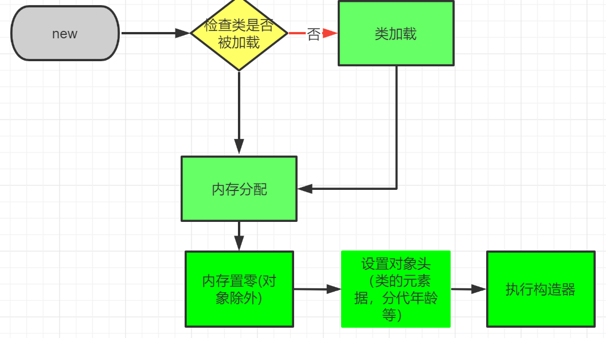
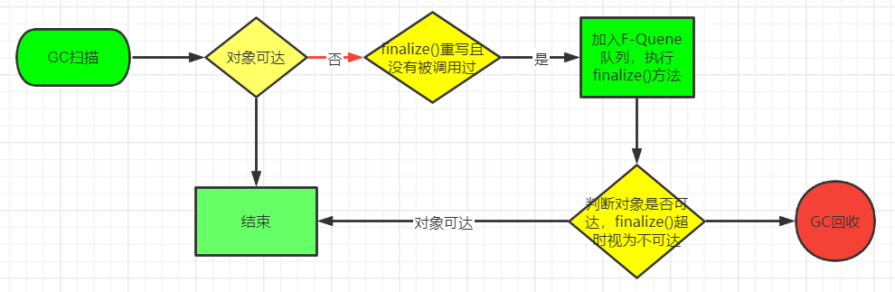
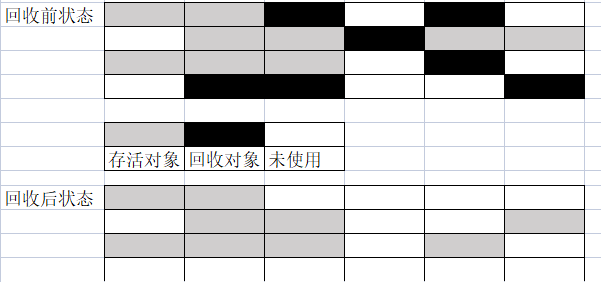
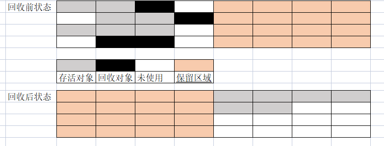
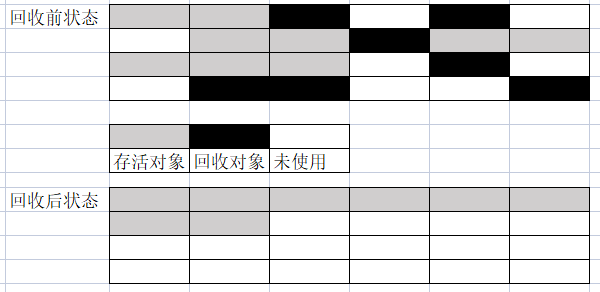

### 深入立即Java虚拟机.第三版 周志明 读书笔记
#### 第一章 走进Java
- 场景：嵌入式终端，移动终端，企业服务器，大型机
- 优点：跨平台，相对安全的内存管理和访问机制，jit，类库
- 组成：Java程序设计语言，各个平台的虚拟机实现，Class文件格式，Java API类库，商业机构和第三方开源类库
- 按服务领域划分的产品线
    - Java Card：支持Java小程序（Applets）运行在小内存设备上的平台
    - Java ME：支持Java程序运行在移动终端上的平台，对Java API有所精简，并加入了对移动终端的针对性支持
    - Java SE：支持面向桌面级的Java应用，提供了完整的Java核心API
    - Java EE：支持使用多层架构的企业应用
- Java发展史
    - 1994.4    James Gosling博士领导的绿色计划开始启动，旨在开发一种能够在各种消费性电子产品(机顶盒，冰箱，收音机等)上运行的程序架构
    - 1995.5.23 Oak更名Java，并在SunWorld大会发布Java1.0版本，提出‘Write Once，Run Anywhere’
    - 1996.1.23 JDK1.0发布，它提供了一个纯解释执行的Java虚拟机实现（Sun Classic VM），包含Java虚拟机，Applet，AWT等
    - 1996.4    十个最主要的操作系统和计算机供应商声明在其产品种嵌入Java技术
    - 1996.5月底 举行首届JavaOne大会
    - 1997.2.19 JDK1.1发布，包含JAR文件格式，JDBC，JavaBeans，RMI等技术，语法改变有内部类，反射等
    - 1998.12.4 JDK1.2发布，它将Java技术体系拆分成J2SE，J2EE，J2ME。此版本的Java虚拟机第一次内置了JIT编译器，语法上新增了strictfp关键字，API增加集合部分
    - 1999.3    发布JDK 1.2.1版本
    - 1999.4.8  jdk从1.1.0迭代到1.1.8
    - 1999.4.27 HotSpot诞生，自JDK1.3起成为默认虚拟机
    - 1999.7    发布JDK 1.2.2版本
    - 2000.5.8  JDK1.3发布
    - 2002.2.13 JDK1.4发布
    - 2004.9.30 JDK5发布
    - 2006.12.11 JDK6发布
    - 2006.11.13 JavaOne大会，SUN决定将Java开源（GPL v2协议）
    - 2009.2.19 JDK7发布
    - 2009.4.20 Oracle以73亿美元收购了最高市值为2000亿美元的SUN公司
    - 2014.3.18 JDK8发布
    - 2017.9.21 JDK9发布
    - 2018.3.20 JDK10发布
    - 2018.3    Oracle决定将Java EE捐赠给Eclipse基金会，更名Jakarta
    - 2018.10   最后一届JavaOne大会
    - 2019.2    RedHat接手OpenJDK8和OpenJDK11的维护
    - 2019.3.20 JDK12发布
    
    
- Java虚拟机家族
    - 虚拟机始祖：Sun Classic/Exact VM
        - 1996.1.23随着JDK1.0发布
        - 纯解释器运行，外挂的即时编译器与解释器无法并存，效率低
        - Exact VM使用准确式内存管理，抛弃了Classic VM基于句柄的对象查找方式，性能有所提升。
    - 武林盟主：HotSpot VM
        - 来源于Longview Technologies公司，最初为Self语言设计，希望能达到C语言50%以上的执行效率，1997年被SUN收购。
    - 小家碧玉：Mobile/Embedded VM，用于JAVA ME/SE，覆盖率低
    - 天下第二：BEA JRockit/IBM J9 VM
    - ...
  
#### 第二章 Java内存区域与内存溢出异常
- 运行时数据区域
    - 程序计数器 Program Counter Register
        - 当前线程(私有)所执行的字节码的行号指示器
        - 如果线程执行Java方法，它保存正在执行的虚拟机字节码指令的地址
        - 如果是native方法，计数器的值为空
    - Java虚拟机栈 Java Virtual Mechine Stack
        - 用于描述Java方法执行的线程内存模型，它属于线程私有，与线程生命周期相同
        - 每个方法执行时，Java虚拟机会同步创建一个栈帧用于存储局部变量表、操作数栈、动态链接、方法出口等信息。
        - 方法执行，就是入栈/出栈过程
        - 局部变量表：存放编译器可知的各种Java虚拟机基本数据类型，对象引用（Reference类型）和returnAddress类型（只想一条字节码指令的地址）
        - 数据在局部变量表以槽的形式存储，long/double占据2个，其余数据占据1个；槽的数量固定，空间不固定
        - 可能抛出StackOverflowError/OutOfMemoryError异常
    - 本地方法栈 Native Method Stacks
        - 只为线程调用本地方法服务，线程私有
    - Java堆 Java Heap
        - 几乎所有的对象示例以及数组都应该在堆上分配，线程共享
        - 垃圾回收的主要区域，大都按照分代收集理论分为Eden、From，To、Old划分
        - 逻辑上连续，物理上基本不连续
    - 方法区 Method Area
        - 用于存储被虚拟机加载的类型信息，常量，静态变量，即使编译器编译后的代码缓存，线程共享
        - 非堆
    - 运行时常量池 Runtime Constant Pool
        - 方法区的一部分
        - 用于存放编译期生成的各种字面量和符号引用
    - 直接内存 Direct Memory
        - JDK 1.4 NIO 引入的一种基于通道和缓存中的IO方式，可以基于Native函数库直接分配堆外内存
    
- 对象的创建
    - 
    - 创建对象的4种方式
        - new关键字
        - 反射
        - 反序列化
        - clone
    - 内存分配策略
        - 指针碰撞
        - 空闲列表
    - 并发安全
        - TLAB Thread Local Allocation Buffer
        - CAS 重试(默认)
- 对象内存布局
    - 对象头
        - Mark Word:存储自身的运行数据，如哈希码，分代年龄，锁标志，线程持有的锁，线程偏向ID，偏向时间戳等
        - 类型指针，即对象指向它类型元数据的指针，Java虚拟机通过它确定该对象是那个类的实例(并非必须)
        - 如果该对象为数组，对象头还需要标记数组长度
    - 实例数据
        - 对象有效信息，及程序代码定义的各种字段的内容，无论是父类继承下来的，还是在子类定义的
        - 顺序受虚拟机分配策略参数 -XX:FieldsAllocationStyle和字段在程序定义顺序的影响
        - HotSpot默认分配顺序是longs/doubles,ints,shorts,chars,bytes/booleans,oops；
        - 上述顺序按照相同宽度字段总是分配到一起存放，如果HotSpot参数-XX:CompactFiles(默认true)值为true，子类较窄的变量也允许插入到父类变量的空隙之间，节省一点空间
    - 对齐填充
        - 并非必然存在
        - HotSpot的自动内存管理系统要求对象起始地址必须是8字节的整数倍，即任意对象的大小都必须是8字节的整数倍（Header已经满足1倍或2倍？？）
        - 如果HotSpot的对象实例数据没有对齐，需要通过对齐填充来补全
- 对象的访问定位（Java虚拟机规范只规定了它是一个指向对象的引用，具体由虚拟机实现）
    - 句柄访问
        - Java堆可能划分一块内存作句柄池，reference存储对象的句柄地址，句柄包含对象实例数据和类型数据的地址
        - 优点：对象移动时，只改变句柄中指向示例数据的指针，不用改变reference引用
    - 直接指针访问
        - Java需要考虑如何放置访问类型数据的相关信息，reference存储的就是对象地址；如果只访问实例数据，可以节省一次寻址定位开销(HotSpot默认)
- 代码实战 见Test项目，package：liufeng.jdk.jvm

#### 第三章 垃圾回收器与内存分配策略
- 对象已死判定
    - 算法
        - 引用计数法
        - 可达性分析算法：选取一系列‘GC Root’根对象作为起始节点集作为起点，按照引用关系向下搜索，搜索路径称为‘引用链’。如果某对象不在引用链，就说该对象不可达。根节点包含：
            - 虚拟机栈引用的对象，如各个线程被调用的方法堆栈使用的参数、局部变量、临时变量等
            - 在方法区中静态属性引用的对象，如Java类的引用类型静态变量
            - 方法区常量引用的对象，如字符串常量池里的引用
            - 本地方法栈中JNI引用的对象
            - Java虚拟机内部的引用，如基本数据类型对应的Class对象，一些常驻异常如NPE、OOM，以及系统类加载器等
            - 所有被同步锁(synchronized)持有的对象
            - 反映Java虚拟机内部情况的JMXBean、JVMTI注册的回调，本地代码缓存等
            - 根据垃圾回收器和回收区域不同，还可能有对象临时加入
    - 引用类型
        - 强引用：程序中普遍存在的引用赋值，即类似‘Object obj = new Object()’关系。只要引用关系还在，就不会GC回收
        - 软引用：用于描述一些还有用，但非必须的对象。在系统发出内存溢出异常之前，会将这些对象回收掉
        - 弱引用：描述非必须对象，但下一次GC一定将对象回收掉
        - 虚引用：最弱的引用关系，为一个对象设置虚引用的唯一目的是为了能在这个对象被收集器回收时收到一个系统通知
    - finalize() 如果系统判定需要执行finalize()，会使用低优先级线程执行，且不保证执行完。效果并不稳定，且不被推荐使用。 
    - 方法区
        - Java虚拟机规范不要求虚拟机实现方法区回收
        - 回收性价比低
        - 内容主要是废弃的常量和不再使用的类型，后者判定比较苛刻，需要同时满足3个条件（大量使用反射、动态代理、CGLib等字节码框架等，需要虚拟机能够类型卸载，释放方法区的内存压力）
            - 该类所有实例被回收，Java堆种不存在该类及其任何派生子类的实例
            - 加载该类的类加载器被回收。(OSGi,JSP很难达成)
            - 该类对应的Class对象没有在任何地方被引用，无法在任何地方通过反射调用该类的方法
            
- 垃圾回收算法
    - 分代收集理论：基于以下假说，Java堆通常被划分为青年代、老年代，并在新生代建一个全局的数据结构将老年代花费为若干小块并标识那一块存在跨代引用。
        - 弱分代假说：绝大多数对象都是朝生夕死的
        - 强分代假说：熬过越多次垃圾收集过程的对象就越难以消亡
        - 跨代引用假说：跨代引用相对于同代引用来说仅占极少数
    - GC行为
        - 部分收集 Partial GC
            - 新生代收集(Minor GC/Young GC):目标只是新生代的收集
            - 老年代收集(Old GC/Major GC)：目标只是老年代的收集
            - 混合收集(Mixed GC)：整个新生代和部分老年代的收集
        - 整堆收集 Full GC
    
    - 标记-清除算法：算法分为2部分，先标记需要回收的对象，标记完成后统一回收掉所有被标记(所有未被标记，按照算法实现来)的对象；
        - 缺点
            - 执行效率不稳定，对着对象数量增长而增长
            - 空间碎片多，容易触发垃圾回收，提高GC频率
    - 标记-复制算法：为了解决标记-清除算法的效率问题，它将内存按容量分为等大的2块，每次只使用一块。没有剩余空间时，将存活对象复制到另一块，清除当前块空间。
        - 缺点
            - 空间利用率低
            - 不适合存活对象多的内存管理
        - 优点
            - 实现简单，运行高效
            - 空间碎片少
        - 使用：Java虚拟器大都采用这种算法回收新生代，新生代划分Eden和2块Survivor空间，HotSpot默认比例为8:1
    - 标记-整理算法：为老年代死亡特征设计，先标记所有对象，将存活对象向内存一端移动，清理掉边界之外的内存。
        - 优点：内存空间连续，便于后续内存分配
        - 缺点：移动对象代价颇大，必须Stop The World。
        - 备注：GMS根据空间碎片化程度，可能用标记-清除算法，或者标记-整理算法
- HotSpot算法实现
    - 根节点枚举
        1. 限制：

 
    
    
#### 第四章 虚拟机性能监控、故障处理工具
- 分类
    - 商业授权工具：主要是JMC(Java Mission Control)和它要使用到的JFR(Java Flight Recorder)
    - 正式支持工具
    - 实验性工具
- jps(JVM Process Status Tool) 虚拟机进程状况工具
    - 功能：可以列出正在运行的虚拟机进程，并显示虚拟机执行主类（Main class， main()函数所在的类）名称以及这些进程的本地虚拟机唯一id(与操作系统pid一致)
    - 格式：jps \[options] \[ hostid]
    - 示例
        - 启动main()方法，主线程一致沉睡，或者一个springboot web项目
        - jps -l
        -  (没有任何输出... )
- jstat(Jvm Statistics Monitoring Tool)虚拟机统计信息监视工具
    - 功能： 用于监视虚拟机各种运行状态信息的命令行工具。它可以显示本地或远程虚拟机进程中的类加载，内存，垃圾收集，即时编译等运行数据是数据
    - 格式： jstat \[options vmid \[interval \[s|ms] \[count]]]
        - vmid 如果是本地虚拟进程，vmid 和lvmid一致；远程vmid格式为：\[protocol:]\[//]lvmid\[@hostname\[:port]/servername]
        - interval代表查询间隔和次数，默认只查询一次
    