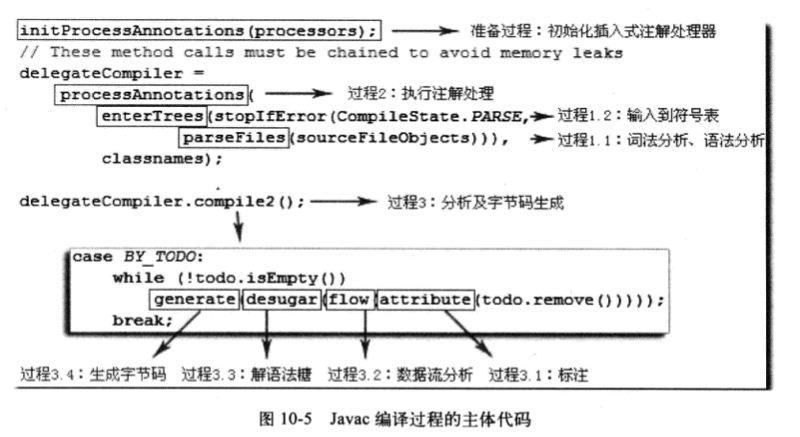

### 深入立即Java虚拟机.第三版 周志明 读书笔记
#### 第一章 走进Java
- 场景：嵌入式终端，移动终端，企业服务器，大型机
- 优点：跨平台，相对安全的内存管理和访问机制，jit，类库
- 组成：Java程序设计语言，各个平台的虚拟机实现，Class文件格式，Java API类库，商业机构和第三方开源类库
- 按服务领域划分的产品线
    - Java Card：支持Java小程序（Applets）运行在小内存设备上的平台
    - Java ME：支持Java程序运行在移动终端上的平台，对Java API有所精简，并加入了对移动终端的针对性支持
    - Java SE：支持面向桌面级的Java应用，提供了完整的Java核心API
    - Java EE：支持使用多层架构的企业应用
- Java发展史
    - 1994.4    James Gosling博士领导的绿色计划开始启动，旨在开发一种能够在各种消费性电子产品(机顶盒，冰箱，收音机等)上运行的程序架构
    - 1995.5.23 Oak更名Java，并在SunWorld大会发布Java1.0版本，提出‘Write Once，Run Anywhere’
    - 1996.1.23 JDK1.0发布，它提供了一个纯解释执行的Java虚拟机实现（Sun Classic VM），包含Java虚拟机，Applet，AWT等
    - 1996.4    十个最主要的操作系统和计算机供应商声明在其产品种嵌入Java技术
    - 1996.5月底 举行首届JavaOne大会
    - 1997.2.19 JDK1.1发布，包含JAR文件格式，JDBC，JavaBeans，RMI等技术，语法改变有内部类，反射等
    - 1998.12.4 JDK1.2发布，它将Java技术体系拆分成J2SE，J2EE，J2ME。此版本的Java虚拟机第一次内置了JIT编译器，语法上新增了strictfp关键字，API增加集合部分
    - 1999.3    发布JDK 1.2.1版本
    - 1999.4.8  jdk从1.1.0迭代到1.1.8
    - 1999.4.27 HotSpot诞生，自JDK1.3起成为默认虚拟机
    - 1999.7    发布JDK 1.2.2版本
    - 2000.5.8  JDK1.3发布
    - 2002.2.13 JDK1.4发布
    - 2004.9.30 JDK5发布
    - 2006.12.11 JDK6发布
    - 2006.11.13 JavaOne大会，SUN决定将Java开源（GPL v2协议）
    - 2009.2.19 JDK7发布
    - 2009.4.20 Oracle以73亿美元收购了最高市值为2000亿美元的SUN公司
    - 2014.3.18 JDK8发布
    - 2017.9.21 JDK9发布
    - 2018.3.20 JDK10发布
    - 2018.3    Oracle决定将Java EE捐赠给Eclipse基金会，更名Jakarta
    - 2018.10   最后一届JavaOne大会
    - 2019.2    RedHat接手OpenJDK8和OpenJDK11的维护
    - 2019.3.20 JDK12发布
    
    
- Java虚拟机家族
    - 虚拟机始祖：Sun Classic/Exact VM
        - 1996.1.23随着JDK1.0发布
        - 纯解释器运行，外挂的即时编译器与解释器无法并存，效率低
        - Exact VM使用准确式内存管理，抛弃了Classic VM基于句柄的对象查找方式，性能有所提升。
    - 武林盟主：HotSpot VM
        - 来源于Longview Technologies公司，最初为Self语言设计，希望能达到C语言50%以上的执行效率，1997年被SUN收购。
    - 小家碧玉：Mobile/Embedded VM，用于JAVA ME/SE，覆盖率低
    - 天下第二：BEA JRockit/IBM J9 VM
    - ...
  
### 第二章 Java内存区域与内存溢出异常
- 运行时数据区域
    - 程序计数器 Program Counter Register
        - 当前线程(私有)所执行的字节码的行号指示器
        - 如果线程执行Java方法，它保存正在执行的虚拟机字节码指令的地址
        - 如果是native方法，计数器的值为空
    - Java虚拟机栈 Java Virtual Mechine Stack
        - 用于描述Java方法执行的线程内存模型，它属于线程私有，与线程生命周期相同
        - 每个方法执行时，Java虚拟机会同步创建一个栈帧用于存储局部变量表、操作数栈、动态链接、方法出口等信息。
        - 方法执行，就是入栈/出栈过程
        - 局部变量表：存放编译器可知的各种Java虚拟机基本数据类型，对象引用（Reference类型）和returnAddress类型（只想一条字节码指令的地址）
        - 数据在局部变量表以槽的形式存储，long/double占据2个，其余数据占据1个；槽的数量固定，空间不固定
        - 可能抛出StackOverflowError/OutOfMemoryError异常
    - 本地方法栈 Native Method Stacks
        - 只为线程调用本地方法服务，线程私有
    - Java堆 Java Heap
        - 几乎所有的对象示例以及数组都应该在堆上分配，线程共享
        - 垃圾回收的主要区域，大都按照分代收集理论分为Eden、From，To、Old划分
        - 逻辑上连续，物理上基本不连续
    - 方法区 Method Area
        - 用于存储被虚拟机加载的类型信息，常量，静态变量，即使编译器编译后的代码缓存，线程共享
        - 非堆
    - 运行时常量池 Runtime Constant Pool
        - 方法区的一部分
        - 用于存放编译期生成的各种字面量和符号引用
    - 直接内存 Direct Memory
        - JDK 1.4 NIO 引入的一种基于通道和缓存中的IO方式，可以基于Native函数库直接分配堆外内存
    
- 对象的创建
    - 
    - 创建对象的4种方式
        - new关键字
        - 反射
        - 反序列化
        - clone
    - 内存分配策略
        - 指针碰撞
        - 空闲列表
    - 并发安全
        - TLAB Thread Local Allocation Buffer
        - CAS 重试(默认)
- 对象内存布局
    - 对象头
        - Mark Word:存储自身的运行数据，如哈希码，分代年龄，锁标志，线程持有的锁，线程偏向ID，偏向时间戳等
        - 类型指针，即对象指向它类型元数据的指针，Java虚拟机通过它确定该对象是那个类的实例(并非必须)
        - 如果该对象为数组，对象头还需要标记数组长度
    - 实例数据
        - 对象有效信息，及程序代码定义的各种字段的内容，无论是父类继承下来的，还是在子类定义的
        - 顺序受虚拟机分配策略参数 -XX:FieldsAllocationStyle和字段在程序定义顺序的影响
        - HotSpot默认分配顺序是longs/doubles,ints,shorts,chars,bytes/booleans,oops；
        - 上述顺序按照相同宽度字段总是分配到一起存放，如果HotSpot参数-XX:CompactFiles(默认true)值为true，子类较窄的变量也允许插入到父类变量的空隙之间，节省一点空间
    - 对齐填充
        - 并非必然存在
        - HotSpot的自动内存管理系统要求对象起始地址必须是8字节的整数倍，即任意对象的大小都必须是8字节的整数倍（Header已经满足1倍或2倍？？）
        - 如果HotSpot的对象实例数据没有对齐，需要通过对齐填充来补全
- 对象的访问定位（Java虚拟机规范只规定了它是一个指向对象的引用，具体由虚拟机实现）
    - 句柄访问
        - Java堆可能划分一块内存作句柄池，reference存储对象的句柄地址，句柄包含对象实例数据和类型数据的地址
        - 优点：对象移动时，只改变句柄中指向示例数据的指针，不用改变reference引用
    - 直接指针访问
        - Java需要考虑如何放置访问类型数据的相关信息，reference存储的就是对象地址；如果只访问实例数据，可以节省一次寻址定位开销(HotSpot默认)
- 代码实战 见Test项目，package：liufeng.jdk.jvm（除compile）

### 第三章 垃圾回收器与内存分配策略
- 对象已死判定
    - 算法
        - 引用计数法
        - 可达性分析算法：选取一系列‘GC Root’根对象作为起始节点集作为起点，按照引用关系向下搜索，搜索路径称为‘引用链’。如果某对象不在引用链，就说该对象不可达。根节点包含：
            - 虚拟机栈引用的对象，如各个线程被调用的方法堆栈使用的参数、局部变量、临时变量等
            - 在方法区中静态属性引用的对象，如Java类的引用类型静态变量
            - 方法区常量引用的对象，如字符串常量池里的引用
            - 本地方法栈中JNI引用的对象
            - Java虚拟机内部的引用，如基本数据类型对应的Class对象，一些常驻异常如NPE、OOM，以及系统类加载器等
            - 所有被同步锁(synchronized)持有的对象
            - 反映Java虚拟机内部情况的JMXBean、JVMTI注册的回调，本地代码缓存等
            - 根据垃圾回收器和回收区域不同，还可能有对象临时加入
    - 引用类型
        - 强引用：程序中普遍存在的引用赋值，即类似‘Object obj = new Object()’关系。只要引用关系还在，就不会GC回收
        - 软引用：用于描述一些还有用，但非必须的对象。在系统发出内存溢出异常之前，会将这些对象回收掉
        - 弱引用：描述非必须对象，但下一次GC一定将对象回收掉
        - 虚引用：最弱的引用关系，为一个对象设置虚引用的唯一目的是为了能在这个对象被收集器回收时收到一个系统通知
    - finalize() 如果系统判定需要执行finalize()，会使用低优先级线程执行，且不保证执行完。效果并不稳定，且不被推荐使用。 
    - 方法区
        - Java虚拟机规范不要求虚拟机实现方法区回收
        - 回收性价比低
        - 内容主要是废弃的常量和不再使用的类型，后者判定比较苛刻，需要同时满足3个条件（大量使用反射、动态代理、CGLib等字节码框架等，需要虚拟机能够类型卸载，释放方法区的内存压力）
            - 该类所有实例被回收，Java堆种不存在该类及其任何派生子类的实例
            - 加载该类的类加载器被回收。(OSGi,JSP很难达成)
            - 该类对应的Class对象没有在任何地方被引用，无法在任何地方通过反射调用该类的方法
            
- 垃圾回收算法
    - 分代收集理论：基于以下假说，Java堆通常被划分为青年代、老年代，并在新生代建一个全局的数据结构将老年代花费为若干小块并标识那一块存在跨代引用。
        - 弱分代假说：绝大多数对象都是朝生夕死的
        - 强分代假说：熬过越多次垃圾收集过程的对象就越难以消亡
        - 跨代引用假说：跨代引用相对于同代引用来说仅占极少数
    - GC行为
        - 部分收集 Partial GC
            - 新生代收集(Minor GC/Young GC):目标只是新生代的收集
            - 老年代收集(Old GC/Major GC)：目标只是老年代的收集
            - 混合收集(Mixed GC)：整个新生代和部分老年代的收集
        - 整堆收集 Full GC
    
    - 标记-清除算法：算法分为2部分，先标记需要回收的对象，标记完成后统一回收掉所有被标记(所有未被标记，按照算法实现来)的对象；
        - 缺点
            - 执行效率不稳定，对着对象数量增长而增长
            - 空间碎片多，容易触发垃圾回收，提高GC频率
    - 标记-复制算法：为了解决标记-清除算法的效率问题，它将内存按容量分为等大的2块，每次只使用一块。没有剩余空间时，将存活对象复制到另一块，清除当前块空间。
        - 缺点
            - 空间利用率低
            - 不适合存活对象多的内存管理
        - 优点
            - 实现简单，运行高效
            - 空间碎片少
        - 使用：Java虚拟器大都采用这种算法回收新生代，新生代划分Eden和2块Survivor空间，HotSpot默认比例为8:1
    - 标记-整理算法：为老年代死亡特征设计，先标记所有对象，将存活对象向内存一端移动，清理掉边界之外的内存。
        - 优点：内存空间连续，便于后续内存分配
        - 缺点：移动对象代价颇大，必须Stop The World。
        - 备注：GMS根据空间碎片化程度，可能用标记-清除算法，或者标记-整理算法
- HotSpot算法实现
    - 根节点枚举 
      - 限制：
    - 根节点
      - 虚拟机栈引用的对象
      - 静态变量
      - JNI引用的对象
      - JVM内部的class对象，一些常驻异常对象，系统类加载器等
- 常见垃圾收集器
  - serial收集器：单线程，用于新生代，使用复制算法；gc时会暂停所有其他工作线程，常用于客户端
  - parNew收集器：serial多线程版本，用于新生代
  - serialOld
  - cms
    - 工作过程
      - 初始标记（STW）
      - 并发标记
      - 重新标记（STW）
      - 并发清除
    - 缺点
      - 内存碎片较多
      - 并发能力依赖于CPU资源
      - 并发清除阶段，用户线程仍在工作，会保留一些对象到下一次GC
    - 优点
      - 最耗时的并发标记和并发清除阶段不需要STW，整体回收是低停顿的
  - g1
    - 分区布局：
      - 不沿用新生代+存活区+老年代+持久区，将内存氛围多个大小相同的region，每个region拥有各自不同的分代属性
      - 每个region维护一个rememberedSet，用于记录对象的引用情况
    - 两种GC模式
      - Young GC：关注所有年轻代的region，通过控制收集年轻代的region个数，从而控制gc回收时间
      - Mixed GC：关注于所有年轻代的region，并且加上通过预测计算最大收益的若干个老年代region
    - 什么时候进入老年代
      - 年龄>=15(g1 6,parNew 15)
      - survivor超过50%
      - 超过单个region的50%
  - zgc（Zero Paused GC）
    - 新增技术
      - 着色指针
        - 只支持64位系统
        - 64bit指针=18bit空闲+4bit状态+42位对象指针(jdk11只支持4T，jdk13将对象指针改成44位，最大16T)
        - 4bit状态:m0,m1,remapped,finalizable
      - 读屏障
      - 单代模型（可能分冷热对象）
      - NUMA
    - 设计目标
      - 单次回收10ms以下
      - gc时间不随着内存大小增长

 
    
    
#### 第四章 虚拟机性能监控、故障处理工具
- 分类
    - 商业授权工具：主要是JMC(Java Mission Control)和它要使用到的JFR(Java Flight Recorder)
    - 正式支持工具
    - 实验性工具
- jps(JVM Process Status Tool) 虚拟机进程状况工具
    - 功能：可以列出正在运行的虚拟机进程，并显示虚拟机执行主类（Main class， main()函数所在的类）名称以及这些进程的本地虚拟机唯一id(与操作系统pid一致)
    - 格式：jps \[options] \[ hostid]
    - 示例
        - 启动main()方法，主线程一直沉睡，或者一个springboot web项目
        - jps -l
        -  (没有任何输出... )
- jstat(Jvm Statistics Monitoring Tool)虚拟机统计信息监视工具
    - 功能： 用于监视虚拟机各种运行状态信息的命令行工具。它可以显示本地或远程虚拟机进程中的类加载，内存，垃圾收集，即时编译等运行数据是数据
    - 格式： jstat \[options vmid \[interval \[s|ms] \[count]]]
        - vmid 如果是本地虚拟进程，vmid 和lvmid一致；远程vmid格式为：\[protocol:]\[//]lvmid\[@hostname\[:port]/servername]
        - interval代表查询间隔和次数，默认只查询一次
- jmap：可以获取dump文件，还可以查询finalize执行队列，Java堆和永久代的详细信息，如空间使用率、当时用的是那种收集器等
- jhat：java虚拟机自带的一种虚拟机堆转储快照分析工具，jdk10删除
- jstack：用于生成java虚拟机当前时刻的线程快照
- jinfo：是java虚拟机自带的Java配置信息工具，可以实时地查看和调整虚拟机的各项参数
    

### 第六章 类文件结构
- 概述 
- 无关性的基石 
- 类文件结构
  - 描述：Class文件是一组以8位字节位基础单位的二进制流，各个数据项目严格按照顺序紧凑的排列在Class文件之中，中间没有添加任何分隔符。当遇到需要占用8位字节以上空间的数据项时，会按照高位在前的方式分割成若干个9位字节进行存储
  - Class文件格式：类似C语言结构的伪结构，只有2中数据类型，无符号数和表
    - 无符号数可以用来描述数字、索引引用、数量值，或按照UTF8编码构成字符串值
    - 表由多个无符号数或其他表为数据项构成的复合数据类型，所有表都习惯以"_info"结尾。表用于描述有层次关系的复合结构的数据，整个class文件的本质就是一张表
  - class文件结构
    - 魔数 u4
    - 副版本号 u2
    - 主版本号 u2
    - 常量池数量：u2.常量池中常量的数量，从1开始，实际数量需要减1；第0项常量空出来，表示"不引用任何一个常量池项目"
    - 常量池 不定长度
      - 内容：主要存放两大类常量
        - 字面量：比较接近Java语言层面的常量概念，如文本字符串、被声明为final的常量值等
        - 符号引用：属于编译原理方面的概念，包含3类常量
          - 类和接口的全限定名
          - 字段的名称和描述
          - 方法的名称和描述 
      - 结构：常量池每一项常量都是一个表，共有11种结构不同的表结构数据。它们有一个共同特点，表开始的第一位是一个u1类型的标志位
        - 常量池表项
        - UTF-8编码的字符串：使用了UTF-8缩略编码。length用u2表示，最大值为65535。因为Class文件中方法、字段都引用UTF-8_info表示，所以java中方法和字段名的最大长度也为65536
    - 访问标识 u2
    - 当前类 u2，指向常量池的一个class引用
    - 父类 u2，指向常量池的一个class引用
    - 接口数 u2
    - 接口列表 n个指向常量池的一个class引用
    - 字段数 u2
    - 字段表集合 不定长度（不会列出从超类或接口继承而来的字段，但有可能列出原本java代码不存在的字段，如内部类包含了对外部类示例的引用。注：java中变量不能重名，字节码可以接收）
      - 访问标识 u2
      - 名称 u2
      - 描述符 u2
        - byte B 
        - char C
        - double D
        - float F
        - int I
        - long J
        - short S
        - boolean Z
        - void V
        - 对象 L+对象全限定名+;，如Object表示为"Ljava/lang/Object;"（;作为分隔符防止多个连续的）
        - 数组 每个维度会使用前置的[来表示，如java.long.String[][]表示为[[Ljava/lang/String;，int[]表示为[]=I
        - 备注：按照描述符描述方法时，先参数列表，再返回值，参数列表按照参数的严格顺序放在一组小括号()内。
          - 示例1：如void inc()表示为()V
          - 示例2：如
      - 属性count u2
      - 属性列表 不定长度
    - 方法表集合 
      - 访问标识 u2
      - 名称 u2
      - 描述符 u2
      - 属性count u2
      - 属性列表 不定长度
    - 属性表：限制稍微宽松，只要不与已有的属性名重复，任何编译器都可以向属性表写入自定义的属性信息。Java虚拟机运行时会忽略它不认识的属性
      - Java虚拟机规范定义了9项虚拟机实现应当能识别的属性
        - 9个属性表属性
        - JDK1.5 和JDK1.6添加的属性
        - Code
          - attribute_name_index
          - attribute_length:整个属性表-6（2+4）
          - max_stack:操作数栈深度的最大值。方法执行的任何时刻，操作数栈都不会超过这个深度。虚拟机运行时需要根据这个值来分配栈帧中的操作栈深度
          - max_locals：局部变量所需的存储空间。单位是Slot，对于byte、char、float、int、short、boolean、reference和returnAddress等长度不超过32位的数据类型占用一个Slot，long、double占用2个Slot。方法参数、显示异常处理器的参数、方法体的局部变量也需要使用局部变量表来存放
          - code_length、code：存储java源代码编译成的字节码指令。每条指令是u1类型，最多256条指令。要根据指令类型判断是否需要跟随参数、参数应该如何理解。虽然code_length是u4字节，但Java虚拟机规范限制了一个方法不允许超过65535条指令（复杂的JSP可能编译失败）
          - 
          - 异常表
            - u2 start_pc
            - u2 end_pc
            - u2 handler_pc
            - u2 catch_type
        - Exceptions：列出方法中可能抛出的受检查异常
          - u2 attribute_name_index
          - u4 attribute_length
          - u2 number_of_exceptions
          - u2 exception_index_table(number_of_exceptions，指向常量池的class)
        - LineNumberTable:用于描述Java源码行号和字节码行号的对应关系，并非必须属性，可用-g:none或-g:lines来取消或生成。如果不生成，程序抛出异常时，堆栈中将不会显示出错的行号，且调试程序时无法按源码设置断点
          - u2 attribute_name_index
          - u2 attribute_length
          - u2 line_number_table_length
          - 变长 line_number_table(line_number_table_length)
            - u2 start_pc 字节码行号
            - u2 line_number Java源码行号
        - LocalVariableTable：描述栈帧中局部变量表和Java源码中定义的变量的关系，并非必须属性，默认不生成。可使用-g:none或-g:vars来取消或生成。如果不生成，最大的影响是，当其他人引用这个方法时，所有的参数名称将丢失，IDE可能会使用arg0、arg1来代替，给代码编写
          - u2 attribute_name_index
          - u2 attribute_length
          - u2 local_variable_table_length
          - 变长 local_variable_table(local_variable_table_length)
            - u2 start_pc：和length分别代表了这个局部变量的生命周期开始的字节码偏移量及其作用范围覆盖的长度
            - u2 length
            - u2 name_index：常量池utf8
            - u2 descriptor_index：常量池utf8
            - u2 index：这个局部变量在栈帧局部变量表中Slot的位置
        - LocalVariableTypeTable：和局部变量表类似，在JDK1.5之后引入，仅仅是把descriptor_index换成了字段的特征签名。对于非泛型是相同的，泛型因为类型被擦除，描述符不能准确的描述它，从而使用type表
        - SourceFile：记录生成这个class文件的源码文件名称。非必须，可使用-g:none或-g:source来取消或生成。大多数时候，类名和文件一样，但内部类这种特殊情况，在不生成此属性且抛出异常时，堆栈中将不会显示出错误代码所属的文件名
          - u2 attribute_name_index
          - u2 attribute_length
          - u2 sourcefile_index:常量池utf8
        - ConstantValue：通知虚拟机自动为静态变量赋值，只有被static关键字修饰的变量才可以使用这项属性。
          - 结构
            - u2 attribute_name_index
            - u2 attribute_length
            - u2 constantvalue_index：指向常量池一个字面量的引用，只能是8个基础类型或者String
          - 初始化时机
            - int i = 123;// 在构造器<init>初始化
            - static int i = 123; // 在类构造器<cinit>()或使用ConstantValue赋值。对于Sun javac编译器，如果同时用final、static修饰的基础类型或String，使用ConstantValue赋值，其他使用<cinit>()
        - InnerClasses
          - u2 attribute_name_index
          - u2 attribute_length
          - u2 numbers_of_classes
          - 变长 inner_classes(numbers_of_classes)
            - u2 inner_class_info_index：指向常量池 constant_class_info
            - u2 outer_class_info_index：指向常量池 constant_class_info
            - u2 inner_name_index：指向常量池 utf8（如果是匿名内部类，值为0）
            - u2 inner_class_access_flags：类访问标识
        - Deprecated及Synthetic属性：都是布尔类型的标志，只存在有或者没有
          - u2 attribute_name_index
          - u4 attribute_length ，值必须为0x00000000，因为没有任何属性值需要设置

### 虚拟机类加载机制
- 概述
  - 类型的家在和连接过程都是在程序运行期间完成，虽然会增加一些性能开销，但却能为java应用程序提供高度的灵活性。Java天生可以动态扩展的语言特性就是依赖于运行期动态加载和动态连接这个特点实现的
  - 每个class文件都可能代表Java语言中的一个类或接口，在下文中，如果指定类、或指定接口，会特别指明
  - class文件并非指存在磁盘上的某个文件，而是一串二进制字节流，无论以任何形式存在都可以，如zip、jar、war、网络、动态代理生成、其他文件生成如jsp、从数据库读取
  - 生命周期：加载、验证、准备、解析、初始化、使用、卸载
- 类加载的时机
  - 虚拟机规范指定有且只有4种情况下必须对类初始化
    - 遇到new、getstatic、putstatic、invikestatic这4条字节码指令时，如果类没有初始化，则需要先触发起初始化。4条指令对应场景是：new关键字创建对象，读取或设置静态字段（被final修饰、已在编译期将结果放入常量池的静态字段除外），以及调用类静态方法
    - 使用java.lang.reflect包的方法对类进行发射调用的时候，如果类没有初始化，则需要先触发起初始化
    - 当初始化一个类的时候，如果发现其父类还没有初始化，则需要先触发其父类的初始化
    - 当虚拟机启动时，用户需要指定一个要执行的主类，虚拟机会先初始化这个主类
  - 被动引用不会触发类初始化
    - 通过子类引用父类的静态字段，不会导致子类初始化
    - 通过数组定义来引用类，不会触发此类的初始化
    - 常量引用
  - 接口加载与类的区别：第3种情况下，接口在初始化时，不会要求其父接口初始化，只有真正使用到父接口的时候才会初始化。注：接口仍然有<cinit>()
- 类加载的过程（加载、验证、准备、解析、初始化）
  - 加载
    - 通过一个类的全限定名来获取定义此类的二进制字节流
    - 将这个字节流所代表的静态存储结构转化为方法区的运行时数据结构
    - 在java堆中生成一个代表着个类的java.lang.Class对象，作为方法区这些数据的访问入口
  - 验证
    - 文件格式验证：魔数、版本号、常量类型是否支持、指向常量的索引和对应类型、utf8是否包含不符合编码的数据、class文件各部分及文件是否有被删除或附加的其他信息
    - 元数据验证：是否有父类、是否继承了final类、是否实现了父类和接口要求的方法、字段和方法是否与父类冲突
    - 字节码验证：类型检查（方法体的Code属性增加了StackMapTable属性，记录方法提中所有基本块开始时本地变量表和操作栈应有的状态）
    - 符号引用验证：通过全限定名是否找到对应class、符号引用的类以及方法字段是否可访问...实施过程中可使用-Xverify:none关闭
  - 准备：正式为类变量分配内存并设置类变量初始值的阶段，这些内存都在方法区进行分配
    - 示例 public static int value =123;// 准备阶段后初始值为0，赋值为123的putstatic指令是程序被编译后，存放在类构造器<cinit>()中，在初始化阶段才会被执行
    - 示例 public static final int value =123;//准备阶段使用ConstantValue赋值
  - 解析：虚拟机将常量池内的符号引用替换为直接引用的过程
    - 符号引用：以一组符号来描述所引用的目标，可以是任何形式的字面量，只要使用时无歧义的定位到目标即可。符号引用与内存布局无关，引用的目标并不一定已经加载到内存中
    - 直接引用：可以是直接指向目标的指针、相对偏移量或是一个能间接定位到目标的句柄。直接引用与虚拟机实现的内存布局相关，同一个符号引用在不同虚拟机翻译出来的直接引用一般不会相同。如果有了直接引用，那引用目标必定已经在内存中存在
    - 解析时机：虚拟机没有规定解析阶段发生的具体时间，只要求在执行anewarray、checkcast、getfield、getstatic、instanceof、invokeinterface、invokestatic、invokevirtual、multianewarray、new、putfield、putstatic这13个用于操作符号引用的字节码之前先对他们所使用的符号引用进行解析。第一次解析成功会缓存，失败会缓存异常
    - 4类符号引用解析
      - 类或接口的解析
        - 假设当前代码所处的类为D，需将一个从未解析过的符号引用N解析为一个类或接口C的直接引用，会经历3个步骤
        - 如果C不是一个数组类型，虚拟机会把代表N的全限定名传递给D的类加载起去加载这个类C。在加载过程中，由于无数据验证、字节码验证的需要，可能会触发其他相关类的加载动作，如加载父类。一旦加载过程出现了任何异常，解析过程将宣告失败
        - 如果C是一个数组类型，并且数据元素类型为对象，则会按照上一步的规则加载数组元素类型，接着由虚拟机生成一个代表此数组维度和元素的数组对象
        - 如果上述步骤没有出现任何异常，那么C在虚拟机中已经成为有效的类或接口，但在解析完成之前还要进行符号引用验证，确认C是否具备对D的访问权限，不具有则抛出IllegalAccessError
      - 字段解析
        - 对字段表内class_index搜索对应的符号引用。如果解析类或接口出现任何异常都会导致字段解析失败，解析成功后使用C表示，虚拟机规范要求按如下步骤对C进行后续字段的搜索
        - 如果C包含了简单名称和字段描述符都与目标相匹配的字段，则返回这个字段的直接引用，查找结束
        - 否则，如果C实现了接口，则会按照继承关系从上往下递归搜索各个接口和它的父接口。如果接口包含了简单名称和字段描述符都与目标相匹配的字段，则返回这个字段的直接引用，查找结束
        - 否则，如果C不是java.lang.Object，则会按照继承关系从上往下递归搜索其父类，如果父类包含了简单名称和字段描素福都与目标相匹配的字段，则返回这个字段的符号引用，查找结束
        - 否则，查找失败，跑出java.lang.NoSuchFieldError异常
      - 类方法解析
        - 类似字段解析，首先找出方法所属的类或接口的符号引用
        - 如果C是接口，直接跑出java.lang.IncompatibleClassChangeError
        - 如果通过第一步，在类C中查找是否有简单名称和描述符都与目标相匹配的方法，有则返回引用，查找结束
        - 否则，在C的父类中递归查找，有则返回引用，查找结束
        - 否则，在类C实现的接口列表和父接口查找是否有简单名称和描述都匹配的方法。如果存在，说明C是一个抽象类，抛出java.lang.AbstractMethodError异常
        - 否则，抛出java.lang.NoSuchMethodError
        - 如果查找成功返回，将会对这个方法进行权限验证。如果不具备对此方法的访问权限，抛出IllegalAccessError
      - 接口方法解析
        - 类似字段解析，首先查找接口或类的符号引用C
        - 如果C是一个类而不是接口，抛出java.lang.IncompatibleClassChangeError
        - 否则，在接口C查找此方法，有则返回引用，查找结束
        - 否则，在C的父接口递归查找，直到java.lang.Object，有则返回引用，查找结束
        - 否则，抛出java.lang.NoSuchMethodError
  - 初始化：是执行类构造器<cinit>()方法的阶段
    - <cinit>()方法
      - <cinit>()方法是由编译器自动收集类中所有类变量的赋值动作和静态代码块中的语句合并产生的。编译器收集的顺序由语句在源文件中出现的顺序所决定，静态代码块只能访问到定义在静态代码块之前的变量。定义在它之后的变量，在静态代码块中可以赋值，但不能访问
      - <cinit>()与<init>不同，无需显示的调用父类构造器，虚拟机会保证子类的<cinit>()执行之前，父类的<cinit>()已经执行完成。因此虚拟机中第一个执行<cinit>()的类是Object
      - 由于父类的<cinit>()先执行，也就意味着父类中定义的静态代码块优先于子类的变量赋值操作
      - <cinit>()对于类或接口来说并不是必须的，如果一个类中没有静态代码块，也没有对变量的赋值语句，编译器就可以不为这个类生成<cinit>()方法
      - 接口中不能使用静态代码块，但仍然可能有变量初始化的赋值操作。但接口和接口实现类在初始化时不会执行父接口的<cinit>()方法
      - 虚拟机会保证一个类<cinit>()是线程安全的。如果一个类的<cinit>()有耗时很长的操作，可能会造成多个进程阻塞
- 类加载器
  - 功能：通过一个类的全限定名来获取描述此类的二进制字节流
  - 类与类加载器
    - 对于任意一个类，都需要由加载它的类加载起和这个类本身一同确立其在java虚拟机的唯一性，即只有2个类由同一个类加载器加载的前提下才有意义，否则即使这两个类来源于同一个class文件，只要类加载器不同，这两个类就必定不相等
  - 双亲委派模型
    - 从虚拟机角度分类
      - 启动类加载器 Bootstrap ClassLoader，使用C++实现，是虚拟机自身的一部分
      - 所有其他类加载器，由Java语言实现，独立于虚拟机外部，继承自抽奖类java.lang.ClassLoader
    - 从Java开发人员分类
      - 启动类加载器，扶着加载/JAVA_HOME/lib目录或-Xbootclasspath参数指定路径中，且被虚拟机识别的（仅按照文件名识别）类库加载到虚拟机内存中。启动类加载器无法被Java程序直接引用
      - 扩展类加载器 Extension ClassLoader：由sun.misc.Launcher$ExtClassLoader实现，加载/JAVA_HOME/lib/ext目录，或者被java.ext.dirs系统变量所指定的路径中的所有类库，开发者可以直接用扩展类加载器
      - 应用程序类加载器 Application ClassLoader，由sun.misc.Launcher$AppClassLoader。由于这个类加载器是ClassLoader中的getSystemClassLoader()返回值，也称为系统类加载器。它负责加载用户类路径指定的类库。开发可以直接使用这个类加载器，一般情况下这个就是程序中默认的类加载器
    - 工作过程：如果一个类收到了类加载的请求，它首先不会尝试加载这个类，而是把请求委派给父类加载器完成，直到顶层的启动类加载器。当父加载器反馈无法加载请求（搜索范围没有这个类）时，子加载器才会尝试自己区加载
    - 破坏双亲委派模型
      - 双亲委派模型出现在JDK1.2，为了兼容用户自定义类加载器，java.lang.ClassLoader新增了projected方法findClass()，重写此方法是推荐的自定义类加载器的写法，符合双亲委派模型
      - 基础类可能回调自定义代码，所有的SPI都使用了这种模式，如JNDI、JDBC
      - 由于用户对程序动态画的追求导致，如代码热替换、代码热部署。如OSGi，关键在于自定义类加载器机制的实现，每个程序模块都有一个自己的类加载器，当更换模块时，就把模块连同类加载器一起换掉
        - 在OSGi中，类加载器不再是双亲委派模型的树状结构，而是网状结构。当收到类加载请求时，OSGi将按照一定顺序进行类搜索（前2点符合双亲委派模型）
        - 如果是java.*开头的类，委派给父类加载器加载
        - 否则，将委派列表名单内的类，委派给父类加载器加载
        - 否则，将Import列表中的类，委派给Export这个类的模块的类加载器加载
        - 否则，查找当前模块的ClassPath，使用自己的类加载器加载
        - 否则，查找类是否在自己的Fragment Bundle中，如果在，则委派给Fragment Bundle的类加载器加载
        - 否则，查找Dynamic Import列表的Bundle，委派给对应模块的类加载器加载
        - 否则，类查找失败

### 虚拟机字节码执行引擎
- 概述
  - 物理机：执行引擎是直接建立在处理器、硬件、指令集和操作系统层面上的
  - 虚拟机：执行引擎是自己实现的，可以自行指定指令集与执行引擎的结构体系，并且能够执行哪些不被硬件直接支持的指令集格式
  - Java虚拟机规范制定了虚拟机字节码执行引擎的概念模型，但对于不同实现的虚拟机，执行引擎可能有解释执行、编译执行两种选择，也可能兼备，甚至还可能包含几个不同级别的编译器执行引擎
- 运行时栈帧结构
  - 栈帧
    - 适用于支持虚拟机进行方法调用和方法执行的数据结构，是虚拟机运行时数据区域的虚拟机栈的栈元素
    - 栈帧存储了方法的局部变量表、操作数栈、动态链接和方法返回地址等信息。每一个方法从调用开始到执行完成的过程，就对应一个栈帧在虚拟机栈里面从入栈到出栈的过程
    - 一个线程中的方法调用链路可能会很长，很多方法同时处于执行状态。对于执行引擎来讲，只有栈顶的栈帧是有效的，称为当前栈，这个栈帧所关联的方法称为当前方法。
    - 栈帧结构
  - 局部变量表
    - 是一组变量值存储空间，用于存放方法参数和方法内部定义的局部变量。容量在Java程序编译成Class文件时存储在max_locals数据项
    - 局部变量必须赋值才能使用，不像类变量和实例变量
    - 示例：liufeng.jdk.jvm.ma.LocalVariableTest
  - 操作数栈
    - 当一个方法开始执行的时候，这个方法的操作数栈是空的，在方法执行过程中，会有各种字节码指令向操作数栈中写入和提取内容
    - 操作数栈元素的数据类型必须与字节码指令的序列严格匹配（编译器编译时保证，在类校验阶段还会再校验一次）
    - 在概念模型中，两个栈帧作为虚拟机栈的元素相互之间是独立的，但是大多数虚拟机的实现都会做一些优化处理，令2个栈帧出现一部分重叠，重叠部分数据共享，而不需额外的参数复制传递
  - 动态连接
    - 静态解析：Class文件的常量池中存有大量的符号引用，字节码中的方法调用指令就以常量池指向方法的符号引用作为参数，这些符号引用一部分会在类加载阶段或第一次使用时转为直接饮用
    - 动态连接：一部分符号引用将在每一次的运行期间转化为直接引用
  - 方法返回地址
    - 方法执行后，有2中退出方式
      - 正常完成出口：执行引擎遇到任何一个方法返回的字节码指令。退出后，栈帧可能保存一些信息，用于帮助恢复它的上层方法的执行状态。
      - 异常完成出口：方法执行遇到异常，且没有在方法体内得到处理。退出后，返回地址通过异常表处理，栈帧一般不会保存正常完成保存的额外信息
    - 方法退出的过程等同于把当前栈帧出栈，退出后可能执行的操作有：恢复上层方法的局部变量表和操作数栈，把返回值（如果存在）压入栈帧的操作数栈中，调整PC指向下一条指令等
  - 附加信息：虚拟机规范允许虚拟机实现增加一些规范没有的描述信息到栈帧中，如调试信息。在世界开发中，一般会吧动态连接、方法返回地址与其他附加信息全部归为1类，称为栈帧信息
- 方法调用
  - 描述：确定被调用方法的版本，不涉及方法内部的具体运行过程。因为Class文件编译不包含连接步骤，一切方法调用在Class文件存储的都是符号引用，而不是方法在实际运行内存布局的入口地址。这个特性带来了动态扩展能力，但是的调用更复杂，需要在类加载甚至运行期间才能确定目标方法的直接引用
  - 解析：符合"编译器已知，运行期不可变"的方法主要静态方法和似有方法，与之相对应，java提供了4中方法调用字节码指令
    - invokestatic：调用静态方法
    - invokespecial：调用实例构造器<init>()方法、私有方法、父类方法
    - invokevirtual：调用所有虚方法（除final方法）
    - invokeinterface：调用接口方法，会在运行时再确定一个实现此接口的对象
  - 分派
    - 静态分派：依赖于静态类型（静态类型：形参的类型，编译器已知；实际类型：实参的类型）来定位方法执行版本的分派动作
    - 动态分派：
    - 单分派与多分派：单分派是根据一个宗量对目标方法进行选择，多分派则是根据多于一个的总量对目标进行选择
    - 虚拟机动态分派的实现
      - 为类在方法区建立一个虚方法表，代替元数据查找以提高性能（与此对应，invokeinterface执行时也会用到接口方法表）
      - 虚方法表存放着各个方法的实际入口地址，如果某个方法在子类没有重写，则入口地址与父类相同；如果重写，则指向子类实现版本的入口地址
      - 为了程序实现上的方便，具有相同签名的方法，在父类、子类的虚方法表中都应当具有一样的索引序号。当类型转换时，仅需要查找变更的方法表，从相同索引找到所需的入口地址
      - 方法表一般在类加载的连接阶段进行初始化，在类的变量初始化之后完成
      - 除了上述"稳定优化"的手段，在条件允许的情况下，还可能用"内联缓存"、给予"类型继承关系分析"技术来优化性能
- 基于栈的字节码解释执行引擎
  - 解释执行
  - 基于栈的指令集与基于寄存器的指令集
    - java编译器输出的指令流，基本上是一种基于栈的指令集架构，指令流里面的大部分都是零地址指令，它们依赖于操作数栈进行工作
      - 可移植性
      - 代码更紧凑（多地址需要存放参数）
      - 编译器实现更简单（不需要考虑空间分配问题）
      - 执行速度相对慢一些
      - 实现同样功能指令数量比寄存器更多
      - 栈实现在内存中，内存比CPU速度慢很多
    - 基于寄存器的指令集（是计算机CPU指令集）经典代表是x86的二地址指令集
  - 基于栈的解释器执行过程

### 类加载及执行子系统的案例与实战
- 案例1：Tomcat 正统的类加载器架构
  - web服务器应该解决的问题
    - 部署在同一个服务器上的两个web应用程序所使用的Java类库可以实现相互隔离
    - 部署在同一个服务器上的两个web引用程序所使用的Java类库可以互相共享
    - 服务器需要尽可能保证自身的安全不受部署的web应用程序影响（服务器使用的类库应该与应用程序的类库独立）
    - 支持JSP应用的服务器，十有八九都需要支持HotSwap功能
  - Tomcat 类库目录和类加载器规划
    - /common/*：可以被Tomcat和所有web应用程序共同使用，对应 CommonClassLoader
    - /server/*：可以被Tomcat使用，对Web应用程序不可见，对应 CatalinaClassLoader
    - /shared/*：类库可以被web应用程序使用，对Tomcat不可见，对应 SharedClassLoader
    - /WEB-INF/*：类库仅对此web程序可用，对Tomcat和其他web程序不可见，对应WebappClassLoader
    - JasperLoader：加载范围仅仅是这个JSP文件所编译的Class，它出现的目的就是为了被丢弃，当服务器监测到jsp文件被修改时，会替换掉目前的Jasperloader实例，并新建一个Jsp类加载器来实现JSP文件的HotSwap功能
    - Tomcat 类加载器结构
- 案例2：OSGi（Open Service Gateway Initiative） 灵活的类加载器结构
  - OSGi概述
    - 是一个基于Java语言的动态模块规范，目的是使服务提供商通过住宅网关为各种家用智能设备提供各种服务
    - OSGi中每个模块（Bundle）与普通java类库区别并不大，通常以JAR封装，内部存储的是Java Package和Class，但Bundle可以声明它所依赖的Java Package，也可以声明它允许到处发布的Java Package
    - Bundle的依赖关系从传统的上级依赖底层转为平级模块之间的依赖，而且类库的可见行得到了非常精确的控制，只有被Export的Package才可以被访问
    - OSGi可以实现模块级的热插拔功能
  - 缺点：带来了线程死锁和内存泄漏的风险
- 案例3 字节码生成技术和动态代理的实现
- 案例4 Retrotranslator 跨越JDK版本：将JDK1.5编译出来的Class文件转为可以在JDK1.4或JDK1.3上部署的版本
- 实战：实现远程执行功能
  - 目标
    - 不依赖JDK版本，JDK1.4-JDK1.8都能运行
    - 不改变原有服务端程序的部署，不依赖任何第三方类库
    - 不侵入原有程序，即无需改动原程序的任何代码，也不会对原程序的运行带来任何影响
    - 临时代码需要直接支持java语言
    - 临时代码应当具有足够的自由度，不需要依赖特定的类或特定的接口（服务端程序使用的依赖，临时代码都能直接引用）
    - 临时代码的执行结果能返回客户端，执行结果可以包含程序输出的信息及抛出的异常等
  - 思路
    - 如何编译提交到服务器的java代码
      - 使用tools.jar包，在SUN JDK/lib目录下，使用com.sun.tools.javac.Main编译
      - 客户端编译好，将字节码传到服务端
    - 如何执行编译后的java代码
      - 使用类加载器加载文件生成Class对象，使用反射调用
    - 如何收集执行java代码的结果
      - 将System.out的符号引用替换为我们准备的PrintStream
  - 实现
    - 定义类加载器HotSwapClassLoader
    - 定义输出类HackSystem，除了几个输入输出的方法，其他都调用System的方法
    - 定义ClassModifier，将指定class对象对System的符号引用改成对HackSystem的引用
    - 定义JavaClassExecutor，完成类加载，利用反射调用

### 早期（编译器）优化
- 概述
  - 前端编译器：将java文件转变为class文件，如Sun的Javac、Eclipse JDT中的增量式编译器ECJ。新生的Java语法特性，大都是靠编译器的语法糖实现的
  - 后端运行期编译器（JIT）：将字节码转变为机器码的过程，如HotSpot VM的C1、C2编译器。性能优化主要在这个阶段，为了能让其他的运行于JVM的语言也能获得编译器优化的好处
  - 静态提前编译器（AOT）：提前将java文件编译成本地机器码，如GCJ（GNU compiler for java）、Excelsior JET
- Javac编译器（使用java语言编写）
  - javac源码与调试
    - 目录：JDK_SRC_HOME/langtools/src/share/classes/com/sun/tools/javac
  - 编译过程
    - 解析与填充符号表过程
    - 插入式注解处理器的注解处理过程
    - 分析与字节码生成过程
    - com.sun.tools.javac.main.JavaCompiler编译过程主要代码
  - 解析与填充符号表
    - 词法、语法分析
      - 词法分析是将源代码的字符流转变为标记（Token）集合，单个字符是程序编写过程的最小元素，而标记是编译过程的最小元素。关键字、变量名、字面量和运算符都可以成为标记
      - 词法分析由com.sun.tools.javac.parser.Scanner实现
      - 此法分析是根据token序列来构造抽象语法树AST的过程过程，AST是一种描述程序代码语法结构的树形表示方式，语法树的每一个节点都代表着程序代码中的一个语法结构，如包、类型、修饰符、运算符、返回值、甚至是代码注释
      - 语法分析由com.sun.tools.javac.parser.Parser实现，具体结构由com.sun.tools.javac.tree.JCTree类表示
      - 
    - 填充符号表
  - 注解处理器
    - jdk1.5提供了对注解的支持
    - jdk1.6实现了JSR-269规范，提供了一组插入式注解处理器的标准API在编译期间对注解进行处理，可以读取、修改、添加抽象语法树的任意元素
    - javac中，插入式注解处理器的初始化过程在initProcessAnnotations()方法中完成，而它的执行过程在processAnnotations()中
  - 语义分析与字节码生成
    - 标注检查（com.sun.tools.javac.comp.Attr,com.sun.tools.javac.comp.Check）
      - 常量折叠，如int a = 1 + 2;经过常量折叠后，1 + 2会被折叠为字面量3
    - 数据及控制流分析（com.sun.tools.javac.comp.Flow）
    - 解语法糖（com.sun.tools.javac.comp.TransTypes,com.sun.tools.javac.comp.Lower）
    - 字节码生成（com.sun.tools.javac.jvm.Gen）
- Java 语法糖的味道
  - 泛型与类型擦除
    - C#的泛型在系统运行期生成，有自己的虚方法表和类型数据，这种实现称为类型膨胀，基于这种方法实现的泛型称为真实泛型
    - Java在编译后已经被替换为原声类型，并在相应地方加入了强制转型代码，这种实现类型擦除，基于这种方法实现的泛型称为真实泛型
  - 自动装箱、拆箱与遍历循环：== 运算在没有遇到算数运算的情况下，不会自动拆箱，equals()不会处理数据转型
  - 条件编译：
- 实战：插入式注解处理器
  - 目标：NameCheckProcessor，对Java程序命名进行检查。根据《Java语言规范第三版》6.8节要求，Java程序命名应当符合下列格式的书写规范
    - 类或接口：符合大驼峰命名
    - 方法：小驼峰
    - 字段
      - 类或实例变量：小驼峰
      - 常量：由大写字母和下划线构成，且第一个字符不能是下划线
  - 代码实现
    - 继承抽象类java.annotation.processing.AbstractProcessor，实现process()方法，它是javac编译器在执行注解处理器代码时要调用的过程
      - 第一个参数annotations可获取到此注解处理器所要处理的注解集合
      - 第二个参数roundEnv可能访问到当前这个Round中语法树节点，每个语法树节点在这里表示为一个Element。在JDK 1.6新增的javax.lang.model定义了16类Element，如
        - 包 package
        - 枚举 enum
        - 类 class
        - 注解 annotation_type
        - 接口 interface
        - 枚举值 enum_constant
        - 字段 field
        - 参数 parameter
        - 本地变量 local_variable
        - 异常 exception_parameter
        - 方法 method
        - 构造函数 constructor
        - 静态代码块 static_init
        - 实例代码块 instance_init
        - 参数化类型 type_parameter
        - 未定义的其他语法树
      - 实例变量processingEnv，是AbstractProcessor的protected变量，在注解处理器初始化的时候创建。它提供了一个上下文环境，要创建新的代码、向编译器输出信息、获取其他工具类都需要用到这个实例变量
      - 注解@SupportedAnnotationTypes代表这个注解处理器对那些注解感兴趣，*表示都感兴趣
      - 注解@SupportedSourceVersion表示这个注解处理器可以处理那些版本的Java代码
      - 每个注解处理器在运行时都是单例的。如果不需要改变或生成语法树的内容，process()方法返回false即可

### 晚期优化（运行期优化）
- 概述
  - Java虚拟机规范没有规定必须要有即时编译器，更没有限定或指导即时编译器如何实现
  - 即时编译器性能好坏、代码优化程度的高低确实衡量一款商用虚拟机优秀与否的最关键的治标之一
- HotSpot虚拟机内的即时编译器
  - 解释器与编译器

### Java内存模型与线程
- 概述
- 硬件的效率与一致性
- Java内存模型
  - 主内存与工作内存
    - Java内存模型主要目标是定义程序中各个变量的访问规则，即在虚拟机中将变量存储到内存和从内存中取出这些变量的地秤细节。这里变量包含实例字段、静态字段和构成数组对象的元素，但不包含局部变量和方法参数，因为它们都是线程私有的
    - Java内存模型规定了所有的变量都存储在驻内存中，每个线程还有自己的工作内存，在工作内存保存贮存变量的副本拷贝，以及读取、操作等操作，而不能在主内存中进行
  - 内存间交互操作
    - 8个操作
      - lock，锁定：作用于主内存的变量，将变量标识为一个线程独占的状态
      - unlock，解锁
      - read：将主内存变量传输到线程的工作内存中，以便后续load使用
      - load：作用于工作内存的变量，将read操作从主内存得到的变量值放入工作内存的变量副本中
      - use：将工作内存中一个变量的值传递给执行引擎，每当虚拟机遇到一个使用到变量的值的字节码指令就会执行这个操作
      - assign，赋值
      - store：将工作内存一个变量的值传送到主内存中，以便后续write使用
      - write：将store操作从工作内存中得到的变量的值放入主内存的变量中
    - 交互规则
      - 不允许read和load、store和write操作之一单独出现，急不允许一个变量从主内存读取但工作内存不接受，或相反的情况
      - 不允许线程丢弃它的最近的assign操作，即变量在工作内存中改变之后必须将变化同步回主内存
      - 不允许一个线程无原因的（没有发生assign操作）将数据从线程的工作内存同步回主内存中
      - 一个新的变量只能在主内存中诞生，不允许在工作内存中直接使用一个未被初始化的变量
      - 一个变量同一时刻只允许同一线程对其进行lock操作，但lock操作可以被同一线程重复执行多次。多次lock后，必须执行同样次数的unlock，变量才会被解锁
      - 如果对一个变量执行lock操作，将会清空工作内存中此变量的值，在执行引擎使用这个变量前，需要重新load或assign初始化变量的值
      - 如果一个变量没有被lock锁住，则不允许进行unlock操作，也不允许unlock被其他线程锁定的变量
      - 对一个变量执行unlock前，必须将此变量同步回主内存中（store+write）
  - 对volatile变量的特殊规则
    - 具有可见性，不具备原子性。在不符合以下规则时，需加锁来保证原子性
      - 运算结果并不依赖变量的当前值，或者能够确保只有单一的线程修改变量的值
      - 变量不需要与其他的状态变量共同参与不变约束
    - 禁止指令重排序优化
    - volatile变量读与普通变量几乎没有差别，写操作可能会慢上一些，因为它需要在本地代码中插入许多内存屏障，但大多数场景下volatile的总开销比锁低一些
  - 对于long和double型变量的特殊规则
    - java内存模型要求8个操作都有原子性，但对于64位数据类型，在模型中定义了一条宽松的规定：允许虚拟机将没有被volatile修饰的64位数据的读写操作分为2次32位操作来进行，即允许虚拟机实现可以不保证64位数据类型的load、store、read、write的原子性
    - 多线程共享非volatile的64位数据类型变量时，可能回读取到非原值、也不是其他线程修改值的代表了半个变量的数值。这种情况很罕见，新的虚拟机平台几乎都会把64位数据操作当作原子操作实现，通常不用考虑
  - 原子性、可见性、有序性
    - 有序性：如果在本线程内观察，所有的操作都是有序的；如果在线程中观察另一个线程，所有操作都是无序的
  - 先行发生原则（happens-before）
    - 程序次序规则：在同一个线程内，按照程序代码顺序，书写在前面的操作先行发生于书写在后面的操作。准确的说应该是控制流的顺序而非程序代码顺序，因为要考虑分支、循环等结构
    - 管程锁定规则：一个unlock操作先行发生于后面对同一个锁的lock操作，这里必须强调是同一个锁，而'后面'是指时间上的先后顺序
    - volatile变量规则：对同一个volatile变量的写操作先行发生于后面对这个操作的读操作，'后面'是指时间上的先后顺序
    - 线程启动规则：Thread对象的start()方法先行发生于此线程的每一个动作
    - 线程终止规则：线程中的所有操作都先行发生于对此线程的终止检测，可以通过Thread.join()、Thread.isAlive()方法的返回值等手段检测到线程已终止执行
    - 线程中断规则：对线程interrupt()方法的调用先行发生于被中断线程的代码检测到中断事件的发生，可以用Thread.interrupted()方法检测是否有中断发生
    - 对象终结规则：一个对象的初始化完成先行与finalize()方法的开始
    - 传递性：如果操作A先于操作B，操作B先行于操作C，那么操作A先行于操作C
- Java与线程
  - 线程的实现
    - 使用内核线程实现
      - 内核线程KIT是由操作系统内核支持的线程，这种线程由内核完成线程切换，内核通过操纵调度器对线程进行调度，并负责将线程的任务映射到各个处理器上
      - 每个内核都可以看作是内核的一个分身，这样操作就有能力同时处理多件事情，支持多线程的内核就叫多线程内核
      - 程序一般不会直接使用内核线程，而是使用内核线程的一种高级接口-轻量级进程LWP。轻量级进程即通常意义上的线程，由于每个轻量级进程都由一个内核线程支持,因此只有先支持内核线程，才能有
      - 
      - 局限性
        - 基于内核实现，所以各种进程操作，如创建、析构、同步，都需要进行系统调用。系统调用代价较高，需要在用户态和内核台来回切换
        - 每个轻量级线程都需要一个内核线程支持，会消耗一定的内核资源
    - 使用用户线程实现
      - 广义上，只要不是内核线程，就是用户线程。如此，轻量级线程也是用户线程
      - 狭义上，用户线程是指完全建立在用户空间的线程库上，系统内核不能感知到线程存在的实现。如果程序实现得当，这种线程不需要切换到内核态，操作快且低消耗，可以支撑更多的线程数
      - 
      - 局限性
        - 没有内核支援，所有线程操作都需要用户程序自己处理。线程的创建、切换、调度都需要考虑，而操作系统只把处理器资源分配到进程，还需要处理阻塞、线程映射问题，实现复杂
    - 使用用户线程+轻量级进程混合实现
    - Java线程实现
      - JDK1.2以前，基于"绿色线程"的用户线程实现
      - JDK1.2中，线程模型被替换为基于操作系统原生线程模型来实现。因此，Java虚拟机模型很大程序上取决于操作系统支持的线程模型
      - Windows和Linux使用一对一的线程模型，Solaris同时支持一对一、多对多线程模型
  - Java线程调度
    - 协同式
      - 线程执行时间由线程本身控制，线程把自己工作执行完之后，要主动通知系统切换到另外一个线程
      - 好处是实现简单
      - 坏处是执行时间不可控制
    - 抢占式
      - 系统分配执行时间，Thread.yield()可以让出执行时间，但无法主动获得时间。Java内有10个线程优先级，但并不靠谱，因为线程调度最终由操作系统决定，而操作系统的优先级并不与java对应，而且优先级可能会被系统自行改变
  - 线程状态
    - 新建：创建后未启动
    - 运行：包含操作系统的Running和Ready，可能正在执行，也可能等待CPU分配执行时间
    - 无限期等待：这种状态的进程不会被系统分配CPU执行时间，要等待被其他线程显式唤醒。如Object.wait(),Thread.join(),LockSupport.park()
    - 限期等待：这种状态的进程不会被系统分配CPU执行时间，在一定时间后会由操作系统自动唤醒。如Thread.sleep(),Object.wait(timeout),Thread.join(timeout),LockSupport.parkNanos(),LockSupport.parkUntil()
    - 阻塞：和等待的差别在于，阻塞在等待获取一个排他锁，这个事件将在另外一个线程放弃这个锁的时候发生
    - 结束：已终止线程的线程状态，线程已结束执行
    - 

### 线程安全与锁优化
- 概述
  - 早期将数据和过程分别作为独立的部分考虑，数据代表问题空间的客体，程序代码则用于处理数据，这类站在计算机的角度去抽象问题和解决问题，称为面向过程的编程思想
  - 面向对象则是以现实世界的角度去抽象和解决问题，它将数据和行为都看作对象的一部分，但现实与计算机世界的差异将导致对象在一项工作期间不停中断和切换，对象属性可能在中断期间被修改和变脏
- 线程安全
  - Java语言中各种操作共享的数据分类
    - 不可变
    - 绝对线程安全：不管运行环境如何，调用者都不需要任何额外的同步措施
    - 相对线程安全：它需要保证对这个对象单独的操作是线程安全的，我们在调用时不需要额外的保障措施
    - 线程兼容：对象本身不是线程安全的，但是可以通过在调用端正确的使用同步手段来保证对象在并发环境中安全的使用
    - 线程对立：无论调用端是否采取了同步措施，都无法在多线程中并发使用的代码。由于Java语言天生具有多线程特性，这种代码很少出现且通常有害，应避免
  - 线程安全的实现方法
    - 互斥同步
      - 实现方式：临界区、互斥量、信号量
      - Java语言的实现
        - synchronized关键字：阻塞和唤醒需要操作系统帮忙，从用户态切换到核心态耗费的时间比简单的同步块还要长，虚拟机本身会做一些优化，如阻塞前自旋
        - JUC包ReentrantLock，它实现增加了一些高级功能，等待可中断、可实现公平锁，锁可以绑定多个条件（可以绑定多个COndition对象）
    - 非阻塞同步：基于硬件指令集的发展才能实现，因为操作和冲突检测是2个动作，要保证此操作的原子性
      - 硬件保证一个从语义上看起来需要多次操作的行为只通过一条处理器指令就能完成，这类指令包含
        - 测试并设置
        - 获取并增加
        - 交换
        - 比较并交换，即CAS
        - 加载链接/条件存储，简称LL/SC
      - 无同步方案
        - 可重入代码：也叫纯代码，可以在代码执行的任意时刻中断它，转而去执行另外一段代码，而在控制权返回后，原来的程序不会出现任何错误
        - 线程本地存储，如ThreadLocal
- 锁优化
  - 自旋锁与自适应自旋
    - 在JDK1.4.2引入，默认关闭，可使用-XX:+UseSpinning开启，JDK1.6默认开启
    - 自旋会消耗CPU性能，默认自旋次数是10次，超过此次数就会被挂起。次数可由参数-XX:PreBlockSpin来更改
    - JDK1.6引入自适应的自旋锁，意味着自旋的时间不再固定，而是由前一次在同一个锁上的自旋时间及锁的拥有者状态来决定
  - 锁消除:虚拟机即时编译器运行时，对一些代码上要求同步，但是被检测到不可能存在共享数据竞争的锁进行消除。锁消除的主要判定依据来源于逃逸分析的数据支持
  - 锁粗化：如果虚拟机探测到有这样一串零碎的操作都对同一个对象加锁，将会把加锁同步的范围扩展到整个操作序列的外部
  - 轻量级锁：依据是"对于绝大部分的锁，在整个同步周期内都是不存在竞争的"，如果存在锁竞争，除了互斥量的开销外，还额外发生了CAS操作，比传统的重量级锁更满
  - 偏向锁：目的是消除数据在无竞争情况下的同步原语。这个锁会偏向于第一个获取它的线程，如果接下来的执行过程中，该锁没有被其他线程获取，则持有偏向锁的线程永远不需要再进行同步
  - 

### OQL object query language
- select
  - 选择特定的显示列
    - select toString(s),s.count,s.value from java.lang.String s;
    - 查询可以@符号来使用Java对象的内存属性访问器
  - 使用列别名
    - select toString(s) as value,s.@usedHeapSize as "Shallow size",s.@retainedHeapSize as "Retained Size" from java.lang.String s
  - ...
- from子句
- where子句
- 属性访问器
- 调用OQL java方法

### 运行一个类的步骤
- 编写java文件
- 使用javac 将java文件编译成class文件（绝对路径/相对路径）
- 使用java 命令执行class文件