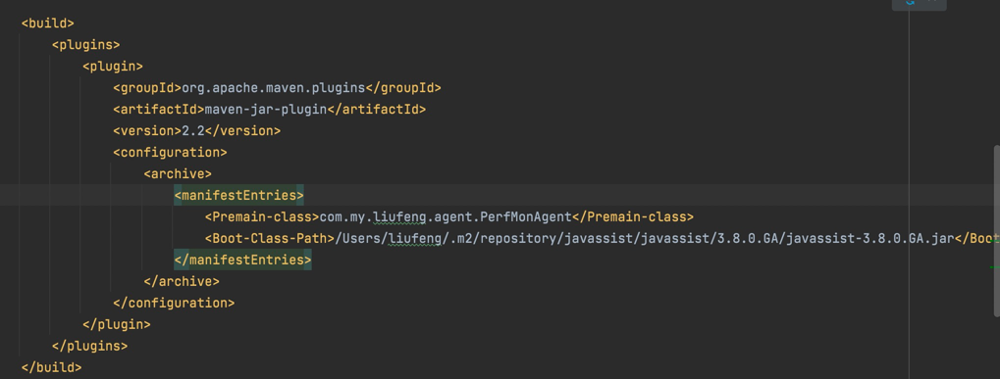

### 利用java.lang.instrument 打包agent实现aop

1. 步骤
    1. 编写PerfMonXformer
    2. 编写PerfMonAgent
    3. 打包
       1. 在META-INF/MANIFEST.MF加入Premain-class：xx，这里xx是com.my.liufeng.agent.PerfMonAgent
       2. 如果引用了其他包，本实例中是JBoss.javassist，需加入Boot-Class-Path:xx,xx示例：/Users/liufeng/.m2/repository/javassist/javassist/3.8.0.GA/javassist-3.8.0.GA.jar
       3. 
    4. 测试
       1. 启动jar包 java -javaagent:agent包路径 -jar 包路径
       2. 启动main方法，首先使用javac将java编译为class文件，执行class，增加参数