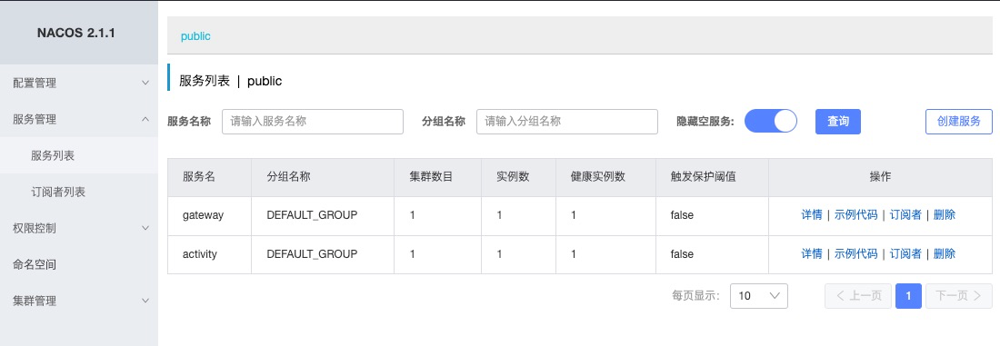

### cloud （Spring Cloud Alibaba项目搭建）
1. 搭建父工程，仅pom.xml，主要用于版本管理
2. 搭建gateway模块
   1. 配置路由（Bean或yml）
3. 搭建consumer模块（可以有很多个，按照不同功能划分）
   1. 新增测试接口/activity/health/time
4. 测试接口，返回数据正常
5. docker安装nacos单机版
   1. 下载最新镜像 docker pull nacos/nacos-server 
   2. 启动容器 docker run --name nacos -d -p 8848:8848 -e MODE=standalone nacos/nacos-server 
   3. 访问localhost:8848/nacos(账号密码默认nacos，可在配置文件开启)
6. gateway注册到注册中心
   1. 添加nacos-discovery依赖
   2. 添加@EnableDiscoveryClient注解
   3. 新增bootstrap.yml，配置注册中心地址
7. 报错
   1. grpc 9848端口找不到
      1. 原因：nacos 2.x新增了grpc通信方式，对应2个端口，在主端口基础上偏移。假设主端口是8848
         1. 9848 1000 客户端gRPC请求服务端端口，用于客户端向服务端发起连接和请求 
         2. 9849 1001 服务端gRPC请求服务端端口，用于服务间同步等
      2. 解决
         1. remove原有容器，以新的命令启动 docker run --name nacos -d -p 8848:8848 -p9848:9848 -e MODE=standalone nacos/nacos-server
   2. 未配置spring.application.name，在application.yml新增即可
8. consumer注册到注册中心，依赖、配置同gateway
9. 刷新nacos，服务列表如图
   1. 为什么分组名称没有生效？（Nacos 2.1.1）
      1. 原因：spring cloud在2020.0.2将bootstrap.yml配置禁掉了
      2. 解决方案：将配置移动到application.yml
10. 修改gateway动态路由，使用服务名访问，接口正常
11. 新增auth模块，准备接入认证授权
    1. 选择Spring web
    2. 选择Spring Security
    3. 中止～
12. 启动服务，发现nacos展示3个服务
13. gateway整合nacos作为配置中心
    1. 新增NacosRouterConfig 配置对象
    2. 新增DynamicRouteServiceImplByNacos和DynamicRouteServiceImpl
    3. 启动，
       1. 问题1：报错No spring.config.import property has been defined
          1. 原因：spring cloud在2020.0.2将bootstrap.yml配置禁掉了
          2. 解决办法：增加bootstrap依赖
       2. 问题2：yml路由配置失效，spring bean路由路由配置正常
          1. 原因：使用ip+域名可以成功，使用服务名失败。因为springcloud默认使用loadbalancer，需导入依赖
          2. 解决办法：添加loadbalancer依赖
    4. 接口请求成功，动态路由成功
    5. 添加注释
14. 新增DynamicConfig类，发现nacos配置无法刷新
    1. 原因：不清楚，已经加了@RefreshScope注解
       1. 尝试1