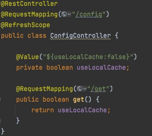

### cloud （Spring Cloud Alibaba项目搭建）
1. 搭建父工程，仅pom.xml，主要用于版本管理
2. 搭建gateway模块
   1. 配置路由（Bean或yml）
3. 搭建consumer模块（可以有很多个，按照不同功能划分）
   1. 新增测试接口/activity/health/time
4. 测试接口，返回数据正常
5. docker安装nacos单机版
   1. 下载最新镜像 docker pull nacos/nacos-server 
   2. 启动容器 docker run --name nacos -d -p 8848:8848 -e MODE=standalone nacos/nacos-server 
   3. 访问localhost:8848/nacos(账号密码默认nacos，可在配置文件开启)
6. gateway注册到注册中心
   1. 添加nacos-discovery依赖
   2. 添加@EnableDiscoveryClient注解
   3. 新增bootstrap.yml，配置注册中心地址
7. 报错
   1. grpc 9848端口找不到
      1. 原因：nacos 2.x新增了grpc通信方式，对应2个端口，在主端口基础上偏移。假设主端口是8848
         1. 9848 1000 客户端gRPC请求服务端端口，用于客户端向服务端发起连接和请求 
         2. 9849 1001 服务端gRPC请求服务端端口，用于服务间同步等
      2. 解决
         1. remove原有容器，以新的命令启动 docker run --name nacos -d -p 8848:8848 -p9848:9848 -e MODE=standalone nacos/nacos-server
   2. 未配置spring.application.name，在application.yml新增即可
8. consumer注册到注册中心，依赖、配置同gateway
9. 刷新nacos，服务列表如图
   1. 为什么分组名称没有生效？（Nacos 2.1.1）
      1. 原因：spring cloud在2020.0.2将bootstrap.yml配置禁掉了
      2. 解决方案：将配置移动到application.yml
10. 修改gateway动态路由，使用服务名访问，接口正常
11. 新增auth模块，准备接入认证授权
    1. 选择Spring web
    2. 选择Spring Security
    3. 中止～
12. 启动服务，发现nacos展示3个服务
13. gateway整合nacos作为配置中心
    1. 新增NacosRouterConfig 配置对象
    2. 新增DynamicRouteServiceImplByNacos和DynamicRouteServiceImpl
    3. 启动，
       1. 问题1：报错No spring.config.import property has been defined
          1. 原因：spring cloud在2020.0.2将bootstrap.yml配置禁掉了
          2. 解决办法：增加bootstrap依赖
       2. 问题2：yml路由配置失效，spring bean路由路由配置正常
          1. 原因：使用ip+域名可以成功，使用服务名失败。因为springcloud默认使用loadbalancer，需导入依赖
          2. 解决办法：添加loadbalancer依赖
    4. 接口请求成功，动态路由成功
    5. 添加注释
14. gateway新增DynamicConfig类，发现nacos配置无法刷新
    1. debug，发现加载配置的data-id是null，在bootstrap.yml加上配置spring.cloud.nacos.config.name=gaetway
    2. 原因：不清楚，已经加了@RefreshScope注解
       1. String userName = applicationContext.getEnvironment().getProperty("spring.datasource.username"); 能够获取刷新配置
       2. @Value()或@Configuration配置@RefreshScope，配置无法刷新
       3. 猜测：会不会是动态路由添加的configService影响
          1. 注释掉动态路由相关代码，无效
       4. 尝试在activity添加配置，使用官方demo，配置刷新成功。什么配置也没有改，为什么会发生呢？
       5. 修改代码，将配置类改成@RestController修饰，依然不成功。代码如图
       6. 修改官方demo代码，注入指定配置项，调用接口，接口返回配置项已更新。代码如图
       7. 终于发现问题，打印方法有问题，不应该直接打印，而是在其他类调用getter()方法。这涉及到java重排序问题，jvm会对代码进行优化。死循环打印的内容是第一次赋值的值，而不会取最新的值（在本类调用getter()方法也是）
       8. 将@PostConstruct()移动到其他类，发现打印值随配置更新
       9. 再尝试@ConfigurationProperties+@RefreshScore或者@Value+@RefreshScore组合，都没有问题
       10. 困顿了5H的问题终于得到解决
       11. 遗留问题，当DynamicConfigTest内包含@PostConstruct()方法时，没有被调用setter方法设置属性；去掉即可，原因不明
           1. 成功日志
           2. 失败日志
       12. 突然发现不对，在GatewayApplication和DynamicConfigTest同时添加@PostConstruct()方法，刷新成功。怀疑是@RefreshScope作用，当没有外部调用时，旧的DynamicConfigTest已经被回收，新的DynamicConfigTest并未生成
       13. 使用Nacos配置刷新，果然，DynamicConfigTest多个线程同时打印日志
       14. 日志增加对象打印
           1. 首次启动
              1. DynamicConfigTest:com.my.liufeng.gateway.config.DynamicConfigTest$$EnhancerBySpringCGLIB$$83824c6c@56fa7644
              2. GatewayApplication：com.my.liufeng.gateway.config.DynamicConfigTest$$EnhancerBySpringCGLIB$$83824c6c@56fa7644
              3. DynamicConfigTest.print():com.my.liufeng.gateway.config.DynamicConfigTest$1@19ddf84d
           2. 刷新配置第一次
              1. DynamicConfigTest:com.my.liufeng.gateway.config.DynamicConfigTest$$EnhancerBySpringCGLIB$$83824c6c@782588f6
              2. GatewayApplication：com.my.liufeng.gateway.config.DynamicConfigTest$$EnhancerBySpringCGLIB$$83824c6c@782588f6
              3. DynamicConfigTest.print():com.my.liufeng.gateway.config.DynamicConfigTest$1@3c96a06f
       15. 搜索@RefreshScope工作原理
           1. @RefreshScope解析时生成被ProxyBeanDefinition，而不再使用默认的BeanDefinition，beanClass=ScopedProxyFactoryBean
           2. 不会新创建对象，而是在原来的对象做增强
           3. 待补充，没看明白...
       16. 总之，是测试代码问题，实际上配置刷新已经成功了
