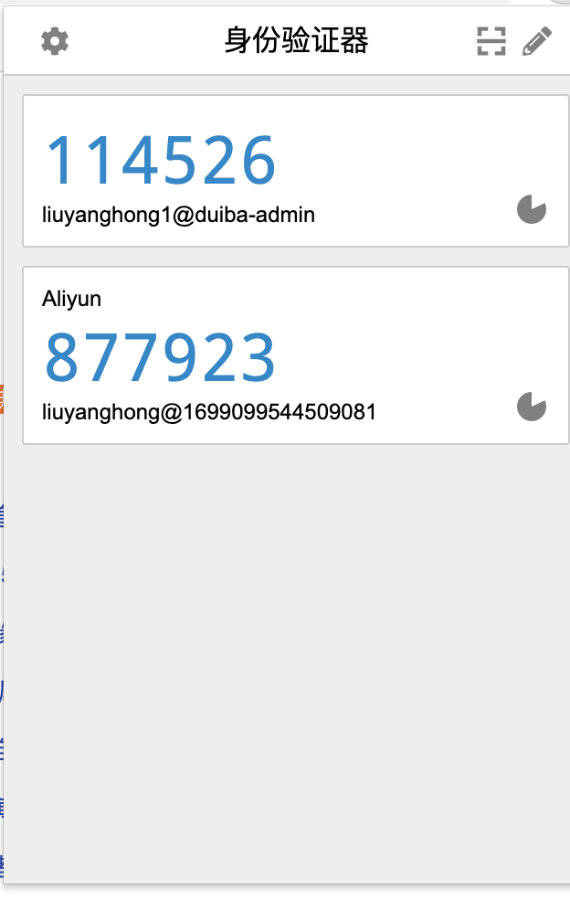

### tool项目

#### 2021-09-30

感觉很多代码偶尔会使用到，之前又没有保存的习惯。每次使用到都去网上搜索，而博客内容参差不齐，浪费掉不少时间。索性自己建立项目作为记录。 
代码来源于网页，自己会做一些整理。大部分代码使用了额外的引用，因此类头部会标明使用了那些引用，使用该工具类只需要添加对应的引用即可。

### 包说明
- google本包下是google相关的工具类

#### 类说明
- google.GoogleAuthenticator 谷歌验证器 
